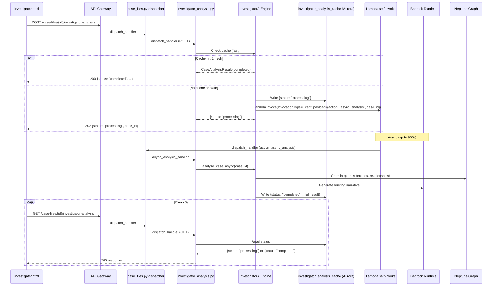
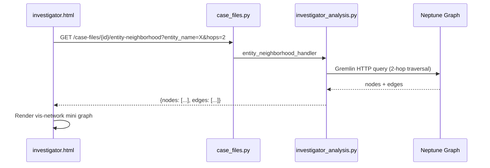

# Design Document — AI Briefing Experience

## Overview

This feature fixes the API Gateway 29-second timeout on `POST /case-files/{id}/investigator-analysis` and layers a 3-level progressive disclosure UI on top of the existing flat briefing. The backend change decomposes the synchronous `analyze_case()` call into a fast 202-returning trigger + async Lambda self-invoke that does the heavy Bedrock/Neptune work. The frontend change replaces the flat `renderBriefing()` output with an interactive executive summary → finding detail → supporting documents drill path.

All changes EXTEND existing files per the lessons-learned.md critical rule. No new Lambdas, no new API Gateway routes outside the existing `{proxy+}` catch-all, no npm build steps.

### Key Design Decisions

1. **Lambda self-invoke (InvocationType=Event)** for async work instead of Step Functions — the Lambda VPC endpoint already exists (lessons-learned Issue 9), the CaseFiles Lambda already has 900s timeout, and adding a Step Functions state machine would add CDK complexity for a single-function workflow.

2. **Entity neighborhood endpoint added to case_files.py dispatcher** — just a new path match routing to `investigator_analysis.py`, not a new Lambda. This follows the consolidation pattern from lessons-learned Issue 1.

3. **vis-network CDN** for the mini knowledge graph — already loaded in investigator.html's `<head>` (`vis-network@9.1.6`). No build step needed.

4. **Neptune HTTP Gremlin API** for all graph queries — matches the existing pattern in `pattern_discovery_service.py` (`_gremlin_query()` using `urllib.request`).

5. **Polling at 3-second intervals** for async status — the GET endpoint reads only from `investigator_analysis_cache` (Aurora), so it's fast and cheap.

## Architecture



### Entity Neighborhood Flow



## Components and Interfaces

### Backend Changes (EXTEND only)

#### 1. `src/lambdas/api/investigator_analysis.py` — New/Modified Handlers

| Handler | Method | Path | Change |
|---------|--------|------|--------|
| `trigger_analysis` | POST | `/case-files/{id}/investigator-analysis` | **Modify**: Return 202 immediately, write "processing" to cache, self-invoke Lambda async |
| `get_analysis` | GET | `/case-files/{id}/investigator-analysis` | **Modify**: Read-only from cache, return status/result, never trigger work |
| `async_analysis_handler` | (internal) | N/A — invoked via Lambda Event | **New**: Entry point for async self-invoke, calls `analyze_case()`, writes result to cache |
| `entity_neighborhood_handler` | GET | `/case-files/{id}/entity-neighborhood` | **New**: Query Neptune for N-hop entity neighborhood |

#### 2. `src/lambdas/api/case_files.py` — Dispatcher Extension

Add a new path match for `/entity-neighborhood`:

```python
# In dispatch_handler, before the existing investigator-analysis block:
if any(seg in path for seg in ("/investigator-analysis", "/investigative-leads", "/evidence-triage",
                                "/ai-hypotheses", "/subpoena-recommendations", "/session-briefing",
                                "/entity-neighborhood")):
    from lambdas.api.investigator_analysis import dispatch_handler as inv_dispatch
    return inv_dispatch(event, context)
```

Also add a new block for async worker invocations:

```python
# In dispatch_handler, near the existing batch_loader async block:
if event.get("action") == "async_analysis":
    from lambdas.api.investigator_analysis import async_analysis_handler
    return async_analysis_handler(event, context)
```

#### 3. `src/services/investigator_ai_engine.py` — Async Support

Add a method `trigger_async_analysis(case_id)` that:
1. Checks cache freshness (same logic as existing `get_cached_analysis`)
2. If stale/missing, writes `{status: "processing"}` to `investigator_analysis_cache`
3. Calls `boto3.client('lambda').invoke(FunctionName=self_arn, InvocationType='Event', Payload=...)` 
4. Returns `CaseAnalysisResult(case_id=case_id, status="processing")`

Add a method `get_entity_neighborhood(case_id, entity_name, hops=2)` that:
1. Queries Neptune via HTTP Gremlin for the entity vertex and N-hop neighbors
2. Returns `{nodes: [{name, type, degree}], edges: [{source, target, relationship}]}`

### Frontend Changes (investigator.html only)

#### Modified Functions

| Function | Change |
|----------|--------|
| `loadAIBriefing()` | Add polling loop: POST triggers analysis, then poll GET every 3s until completed/error |
| `renderBriefing()` | Replace flat output with Level 1 executive summary + clickable Finding cards with Confirm/Dismiss toggles |

#### New Functions

| Function | Purpose |
|----------|---------|
| `renderFindingCards(leads)` | Render clickable lead cards with score badges, decision state, and Confirm/Dismiss buttons |
| `expandFindingDetail(lead)` | Level 2: Show AI justification, confidence breakdown bars, fetch & render entity neighborhood graph |
| `loadEntityNeighborhood(caseId, entityName)` | Fetch entity neighborhood API, render vis-network mini graph |
| `loadSupportingDocuments(caseId, entityName)` | Level 3: Call search API with entity name, render document cards with excerpts |
| `confirmFinding(decisionId, cardEl)` | POST to `/decisions/{id}/confirm`, update card badge |
| `dismissFinding(decisionId, cardEl)` | POST to `/decisions/{id}/override`, update card badge |
| `pollAnalysisStatus(caseId, el)` | Poll GET endpoint every 3s, render progress indicator, stop on completed/error |

## Data Models

### Entity Neighborhood Response (New)

```json
{
  "entity_name": "John Doe",
  "case_id": "abc-123",
  "hops": 2,
  "nodes": [
    {"name": "John Doe", "type": "person", "degree": 15},
    {"name": "Acme Corp", "type": "organization", "degree": 8}
  ],
  "edges": [
    {"source": "John Doe", "target": "Acme Corp", "relationship": "employed_by"}
  ]
}
```

### Analysis Cache Status Values (Extended)

The existing `investigator_analysis_cache` table's `status` column now uses three values:

| Status | Meaning |
|--------|---------|
| `completed` | Full analysis result available in `analysis_result` column |
| `processing` | Async analysis in progress — frontend should poll |
| `error` | Analysis failed — `analysis_result` contains `{"error_message": "..."}` |

No schema migration needed — the `status` column is already `TEXT` and the `analysis_result` column is already `JSONB`.

### Async Lambda Invocation Payload

```json
{
  "action": "async_analysis",
  "case_id": "abc-123"
}
```

This payload is routed by `case_files.py` dispatcher (same pattern as `action: "process_batch"` for the batch loader).

### Decision Workflow Integration

The existing `InvestigativeLead` model already has `decision_id` and `decision_state` fields. The frontend Confirm/Dismiss toggle calls the existing endpoints:

- **Confirm**: `POST /decisions/{decision_id}/confirm` with `{"attorney_id": "investigator"}`
- **Dismiss**: `POST /decisions/{decision_id}/override` with `{"attorney_id": "investigator", "override_rationale": "Dismissed by investigator from briefing"}`

No new models or endpoints needed for the decision workflow — it's purely a frontend integration with existing APIs.


## Correctness Properties

*A property is a characteristic or behavior that should hold true across all valid executions of a system — essentially, a formal statement about what the system should do. Properties serve as the bridge between human-readable specifications and machine-verifiable correctness guarantees.*

### Property 1: Async trigger returns 202 with correct shape

*For any* valid case_id where no fresh cached analysis exists, calling `trigger_analysis` SHALL return HTTP 202 with a JSON body containing `{"status": "processing", "case_id": "<the-case-id>"}` and no Bedrock invocations or Neptune queries shall have been made during the request.

**Validates: Requirements 1.1**

### Property 2: Async trigger initiates Lambda self-invoke

*For any* valid case_id where no fresh cached analysis exists, calling `trigger_analysis` SHALL invoke the Lambda client with `InvocationType='Event'` and a payload containing `{"action": "async_analysis", "case_id": "<the-case-id>"}`.

**Validates: Requirements 1.2**

### Property 3: Cache hit returns 200 without triggering new work

*For any* case_id that has a completed analysis in the cache where the current document count equals the `evidence_count_at_analysis`, calling `get_analysis` (GET) SHALL return HTTP 200 with the cached `CaseAnalysisResult` and SHALL NOT invoke Lambda, Bedrock, or Neptune.

**Validates: Requirements 1.3, 7.1**

### Property 4: Async failure writes error status to cache

*For any* case_id where the async `analyze_case` raises an exception, the `async_analysis_handler` SHALL write `status='error'` and a non-empty `error_message` string to the `investigator_analysis_cache` table for that case_id.

**Validates: Requirements 1.4**

### Property 5: Entity neighborhood response correctness

*For any* case_id, entity_name, and hops value (1–3), the entity neighborhood endpoint SHALL return a response where: (a) every node object contains `name` (string), `type` (string), and `degree` (integer ≥ 0), (b) every edge object contains `source` (string), `target` (string), and `relationship` (string), and (c) all returned nodes are reachable from the queried entity within the specified hop count.

**Validates: Requirements 6.1, 6.2**

### Property 6: Lead priority score is bounded and deterministic

*For any* combination of `doc_count` (≥0), `total_docs` (≥1), `degree_centrality` (0–1), `previously_flagged_ratio` (0–1), and `prosecution_readiness` (0–1), `compute_lead_priority_score` SHALL return an integer in [0, 100], and calling it twice with the same inputs SHALL return the same value.

**Validates: Requirements 2.2** (score badge correctness depends on score computation)

## Error Handling

### Backend Errors

| Scenario | Handler | Response |
|----------|---------|----------|
| POST trigger with missing case_id | `trigger_analysis` | 400 VALIDATION_ERROR |
| POST trigger — Lambda self-invoke fails | `trigger_analysis` | Write `status=error` to cache, return 202 (fire-and-forget) |
| Async analysis — Bedrock timeout | `async_analysis_handler` | Write `status=error` + error_message to cache |
| Async analysis — Neptune unreachable | `async_analysis_handler` | Write `status=error` + error_message to cache |
| GET analysis — no cache entry | `get_analysis` | 404 NOT_FOUND |
| GET entity-neighborhood — entity not in graph | `entity_neighborhood_handler` | 200 with `{nodes: [], edges: []}` |
| GET entity-neighborhood — Neptune timeout | `entity_neighborhood_handler` | 504 with timeout message |
| GET entity-neighborhood — hops > 3 | `entity_neighborhood_handler` | 400 VALIDATION_ERROR "hops must be 1–3" |
| Confirm/Dismiss — decision already transitioned | Decision_Service | 409 CONFLICT (existing behavior) |

### Frontend Error Handling

| Scenario | Behavior |
|----------|----------|
| POST returns 202 | Show progress spinner, start 3s polling |
| Poll returns `status: "processing"` | Continue polling, update elapsed time display |
| Poll returns `status: "error"` | Show error message + "Retry Analysis" button |
| Poll returns `status: "completed"` | Stop polling, render Level 1 briefing |
| Entity neighborhood fetch fails | Show "Unable to load graph" message in graph container |
| Search API returns 0 results | Show "No supporting documents found" message |
| Confirm/Dismiss returns 409 | Refresh finding card state, show toast "Decision already updated" |
| Network error during polling | Show retry button, stop polling |

## Testing Strategy

### Unit Tests

Unit tests cover specific examples and edge cases:

- `test_trigger_analysis_returns_202_when_no_cache`: POST with valid case_id, no cache → 202 response
- `test_trigger_analysis_returns_200_when_cache_fresh`: POST with valid case_id, fresh cache → 200 with cached data
- `test_get_analysis_returns_404_when_no_cache`: GET with case_id not in cache → 404
- `test_get_analysis_returns_completed_from_cache`: GET with completed cache → 200 with full result
- `test_get_analysis_returns_processing_status`: GET while async in progress → 200 with `{status: "processing"}`
- `test_get_analysis_returns_error_status`: GET after async failure → 200 with `{status: "error", error_message: "..."}`
- `test_async_handler_writes_completed_on_success`: Async handler completes → cache has `status=completed`
- `test_async_handler_writes_error_on_failure`: Async handler raises → cache has `status=error`
- `test_entity_neighborhood_empty_graph`: Entity not in Neptune → 200 with empty arrays
- `test_entity_neighborhood_validates_hops`: hops=0 or hops=4 → 400 error
- `test_entity_neighborhood_default_hops`: No hops param → defaults to 2
- `test_dispatcher_routes_entity_neighborhood`: case_files.py routes `/entity-neighborhood` to investigator_analysis
- `test_dispatcher_routes_async_analysis_action`: case_files.py routes `action=async_analysis` to async handler

### Property-Based Tests

Property-based tests use `hypothesis` (Python) with minimum 100 iterations per property. Each test is tagged with its design property reference.

- **Feature: ai-briefing-experience, Property 1: Async trigger returns 202 with correct shape** — Generate random UUIDs as case_ids, mock Aurora (no cache), mock Lambda client. Verify trigger_analysis always returns 202 with correct JSON shape.

- **Feature: ai-briefing-experience, Property 2: Async trigger initiates Lambda self-invoke** — Generate random UUIDs as case_ids, mock Aurora (no cache), capture Lambda.invoke calls. Verify InvocationType=Event and payload contains action+case_id.

- **Feature: ai-briefing-experience, Property 3: Cache hit returns 200 without triggering new work** — Generate random CaseAnalysisResult objects, seed them into mock cache with matching evidence counts. Verify GET returns 200 with the seeded data and no Lambda/Bedrock/Neptune calls.

- **Feature: ai-briefing-experience, Property 4: Async failure writes error status to cache** — Generate random case_ids, mock analyze_case to raise random exceptions. Verify cache row has status=error and non-empty error_message.

- **Feature: ai-briefing-experience, Property 5: Entity neighborhood response correctness** — Generate random graph structures (nodes with types, edges with relationships), mock Neptune HTTP responses. Verify response shape (name/type/degree on nodes, source/target/relationship on edges) and hop-count constraint.

- **Feature: ai-briefing-experience, Property 6: Lead priority score is bounded and deterministic** — Generate random floats for all score components. Verify output is always in [0, 100] and is idempotent (same inputs → same output).
