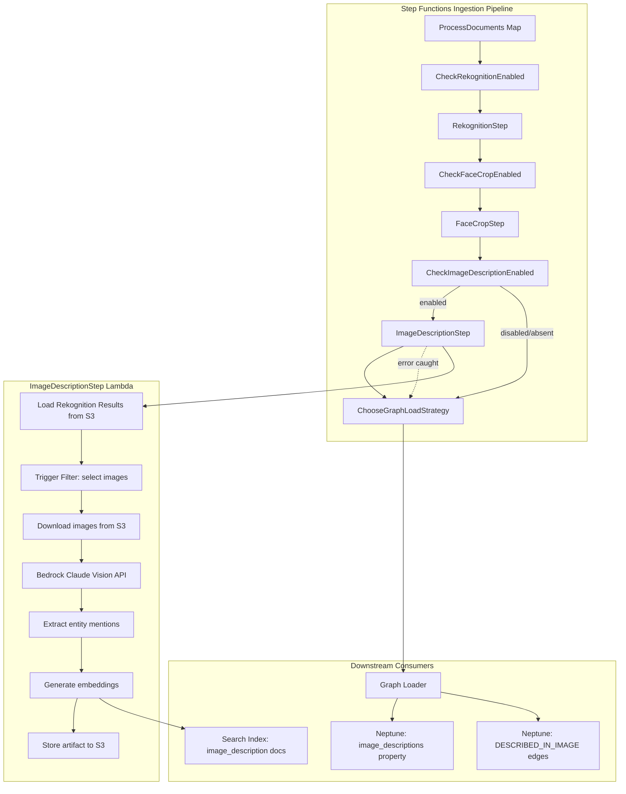
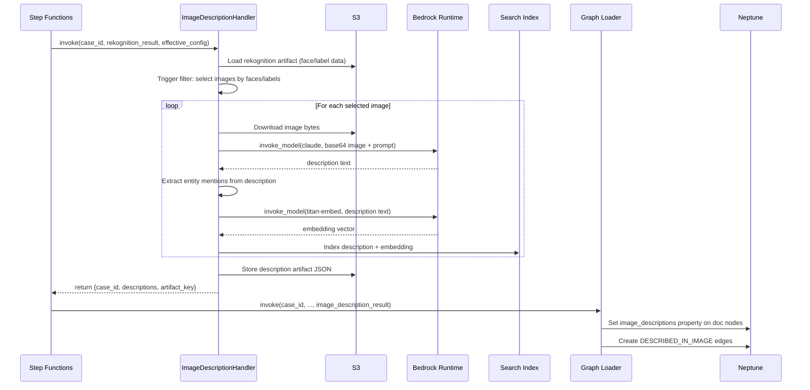

# Design Document: AI Image Description

## Overview

This feature adds a Bedrock Claude vision-based image description step to the ingestion pipeline. It sits after the Rekognition/FaceCrop steps and before graph loading, reusing the same extracted images. The Image Description Handler Lambda downloads images from S3, sends them to Claude's multimodal API with an investigative-focused prompt, and returns natural language descriptions. These descriptions are stored as S3 artifacts, indexed in the search backend for full-text/semantic search, linked to Neptune document nodes, and surfaced in the investigator drill-down panel.

The feature follows the existing pipeline extension patterns: a new `image_description` section in `effective_config`, a `CheckImageDescriptionEnabled` Choice state in the Step Functions ASL (using `IsPresent` + `BooleanEquals` per Lesson Learned #24), and a non-fatal Catch that allows the pipeline to continue if description fails.

A tiered trigger filter controls cost by only describing images where Rekognition found faces or investigative labels, with a `describe_all_images` override. Batch inference support is included for large cases.

## Architecture

### High-Level Architecture



### Low-Level Data Flow



## Components and Interfaces

### 1. Image Description Handler Lambda (`src/lambdas/ingestion/image_description_handler.py`)

New Lambda following the same pattern as `rekognition_handler.py`.

**Input (from Step Functions):**
```python
{
    "case_id": str,
    "rekognition_result": {
        "case_id": str,
        "status": str,
        "entities": list,
        "media_processed": int,
        "artifact_key": str,  # S3 key to full rekognition results
    },
    "effective_config": {
        "image_description": {
            "enabled": bool,           # default: false
            "model_id": str,           # default: "anthropic.claude-3-haiku-20240307-v1:0"
            "describe_all_images": bool, # default: false
            "max_images_per_run": int,  # default: 50
            "max_tokens_per_image": int, # default: 1024
            "min_rekognition_confidence": float, # default: 0.7
            "custom_prompt": str | None, # default: None (use built-in)
            "use_batch_inference": bool, # default: false
        }
    }
}
```

**Output:**
```python
{
    "case_id": str,
    "status": "completed" | "skipped" | "batch_submitted",
    "descriptions": [
        {
            "image_s3_key": str,
            "source_document_id": str,
            "description": str,
            "rekognition_context": {
                "face_count": int,
                "labels": list[str],
            },
            "mentioned_entities": list[str],
            "input_tokens": int,
            "output_tokens": int,
            "duration_ms": int,
        }
    ],
    "images_evaluated": int,
    "images_described": int,
    "images_skipped": int,
    "artifact_key": str,
    "batch_job_id": str | None,  # only for batch mode
}
```

**Key Functions:**

| Function | Purpose |
|----------|---------|
| `handler(event, context)` | Entry point. Loads config, runs trigger filter, describes images, stores artifact. |
| `_load_rekognition_results(s3_bucket, case_id, artifact_key)` | Loads full Rekognition results JSON from S3 artifact. |
| `_build_image_rekognition_map(results)` | Maps each image S3 key → `{face_count, labels}` from Rekognition results. |
| `_apply_trigger_filter(image_map, config)` | Selects images for description based on faces, labels, or `describe_all_images`. Returns sorted list (faces first, then label count). |
| `_describe_image(s3_bucket, image_key, rek_context, config)` | Downloads image, calls Bedrock Claude vision API, returns description dict. |
| `_build_investigative_prompt(rek_context, custom_prompt)` | Constructs the system+user prompt with Rekognition context. |
| `_extract_mentioned_entities(description, case_entities)` | Case-insensitive substring match of description against known entity names. |
| `_generate_description_embedding(description_text, model_id)` | Calls Bedrock Titan embed for the description text. |
| `_index_description(case_id, doc_id, image_key, description, embedding, labels)` | Indexes description in search backend. |
| `_store_description_artifact(s3_bucket, case_id, descriptions, summary)` | Stores JSON artifact to S3. |
| `_prepare_batch_input(selected_images, config)` | Prepares JSONL for Bedrock Batch Inference API. |
| `_submit_batch_job(s3_bucket, case_id, jsonl_key)` | Submits batch inference job, returns job ID. |

### 2. Image Description Service (`src/services/image_description_service.py`)

Encapsulates the core description logic, separated from Lambda handler concerns for testability.

**Key Methods:**

| Method | Purpose |
|--------|---------|
| `apply_trigger_filter(image_rek_map, config) → list[dict]` | Pure function: filters and prioritizes images. Returns list of `{s3_key, face_count, labels, reason}`. |
| `build_investigative_prompt(rek_context, custom_prompt) → str` | Pure function: constructs the prompt string. |
| `extract_mentioned_entities(description, entity_names) → list[str]` | Pure function: finds entity name mentions in description text. |
| `build_description_artifact(descriptions, summary) → dict` | Pure function: structures the artifact JSON. |
| `parse_bedrock_response(response_body) → str` | Extracts description text from Claude response format. |

### 3. Config Validation Extension (`src/services/config_validation_service.py`)

Extend the existing `ConfigValidationService` with `image_description` section validation.

**New valid section:** `"image_description"` added to `_VALID_SECTIONS`.

**New keys:**
```python
_IMAGE_DESCRIPTION_KEYS = {
    "enabled", "model_id", "describe_all_images", "max_images_per_run",
    "max_tokens_per_image", "min_rekognition_confidence", "custom_prompt",
    "use_batch_inference",
}
```

**Validation rules:**
- `model_id`: must be a non-empty string matching `anthropic.claude-3-*` pattern
- `max_images_per_run`: positive integer, 1–500
- `max_tokens_per_image`: integer, 256–4096
- `min_rekognition_confidence`: float, 0.0–1.0

### 4. Graph Loader Extension (`src/lambdas/ingestion/graph_load_handler.py`)

Extend the existing `handler()` to accept `image_description_result` from the event and:
- Set `image_descriptions` property on document nodes (concatenated descriptions per document)
- Create `DESCRIBED_IN_IMAGE` edges from matched entity nodes to document nodes

### 5. Step Functions ASL Update (`infra/step_functions/ingestion_pipeline.json`)

Add three new states after the FaceCrop path:

```json
"CheckImageDescriptionEnabled": {
    "Type": "Choice",
    "Choices": [{
        "And": [
            {"Variable": "$.effective_config.image_description", "IsPresent": true},
            {"Variable": "$.effective_config.image_description.enabled", "BooleanEquals": true}
        ],
        "Next": "ImageDescriptionStep"
    }],
    "Default": "ChooseGraphLoadStrategy"
}
```

### 6. API Extension (`src/lambdas/api/case_files.py`)

Extend the existing `document_images_handler` to include `description` field in the response by loading descriptions from the S3 artifact or Neptune document node property.

### 7. Frontend Extension (`src/frontend/investigator.html`)

Extend the drill-down panel's image rendering to show "AI Scene Description" collapsible block below each image thumbnail when a description is available.

## Data Models

### Image Description Config (in `effective_config`)
```json
{
    "image_description": {
        "enabled": false,
        "model_id": "anthropic.claude-3-haiku-20240307-v1:0",
        "describe_all_images": false,
        "max_images_per_run": 50,
        "max_tokens_per_image": 1024,
        "min_rekognition_confidence": 0.7,
        "custom_prompt": null,
        "use_batch_inference": false
    }
}
```

### Description Artifact (S3: `cases/{case_id}/image-description-artifacts/{run_id}_descriptions.json`)
```json
{
    "case_id": "uuid",
    "run_id": "hex12",
    "model_id": "anthropic.claude-3-haiku-20240307-v1:0",
    "descriptions": [
        {
            "image_s3_key": "cases/{case_id}/extracted-images/doc1_page1_img0.jpg",
            "source_document_id": "doc1",
            "description": "The image shows two individuals seated at a table...",
            "rekognition_context": {
                "face_count": 2,
                "labels": ["Person", "Table", "Document"]
            },
            "mentioned_entities": ["John Doe", "Acme Corp"],
            "model_id": "anthropic.claude-3-haiku-20240307-v1:0",
            "input_tokens": 1200,
            "output_tokens": 350,
            "duration_ms": 2400
        }
    ],
    "summary": {
        "images_evaluated": 45,
        "images_described": 12,
        "images_skipped": 33,
        "total_input_tokens": 14400,
        "total_output_tokens": 4200,
        "estimated_cost_usd": 0.0048,
        "total_duration_ms": 28800
    }
}
```

### Search Index Document (for image descriptions)
```json
{
    "document_id": "doc1",
    "case_file_id": "uuid",
    "image_s3_key": "cases/{case_id}/extracted-images/doc1_page1_img0.jpg",
    "text": "The image shows two individuals seated at a table...",
    "source_type": "image_description",
    "rekognition_labels": ["Person", "Table", "Document"],
    "embedding": [0.012, -0.034, ...]
}
```

### Neptune Graph Extensions

**Document node property:**
```
image_descriptions: "Description 1 text...\n\nDescription 2 text..."
```

**New edge type:**
```
(Entity_<case_id>) --[DESCRIBED_IN_IMAGE {image_s3_key, confidence}]--> (Entity_<case_id> document node)
```

### Bedrock Claude Vision Request Format
```json
{
    "anthropic_version": "bedrock-2023-05-31",
    "max_tokens": 1024,
    "messages": [{
        "role": "user",
        "content": [
            {
                "type": "image",
                "source": {
                    "type": "base64",
                    "media_type": "image/jpeg",
                    "data": "<base64-encoded-image>"
                }
            },
            {
                "type": "text",
                "text": "<investigative prompt with rekognition context>"
            }
        ]
    }],
    "system": "<system prompt for investigative analysis>"
}
```


## Correctness Properties

*A property is a characteristic or behavior that should hold true across all valid executions of a system — essentially, a formal statement about what the system should do. Properties serve as the bridge between human-readable specifications and machine-verifiable correctness guarantees.*

### Property 1: Trigger filter selects images with faces or investigative labels

*For any* image-to-Rekognition-result mapping and any config with `min_rekognition_confidence` threshold, the trigger filter should select an image if and only if it has `face_count >= 1` OR at least one investigative label with confidence above the threshold (when `describe_all_images` is false).

**Validates: Requirements 2.1, 2.2**

### Property 2: Trigger filter describe_all override selects all images

*For any* set of images and any config where `describe_all_images` is true, the trigger filter should select every image in the set regardless of Rekognition detections.

**Validates: Requirements 2.3**

### Property 3: Trigger filter respects max_images_per_run with priority ordering

*For any* set of images and any config with `max_images_per_run = N`, the trigger filter output should contain at most N images, and the selected images should be ordered by face count descending, then investigative label count descending (i.e., the most detection-rich images are prioritized).

**Validates: Requirements 2.4**

### Property 4: Description output contains all required fields

*For any* description produced by the handler, the output dict should contain non-null values for: `image_s3_key`, `source_document_id`, `description` (non-empty string), `rekognition_context` (with `face_count` and `labels`), `input_tokens`, `output_tokens`, and `duration_ms`.

**Validates: Requirements 1.4, 5.2, 8.2**

### Property 5: Individual image failures do not fail the handler

*For any* set of N images where K images fail Bedrock invocation (0 ≤ K ≤ N), the handler should return descriptions for exactly N - K images and the handler status should be "completed" (not an error), with the failed images logged but not present in the output descriptions list.

**Validates: Requirements 1.5**

### Property 6: Model ID defaults correctly from config

*For any* effective config, if `image_description.model_id` is present and non-empty, that value should be used for Bedrock calls. If `model_id` is absent or empty, the default `anthropic.claude-3-haiku-20240307-v1:0` should be used.

**Validates: Requirements 1.6**

### Property 7: Config validation catches invalid image_description parameters

*For any* config JSON with an `image_description` section, the `ConfigValidationService` should return validation errors when: `max_images_per_run` is not a positive integer (1–500), `max_tokens_per_image` is outside 256–4096, `min_rekognition_confidence` is outside 0.0–1.0, or `model_id` does not match the `anthropic.claude-3-*` pattern. Valid configs should produce zero validation errors for the `image_description` section.

**Validates: Requirements 3.4**

### Property 8: Disabled or absent config means step is skipped

*For any* effective config where `image_description.enabled` is false, or the `image_description` section is absent entirely, the handler should return status "skipped" without making any Bedrock API calls or S3 writes.

**Validates: Requirements 3.2, 3.3**

### Property 9: Investigative prompt contains all required sections and context

*For any* Rekognition context (face count and label list), the built investigative prompt should contain: (a) instructions for describing people, (b) instructions for describing setting/location, (c) instructions for objects of investigative interest, (d) instructions for activities, (e) instructions for investigative observations, (f) instruction to report only observable facts, (g) instruction to note apparent minors, and (h) the provided Rekognition face count and labels.

**Validates: Requirements 10.1, 10.2, 10.3, 10.5**

### Property 10: Custom prompt overrides default prompt

*For any* config with a non-null `custom_prompt` string, the prompt sent to Claude should use the custom prompt text instead of the default investigative prompt. When `custom_prompt` is null or absent, the default investigative prompt should be used.

**Validates: Requirements 10.4**

### Property 11: Entity mention extraction is case-insensitive substring match

*For any* description text and any set of known entity names, `extract_mentioned_entities` should return exactly those entity names that appear as case-insensitive substrings in the description text. An entity name "John Doe" should match "john doe was seen" and "JOHN DOE appeared", but "JohnDoe" should not match "John Doe" (space matters).

**Validates: Requirements 6.3**

### Property 12: Multiple descriptions per document are concatenated

*For any* set of descriptions where multiple descriptions share the same `source_document_id`, the graph loader should produce a single `image_descriptions` property value that is the concatenation of all descriptions for that document, separated by newlines, and the concatenated string should contain every individual description as a substring.

**Validates: Requirements 6.4**

### Property 13: Artifact summary totals are consistent with descriptions array

*For any* description artifact, `summary.images_described` should equal the length of the `descriptions` array, `summary.total_input_tokens` should equal the sum of all `input_tokens` in the descriptions, `summary.total_output_tokens` should equal the sum of all `output_tokens`, and `summary.images_evaluated` should equal `images_described + images_skipped`.

**Validates: Requirements 8.3**

### Property 14: Artifact S3 key follows the required path pattern

*For any* case_id and run_id, the artifact S3 key should match the pattern `cases/{case_id}/image-description-artifacts/{run_id}_descriptions.json`.

**Validates: Requirements 8.1**

### Property 15: Each description is indexed with embedding in search backend

*For any* description produced by the handler, a corresponding search index document should be created with fields `case_file_id`, `document_id`, `image_s3_key`, `text` (the description), `source_type` set to `"image_description"`, `rekognition_labels`, and a non-empty `embedding` vector.

**Validates: Requirements 5.1, 5.4**

## Error Handling

### Lambda-Level Error Handling

| Error Scenario | Handling Strategy |
|---|---|
| Bedrock `invoke_model` timeout for single image | Log warning with image S3 key, skip image, continue processing remaining images. Do not fail the handler. |
| Bedrock throttling (429) | Retry with exponential backoff (built into boto3 adaptive retry config). After max retries, skip image and continue. |
| Bedrock content filter rejection | Log the image S3 key and filter reason. Skip image, continue. Include in artifact as `"status": "content_filtered"`. |
| S3 download failure for image | Log error, skip image, continue. |
| Image too large for Claude (>20MB base64) | Skip image with warning log. Claude's limit is ~20MB for base64 images. |
| Embedding generation failure | Log error, store description without embedding. Description still goes to artifact and Neptune but not search index. |
| Search index write failure | Log error, continue. Description still goes to artifact and Neptune. |
| All images fail | Return `status: "completed"` with empty descriptions list and artifact noting 0 described. |

### Pipeline-Level Error Handling

| Error Scenario | Handling Strategy |
|---|---|
| ImageDescriptionStep Lambda timeout (900s) | Step Functions Catch stores error in `$.image_description_error`, pipeline continues to `ChooseGraphLoadStrategy`. |
| ImageDescriptionStep Lambda crash | Retry up to 2 times with exponential backoff. After retries exhausted, Catch routes to graph loading. |
| Batch inference submission failure | Fall back to real-time invocation for up to `max_images_per_run` images. Log warning about batch fallback. |

### Config Error Handling

| Error Scenario | Handling Strategy |
|---|---|
| `image_description` section missing from config | Treat as disabled, skip step. |
| `enabled` field missing | Treat as `false`, skip step. |
| Invalid `model_id` | Config validation catches this before pipeline runs. At runtime, Bedrock returns error → per-image error handling applies. |
| `max_images_per_run` = 0 | Treat as "no images to describe", return skipped status. |

## Testing Strategy

### Property-Based Testing

Use `hypothesis` (Python property-based testing library) for all correctness properties. Each test runs minimum 100 iterations with randomized inputs.

**Test file:** `tests/unit/test_image_description_properties.py`

Each property test must be tagged with a comment referencing the design property:
```python
# Feature: ai-image-description, Property 1: Trigger filter selects images with faces or investigative labels
```

**Property tests to implement:**

1. **Trigger filter selection** (Properties 1, 2, 3): Generate random image-rekognition maps with varying face counts, label lists, and confidence values. Verify filter output matches selection criteria, describe_all override, and max limit with priority ordering.

2. **Description output completeness** (Property 4): Generate random description dicts and verify all required fields are present and non-null.

3. **Error resilience** (Property 5): Generate random sets of images with random failure patterns. Verify handler returns correct count of successful descriptions.

4. **Config model_id default** (Property 6): Generate random configs with and without model_id. Verify correct model selection.

5. **Config validation** (Property 7): Generate random image_description config sections with valid and invalid values. Verify validator catches all invalid fields and accepts all valid ones.

6. **Disabled config skip** (Property 8): Generate random configs where enabled is false or section is absent. Verify handler returns "skipped".

7. **Prompt completeness** (Property 9): Generate random Rekognition contexts. Verify built prompt contains all required sections.

8. **Custom prompt override** (Property 10): Generate random custom prompts and verify they replace the default.

9. **Entity mention extraction** (Property 11): Generate random description texts and entity name sets. Verify case-insensitive substring matching.

10. **Description concatenation** (Property 12): Generate random description sets with shared document IDs. Verify concatenation correctness.

11. **Artifact summary consistency** (Property 13): Generate random description lists. Verify summary totals match.

12. **Artifact S3 key format** (Property 14): Generate random case_id and run_id values. Verify key pattern.

13. **Search index document completeness** (Property 15): Generate random descriptions. Verify indexed document has all required fields.

### Unit Tests

**Test file:** `tests/unit/test_image_description_service.py`

Unit tests cover specific examples, edge cases, and integration points:

- Empty image list → handler returns skipped with 0 descriptions
- Single image with no Rekognition data → skipped by trigger filter (unless describe_all)
- Image with 5 faces and 3 labels → selected, priority score correct
- Bedrock response parsing: valid Claude response → extracted description text
- Bedrock response parsing: empty content block → empty string
- Entity extraction: description mentions "John Doe" and entities include "john doe" → matched
- Entity extraction: description mentions "John" but entity is "John Doe" → not matched (substring of entity in description, not entity in description as substring)
- Config validation: all valid params → no errors
- Config validation: max_tokens_per_image = 100 → error (below 256)
- Config validation: min_rekognition_confidence = 1.5 → error (above 1.0)
- Artifact summary: 3 descriptions with known token counts → summary totals correct
- Batch JSONL format: 5 images → valid JSONL with 5 lines

### Integration Tests

- End-to-end: mock S3 + Bedrock, run handler with 3 images (2 with faces, 1 without) → 2 descriptions returned
- Graph loader: verify `image_descriptions` property set on Neptune document node
- Search: verify description indexed and retrievable via semantic search
- Pipeline: verify CheckImageDescriptionEnabled routes correctly for enabled/disabled configs
