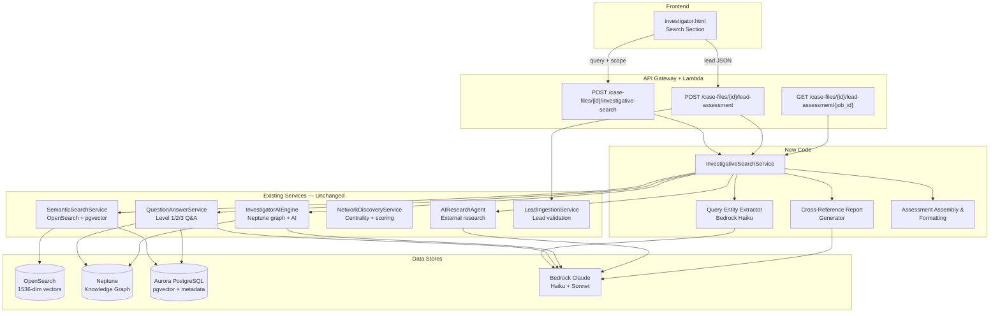

# Design Document: AI Investigative Search

## Overview

AI Investigative Search adds an orchestration layer (`InvestigativeSearchService`) on top of six existing backend services to transform raw document-chunk search into intelligence-grade investigative search. When an investigator submits a natural language query, the new service fans out to OpenSearch (via `SemanticSearchService`), Neptune (via `InvestigatorAIEngine.get_entity_neighborhood`), and Aurora (via `QuestionAnswerService` context gathering), then synthesizes results through Bedrock Claude into a structured Investigative Assessment (Intelligence Brief). The feature also supports lead intake deep-dive via `LeadIngestionService` + the new orchestrator, and optional external research cross-referencing via `AIResearchAgent`.

The design principle is **extend, never replace**: all six existing services remain unchanged. The new `InvestigativeSearchService` is a pure orchestration layer that calls into them and adds entity extraction from queries, cross-reference report generation, and structured assessment formatting.

### Key Design Decisions

1. **Thin orchestrator pattern**: `InvestigativeSearchService` contains no search/graph/AI logic of its own — it delegates to existing services and focuses on coordination, entity extraction from queries, and assessment assembly.
2. **Bedrock entity extraction from queries**: A lightweight Bedrock Haiku call extracts entity names from natural language queries before graph lookup, rather than regex/NLP — consistent with the codebase's existing Bedrock-first approach.
3. **API Gateway 29s timeout handling**: The investigative search endpoint returns synchronously for most queries (Haiku synthesis < 10s). For lead assessments with >5 subjects, an async pattern returns 202 + job ID.
4. **Claude Haiku for speed, Sonnet for quality**: Entity extraction and brief-mode synthesis use Haiku. Full Intelligence Brief synthesis uses Sonnet for Level 3 quality.
5. **Neptune sampling for high-degree nodes**: Reuses `InvestigatorAIEngine.get_entity_neighborhood`'s existing `bothE().limit(200)` pattern to avoid timeout on nodes like Epstein (3691+ edges).

## Architecture



### Request Flow — Investigative Search

1. Frontend sends `POST /case-files/{id}/investigative-search` with `{query, search_scope, top_k, output_format}`
2. Lambda handler validates input, constructs `InvestigativeSearchService`
3. **Entity Extraction**: Bedrock Haiku extracts entity names from the natural language query
4. **Parallel Fan-Out**:
   - `SemanticSearchService.search()` → OpenSearch document chunks
   - `InvestigatorAIEngine.get_entity_neighborhood()` → Neptune graph for each extracted entity
   - `QuestionAnswerService._get_document_context()` → Aurora pgvector context (reused internally)
5. **Synthesis**: Combined context passed to Bedrock Sonnet (full) or Haiku (brief) for Intelligence Brief generation
6. **Optional External Research**: If `search_scope == "internal_external"`, `AIResearchAgent.research_all_subjects()` runs for key entities, then `CrossReferenceReportGenerator` compares internal vs external findings
7. **Assembly**: `InvestigativeAssessment` structured response returned

### Request Flow — Lead Assessment

1. Frontend/external system sends `POST /case-files/{id}/lead-assessment` with Lead JSON
2. Lambda validates via `LeadIngestionService.validate_lead_json()`
3. If >20 subjects → 400 error. If >5 subjects → async (202 + job_id)
4. For each subject: run investigative search with `search_scope="internal_external"` (includes OSINT directives)
5. Cross-reference connections between subjects found in internal evidence
6. Assemble consolidated `InvestigativeAssessment` with `case_viability` rating
7. Return result (or store for async polling)

## Components and Interfaces

### New Components

#### 1. InvestigativeSearchService (`src/services/investigative_search_service.py`)

The orchestration layer. No search/graph/AI logic — pure coordination.

```python
class InvestigativeSearchService:
    """Orchestrates investigative search across existing services."""

    def __init__(
        self,
        semantic_search: SemanticSearchService,
        question_answer: QuestionAnswerService,
        ai_engine: InvestigatorAIEngine,
        research_agent: AIResearchAgent,
        bedrock_client: Any,
        neptune_endpoint: str = "",
        neptune_port: str = "8182",
    ) -> None: ...

    def investigative_search(
        self,
        case_id: str,
        query: str,
        search_scope: str = "internal",
        top_k: int = 10,
        output_format: str = "full",
    ) -> dict:
        """Execute an investigative search and return an InvestigativeAssessment."""
        ...

    def lead_assessment(
        self,
        case_id: str,
        lead_payload: dict,
    ) -> dict:
        """Run deep-dive assessment for a lead across all subjects."""
        ...

    def get_lead_assessment_result(
        self,
        case_id: str,
        job_id: str,
    ) -> Optional[dict]:
        """Poll for async lead assessment result."""
        ...

    def _extract_entities_from_query(self, query: str) -> list[dict]:
        """Use Bedrock Haiku to extract entity names/types from natural language query."""
        ...

    def _search_documents(
        self, case_id: str, query: str, top_k: int
    ) -> list[dict]:
        """Delegate to SemanticSearchService.search()."""
        ...

    def _get_graph_context(
        self, case_id: str, entities: list[dict], hops: int = 2
    ) -> dict:
        """Delegate to InvestigatorAIEngine.get_entity_neighborhood() for each entity."""
        ...

    def _find_entity_paths(
        self, case_id: str, entity_a: str, entity_b: str, max_hops: int = 3
    ) -> list[dict]:
        """Query Neptune for paths between two entities (up to max_hops)."""
        ...

    def _synthesize_intelligence_brief(
        self,
        query: str,
        search_results: list[dict],
        graph_context: dict,
        output_format: str,
    ) -> dict:
        """Call Bedrock Sonnet/Haiku to generate the Intelligence Brief."""
        ...

    def _generate_cross_reference_report(
        self,
        internal_brief: dict,
        external_research: list[dict],
    ) -> list[dict]:
        """Compare internal evidence against external research findings."""
        ...

    def _compute_confidence_level(
        self,
        search_results: list[dict],
        graph_context: dict,
    ) -> str:
        """Compute confidence: strong_case / needs_more_evidence / insufficient."""
        ...

    def _assemble_assessment(
        self,
        query: str,
        search_results: list[dict],
        graph_context: dict,
        intelligence_brief: dict,
        cross_reference: Optional[list[dict]],
        confidence: str,
    ) -> dict:
        """Assemble the final InvestigativeAssessment dict."""
        ...
```

#### 2. Query Entity Extractor (method within InvestigativeSearchService)

Uses Bedrock Haiku to extract entities from natural language queries. Returns structured entity list with names, types, and aliases for Neptune lookup.

```python
# Prompt template for entity extraction
ENTITY_EXTRACTION_PROMPT = """Extract all person, organization, location, and event entity names 
from this investigative query. Return JSON array of objects with "name" and "type" fields.
Handle aliases and partial names. Query: {query}"""
```

#### 3. Cross-Reference Report Generator (method within InvestigativeSearchService)

Compares internal evidence findings against external research results. Categorizes each finding as `confirmed_internally`, `external_only`, or `needs_research`.

#### 4. API Handler (`src/lambdas/api/investigative_search.py`)

```python
def investigative_search_handler(event, context):
    """POST /case-files/{id}/investigative-search"""
    ...

def lead_assessment_handler(event, context):
    """POST /case-files/{id}/lead-assessment"""
    ...

def lead_assessment_status_handler(event, context):
    """GET /case-files/{id}/lead-assessment/{job_id}"""
    ...
```

### Existing Services — Reused Unchanged

| Service | What We Call | Purpose |
|---------|-------------|---------|
| `SemanticSearchService` | `.search(case_id, query, mode, top_k=top_k)` | OpenSearch semantic/hybrid/keyword search |
| `QuestionAnswerService` | `._get_graph_context()`, `._get_document_context()` | Neptune graph context + Aurora pgvector |
| `InvestigatorAIEngine` | `.get_entity_neighborhood(case_id, entity, hops)` | Neptune N-hop neighborhood with sampling |
| `AIResearchAgent` | `.research_all_subjects(subjects, osint, hints)` | Bedrock external research generation |
| `LeadIngestionService` | `.validate_lead_json(payload)` | Lead JSON validation |
| `NetworkDiscoveryService` | `.compute_involvement_scores()` | Entity centrality/scoring (for ranking) |

### Frontend Changes

The search section of `investigator.html` is extended (not replaced) with:
- A search scope toggle (Internal Only / Internal + External) above the search bar
- An Intelligence Brief collapsible panel above raw search results
- Structured assessment sections with icons and formatting
- Color-coded confidence badge (green/amber/red)
- Clickable evidence citations linking to source documents

## Data Models

### InvestigativeAssessment (Response Schema)

```python
from pydantic import BaseModel, Field
from typing import Optional
from enum import Enum


class ConfidenceLevel(str, Enum):
    STRONG_CASE = "strong_case"
    NEEDS_MORE_EVIDENCE = "needs_more_evidence"
    INSUFFICIENT = "insufficient"


class CaseViability(str, Enum):
    VIABLE = "viable"
    PROMISING = "promising"
    INSUFFICIENT = "insufficient"


class EvidenceCitation(BaseModel):
    document_id: str
    source_filename: str
    page_number: Optional[int] = None
    chunk_index: Optional[int] = None
    text_excerpt: str
    relevance_score: float


class GraphConnection(BaseModel):
    source_entity: str
    target_entity: str
    relationship_type: str
    properties: dict = Field(default_factory=dict)
    source_documents: list[str] = Field(default_factory=list)


class EvidenceGap(BaseModel):
    area: str
    suggestion: str


class NextStep(BaseModel):
    action: str
    priority: int  # 1=highest
    rationale: str


class CrossReferenceEntry(BaseModel):
    finding: str
    category: str  # confirmed_internally | external_only | needs_research
    internal_evidence: list[str] = Field(default_factory=list)
    external_source: Optional[str] = None


class InvestigativeAssessment(BaseModel):
    query: str
    case_id: str
    search_scope: str
    confidence_level: ConfidenceLevel
    executive_summary: str
    internal_evidence: list[EvidenceCitation]
    graph_connections: list[GraphConnection]
    ai_analysis: str
    evidence_gaps: list[EvidenceGap]
    recommended_next_steps: list[NextStep]
    cross_reference_report: Optional[list[CrossReferenceEntry]] = None
    raw_search_results: list[dict] = Field(default_factory=list)
    entities_extracted: list[dict] = Field(default_factory=list)
    synthesis_error: Optional[str] = None


class LeadAssessmentResponse(BaseModel):
    lead_id: str
    case_id: str
    case_viability: CaseViability
    subjects_assessed: int
    subject_assessments: list[InvestigativeAssessment]
    cross_subject_connections: list[GraphConnection] = Field(default_factory=list)
    consolidated_summary: str
    job_id: Optional[str] = None
    status: str = "complete"  # complete | processing | failed
```

### Request Schemas

```python
class InvestigativeSearchRequest(BaseModel):
    query: str = Field(min_length=1)
    search_scope: str = Field(default="internal", pattern="^(internal|internal_external)$")
    top_k: int = Field(default=10, ge=1, le=50)
    output_format: str = Field(default="full", pattern="^(full|brief)$")


class LeadAssessmentRequest(BaseModel):
    lead_id: str = Field(min_length=1)
    subjects: list[dict] = Field(min_length=1, max_length=20)
    osint_directives: list[str] = Field(default_factory=list)
    evidence_hints: list[dict] = Field(default_factory=list)
```

### Entity Extraction Output

```python
class ExtractedQueryEntity(BaseModel):
    name: str
    type: str  # person | organization | location | event
    aliases: list[str] = Field(default_factory=list)
```


## Correctness Properties

*A property is a characteristic or behavior that should hold true across all valid executions of a system — essentially, a formal statement about what the system should do. Properties serve as the bridge between human-readable specifications and machine-verifiable correctness guarantees.*

### Property 1: Assessment structural completeness

*For any* `InvestigativeAssessment` produced by `investigative_search()` with `output_format="full"`, the response dict SHALL contain all required top-level keys (`internal_evidence`, `graph_connections`, `ai_analysis`, `evidence_gaps`, `recommended_next_steps`, `confidence_level`, `executive_summary`, `raw_search_results`, `entities_extracted`), and each `EvidenceCitation` within `internal_evidence` SHALL contain `document_id`, `source_filename`, `text_excerpt`, and `relevance_score`, and each `EvidenceGap` SHALL contain `area` and `suggestion`, and each `NextStep` SHALL contain `action`, `priority`, and `rationale`.

**Validates: Requirements 1.3, 1.5, 6.1, 6.3, 6.4, 6.5, 8.2, 3.2**

### Property 2: Entity extraction from natural language queries

*For any* natural language query string containing one or more known entity names (person, organization, location), `_extract_entities_from_query()` SHALL return a list of extracted entities where each entity has a `name` and `type` field, and the set of extracted entity names SHALL be a non-empty subset of the entity names present in the query.

**Validates: Requirements 2.3**

### Property 3: Multi-entity path query routing

*For any* query where `_extract_entities_from_query()` returns two or more entities, `investigative_search()` SHALL invoke `_find_entity_paths()` for each pair of extracted entities, and the resulting `graph_connections` in the assessment SHALL contain path information between those entities.

**Validates: Requirements 2.1**

### Property 4: Single-entity neighborhood routing

*For any* query where `_extract_entities_from_query()` returns exactly one entity, `investigative_search()` SHALL invoke `InvestigatorAIEngine.get_entity_neighborhood()` with `hops=2` for that entity, and the resulting `graph_connections` SHALL contain the neighborhood data.

**Validates: Requirements 2.2**

### Property 5: Entity list deduplication and ranking

*For any* merged entity list produced from document-extracted and graph-connected entity sets, the output list SHALL contain no duplicate entity names (case-insensitive), and the list SHALL be sorted in descending order by computed relevance score.

**Validates: Requirements 3.1, 3.3, 3.4**

### Property 6: Internal scope excludes external research

*For any* investigative search with `search_scope="internal"`, the resulting `InvestigativeAssessment` SHALL have `cross_reference_report` equal to `None`, and `AIResearchAgent` SHALL NOT be invoked.

**Validates: Requirements 4.2**

### Property 7: Internal+external scope includes cross-reference report with valid categories

*For any* investigative search with `search_scope="internal_external"`, the resulting `InvestigativeAssessment` SHALL have a non-None `cross_reference_report`, and every entry in that report SHALL have a `category` value that is one of `"confirmed_internally"`, `"external_only"`, or `"needs_research"`.

**Validates: Requirements 4.3, 4.4**

### Property 8: Confidence level computation

*For any* set of search results and graph context, `_compute_confidence_level()` SHALL return `"insufficient"` when fewer than 2 unique document sources mention the query subject, `"strong_case"` when 3 or more documents corroborate AND graph connections confirm relationships, and `"needs_more_evidence"` otherwise.

**Validates: Requirements 6.2**

### Property 9: Brief output format truncation

*For any* investigative search with `output_format="brief"`, the response SHALL contain only `executive_summary`, `confidence_level`, and `internal_evidence`, and `internal_evidence` SHALL contain at most 3 entries.

**Validates: Requirements 8.3**

### Property 10: Lead assessment subject coverage

*For any* valid lead payload with N subjects (1 ≤ N ≤ 20), `lead_assessment()` SHALL return a `LeadAssessmentResponse` where `subjects_assessed == N` and `len(subject_assessments) == N`.

**Validates: Requirements 5.1, 9.2**

### Property 11: Lead OSINT directives and evidence hints forwarding

*For any* lead payload containing non-empty `osint_directives` and/or `evidence_hints`, `lead_assessment()` SHALL pass those directives and hints to `AIResearchAgent.research_all_subjects()` for each subject.

**Validates: Requirements 5.3, 5.4**

### Property 12: Lead validation error structure

*For any* invalid lead payload (missing required fields, invalid types), `lead_assessment()` SHALL return an error response where each validation failure includes a field path and expected format description.

**Validates: Requirements 5.5**

### Property 13: Default parameter application

*For any* investigative search request where `search_scope` is omitted, it SHALL default to `"internal"`. Where `top_k` is omitted, it SHALL default to `10`. Where `output_format` is omitted, it SHALL default to `"full"`.

**Validates: Requirements 4.1, 8.1**

### Property 14: Case viability assignment

*For any* `LeadAssessmentResponse`, the `case_viability` field SHALL be one of `"viable"`, `"promising"`, or `"insufficient"`, and SHALL be `"viable"` only when strong evidence exists across multiple subjects, `"insufficient"` only when no subject has sufficient evidence.

**Validates: Requirements 9.3**

### Property 15: Async threshold for large lead assessments

*For any* lead payload with more than 5 subjects, the lead assessment endpoint SHALL return HTTP 202 with a `job_id` field, and subsequent polling via `get_lead_assessment_result(job_id)` SHALL eventually return the completed assessment.

**Validates: Requirements 9.5**

## Research Findings Persistence & Notebook

### Database Schema — investigation_findings table

```sql
CREATE TABLE IF NOT EXISTS investigation_findings (
    finding_id UUID PRIMARY KEY DEFAULT gen_random_uuid(),
    case_id UUID NOT NULL,
    user_id VARCHAR(255) NOT NULL DEFAULT 'investigator',
    query TEXT,
    finding_type VARCHAR(50) NOT NULL DEFAULT 'search_result',
    title VARCHAR(500),
    summary TEXT,
    full_assessment JSONB,
    source_citations JSONB DEFAULT '[]'::jsonb,
    entity_names JSONB DEFAULT '[]'::jsonb,
    tags JSONB DEFAULT '[]'::jsonb,
    investigator_notes TEXT,
    confidence_level VARCHAR(50),
    is_key_evidence BOOLEAN DEFAULT FALSE,
    needs_follow_up BOOLEAN DEFAULT FALSE,
    s3_artifact_key VARCHAR(1000),
    created_at TIMESTAMP WITH TIME ZONE DEFAULT NOW(),
    updated_at TIMESTAMP WITH TIME ZONE DEFAULT NOW()
);
CREATE INDEX idx_findings_case_id ON investigation_findings(case_id);
CREATE INDEX idx_findings_entity_names ON investigation_findings USING GIN(entity_names);
CREATE INDEX idx_findings_tags ON investigation_findings USING GIN(tags);
```

### New Service: FindingsService (`src/services/findings_service.py`)

```python
class FindingsService:
    """Manages persistence and retrieval of investigation findings."""

    def __init__(self, db_pool: Any, s3_helper: Any) -> None: ...

    def save_finding(
        self,
        case_id: str,
        user_id: str,
        query: str,
        finding_type: str,
        title: str,
        summary: str,
        full_assessment: dict,
        source_citations: Optional[list] = None,
        entity_names: Optional[list] = None,
        tags: Optional[list] = None,
        notes: Optional[str] = None,
        confidence: Optional[str] = None,
    ) -> str:
        """Persist finding to Aurora + archive full assessment JSON to S3. Returns finding_id."""
        ...

    def list_findings(
        self,
        case_id: str,
        tags_filter: Optional[list] = None,
        entity_filter: Optional[list] = None,
        sort_by: str = "created_at",
        limit: int = 50,
    ) -> list[dict]:
        """List findings for a case with optional tag/entity filtering and sorting."""
        ...

    def update_finding(
        self,
        finding_id: str,
        notes: Optional[str] = None,
        tags: Optional[list] = None,
        is_key_evidence: Optional[bool] = None,
        needs_follow_up: Optional[bool] = None,
    ) -> dict:
        """Update notes, tags, or status flags on a finding."""
        ...

    def delete_finding(self, finding_id: str) -> bool:
        """Delete a finding from Aurora and its S3 artifact."""
        ...

    def get_findings_for_entities(
        self, case_id: str, entity_names: list[str]
    ) -> list[dict]:
        """Retrieve findings matching entity names for enriching future searches."""
        ...
```

### Findings API Handler (`src/lambdas/api/findings.py`)

```python
def save_finding_handler(event, context):
    """POST /case-files/{id}/findings"""
    ...

def list_findings_handler(event, context):
    """GET /case-files/{id}/findings"""
    ...

def update_finding_handler(event, context):
    """PUT /case-files/{id}/findings/{finding_id}"""
    ...

def delete_finding_handler(event, context):
    """DELETE /case-files/{id}/findings/{finding_id}"""
    ...
```

### Findings Data Models

```python
class FindingType(str, Enum):
    SEARCH_RESULT = "search_result"
    ENTITY_LIST = "entity_list"
    LEAD_ASSESSMENT = "lead_assessment"
    MANUAL_NOTE = "manual_note"


class SaveFindingRequest(BaseModel):
    query: Optional[str] = None
    finding_type: str = Field(default="search_result", pattern="^(search_result|entity_list|lead_assessment|manual_note)$")
    title: str = Field(min_length=1, max_length=500)
    summary: Optional[str] = None
    full_assessment: Optional[dict] = None
    source_citations: list[dict] = Field(default_factory=list)
    entity_names: list[str] = Field(default_factory=list)
    tags: list[str] = Field(default_factory=list)
    investigator_notes: Optional[str] = None
    confidence_level: Optional[str] = None


class UpdateFindingRequest(BaseModel):
    investigator_notes: Optional[str] = None
    tags: Optional[list[str]] = None
    is_key_evidence: Optional[bool] = None
    needs_follow_up: Optional[bool] = None


class FindingResponse(BaseModel):
    finding_id: str
    case_id: str
    user_id: str
    query: Optional[str] = None
    finding_type: str
    title: str
    summary: Optional[str] = None
    source_citations: list[dict] = Field(default_factory=list)
    entity_names: list[str] = Field(default_factory=list)
    tags: list[str] = Field(default_factory=list)
    investigator_notes: Optional[str] = None
    confidence_level: Optional[str] = None
    is_key_evidence: bool = False
    needs_follow_up: bool = False
    created_at: str
    updated_at: str
```

### Frontend: Research Notebook Panel

The search section of `investigator.html` is extended with:

- **"Save Finding" button** on every Intelligence Brief card — triggers `POST /case-files/{id}/findings` with the assessment data, user-provided title, and optional tags
- **"Research Notebook" collapsible panel** below the search results section:
  - Lists all saved findings for the current case as cards (title, summary snippet, tags, date, confidence badge)
  - Sort controls: by date (default), confidence level, tags
  - Each card has inline "Edit Notes" textarea, tag add/remove chips, and toggle buttons for "Key Evidence" / "Needs Follow-up"
  - Delete button with confirmation dialog
- **Prior findings enrichment**: When `InvestigativeSearchService.investigative_search()` runs, it calls `FindingsService.get_findings_for_entities()` to retrieve previously saved findings for the same entities and includes them in the Bedrock synthesis context

### Integration with InvestigativeSearchService

The `InvestigativeSearchService` constructor gains an optional `findings_service: Optional[FindingsService] = None` parameter. When present and `search_scope` includes entity names that match saved findings, those findings are appended to the Bedrock synthesis context under a "Prior Research" section.

## Correctness Properties for Requirement 10

### Property 16: Finding persistence round-trip

*For any* valid `SaveFindingRequest`, `save_finding()` SHALL return a non-empty `finding_id`, and a subsequent `list_findings(case_id)` SHALL include a finding with that `finding_id` containing the same `title`, `finding_type`, `tags`, and `entity_names` as the original request.

**Validates: Requirements 10.1, 10.2**

### Property 17: S3 archival on save

*For any* finding saved via `save_finding()`, the system SHALL store the full assessment JSON in S3 at the path `cases/{case_id}/findings/{finding_id}.json`, and the `s3_artifact_key` column SHALL contain that path.

**Validates: Requirements 10.3**

### Property 18: Notebook listing completeness and sorting

*For any* case with N saved findings (N ≥ 0), `list_findings(case_id)` SHALL return exactly N findings, and when `sort_by="created_at"` the results SHALL be in descending chronological order.

**Validates: Requirements 10.4**

### Property 19: Finding update preserves immutable fields

*For any* `update_finding()` call that modifies `tags`, `investigator_notes`, `is_key_evidence`, or `needs_follow_up`, the finding's `finding_id`, `case_id`, `user_id`, `query`, `finding_type`, `title`, `summary`, `full_assessment`, `source_citations`, `entity_names`, and `created_at` SHALL remain unchanged, and `updated_at` SHALL be greater than or equal to the previous value.

**Validates: Requirements 10.5**

### Property 20: Prior findings enrichment in search context

*For any* investigative search where extracted entities match entity names in saved findings for the same case, the Bedrock synthesis context SHALL include those prior findings, and the resulting assessment SHALL reference them.

**Validates: Requirements 10.6**

### Property 21: Findings CRUD API completeness

*For any* finding created via `POST /case-files/{id}/findings`, the finding SHALL be retrievable via `GET /case-files/{id}/findings`, updatable via `PUT /case-files/{id}/findings/{finding_id}`, and deletable via `DELETE /case-files/{id}/findings/{finding_id}`, and after deletion it SHALL no longer appear in `GET` results.

**Validates: Requirements 10.7**

## Error Handling

### Graceful Degradation Strategy

The `InvestigativeSearchService` follows the same graceful degradation pattern established by `QuestionAnswerService`:

| Failure | Behavior |
|---------|----------|
| **OpenSearch unavailable** | Return graph-only assessment with `synthesis_error` noting missing document evidence |
| **Neptune unavailable** | Return document-only assessment with empty `graph_connections` |
| **Bedrock synthesis timeout** | Return raw search results + graph connections without AI synthesis; set `synthesis_error` field |
| **Bedrock entity extraction fails** | Fall back to simple keyword tokenization for entity names |
| **AIResearchAgent fails** | Return internal-only assessment; note external research failure per subject |
| **All backends fail** | Return 503 with structured error explaining which services are unavailable |

### Input Validation Errors

| Condition | HTTP Status | Error Code |
|-----------|-------------|------------|
| Missing/empty `query` | 400 | `VALIDATION_ERROR` |
| Invalid `search_scope` value | 400 | `VALIDATION_ERROR` |
| Invalid `output_format` value | 400 | `VALIDATION_ERROR` |
| Case file ID not found | 404 | `NOT_FOUND` |
| Lead JSON validation failure | 400 | `VALIDATION_ERROR` (with field-level details) |
| Lead with >20 subjects | 400 | `SUBJECT_LIMIT_EXCEEDED` |
| `top_k` out of range (1-50) | 400 | `VALIDATION_ERROR` |
| Finding not found | 404 | `NOT_FOUND` |
| Missing finding title | 400 | `VALIDATION_ERROR` |
| Invalid finding_type value | 400 | `VALIDATION_ERROR` |

### Async Job Errors

| Condition | Behavior |
|-----------|----------|
| Job ID not found | 404 with `JOB_NOT_FOUND` |
| Job still processing | 200 with `status: "processing"` |
| Job failed | 200 with `status: "failed"` and error details |

### Timeout Management

- **Entity extraction**: 5s timeout (Haiku is fast)
- **OpenSearch search**: 10s timeout (via SemanticSearchService)
- **Neptune graph queries**: 25s timeout (via InvestigatorAIEngine, already configured)
- **Bedrock synthesis (Haiku/brief)**: 15s timeout
- **Bedrock synthesis (Sonnet/full)**: 30s timeout
- **AIResearchAgent per subject**: 120s timeout (already configured)
- **Total synchronous budget**: ~29s (API Gateway limit) — if approaching timeout, return partial results with `synthesis_error`

## Testing Strategy

### Property-Based Testing

Property-based tests use `hypothesis` (Python) with minimum 100 iterations per property. Each test references its design document property.

**Library**: `hypothesis` (already available in the Python ecosystem)

**Configuration**: Each property test runs with `@settings(max_examples=100)` minimum.

**Tag format**: `# Feature: ai-investigative-search, Property {N}: {title}`

Properties to implement as PBT:
- **Property 1** (structural completeness): Generate random search results + graph context, run `_assemble_assessment()`, verify all required keys/fields present
- **Property 2** (entity extraction): Generate random query strings with embedded entity names, verify extraction returns those entities
- **Property 5** (dedup + ranking): Generate random entity lists with duplicates, verify merged output has unique names and descending score order
- **Property 6** (internal scope): Generate random queries with scope="internal", verify no cross-reference report and no AIResearchAgent call
- **Property 7** (internal_external scope): Generate random queries with scope="internal_external", verify cross-reference report present with valid categories
- **Property 8** (confidence computation): Generate random (doc_count, graph_connection_count) tuples, verify confidence level matches the rules
- **Property 9** (brief format): Generate random assessments, apply brief truncation, verify only allowed fields and ≤3 citations
- **Property 10** (subject coverage): Generate random lead payloads with 1-20 subjects, verify subject_assessments count matches
- **Property 12** (validation errors): Generate random invalid lead payloads, verify error response contains field-level details
- **Property 13** (defaults): Generate random partial request bodies, verify defaults applied correctly
- **Property 14** (case viability): Generate random subject assessment results, verify viability assignment follows rules

### Unit Testing

Unit tests cover specific examples, edge cases, and integration points:

- **Edge cases from prework**: Zero search results (1.4), Bedrock synthesis failure (1.6), no Neptune entity matches (2.4), AIResearchAgent failure (4.5), case file not found (8.5), empty query (8.6), >20 subjects (9.4)
- **Integration points**: Lambda handler routing, request/response serialization, service construction with dependency injection
- **Specific examples**: Known query "what was the relationship between Branson and Epstein" → verify two entities extracted; known lead JSON → verify validation passes; confidence level boundary cases (exactly 2 docs, exactly 3 docs)

### Test File Structure

```
tests/unit/test_investigative_search_service.py    # Property + unit tests for orchestrator
tests/unit/test_investigative_search_handler.py     # Handler routing, validation, error codes
tests/unit/test_assessment_models.py                # Pydantic model validation
tests/unit/test_findings_service.py                 # Property + unit tests for findings persistence
tests/unit/test_findings_handler.py                 # Findings API handler routing, validation
```
