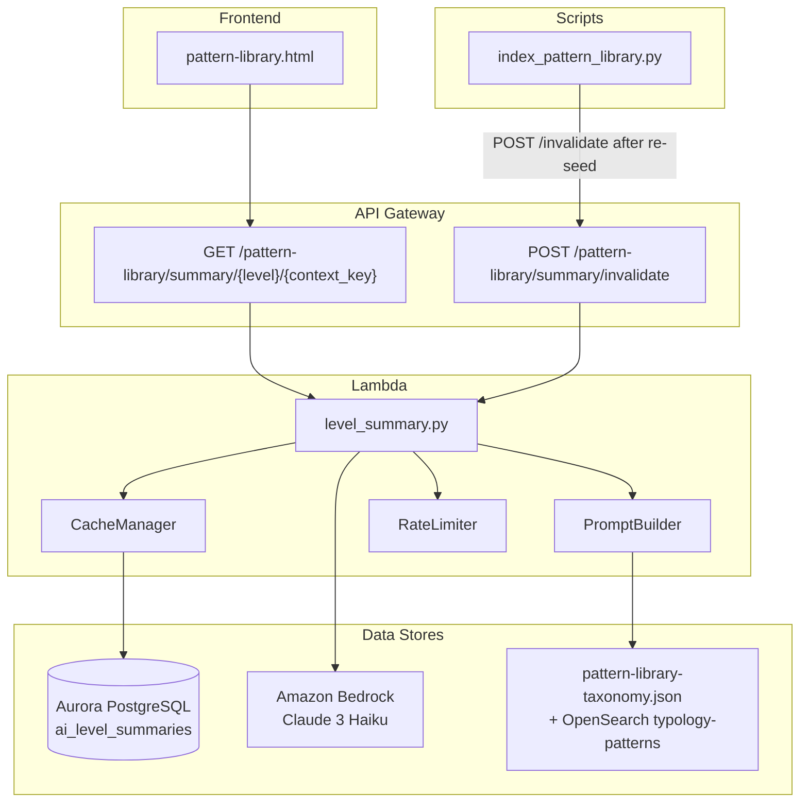
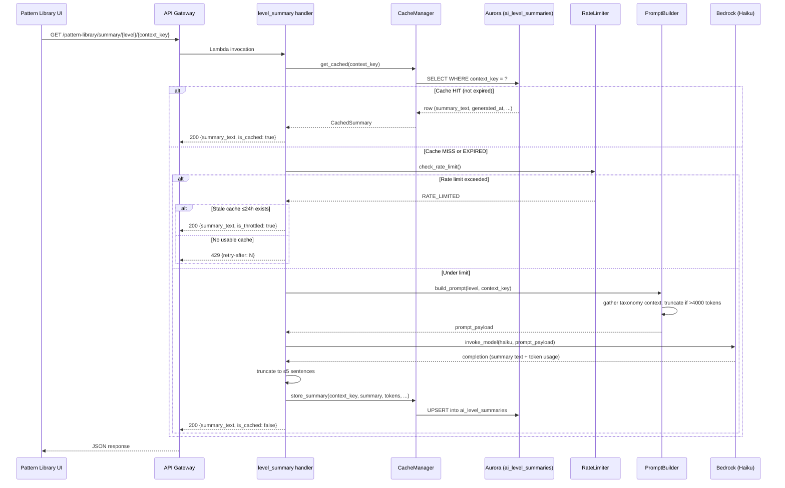

# Design Document: AI Level Summaries

## Overview

This feature adds AI-generated insight panels at each of the Pattern Library's five drill-down levels (Domain → Typology → Method → Signature → Precedent Case). When an analyst navigates to any taxonomy node, the system fetches a contextual summary from a new Lambda handler that either serves a cached result from Aurora PostgreSQL or generates one via Amazon Bedrock (Claude 3 Haiku). The design prioritises low-latency cached reads, bounded Bedrock cost via hourly rate limits, and freshness through path-based cache invalidation.

### Key Design Decisions

| Decision | Rationale |
|----------|-----------|
| Single Lambda handler for summary API | Matches existing project pattern (one handler file per feature in `src/lambdas/api/`) |
| Aurora PostgreSQL cache table (not ElastiCache) | Reuses existing RDS Proxy + `ConnectionManager`; summaries are durable and queryable for cost auditing |
| Clock-hour rate counter in module-level dict | Lambda container reuse provides natural "sticky" counter; worst-case resets on cold start (safe — under-counts, never over-invokes) |
| Prompt token estimation via `len(text.split()) * 1.3` | Avoids adding tiktoken dependency; conservative enough for truncation logic |
| Invalidation via `expires_at` column update (not DELETE) | Allows stale-while-revalidate serving with `is_stale` flag |

---

## Architecture



### Request Flow (GET summary)



---

## Components and Interfaces

### 1. `src/lambdas/api/level_summary.py` — Lambda Handler

**Exports:**
- `get_summary_handler(event, context)` — GET endpoint handler
- `invalidate_handler(event, context)` — POST invalidation endpoint handler

**Dependencies:** `CacheManager`, `PromptBuilder`, `RateLimiter`, `response_helper`, `boto3`

### 2. `src/services/summary_cache_manager.py` — CacheManager

```python
class SummaryCacheManager:
    def __init__(self, connection_manager: ConnectionManager, ttl_seconds: int = 604800):
        ...

    def get_cached(self, context_key: str) -> Optional[CachedSummary]:
        """Return cached summary if exists and not expired. Also returns stale entries with is_stale flag."""
        ...

    def store_summary(self, context_key: str, level: str, summary_text: str,
                      model_id: str, prompt_tokens: int, completion_tokens: int) -> None:
        """UPSERT summary into cache with expires_at = now + TTL."""
        ...

    def invalidate_by_path(self, context_key: str) -> int:
        """Set expires_at = now() for all entries whose context_key starts with the given prefix. Returns count."""
        ...

    def invalidate_all(self) -> int:
        """Set expires_at = now() for all entries. Returns count."""
        ...
```

### 3. `src/services/summary_prompt_builder.py` — PromptBuilder

```python
class SummaryPromptBuilder:
    SYSTEM_PROMPT = "You are an investigative intelligence analyst..."
    MAX_CONTEXT_TOKENS = 4000
    SEVERITY_ORDER = ["low", "medium", "high", "critical"]

    def build_prompt(self, level: str, context_key: str, taxonomy_data: dict) -> dict:
        """Build Bedrock messages payload for the given level.
        Returns: {"system": str, "messages": [...], "max_tokens": 300}
        """
        ...

    def _gather_context(self, level: str, context_key: str, taxonomy_data: dict) -> str:
        """Extract level-specific context (current level + one below)."""
        ...

    def _estimate_tokens(self, text: str) -> int:
        """Approximate token count: len(text.split()) * 1.3"""
        ...

    def _truncate_context(self, context: str, signatures: list, cases: list) -> str:
        """Truncate by removing low-severity signatures first, then oldest cases."""
        ...
```

### 4. `src/services/summary_rate_limiter.py` — RateLimiter

```python
class SummaryRateLimiter:
    MAX_INVOCATIONS_PER_HOUR = 60

    def __init__(self):
        self._counter: int = 0
        self._window_start: datetime = self._current_hour_start()

    def check_and_increment(self) -> tuple[bool, int]:
        """Check if under limit. If yes, increment and return (True, remaining).
        If no, return (False, seconds_until_next_hour)."""
        ...

    def _current_hour_start(self) -> datetime:
        """Return the start of the current clock-hour (minute :00)."""
        ...
```

### 5. Frontend — AI Insight Panel (in `pattern-library.html`)

New DOM section injected at the top of each drill-down view:

```html
<div class="ai-insight-panel" id="aiInsightPanel">
    <div class="ai-insight-header">
        <span class="ai-label">🤖 AI Insight</span>
        <span class="ai-status" id="aiStatus">—</span>
        <button class="ai-refresh-btn" id="aiRefreshBtn" title="Regenerate">↻</button>
    </div>
    <div class="ai-insight-body" id="aiInsightBody">
        <!-- Loading skeleton or summary text -->
    </div>
</div>
```

**JavaScript additions:**
- `fetchSummary(level, contextKey, bypassCache)` — calls GET endpoint, manages skeleton/error states
- `renderInsightPanel(response)` — renders text with 500-char truncation and expand toggle
- Refresh button handler with disable/re-enable logic

---

## Data Models

### Aurora Table: `ai_level_summaries`

```sql
CREATE TABLE ai_level_summaries (
    id UUID PRIMARY KEY DEFAULT gen_random_uuid(),
    context_key VARCHAR(512) NOT NULL UNIQUE,
    taxonomy_level VARCHAR(20) NOT NULL
        CHECK (taxonomy_level IN ('domain', 'typology', 'method', 'signature', 'precedent_case')),
    summary_text TEXT NOT NULL,
    model_id VARCHAR(128) NOT NULL DEFAULT 'anthropic.claude-3-haiku-20240307-v1:0',
    prompt_token_count INT NOT NULL DEFAULT 0,
    completion_token_count INT NOT NULL DEFAULT 0,
    generated_at TIMESTAMP WITH TIME ZONE NOT NULL DEFAULT NOW(),
    expires_at TIMESTAMP WITH TIME ZONE NOT NULL,
    created_at TIMESTAMP WITH TIME ZONE DEFAULT NOW()
);

CREATE INDEX idx_summaries_context_key ON ai_level_summaries(context_key);
CREATE INDEX idx_summaries_expires_at ON ai_level_summaries(expires_at);
CREATE INDEX idx_summaries_level ON ai_level_summaries(taxonomy_level);
```

### API Response Models

**Success Response (200):**
```json
{
    "summary_text": "string (max 5000 chars)",
    "generated_at": "2025-01-15T10:30:00Z",
    "is_cached": true,
    "is_stale": false,
    "is_throttled": false,
    "taxonomy_level": "method",
    "requestId": "uuid"
}
```

**Error Responses:**
- 400: `{"error": {"code": "INVALID_TAXONOMY_LEVEL", "message": "..."}}`
- 404: `{"error": {"code": "SUMMARY_NOT_FOUND", "message": "..."}}`
- 429: `{"error": {"code": "RATE_LIMITED", "message": "..."}}` + `Retry-After` header
- 503: `{"error": {"code": "GENERATION_FAILED", "message": "..."}}`

**Invalidation Response (200):**
```json
{
    "invalidated_count": 12,
    "requestId": "uuid"
}
```

### Context Key Format

Composite path using `/` separator mirroring the taxonomy hierarchy:
- Domain: `antitrust`
- Typology: `antitrust/procurement_collusion`
- Method: `antitrust/procurement_collusion/bid_rotation`
- Signature: `antitrust/procurement_collusion/bid_rotation/atr-pc-br-001`
- Precedent Case: `antitrust/procurement_collusion/bid_rotation/atr-pc-br-001/floreada`

This enables path-prefix queries for ancestor-chain invalidation (`context_key LIKE 'antitrust/procurement_collusion/%'`).

---

## Correctness Properties

*A property is a characteristic or behavior that should hold true across all valid executions of a system — essentially, a formal statement about what the system should do. Properties serve as the bridge between human-readable specifications and machine-verifiable correctness guarantees.*

### Property 1: Level-specific prompt content completeness

*For any* taxonomy level and its associated taxonomy data, the constructed prompt SHALL contain all required context fields for that level: Domain (typology count, signature count, cross-typology highlights), Typology (method names, per-method signature counts, severity distribution, precedent cases), Method (all signature descriptions, indicator lists, precedent cases), Signature (vector text, all indicators, precedent case details, severity), Precedent Case (case name, referencing signatures, evidentiary pattern).

**Validates: Requirements 1.2, 1.3, 1.4, 1.5, 1.6**

### Property 2: Prompt contains system role and sentence instruction

*For any* taxonomy context and level, the constructed prompt SHALL include a system message instructing the model to act as an investigative intelligence analyst AND a user message instructing the model to produce a summary of 2 to 5 sentences in length.

**Validates: Requirements 5.1, 5.2**

### Property 3: Prompt scoping to current level plus one below

*For any* taxonomy node at depth D with children at depth D+1 and grandchildren at depth D+2, the prompt context SHALL include data from depth D and D+1 only, with no data from depth D+2 or deeper.

**Validates: Requirements 5.3**

### Property 4: Token-based truncation ordering

*For any* prompt context exceeding 4000 estimated tokens, the truncation algorithm SHALL remove signatures in ascending severity order (Low → Medium → High → Critical) first; if still exceeding 4000 tokens after all signatures are removed, it SHALL then remove precedent cases in chronological order (oldest first) until the context is at or below 4000 tokens.

**Validates: Requirements 5.5, 5.6**

### Property 5: Output sentence truncation

*For any* Bedrock response containing more than 5 sentences, the service SHALL return only the first 5 sentences of the response, preserving their original text.

**Validates: Requirements 5.7**

### Property 6: Cache write with correct TTL

*For any* successfully generated summary, the stored cache entry SHALL have an `expires_at` value equal to the generation timestamp plus exactly 7 days (604800 seconds), and SHALL contain the context_key, taxonomy_level, summary_text, model_id, prompt_token_count, and completion_token_count.

**Validates: Requirements 2.1, 2.6**

### Property 7: Cache hit bypasses Bedrock

*For any* request where a cached entry exists with `expires_at` strictly in the future, the service SHALL return the cached summary_text without invoking the Bedrock client, and SHALL set `is_cached: true` in the response.

**Validates: Requirements 2.2**

### Property 8: Expired cache triggers regeneration

*For any* request where a cached entry exists with `expires_at` at or before the current timestamp, the service SHALL invoke the Bedrock client to generate a new summary and SHALL replace the expired cache entry with the new result.

**Validates: Requirements 2.3**

### Property 9: Path-based invalidation marks ancestor chain

*For any* context_key representing a modified signature, the invalidation logic SHALL set `expires_at` to the current timestamp for all cached entries whose context_key is a prefix of the modified key's ancestor path (parent method, parent typology, parent domain), and SHALL NOT modify entries outside that ancestor chain.

**Validates: Requirements 2.5, 6.2**

### Property 10: Stale summaries served with is_stale flag

*For any* invalidated (stale) cache entry that has not yet been regenerated, a GET request SHALL return the stale summary_text with `is_stale: true` in the response, rather than returning a 404.

**Validates: Requirements 6.4**

### Property 11: Invalidation endpoint returns correct count

*For any* POST to the invalidation endpoint with an optional context_key, the response SHALL contain an `invalidated_count` equal to the number of cache entries whose `expires_at` was updated by that operation. If no entries match, the count SHALL be 0.

**Validates: Requirements 6.3, 6.5**

### Property 12: Rate limiter caps Bedrock invocations at 60 per hour

*For any* sequence of summary requests within a single clock-hour window, the service SHALL invoke Bedrock at most 60 times. The 61st and subsequent requests SHALL NOT invoke Bedrock regardless of cache state.

**Validates: Requirements 7.1**

### Property 13: Rate-limited with recent cache returns is_throttled

*For any* request received after the hourly rate limit is exhausted, if a cached entry exists with `generated_at` within the last 24 hours, the service SHALL return that entry's summary_text with `is_throttled: true` and SHALL NOT invoke Bedrock.

**Validates: Requirements 7.2**

### Property 14: Rate-limited without recent cache returns 429

*For any* request received after the hourly rate limit is exhausted where no cached entry exists with `generated_at` within the last 24 hours, the service SHALL return HTTP 429 with a `retry-after` header set to the number of seconds remaining until the next clock-hour boundary.

**Validates: Requirements 7.3**

### Property 15: Rate counter resets at clock-hour boundary

*For any* clock-hour transition (current time crosses minute :00), the invocation counter SHALL reset to zero, allowing up to 60 new Bedrock invocations in the new hour.

**Validates: Requirements 7.5**

### Property 16: API response contains all required fields

*For any* successful (200) summary response, the JSON body SHALL contain: `summary_text` (string, ≤5000 chars), `generated_at` (ISO 8601 timestamp), `is_cached` (boolean), and `taxonomy_level` (string matching the requested level).

**Validates: Requirements 3.2**

### Property 17: Frontend text truncation at 500 characters

*For any* summary text exceeding 500 characters, the rendered insight panel SHALL display only the first 500 characters followed by an expand control. For summaries of 500 characters or fewer, the full text SHALL be displayed without an expand control.

**Validates: Requirements 4.3**

---

## Error Handling

| Scenario | Behaviour | HTTP Code |
|----------|-----------|-----------|
| Invalid taxonomy level in URL | Return `INVALID_TAXONOMY_LEVEL` error | 400 |
| Unknown context_key (no taxonomy node exists) | Return `SUMMARY_NOT_FOUND` error | 404 |
| Bedrock invocation timeout (>10s) or exception | Return `GENERATION_FAILED`, log error, do NOT cache | 503 |
| Rate limit exhausted, no usable cache | Return `RATE_LIMITED` with `Retry-After` header | 429 |
| Rate limit exhausted, stale cache available | Serve stale cache with `is_throttled: true` | 200 |
| Cache write failure (Aurora error) | Log error, still return generated summary to caller | 200 |
| Empty taxonomy context (no signatures/children) | Return message: "Insufficient data to generate summary" | 200 |
| Invalidation key matches nothing | Return `{"invalidated_count": 0}` | 200 |

### Bedrock Client Configuration

```python
bedrock_config = Config(
    read_timeout=10,       # Match 10-second SLA
    connect_timeout=5,
    retries={"max_attempts": 1, "mode": "standard"}  # No retries — fail fast
)
```

Single retry attempt to stay within the 15-second uncached p95 budget. On failure, the handler returns 503 immediately.

---

## Testing Strategy

### Property-Based Tests (Hypothesis)

The project uses Python with pytest. Property-based tests will use the **Hypothesis** library (`hypothesis>=6.0`).

Each correctness property above maps to a single property-based test in `tests/test_level_summary_properties.py`. Tests will:
- Run minimum **100 iterations** per property
- Use `@given(...)` decorators with custom strategies for taxonomy data, context keys, and timestamps
- Mock Bedrock and Aurora for pure-logic testing
- Tag format: `# Feature: ai-level-summaries, Property N: <title>`

**Key test strategies:**
- `st_taxonomy_level()` — draws from the 5 valid levels
- `st_context_key()` — generates valid hierarchical path strings
- `st_taxonomy_data(level)` — generates realistic taxonomy structures for a given level
- `st_summary_text(min_sentences, max_sentences)` — generates multi-sentence summaries
- `st_cached_entry(expired=False)` — generates cache rows with controlled expiry

### Unit Tests (pytest)

- `tests/test_level_summary_handler.py` — handler routing, error responses, CORS
- `tests/test_summary_cache_manager.py` — SQL operations with mocked cursor
- `tests/test_summary_prompt_builder.py` — specific prompt construction examples
- `tests/test_summary_rate_limiter.py` — counter logic, hour boundary reset

Focus on:
- Error handling paths (Bedrock failure, cache write failure, empty context)
- Edge cases (max-length context_key, boundary token counts at exactly 4000)
- Integration with `response_helper.py` patterns

### Integration Tests

- End-to-end API call against deployed Lambda with real Aurora (cached path)
- Invalidation flow: seed cache → call POST /invalidate → verify stale flag
- `index_pattern_library.py` triggers invalidation within 5 seconds

### Frontend Tests

- Manual verification of insight panel rendering, skeleton states, and expand/collapse
- Verify error dismissal and refresh button disable/re-enable cycle
