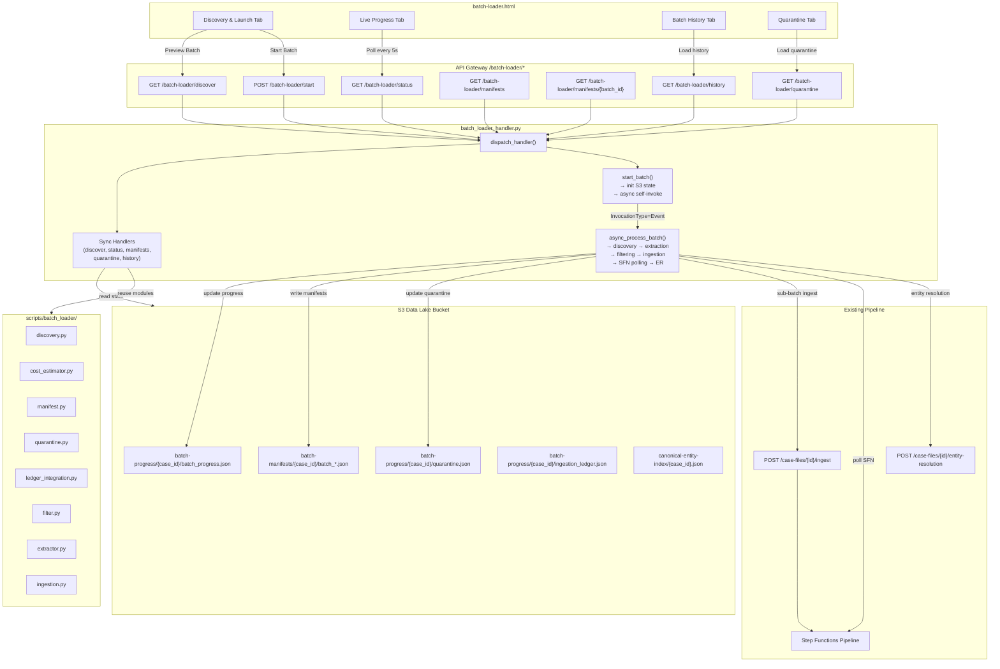
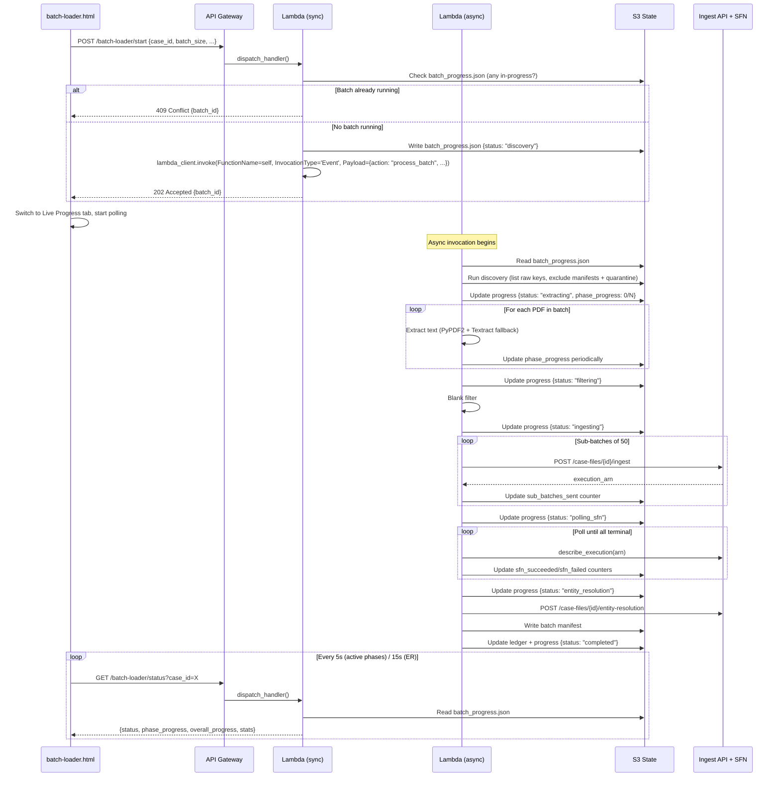
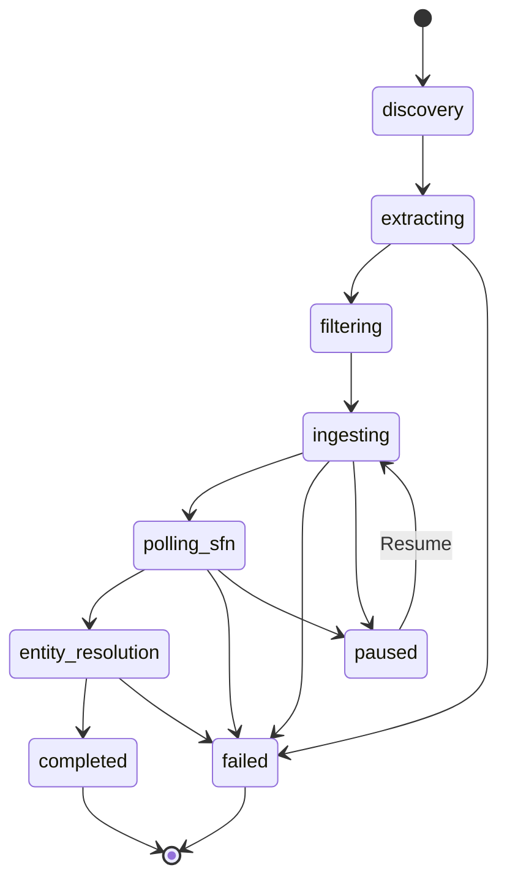

# Design: Batch Loader UI

## Overview

The Batch Loader UI exposes the existing incremental batch loader (scripts/batch_loader/ modules) through a browser-based interface, enabling investigators to trigger batch loads, monitor real-time progress, view batch manifests, and manage quarantined files without CLI access.

The system has two main components:

1. **Backend**: A new Lambda handler (`batch_loader_handler.py`) that serves REST endpoints under `/batch-loader/*`. For read operations (discover, status, manifests, quarantine, history), it reads S3 state directly using the existing batch_loader modules. For the write operation (start batch), it initializes state in S3 and asynchronously invokes itself to perform the long-running batch work.

2. **Frontend**: A new HTML page (`batch-loader.html`) with four sub-tabs (Discovery & Launch, Live Progress, Batch History, Quarantine) following the same patterns as `pipeline-config.html`.

### Key Design Decisions

1. **Async self-invocation for long-running batches**: Since batch processing can run for hours, the `/batch-loader/start` endpoint returns immediately with a `batch_id`. It then invokes the same Lambda function asynchronously (via `lambda:InvokeFunction` with `InvocationType='Event'`) to perform the actual batch work. The async invocation updates `batch_progress.json` in S3 as it proceeds, and the frontend polls `/batch-loader/status` to track progress.

2. **S3 as the state store**: All batch state (progress, manifests, quarantine) lives in S3 in the data lake bucket. This avoids new database tables and reuses the same state files the CLI batch_loader already produces. The Lambda writes to S3 paths under `batch-progress/{case_id}/` instead of local files.

3. **Reuse existing batch_loader modules**: The Lambda imports `discovery`, `cost_estimator`, `manifest`, `quarantine`, and `ledger_integration` from `scripts/batch_loader/`. For ingestion, it calls the existing ingest API (`POST /case-files/{id}/ingest`) in sub-batches, exactly as the CLI does.

4. **Frontend polls S3 state via API**: The frontend never reads S3 directly. It polls the `/batch-loader/status` endpoint which reads `batch_progress.json` from S3 and returns it as JSON. Polling intervals are 5s during active phases and 15s during entity resolution.

5. **Single batch per case**: Only one batch can run per case at a time. The start endpoint checks for an existing in-progress batch and returns 409 if one exists.

## Architecture



### Async Processing Flow



## Components and Interfaces

### Lambda Handler (`src/lambdas/api/batch_loader_handler.py`)

Follows the same dispatch pattern as `pipeline_config.py`:

```python
def dispatch_handler(event, context):
    """Route requests based on HTTP method and resource path."""
    from lambdas.api.response_helper import CORS_HEADERS
    method = event.get("httpMethod", "")
    resource = event.get("resource", "")

    if method == "OPTIONS":
        return {"statusCode": 200, "headers": CORS_HEADERS, "body": ""}

    # Check for async worker invocation (not from API Gateway)
    if event.get("action") == "process_batch":
        return async_process_batch(event, context)

    if resource == "/batch-loader/discover" and method == "GET":
        return handle_discover(event, context)
    if resource == "/batch-loader/start" and method == "POST":
        return handle_start(event, context)
    if resource == "/batch-loader/status" and method == "GET":
        return handle_status(event, context)
    if resource == "/batch-loader/manifests" and method == "GET":
        return handle_list_manifests(event, context)
    if resource == "/batch-loader/manifests/{batch_id}" and method == "GET":
        return handle_get_manifest(event, context)
    if resource == "/batch-loader/quarantine" and method == "GET":
        return handle_quarantine(event, context)
    if resource == "/batch-loader/history" and method == "GET":
        return handle_history(event, context)

    from lambdas.api.response_helper import error_response
    return error_response(404, "NOT_FOUND", f"No handler for {method} {resource}", event)
```

The handler distinguishes between API Gateway invocations (which have `httpMethod` and `resource`) and async self-invocations (which have `action: "process_batch"`). This allows a single Lambda function to serve both roles.

### S3 State Manager (`src/services/batch_loader_state.py`)

Centralizes all S3 reads/writes for batch state. Adapts the existing batch_loader modules to use S3 paths instead of local files:

```python
class BatchLoaderState:
    """Manages batch loader state in S3."""

    def __init__(self, s3_client, data_lake_bucket: str, case_id: str):
        self.s3 = s3_client
        self.bucket = data_lake_bucket
        self.case_id = case_id
        self.progress_key = f"batch-progress/{case_id}/batch_progress.json"
        self.quarantine_key = f"batch-progress/{case_id}/quarantine.json"
        self.ledger_key = f"batch-progress/{case_id}/ingestion_ledger.json"

    def read_progress(self) -> dict | None:
        """Read batch_progress.json from S3. Returns None if not found."""

    def write_progress(self, progress: dict) -> None:
        """Write batch_progress.json to S3."""

    def read_quarantine(self) -> list[dict]:
        """Read quarantine.json from S3. Returns empty list if not found."""

    def write_quarantine(self, entries: list[dict]) -> None:
        """Write quarantine.json to S3."""

    def read_ledger(self) -> dict:
        """Read ingestion_ledger.json from S3."""

    def append_ledger_entry(self, entry: dict) -> None:
        """Append a load entry to the ledger in S3."""

    def list_manifests(self) -> list[dict]:
        """List all batch manifests with summary stats."""

    def read_manifest(self, batch_id: str) -> dict | None:
        """Read a specific batch manifest from S3."""

    def is_batch_in_progress(self) -> tuple[bool, str | None]:
        """Check if a batch is currently running. Returns (is_running, batch_id)."""
```

### API Endpoint Specifications

#### GET /batch-loader/discover

Query parameters:
- `case_id` (required): Target case UUID
- `batch_size` (optional, default 5000): Requested batch size
- `source_prefixes` (optional, default "pdfs/,bw-documents/"): Comma-separated S3 prefixes

Response (200):
```json
{
  "total_unprocessed_count": 316000,
  "requested_batch_size": 5000,
  "actual_batch_size": 5000,
  "source_prefix_breakdown": {
    "pdfs/": 280000,
    "bw-documents/": 36000
  },
  "cost_preview": {
    "textract_ocr_cost": 1.0125,
    "bedrock_entity_cost": 11.0,
    "bedrock_embedding_cost": 0.275,
    "neptune_write_cost": 2.75,
    "total_estimated": 15.0375,
    "estimated_ocr_pages": 675,
    "estimated_non_blank_docs": 2750
  }
}
```

Response when no files remain (200):
```json
{
  "total_unprocessed_count": 0,
  "requested_batch_size": 5000,
  "actual_batch_size": 0,
  "source_prefix_breakdown": {},
  "cost_preview": null,
  "cumulative_stats": {
    "total_processed": 331000,
    "total_blanks": 148950,
    "total_quarantined": 45,
    "total_cost": 950.25
  }
}
```

#### POST /batch-loader/start

Request body:
```json
{
  "case_id": "ed0b6c27-3b6b-4255-b9d0-efe8f4383a99",
  "batch_size": 5000,
  "sub_batch_size": 50,
  "source_prefixes": ["pdfs/", "bw-documents/"],
  "enable_entity_resolution": true,
  "ocr_threshold": 50,
  "blank_threshold": 10
}
```

Response (202 Accepted):
```json
{
  "batch_id": "batch_067",
  "status": "discovery",
  "message": "Batch processing started"
}
```

Response (409 Conflict):
```json
{
  "error": {
    "code": "BATCH_IN_PROGRESS",
    "message": "Batch batch_066 is already running for this case"
  },
  "active_batch_id": "batch_066"
}
```

#### GET /batch-loader/status

Query parameters:
- `case_id` (required): Target case UUID

Response (200):
```json
{
  "batch_id": "batch_067",
  "status": "ingesting",
  "current_phase": "ingesting",
  "phase_progress": {
    "items_completed": 1200,
    "items_total": 2750
  },
  "overall_progress": {
    "files_processed": 3500,
    "batch_size": 5000
  },
  "elapsed_time_seconds": 1845,
  "per_phase_stats": {
    "discovery": {"files_found": 5000, "duration_seconds": 12},
    "extraction": {
      "pypdf2": 3000,
      "textract": 750,
      "failed": 12,
      "cached": 1238,
      "duration_seconds": 600
    },
    "filtering": {"blank_count": 2250, "non_blank_count": 2750, "duration_seconds": 2},
    "ingesting": {
      "sub_batches_sent": 24,
      "sub_batches_total": 55,
      "duration_seconds": null
    },
    "polling_sfn": null,
    "entity_resolution": null
  },
  "started_at": "2026-04-15T10:00:00Z",
  "last_updated": "2026-04-15T10:30:45Z"
}
```

#### GET /batch-loader/manifests

Query parameters:
- `case_id` (required): Target case UUID

Response (200):
```json
{
  "manifests": [
    {
      "batch_id": "batch_001",
      "batch_number": 1,
      "started_at": "2026-04-01T10:00:00Z",
      "completed_at": "2026-04-01T12:30:00Z",
      "total_files": 5000,
      "succeeded": 2480,
      "failed": 8,
      "blank_filtered": 2250,
      "quarantined": 8
    }
  ]
}
```

#### GET /batch-loader/manifests/{batch_id}

Path parameters:
- `batch_id` (required): e.g. "batch_001"

Query parameters:
- `case_id` (required): Target case UUID

Response (200): Full manifest JSON (same schema as `batch-manifests/{case_id}/batch_001.json` from the incremental-batch-loader design).

#### GET /batch-loader/quarantine

Query parameters:
- `case_id` (required): Target case UUID

Response (200):
```json
{
  "quarantined_files": [
    {
      "s3_key": "pdfs/CORRUPTED_FILE.pdf",
      "reason": "PyPDF2 PdfReadError: EOF marker not found",
      "failed_at": "2026-04-01T10:15:00Z",
      "retry_count": 3,
      "batch_number": 1
    }
  ],
  "summary": {
    "total_quarantined": 45,
    "by_reason": {
      "extraction_failed": 30,
      "pipeline_failed": 12,
      "timeout": 3
    },
    "most_recent": "2026-04-10T14:22:00Z"
  }
}
```

#### GET /batch-loader/history

Query parameters:
- `case_id` (required): Target case UUID

Response (200):
```json
{
  "batches": [
    {
      "load_id": "batch_003",
      "timestamp": "2026-04-03T10:00:00Z",
      "source_files_total": 5000,
      "blanks_skipped": 2250,
      "docs_sent_to_pipeline": 2488,
      "sfn_succeeded": 2480,
      "sfn_failed": 8,
      "textract_ocr_count": 750,
      "entity_resolution_result": {"clusters_merged": 45, "errors": 0},
      "cost_actual": 28.50
    }
  ],
  "cumulative_stats": {
    "total_files_discovered": 331000,
    "total_processed": 15000,
    "total_remaining": 316000,
    "total_blanks_filtered": 6750,
    "total_quarantined": 23,
    "total_estimated_cost": 142.50,
    "current_batch_number": 3,
    "cursor": "pdfs/EPSTEIN_DOC_045123.pdf"
  }
}
```

### Frontend Component Structure (`src/frontend/batch-loader.html`)

The page follows the same structure as `pipeline-config.html`:

```
batch-loader.html
├── <head>
│   ├── common.css (shared styles)
│   └── <style> (batch-loader-specific styles)
├── <body>
│   ├── Header (same as pipeline-config.html)
│   ├── Nav bar (Cases | Pipeline Config | Batch Loader | Chat | Wizard | Portfolio | Workbench)
│   ├── Case selector dropdown
│   ├── Sub-tabs: Discovery & Launch | Live Progress | Batch History | Quarantine
│   │
│   ├── Discovery & Launch Tab
│   │   ├── Configuration controls (batch_size, sub_batch_size, source_prefixes, etc.)
│   │   ├── Preview Batch button → calls GET /batch-loader/discover
│   │   ├── Discovery preview card (file counts, cost breakdown table)
│   │   └── Start Batch button → calls POST /batch-loader/start
│   │
│   ├── Live Progress Tab
│   │   ├── Phase indicator bar (discovery → extraction → filtering → ingestion → SFN polling → ER → complete)
│   │   ├── Current phase progress counter
│   │   ├── Overall progress bar
│   │   ├── Real-time stats cards (extraction breakdown, blank count, sub-batches, SFN status)
│   │   └── Completion summary (shown when status=completed)
│   │
│   ├── Batch History Tab
│   │   ├── Cumulative statistics card
│   │   └── Reverse-chronological batch table (clickable rows → manifest viewer)
│   │
│   └── Quarantine Tab
│       ├── Summary card (total, by-reason breakdown)
│       ├── Search/filter input
│       └── Sortable quarantine table
│
└── <script>
    ├── config.js (API_URL)
    ├── api() helper (same pattern as pipeline-config.html)
    ├── Tab switching logic
    ├── Discovery & preview functions
    ├── Batch start + auto-switch to progress tab
    ├── Progress poller (5s active / 15s ER / exponential backoff on error)
    ├── Manifest viewer functions
    ├── History loader
    └── Quarantine loader + filter
```

### API Gateway Integration

New routes added to `infra/api_gateway/api_definition.yaml` under the `/batch-loader` prefix, all pointing to a new `BatchLoaderLambdaArn`:

```yaml
/batch-loader/discover:
  get: ...
  options: ...
/batch-loader/start:
  post: ...
  options: ...
/batch-loader/status:
  get: ...
  options: ...
/batch-loader/manifests:
  get: ...
  options: ...
/batch-loader/manifests/{batch_id}:
  get: ...
  options: ...
/batch-loader/quarantine:
  get: ...
  options: ...
/batch-loader/history:
  get: ...
  options: ...
```

All routes use `aws_proxy` integration type, consistent with existing routes.

## Data Models

### Batch Progress File (S3: `batch-progress/{case_id}/batch_progress.json`)

This is the central state file that the async worker updates and the status endpoint reads:

```json
{
  "batch_id": "batch_067",
  "case_id": "ed0b6c27-3b6b-4255-b9d0-efe8f4383a99",
  "status": "ingesting",
  "current_phase": "ingesting",
  "phase_progress": {
    "items_completed": 1200,
    "items_total": 2750
  },
  "overall_progress": {
    "files_processed": 3500,
    "batch_size": 5000
  },
  "config": {
    "batch_size": 5000,
    "sub_batch_size": 50,
    "source_prefixes": ["pdfs/", "bw-documents/"],
    "enable_entity_resolution": true,
    "ocr_threshold": 50,
    "blank_threshold": 10
  },
  "per_phase_stats": {
    "discovery": {"files_found": 5000, "duration_seconds": 12},
    "extraction": {
      "pypdf2": 3000,
      "textract": 750,
      "failed": 12,
      "cached": 1238,
      "duration_seconds": 600
    },
    "filtering": {"blank_count": 2250, "non_blank_count": 2750, "duration_seconds": 2},
    "ingesting": {
      "sub_batches_sent": 24,
      "sub_batches_total": 55,
      "duration_seconds": null
    },
    "polling_sfn": {
      "executions_total": 55,
      "succeeded": 0,
      "failed": 0,
      "running": 55
    },
    "entity_resolution": null
  },
  "cumulative_stats": {
    "total_files_discovered": 331000,
    "total_processed": 15000,
    "total_remaining": 316000,
    "cumulative_blanks": 6750,
    "cumulative_quarantined": 23,
    "cumulative_cost": 142.50
  },
  "error_reason": null,
  "started_at": "2026-04-15T10:00:00Z",
  "last_updated": "2026-04-15T10:30:45Z"
}
```

Valid `status` values and transitions:



### Quarantine File (S3: `batch-progress/{case_id}/quarantine.json`)

Same schema as the CLI quarantine.json, stored in S3:

```json
{
  "quarantined_keys": [
    {
      "s3_key": "pdfs/CORRUPTED_FILE.pdf",
      "reason": "extraction_failed: PyPDF2 PdfReadError",
      "failed_at": "2026-04-01T10:15:00Z",
      "retry_count": 3,
      "batch_number": 1
    }
  ]
}
```

### Ingestion Ledger (S3: `batch-progress/{case_id}/ingestion_ledger.json`)

Same schema as the CLI `scripts/ingestion_ledger.json`, stored in S3 per-case:

```json
{
  "cases": {
    "ed0b6c27-...": {
      "name": "Epstein Combined",
      "loads": [
        {
          "load_id": "batch_001",
          "timestamp": "2026-04-01T12:30:00Z",
          "source_files_total": 5000,
          "blanks_skipped": 2250,
          "docs_sent_to_pipeline": 2488,
          "sfn_executions": 50,
          "sfn_succeeded": 49,
          "sfn_failed": 1,
          "textract_ocr_count": 750,
          "extraction_method_breakdown": {"pypdf2": 3000, "textract": 750, "failed": 12},
          "entity_resolution_result": {"clusters_merged": 45, "errors": 0},
          "cost_actual": 28.50,
          "notes": "Batch 1. 45% blank rate."
        }
      ],
      "running_total_s3_docs": 2488
    }
  }
}
```

### Batch Manifest (S3: `batch-manifests/{case_id}/batch_{number}.json`)

Same schema as defined in the incremental-batch-loader design. No changes needed.

## Correctness Properties

*A property is a characteristic or behavior that should hold true across all valid executions of a system — essentially, a formal statement about what the system should do. Properties serve as the bridge between human-readable specifications and machine-verifiable correctness guarantees.*

### Property 1: Dispatch handler routes requests correctly

*For any* valid HTTP method and resource path combination in the batch-loader API (GET /batch-loader/discover, POST /batch-loader/start, GET /batch-loader/status, GET /batch-loader/manifests, GET /batch-loader/manifests/{batch_id}, GET /batch-loader/quarantine, GET /batch-loader/history), the dispatch handler should invoke the corresponding handler function. For OPTIONS requests to any batch-loader path, the response should include CORS headers. For unrecognized method/resource combinations, the response should be 404.

**Validates: Requirements 2.2, 9.3**

### Property 2: Discovery response completeness

*For any* case_id, batch_size, and source_prefixes, the discovery endpoint response should contain all required fields: total_unprocessed_count (non-negative integer), requested_batch_size, actual_batch_size (min of requested and available), source_prefix_breakdown (dict with counts per prefix), and cost_preview (non-null when total_unprocessed_count > 0, null when 0). The actual_batch_size should never exceed total_unprocessed_count.

**Validates: Requirements 2.1, 2.3**

### Property 3: Start batch parameter validation

*For any* request body, the start endpoint should reject requests where batch_size is not a positive integer, sub_batch_size is not a positive integer in range 1-200, or source_prefixes is empty. Valid requests should be accepted and return a batch_id.

**Validates: Requirements 3.4, 4.2**

### Property 4: Start batch initializes progress and returns batch_id

*For any* valid start request for a case with no in-progress batch, the start endpoint should write a batch_progress.json to S3 with status "discovery" and return a 202 response containing the batch_id. The batch_id should match the one written to S3.

**Validates: Requirements 4.2, 9.5**

### Property 5: Concurrent batch prevention

*For any* case_id that already has a batch_progress.json in S3 with a non-terminal status (not "completed" and not "failed"), the start endpoint should return a 409 Conflict response containing the active batch_id.

**Validates: Requirements 4.4**

### Property 6: Status endpoint round-trip

*For any* valid batch_progress.json written to S3, the status endpoint should return a response whose batch_id, status, current_phase, phase_progress, overall_progress, and per_phase_stats fields match the S3 file contents.

**Validates: Requirements 5.1**

### Property 7: Progress file phase invariants

*For any* batch_progress.json, the status field should be one of the valid values (discovery, extracting, filtering, ingesting, polling_sfn, entity_resolution, completed, failed, paused). When status is "completed", overall_progress.files_processed should equal overall_progress.batch_size. When status is "paused" or "failed", error_reason should be non-null.

**Validates: Requirements 5.7, 10.4**

### Property 8: Manifest list completeness

*For any* set of batch manifest files stored in S3 under batch-manifests/{case_id}/, the manifests endpoint should return a list with one entry per manifest file, and each entry should contain batch_id, batch_number, started_at, completed_at, total_files, succeeded, failed, blank_filtered, and quarantined fields. The summary counts should equal the actual counts derived from the manifest's files array.

**Validates: Requirements 6.1, 6.5**

### Property 9: Manifest retrieval round-trip

*For any* batch manifest stored in S3, retrieving it via GET /batch-loader/manifests/{batch_id} should return the same JSON content as the S3 object.

**Validates: Requirements 6.2**

### Property 10: Manifest file filtering

*For any* batch manifest and any filter criteria (pipeline_status or extraction_method), the filtered file list should contain only entries where the specified field matches the filter value. The filtered list should be a subset of the full file list.

**Validates: Requirements 6.4**

### Property 11: Quarantine summary computation

*For any* list of quarantine entries, the summary should have: total_quarantined equal to the list length, by_reason counts that sum to total_quarantined, and most_recent equal to the maximum failed_at timestamp in the list (or null if empty).

**Validates: Requirements 7.1, 7.3**

### Property 12: Quarantine search filtering

*For any* list of quarantine entries and any search string, the filtered results should contain only entries where either the s3_key or reason contains the search string as a case-insensitive substring.

**Validates: Requirements 7.4**

### Property 13: History entries are reverse-chronological

*For any* list of batch history entries returned by the history endpoint, the entries should be sorted by timestamp in descending order (most recent first).

**Validates: Requirements 8.2**

### Property 14: Cumulative statistics consistency

*For any* list of batch history entries, the cumulative total_processed should equal the sum of docs_sent_to_pipeline across all entries. The cumulative total_blanks_filtered should equal the sum of blanks_skipped across all entries. The cumulative total_estimated_cost should equal the sum of cost_actual across all entries.

**Validates: Requirements 8.1, 8.3**

### Property 15: Partial batch acceptance

*For any* start request where batch_size exceeds the number of unprocessed files, the API should accept the request and set actual_batch_size to the number of unprocessed files (not reject it).

**Validates: Requirements 10.2**

## Error Handling

### API-Level Errors

| Error | HTTP Status | Error Code | Handling |
|-------|-------------|------------|----------|
| Missing case_id parameter | 400 | VALIDATION_ERROR | Return descriptive message |
| Invalid batch_size (non-positive, non-integer) | 400 | VALIDATION_ERROR | Return descriptive message |
| Empty source_prefixes | 400 | VALIDATION_ERROR | Return descriptive message |
| Case not found | 404 | NOT_FOUND | Return case_id in message |
| Batch already in progress | 409 | BATCH_IN_PROGRESS | Return active batch_id |
| S3 unreachable | 503 | SERVICE_UNAVAILABLE | Return retry prompt |
| Manifest not found | 404 | NOT_FOUND | Return batch_id in message |
| Unrecognized route | 404 | NOT_FOUND | Return method + resource |
| Internal error | 500 | INTERNAL_ERROR | Log exception, return generic message |

### Async Worker Errors

| Error | Handling | Recovery |
|-------|----------|----------|
| Discovery fails (S3 list error) | Set status to "failed" with error_reason | User can retry via Start Batch |
| Extraction failure rate > threshold | Set status to "paused" with error_reason | User clicks Resume button |
| Ingest API returns 5xx | Retry sub-batch with exponential backoff | After max retries, quarantine docs and continue |
| SFN execution FAILED | Record in manifest, increment sfn_failed counter | Continue polling remaining executions |
| Entity resolution API error | Log error, set ER result to "failed" | Batch still marked "completed" (ER is optional) |
| Lambda timeout (15 min) | Progress file retains last-written state | User can see partial progress; manual intervention needed |
| Self-invocation fails | Start endpoint returns 202 but no async work begins | Status endpoint shows stale "discovery" status; user retries |

### Frontend Error Handling

| Error | Handling |
|-------|----------|
| Network error on poll | Show "Connection lost — retrying" indicator, exponential backoff up to 60s |
| API returns 503 | Show "Service temporarily unavailable" with retry button |
| API returns 409 on start | Show message with link to Live Progress tab |
| API returns 400 on start | Show validation error message, keep form enabled |
| Poll returns stale data (no update for >5 min) | Show "Batch may be stalled" warning |

## Testing Strategy

### Dual Testing Approach

The batch loader UI requires both unit tests and property-based tests:

- **Unit tests**: Verify specific API request/response examples, edge cases (empty quarantine, no manifests), error conditions (S3 failures, invalid parameters), and frontend JavaScript behavior
- **Property tests**: Verify universal properties across randomly generated inputs for the backend service layer

### Property-Based Testing Configuration

- **Library**: [Hypothesis](https://hypothesis.readthedocs.io/) for Python
- **Minimum iterations**: 100 per property test (via `@settings(max_examples=100)`)
- **Tag format**: Each test tagged with `# Feature: batch-loader-ui, Property {N}: {title}`
- **Each correctness property implemented by a single property-based test**

### Unit Test Coverage

Unit tests should focus on:

1. **Dispatch handler routing**: Verify each method/resource combination routes to the correct handler
2. **Parameter validation**: Test boundary values for batch_size, sub_batch_size, source_prefixes
3. **S3 state read/write**: Mock S3 client, verify correct keys and JSON serialization
4. **Discovery integration**: Mock the batch_loader discovery module, verify response assembly
5. **Concurrent batch guard**: Test 409 response when batch is in progress
6. **Error responses**: Verify correct HTTP status codes and error structures for each error case
7. **CORS headers**: Verify all responses include CORS headers
8. **Frontend JavaScript**: Test tab switching, polling logic, filter functions (if using a JS test framework)

### Property Test Coverage

| Property | Module Under Test | Key Generators |
|----------|-------------------|----------------|
| 1: Dispatch routing | `batch_loader_handler.py` | HTTP methods, resource paths |
| 2: Discovery response completeness | `batch_loader_handler.py` | Positive integers (counts), prefix lists |
| 3: Start parameter validation | `batch_loader_handler.py` | Integers (valid/invalid), string lists |
| 4: Start initializes progress | `batch_loader_handler.py` + `batch_loader_state.py` | Valid config dicts |
| 5: Concurrent batch prevention | `batch_loader_state.py` | Status strings (terminal vs non-terminal) |
| 6: Status round-trip | `batch_loader_state.py` | Progress JSON dicts |
| 7: Progress phase invariants | `batch_loader_state.py` | Status strings, progress counters |
| 8: Manifest list completeness | `batch_loader_state.py` | Lists of manifest dicts with file arrays |
| 9: Manifest retrieval round-trip | `batch_loader_state.py` | Manifest JSON dicts |
| 10: Manifest file filtering | filter logic | File entry lists, status/method filter values |
| 11: Quarantine summary | summary logic | Lists of quarantine entry dicts |
| 12: Quarantine search | filter logic | Quarantine entry lists, search strings |
| 13: History reverse-chronological | sort logic | Lists of history entries with timestamps |
| 14: Cumulative stats consistency | aggregation logic | Lists of batch stats dicts |
| 15: Partial batch acceptance | `batch_loader_handler.py` | batch_size integers, unprocessed counts |

### Test File Structure

```
tests/unit/
├── test_batch_loader_handler.py    # Properties 1-5, 15 + unit tests for dispatch, validation, start
├── test_batch_loader_state.py      # Properties 6-9 + unit tests for S3 state read/write
├── test_batch_loader_filters.py    # Properties 10, 12 + unit tests for manifest/quarantine filtering
├── test_batch_loader_aggregation.py # Properties 11, 13, 14 + unit tests for summary/history computation
```
