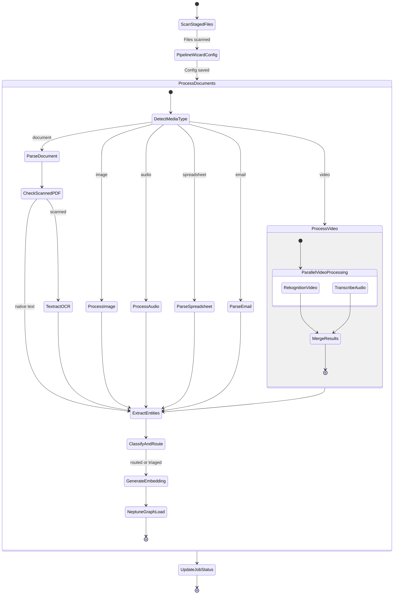
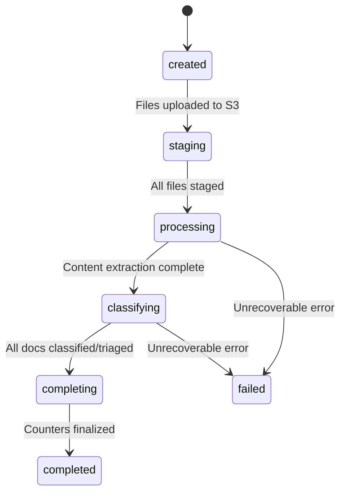
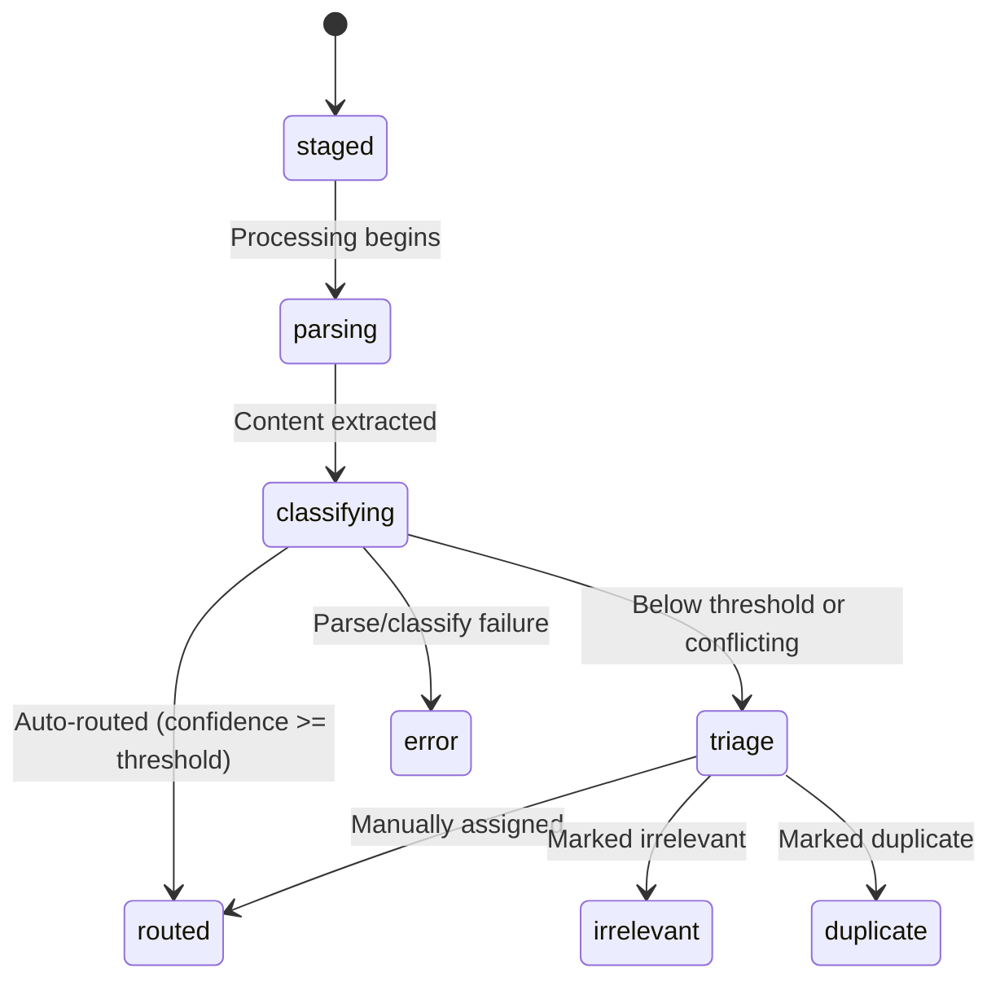

# Design Document: Bulk Ingestion & Triage

## Overview

This design extends the existing matter-collection-hierarchy to support massive bulk data loads (500TB+) with AI-powered document classification, multi-modal file processing, flexible ingestion modes, a wizard-driven pipeline configuration, human triage for ambiguous documents, deduplication, and chain-of-custody tracking. The full hierarchy becomes: Customer → Matter → Case → Collection → Document.

The system builds on proven components: the existing Step Functions ingestion pipeline (`ingestion_pipeline.json`), `EntityExtractionService` for Bedrock-based entity extraction, `DocumentClassificationService` for AI classification and triage routing, `NeptuneGraphLoader` for bulk CSV and Gremlin loading, `IngestionServiceV2` for collection-aware ingestion, and the `RekognitionHandler` for image/video analysis. The 500TB architecture document informs the SQS + Lambda fleet approach for scale.

### Key Design Decisions

1. **Customer extends Organization** — The existing `organizations` table gains `customer_code`, `primary_contact`, `contract_tier`, and `onboarded_at` columns via `ALTER TABLE ADD COLUMN`. All existing `org_id` references remain valid. No new table; Customer IS an Organization with extra fields.

2. **Case as a child of Matter** — A new `cases` table with `matter_id` FK models the real-world structure where one investigation (Matter) spans multiple court cases. The existing `matters` table gains a `parent_type` field (`matter` or `case_parent`) but is otherwise unchanged.

3. **Bulk Ingestion Job as orchestration unit** — A `bulk_ingestion_jobs` table tracks each large-scale data delivery with counters (total_files, processed_count, classified_count, triage_count, error_count) and computed metrics (throughput_rate, estimated_completion_time). Jobs follow a state machine: `created → staging → processing → classifying → completing → completed | failed`.

4. **Staging area with deferred routing** — Raw files land at `orgs/{customer_id}/bulk-staging/{job_id}/raw/` with `matter_id` and `case_id` NULL on document records. Classification and routing happen after content extraction.

5. **Step Functions state machine with media-type branching** — Extends the existing `ingestion_pipeline.json` with a new `DetectMediaType` choice state that branches into parallel sub-pipelines per media type. Video files run Rekognition Video + Transcribe in parallel before merging results. Scanned PDFs are detected and routed through Textract OCR.

6. **Three ingestion modes** — `auto_classify` (full AI classification + auto-routing), `pre_assigned` (skip classification, assign to specified Matter/Case), `hybrid` (pre-assign to Matter, AI sub-classifies into Cases). Mode is set per Bulk Ingestion Job.

7. **Pipeline Wizard saves config as JSONB** — The wizard scans staged files, detects media types, recommends services, and saves the complete pipeline configuration as `pipeline_config` JSONB on the `bulk_ingestion_jobs` record. Processing Lambdas read this config at runtime.

8. **Strict processing order** — media detection → content extraction → entity extraction → classification/routing → embedding → Neptune graph load. Each step depends on the previous step's output. Multi-modal files (e.g., video) run parallel sub-steps within the content extraction phase only.

## Architecture

### High-Level Architecture

```mermaid
graph TB
    subgraph Frontend ["Frontend"]
        BIW[Bulk Ingestion Wizard]
        PW[Pipeline Wizard]
        JM[Job Monitor Dashboard]
        TQ[Triage Queue UI]
    end

    subgraph API ["API Gateway"]
        BIJ_API["/customers/{id}/bulk-ingestion-jobs"]
        JOB_API["/bulk-ingestion-jobs/{id}"]
        TRI_API["/triage/{id}/*"]
        CASE_API["/customers/{id}/matters/{mid}/cases"]
    end

    subgraph Orchestration ["Step Functions + SQS"]
        SF[Bulk Ingestion State Machine]
        SQS_DOC[SQS Document Queue per Job]
        SQS_DLQ[Dead Letter Queue]
    end

    subgraph Processing ["Lambda Fleet"]
        MD[Media Type Detector]
        OCR[Textract OCR Handler]
        TRANS[Transcribe Handler]
        REK[Rekognition Handler]
        PARSE[Document Parser]
        EE[Entity Extraction]
        CLS[AI Classifier + Auto-Router]
        EMB[Embedding Generator]
        GL[Neptune Graph Loader]
        DEDUP[Deduplication Service]
    end

    subgraph Storage ["Data Stores"]
        S3["S3: orgs/{cid}/bulk-staging/{jid}/raw/"]
        AURORA[(Aurora PostgreSQL)]
        NEPTUNE[(Neptune Graph)]
        AOSS[(OpenSearch Serverless)]
    end

    Frontend --> API
    API --> Orchestration
    Orchestration --> Processing
    Processing --> Storage
```



### Bulk Ingestion Pipeline Flow (Step Functions)



### Bulk Ingestion Job State Machine



### Document Processing State Machine




## Components and Interfaces

### BulkIngestionService

Orchestrates the entire bulk ingestion lifecycle — job creation, staging, processing dispatch, and status tracking.

```python
class BulkIngestionService:
    def create_job(
        self, customer_id: str, job_name: str, source_description: str,
        ingestion_mode: str = "auto_classify",
        target_matter_id: str | None = None,
        target_case_id: str | None = None,
        pipeline_config: dict | None = None,
    ) -> BulkIngestionJob: ...

    def stage_files(self, job_id: str, files: list[tuple[str, bytes]]) -> list[str]:
        """Upload files to staging S3 prefix, create document records with NULL matter/case."""
        ...

    def start_processing(self, job_id: str) -> None:
        """Transition job to processing, dispatch documents to SQS queue."""
        ...

    def get_job_status(self, job_id: str) -> BulkIngestionJob:
        """Return job with computed throughput_rate and estimated_completion_time."""
        ...

    def get_job_documents(self, job_id: str, status: str | None = None,
                          limit: int = 50, offset: int = 0) -> list[dict]: ...

    def get_job_breakdown(self, job_id: str) -> dict:
        """Per-job breakdown: auto-routed by Matter, by Case, triage, error."""
        ...

    def increment_counter(self, job_id: str, counter: str) -> None:
        """Atomically increment processed_count, classified_count, triage_count, or error_count."""
        ...
```

### MediaTypeDetector

Detects file media type from extension and MIME type. Routes to appropriate processing chain.

```python
class MediaTypeDetector:
    MEDIA_TYPE_MAP: dict[str, str]  # extension -> media_type

    def detect(self, filename: str, content_bytes: bytes | None = None) -> str:
        """Return media_type: document, image, audio, video, spreadsheet, email, database, other."""
        ...

    def is_scanned_pdf(self, content_bytes: bytes, char_threshold: int = 50) -> bool:
        """Test PDF readability. Returns True if text per page < threshold."""
        ...

    def scan_staged_files(self, s3_prefix: str, sample_size: int = 1000) -> dict:
        """Scan up to sample_size files, return media type distribution."""
        ...
```

### BulkClassificationService

Extends `DocumentClassificationService` with case-number and matter-reference extraction for bulk ingestion. Handles auto-routing and triage queue insertion.

```python
class BulkClassificationService:
    def classify_for_bulk(
        self, document_id: str, parsed_text: str, extracted_entities: list[dict],
        job_id: str, customer_id: str, ingestion_mode: str,
        target_matter_id: str | None = None,
        pipeline_config: dict | None = None,
    ) -> ClassificationResult:
        """Extract case numbers, matter references, document type. Return with confidence."""
        ...

    def auto_route(
        self, document_id: str, result: ClassificationResult,
        customer_id: str, job_id: str, confidence_threshold: float = 0.8,
    ) -> RoutingOutcome:
        """Route to existing Matter/Case, auto-create if new reference, or send to triage."""
        ...
```

### TriageService

Manages the triage queue for ambiguous documents.

```python
class TriageService:
    def add_to_triage(
        self, document_id: str, job_id: str, ai_suggestions: list[dict],
        document_type: str, extracted_entities: dict,
    ) -> str:
        """Create triage item. Returns triage_id."""
        ...

    def list_triage_items(
        self, job_id: str | None = None, status: str = "pending",
        document_type: str | None = None, limit: int = 50, offset: int = 0,
    ) -> list[dict]: ...

    def get_triage_item(self, triage_id: str) -> dict:
        """Return triage item with document preview (first 5000 chars) and AI suggestions."""
        ...

    def assign_to_matter_case(
        self, triage_id: str, matter_id: str, case_id: str | None,
        assigned_by: str,
    ) -> dict: ...

    def create_matter_from_triage(
        self, triage_id: str, matter_name: str, customer_id: str,
        created_by: str,
    ) -> dict: ...

    def create_case_from_triage(
        self, triage_id: str, case_title: str, matter_id: str,
        docket_number: str | None, created_by: str,
    ) -> dict: ...

    def mark_irrelevant(self, triage_id: str, assigned_by: str) -> dict: ...

    def mark_duplicate(
        self, triage_id: str, original_document_id: str, assigned_by: str,
    ) -> dict: ...
```

### CaseService

Manages Cases as children of Matters.

```python
class CaseService:
    def create_case(
        self, matter_id: str, org_id: str, docket_number: str | None,
        case_title: str, judge: str = "", parties: dict | None = None,
        filing_date: str | None = None, court_jurisdiction: str = "",
    ) -> Case: ...

    def get_case(self, case_id: str, org_id: str) -> Case: ...

    def list_cases(self, matter_id: str, org_id: str) -> list[Case]: ...

    def update_status(self, case_id: str, org_id: str, status: str) -> Case: ...
```

### DeduplicationService

Detects exact and near-duplicate documents.

```python
class DeduplicationService:
    def compute_hash(self, content: bytes) -> str:
        """SHA-256 hash of file content."""
        ...

    def check_exact_duplicate(self, file_hash: str, customer_id: str) -> str | None:
        """Return original document_id if exact duplicate exists, else None."""
        ...

    def check_near_duplicate(
        self, embedding: list[float], customer_id: str, threshold: float = 0.95,
    ) -> tuple[str | None, float]:
        """Return (original_document_id, similarity_score) if near-duplicate, else (None, 0.0)."""
        ...

    def get_job_dedup_stats(self, job_id: str) -> dict:
        """Return {exact_duplicate_count, near_duplicate_count}."""
        ...
```

### PipelineWizardService

Scans staged files, detects media types, generates recommended pipeline configuration.

```python
class PipelineWizardService:
    def scan_and_recommend(self, job_id: str, customer_id: str) -> dict:
        """Scan staged files (up to 1000), return media type breakdown + recommended config."""
        ...

    def save_config(self, job_id: str, pipeline_config: dict) -> None:
        """Save pipeline_config JSONB on the bulk_ingestion_jobs record."""
        ...

    def get_defaults(self, media_types: dict) -> dict:
        """Return sensible default config for detected media types."""
        ...
```

### ChainOfCustodyService

Append-only audit trail for every document action.

```python
class ChainOfCustodyService:
    def record_event(
        self, document_id: str, event_type: str, details: dict,
        actor: str = "system",
    ) -> None:
        """Append event to document's chain_of_custody JSONB array."""
        ...

    def get_chain(self, document_id: str) -> list[dict]:
        """Return full chain of custody for a document."""
        ...
```

### Step Functions Pipeline Extension

The existing `ingestion_pipeline.json` is extended with a new bulk ingestion variant. The key addition is a `DetectMediaType` choice state after upload that branches processing:

```json
{
  "DetectMediaType": {
    "Type": "Choice",
    "Choices": [
      {"Variable": "$.media_type", "StringEquals": "image", "Next": "ProcessImage"},
      {"Variable": "$.media_type", "StringEquals": "audio", "Next": "ProcessAudio"},
      {"Variable": "$.media_type", "StringEquals": "video", "Next": "ProcessVideo"},
      {"Variable": "$.media_type", "StringEquals": "spreadsheet", "Next": "ParseSpreadsheet"},
      {"Variable": "$.media_type", "StringEquals": "email", "Next": "ParseEmail"}
    ],
    "Default": "ParseDocument"
  }
}
```

For video files, a `Parallel` state runs Rekognition Video and Transcribe concurrently:

```json
{
  "ProcessVideo": {
    "Type": "Parallel",
    "Branches": [
      {"StartAt": "RekognitionVideo", "States": {"RekognitionVideo": {"Type": "Task", "Resource": "${RekognitionLambdaArn}", "End": true}}},
      {"StartAt": "TranscribeAudio", "States": {"TranscribeAudio": {"Type": "Task", "Resource": "${TranscribeLambdaArn}", "End": true}}}
    ],
    "Next": "MergeVideoResults"
  }
}
```

For scanned PDF detection, a `CheckScannedPDF` choice state after `ParseDocument`:

```json
{
  "CheckScannedPDF": {
    "Type": "Choice",
    "Choices": [
      {"Variable": "$.parse_result.is_scanned", "BooleanEquals": true, "Next": "TextractOCR"}
    ],
    "Default": "ExtractEntities"
  }
}
```


## Data Models

### Aurora PostgreSQL Schema Extension (Migration 007)

```sql
-- Migration: 007_bulk_ingestion_triage.sql
-- Extends matter-collection-hierarchy with Customer, Cases, Bulk Ingestion, and Triage

BEGIN;

-- ============================================================================
-- 1. Extend organizations table to become Customer
-- ============================================================================
ALTER TABLE organizations ADD COLUMN IF NOT EXISTS customer_code TEXT UNIQUE;
ALTER TABLE organizations ADD COLUMN IF NOT EXISTS primary_contact TEXT DEFAULT '';
ALTER TABLE organizations ADD COLUMN IF NOT EXISTS contract_tier TEXT DEFAULT 'standard';
ALTER TABLE organizations ADD COLUMN IF NOT EXISTS onboarded_at TIMESTAMP WITH TIME ZONE;

-- ============================================================================
-- 2. Extend matters table with parent_type
-- ============================================================================
ALTER TABLE matters ADD COLUMN IF NOT EXISTS parent_type TEXT DEFAULT 'matter';

-- ============================================================================
-- 3. Cases table (child of Matter)
-- ============================================================================
CREATE TABLE IF NOT EXISTS cases (
    case_id UUID PRIMARY KEY DEFAULT gen_random_uuid(),
    matter_id UUID NOT NULL REFERENCES matters(matter_id),
    org_id UUID NOT NULL REFERENCES organizations(org_id),
    docket_number TEXT,
    case_title TEXT NOT NULL,
    judge TEXT DEFAULT '',
    parties JSONB DEFAULT '{}',
    filing_date DATE,
    case_status TEXT NOT NULL DEFAULT 'open',
    court_jurisdiction TEXT DEFAULT '',
    created_at TIMESTAMP WITH TIME ZONE DEFAULT NOW(),
    last_activity TIMESTAMP WITH TIME ZONE DEFAULT NOW()
);
CREATE INDEX IF NOT EXISTS idx_cases_matter_id ON cases(matter_id);
CREATE INDEX IF NOT EXISTS idx_cases_org_id ON cases(org_id);
CREATE INDEX IF NOT EXISTS idx_cases_docket_number ON cases(docket_number);
CREATE INDEX IF NOT EXISTS idx_cases_status ON cases(case_status);

-- ============================================================================
-- 4. Bulk Ingestion Jobs table
-- ============================================================================
CREATE TABLE IF NOT EXISTS bulk_ingestion_jobs (
    job_id UUID PRIMARY KEY DEFAULT gen_random_uuid(),
    customer_id UUID NOT NULL REFERENCES organizations(org_id),
    job_name TEXT NOT NULL,
    source_description TEXT DEFAULT '',
    status TEXT NOT NULL DEFAULT 'created',
    ingestion_mode TEXT NOT NULL DEFAULT 'auto_classify',
    target_matter_id UUID REFERENCES matters(matter_id),
    target_case_id UUID REFERENCES cases(case_id),
    pipeline_config JSONB DEFAULT '{}',
    total_files INTEGER DEFAULT 0,
    processed_count INTEGER DEFAULT 0,
    classified_count INTEGER DEFAULT 0,
    triage_count INTEGER DEFAULT 0,
    error_count INTEGER DEFAULT 0,
    exact_duplicate_count INTEGER DEFAULT 0,
    near_duplicate_count INTEGER DEFAULT 0,
    document_count INTEGER DEFAULT 0,
    image_count INTEGER DEFAULT 0,
    audio_count INTEGER DEFAULT 0,
    video_count INTEGER DEFAULT 0,
    spreadsheet_count INTEGER DEFAULT 0,
    email_count INTEGER DEFAULT 0,
    other_count INTEGER DEFAULT 0,
    created_at TIMESTAMP WITH TIME ZONE DEFAULT NOW(),
    started_at TIMESTAMP WITH TIME ZONE,
    completed_at TIMESTAMP WITH TIME ZONE
);
CREATE INDEX IF NOT EXISTS idx_bij_customer_id ON bulk_ingestion_jobs(customer_id);
CREATE INDEX IF NOT EXISTS idx_bij_status ON bulk_ingestion_jobs(status);

-- ============================================================================
-- 5. Extend triage_queue table
-- ============================================================================
ALTER TABLE triage_queue ADD COLUMN IF NOT EXISTS job_id UUID REFERENCES bulk_ingestion_jobs(job_id);
ALTER TABLE triage_queue ADD COLUMN IF NOT EXISTS ai_suggestions JSONB DEFAULT '[]';
ALTER TABLE triage_queue ADD COLUMN IF NOT EXISTS extracted_entities JSONB DEFAULT '{}';
ALTER TABLE triage_queue ADD COLUMN IF NOT EXISTS document_type TEXT DEFAULT '';
ALTER TABLE triage_queue ADD COLUMN IF NOT EXISTS assigned_matter_id UUID REFERENCES matters(matter_id);
ALTER TABLE triage_queue ADD COLUMN IF NOT EXISTS assigned_case_id UUID REFERENCES cases(case_id);

-- ============================================================================
-- 6. Extend documents table
-- ============================================================================
ALTER TABLE documents ADD COLUMN IF NOT EXISTS job_id UUID REFERENCES bulk_ingestion_jobs(job_id);
ALTER TABLE documents ADD COLUMN IF NOT EXISTS case_id UUID REFERENCES cases(case_id);
ALTER TABLE documents ADD COLUMN IF NOT EXISTS media_type TEXT DEFAULT 'document';
ALTER TABLE documents ADD COLUMN IF NOT EXISTS file_hash TEXT;
ALTER TABLE documents ADD COLUMN IF NOT EXISTS processing_status TEXT DEFAULT 'staged';
ALTER TABLE documents ADD COLUMN IF NOT EXISTS chain_of_custody JSONB DEFAULT '[]';
ALTER TABLE documents ADD COLUMN IF NOT EXISTS bates_number TEXT;
ALTER TABLE documents ADD COLUMN IF NOT EXISTS original_filepath TEXT;
ALTER TABLE documents ADD COLUMN IF NOT EXISTS is_duplicate BOOLEAN DEFAULT FALSE;
ALTER TABLE documents ADD COLUMN IF NOT EXISTS duplicate_of TEXT;
ALTER TABLE documents ADD COLUMN IF NOT EXISTS source_media_type TEXT;
ALTER TABLE documents ADD COLUMN IF NOT EXISTS parsed_text TEXT;

CREATE INDEX IF NOT EXISTS idx_documents_job_id ON documents(job_id);
CREATE INDEX IF NOT EXISTS idx_documents_case_id ON documents(case_id);
CREATE INDEX IF NOT EXISTS idx_documents_file_hash ON documents(file_hash);
CREATE INDEX IF NOT EXISTS idx_documents_processing_status ON documents(processing_status);
CREATE INDEX IF NOT EXISTS idx_documents_media_type ON documents(media_type);

-- ============================================================================
-- 7. Document hashes table (for cross-job dedup within a Customer)
-- ============================================================================
CREATE TABLE IF NOT EXISTS document_hashes (
    hash_id UUID PRIMARY KEY DEFAULT gen_random_uuid(),
    customer_id UUID NOT NULL REFERENCES organizations(org_id),
    file_hash TEXT NOT NULL,
    document_id UUID NOT NULL,
    created_at TIMESTAMP WITH TIME ZONE DEFAULT NOW(),
    UNIQUE(customer_id, file_hash)
);

COMMIT;
```

### Pydantic Models

```python
class Customer(Organization):
    """Extends Organization with customer-specific fields."""
    customer_code: str | None = None
    primary_contact: str = ""
    contract_tier: str = "standard"
    onboarded_at: datetime | None = None


class CaseStatus(str, Enum):
    OPEN = "open"
    ACTIVE = "active"
    CLOSED = "closed"
    SEALED = "sealed"
    ARCHIVED = "archived"


class Case(BaseModel):
    """A specific filed legal action — child of Matter."""
    case_id: str
    matter_id: str
    org_id: str
    docket_number: str | None = None
    case_title: str
    judge: str = ""
    parties: dict = Field(default_factory=dict)
    filing_date: date | None = None
    case_status: CaseStatus = CaseStatus.OPEN
    court_jurisdiction: str = ""
    created_at: datetime
    last_activity: datetime | None = None


class IngestionMode(str, Enum):
    AUTO_CLASSIFY = "auto_classify"
    PRE_ASSIGNED = "pre_assigned"
    HYBRID = "hybrid"


class JobStatus(str, Enum):
    CREATED = "created"
    STAGING = "staging"
    PROCESSING = "processing"
    CLASSIFYING = "classifying"
    COMPLETING = "completing"
    COMPLETED = "completed"
    FAILED = "failed"


class BulkIngestionJob(BaseModel):
    """Tracks a large-scale data delivery from a Customer."""
    job_id: str
    customer_id: str
    job_name: str
    source_description: str = ""
    status: JobStatus = JobStatus.CREATED
    ingestion_mode: IngestionMode = IngestionMode.AUTO_CLASSIFY
    target_matter_id: str | None = None
    target_case_id: str | None = None
    pipeline_config: dict = Field(default_factory=dict)
    total_files: int = Field(default=0, ge=0)
    processed_count: int = Field(default=0, ge=0)
    classified_count: int = Field(default=0, ge=0)
    triage_count: int = Field(default=0, ge=0)
    error_count: int = Field(default=0, ge=0)
    exact_duplicate_count: int = Field(default=0, ge=0)
    near_duplicate_count: int = Field(default=0, ge=0)
    document_count: int = Field(default=0, ge=0)
    image_count: int = Field(default=0, ge=0)
    audio_count: int = Field(default=0, ge=0)
    video_count: int = Field(default=0, ge=0)
    spreadsheet_count: int = Field(default=0, ge=0)
    email_count: int = Field(default=0, ge=0)
    other_count: int = Field(default=0, ge=0)
    created_at: datetime
    started_at: datetime | None = None
    completed_at: datetime | None = None

    @property
    def throughput_rate(self) -> float:
        """Documents processed per second since started_at."""
        if not self.started_at or self.processed_count == 0:
            return 0.0
        elapsed = (datetime.now(timezone.utc) - self.started_at).total_seconds()
        return self.processed_count / max(elapsed, 1.0)

    @property
    def estimated_completion_time(self) -> float | None:
        """Estimated seconds remaining based on throughput_rate."""
        rate = self.throughput_rate
        if rate <= 0:
            return None
        remaining = self.total_files - self.processed_count
        return remaining / rate


class MediaType(str, Enum):
    DOCUMENT = "document"
    IMAGE = "image"
    AUDIO = "audio"
    VIDEO = "video"
    SPREADSHEET = "spreadsheet"
    EMAIL = "email"
    DATABASE = "database"
    OTHER = "other"


class DocumentProcessingStatus(str, Enum):
    STAGED = "staged"
    PARSING = "parsing"
    CLASSIFYING = "classifying"
    ROUTED = "routed"
    TRIAGE = "triage"
    ERROR = "error"
    IRRELEVANT = "irrelevant"
    DUPLICATE = "duplicate"


class TriageStatus(str, Enum):
    PENDING = "pending"
    ASSIGNED = "assigned"
    NEW_MATTER = "new_matter"
    NEW_CASE = "new_case"
    IRRELEVANT = "irrelevant"
    DUPLICATE = "duplicate"


class TriageItem(BaseModel):
    """A document in the triage queue awaiting human review."""
    triage_id: str
    document_id: str
    job_id: str
    ai_suggestions: list[dict] = Field(default_factory=list)
    document_type: str = ""
    extracted_entities: dict = Field(default_factory=dict)
    status: TriageStatus = TriageStatus.PENDING
    assigned_matter_id: str | None = None
    assigned_case_id: str | None = None
    assigned_by: str | None = None
    assigned_at: datetime | None = None
    created_at: datetime


class ChainOfCustodyEvent(BaseModel):
    """A single event in a document's chain of custody."""
    event_type: str  # ingested, classified, routed, reassigned, triaged, etc.
    timestamp: datetime
    actor: str = "system"
    details: dict = Field(default_factory=dict)
```

### Pipeline Config JSONB Structure

The Pipeline Wizard saves this structure as `pipeline_config` on the `bulk_ingestion_jobs` record:

```json
{
  "media_type_distribution": {
    "document": 4500, "image": 300, "audio": 50,
    "video": 20, "spreadsheet": 100, "email": 30
  },
  "scanned_pdf_percentage": 15.2,
  "document_processing": {
    "textract_ocr_enabled": true,
    "ocr_char_threshold": 50
  },
  "rekognition": {
    "enabled": true,
    "face_detection": true,
    "face_search": false,
    "collection_id": null,
    "label_detection": true,
    "ocr_via_textract": true,
    "min_face_confidence": 0.8,
    "min_object_confidence": 0.7
  },
  "transcribe": {
    "enabled": true,
    "languages": ["en-US"],
    "speaker_diarization": true,
    "custom_vocabulary": null,
    "output_format": "json"
  },
  "video_processing": {
    "rekognition_video": true,
    "face_search": false,
    "shot_detection": true,
    "label_detection": true,
    "transcribe_audio_track": true
  },
  "neptune": {
    "entity_types": ["person", "organization", "phone_number", "email", "address"],
    "relationship_types": ["co-occurrence", "causal", "temporal"],
    "bulk_load_format": {
      "nodes_columns": ["~id", "~label", "entity_type", "canonical_name", "confidence", "occurrence_count", "case_file_id"],
      "edges_columns": ["~id", "~from", "~to", "~label", "relationship_type", "confidence", "source_document_ref"]
    },
    "target_subgraph_label": "Entity_{matter_id}"
  },
  "classification": {
    "confidence_threshold": 0.8,
    "routing_mode": "ai_classification"
  },
  "deduplication": {
    "exact_enabled": true,
    "near_duplicate_enabled": true,
    "near_duplicate_threshold": 0.95
  }
}
```

### API Endpoints

| Method | Path | Description |
|---|---|---|
| POST | `/customers/{id}/bulk-ingestion-jobs` | Create a bulk ingestion job |
| GET | `/bulk-ingestion-jobs/{id}` | Get job status with computed metrics |
| GET | `/bulk-ingestion-jobs/{id}/documents` | List documents with classification outcomes |
| GET | `/bulk-ingestion-jobs/{id}/breakdown` | Per-job classification breakdown |
| GET | `/bulk-ingestion-jobs/{id}/triage` | List triage items for job |
| POST | `/bulk-ingestion-jobs/{id}/wizard/scan` | Trigger Pipeline Wizard scan |
| POST | `/bulk-ingestion-jobs/{id}/wizard/config` | Save Pipeline Wizard config |
| POST | `/triage/{id}/assign` | Assign triage item to Matter/Case |
| POST | `/triage/{id}/create-matter` | Create Matter from triage item |
| POST | `/triage/{id}/create-case` | Create Case from triage item |
| POST | `/triage/{id}/mark-irrelevant` | Mark triage item irrelevant |
| POST | `/triage/{id}/mark-duplicate` | Mark triage item as duplicate |
| GET | `/customers/{id}/matters/{mid}/cases` | List Cases under a Matter |
| POST | `/customers/{id}/matters/{mid}/cases` | Create a Case |
| GET | `/cases/{id}` | Get Case detail |


## Correctness Properties

*A property is a characteristic or behavior that should hold true across all valid executions of a system — essentially, a formal statement about what the system should do. Properties serve as the bridge between human-readable specifications and machine-verifiable correctness guarantees.*

### Property 1: Customer creation round trip

*For any* valid customer_code, primary_contact, contract_tier, and onboarded_at values, creating a Customer and retrieving it by org_id should return an object with all fields matching the input, and the Customer should also be retrievable as an Organization with all original Organization fields intact.

**Validates: Requirements 1.1, 1.2**

### Property 2: Tenant isolation across bulk ingestion data

*For any* two distinct Customers A and B, querying bulk ingestion jobs, triage items, documents, or cases scoped to Customer A must never return data belonging to Customer B, and vice versa.

**Validates: Requirements 1.3**

### Property 3: Concurrent job isolation

*For any* Customer with multiple concurrent Bulk Ingestion Jobs, incrementing a counter (processed_count, classified_count, triage_count, error_count) on one job must leave all other jobs' counters unchanged. Failing one job must not change the status or counters of any other job.

**Validates: Requirements 1.4, 3.6, 10.3**

### Property 4: Case creation round trip and Matter validation

*For any* valid Case with docket_number, case_title, judge, parties, filing_date, case_status, and court_jurisdiction, creating it under a Matter and retrieving it should return all fields matching the input. Creating a Case with a non-existent matter_id or a matter_id belonging to a different Customer must fail with an error.

**Validates: Requirements 2.2, 2.3, 2.4, 11.1**

### Property 5: Hierarchy chain integrity

*For any* Document created within the system, traversing up through its collection_id → case_id/matter_id → org_id must produce a valid chain where each parent entity exists and all share the same org_id (Customer).

**Validates: Requirements 2.5**

### Property 6: Matter archive cascades to child Cases

*For any* Matter with N child Cases, archiving the Matter must result in all N Cases having status "archived". The number of archived Cases must equal N.

**Validates: Requirements 2.6**

### Property 7: Bulk Ingestion Job creation round trip

*For any* valid job_name, source_description, and ingestion_mode, creating a Bulk Ingestion Job should return a job with status "created", all input fields matching, and all counters initialized to zero.

**Validates: Requirements 3.1, 3.2, 11.2**

### Property 8: Job metrics computation

*For any* Bulk Ingestion Job with processed_count > 0 and a known started_at timestamp, throughput_rate must equal processed_count divided by elapsed seconds. estimated_completion_time must equal (total_files - processed_count) divided by throughput_rate.

**Validates: Requirements 3.3, 3.4**

### Property 9: Job and document state machine validity

*For any* Bulk Ingestion Job, its status must be one of {created, staging, processing, classifying, completing, completed, failed}. Transitions must follow the defined state machine — attempting an invalid transition must raise an error. *For any* document within a job, its processing_status must be one of {staged, parsing, classifying, routed, triage, error, irrelevant, duplicate} with valid transitions only.

**Validates: Requirements 3.5, 4.4**

### Property 10: Staging S3 prefix isolation

*For any* two distinct Bulk Ingestion Jobs (even for the same Customer), their staging S3 prefixes must be distinct and must match the pattern `orgs/{customer_id}/bulk-staging/{job_id}/raw/`.

**Validates: Requirements 4.1, 10.1**

### Property 11: Staged documents have NULL routing

*For any* document in "staged" processing_status, its matter_id and case_id must be NULL, and its job_id must be non-NULL.

**Validates: Requirements 4.2**

### Property 12: Classification output invariants

*For any* classification result returned by the AI_Classifier, it must contain a confidence score in [0.0, 1.0], a document_type from the valid set, and at least one of: case_number, matter_reference, or extracted_entities.

**Validates: Requirements 5.1, 5.2**

### Property 13: Counter consistency invariant

*For any* Bulk Ingestion Job, at all times: classified_count + triage_count + error_count ≤ processed_count ≤ total_files. The sum of per-media-type counts (document_count + image_count + audio_count + video_count + spreadsheet_count + email_count + other_count) must equal total_files.

**Validates: Requirements 5.4, 6.6, 7.5, 9.2, 13.3**

### Property 14: Confidence threshold routing

*For any* classified document, if its highest confidence score is ≥ the configured threshold (default 0.8), it must be auto-routed (not sent to triage). If its highest confidence score is below the threshold, or if it has conflicting classifications (multiple targets with similar confidence), it must be sent to the Triage_Queue.

**Validates: Requirements 6.5, 7.1, 7.2**

### Property 15: Auto-routing matches existing entities

*For any* document whose AI classification extracts a docket number matching an existing Case, the document must be assigned to that Case and its parent Matter. *For any* document whose classification extracts a matter reference matching an existing Matter (but no Case match), the document must be assigned to that Matter.

**Validates: Requirements 6.1, 6.2**

### Property 16: Auto-creation of new Matters and Cases

*For any* document whose AI classification extracts a docket number not matching any existing Case, a new Case must be created and the document assigned to it. *For any* document whose classification extracts a matter reference not matching any existing Matter, a new Matter must be created under the Customer.

**Validates: Requirements 6.3, 6.4**

### Property 17: Triage item round trip

*For any* triage item created with ai_suggestions, document_type, extracted_entities, and job_id, retrieving it must return all fields matching the input, with status "pending" and assigned fields NULL.

**Validates: Requirements 7.3, 7.4, 11.3**

### Property 18: Triage filtering correctness

*For any* set of triage items across multiple jobs and statuses, filtering by job_id must return only items for that job, filtering by status must return only items with that status, and filtering by document_type must return only items with that type. All filters must be composable.

**Validates: Requirements 8.1**

### Property 19: Triage operations update status and route document

*For any* pending triage item, assigning it to a Matter/Case must set status to "assigned" and move the document. Creating a new Matter must set status to "new_matter" and create the Matter. Creating a new Case must set status to "new_case" and create the Case. Marking irrelevant must set status to "irrelevant". Marking duplicate must set status to "duplicate" and link to the original document. In all cases, the triage item's status must change from "pending" to the appropriate terminal status.

**Validates: Requirements 8.3, 8.4, 8.5, 8.6, 8.7**

### Property 20: Error threshold warning

*For any* Bulk Ingestion Job where error_count exceeds the configured threshold percentage (default 5%) of total_files, the job must be flagged with a warning.

**Validates: Requirements 9.3**

### Property 21: Job completion invariant

*For any* Bulk Ingestion Job where processed_count equals total_files, the job status must transition to "completed". The per-job breakdown (auto-routed by Matter + auto-routed by Case + triage + error) must sum to total_files.

**Validates: Requirements 9.4, 9.5**

### Property 22: Exact deduplication

*For any* two files with identical SHA-256 hashes within the same Customer, the second file must be detected as a duplicate, linked to the original document_id, marked with is_duplicate=True, and skipped for redundant processing.

**Validates: Requirements 10.4, 16.1, 16.2**

### Property 23: Near-duplicate detection

*For any* two text documents within the same Customer whose embedding cosine similarity is ≥ the configured threshold (default 0.95), the second document must be flagged in the Triage_Queue with the original document reference and the similarity score.

**Validates: Requirements 16.3, 16.4**

### Property 24: Media type detection and routing

*For any* file with a known extension, the MediaTypeDetector must return the correct media_type category (document, image, audio, video, spreadsheet, email, database, other). The processing pipeline must route each media type to its specified processing chain.

**Validates: Requirements 13.1, 13.2**

### Property 25: Scanned PDF detection

*For any* PDF file, if direct text extraction yields fewer than the configured character threshold (default 50) per page, the system must classify it as scanned and route it through Textract OCR. If text extraction yields ≥ threshold characters per page, it must be processed as a native text document.

**Validates: Requirements 13.6**

### Property 26: Processing pipeline order invariant

*For any* document, the processing steps must execute in strict order: media detection → content extraction → entity extraction → classification/routing → embedding → graph load. Each step must receive the output of the previous step. *For any* video file, Rekognition Video and Transcribe must both complete before entity extraction begins, and their results must be merged.

**Validates: Requirements 13.7, 13.8**

### Property 27: Pipeline Wizard recommendation completeness

*For any* set of staged files with a detected media type distribution, the Pipeline Wizard must return recommendations that include configuration options for every detected media type. If images are present, Rekognition options must be included. If audio is present, Transcribe options must be included. If video is present, both Rekognition Video and Transcribe options must be included. Neptune configuration must always be present. If scanned PDFs exceed the threshold, Textract OCR must be recommended.

**Validates: Requirements 13.9, 15.1, 15.2, 15.3, 15.4, 15.5, 15.6, 15.8**

### Property 28: Pipeline config round trip

*For any* valid pipeline_config JSONB object, saving it on a Bulk Ingestion Job and retrieving it must produce an equivalent object.

**Validates: Requirements 15.7**

### Property 29: Ingestion mode routing behavior

*For any* Bulk Ingestion Job with ingestion_mode "auto_classify", all documents must go through AI classification. *For any* job with mode "pre_assigned", all documents must be assigned to the specified target_matter_id (and target_case_id if provided) without AI classification for routing. *For any* job with mode "hybrid", all documents must be assigned to the target Matter but AI must sub-classify into Cases. If no mode is specified, the default must be "auto_classify". For "pre_assigned" and "hybrid" modes, the target_matter_id must be validated to exist and belong to the Customer.

**Validates: Requirements 14.1, 14.2, 14.3, 14.4, 14.5, 14.6**

### Property 30: Chain of custody append-only integrity

*For any* document, every action (ingestion, classification, routing, reassignment, triage action) must append an event to the chain_of_custody JSONB array with event_type, timestamp, actor, and details. The array length must be monotonically increasing — previous entries must never be modified or deleted. All triage actions must include the acting user's identity.

**Validates: Requirements 17.1, 17.2, 17.4**

### Property 31: Deduplication statistics accuracy

*For any* Bulk Ingestion Job, exact_duplicate_count must equal the number of documents marked is_duplicate=True with identical file hashes, and near_duplicate_count must equal the number of documents flagged as near-duplicates in the Triage_Queue.

**Validates: Requirements 16.5**

## Error Handling

| Scenario | Behavior |
|---|---|
| Create job with invalid customer_id | Return 404 "Customer not found" |
| Create job with pre_assigned mode but no target_matter_id | Return 400 "target_matter_id required for pre_assigned mode" |
| Create job with target_matter_id belonging to different Customer | Return 403 "Access denied — Matter belongs to another Customer" |
| Create Case with non-existent matter_id | Return 404 "Matter not found" |
| Create Case with matter_id from different Customer | Return 403 "Access denied" |
| Stage file to non-existent job | Return 404 "Bulk Ingestion Job not found" |
| AI classification fails (Bedrock error) | Mark document as "error", increment error_count, log error, continue processing other documents |
| Textract OCR fails for scanned PDF | Mark document as "error", increment error_count, record in chain_of_custody |
| Transcribe fails for audio/video | Mark document as "error", increment error_count, continue with available results |
| Rekognition fails for image/video | Log warning, continue without visual analysis results |
| Assign triage item that is not "pending" | Return 409 "Triage item is not in pending status" |
| Mark duplicate with non-existent original_document_id | Return 404 "Original document not found" |
| Job error_count exceeds threshold | Flag job with warning, continue processing (do not halt) |
| Neptune bulk load fails during graph loading | Retry up to 3 times with exponential backoff, then mark document as "error" |
| S3 upload fails during staging | Return 500, do not create document record, do not increment counters |
| Concurrent counter increment race condition | Use atomic SQL UPDATE with INCREMENT (not read-modify-write) |
| Pipeline Wizard scan finds no files | Return empty distribution with warning |
| Invalid pipeline_config JSONB | Return 400 with validation errors |
| Duplicate file hash detected | Skip processing, mark as duplicate, link to original, increment exact_duplicate_count |
| Chain of custody append fails | Log error, do not block the primary operation |

## Testing Strategy

### Unit Tests

Unit tests cover specific examples and edge cases:

- Customer CRUD with all new fields (customer_code, primary_contact, contract_tier, onboarded_at)
- Case creation with valid and invalid matter_id references
- Case creation with matter_id from wrong Customer (cross-tenant rejection)
- Bulk Ingestion Job creation with each ingestion_mode
- Job creation with pre_assigned mode missing target_matter_id (error case)
- Job state machine transitions (valid and invalid)
- Document processing state transitions (valid and invalid)
- Triage item creation and retrieval with all fields
- Each triage operation (assign, create-matter, create-case, mark-irrelevant, mark-duplicate)
- Triage operation on non-pending item (error case)
- Media type detection for each supported extension
- Scanned PDF detection with various text densities (0 chars, 49 chars, 50 chars, 1000 chars per page)
- SHA-256 hash computation and exact duplicate detection
- Pipeline Wizard defaults for various media type distributions
- Pipeline config JSONB validation (valid and invalid configs)
- Chain of custody event append and retrieval
- Throughput rate and ETA computation with edge cases (zero elapsed time, zero processed)
- Counter atomic increment under simulated concurrency
- Auto-routing with matching docket number, matching matter reference, no match
- Auto-creation of new Matter and Case from unrecognized references
- Confidence threshold boundary (0.79 → triage, 0.80 → route, 0.81 → route)
- Email attachment recursive processing (email with 3 attachments → 4 documents)
- Matter archive cascade to child Cases

### Property-Based Tests

Property-based tests use **Hypothesis** (Python) with minimum 100 iterations per property. Each test references its design document property.

| Test | Property | Tag |
|---|---|---|
| test_customer_creation_round_trip | Property 1 | Feature: bulk-ingestion-triage, Property 1: Customer creation round trip |
| test_tenant_isolation_bulk | Property 2 | Feature: bulk-ingestion-triage, Property 2: Tenant isolation across bulk ingestion data |
| test_concurrent_job_isolation | Property 3 | Feature: bulk-ingestion-triage, Property 3: Concurrent job isolation |
| test_case_creation_round_trip | Property 4 | Feature: bulk-ingestion-triage, Property 4: Case creation round trip and Matter validation |
| test_hierarchy_chain_integrity | Property 5 | Feature: bulk-ingestion-triage, Property 5: Hierarchy chain integrity |
| test_matter_archive_cascade | Property 6 | Feature: bulk-ingestion-triage, Property 6: Matter archive cascades to child Cases |
| test_job_creation_round_trip | Property 7 | Feature: bulk-ingestion-triage, Property 7: Bulk Ingestion Job creation round trip |
| test_job_metrics_computation | Property 8 | Feature: bulk-ingestion-triage, Property 8: Job metrics computation |
| test_state_machine_validity | Property 9 | Feature: bulk-ingestion-triage, Property 9: Job and document state machine validity |
| test_staging_prefix_isolation | Property 10 | Feature: bulk-ingestion-triage, Property 10: Staging S3 prefix isolation |
| test_staged_docs_null_routing | Property 11 | Feature: bulk-ingestion-triage, Property 11: Staged documents have NULL routing |
| test_classification_output_invariants | Property 12 | Feature: bulk-ingestion-triage, Property 12: Classification output invariants |
| test_counter_consistency | Property 13 | Feature: bulk-ingestion-triage, Property 13: Counter consistency invariant |
| test_confidence_threshold_routing | Property 14 | Feature: bulk-ingestion-triage, Property 14: Confidence threshold routing |
| test_auto_routing_existing | Property 15 | Feature: bulk-ingestion-triage, Property 15: Auto-routing matches existing entities |
| test_auto_creation_new | Property 16 | Feature: bulk-ingestion-triage, Property 16: Auto-creation of new Matters and Cases |
| test_triage_item_round_trip | Property 17 | Feature: bulk-ingestion-triage, Property 17: Triage item round trip |
| test_triage_filtering | Property 18 | Feature: bulk-ingestion-triage, Property 18: Triage filtering correctness |
| test_triage_operations | Property 19 | Feature: bulk-ingestion-triage, Property 19: Triage operations update status and route document |
| test_error_threshold_warning | Property 20 | Feature: bulk-ingestion-triage, Property 20: Error threshold warning |
| test_job_completion_invariant | Property 21 | Feature: bulk-ingestion-triage, Property 21: Job completion invariant |
| test_exact_deduplication | Property 22 | Feature: bulk-ingestion-triage, Property 22: Exact deduplication |
| test_near_duplicate_detection | Property 23 | Feature: bulk-ingestion-triage, Property 23: Near-duplicate detection |
| test_media_type_detection | Property 24 | Feature: bulk-ingestion-triage, Property 24: Media type detection and routing |
| test_scanned_pdf_detection | Property 25 | Feature: bulk-ingestion-triage, Property 25: Scanned PDF detection |
| test_processing_pipeline_order | Property 26 | Feature: bulk-ingestion-triage, Property 26: Processing pipeline order invariant |
| test_wizard_recommendation | Property 27 | Feature: bulk-ingestion-triage, Property 27: Pipeline Wizard recommendation completeness |
| test_pipeline_config_round_trip | Property 28 | Feature: bulk-ingestion-triage, Property 28: Pipeline config round trip |
| test_ingestion_mode_routing | Property 29 | Feature: bulk-ingestion-triage, Property 29: Ingestion mode routing behavior |
| test_chain_of_custody_append_only | Property 30 | Feature: bulk-ingestion-triage, Property 30: Chain of custody append-only integrity |
| test_dedup_statistics_accuracy | Property 31 | Feature: bulk-ingestion-triage, Property 31: Deduplication statistics accuracy |

### Test Configuration

```python
from hypothesis import given, settings, strategies as st

@settings(max_examples=100)
@given(
    customer_code=st.text(min_size=1, max_size=20, alphabet=st.characters(whitelist_categories=("L", "N"))),
    primary_contact=st.text(min_size=0, max_size=200),
    contract_tier=st.sampled_from(["standard", "premium", "enterprise"]),
)
def test_customer_creation_round_trip(customer_code, primary_contact, contract_tier):
    # Feature: bulk-ingestion-triage, Property 1: Customer creation round trip
    ...

@settings(max_examples=100)
@given(
    confidence=st.floats(min_value=0.0, max_value=1.0),
    threshold=st.floats(min_value=0.0, max_value=1.0),
)
def test_confidence_threshold_routing(confidence, threshold):
    # Feature: bulk-ingestion-triage, Property 14: Confidence threshold routing
    ...

@settings(max_examples=100)
@given(
    file_content=st.binary(min_size=1, max_size=10000),
)
def test_exact_deduplication(file_content):
    # Feature: bulk-ingestion-triage, Property 22: Exact deduplication
    ...
```
