# Design Document: Case Intelligence Command Center — Frontend Dashboard Overhaul

## Overview

This is a frontend-only change to `src/frontend/investigator.html`. Three new sections are inserted into the `selectCase()` HTML string between the AI Intelligence Briefing and the Matter Assessment: (1) Case Health Bar with 5 mini SVG radial gauges, (2) Did You Know cards showing top 3 AI discoveries, and (3) Anomaly Radar cards with inline SVG sparklines. The Matter Assessment becomes collapsible (collapsed by default), Key Subjects become clickable for drill-down, Recommended Actions become clickable to trigger workflows, and AI Hypotheses / Top 5 Patterns get "(Legacy)" labels.

All backend APIs already exist. No new endpoints, services, or database changes are needed — except for updating the anomaly description templates in `src/services/anomaly_detection_service.py` to use investigator-friendly language instead of graph theory jargon. All rendering uses the existing inline JS string-concatenation pattern (`h += '...'`). SVG gauges reuse the existing `_ccArcSvg(size, score, color, strokeWidth)` helper. Sparklines reuse the existing `renderSparkline(dataPoints, metadata)` function with adjusted dimensions. Clicking Did You Know or Anomaly Radar cards highlights the relevant entities in the Knowledge Graph using the same pattern as the existing Top 5 Patterns click-to-highlight behavior.

## Architecture

```mermaid
graph TD
    subgraph selectCase HTML String
        BRF[AI Intelligence Briefing]
        HB[Case Health Bar - NEW]
        DYK[Did You Know Cards - NEW]
        AR[Anomaly Radar Cards - NEW]
        MA[Matter Assessment - now collapsible]
        IS[Intelligence Search]
        RN[Research Notebook - collapsed]
        ET[Evidence Triage - collapsed]
        AH[AI Hypotheses - collapsed + Legacy]
        SR[Subpoena Recommendations - collapsed]
        TP[Top 5 Patterns - collapsed + Legacy]
        KG[Knowledge Graph]
    end

    BRF --> HB --> DYK --> AR --> MA --> IS --> RN --> ET --> AH --> SR --> TP --> KG

    subgraph Auto-Load Functions
        LCH[loadCommandCenterHealth]
        LDYK[loadDidYouKnow]
        LAR[loadAnomalyRadar]
    end

    subgraph Existing APIs
        CC_API[GET /case-files/id/command-center]
        DISC_API[GET /case-files/id/discoveries]
        ANOM_API[GET /case-files/id/anomalies]
        FB_API[POST /case-files/id/discoveries/discoveryId/feedback]
    end

    LCH -->|api GET| CC_API
    LDYK -->|api GET| DISC_API
    LAR -->|api GET| ANOM_API
    LDYK -->|on thumbs click| FB_API
```



### Data Flow

1. `selectCase(caseId)` builds the full HTML string with placeholder `<div>` containers for the 3 new sections
2. After `main.innerHTML = h`, three independent async functions are called:
   - `loadCommandCenterHealth(caseId)` → fetches `/case-files/{id}/command-center` → renders 5 mini gauges into `#healthBarContent`
   - `loadDidYouKnow(caseId)` → fetches `/case-files/{id}/discoveries` → renders up to 3 discovery cards into `#dykContent`
   - `loadAnomalyRadar(caseId)` → fetches `/case-files/{id}/anomalies` → renders 2-3 anomaly cards into `#anomalyRadarContent`
3. Each function is independent — failure in one does not affect the others
4. Existing `loadCaseAssessment(caseId, c)` continues to run but now renders inside the collapsible body

## Components and Interfaces

### 1. HTML Insertion Points in `selectCase()`

The new sections are inserted into the `h += '...'` string in `selectCase()` at these positions:

```
[existing] AI Intelligence Briefing section card
[existing] Briefing drill overlay
[NEW]      Case Health Bar section card (#healthBarContent)
[NEW]      Did You Know section card (#dykContent)
[NEW]      Anomaly Radar section card (#anomalyRadarContent)
[MODIFIED] Matter Assessment — wrapped in collapsible toggle
[existing] Report Generator Panel
[existing] Hypothesis Tester Panel
[existing] Case Strength Panel
[existing] Intelligence Search
[existing] Research Notebook
[existing] Evidence Triage (collapsed)
[MODIFIED] AI Hypotheses (collapsed) — add "(Legacy)" to header
[existing] Subpoena Recommendations (collapsed)
[MODIFIED] Top 5 Patterns (collapsed) — add "(Legacy)" to header
[existing] Knowledge Graph
```

### 2. New JavaScript Functions

#### `loadCommandCenterHealth(caseId)`

```javascript
async function loadCommandCenterHealth(caseId) {
    // Target: #healthBarContent
    // API: GET /case-files/{caseId}/command-center
    // On success: compute overallViability = Math.round(mean of 5 scores), clamped 0-100
    //   Render 5 mini gauges using _ccArcSvg(44, score, color, 3)
    //   Each gauge wrapped in a div with tooltip (title attr) showing name + score + insight
    // On error: render 5 gauges with score=0, color=#4a5568, tooltip="Data unavailable"
}
```

#### `_healthGaugeColor(score)`

```javascript
function _healthGaugeColor(score) {
    if (score >= 60) return '#48bb78';  // green
    if (score >= 30) return '#f6ad55';  // amber
    return '#fc8181';                    // red
}
```

#### `loadDidYouKnow(caseId)`

```javascript
async function loadDidYouKnow(caseId) {
    // Target: #dykContent
    // API: GET /case-files/{caseId}/discoveries
    // On success: render up to 3 discovery cards (horizontal flex row)
    //   Each card: narrative, entity badge, confidence dot, thumbs up/down
    //   If > 3 discoveries, container has overflow-x:auto for horizontal scroll
    // On empty: "No discoveries yet — the AI is still analyzing your case data."
    // On error: error message + Retry button calling loadDidYouKnow(caseId)
}
```

#### `_dykConfidenceColor(confidence)`

```javascript
function _dykConfidenceColor(confidence) {
    if (confidence > 0.7) return '#48bb78';   // green
    if (confidence >= 0.4) return '#f6ad55';  // amber
    return '#fc8181';                          // red
}
```

#### `submitDykFeedback(discoveryId, rating)`

```javascript
async function submitDykFeedback(discoveryId, rating) {
    // Reuses existing feedback API: POST /case-files/{caseId}/discoveries/{discoveryId}/feedback
    // Immediately disables both buttons, highlights selected
    // On error: re-enables buttons, shows toast
}
```

#### `loadAnomalyRadar(caseId)`

```javascript
async function loadAnomalyRadar(caseId) {
    // Target: #anomalyRadarContent
    // API: GET /case-files/{caseId}/anomalies
    // On success: render top 2-3 anomaly cards (horizontal flex row)
    //   Each card: type icon, description, severity badge, sparkline SVG
    //   Sparkline uses _renderMiniSparkline(dataPoints, severityColor) — 80x24px variant
    // On empty: "No anomalies detected — case data appears structurally consistent."
    // On error: error message + Retry button calling loadAnomalyRadar(caseId)
}
```

#### `_renderMiniSparkline(dataPoints, color)`

```javascript
function _renderMiniSparkline(dataPoints, color) {
    // Adapted from existing renderSparkline but with w=80, h=24
    // Polyline stroke color = severity color (not fixed #4a9eff)
    // Returns SVG string
}
```

#### `_anomalyTypeIcon(type)`

```javascript
function _anomalyTypeIcon(type) {
    // Maps anomaly type to emoji icon
    // temporal → ⏰, network → 🕸️, frequency → 📊, co_absence → 👻, volume → 📈
    // default → 📡
}
```

#### `_severityColor(severity)`

```javascript
function _severityColor(severity) {
    // high → #fc8181 (red), medium → #f6ad55 (amber), low → #48bb78 (green)
    // default → #718096
}
```

#### `navigateToDiscovery()`

```javascript
function navigateToDiscovery() {
    // Switch to Research Hub tab, then to Discovery sub-panel
    switchTab('research');
    switchResearchPanel('rh-patterns');
}
```

#### `highlightGraphEntities(entityNames)`

```javascript
function highlightGraphEntities(entityNames) {
    // Reuses the same graph highlighting pattern as Top 5 Patterns click behavior.
    // 1. Find matching nodes in cachedGraphData by canonical_name
    // 2. Dim all non-matching nodes (opacity 0.15) and edges (opacity 0.08)
    // 3. Apply glow animation (map-story-active CSS class) to matching nodes
    // 4. Fit the vis-network view to the matching nodes with padding
    // 5. Scroll the Knowledge Graph section into view with smooth scroll
    // If no matching nodes found, show a toast: "Entity not found in graph"
}
```

#### `highlightDykInGraph(entityName)`

```javascript
function highlightDykInGraph(entityName) {
    // Called when investigator clicks a Did You Know card
    // Highlights the discovery's primary entity + its direct neighbors
    // Uses highlightGraphEntities([entityName]) then expands to 1-hop neighbors
    // Scrolls Knowledge Graph into view
}
```

#### `highlightAnomalyInGraph(anomalyEntities, anomalyType, metadata)`

```javascript
function highlightAnomalyInGraph(anomalyEntities, anomalyType, metadata) {
    // Called when investigator clicks an Anomaly Radar card
    // For network anomalies: highlights bridge entity + cluster members
    //   Uses metadata.clusters to color each cluster distinctly
    // For other anomaly types: highlights all entities in the anomaly
    // Uses highlightGraphEntities(anomalyEntities) as base
    // Scrolls Knowledge Graph into view
}
```

### 10. Investigator-Friendly Anomaly Descriptions (Backend)

The anomaly description templates in `src/services/anomaly_detection_service.py` are updated to use investigative language. This is a backend change to the existing `AnomalyDetectionService` class.

#### Network Detector Description Change

```python
# BEFORE:
f"Entity '{entity}' bridges {len(clusters)} disconnected clusters "
f"with no inter-cluster connections"

# AFTER:
f"{entity} connects {len(clusters)} separate groups who have no other links — "
f"potential intermediary or cutout"
```

#### Frequency Detector Description Change

```python
# BEFORE:
f"Entity '{name}' ({etype}) occurs {int(count)} times, "
f"exceeding threshold of {threshold:.1f} "
f"(mean: {mean_val:.1f}, std: {std_val:.1f}, z-score: {z:.1f})"

# AFTER:
f"{name} ({etype}) is mentioned {int(count)} times — far more than typical "
f"(average: {mean_val:.0f}) — possible central figure or key subject"
```

#### Co-Absence Detector Description Change

```python
# BEFORE:
f"Entities '{e1}' and '{e2}' co-occur in "
f"{len(shared_sources)} sources but are absent from: "
f"{', '.join(missing_list)}"

# AFTER:
f"{e1} and {e2} appear together in {len(shared_sources)} sources "
f"but are missing from {', '.join(missing_list)} — "
f"possible deliberate omission or gap in evidence"
```

#### Temporal Detector Description Change

```python
# BEFORE:
f"Document frequency {direction} {pct_change:.0f}% "
f"between {prev_period} and {period} "
f"(z-score: {z:.1f})"

# AFTER:
f"Unusual {'spike' if z > 0 else 'drop'} in activity between "
f"{prev_period} and {period} — {pct_change:.0f}% {'increase' if z > 0 else 'decrease'} "
f"may indicate a triggering event"
```

#### Volume Detector Description Change

Volume anomaly descriptions are updated to use language like "Unusually high proportion of [type] entities — [ratio]% vs expected [expected]% — may indicate focus area or data collection bias".

### 3. Matter Assessment Collapsible Wrapper

The existing Matter Assessment section card is modified to wrap its content in a collapsible pattern:

```javascript
// BEFORE (current):
h += '<div class="section-card" style="border-left:4px solid #48bb78;">';
h += '<div style="display:flex;..."><h3>📊 Matter Assessment...</h3>...</div>';
h += '<div id="caseAssessment">...</div>';
h += '</div>';

// AFTER (modified):
h += '<div class="section-card" data-section="matter-assessment" style="border-left:4px solid #48bb78;">';
h += '<div style="display:flex;justify-content:space-between;align-items:center;cursor:pointer;" onclick="toggleSection(\'dashAssessment\',\'loadDashboardAssessment\')">';
h += '<h3 style="margin:0;">📊 Matter Assessment — Investigator Command View</h3>';
h += '<div style="display:flex;gap:6px;align-items:center;">';
// [existing buttons: Report, Case Strength, Hypothesis — moved inside header]
h += '<span id="dashAssessment-arrow" style="color:#718096;font-size:0.9em;">▶</span>';
h += '</div></div>';
h += '<div id="dashAssessment-body" style="display:none;margin-top:10px;">';
h += '<div id="caseAssessment">...</div>';
h += '</div></div>';
```

The `toggleSection` function's dispatch is extended to handle `loadDashboardAssessment` which calls the existing `loadCaseAssessment(selectedCaseId, window.selectedCaseData)`.

### 4. Key Subjects — Clickable Enhancement

Inside `loadCaseAssessment`, the existing Key Subjects rendering already has `onclick` handlers calling `DrillDown.openEntity`. The enhancement adds:
- `cursor:pointer` (already present)
- `onmouseover` color change to `#63b3ed`
- `onmouseout` color change back to `#e2e8f0`
- Underline on hover via `text-decoration:underline`

### 5. Recommended Actions — Clickable Enhancement

Inside `loadCaseAssessment`, the existing Recommended Actions are static text. The enhancement makes each action clickable based on its content:
- Actions containing entity names → `onclick` calls `DrillDown.openEntity(entityName, 'person')`
- Actions containing "search" or "investigate" keywords → `onclick` populates search input and calls `runSearch()`
- Actions containing "hypothesis" or "test" keywords → `onclick` opens Hypothesis Tester with pre-populated text
- Visual: `cursor:pointer`, hover color change, left-border highlight on hover

### 6. Legacy Labels

The AI Hypotheses and Top 5 Patterns section headers get a `<span>` appended:

```javascript
// AI Hypotheses header change:
h += '<h3 style="margin:0;">🧪 AI Hypotheses <span style="color:#718096;font-size:0.75em;font-weight:400;">(Legacy)</span></h3>';

// Top 5 Patterns header change:
h += '<h3 style="margin:0;">🔮 Top 5 Investigative Patterns <span style="color:#718096;font-size:0.75em;font-weight:400;">(Legacy)</span></h3>';
```

### 7. SVG Gauge Rendering

The Health Bar reuses the existing `_ccArcSvg(size, score, color, strokeWidth)` function at line ~10438. Each mini gauge:
- Size: 44px (within the 40-48px requirement)
- Stroke width: 3px
- Background track: `#2d3748`
- Fill arc: 270° (0.75 of circumference), proportional to score/100
- Score text: absolutely positioned, centered via `transform:translate(-50%,-55%)`

### 8. Sparkline Rendering

The Anomaly Radar cards use a new `_renderMiniSparkline(dataPoints, color)` function adapted from the existing `renderSparkline` (line ~2507):
- Dimensions: 80×24px (vs existing 120×30px)
- Polyline stroke color: matches severity color (not hardcoded `#4a9eff`)
- Anomaly point highlighting: circles at z-score > 2.0 (same logic as existing)
- Stroke width: 1.5px, stroke-linejoin: round

### 9. CSS Additions

Added to the existing `<style>` block (inline in the HTML):

```css
/* Health Bar */
.health-gauge-item { display:flex; flex-direction:column; align-items:center; gap:2px; position:relative; }
.health-gauge-item:hover .health-tooltip { display:block; }
.health-tooltip { display:none; position:absolute; top:100%; left:50%; transform:translateX(-50%); margin-top:6px; background:#0d1520; color:#e2e8f0; border:1px solid #2d3748; border-radius:6px; padding:8px 12px; font-size:0.7em; white-space:nowrap; z-index:100; pointer-events:none; }

/* Did You Know Cards */
.dyk-card { flex:0 0 calc(33.33% - 8px); min-width:220px; background:linear-gradient(135deg,#1e293b,#1a2332); border:1px solid #2d3748; border-radius:10px; padding:14px; transition:border-color 0.2s; }
.dyk-card:hover { border-color:rgba(246,224,94,0.4); }
.dyk-feedback-btn-sm { background:none; border:1px solid #2d3748; border-radius:4px; padding:2px 8px; cursor:pointer; font-size:0.8em; transition:all 0.2s; }
.dyk-feedback-btn-sm:hover { border-color:#63b3ed; }
.dyk-feedback-btn-sm.selected-up { background:rgba(72,187,120,0.2); border-color:#48bb78; }
.dyk-feedback-btn-sm.selected-down { background:rgba(252,129,129,0.2); border-color:#fc8181; }

/* Anomaly Radar Cards */
.anomaly-radar-card { flex:0 0 calc(33.33% - 8px); min-width:220px; background:linear-gradient(135deg,#1e293b,#1a2332); border:1px solid #2d3748; border-radius:10px; padding:14px; transition:border-color 0.2s; }
.anomaly-radar-card:hover { border-color:rgba(252,129,129,0.4); }
```

## Data Models

### Command Center API Response (`GET /case-files/{id}/command-center`)

| Field | Type | Description |
|-------|------|-------------|
| `indicators` | `Array` | 5 indicator objects |
| `indicators[].name` | `string` | Display name (e.g. "Signal Strength") |
| `indicators[].key` | `string` | Machine key (e.g. "signal_strength") |
| `indicators[].score` | `int` | 0-100 |
| `indicators[].insight` | `string` | One-line insight for tooltip |
| `indicators[].emoji` | `string` | Display icon |

### Discovery API Response (`GET /case-files/{id}/discoveries`)

| Field | Type | Description |
|-------|------|-------------|
| `discoveries` | `Array` | Discovery objects |
| `discoveries[].discovery_id` | `string` | Unique ID |
| `discoveries[].narrative` | `string` | AI-generated narrative text |
| `discoveries[].entity` | `string` | Primary entity name |
| `discoveries[].confidence` | `float` | 0.0-1.0 confidence score |
| `discoveries[].discovery_type` | `string` | Type for feedback API |
| `discoveries[].content_hash` | `string` | Hash for feedback API |

### Anomaly API Response (`GET /case-files/{id}/anomalies`)

| Field | Type | Description |
|-------|------|-------------|
| `anomalies` | `Array` | Anomaly objects |
| `anomalies[].anomaly_id` | `string` | Unique ID |
| `anomalies[].anomaly_type` | `string` | temporal, network, frequency, co_absence, volume |
| `anomalies[].description` | `string` | Anomaly description |
| `anomalies[].severity` | `string` | high, medium, low |
| `anomalies[].data_points` | `Array<number>` | Trend data for sparkline |
| `anomalies[].entities` | `Array<string>` | Related entity names |

### Computed Frontend Values

| Value | Computation | Range |
|-------|-------------|-------|
| `overallViability` | `Math.round((sum of 5 indicator scores) / 5)`, clamped to [0, 100] | 0-100 |
| `gaugeColor` | `_healthGaugeColor(score)`: ≥60 → #48bb78, ≥30 → #f6ad55, <30 → #fc8181 | hex color |
| `confidenceColor` | `_dykConfidenceColor(c)`: >0.7 → #48bb78, ≥0.4 → #f6ad55, <0.4 → #fc8181 | hex color |
| `severityColor` | `_severityColor(s)`: high → #fc8181, medium → #f6ad55, low → #48bb78 | hex color |


## Correctness Properties

*A property is a characteristic or behavior that should hold true across all valid executions of a system — essentially, a formal statement about what the system should do. Properties serve as the bridge between human-readable specifications and machine-verifiable correctness guarantees.*

### Property 1: Mini gauge color classification covers all scores

*For any* integer score in the range [0, 100], `_healthGaugeColor(score)` SHALL return exactly one of: `#48bb78` (green) for scores 60-100, `#f6ad55` (amber) for scores 30-59, or `#fc8181` (red) for scores 0-29. The three ranges are exhaustive and non-overlapping.

**Validates: Requirements 2.2, 2.3, 2.4**

### Property 2: Arc fill is proportional to score

*For any* integer score in [0, 100] and any gauge size in [40, 48], the SVG stroke-dasharray fill value produced by `_ccArcSvg(size, score, color, strokeWidth)` SHALL equal `arcLength * (score / 100)` where `arcLength = 2 * π * r * 0.75` and `r = (size - strokeWidth) / 2`. A score of 0 produces fill=0 and a score of 100 produces fill=arcLength.

**Validates: Requirements 2.5**

### Property 3: Overall viability is the clamped arithmetic mean

*For any* five integer indicator scores each in [0, 100], the computed `overallViability` SHALL equal `Math.min(100, Math.max(0, Math.round((s1 + s2 + s3 + s4 + s5) / 5)))`. The result is always an integer in [0, 100].

**Validates: Requirements 4.2**

### Property 4: Confidence dot color classification covers all values

*For any* floating-point confidence value in [0.0, 1.0], `_dykConfidenceColor(confidence)` SHALL return exactly one of: `#48bb78` (green) for confidence > 0.7, `#f6ad55` (amber) for confidence in [0.4, 0.7], or `#fc8181` (red) for confidence < 0.4. The three ranges are exhaustive and non-overlapping.

**Validates: Requirements 6.3**

### Property 5: Discovery card contains narrative and entity

*For any* discovery object with a non-empty `narrative` string and a non-empty `entity` string, the rendered Discovery_Card HTML SHALL contain the narrative text as visible content and the entity name within a badge element.

**Validates: Requirements 6.1, 6.2**

### Property 6: Anomaly card contains type icon and description

*For any* anomaly object with a valid `anomaly_type` in {temporal, network, frequency, co_absence, volume} and a non-empty `description` string, the rendered Anomaly_Card HTML SHALL contain the correct type icon from `_anomalyTypeIcon(type)` and the description text as visible content.

**Validates: Requirements 9.1, 9.2**

### Property 7: Severity color is consistent across badge and sparkline

*For any* severity level in {high, medium, low}, the severity badge color and the sparkline polyline stroke color SHALL both equal `_severityColor(severity)`: `#fc8181` for high, `#f6ad55` for medium, `#48bb78` for low.

**Validates: Requirements 9.3, 9.5**

### Property 8: Sparkline renders valid SVG from trend data

*For any* array of 2 or more numeric data points, `_renderMiniSparkline(dataPoints, color)` SHALL return a valid SVG string with `width="80"` and `height="24"` containing a `<polyline>` element with the correct number of coordinate pairs (equal to `dataPoints.length`) and the specified stroke color.

**Validates: Requirements 9.4**

### Property 9: Section independence on API failure

*For any* combination of success/failure states across the three API calls (Command_Center_API, Discovery_API, Anomaly_API), each section SHALL render its own state (data, empty, or error) independently. A failure in one API call SHALL NOT prevent the other two sections from loading and displaying their data.

**Validates: Requirements 19.1, 19.2, 19.3, 19.4**

### Property 10: Anomaly descriptions use investigative language

*For any* anomaly generated by the AnomalyDetectionService, the description string SHALL NOT contain graph theory jargon ("bridges disconnected clusters", "exceeding threshold", "co-occur"). Instead, descriptions SHALL use investigative language ("connects separate groups", "far more than typical", "possible deliberate omission").

**Validates: Requirements 16.1, 16.2, 16.3, 16.4, 16.5**

### Property 11: Graph highlighting targets correct entities

*For any* Did You Know card click with a non-empty entity name, `highlightDykInGraph(entityName)` SHALL highlight exactly the nodes in the Knowledge Graph whose `canonical_name` matches the entity name plus their direct 1-hop neighbors. *For any* Anomaly Radar card click with a non-empty entities array, `highlightAnomalyInGraph(entities, type, metadata)` SHALL highlight exactly the nodes matching the entities array.

**Validates: Requirements 14.1, 14.3, 15.1, 15.3**

## Error Handling

### API Failure Handling (per section)

| Section | Error Behavior | Retry Mechanism |
|---------|---------------|-----------------|
| Health Bar | All 5 gauges render with score=0, color=#4a5568, tooltip="Data unavailable" | No retry button — auto-retries on next case select |
| Did You Know | Error message: "Failed to load discoveries" + Retry button | `onclick="loadDidYouKnow(selectedCaseId)"` |
| Anomaly Radar | Error message: "Failed to load anomalies" + Retry button | `onclick="loadAnomalyRadar(selectedCaseId)"` |

### Independence Guarantee

Each of the three `load*` functions is called independently from `selectCase()` with its own `try/catch`. They do not share state or depend on each other's results. The HTML containers are pre-rendered in the `selectCase()` string, so even if all three APIs fail, the dashboard structure remains intact with error states in each section.

### Graceful Degradation Pattern

```javascript
// In selectCase(), after main.innerHTML = h:
loadCommandCenterHealth(caseId);   // independent
loadDidYouKnow(caseId);           // independent
loadAnomalyRadar(caseId);         // independent
loadCaseAssessment(caseId, c);    // existing, now loads into collapsible body
loadDashboardAIBriefing(caseId);  // existing
```

Each function wraps its API call in try/catch and renders an appropriate error state into its own container. No function depends on another's success.

### Empty State Messages

| Section | Empty State Text |
|---------|-----------------|
| Did You Know | "No discoveries yet — the AI is still analyzing your case data." |
| Anomaly Radar | "No anomalies detected — case data appears structurally consistent." |

## Testing Strategy

### Property-Based Tests (fast-check — JavaScript)

Since all changes are frontend JavaScript, property-based tests use `fast-check` for the pure functions. Each test runs a minimum of 100 iterations.

- Library: `fast-check` (JavaScript PBT library)
- Test file: `tests/frontend/test_command_center_dashboard.test.js`
- Tag format: `Feature: case-intelligence-command-center, Property {N}: {title}`

Properties 1-4 and 7-8 test pure color/computation/rendering functions directly (no DOM needed). Properties 5-6 test HTML string output from rendering functions. Property 9 tests the independence of the three load functions with mocked `api()`. Property 10 tests the backend anomaly description templates. Property 11 tests graph highlighting entity targeting.

### Unit Tests (Jest or manual)

- Health Bar renders exactly 5 gauge containers (Req 1.2)
- Section ordering in `selectCase()` output matches spec (Req 18.1)
- Matter Assessment starts collapsed with toggle arrow (Req 11.1)
- Legacy labels appear on AI Hypotheses and Top 5 Patterns headers (Req 17.1, 17.2)
- "See all discoveries →" link calls `navigateToDiscovery()` (Req 5.4)
- "See all anomalies →" link calls `navigateToDiscovery()` (Req 8.3)
- Tooltip HTML contains indicator name, score, and insight (Req 3.1)
- Error state renders zeroed gauges with muted color (Req 4.4)
- Empty state messages match spec text (Req 7.3, 10.3)
- Retry buttons re-invoke the correct load function (Req 7.4, 10.4)
- Key Subject hover changes color to #63b3ed (Req 12.3)
- Recommended Action click dispatches correct action type (Req 13.2, 13.3, 13.4)
- Did You Know card click calls highlightDykInGraph with correct entity (Req 14.1)
- Anomaly Radar card click calls highlightAnomalyInGraph with correct entities (Req 15.1)
- Graph scrolls into view on card click (Req 14.2, 15.3)
- Network anomaly descriptions contain "connects separate groups" not "bridges disconnected clusters" (Req 16.1)
- Frequency anomaly descriptions contain "far more than typical" not "exceeding threshold" (Req 16.2)

### Integration Tests

- Full `selectCase()` render with mocked API responses — verify all sections present
- Feedback submission via `submitDykFeedback` with mocked API — verify button state changes
- `toggleSection('dashAssessment', 'loadDashboardAssessment')` expands and loads assessment
