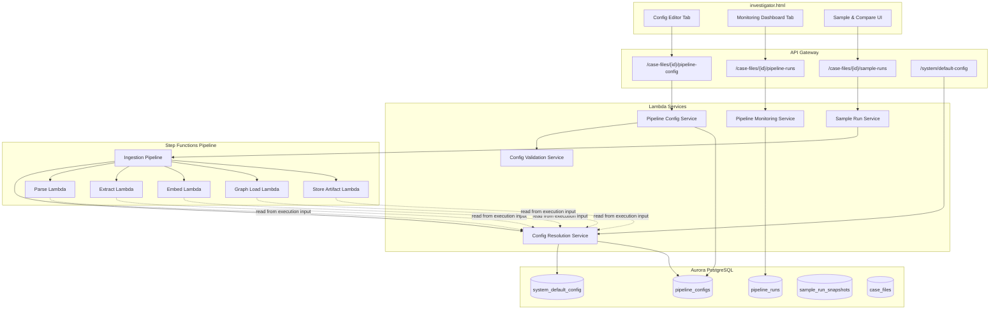
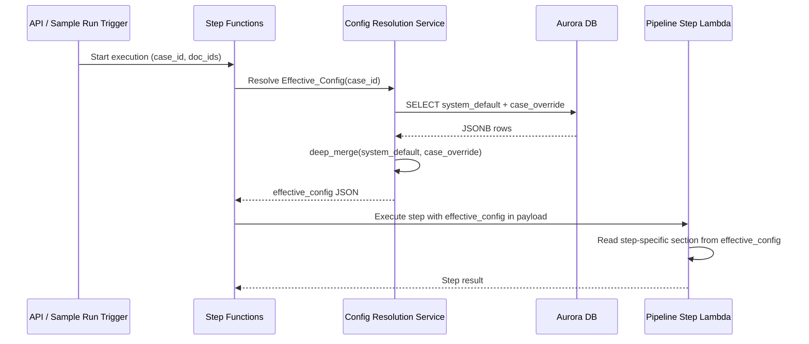
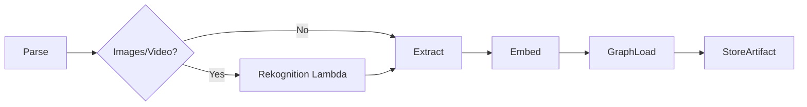
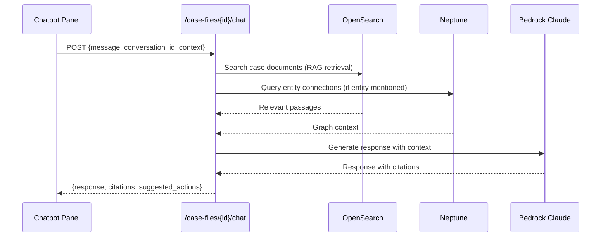
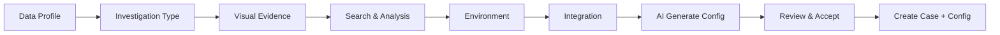
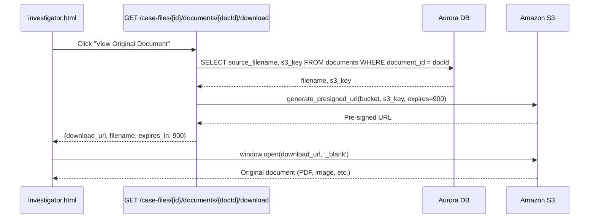
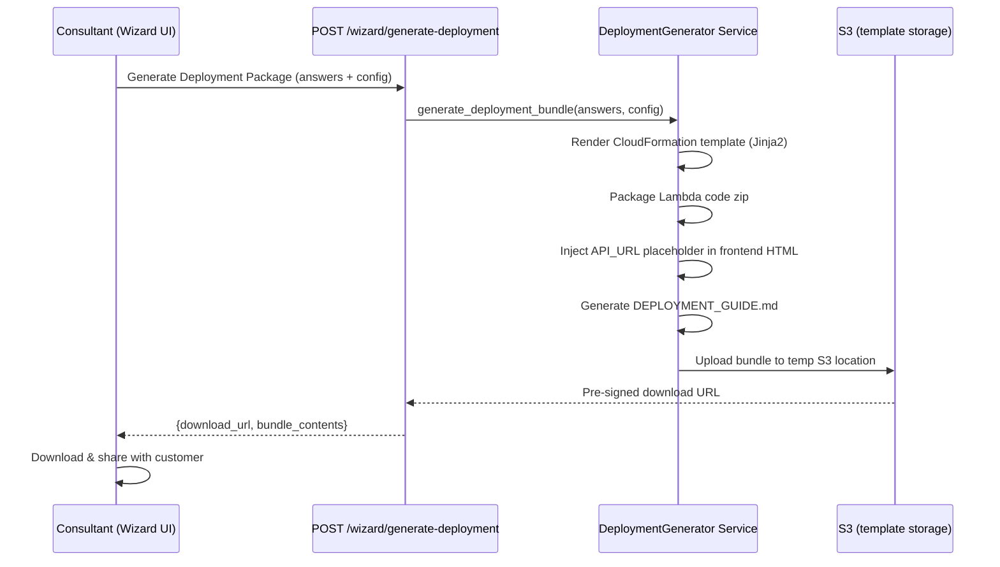
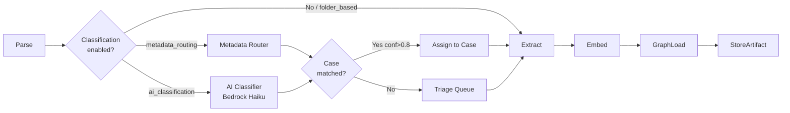
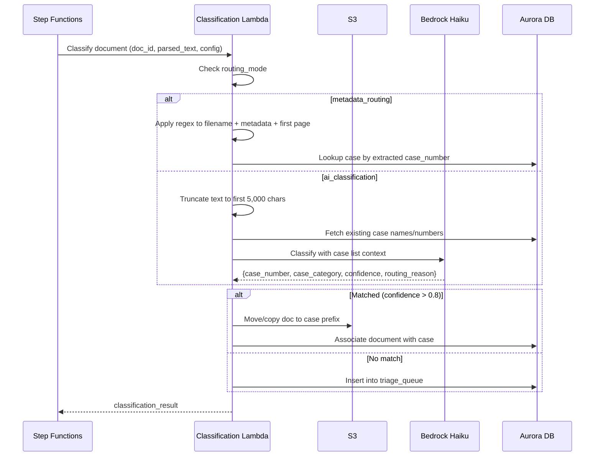

# Design Document: Configurable Pipeline

## Overview

This design introduces per-case pipeline configuration for the DOJ Investigative Case Management platform. Today, every case runs through the same hardcoded pipeline parameters. This feature adds a `pipeline_configs` table in Aurora that stores per-case JSON configuration, a config resolution service that deep-merges system defaults with case overrides, a sample-and-compare workflow for iterative tuning, a visual config editor and monitoring dashboard in `investigator.html`, config versioning with rollback, and config portability via export/import.

The design preserves the existing Step Functions orchestration and Lambda step architecture. Each Lambda step gains a config-resolution preamble that fetches the Effective_Config once per execution and reads its section. No new AWS services are introduced — everything runs on Aurora, Lambda, API Gateway, S3, Step Functions, Neptune, OpenSearch, and Bedrock (GovCloud compatible).

### Key Design Decisions

1. **JSONB in Aurora** — Pipeline configs are stored as JSONB columns in Aurora PostgreSQL, enabling partial queries and JSON path operations without a separate config store.
2. **Deep merge at read time** — The Effective_Config is computed on-the-fly by a single SQL query using `jsonb_deep_merge(system_default, case_override)`, not materialized. This avoids stale caches when system defaults change.
3. **Config resolved once per execution** — The Step Functions state machine passes the resolved config as part of the execution input. Individual Lambda steps read from this payload, not from the database, ensuring consistency across steps and eliminating per-step DB calls.
4. **Sample runs reuse the same pipeline** — Sample_Runs are regular Step Functions executions with a `sample_mode: true` flag and a restricted document list. No separate pipeline is needed.
5. **Quality score is a weighted formula** — The Pipeline Quality Score is a deterministic 0-100 score computed from four metrics with fixed weights, making it reproducible and comparable across runs.

## Architecture

### High-Level Architecture



### Data Flow: Config Resolution at Pipeline Execution




## Components and Interfaces

### 1. Config Resolution Service (`src/services/config_resolution_service.py`)

Responsible for computing the Effective_Config by deep-merging system defaults with case overrides.

```python
class ConfigResolutionService:
    def __init__(self, aurora_cm: ConnectionManager):
        self.aurora_cm = aurora_cm

    def resolve_effective_config(self, case_id: str) -> EffectiveConfig:
        """Single Aurora query: deep merge system default + case override.
        Returns EffectiveConfig with origin annotations (inherited vs overridden)."""

    def get_system_default(self) -> dict:
        """Return the active system default config_json."""

    def get_case_override(self, case_id: str) -> dict | None:
        """Return the active case-level Pipeline_Config config_json, or None."""

    @staticmethod
    def deep_merge(base: dict, override: dict) -> dict:
        """Recursive deep merge. Override values replace base at leaf level.
        Lists are replaced wholesale (not appended)."""
```

**Deep Merge Rules:**
- For each key in `override`, if both `base[key]` and `override[key]` are dicts, recurse.
- Otherwise, `override[key]` replaces `base[key]`.
- Keys in `base` not present in `override` are preserved.
- Keys in `override` not present in `base` are rejected (validation catches unknown keys).

### 2. Pipeline Config Service (`src/services/pipeline_config_service.py`)

CRUD operations on pipeline configs with versioning.

```python
class PipelineConfigService:
    def __init__(self, aurora_cm: ConnectionManager, validator: ConfigValidationService,
                 resolution: ConfigResolutionService):
        ...

    def create_or_update_config(self, case_id: str, config_json: dict, created_by: str) -> ConfigVersion:
        """Validate, deactivate previous version, insert new version, return ConfigVersion."""

    def get_active_config(self, case_id: str) -> PipelineConfig | None:
        """Return the active Pipeline_Config for a case, or None."""

    def list_versions(self, case_id: str) -> list[ConfigVersion]:
        """List all config versions for a case, ordered by version desc."""

    def get_version(self, case_id: str, version: int) -> ConfigVersion:
        """Return a specific config version."""

    def rollback_to_version(self, case_id: str, target_version: int, created_by: str) -> ConfigVersion:
        """Create a new version with the content of target_version."""

    def export_config(self, case_id: str) -> dict:
        """Export active config with metadata header."""

    def import_config(self, case_id: str, export_doc: dict, created_by: str) -> ConfigVersion:
        """Validate and import an exported config, creating a new version."""

    def apply_template(self, case_id: str, template_name: str, created_by: str) -> ConfigVersion:
        """Apply a named Config_Template as the case's Pipeline_Config."""
```

### 3. Config Validation Service (`src/services/config_validation_service.py`)

```python
class ConfigValidationService:
    SUPPORTED_ENTITY_TYPES: set[str]  # from EntityType enum
    VALID_LOAD_STRATEGIES = {"bulk_csv", "gremlin"}
    VALID_PDF_METHODS = {"text", "ocr", "hybrid"}
    VALID_ARTIFACT_FORMATS = {"json", "jsonl"}

    def validate(self, config_json: dict) -> list[ValidationError]:
        """Validate all fields. Returns empty list if valid.
        Each ValidationError has field_path and reason."""

    def _validate_parse(self, section: dict) -> list[ValidationError]: ...
    def _validate_extract(self, section: dict) -> list[ValidationError]: ...
    def _validate_embed(self, section: dict) -> list[ValidationError]: ...
    def _validate_graph_load(self, section: dict) -> list[ValidationError]: ...
    def _validate_store_artifact(self, section: dict) -> list[ValidationError]: ...
    def _check_unknown_keys(self, config_json: dict) -> list[ValidationError]: ...
```

### 4. Sample Run Service (`src/services/sample_run_service.py`)

```python
class SampleRunService:
    def __init__(self, aurora_cm: ConnectionManager, sf_client, config_resolution: ConfigResolutionService):
        ...

    def start_sample_run(self, case_id: str, document_ids: list[str], created_by: str) -> SampleRun:
        """Start a Step Functions execution in sample mode. Store run record."""

    def get_sample_run(self, run_id: str) -> SampleRun:
        """Get sample run details including status and snapshot."""

    def list_sample_runs(self, case_id: str) -> list[SampleRun]:
        """List all sample runs for a case."""

    def compare_runs(self, run_id_a: str, run_id_b: str) -> SampleRunComparison:
        """Compute diff between two sample run snapshots."""

    def compute_quality_score(self, snapshot: SampleRunSnapshot) -> QualityScore:
        """Compute Pipeline Quality Score from snapshot metrics."""
```

### 5. Pipeline Monitoring Service (`src/services/pipeline_monitoring_service.py`)

```python
class PipelineMonitoringService:
    def __init__(self, aurora_cm: ConnectionManager, sf_client):
        ...

    def get_pipeline_status(self, case_id: str) -> PipelineStatus:
        """Current execution status: step, docs processed, remaining, elapsed."""

    def get_run_metrics(self, run_id: str) -> PipelineRunMetrics:
        """Entity quality metrics, processing speed, error rates, cost estimate."""

    def list_runs(self, case_id: str, limit: int = 20) -> list[PipelineRunSummary]:
        """List recent pipeline runs for a case."""

    def get_step_details(self, run_id: str, step_name: str) -> StepDetail:
        """Per-step metrics, config used, recent errors, processing history."""
```

### 6. API Lambda Handlers (`src/lambdas/api/pipeline_config.py`)

New API endpoints routed through a single Lambda:

| Method | Path | Handler | Description |
|--------|------|---------|-------------|
| GET | `/case-files/{id}/pipeline-config` | `get_effective_config` | Returns Effective_Config with origin annotations |
| PUT | `/case-files/{id}/pipeline-config` | `update_config` | Create/update case Pipeline_Config |
| GET | `/case-files/{id}/pipeline-config/versions` | `list_versions` | List all config versions |
| GET | `/case-files/{id}/pipeline-config/versions/{v}` | `get_version` | Get specific version |
| POST | `/case-files/{id}/pipeline-config/rollback` | `rollback` | Rollback to a target version |
| POST | `/case-files/{id}/pipeline-config/export` | `export_config` | Export active config |
| POST | `/case-files/{id}/pipeline-config/import` | `import_config` | Import config from JSON |
| POST | `/case-files/{id}/pipeline-config/template` | `apply_template` | Apply a named template |
| POST | `/case-files/{id}/sample-runs` | `start_sample_run` | Start a sample run |
| GET | `/case-files/{id}/sample-runs` | `list_sample_runs` | List sample runs |
| GET | `/case-files/{id}/sample-runs/{run_id}` | `get_sample_run` | Get sample run details |
| POST | `/case-files/{id}/sample-runs/compare` | `compare_runs` | Compare two sample runs |
| GET | `/case-files/{id}/pipeline-runs` | `list_pipeline_runs` | List pipeline runs |
| GET | `/case-files/{id}/pipeline-runs/{run_id}` | `get_run_metrics` | Get run metrics |
| GET | `/case-files/{id}/pipeline-runs/{run_id}/steps/{step}` | `get_step_details` | Per-step drill-down |
| GET | `/system/default-config` | `get_system_default` | Get system default config |
| PUT | `/system/default-config` | `update_system_default` | Update system default config |
| POST | `/system/default-config/export` | `export_system_default` | Export system default |
| POST | `/system/default-config/import` | `import_system_default` | Import system default |

### 7. Frontend Components (in `investigator.html`)

**Config Editor Tab:**
- Pipeline flow diagram: 5 step cards (Parse → Extract → Embed → Graph Load → Store Artifact) connected by arrows
- Click a step card → slide-out panel with form fields for that step's parameters
- Each field shows an "inherited" badge or "overridden" badge based on origin
- "Reset to Default" button per field and per section
- JSON editor toggle with syntax highlighting (using a `<textarea>` with basic highlighting)
- Template selector dropdown (antitrust, criminal, financial_fraud)
- Save button → calls PUT `/pipeline-config`, shows new version number

**Monitoring Dashboard Tab:**
- Pipeline step cards row (Upload → Parse → Extract → Embed → Vector Index → Knowledge Graph → RAG KB)
- Each card shows: step name, AWS service, status indicator (idle/running/completed/error), "Click for status" link
- Click card → detail overlay with: service status, stat cards (item count, latency, cost), config section, recent runs table, error log
- Real-time polling every 10 seconds when a pipeline is running

**Sample & Compare UI:**
- Document selector (multi-select from case documents, max 50)
- "Run Sample" button → starts sample run, shows progress
- Results panel: entity list grouped by type with confidence bars
- Compare mode: side-by-side snapshots with diff highlighting (added=green, removed=red, changed=yellow)
- Quality Score display: single 0-100 number with breakdown chart


## Data Models

### Aurora Database Schema

#### `system_default_config` Table

```sql
CREATE TABLE system_default_config (
    config_id       UUID PRIMARY KEY DEFAULT gen_random_uuid(),
    version         INTEGER NOT NULL,
    config_json     JSONB NOT NULL,
    created_at      TIMESTAMPTZ NOT NULL DEFAULT now(),
    created_by      TEXT NOT NULL,
    is_active       BOOLEAN NOT NULL DEFAULT TRUE,
    CONSTRAINT uq_system_default_active UNIQUE (is_active) WHERE (is_active = TRUE)
);

CREATE INDEX idx_system_default_active ON system_default_config (is_active) WHERE is_active = TRUE;
```

#### `pipeline_configs` Table

```sql
CREATE TABLE pipeline_configs (
    config_id       UUID PRIMARY KEY DEFAULT gen_random_uuid(),
    case_id         UUID NOT NULL REFERENCES case_files(case_id) ON DELETE CASCADE,
    version         INTEGER NOT NULL,
    config_json     JSONB NOT NULL,
    created_at      TIMESTAMPTZ NOT NULL DEFAULT now(),
    created_by      TEXT NOT NULL,
    is_active       BOOLEAN NOT NULL DEFAULT FALSE,
    CONSTRAINT uq_pipeline_config_version UNIQUE (case_id, version),
    CONSTRAINT uq_pipeline_config_active UNIQUE (case_id, is_active) WHERE (is_active = TRUE)
);

CREATE INDEX idx_pipeline_configs_case_active ON pipeline_configs (case_id, is_active) WHERE is_active = TRUE;
CREATE INDEX idx_pipeline_configs_case_version ON pipeline_configs (case_id, version DESC);
```

#### `pipeline_runs` Table

```sql
CREATE TABLE pipeline_runs (
    run_id              UUID PRIMARY KEY DEFAULT gen_random_uuid(),
    case_id             UUID NOT NULL REFERENCES case_files(case_id) ON DELETE CASCADE,
    config_version      INTEGER NOT NULL,
    effective_config    JSONB NOT NULL,
    is_sample_run       BOOLEAN NOT NULL DEFAULT FALSE,
    document_ids        TEXT[] NOT NULL,
    document_count      INTEGER NOT NULL,
    status              TEXT NOT NULL DEFAULT 'pending'
                        CHECK (status IN ('pending', 'running', 'completed', 'failed')),
    step_statuses       JSONB NOT NULL DEFAULT '{}',
    started_at          TIMESTAMPTZ,
    completed_at        TIMESTAMPTZ,
    created_by          TEXT NOT NULL,
    sf_execution_arn    TEXT,
    -- Aggregate metrics (populated on completion)
    total_entities      INTEGER,
    total_relationships INTEGER,
    entity_type_counts  JSONB,
    avg_confidence      FLOAT,
    noise_ratio         FLOAT,
    docs_per_minute     FLOAT,
    avg_entities_per_doc FLOAT,
    failed_doc_count    INTEGER DEFAULT 0,
    failure_rate        FLOAT,
    estimated_cost_usd  FLOAT,
    total_input_tokens  INTEGER,
    total_output_tokens INTEGER,
    quality_score       FLOAT,
    quality_breakdown   JSONB
);

CREATE INDEX idx_pipeline_runs_case ON pipeline_runs (case_id, started_at DESC);
CREATE INDEX idx_pipeline_runs_sample ON pipeline_runs (case_id, is_sample_run) WHERE is_sample_run = TRUE;
```

#### `pipeline_step_results` Table

```sql
CREATE TABLE pipeline_step_results (
    id              UUID PRIMARY KEY DEFAULT gen_random_uuid(),
    run_id          UUID NOT NULL REFERENCES pipeline_runs(run_id) ON DELETE CASCADE,
    step_name       TEXT NOT NULL CHECK (step_name IN ('parse', 'extract', 'embed', 'graph_load', 'store_artifact')),
    document_id     TEXT,
    status          TEXT NOT NULL CHECK (status IN ('pending', 'running', 'completed', 'failed')),
    started_at      TIMESTAMPTZ,
    completed_at    TIMESTAMPTZ,
    duration_ms     INTEGER,
    metrics_json    JSONB NOT NULL DEFAULT '{}',
    error_message   TEXT,
    CONSTRAINT uq_step_result UNIQUE (run_id, step_name, document_id)
);

CREATE INDEX idx_step_results_run ON pipeline_step_results (run_id, step_name);
```

#### `sample_run_snapshots` Table

```sql
CREATE TABLE sample_run_snapshots (
    snapshot_id     UUID PRIMARY KEY DEFAULT gen_random_uuid(),
    run_id          UUID NOT NULL REFERENCES pipeline_runs(run_id) ON DELETE CASCADE,
    case_id         UUID NOT NULL REFERENCES case_files(case_id) ON DELETE CASCADE,
    config_version  INTEGER NOT NULL,
    snapshot_name   TEXT,
    entities        JSONB NOT NULL DEFAULT '[]',
    relationships   JSONB NOT NULL DEFAULT '[]',
    quality_metrics JSONB NOT NULL DEFAULT '{}',
    created_at      TIMESTAMPTZ NOT NULL DEFAULT now()
);

CREATE INDEX idx_snapshots_case ON sample_run_snapshots (case_id, created_at DESC);
```

### System Default Config JSON Structure

```json
{
  "parse": {
    "pdf_method": "text",
    "ocr_enabled": false,
    "table_extraction_enabled": false
  },
  "extract": {
    "prompt_template": "default_investigative_v1",
    "entity_types": ["person", "organization", "location", "date", "event",
                     "phone_number", "email", "address", "account_number",
                     "vehicle", "financial_amount"],
    "llm_model_id": "anthropic.claude-3-sonnet-20240229-v1:0",
    "chunk_size_chars": 8000,
    "confidence_threshold": 0.5,
    "relationship_inference_enabled": true
  },
  "embed": {
    "embedding_model_id": "amazon.titan-embed-text-v1",
    "search_tier": "standard",
    "opensearch_settings": {
      "index_refresh_interval": "30s",
      "number_of_replicas": 1
    }
  },
  "graph_load": {
    "load_strategy": "bulk_csv",
    "batch_size": 500,
    "normalization_rules": {
      "case_folding": true,
      "trim_whitespace": true,
      "alias_merging": false,
      "abbreviation_expansion": false
    }
  },
  "store_artifact": {
    "artifact_format": "json",
    "include_raw_text": false
  }
}
```

### Config Templates

```python
CONFIG_TEMPLATES = {
    "antitrust": {
        "extract": {
            "entity_types": ["person", "organization", "financial_amount", "date", "event", "email", "address"],
            "confidence_threshold": 0.6,
            "chunk_size_chars": 10000,
            "relationship_inference_enabled": True
        },
        "graph_load": {
            "normalization_rules": {"case_folding": True, "alias_merging": True, "abbreviation_expansion": True}
        }
    },
    "criminal": {
        "extract": {
            "entity_types": ["person", "location", "date", "event", "phone_number", "vehicle", "address", "organization"],
            "confidence_threshold": 0.4,
            "chunk_size_chars": 6000
        },
        "graph_load": {
            "normalization_rules": {"case_folding": True, "alias_merging": True}
        }
    },
    "financial_fraud": {
        "extract": {
            "entity_types": ["person", "organization", "account_number", "financial_amount", "date", "email", "address"],
            "confidence_threshold": 0.55,
            "chunk_size_chars": 8000,
            "relationship_inference_enabled": True
        },
        "embed": {
            "search_tier": "enterprise"
        },
        "graph_load": {
            "normalization_rules": {"case_folding": True, "alias_merging": True, "abbreviation_expansion": True}
        }
    }
}
```

### Pydantic Models

```python
class PipelineConfig(BaseModel):
    config_id: UUID
    case_id: UUID
    version: int
    config_json: dict
    created_at: datetime
    created_by: str
    is_active: bool

class ConfigVersion(BaseModel):
    config_id: UUID
    case_id: UUID
    version: int
    config_json: dict
    created_at: datetime
    created_by: str

class EffectiveConfig(BaseModel):
    case_id: UUID
    config_version: int | None  # None if using only system defaults
    effective_json: dict
    origins: dict  # {"parse.pdf_method": "system_default", "extract.confidence_threshold": "case_override", ...}

class SampleRun(BaseModel):
    run_id: UUID
    case_id: UUID
    config_version: int
    document_ids: list[str]
    status: str  # pending, running, completed, failed
    started_at: datetime | None
    completed_at: datetime | None
    created_by: str

class QualityScore(BaseModel):
    overall: float  # 0-100
    confidence_avg: float  # 0-100 (avg_confidence * 100)
    type_diversity: float  # 0-100
    relationship_density: float  # 0-100
    noise_ratio_score: float  # 0-100 (inverted: lower noise = higher score)

class SampleRunComparison(BaseModel):
    run_a: SampleRunSnapshot
    run_b: SampleRunSnapshot
    entities_added: list[dict]
    entities_removed: list[dict]
    entities_changed: list[dict]  # confidence or type changes
    relationship_changes: list[dict]
    quality_a: QualityScore
    quality_b: QualityScore
    quality_delta: dict  # per-metric delta

class ValidationError(BaseModel):
    field_path: str  # e.g., "extract.confidence_threshold"
    reason: str      # e.g., "Must be between 0.0 and 1.0"

class StepDetail(BaseModel):
    step_name: str
    service_status: str  # Active/Inactive
    item_count: int
    metrics: dict  # step-specific metrics
    config_values: dict  # Effective_Config values for this step
    config_origins: dict  # inherited vs overridden per field
    recent_runs: list[dict]  # last 5 runs
    recent_errors: list[dict]  # last 10 errors
```

### Quality Score Computation

The Pipeline Quality Score is a weighted average of four normalized metrics:

```python
def compute_quality_score(snapshot: SampleRunSnapshot) -> QualityScore:
    entities = snapshot.entities
    relationships = snapshot.relationships

    # 1. Confidence Average (weight: 0.35)
    confidences = [e["confidence"] for e in entities]
    confidence_avg = (sum(confidences) / len(confidences)) * 100 if confidences else 0

    # 2. Type Diversity (weight: 0.20)
    # Ratio of distinct entity types present vs total supported types
    distinct_types = len(set(e["entity_type"] for e in entities))
    total_supported = len(EntityType)  # 14 types
    type_diversity = (distinct_types / total_supported) * 100

    # 3. Relationship Density (weight: 0.25)
    # edges per node, capped at 3.0 for normalization
    node_count = len(entities) if entities else 1
    edge_count = len(relationships)
    raw_density = edge_count / node_count
    relationship_density = min(raw_density / 3.0, 1.0) * 100

    # 4. Noise Ratio Score (weight: 0.20)
    # Inverted: lower noise = higher score
    threshold = snapshot.config.get("extract", {}).get("confidence_threshold", 0.5)
    below_threshold = sum(1 for e in entities if e["confidence"] < threshold)
    noise_ratio = below_threshold / len(entities) if entities else 0
    noise_ratio_score = (1.0 - noise_ratio) * 100

    overall = (
        confidence_avg * 0.35 +
        type_diversity * 0.20 +
        relationship_density * 0.25 +
        noise_ratio_score * 0.20
    )

    return QualityScore(
        overall=round(overall, 1),
        confidence_avg=round(confidence_avg, 1),
        type_diversity=round(type_diversity, 1),
        relationship_density=round(relationship_density, 1),
        noise_ratio_score=round(noise_ratio_score, 1),
    )
```

### Effective_Config Resolution SQL

```sql
-- Single query to resolve Effective_Config for a case
SELECT
    sd.config_json AS system_default,
    pc.config_json AS case_override,
    pc.version AS config_version
FROM system_default_config sd
LEFT JOIN pipeline_configs pc
    ON pc.case_id = $1 AND pc.is_active = TRUE
WHERE sd.is_active = TRUE;
```

The application layer then calls `deep_merge(system_default, case_override or {})` to produce the Effective_Config.

### Config Integration with Pipeline Steps

The Step Functions state machine is modified to add a `ResolveConfig` step at the start:

```json
{
  "ResolveConfig": {
    "Type": "Task",
    "Resource": "${ConfigResolutionLambdaArn}",
    "Parameters": {
      "case_id.$": "$.case_id"
    },
    "ResultPath": "$.effective_config",
    "Next": "CheckUploadResult"
  }
}
```

Each subsequent Lambda step receives `$.effective_config` in its event payload and reads its section:

```python
# In each Lambda handler:
effective_config = event.get("effective_config", {})
step_config = effective_config.get("extract", {})  # or "parse", "embed", etc.
confidence_threshold = step_config.get("confidence_threshold", 0.5)
```

### Bedrock Cost Estimation

```python
def estimate_bedrock_cost(model_id: str, input_tokens: int, output_tokens: int) -> float:
    """Estimate cost in USD based on Bedrock pricing."""
    PRICING = {
        "anthropic.claude-3-sonnet-20240229-v1:0": {"input": 3.0 / 1_000_000, "output": 15.0 / 1_000_000},
        "anthropic.claude-3-haiku-20240307-v1:0": {"input": 0.25 / 1_000_000, "output": 1.25 / 1_000_000},
        "amazon.titan-embed-text-v1": {"input": 0.1 / 1_000_000, "output": 0.0},
    }
    rates = PRICING.get(model_id, {"input": 3.0 / 1_000_000, "output": 15.0 / 1_000_000})
    return input_tokens * rates["input"] + output_tokens * rates["output"]
```


## Correctness Properties

*A property is a characteristic or behavior that should hold true across all valid executions of a system — essentially, a formal statement about what the system should do. Properties serve as the bridge between human-readable specifications and machine-verifiable correctness guarantees.*

### Property 1: Deep merge preserves base keys and overrides leaf values

*For any* system default config and any case override config (both valid), the Effective_Config produced by `deep_merge(system_default, case_override)` should satisfy: (a) every leaf key present in the system default but absent from the case override appears in the result with the system default's value, (b) every leaf key present in the case override appears in the result with the case override's value, and (c) no keys appear in the result that are not in either input.

**Validates: Requirements 2.1, 2.2, 2.3, 2.4**

### Property 2: Deep merge with empty override is identity

*For any* valid system default config, `deep_merge(system_default, {})` should produce a result equal to the system default config.

**Validates: Requirements 2.1**

### Property 3: Config validation accepts valid configs and rejects invalid ones

*For any* config_json where confidence_threshold is in [0.0, 1.0], chunk_size_chars is in [500, 100000], entity_types contains only values from the EntityType enum, load_strategy is in {"bulk_csv", "gremlin"}, and all top-level keys are in {"parse", "extract", "embed", "graph_load", "store_artifact"} with only recognized sub-keys, validation should return an empty error list. For any config_json violating any of these constraints, validation should return a non-empty error list containing at least one ValidationError with the correct field_path.

**Validates: Requirements 1.3, 1.4, 1.5, 1.6, 1.7, 1.8, 2.6, 8.1, 8.2, 8.3, 8.4, 8.5, 8.6**

### Property 4: Config version numbers are monotonically increasing

*For any* case and any sequence of N config create/update operations, the resulting version numbers should form a strictly increasing sequence (version_1 < version_2 < ... < version_N), and listing all versions should return exactly N records.

**Validates: Requirements 3.1, 3.4, 3.6**

### Property 5: Config rollback round-trip

*For any* case with config versions [v1, v2, ..., vN], rolling back to version K (where K < N) should create a new version vN+1 whose config_json is equal to version K's config_json, and vN+1's version number should be greater than vN.

**Validates: Requirements 3.3, 3.5**

### Property 6: Config export/import round-trip

*For any* case with an active Pipeline_Config, exporting the config and then importing it into a different case should produce a new Config_Version whose config_json is equal to the original config_json.

**Validates: Requirements 9.1, 9.2, 9.3**

### Property 7: System default export/import round-trip

*For any* active System_Default_Config, exporting and then importing should produce a new system default version whose config_json is equal to the original.

**Validates: Requirements 9.4, 9.5**

### Property 8: Pipeline execution uses snapshotted config

*For any* pipeline run, the effective_config stored in the pipeline_runs record should equal the Effective_Config that was resolved at execution start, and should not change even if the case's Pipeline_Config is updated after the run starts.

**Validates: Requirements 3.2, 4.6, 10.2**

### Property 9: Each pipeline step reads exactly its named section

*For any* Effective_Config and any pipeline step name S in {"parse", "extract", "embed", "graph_load", "store_artifact"}, the step should read parameters only from `effective_config[S]`, and the parameter values used should match the values in that section.

**Validates: Requirements 4.1, 4.2, 4.3, 4.4, 4.5**

### Property 10: Origin annotations correctly classify inherited vs overridden

*For any* system default config and case override config, the origins dict in the EffectiveConfig should label each leaf key as "system_default" if the key is not present in the case override, and "case_override" if the key is present in the case override.

**Validates: Requirements 2.5, 11.5**

### Property 11: Quality score is deterministic and bounded

*For any* set of entities (each with entity_type and confidence) and relationships, the computed Pipeline Quality Score should be in [0, 100], and computing it twice with the same inputs should produce the same result. The breakdown components (confidence_avg, type_diversity, relationship_density, noise_ratio_score) should each be in [0, 100] and sum to the overall score when weighted by (0.35, 0.20, 0.25, 0.20).

**Validates: Requirements 12.4**

### Property 12: Quality score comparison deltas are correct

*For any* two QualityScore values A and B, the delta for each metric should equal B.metric - A.metric, and the overall delta should equal B.overall - A.overall.

**Validates: Requirements 7.6, 12.5**

### Property 13: Entity quality metrics are correctly computed

*For any* list of extracted entities with confidence scores and a confidence_threshold, the noise_ratio should equal (count of entities with confidence < threshold) / (total entity count), the avg_confidence should equal the mean of all confidence values, and entity_type_counts should equal the frequency count of each entity_type in the list.

**Validates: Requirements 7.2**

### Property 14: Bedrock cost estimation is deterministic

*For any* model_id with known pricing, input_token_count, and output_token_count, the estimated cost should equal `input_tokens * input_rate + output_tokens * output_rate`, and computing it twice should produce the same result.

**Validates: Requirements 7.5**

### Property 15: Sample run snapshot comparison diff is correct

*For any* two entity lists A and B, the comparison should identify: entities_added = entities in B not in A (by canonical_name+type), entities_removed = entities in A not in B, entities_changed = entities present in both but with different confidence or type values. The union of added, removed, and unchanged entities should account for all entities in both lists.

**Validates: Requirements 5.3**

### Property 16: Config templates produce valid configs

*For any* template name in the supported set (antitrust, criminal, financial_fraud), applying the template should produce a config_json that passes validation with zero errors.

**Validates: Requirements 6.6**

### Property 17: Removing a case override reverts to system default

*For any* Effective_Config where a field is overridden, removing that field from the case override and re-resolving should produce an Effective_Config where that field's value equals the System_Default_Config value.

**Validates: Requirements 6.4**

### Property 18: Sample run processes exactly the specified documents

*For any* list of 1-50 document IDs submitted to a sample run, the pipeline_runs record should contain exactly those document IDs, and the document_count should equal the length of the list.

**Validates: Requirements 5.1, 5.6**

### Property 19: Concurrent config resolution is independent per case

*For any* two cases with different Pipeline_Configs, resolving their Effective_Configs should produce different results that each correctly reflect their own case override merged with the shared system default.

**Validates: Requirements 10.5**

### Property 20: Entity grouping by type is exhaustive

*For any* list of extracted entities, grouping them by entity_type should produce groups whose total count equals the original list length, with each entity appearing in exactly one group.

**Validates: Requirements 12.1**


## Error Handling

### Config Validation Errors

When a Pipeline_Config fails validation, the API returns HTTP 400 with a structured error body:

```json
{
  "error": {
    "code": "VALIDATION_ERROR",
    "message": "Pipeline configuration validation failed",
    "validation_errors": [
      {"field_path": "extract.confidence_threshold", "reason": "Must be between 0.0 and 1.0, got 1.5"},
      {"field_path": "extract.entity_types[2]", "reason": "Unsupported entity type: 'weapon'"},
      {"field_path": "graph_load.load_strategy", "reason": "Must be 'bulk_csv' or 'gremlin', got 'direct'"}
    ]
  }
}
```

All validation errors are collected and returned together (not fail-fast).

### Config Resolution Errors

- **No system default exists**: Return HTTP 500 with `SYSTEM_CONFIG_MISSING`. This is a platform misconfiguration.
- **Case not found**: Return HTTP 404 with `CASE_NOT_FOUND`.
- **Aurora connection failure**: Return HTTP 503 with `DATABASE_UNAVAILABLE`. The pipeline step retries via Step Functions retry policy.

### Pipeline Execution Errors

- **Config resolution fails at pipeline start**: The `ResolveConfig` step fails, Step Functions catches the error and routes to `SetStatusError`. The pipeline_runs record is marked `failed` with the error details.
- **Individual step failure**: Existing retry/catch logic in Step Functions handles per-step failures. The `pipeline_step_results` table records the error_message for the failed step.
- **Sample run failure**: Same error handling as full runs. The sample_run_snapshots table is not populated for failed runs.

### Import/Export Errors

- **Invalid import JSON**: Validation runs on import. If validation fails, the import is rejected with the same structured error as manual edits.
- **Version conflict on import**: The import always creates a new version, so there are no conflicts.

### Frontend Error Handling

- API errors are displayed as toast notifications in the investigator.html interface.
- Config editor shows inline validation errors next to the offending fields before the save request is sent (client-side pre-validation).
- Monitoring dashboard shows "Unable to load" states with retry buttons when API calls fail.
- Polling failures (for real-time status) are silently retried on the next interval.

## Testing Strategy

### Property-Based Testing

Property-based tests use the `hypothesis` library for Python. Each property test runs a minimum of 100 iterations with generated inputs.

Each property test is tagged with a comment referencing the design property:

```python
# Feature: configurable-pipeline, Property 1: Deep merge preserves base keys and overrides leaf values
```

**Key property tests:**

1. **Deep merge properties** (Properties 1, 2, 17): Generate random nested dicts for system default and case override. Verify merge semantics.
2. **Config validation** (Property 3): Generate random config_json values — both valid and invalid — and verify the validator accepts/rejects correctly.
3. **Version monotonicity** (Property 4): Generate random sequences of config updates and verify version ordering.
4. **Rollback round-trip** (Property 5): Generate random version histories, pick a random target, rollback, verify content equality.
5. **Export/import round-trip** (Properties 6, 7): Generate random valid configs, export, import, verify equality.
6. **Quality score** (Properties 11, 12, 13): Generate random entity lists with confidence scores, verify score computation is deterministic, bounded, and delta computation is correct.
7. **Cost estimation** (Property 14): Generate random token counts and model IDs, verify deterministic computation.
8. **Snapshot comparison** (Property 15): Generate random entity lists, compute diff, verify added+removed+unchanged accounts for all entities.
9. **Template validation** (Property 16): For each template, verify it produces a valid config.
10. **Origin annotations** (Property 10): Generate random configs with mixed inherited/overridden keys, verify origin labels.

### Unit Tests

Unit tests cover specific examples, edge cases, and integration points:

- **Edge cases for deep merge**: Empty override, empty base, deeply nested override (5+ levels), override with list replacement.
- **Validation edge cases**: confidence_threshold at exact boundaries (0.0, 1.0), chunk_size_chars at boundaries (500, 100000), empty entity_types list, unknown top-level keys.
- **Version edge cases**: First version for a case (version=1), rollback to version 1, rollback to current version.
- **Quality score edge cases**: Zero entities, single entity, all entities below threshold (noise_ratio=1.0), zero relationships.
- **Cost estimation edge cases**: Unknown model ID (uses default pricing), zero tokens.
- **Sample run edge cases**: Single document, maximum 50 documents, empty document list (rejected).
- **API handler tests**: Correct HTTP status codes, CORS headers, request validation.

### Integration Tests

- **Config resolution end-to-end**: Create system default, create case override, resolve effective config, verify merge.
- **Pipeline execution with config**: Start a pipeline with a custom config, verify each step received the correct parameters.
- **Sample run workflow**: Create config, run sample, verify snapshot, modify config, run again, compare.

### Test Configuration

- **Library**: `hypothesis` for property-based testing, `pytest` for unit tests
- **Minimum iterations**: 100 per property test (configurable via `@settings(max_examples=100)`)
- **Test location**: `tests/unit/test_config_resolution.py`, `tests/unit/test_config_validation.py`, `tests/unit/test_quality_score.py`, `tests/unit/test_pipeline_config_service.py`, `tests/unit/test_sample_run_service.py`
- **Each correctness property is implemented by a single property-based test**
- **Tag format**: `# Feature: configurable-pipeline, Property {N}: {title}`


---

## Design: Requirement 13 — Rekognition Image/Video Analysis Pipeline Step

### Architecture

The Rekognition step is an optional Lambda in the Step Functions pipeline, inserted after Parse and before Extract. It processes image/video files from the case's S3 prefix using Amazon Rekognition APIs, stores results as JSON artifacts, and feeds detected entities into the Extract and Graph Load steps.



### Rekognition Lambda (`src/lambdas/ingestion/rekognition_handler.py`)

```python
class RekognitionHandler:
    def handler(self, event, context):
        """Process images/video for a case using Rekognition."""
        case_id = event["case_id"]
        config = event.get("effective_config", {}).get("rekognition", {})
        if not config.get("enabled", False):
            return {"status": "skipped", "reason": "rekognition_disabled"}

        # List image/video files in case S3 prefix
        media_files = self._list_media_files(case_id)
        results = []
        for f in media_files:
            if f["type"] == "image":
                results.append(self._process_image(f, config))
            elif f["type"] == "video":
                results.append(self._process_video(f, config))

        # Convert Rekognition results to entity format for graph loading
        entities = self._results_to_entities(results, config)
        return {"status": "completed", "entities": entities, "media_processed": len(media_files)}

    def _process_image(self, file_info, config):
        """Run detect_faces, detect_labels, detect_text on an image."""

    def _process_video(self, file_info, config):
        """Start async video analysis jobs, poll for completion."""

    def _results_to_entities(self, results, config):
        """Convert Rekognition detections to entity format compatible with graph loader."""
```

### Pipeline_Config Rekognition Section

```json
{
  "rekognition": {
    "enabled": false,
    "watchlist_collection_id": null,
    "min_face_confidence": 0.8,
    "min_object_confidence": 0.7,
    "detect_text": true,
    "detect_moderation_labels": false,
    "video_segment_length_seconds": 60
  }
}
```

### External Rekognition Import

For cases with pre-processed Rekognition output (like the Epstein case), the handler reads existing JSON results from `s3://bucket/cases/{case_id}/rekognition-output/` and converts them to entity format without re-running Rekognition.

---

## Design: Requirement 14 — Investigative Case Assistant Chatbot

### Architecture

The chatbot is a collapsible panel in `investigator.html` that sends messages to a new API endpoint. The backend uses Bedrock with RAG — searching OpenSearch for document context and Neptune for graph context before generating responses.



### API Endpoint

| Method | Path | Description |
|--------|------|-------------|
| POST | `/case-files/{id}/chat` | Send message, get AI response |
| GET | `/case-files/{id}/chat/history` | Get conversation history |
| POST | `/case-files/{id}/chat/share` | Share finding from chat |

### Chat Lambda (`src/lambdas/api/chat.py`)

```python
class ChatHandler:
    def handle(self, event, context):
        message = body["message"]
        conversation_id = body.get("conversation_id")
        case_context = body.get("context", {})  # current entity, graph filter, etc.

        # 1. Detect intent (question, command, comparison)
        intent = self._classify_intent(message)

        # 2. Retrieve context via RAG
        doc_context = self._search_documents(case_id, message)
        graph_context = self._query_graph(case_id, message, intent)

        # 3. Build prompt with case context + retrieved context
        prompt = self._build_prompt(message, doc_context, graph_context, case_context, intent)

        # 4. Generate response via Bedrock
        response = self._invoke_bedrock(prompt)

        # 5. Extract citations and suggested actions
        citations = self._extract_citations(response, doc_context)

        # 6. Log conversation to Aurora
        self._log_conversation(case_id, conversation_id, message, response)

        return {"response": response, "citations": citations, "conversation_id": conversation_id}
```

### Supported Commands

The chatbot detects investigative commands via keyword matching and routes to specialized handlers:
- `summarize` → Full case brief generation
- `who is` → Entity profile with graph traversal
- `connections between` → Shortest path query in Neptune
- `documents mention` → Targeted OpenSearch search
- `flag` → Add investigator note to Aurora
- `timeline` → Extract date entities, sort chronologically
- `what's missing` → Gap analysis comparing entity types present vs expected
- `subpoena list` → Suggest entities/documents based on evidence gaps

### Frontend Component

Collapsible panel on the right side of `investigator.html`:
- Chat message list with user/AI message bubbles
- Input box with send button
- Citation links that open document drill-down
- "Share Finding" button per AI response
- Context indicator showing current entity/graph filter

### Aurora Schema Addition

```sql
CREATE TABLE chat_conversations (
    conversation_id UUID PRIMARY KEY DEFAULT gen_random_uuid(),
    case_id         UUID NOT NULL REFERENCES case_files(case_id),
    user_id         TEXT NOT NULL DEFAULT 'investigator',
    messages        JSONB NOT NULL DEFAULT '[]',
    created_at      TIMESTAMPTZ NOT NULL DEFAULT now(),
    updated_at      TIMESTAMPTZ NOT NULL DEFAULT now()
);
CREATE INDEX idx_chat_case ON chat_conversations (case_id, updated_at DESC);
```

---

## Design: Requirement 15 — Pipeline Configuration Wizard

### Architecture

The wizard is a multi-step form in `investigator.html` that collects customer intake answers, then calls a Bedrock-powered backend to generate an optimized Pipeline_Config, cost estimate, and architecture summary.

### Wizard Flow



### API Endpoints

| Method | Path | Description |
|--------|------|-------------|
| POST | `/wizard/generate-config` | Generate Pipeline_Config from answers |
| POST | `/wizard/estimate-cost` | Generate cost estimate from answers |
| POST | `/wizard/create-case` | Create case with generated config |
| GET | `/wizard/templates` | List available config templates |
| POST | `/wizard/export-summary` | Generate shareable HTML summary |

### Wizard Service (`src/services/wizard_service.py`)

```python
class WizardService:
    def generate_config(self, answers: dict) -> dict:
        """Map wizard answers to an optimized Pipeline_Config.
        1. Start with template based on investigation_type
        2. Adjust entity_types based on investigation goals
        3. Set pdf_method based on file formats (text vs ocr vs hybrid)
        4. Enable rekognition if images/video present
        5. Set search_tier based on volume and concurrent users
        6. Set graph_load strategy based on document count
        7. Use AI to suggest custom extraction prompt based on case type
        """

    def estimate_cost(self, answers: dict, config: dict) -> CostEstimate:
        """Compute detailed cost estimate from answers + generated config."""

    def generate_summary(self, answers: dict, config: dict, cost: CostEstimate) -> str:
        """Generate shareable HTML summary document."""
```

### Quick Mode

When `quick_mode: true`, only 5 questions are asked:
1. Total data volume (TB)
2. Document count
3. File formats (checkboxes)
4. Investigation type (dropdown)
5. AWS region

All other parameters use intelligent defaults derived from these 5 answers.

---

## Design: Requirement 16 — AI-Powered Cost Estimation

### Cost Estimation Service (`src/services/cost_estimation_service.py`)

```python
class CostEstimationService:
    def __init__(self, pricing_file: str = "config/aws_pricing.json"):
        self.pricing = self._load_pricing(pricing_file)

    def estimate(self, answers: dict, config: dict) -> CostEstimate:
        """Compute one-time + monthly costs from customer profile and config."""
        one_time = self._compute_one_time(answers, config)
        monthly = self._compute_monthly(answers, config)
        optimizations = self._suggest_optimizations(one_time, monthly, answers)
        tiers = self._compute_tiers(answers, config)  # economy, recommended, premium
        return CostEstimate(one_time=one_time, monthly=monthly,
                           optimizations=optimizations, tiers=tiers)

    def _compute_one_time(self, answers, config):
        """Textract, Bedrock extraction, embeddings, Rekognition, Lambda, S3."""

    def _compute_monthly(self, answers, config):
        """OpenSearch OCUs, Neptune NCUs, Aurora ACUs, S3, API Gateway."""

    def _suggest_optimizations(self, one_time, monthly, answers):
        """AI-generated cost reduction recommendations."""

    def _compute_tiers(self, answers, config):
        """Economy (Haiku, standard tier), Recommended (Sonnet, balanced), Premium (max quality)."""
```

### Pricing Data File (`config/aws_pricing.json`)

Externalized pricing so it can be updated without code changes:

```json
{
  "textract": {"per_1000_pages": 1.50},
  "bedrock": {
    "anthropic.claude-3-sonnet-20240229-v1:0": {"input_per_1m": 3.0, "output_per_1m": 15.0},
    "anthropic.claude-3-haiku-20240307-v1:0": {"input_per_1m": 0.25, "output_per_1m": 1.25},
    "amazon.titan-embed-text-v1": {"input_per_1m": 0.10, "output_per_1m": 0.0}
  },
  "opensearch_serverless": {"ocu_per_hour": 0.24},
  "neptune_serverless": {"ncu_per_hour": 0.22},
  "aurora_serverless": {"acu_per_hour": 0.12},
  "rekognition": {"image_per_1000": 1.0, "face_compare_each": 0.10, "video_per_min": 0.10},
  "s3": {"gb_per_month": 0.023},
  "lambda": {"per_1m_requests": 0.20, "per_gb_second": 0.0000166667}
}
```

### Cost vs Quality Chart

The frontend displays a scatter chart showing how different model selections and confidence thresholds affect both cost and expected quality score, helping the consultant make informed trade-offs.

---

## Design: Requirement 17 — Case Assessment Dashboard

### Architecture

The Case Assessment Dashboard is the first section displayed when an investigator selects a case. It aggregates data from Neptune (graph metrics), OpenSearch (document counts), and Aurora (case metadata) to produce an AI-generated case overview.

### Components

1. **Case Strength Score (0-100)** — Computed from:
   - Evidence volume: `min(doc_count / 100, 1.0) * 20`
   - Entity density: `min(entity_count / doc_count, 5.0) / 5.0 * 20`
   - Relationship density: `min(edge_count / node_count, 3.0) / 3.0 * 20`
   - Document corroboration: `min(multi_doc_entities / total_entities, 0.5) / 0.5 * 20`
   - Cross-case connections: `min(cross_case_matches / 10, 1.0) * 20`

2. **Evidence Coverage Checklist** — Query Neptune for entity type counts, compare against expected types for the case category.

3. **Key Subjects** — Top 10 persons by degree centrality in Neptune.

4. **Critical Leads** — AI-generated from entities with high connectivity but few document references (potential gaps).

5. **Resource Recommendations** — Bedrock generates actionable bullet points from the case data.

6. **Case Timeline** — Date entities sorted chronologically with document density per period.

### API Endpoint

| Method | Path | Description |
|--------|------|-------------|
| GET | `/case-files/{id}/assessment` | Get case assessment dashboard data |
| POST | `/case-files/{id}/assessment/brief` | Generate AI case brief |

### Assessment Service (`src/services/case_assessment_service.py`)

```python
class CaseAssessmentService:
    def get_assessment(self, case_id: str) -> CaseAssessment:
        """Aggregate metrics from Neptune, OpenSearch, Aurora. Compute strength score."""

    def generate_brief(self, case_id: str) -> str:
        """Use Bedrock to generate a comprehensive case brief from all evidence."""

    def _compute_strength_score(self, metrics: dict) -> int:
        """Deterministic 0-100 score from case metrics."""

    def _identify_critical_leads(self, case_id: str) -> list:
        """Find high-connectivity entities with low document coverage."""

    def _generate_resource_recommendations(self, case_id: str, metrics: dict) -> list:
        """AI-generated actionable recommendations for investigator focus."""
```

---

## Design: Requirement 18 — Case Portfolio Dashboard (Manager View)

### Architecture

A dedicated landing page/tab that replaces the simple sidebar list for managers with 20+ cases. Aggregates case metrics across all cases and provides grouping, filtering, sorting, and resource allocation tools.

### Frontend Component

New tab in `investigator.html`: "📊 Portfolio" — visible when user has manager role or when case count > 20.

### Layout

```
┌─────────────────────────────────────────────────────────┐
│ PORTFOLIO SUMMARY BAR                                    │
│ [Active: 47] [Investigating: 23] [Archived: 12]         │
│ [Total Docs: 1.2M] [Entities: 450K] [Needs Attention: 5]│
├─────────────────────────────────────────────────────────┤
│ FILTERS: [Status ▼] [Priority ▼] [Category ▼] [Team ▼] │
│ GROUP BY: [Status] [Priority] [Category] [Strength]      │
│ SORT BY: [Last Activity ▼]                               │
├─────────────────────────────────────────────────────────┤
│ ┌──────────┐ ┌──────────┐ ┌──────────┐ ┌──────────┐    │
│ │ Case Card│ │ Case Card│ │ Case Card│ │ Case Card│    │
│ │ Name     │ │ Name     │ │ Name     │ │ Name     │    │
│ │ Status   │ │ Status   │ │ Status   │ │ Status   │    │
│ │ Score:72 │ │ Score:45 │ │ Score:88 │ │ Score:31 │    │
│ │ 3.8K docs│ │ 200 docs │ │ 12K docs │ │ 50 docs  │    │
│ └──────────┘ └──────────┘ └──────────┘ └──────────┘    │
├─────────────────────────────────────────────────────────┤
│ ⚠️ CASES REQUIRING ATTENTION                             │
│ • Epstein v2 — No activity in 35 days                    │
│ • Case XYZ — Pipeline error (graph load failed)          │
│ • Case ABC — Low strength (22) with 5K docs              │
├─────────────────────────────────────────────────────────┤
│ 📊 PORTFOLIO ANALYTICS                                   │
│ [Cases Over Time chart] [Strength Distribution chart]    │
└─────────────────────────────────────────────────────────┘
```

### API Endpoints

| Method | Path | Description |
|--------|------|-------------|
| GET | `/portfolio/summary` | Aggregate stats across all cases |
| GET | `/portfolio/cases` | Filtered, sorted, paginated case list |
| PUT | `/portfolio/cases/{id}/priority` | Set case priority |
| PUT | `/portfolio/cases/{id}/assign` | Assign investigator |
| POST | `/portfolio/bulk-action` | Bulk assign/archive/prioritize |
| GET | `/portfolio/analytics` | Charts data (cases over time, etc.) |
| GET | `/portfolio/attention` | Cases requiring attention |

### Aurora Schema Additions

```sql
ALTER TABLE case_files ADD COLUMN IF NOT EXISTS priority TEXT DEFAULT 'medium'
    CHECK (priority IN ('critical', 'high', 'medium', 'low'));
ALTER TABLE case_files ADD COLUMN IF NOT EXISTS assigned_to TEXT;
ALTER TABLE case_files ADD COLUMN IF NOT EXISTS case_category TEXT;
ALTER TABLE case_files ADD COLUMN IF NOT EXISTS last_activity_at TIMESTAMPTZ DEFAULT now();
ALTER TABLE case_files ADD COLUMN IF NOT EXISTS strength_score INTEGER;
```

---

## Design: Requirement 19 — Investigator Workbench (Personal Case View)

### Architecture

A personal dashboard filtered to the current user's assigned cases, organized by urgency with AI-prioritized task lists.

### Frontend Component

New tab in `investigator.html`: "🔬 My Workbench" — shows only cases where `assigned_to` matches the current user.

### Layout

```
┌─────────────────────────────────────────────────────────┐
│ 🎯 TODAY'S PRIORITY (AI-generated)                       │
│ "Focus on Epstein case — 3 new cross-case matches found" │
│ "Review Case ABC — new evidence uploaded yesterday"       │
├─────────────────────────────────────────────────────────┤
│ SWIM LANES:                                              │
│ ┌─────────────┐ ┌─────────────┐ ┌─────────────┐        │
│ │ NEEDS ACTION│ │ ACTIVE      │ │ AWAITING    │        │
│ │ (3 cases)   │ │ (5 cases)   │ │ (2 cases)   │        │
│ │ • Case A    │ │ • Case D    │ │ • Case H    │        │
│ │ • Case B    │ │ • Case E    │ │ • Case I    │        │
│ │ • Case C    │ │ • Case F    │ │             │        │
│ └─────────────┘ └─────────────┘ └─────────────┘        │
├─────────────────────────────────────────────────────────┤
│ 📋 RECENT ACTIVITY                                       │
│ • Searched "financial transactions" in Epstein case      │
│ • Viewed entity profile: Ghislaine Maxwell               │
│ • Added finding: "Suspicious wire transfer pattern"      │
├─────────────────────────────────────────────────────────┤
│ 📝 MY FINDINGS (across all cases)                        │
│ [Searchable list of investigator notes and findings]     │
└─────────────────────────────────────────────────────────┘
```

### API Endpoints

| Method | Path | Description |
|--------|------|-------------|
| GET | `/workbench/my-cases` | Cases assigned to current user |
| GET | `/workbench/priorities` | AI-generated daily priorities |
| GET | `/workbench/activity` | Recent activity feed |
| GET | `/workbench/findings` | All findings across cases |
| POST | `/workbench/findings` | Add a new finding |
| GET | `/workbench/metrics` | Personal workload metrics |

### Workbench Service (`src/services/workbench_service.py`)

```python
class WorkbenchService:
    def get_my_cases(self, user_id: str) -> list:
        """Cases assigned to user, grouped by swim lane."""

    def get_daily_priorities(self, user_id: str) -> list:
        """AI-generated priority recommendations based on case activity."""

    def get_activity_feed(self, user_id: str, limit: int = 20) -> list:
        """Recent searches, entity views, findings from Aurora audit log."""

    def get_findings(self, user_id: str) -> list:
        """All investigator notes/findings across cases."""

    def add_finding(self, user_id: str, case_id: str, finding: dict) -> dict:
        """Add a finding/note to a case."""
```

### Aurora Schema Addition

```sql
CREATE TABLE investigator_findings (
    finding_id  UUID PRIMARY KEY DEFAULT gen_random_uuid(),
    case_id     UUID NOT NULL REFERENCES case_files(case_id),
    user_id     TEXT NOT NULL,
    finding_type TEXT NOT NULL DEFAULT 'note'
        CHECK (finding_type IN ('note', 'suspicious', 'lead', 'evidence_gap', 'recommendation')),
    title       TEXT NOT NULL,
    content     TEXT NOT NULL,
    entity_refs TEXT[],
    document_refs TEXT[],
    created_at  TIMESTAMPTZ NOT NULL DEFAULT now()
);
CREATE INDEX idx_findings_case ON investigator_findings (case_id, created_at DESC);
CREATE INDEX idx_findings_user ON investigator_findings (user_id, created_at DESC);

CREATE TABLE investigator_activity (
    activity_id UUID PRIMARY KEY DEFAULT gen_random_uuid(),
    case_id     UUID NOT NULL REFERENCES case_files(case_id),
    user_id     TEXT NOT NULL,
    action_type TEXT NOT NULL,
    action_detail JSONB NOT NULL DEFAULT '{}',
    created_at  TIMESTAMPTZ NOT NULL DEFAULT now()
);
CREATE INDEX idx_activity_user ON investigator_activity (user_id, created_at DESC);
```


---

## Design: Requirement 20 — Document Evidence Viewer with S3 Source Access

### Architecture

When an investigator drills down to Level 4 (Document Evidence) in the entity profile, a "View Original Document" button calls the case files API to generate a pre-signed S3 URL. The Lambda looks up the document's S3 key in Aurora, generates a 15-minute pre-signed URL via `s3.generate_presigned_url`, and returns it. The frontend opens the URL in a new browser tab.



### API Endpoint

| Method | Path | Description |
|--------|------|-------------|
| GET | `/case-files/{id}/documents/{docId}/download` | Generate pre-signed S3 URL for document |

### Response Format

```json
{
  "download_url": "https://bucket.s3.amazonaws.com/cases/{case_id}/raw/{filename}?X-Amz-...",
  "filename": "document_001.pdf",
  "s3_key": "cases/{case_id}/raw/document_001.pdf",
  "expires_in": 900
}
```

### S3 Key Resolution

1. Query Aurora: `SELECT source_filename, s3_key FROM documents WHERE document_id = $1 AND case_file_id = $2`
2. If `s3_key` column is populated → use it directly
3. If only `source_filename` → construct key as `cases/{case_id}/raw/{source_filename}`
4. If no Aurora record found → fall back to `cases/{case_id}/raw/{docId}`

### Frontend Integration

The Level 4 `renderL4` function in `investigator.html` displays a "📥 View Original Document from S3" button above the extracted text content. Clicking it calls `_openOriginalDoc(docId)` which fetches the pre-signed URL and opens it via `window.open()`.

### Security

- Pre-signed URLs are generated server-side by the Lambda execution role (which has `s3:GetObject` permission)
- URLs expire after 15 minutes — no persistent access granted
- The investigator never needs direct S3 credentials or IAM permissions
- Each URL is scoped to a single object (the specific document)

### Error Handling

- Document not in Aurora → fall back to convention-based S3 key
- S3 object not found → pre-signed URL will return 404 when accessed; frontend shows error alert
- S3 bucket not configured → return HTTP 500 with `CONFIG_ERROR`


---

## Design: Requirement 21 — Phased Video Processing Strategy

### Pipeline_Config Rekognition Section Update

```json
{
  "rekognition": {
    "enabled": true,
    "video_processing_mode": "skip",
    "watchlist_collection_id": null,
    "min_face_confidence": 0.8,
    "min_object_confidence": 0.7,
    "detect_text": true,
    "detect_moderation_labels": false,
    "video_segment_length_seconds": 60
  }
}
```

Valid values for `video_processing_mode`: `"skip"`, `"faces_only"`, `"targeted"`, `"full"`

### Rekognition Handler Logic

```python
def handler(event, context):
    config = event["effective_config"]["rekognition"]
    video_mode = config.get("video_processing_mode", "skip")
    
    media_files = _list_media_files(s3, bucket, case_id)
    images = [f for f in media_files if f["type"] == "image"]
    videos = [f for f in media_files if f["type"] == "video"]
    
    # Always process images
    for img in images:
        results.append(_process_image(bucket, img["s3_key"], config))
    
    # Video processing based on mode
    if video_mode == "skip":
        pass  # No video processing
    elif video_mode == "faces_only":
        for vid in videos:
            results.append(_process_video_faces_only(bucket, vid["s3_key"], config))
    elif video_mode == "targeted":
        flagged = _get_flagged_videos(case_id)  # Query Aurora for flagged docs
        for vid in videos:
            if vid["s3_key"] in flagged:
                results.append(_process_video(bucket, vid["s3_key"], config))
    elif video_mode == "full":
        for vid in videos:
            results.append(_process_video(bucket, vid["s3_key"], config))
```

### Cost Estimation Impact

The CostEstimationService computes video costs separately:

| Mode | Cost per minute | What runs |
|------|----------------|-----------|
| skip | $0 | Nothing |
| faces_only | $0.10/min | Face detection only |
| targeted | $0.20/min × flagged % | Face + labels on flagged only |
| full | $0.20/min | Face + labels on all |

### Wizard Integration

The wizard "Visual Evidence" section adds:
- "Video Processing Priority" radio: Process with initial load / Process after document analysis / Process on demand only
- Maps to: full / skip / targeted respectively
- Shows estimated cost for each option based on video hours entered

### Config Validation

Add `video_processing_mode` to `_REKOGNITION_KEYS` and validate it's one of `{"skip", "faces_only", "targeted", "full"}`.


---

## Design: Requirement 22 — One-Click Deployment Package Generator

### Architecture

The deployment package generator is a backend service that takes wizard answers and the generated Pipeline_Config, then produces a self-contained CloudFormation template + Lambda code zip + frontend bundle. The customer uploads the zip to S3, deploys the template via AWS Console, and gets a working system in 30-45 minutes.



### Deployment Generator Service (`src/services/deployment_generator.py`)

```python
class DeploymentGenerator:
    def generate_bundle(self, answers: dict, config: dict, cost_estimate: dict) -> dict:
        """Generate the complete deployment bundle.
        
        Returns:
            {
                "cfn_template": str,       # CloudFormation YAML
                "lambda_zip_key": str,     # S3 key for Lambda code zip
                "deployment_guide": str,   # Markdown deployment guide
                "download_url": str,       # Pre-signed URL for the bundle zip
            }
        """

    def _render_cfn_template(self, answers: dict, config: dict) -> str:
        """Render the parameterized CloudFormation template.
        
        Uses string substitution (not Jinja2 to avoid Lambda dependency)
        to inject:
        - Pipeline config as parameter default
        - Service sizing based on wizard answers (OCU count, NCU count, ACU count)
        - Rekognition IAM permissions only if rekognition enabled
        - OpenSearch collection type based on search_tier
        - Step Functions ASL with all pipeline steps
        """

    def _package_lambda_code(self) -> bytes:
        """Zip the src/ directory into a Lambda deployment package."""

    def _generate_deployment_guide(self, answers: dict, cost: dict) -> str:
        """Generate step-by-step deployment instructions."""

    def _create_init_lambda_code(self, config: dict) -> str:
        """Generate the custom resource Lambda that initializes Aurora schema
        and seeds the system default config on first deploy."""
```

### CloudFormation Template Structure

The template is organized into logical sections:

```yaml
AWSTemplateFormatVersion: '2010-09-09'
Description: 'Investigative Case Management Platform — generated by Pipeline Wizard'

Parameters:
  EnvironmentName: {Type: String, Default: prod}
  AdminEmail: {Type: String}
  VpcCidr: {Type: String, Default: '10.0.0.0/16'}
  DeploymentBucketName: {Type: String}
  LambdaCodeKey: {Type: String, Default: 'deployments/lambda-code.zip'}

Resources:
  # --- Networking ---
  VPC, PrivateSubnets (3 AZs), PublicSubnets, NAT Gateway, 
  VPC Endpoints (Bedrock, Secrets Manager, S3 Gateway, AOSS)

  # --- Database ---
  AuroraCluster (Serverless v2), RDSProxy, SecretsManager Secret
  NeptuneCluster (Serverless), NeptuneSubnetGroup

  # --- Search ---
  OpenSearchCollection (VECTORSEARCH or SEARCH based on tier)
  AOSS Encryption/Network/Data Access Policies
  AOSS VPC Endpoint (managed)

  # --- Compute ---
  14 Lambda Functions (all pointing to DeploymentBucketName/LambdaCodeKey)
  Step Functions State Machine (from ingestion_pipeline.json)
  
  # --- API ---
  API Gateway REST API (from api_definition.yaml)
  
  # --- Storage ---
  S3 Data Bucket, S3 Website Bucket
  
  # --- Frontend ---
  CloudFront Distribution → S3 Website Bucket
  Custom Resource Lambda (injects API URL into HTML, uploads to S3)
  
  # --- Monitoring ---
  CloudWatch Alarms (Lambda errors, Aurora CPU, Neptune latency, SFN failures, API 5xx)
  SNS Topic for alarm notifications → AdminEmail

  # --- Initialization ---
  Custom Resource: SchemaInit (creates Aurora tables, seeds default config)

Outputs:
  InvestigatorURL: !GetAtt CloudFrontDistribution.DomainName
  ApiGatewayURL: !Sub 'https://${ApiGateway}.execute-api.${AWS::Region}.amazonaws.com/v1'
  S3DataBucket: !Ref DataBucket
  AuroraEndpoint: !GetAtt AuroraCluster.Endpoint.Address
  NeptuneEndpoint: !GetAtt NeptuneCluster.Endpoint
```

### Frontend Injection

A CloudFormation custom resource Lambda runs after the API Gateway is created:
1. Reads `investigator.html` from the Lambda code zip
2. Replaces `const API_URL = 'https://...'` with the actual API Gateway URL using `Fn::Sub`
3. Uploads the modified HTML to the S3 website bucket
4. CloudFront serves it with HTTPS

### API Endpoint

| Method | Path | Description |
|--------|------|-------------|
| POST | `/wizard/generate-deployment` | Generate deployment bundle |

### Bundle Download

The bundle is packaged as a zip containing:
```
deployment-package/
├── template.yaml              # CloudFormation template
├── lambda-code.zip            # Lambda deployment package
├── DEPLOYMENT_GUIDE.md        # Step-by-step instructions
├── pipeline-config.json       # Generated Pipeline_Config
├── cost-estimate.json         # Cost breakdown
└── summary.html               # Shareable summary document
```

The zip is uploaded to a temporary S3 location with a 24-hour pre-signed URL for download.

### GovCloud Compatibility

The template generator checks `answers.get("aws_region", "")` — if it starts with `us-gov-`, it:
- Uses GovCloud-specific service endpoints
- Excludes any services not available in GovCloud
- Uses `aws-us-gov` partition in ARN construction
- Notes GovCloud-specific deployment steps in the guide


---

## Design: Requirement 23 — AI-Powered Document Classification and Case Routing

### Overview

This design adds an optional Document Classification step to the ingestion pipeline that runs BEFORE entity extraction. When bulk-ingesting unorganized document dumps (e.g., 500TB from a subpoena), the classification step reads the first 2 pages of each document to determine which case it belongs to, then routes it accordingly. Three routing modes are supported: `folder_based` (default, no classification needed), `metadata_routing` (regex-based case number extraction from filenames/metadata/text), and `ai_classification` (Bedrock Haiku reads first 2 pages to classify).

Documents that cannot be matched to an existing case are placed in a triage queue for manual assignment by investigators.

### Key Design Decisions

1. **Classification runs per-document inside the Map iterator** — The classification step is inserted into the per-document processing flow (after Parse, before Extract) rather than as a batch step. This allows the pipeline to process documents in parallel and route each one independently.
2. **Haiku for classification** — Claude 3 Haiku is used for AI classification because it's 12x cheaper than Sonnet and classification only needs the first 5,000 characters. At ~$0.0001/doc, classifying 1M documents costs ~$100.
3. **Triage queue in Aurora** — Unmatched documents are stored in a `triage_queue` table in Aurora with their classification metadata, enabling API-driven manual assignment without re-processing.
4. **Classification is idempotent** — Re-running classification on an already-classified document updates the classification result but does not duplicate the document. The `document_id` is the idempotency key.
5. **Classify-sample mode reuses sample_mode infrastructure** — The "classify first 100" feature piggybacks on the existing sample_mode flag in Step Functions, limiting the document list to the first 100 items.

### Architecture





### Components and Interfaces

#### 1. Document Classification Service (`src/services/document_classification_service.py`)

```python
class DocumentClassificationService:
    """Classifies documents and routes them to cases."""

    def __init__(self, aurora_cm, bedrock_client=None, s3_client=None):
        self._db = aurora_cm
        self._bedrock = bedrock_client
        self._s3 = s3_client

    def classify(self, document_id: str, parsed_text: str,
                 source_metadata: dict, config: dict) -> ClassificationResult:
        """Classify a single document based on routing_mode in config.
        Returns ClassificationResult with case_id, confidence, routing_reason."""
        mode = config.get("routing_mode", "folder_based")
        if mode == "folder_based":
            return self._classify_folder_based(document_id, source_metadata)
        elif mode == "metadata_routing":
            return self._classify_metadata(document_id, parsed_text,
                                           source_metadata, config)
        elif mode == "ai_classification":
            return self._classify_ai(document_id, parsed_text,
                                     source_metadata, config)
        else:
            raise ValueError(f"Unknown routing_mode: {mode}")

    def _classify_folder_based(self, document_id: str,
                                source_metadata: dict) -> ClassificationResult:
        """Extract case from S3 folder structure. E.g., cases/{case_id}/raw/file.pdf"""

    def _classify_metadata(self, document_id: str, parsed_text: str,
                           source_metadata: dict, config: dict) -> ClassificationResult:
        """Apply case_number_pattern regex to filename, PDF metadata, first page text.
        Scan order: filename → metadata fields (author, subject, keywords) → first page."""
        pattern = config.get("case_number_pattern", r"\d{4}-[A-Z]{2}-\d{5}")
        # Try filename first, then metadata, then first page text
        # Return first match found

    def _classify_ai(self, document_id: str, parsed_text: str,
                     source_metadata: dict, config: dict) -> ClassificationResult:
        """Send first 5,000 chars to Bedrock Haiku with existing case list.
        Returns case_number, case_category, confidence, routing_reason."""
        text_preview = parsed_text[:5000]
        existing_cases = self._fetch_existing_cases()
        prompt = self._build_classification_prompt(text_preview, existing_cases,
                                                    source_metadata)
        response = self._invoke_bedrock(prompt, config)
        return self._parse_classification_response(response)

    def route_document(self, document_id: str,
                       result: ClassificationResult) -> RoutingOutcome:
        """Route document based on classification result.
        If matched (confidence > threshold), assign to case.
        Otherwise, add to triage queue."""
        threshold = 0.8
        if result.matched_case_id and result.confidence > threshold:
            self._assign_to_case(document_id, result.matched_case_id)
            return RoutingOutcome(action="assigned", case_id=result.matched_case_id)
        else:
            self._add_to_triage(document_id, result)
            return RoutingOutcome(action="triage", triage_reason=result.routing_reason)

    def _fetch_existing_cases(self) -> list[dict]:
        """Fetch case names and numbers from Aurora for AI prompt context."""

    def _build_classification_prompt(self, text_preview: str,
                                      existing_cases: list[dict],
                                      metadata: dict) -> str:
        """Build Bedrock prompt with document preview and case list."""

    def _invoke_bedrock(self, prompt: str, config: dict) -> dict:
        """Call Bedrock Haiku for classification."""

    def _assign_to_case(self, document_id: str, case_id: str):
        """Update document record in Aurora with case_id, move S3 object."""

    def _add_to_triage(self, document_id: str, result: ClassificationResult):
        """Insert into triage_queue table."""

    def get_triage_queue(self, limit: int = 50, offset: int = 0) -> list[dict]:
        """List unclassified documents in the triage queue."""

    def assign_from_triage(self, document_id: str, case_id: str,
                           assigned_by: str) -> dict:
        """Manually assign a triaged document to a case."""

    def create_case_from_triage(self, document_id: str, case_name: str,
                                 created_by: str) -> dict:
        """Create a new case and assign the triaged document to it."""
```

#### 2. Classification Lambda Handler (`src/lambdas/ingestion/classification_handler.py`)

```python
def handler(event, context):
    """Step Functions task: classify a single document.
    Reads parsed_text from parse_result, runs classification,
    routes document, returns classification_result."""
    document_id = event["document_id"]
    case_id = event["case_id"]
    parsed_text = event.get("parse_result", {}).get("raw_text", "")
    source_metadata = event.get("parse_result", {}).get("source_metadata", {})
    config = event.get("effective_config", {}).get("classification", {})

    if config.get("routing_mode", "folder_based") == "folder_based":
        return {"classification_result": {"action": "skipped", "reason": "folder_based"}}

    svc = DocumentClassificationService(aurora_cm, bedrock_client, s3_client)
    result = svc.classify(document_id, parsed_text, source_metadata, config)
    outcome = svc.route_document(document_id, result)

    return {
        "classification_result": {
            "action": outcome.action,
            "case_id": str(outcome.case_id) if outcome.case_id else None,
            "confidence": result.confidence,
            "case_category": result.case_category,
            "routing_reason": result.routing_reason,
        }
    }
```

#### 3. Triage Queue API Endpoints

Added to `src/lambdas/api/pipeline_config.py` dispatch:

| Method | Path | Description |
|--------|------|-------------|
| GET | `/triage-queue` | List unclassified documents |
| POST | `/triage-queue/{docId}/assign` | Assign triaged doc to existing case |
| POST | `/triage-queue/{docId}/create-case` | Create new case from triaged doc |

#### 4. Step Functions ASL Update

The classification step is inserted into the per-document Map iterator, between `ParseDocument` and `ExtractEntities`:

```json
{
  "ClassifyDocument": {
    "Type": "Task",
    "Resource": "${ClassificationLambdaArn}",
    "Parameters": {
      "case_id.$": "$.case_id",
      "document_id.$": "$.document_id",
      "parse_result.$": "$.parse_result",
      "effective_config.$": "$.effective_config"
    },
    "ResultPath": "$.classification_result",
    "Retry": [
      {
        "ErrorEquals": ["States.TaskFailed", "Lambda.ServiceException"],
        "IntervalSeconds": 2,
        "MaxAttempts": 3,
        "BackoffRate": 2.0
      }
    ],
    "Catch": [
      {
        "ErrorEquals": ["States.ALL"],
        "ResultPath": "$.error_info",
        "Next": "LogDocumentFailure"
      }
    ],
    "Next": "ExtractEntities"
  }
}
```

The `ParseDocument` state's `Next` changes from `"ExtractEntities"` to `"ClassifyDocument"`.

### Data Models

#### Pipeline_Config Classification Section

```json
{
  "classification": {
    "routing_mode": "folder_based",
    "case_number_pattern": "\\d{4}-[A-Z]{2}-\\d{5}",
    "ai_model_id": "anthropic.claude-3-haiku-20240307-v1:0",
    "confidence_threshold": 0.8,
    "max_preview_chars": 5000,
    "classify_sample_size": 100
  }
}
```

#### Pydantic Models (`src/models/pipeline_config.py` additions)

```python
class ClassificationConfig(BaseModel):
    """Configuration for the optional Document Classification step."""
    routing_mode: str = "folder_based"  # "folder_based", "metadata_routing", "ai_classification"
    case_number_pattern: str = r"\d{4}-[A-Z]{2}-\d{5}"
    ai_model_id: str = "anthropic.claude-3-haiku-20240307-v1:0"
    confidence_threshold: float = Field(default=0.8, ge=0.0, le=1.0)
    max_preview_chars: int = Field(default=5000, ge=100, le=50000)
    classify_sample_size: int = Field(default=100, ge=1, le=10000)


class ClassificationResult(BaseModel):
    """Result of classifying a single document."""
    document_id: str
    matched_case_id: str | None = None
    case_number: str | None = None
    case_category: str | None = None
    confidence: float = Field(default=0.0, ge=0.0, le=1.0)
    routing_reason: str = ""
    routing_mode: str = "folder_based"


class RoutingOutcome(BaseModel):
    """Outcome of routing a classified document."""
    action: str  # "assigned", "triage", "skipped"
    case_id: str | None = None
    triage_reason: str | None = None


class TriageQueueItem(BaseModel):
    """A document in the triage queue awaiting manual assignment."""
    triage_id: UUID
    document_id: str
    filename: str
    classification_result: dict = Field(default_factory=dict)
    suggested_case_id: str | None = None
    suggested_case_name: str | None = None
    confidence: float = 0.0
    created_at: datetime
    assigned_at: datetime | None = None
    assigned_by: str | None = None
    assigned_case_id: str | None = None
    status: str = "pending"  # "pending", "assigned", "new_case"
```

#### Aurora Schema: `triage_queue` Table

```sql
CREATE TABLE triage_queue (
    triage_id           UUID PRIMARY KEY DEFAULT gen_random_uuid(),
    document_id         TEXT NOT NULL,
    filename            TEXT NOT NULL,
    s3_key              TEXT,
    classification_json JSONB NOT NULL DEFAULT '{}',
    suggested_case_id   UUID REFERENCES case_files(case_id),
    confidence          FLOAT DEFAULT 0.0,
    status              TEXT NOT NULL DEFAULT 'pending'
                        CHECK (status IN ('pending', 'assigned', 'new_case')),
    assigned_case_id    UUID REFERENCES case_files(case_id),
    assigned_by         TEXT,
    assigned_at         TIMESTAMPTZ,
    created_at          TIMESTAMPTZ NOT NULL DEFAULT now()
);

CREATE INDEX idx_triage_status ON triage_queue (status) WHERE status = 'pending';
CREATE INDEX idx_triage_created ON triage_queue (created_at DESC);
```

### Config Validation

Add `"classification"` to `_VALID_SECTIONS` in `ConfigValidationService` and add a `_validate_classification` method:

```python
_CLASSIFICATION_KEYS = {
    "routing_mode", "case_number_pattern", "ai_model_id",
    "confidence_threshold", "max_preview_chars", "classify_sample_size",
}

VALID_ROUTING_MODES = {"folder_based", "metadata_routing", "ai_classification"}

def _validate_classification(self, section: dict) -> list[ValidationError]:
    errors = []
    # Check unknown keys
    unknown = set(section.keys()) - _CLASSIFICATION_KEYS
    for key in sorted(unknown):
        errors.append(ValidationError(
            field_path=f"classification.{key}",
            reason=f"Unknown key '{key}' in classification section",
        ))
    # Validate routing_mode
    if "routing_mode" in section:
        if section["routing_mode"] not in VALID_ROUTING_MODES:
            errors.append(ValidationError(
                field_path="classification.routing_mode",
                reason=f"Must be one of {sorted(VALID_ROUTING_MODES)}",
            ))
    # Validate confidence_threshold
    if "confidence_threshold" in section:
        val = section["confidence_threshold"]
        if not isinstance(val, (int, float)) or val < 0.0 or val > 1.0:
            errors.append(ValidationError(
                field_path="classification.confidence_threshold",
                reason="Must be a number between 0.0 and 1.0",
            ))
    # Validate case_number_pattern is valid regex
    if "case_number_pattern" in section:
        import re
        try:
            re.compile(section["case_number_pattern"])
        except re.error as e:
            errors.append(ValidationError(
                field_path="classification.case_number_pattern",
                reason=f"Invalid regex pattern: {e}",
            ))
    return errors
```

### Wizard Integration

Add a "Document Organization" question to `WizardService.generate_config`:

```python
# In generate_config():
doc_org = answers.get("document_organization", "pre_organized")
if doc_org == "pre_organized":
    config["classification"] = {"routing_mode": "folder_based"}
elif doc_org == "has_case_numbers":
    pattern = answers.get("case_number_pattern", r"\d{4}-[A-Z]{2}-\d{5}")
    config["classification"] = {
        "routing_mode": "metadata_routing",
        "case_number_pattern": pattern,
    }
elif doc_org == "mixed_unorganized":
    config["classification"] = {"routing_mode": "ai_classification"}
elif doc_org == "unknown":
    config["classification"] = {
        "routing_mode": "ai_classification",
        "classify_sample_size": 100,
    }
```

### Cost Estimation Integration

Add classification cost to `CostEstimationService._compute_one_time`:

```python
# Classification cost (only for ai_classification mode)
classification_cfg = config.get("classification", {})
if classification_cfg.get("routing_mode") == "ai_classification":
    # ~2500 input tokens (5000 chars / 2) + ~100 output tokens per doc
    haiku_pricing = self.pricing["bedrock"].get(
        "anthropic.claude-3-haiku-20240307-v1:0", {}
    )
    class_input_tokens = doc_count * 2500
    class_output_tokens = doc_count * 100
    costs["classification"] = round(
        class_input_tokens / 1_000_000 * haiku_pricing.get("input_per_1m", 0.25)
        + class_output_tokens / 1_000_000 * haiku_pricing.get("output_per_1m", 1.25),
        2,
    )
```

### Frontend: Triage Queue UI

Add a "Triage Queue" section to `investigator.html` accessible from the pipeline monitoring area:

```
┌─────────────────────────────────────────────────────────┐
│ 📋 TRIAGE QUEUE (23 unclassified documents)              │
├─────────────────────────────────────────────────────────┤
│ FILTERS: [Confidence ▼] [Date ▼] [Suggested Case ▼]    │
├─────────────────────────────────────────────────────────┤
│ ┌─────────────────────────────────────────────────────┐ │
│ │ EFTA02730265.pdf                                     │ │
│ │ Suggested: Epstein Case (conf: 0.65)                 │ │
│ │ Reason: "Contains references to financial transfers"  │ │
│ │ [Assign to Case ▼] [Create New Case] [View Doc]      │ │
│ └─────────────────────────────────────────────────────┘ │
│ ┌─────────────────────────────────────────────────────┐ │
│ │ document_batch_47.pdf                                │ │
│ │ Suggested: None (conf: 0.12)                         │ │
│ │ Reason: "No case number found, content unclear"       │ │
│ │ [Assign to Case ▼] [Create New Case] [View Doc]      │ │
│ └─────────────────────────────────────────────────────┘ │
└─────────────────────────────────────────────────────────┘
```

### Correctness Properties (Req 23)

*A property is a characteristic or behavior that should hold true across all valid executions of a system — essentially, a formal statement about what the system should do. Properties serve as the bridge between human-readable specifications and machine-verifiable correctness guarantees.*

#### Property 21: Classification routing mode validation

*For any* string value provided as `classification.routing_mode`, the config validator should accept it if and only if it is one of `{"folder_based", "metadata_routing", "ai_classification"}`. For any other string, validation should return a non-empty error list with field_path `"classification.routing_mode"`.

**Validates: Requirements 23.2**

#### Property 22: Metadata routing extracts case numbers from all sources

*For any* valid regex pattern and any document where a matching case number is embedded in the filename, PDF metadata fields, or first-page text, the `_classify_metadata` method should return a `ClassificationResult` with a non-null `case_number` that matches the pattern. Conversely, for any document where no source contains a match, the result should have a null `case_number`.

**Validates: Requirements 23.3**

#### Property 23: AI classification text truncation

*For any* document text of arbitrary length, the text sent to Bedrock for AI classification should be at most `max_preview_chars` characters (default 5,000). The AI classification response should always contain the fields: `case_number`, `case_category`, `confidence`, and `routing_reason`.

**Validates: Requirements 23.4**

#### Property 24: Routing decision partitions documents into case-assigned or triage

*For any* `ClassificationResult`, if `matched_case_id` is non-null and `confidence > confidence_threshold` (default 0.8), then `route_document` should return `action="assigned"` with the matched case_id. Otherwise, `route_document` should return `action="triage"`. Every document is routed to exactly one of these two outcomes (no document is lost).

**Validates: Requirements 23.5, 23.6**

#### Property 25: Wizard document organization mapping

*For any* wizard answer for `document_organization` in `{"pre_organized", "has_case_numbers", "mixed_unorganized", "unknown"}`, the generated config should contain a `classification.routing_mode` that maps correctly: `pre_organized → folder_based`, `has_case_numbers → metadata_routing`, `mixed_unorganized → ai_classification`, `unknown → ai_classification`. Additionally, when `has_case_numbers` is selected and a `case_number_pattern` is provided, the generated config should include that pattern.

**Validates: Requirements 23.8, 23.9**

#### Property 26: Classification cost estimation is additive and deterministic

*For any* document count and `ai_classification` routing mode, the classification cost should equal `(doc_count * 2500 / 1_000_000 * haiku_input_rate) + (doc_count * 100 / 1_000_000 * haiku_output_rate)`, should appear as a separate `"classification"` line item in the one-time costs, and computing it twice with the same inputs should produce the same result. When routing_mode is not `ai_classification`, no classification cost should appear.

**Validates: Requirements 23.10**

### Error Handling

#### Classification Errors

- **Invalid regex pattern**: Config validation rejects the config with a clear error message before the pipeline runs.
- **Bedrock invocation failure**: The classification Lambda retries via Step Functions retry policy (3 attempts with exponential backoff). On final failure, the document is routed to the triage queue with `routing_reason: "classification_error"`.
- **No existing cases in Aurora**: AI classification still runs but returns low confidence since no case list is available for matching. Document goes to triage.
- **Malformed AI response**: If Bedrock returns JSON that doesn't parse into the expected structure, the document is routed to triage with `routing_reason: "parse_error"`.

#### Triage Queue Errors

- **Assign to non-existent case**: API returns 404 with `CASE_NOT_FOUND`.
- **Document already assigned**: API returns 409 with `ALREADY_ASSIGNED` if the triage item status is not `"pending"`.

### Testing Strategy

#### Property-Based Tests (using `hypothesis`)

- **Property 21**: Generate random strings, verify validator accepts exactly the 3 valid modes.
- **Property 22**: Generate random regex patterns and documents with case numbers embedded at random positions (filename, metadata, text). Verify extraction correctness.
- **Property 23**: Generate random-length document texts, verify truncation to max_preview_chars.
- **Property 24**: Generate random ClassificationResults with varying confidence and matched_case_id values. Verify routing decision is correct and exhaustive.
- **Property 25**: Generate all 4 wizard answer combinations with random case_number_patterns. Verify config mapping.
- **Property 26**: Generate random document counts, verify cost formula.

Each property test runs minimum 100 iterations. Tag format: `# Feature: configurable-pipeline, Property {N}: {title}`

#### Unit Tests

- **Edge cases**: Empty document text, regex with no capture groups, confidence exactly at 0.8 boundary, document with case number in multiple sources (should use first match).
- **Triage queue**: Assign, create-case, list with pagination, duplicate assignment rejection.
- **Integration**: Full classify → route → triage → assign workflow.

---

## Design: Requirement 24 — Advanced Knowledge Graph Interaction and Multi-Entity Analysis

### Overview

This design adds three interconnected graph interaction features to the investigator.html frontend: (1) enhanced single-entity drill-down with embedded ego graph, AI investigative questions, and key insights; (2) multi-entity selection via Ctrl+click; and (3) multi-entity relationship analysis. All features are frontend-only — they use existing API endpoints (patterns, search) and require no new backend services.

### Key Design Decisions

1. **Frontend-only implementation** — All analysis (shared connections, co-occurrence, insight generation) is computed client-side from data already fetched via existing APIs. No new Lambda functions or API endpoints needed.
2. **Max 5 entities for multi-select** — Based on Palantir Gotham best practices, analysis quality degrades beyond 5 entities. The UI enforces this limit.
3. **Questions and insights are graph-topology-driven** — Generated from local graph structure (degree, type distribution, document coverage) without Bedrock calls. Only the AI Intelligence Brief uses Bedrock. This keeps the UI responsive.
4. **Ctrl+click interaction model** — Matches industry standard (Palantir, i2 Analyst's Notebook, Maltego) for multi-select in graph tools.

### Architecture

#### Single-Entity Drill-Down (Enhanced)

When an investigator clicks a node in the knowledge graph:

1. `filterGraphToEntity(entityName)` re-renders the main graph as a focused ego graph
2. `DrillDown.openEntity(name, type)` opens the drill-down panel with:
   - Entity Intelligence Profile (type, doc count, connection count)
   - AI Investigative Intelligence (async Bedrock call via `/patterns` with `ai_analysis: true`)
   - Connection Graph (`_renderDrillEgoGraph`) — 320px vis.js graph embedded in the panel
   - AI Investigative Questions (`_generateEntityQuestions`) — top 3 from graph topology
   - Key Insights (`_generateKeyInsights`) — prioritized anomaly detection
   - Connected Entities list (clickable to navigate)
   - Document Evidence (clickable to view)

#### AI Investigative Questions Generation

Questions are generated from the entity's local graph topology without Bedrock:

| Pattern Detected | Question Generated | Priority |
|---|---|---|
| High doc count, low connections | "Why does X appear in N docs but only connect to M entities?" | HIGH |
| High connections, low doc count | "Why does X have N connections but only M document references?" | HIGH |
| Bridges 3+ entity types | "What role does X play connecting N entity types?" | HIGH |
| 2+ person neighbors (non-person entity) | "What is the relationship between X and the N persons connected to it?" | MEDIUM |
| Organization neighbors | "How does X relate to [org names]?" | MEDIUM |
| Location neighbors | "What is the significance of X appearing at N locations?" | LOW |

#### Key Insights Detection

Insights are generated from graph topology and document content analysis:

| Insight Type | Detection Logic | Priority |
|---|---|---|
| Evidence Gap | Neighbor entities not mentioned in any of the entity's documents | HIGH |
| Strong Corroboration | 2+ documents independently reference the entity alongside the same neighbors | CONFIRMED |
| Unusual Clustering | 4+ neighbor entities but only 1-2 documents | MEDIUM |
| Network Hub | 8+ connections (significantly above average) | HIGH |
| Cross-Category Bridge | Bridges 4+ different entity type categories | MEDIUM |

#### Multi-Entity Selection and Analysis

**State Management:**
```javascript
let multiSelectedNodes = []; // [{name, type}], max 5
```

**Interaction Flow:**
1. Ctrl+click a node → `toggleMultiSelect(nodeId, graphNodes)` adds/removes from selection
2. Selected nodes get blue border highlight in the graph
3. When `multiSelectedNodes.length >= 2`, floating toolbar appears
4. "Analyze Selection" → `analyzeMultiSelect()` opens relationship analysis panel

**Relationship Analysis Algorithm:**
1. For each selected entity, fetch neighbors via `/patterns` API and documents via `/search` API
2. Compute shared connections: entities connected to 2+ of the selected entities
3. Compute co-occurring documents: documents mentioning 2+ of the selected entities
4. Render relationship subgraph showing only selected entities + shared connections
5. Generate AI relationship hypothesis from the computed data

**Subgraph Rendering:**
- Selected entities: larger nodes (size 28), blue border, bold labels
- Shared connections: standard nodes (size 16), type-colored
- Direct edges between selected entities: red, labeled "direct"
- Indirect edges through shared connections: blue

### Implementation Notes

- All code is in `src/frontend/investigator.html` — no backend changes
- vis.js Network library handles all graph rendering and interaction
- The `multiselect: true` option is NOT used on vis.js (it conflicts with zoom); instead, Ctrl+click is handled via the `click` event's `srcEvent.ctrlKey`
- The floating toolbar is absolutely positioned within the graph container
- Questions and insights use `onclick` to toggle visibility of pre-rendered answer content (no async calls needed)


---

## Design: Requirement 25 — Interactive Timeline Analysis View

### Overview

Adds a "Timeline" tab to investigator.html that renders date entities from Neptune on a horizontal scrollable timeline. Events are color-coded by type, clustered by density, and clickable for drill-down. The timeline uses vis.js Timeline component (already loaded for the graph) for rendering.

### Key Design Decisions

1. **vis.js Timeline** — Reuses the vis.js library already loaded for the knowledge graph. No additional dependencies.
2. **Date entities from Neptune** — Queries the existing `/patterns` API with a `timeline: true` flag to get date entities with their connected entities and source documents.
3. **Frontend-only rendering** — All timeline logic is client-side. The backend just returns date entities with connections.
4. **AI narrative via existing chat API** — The "AI Timeline Analysis" button sends the timeline data to the chat API for Bedrock-powered narrative generation.

### Data Flow

1. User clicks "Timeline" tab
2. Frontend calls `POST /case-files/{id}/patterns` with `{timeline: true}`
3. Backend queries Neptune: `g.V().hasLabel('date').project('name','connections').by('name').by(both().dedup().fold())`
4. Returns: `{events: [{date, name, connected_entities: [{name, type}], documents: [{id, filename}]}]}`
5. Frontend renders events on vis.js Timeline, grouped by year/month
6. Click event → detail panel with entities + documents
7. "AI Analysis" → sends events to `/chat` API for narrative generation


---

## Design: Requirement 26 — Automated Investigative Report Generation

### Overview

Adds report generation capability using Bedrock to produce formal investigative documents from case data. Reports are generated by assembling case context (entities, documents, graph metrics, timeline, findings) into a structured prompt, then calling Bedrock Sonnet for high-quality output.

### Key Design Decisions

1. **Bedrock Sonnet for quality** — Reports are formal legal documents; Haiku quality is insufficient. Use the case's configured LLM or default to Sonnet.
2. **Structured prompts per r

---

## Design: Requirement 26 — Automated Investigative Report Generation

### Overview

Adds a report generation service that uses Bedrock to produce formal investigative documents from case data. Reports pull entities from Neptune, documents from OpenSearch, and findings from Aurora. Rendered as HTML with PDF export via browser print. No new AWS services needed.

### Components

- `src/services/report_generation_service.py` — Assembles case data, builds Bedrock prompts per report type, generates formatted output
- `src/lambdas/api/reports.py` — API handler: `POST /case-files/{id}/reports/generate` with `{report_type, entity_name?, options}`
- Report types: case_summary, prosecution_memo, entity_dossier, evidence_inventory, subpoena_list
- Reports stored in `case_reports` Aurora table (report_id, case_id, report_type, content_html, created_at, created_by)
- Frontend: "Generate Report" button in case assessment dashboard, report viewer with print/export


---

## Design: Requirement 27 — AI Hypothesis Testing

### Overview

Adds a hypothesis testing interface where investigators state a theory in natural language. Bedrock decomposes it into testable claims, searches evidence for/against each claim via RAG, and produces a structured evaluation with confidence scores. Frontend-heavy with one new API endpoint.

### Components

- `POST /case-files/{id}/hypothesis/evaluate` — Accepts hypothesis text, returns decomposed claims with evidence status
- Backend: Bedrock decomposes hypothesis → for each claim, search OpenSearch + query Neptune → classify as SUPPORTED/CONTRADICTED/UNVERIFIED
- `case_hypotheses` Aurora table (hypothesis_id, case_id, hypothesis_text, evaluation_json, confidence_score, created_at)
- Frontend: "Test Hypothesis" input in investigator interface, evaluation dashboard with claim cards showing evidence status
- Evidence search uses both keyword and semantic search to find supporting AND contradicting evidence (anti-confirmation-bias)


---

## Design: Requirement 28 — Geospatial Map View

### Overview

Adds a "Map" tab using Leaflet.js (CDN, no install) with OpenStreetMap tiles. Location entities from Neptune are geocoded and plotted as markers. Connection lines show shared entities between locations. Heat map overlay shows activity density.

### Components

- Leaflet.js loaded from CDN in investigator.html
- `POST /case-files/{id}/patterns` with `{map: true}` returns location entities with coordinates
- Geocoding: backend attempts to resolve location names to lat/lng using a simple lookup table + OpenStreetMap Nominatim API (cached in Aurora `location_geocodes` table)
- Frontend: Map tab with marker layer, connection lines, heat map toggle, filter controls
- "Travel Pattern" mode: select a person → show chronological movement between locations with dated arrows
- "AI Geographic Analysis" button → sends location data to chat API for Bedrock analysis


---

## Design: Requirement 29 — Document Tagging, Annotation, and Evidence Chain

### Overview

Adds document annotation capabilities: text selection → highlight + tag + note + entity link. Annotations stored in Aurora, rendered as colored overlays on document text. Case-wide evidence board aggregates all annotations. AI auto-tag suggests annotations via Bedrock.

### Data Model

```sql
CREATE TABLE document_annotations (
    annotation_id   UUID PRIMARY KEY DEFAULT gen_random_uuid(),
    case_id         UUID NOT NULL REFERENCES case_files(case_id),
    document_id     TEXT NOT NULL,
    user_id         TEXT NOT NULL,
    char_start      INTEGER NOT NULL,
    char_end        INTEGER NOT NULL,
    highlighted_text TEXT NOT NULL,
    tag_category    TEXT NOT NULL,
    note_text       TEXT,
    linked_entities TEXT[] DEFAULT '{}',
    parent_annotation_id UUID REFERENCES document_annotations(annotation_id),
    created_at      TIMESTAMPTZ NOT NULL DEFAULT now(),
    updated_at      TIMESTAMPTZ
);
CREATE INDEX idx_annotations_doc ON document_annotations (case_id, document_id);
CREATE INDEX idx_annotations_tag ON document_annotations (case_id, tag_category);
```

### Components

- `src/services/annotation_service.py` — CRUD for annotations, evidence board aggregation, AI auto-tag
- `src/lambdas/api/annotations.py` — API handlers for annotation endpoints
- API: `POST/GET /case-files/{id}/documents/{docId}/annotations`, `GET /case-files/{id}/evidence-board`, `POST /case-files/{id}/documents/{docId}/auto-tag`
- Frontend: text selection handler on document view, annotation sidebar, evidence board tab
- Tag categories with colors: evidence_of_offense (#fc8181), corroborating (#48bb78), contradicting (#f6ad55), witness (#63b3ed), financial (#f6e05e), communication (#b794f4), suspicious (#fc8181 outline), custom
