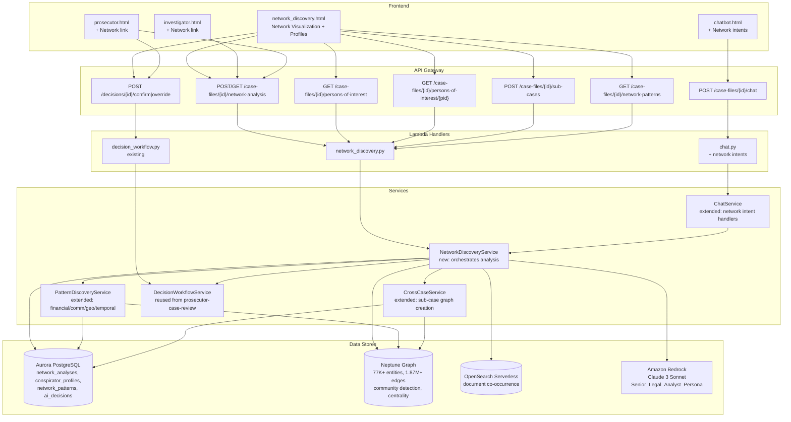
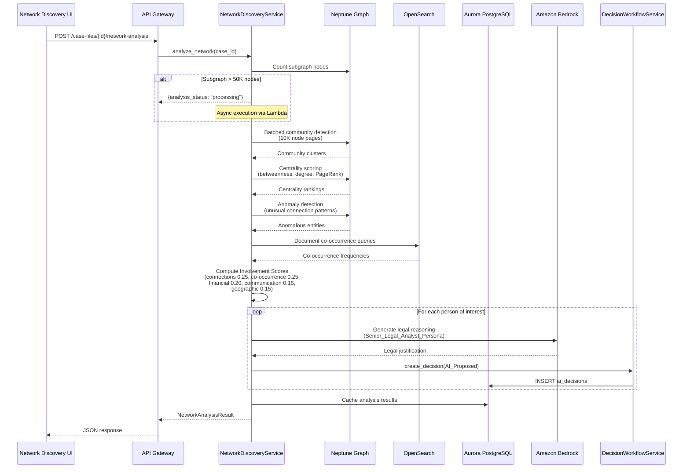
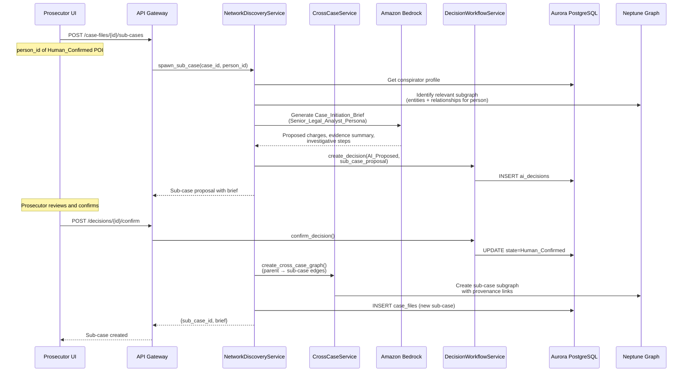

# Design Document: Conspiracy Network Discovery

## Overview

The Conspiracy Network Discovery module adds an AI-powered network analysis layer to the Research Analyst platform. It automatically discovers co-conspirators, criminal networks, and hidden patterns within a case's Neptune knowledge graph (77K+ entities, 1.87M+ edges), ranks individuals by a composite Involvement Score, generates co-conspirator profiles with AI legal reasoning, proposes sub-cases for independent investigation, and detects hidden patterns across financial, communication, geographic, and temporal dimensions.

The module introduces one new backend service (`network_discovery_service.py`), extends three existing services (`pattern_discovery_service.py`, `cross_case_service.py`, `chat_service.py`), adds a new Lambda handler (`network_discovery.py`), a new frontend page (`network_discovery.html`), and new Aurora tables for caching network analysis results and co-conspirator profiles. It reuses the `DecisionWorkflowService` and `ai_decisions` table from the prosecutor-case-review spec for all human-in-the-loop decision management.

All AI-identified persons of interest, detected patterns, and sub-case proposals flow through the three-state Decision Workflow (AI_Proposed → Human_Confirmed / Human_Overridden) with full audit trail. Every Bedrock call uses the Senior Legal Analyst Persona established in prosecutor-case-review.

### Design Principles

- **Extend, don't duplicate**: Reuse existing `PatternDiscoveryService` graph algorithms, `CrossCaseService` sub-case graph creation, `ChatService` intent routing, and `DecisionWorkflowService` decision lifecycle
- **Same infrastructure**: All new services deploy as Lambda functions behind the existing API Gateway, using the same Aurora/Neptune/OpenSearch/Bedrock stack
- **Shared UI**: `network_discovery.html` is accessible from both investigator and prosecutor interfaces, with decision workflow badges matching prosecutor-case-review's color scheme
- **Scalability-first**: Batched Gremlin traversals (10K node pages), approximate algorithms for large subgraphs (>50K nodes), Aurora caching of intermediate results, and async execution for large cases
- **AI-first, human-final**: AI generates network findings with legal reasoning; prosecutors confirm or override every finding via the existing decision workflow
- **Senior Legal Analyst Persona**: All Bedrock calls use the same system prompt from prosecutor-case-review instructing the model to reason as a seasoned federal prosecutor (AUSA)

## Architecture



### Data Flow: Network Analysis Execution



### Data Flow: Sub-Case Spawning




## Components and Interfaces

### 1. NetworkDiscoveryService (`src/services/network_discovery_service.py`)

The core orchestration service. Follows the existing Protocol/constructor-injection pattern used by `entity_resolution_service.py` and `cross_case_service.py`. Coordinates Neptune graph algorithms, OpenSearch co-occurrence queries, Bedrock AI reasoning, and the DecisionWorkflowService.

```python
class NetworkDiscoveryService:
    SENIOR_LEGAL_ANALYST_PERSONA = (
        "You are a senior federal prosecutor (AUSA) with 20+ years of experience. "
        "Reason using proper legal terminology. Cite case law patterns and reference "
        "federal sentencing guidelines (USSG) where applicable. Provide thorough legal "
        "justifications for every recommendation."
    )

    INVOLVEMENT_WEIGHTS = {
        "connections": 0.25,
        "co_occurrence": 0.25,
        "financial": 0.20,
        "communication": 0.15,
        "geographic": 0.15,
    }

    def __init__(
        self,
        neptune_endpoint: str,
        neptune_port: str,
        aurora_cm: ConnectionManager,
        bedrock_client: Any,
        opensearch_endpoint: str,
        decision_workflow_svc: DecisionWorkflowService,
        cross_case_svc: CrossCaseService,
        pattern_discovery_svc: PatternDiscoveryService,
    ):
        ...

    def analyze_network(self, case_id: str) -> NetworkAnalysisResult:
        """Full network analysis pipeline:
        1. Count subgraph nodes; if >50K, return processing status
        2. Run community detection (batched, 10K pages)
        3. Run centrality scoring (betweenness, degree, PageRank)
        4. Run anomaly detection
        5. Query OpenSearch for document co-occurrence
        6. Compute Involvement Scores
        7. Generate co-conspirator profiles
        8. Invoke Bedrock for legal reasoning per person
        9. Create AI_Proposed decisions for each person
        10. Cache results in Aurora
        Returns NetworkAnalysisResult or {analysis_status: 'processing'}."""

    def get_analysis(self, case_id: str) -> NetworkAnalysisResult | None:
        """Retrieve cached network analysis from Aurora."""

    def get_persons_of_interest(
        self, case_id: str, risk_level: str | None = None,
        min_score: int = 0,
    ) -> list[CoConspiratorProfile]:
        """Return persons of interest, optionally filtered by risk level
        and minimum involvement score."""

    def get_person_profile(self, case_id: str, person_id: str) -> CoConspiratorProfile:
        """Return full co-conspirator profile for a specific person."""

    def spawn_sub_case(self, case_id: str, person_id: str) -> SubCaseProposal:
        """Propose a sub-case for a Human_Confirmed person of interest:
        1. Gather relevant evidence from parent case
        2. Generate Case_Initiation_Brief via Bedrock
        3. Create AI_Proposed decision for sub-case
        4. On confirmation, create sub-case via CrossCaseService
        Returns SubCaseProposal with brief and decision_id."""

    def get_network_patterns(
        self, case_id: str, pattern_type: str | None = None,
    ) -> list[NetworkPattern]:
        """Return detected hidden patterns, optionally filtered by type
        (financial, communication, geographic, temporal)."""

    def update_analysis(self, case_id: str, new_evidence_ids: list[str]) -> NetworkAnalysisResult:
        """Incremental update: re-score affected entities and patterns
        without full recomputation."""

    # --- Internal methods ---

    def _run_community_detection(self, case_id: str) -> list[CommunityCluster]:
        """Batched BFS-based community detection on Neptune subgraph.
        Pages through entities in batches of 10K nodes.
        Uses approximate algorithms when subgraph > 50K nodes."""

    def _run_centrality_scoring(self, case_id: str) -> dict[str, CentralityScores]:
        """Compute betweenness, degree, and PageRank centrality.
        Uses approximate betweenness (sampling) for subgraphs > 50K nodes.
        Returns {entity_name: CentralityScores}."""

    def _run_anomaly_detection(self, case_id: str, centrality: dict) -> list[str]:
        """Identify entities with unusual connection patterns relative
        to the subgraph baseline (>2 std deviations from mean degree)."""

    def _compute_involvement_score(
        self, case_id: str, entity_name: str, primary_subject: str,
    ) -> InvolvementScore:
        """Compute weighted composite score:
        connections (0.25) + co_occurrence (0.25) + financial (0.20)
        + communication (0.15) + geographic (0.15).
        Each factor normalized to 0-100."""

    def _classify_risk_level(self, profile: CoConspiratorProfile) -> str:
        """Assign High/Medium/Low based on:
        High: 3+ document types AND connection_strength > 70
        Medium: 2 document types OR connection_strength 40-70
        Low: 1 document type AND connection_strength < 40."""

    def _generate_legal_reasoning(self, profile: CoConspiratorProfile) -> str:
        """Invoke Bedrock with Senior_Legal_Analyst_Persona to generate
        structured legal justification paragraph."""

    def _generate_case_initiation_brief(
        self, case_id: str, profile: CoConspiratorProfile,
    ) -> CaseInitiationBrief:
        """Invoke Bedrock to generate proposed charges, evidence summary,
        and recommended investigative steps."""
```

### 2. PatternDiscoveryService Extensions (`src/services/pattern_discovery_service.py`)

Extends the existing service with four new pattern detection methods for financial, communication, geographic, and temporal dimensions. Each method returns patterns with confidence scores and evidence document links.

```python
# New methods added to existing PatternDiscoveryService class:

def discover_financial_patterns(self, case_id: str) -> list[Pattern]:
    """Analyze financial entities (FINANCIAL_AMOUNT, ACCOUNT_NUMBER, ORGANIZATION)
    and relationships to detect unusual transaction patterns, shell company networks,
    and money laundering indicators. Flags each pattern with confidence score
    and links to evidence documents."""

def discover_communication_patterns(self, case_id: str) -> list[Pattern]:
    """Analyze communication entities (PHONE_NUMBER, EMAIL) and relationships
    to detect frequency anomalies, timing patterns, and encrypted communication
    indicators. Flags each pattern with confidence score."""

def discover_geographic_patterns(self, case_id: str) -> list[Pattern]:
    """Analyze LOCATION entities to detect travel patterns, co-location events
    (2+ persons at same location within same time window), and venue clustering.
    Flags each pattern with confidence score."""

def discover_temporal_patterns(self, case_id: str) -> list[Pattern]:
    """Analyze DATE and EVENT entities to detect event clustering, timeline
    anomalies, and suspicious timing correlations between entities.
    Flags each pattern with confidence score."""
```

### 3. CrossCaseService Extensions (`src/services/cross_case_service.py`)

Extends the existing service with a method for creating sub-case graphs from conspirator profiles.

```python
# New method added to existing CrossCaseService class:

def create_sub_case_from_conspirator(
    self, parent_case_id: str, person_name: str,
    relevant_entity_names: list[str], relevant_doc_ids: list[str],
) -> str:
    """Create a sub-case linked to the parent case:
    1. Create new case_files record in Aurora
    2. Copy relevant Neptune subgraph entities/relationships
    3. Create CROSS_CASE_LINK edges between parent and sub-case
    4. Preserve provenance links back to parent case
    Returns the new sub_case_id."""
```

### 4. ChatService Extensions (`src/services/chat_service.py`)

Extends the existing chat service with new intent patterns and command handlers for network-related queries. Does not modify existing intent classification for non-network queries.

```python
# New intent patterns added to INTENT_PATTERNS list:

("network_who_list", re.compile(
    r"\bwho\s+is\s+on\b.*\b(list|network|circle)\b", re.I)),
("network_travel", re.compile(
    r"\bwho\s+traveled\s+with\b|\btravel.*\bpattern\b", re.I)),
("network_financial", re.compile(
    r"\bfinancial\s+(connections?|links?|transactions?)\s+between\b", re.I)),
("network_flag", re.compile(
    r"\bflag\b.*\bfor\s+investigation\b", re.I)),
("network_sub_case", re.compile(
    r"\bcreate\s+sub[- ]?case\s+for\b", re.I)),

# New command handlers:

def _handle_network_who_list(self, case_id, message, doc_ctx, graph_ctx, ctx):
    """Query NetworkDiscoveryService for persons of interest matching criteria.
    Return structured list with names, Connection_Strength, evidence counts."""

def _handle_network_travel(self, case_id, message, doc_ctx, graph_ctx, ctx):
    """Query Neptune for co-location relationships filtered by person and location.
    Return results with document references."""

def _handle_network_financial(self, case_id, message, doc_ctx, graph_ctx, ctx):
    """Query Neptune for financial relationship paths between two entities.
    Return graph path with transaction details and document references."""

def _handle_network_flag(self, case_id, message, doc_ctx, graph_ctx, ctx):
    """Create AI_Proposed decision in DecisionWorkflowService for specified person.
    Confirm action to investigator."""

def _handle_network_sub_case(self, case_id, message, doc_ctx, graph_ctx, ctx):
    """Trigger sub-case spawning workflow for specified person.
    Return sub_case_id and Case_Initiation_Brief summary."""
```

### 5. Lambda Handler (`src/lambdas/api/network_discovery.py`)

Follows the existing dispatch pattern from `cross_case.py` and `patterns.py`.

| Route | Method | Handler | Description |
|---|---|---|---|
| `/case-files/{id}/network-analysis` | POST | `trigger_analysis_handler` | Trigger network analysis |
| `/case-files/{id}/network-analysis` | GET | `get_analysis_handler` | Get cached analysis results |
| `/case-files/{id}/persons-of-interest` | GET | `list_persons_handler` | List persons of interest (filterable) |
| `/case-files/{id}/persons-of-interest/{pid}` | GET | `get_person_handler` | Get full co-conspirator profile |
| `/case-files/{id}/sub-cases` | POST | `create_sub_case_handler` | Create sub-case for confirmed POI |
| `/case-files/{id}/network-patterns` | GET | `get_patterns_handler` | Get detected hidden patterns (filterable) |

```python
def dispatch_handler(event, context):
    """Route by HTTP method + resource path."""
    method = event.get("httpMethod", "")
    resource = event.get("resource", "")

    if method == "OPTIONS":
        return {"statusCode": 200, "headers": CORS_HEADERS, "body": ""}

    routes = {
        ("POST", "/case-files/{id}/network-analysis"): trigger_analysis_handler,
        ("GET", "/case-files/{id}/network-analysis"): get_analysis_handler,
        ("GET", "/case-files/{id}/persons-of-interest"): list_persons_handler,
        ("GET", "/case-files/{id}/persons-of-interest/{pid}"): get_person_handler,
        ("POST", "/case-files/{id}/sub-cases"): create_sub_case_handler,
        ("GET", "/case-files/{id}/network-patterns"): get_patterns_handler,
    }
    handler = routes.get((method, resource))
    if handler:
        return handler(event, context)
    return error_response(404, "NOT_FOUND", f"Unknown route: {method} {resource}", event)

def _build_network_discovery_service():
    """Construct NetworkDiscoveryService with all dependencies from environment."""
    # Follows same pattern as _build_services() in cross_case.py
    ...
```

### 6. Frontend (`src/frontend/network_discovery.html`)

New page accessible from both investigator and prosecutor interfaces. Reuses the vis.js graph visualization pattern from `graph_explorer.py`.

- **Network Graph Panel**: Interactive vis.js force-directed graph. Nodes = persons of interest, sized by Involvement Score, color-coded by Risk Level (red=High, yellow=Medium, green=Low). Edges = relationships (financial, communication, geographic, legal). Decision state badges on each node (yellow=AI_Proposed, green=Human_Confirmed, blue=Human_Overridden). Supports force-directed and hierarchical layouts.
- **Filter Controls**: Filter by relationship type, time period, minimum Connection Strength, Risk Level.
- **Profile Detail Panel**: Click a node to show full Co-Conspirator Profile: name, aliases, Involvement Score, Connection Strength, Risk Level, evidence summary (document list with context), relationship map, AI legal reasoning, potential charges, Accept/Override buttons.
- **Patterns Panel**: Tabbed view of detected patterns by type (financial, communication, geographic, temporal). Each pattern shows confidence score, evidence links, AI reasoning, and Accept/Override buttons.
- **Sub-Case Panel**: For Human_Confirmed High-risk persons, shows "Propose Sub-Case" button. Displays Case Initiation Brief with proposed charges, evidence summary, and investigative steps.

### 7. API Gateway Routes (additions to `api_definition.yaml`)

```yaml
/case-files/{id}/network-analysis:
  post:
    summary: Trigger network analysis for a case
    operationId: triggerNetworkAnalysis
    parameters: [{name: id, in: path, required: true, schema: {type: string, format: uuid}}]
    responses:
      "200": {description: "Analysis result or processing status"}
      "404": {description: "Case not found"}
  get:
    summary: Get cached network analysis results
    operationId: getNetworkAnalysis
    parameters: [{name: id, in: path, required: true, schema: {type: string, format: uuid}}]
    responses:
      "200": {description: "Cached analysis result"}
      "404": {description: "No analysis found"}
  options:
    summary: CORS preflight
    operationId: optionsNetworkAnalysis

/case-files/{id}/persons-of-interest:
  get:
    summary: List persons of interest with optional filters
    operationId: listPersonsOfInterest
    parameters:
      - {name: id, in: path, required: true, schema: {type: string, format: uuid}}
      - {name: risk_level, in: query, schema: {type: string, enum: [high, medium, low]}}
      - {name: min_score, in: query, schema: {type: integer, minimum: 0, maximum: 100}}
    responses:
      "200": {description: "List of co-conspirator profiles"}
  options:
    summary: CORS preflight
    operationId: optionsPersonsOfInterest

/case-files/{id}/persons-of-interest/{pid}:
  get:
    summary: Get full co-conspirator profile
    operationId: getPersonOfInterest
    parameters:
      - {name: id, in: path, required: true, schema: {type: string, format: uuid}}
      - {name: pid, in: path, required: true, schema: {type: string, format: uuid}}
    responses:
      "200": {description: "Full co-conspirator profile"}
      "404": {description: "Person not found"}
  options:
    summary: CORS preflight
    operationId: optionsPersonOfInterest

/case-files/{id}/sub-cases:
  post:
    summary: Create sub-case for a confirmed person of interest
    operationId: createSubCase
    parameters: [{name: id, in: path, required: true, schema: {type: string, format: uuid}}]
    requestBody:
      required: true
      content:
        application/json:
          schema:
            properties:
              person_id: {type: string, format: uuid}
              decision_id: {type: string, format: uuid}
            required: [person_id, decision_id]
    responses:
      "201": {description: "Sub-case created with initiation brief"}
      "400": {description: "Person not confirmed or not high risk"}
  options:
    summary: CORS preflight
    operationId: optionsSubCases

/case-files/{id}/network-patterns:
  get:
    summary: Get detected hidden patterns
    operationId: getNetworkPatterns
    parameters:
      - {name: id, in: path, required: true, schema: {type: string, format: uuid}}
      - {name: pattern_type, in: query, schema: {type: string, enum: [financial, communication, geographic, temporal]}}
    responses:
      "200": {description: "List of detected patterns"}
  options:
    summary: CORS preflight
    operationId: optionsNetworkPatterns
```


## Data Models

### Aurora PostgreSQL Schema (new tables)

```sql
-- Migration: 003_conspiracy_network_discovery.sql

-- Cached network analysis results
CREATE TABLE network_analyses (
    analysis_id UUID PRIMARY KEY DEFAULT gen_random_uuid(),
    case_id UUID NOT NULL REFERENCES case_files(case_id) ON DELETE CASCADE,
    analysis_status VARCHAR(20) NOT NULL DEFAULT 'completed'
        CHECK (analysis_status IN ('processing', 'completed', 'partial', 'failed')),
    primary_subject VARCHAR(500),
    total_entities_analyzed INT NOT NULL DEFAULT 0,
    total_communities INT NOT NULL DEFAULT 0,
    total_persons_of_interest INT NOT NULL DEFAULT 0,
    total_patterns_detected INT NOT NULL DEFAULT 0,
    algorithm_config JSONB DEFAULT '{}',  -- {approximate: bool, batch_size: int, ...}
    community_clusters JSONB DEFAULT '[]',  -- cached community detection results
    centrality_scores JSONB DEFAULT '{}',  -- cached centrality results
    anomaly_entities JSONB DEFAULT '[]',  -- entities flagged as anomalous
    created_at TIMESTAMP WITH TIME ZONE DEFAULT NOW(),
    updated_at TIMESTAMP WITH TIME ZONE DEFAULT NOW(),
    completed_at TIMESTAMP WITH TIME ZONE
);

-- Co-conspirator profiles
CREATE TABLE conspirator_profiles (
    profile_id UUID PRIMARY KEY DEFAULT gen_random_uuid(),
    analysis_id UUID NOT NULL REFERENCES network_analyses(analysis_id) ON DELETE CASCADE,
    case_id UUID NOT NULL REFERENCES case_files(case_id) ON DELETE CASCADE,
    entity_name VARCHAR(500) NOT NULL,
    entity_type VARCHAR(50) NOT NULL,
    aliases JSONB DEFAULT '[]',  -- list of known aliases
    involvement_score INT NOT NULL CHECK (involvement_score BETWEEN 0 AND 100),
    involvement_breakdown JSONB NOT NULL DEFAULT '{}',
        -- {connections: int, co_occurrence: int, financial: int, communication: int, geographic: int}
    connection_strength INT NOT NULL CHECK (connection_strength BETWEEN 0 AND 100),
    risk_level VARCHAR(10) NOT NULL CHECK (risk_level IN ('high', 'medium', 'low')),
    evidence_summary JSONB DEFAULT '[]',
        -- [{document_id, document_name, mention_context, page_number}]
    relationship_map JSONB DEFAULT '[]',
        -- [{entity_name, relationship_type, edge_weight}]
    document_type_count INT NOT NULL DEFAULT 0,  -- number of distinct document types
    potential_charges JSONB DEFAULT '[]',  -- [{statute_citation, reasoning}]
    ai_legal_reasoning TEXT,  -- full AI justification paragraph
    decision_id UUID REFERENCES ai_decisions(decision_id),
    created_at TIMESTAMP WITH TIME ZONE DEFAULT NOW(),
    updated_at TIMESTAMP WITH TIME ZONE DEFAULT NOW()
);

-- Detected network patterns (financial, communication, geographic, temporal)
CREATE TABLE network_patterns (
    pattern_id UUID PRIMARY KEY DEFAULT gen_random_uuid(),
    analysis_id UUID NOT NULL REFERENCES network_analyses(analysis_id) ON DELETE CASCADE,
    case_id UUID NOT NULL REFERENCES case_files(case_id) ON DELETE CASCADE,
    pattern_type VARCHAR(20) NOT NULL
        CHECK (pattern_type IN ('financial', 'communication', 'geographic', 'temporal')),
    description TEXT NOT NULL,
    confidence_score INT NOT NULL CHECK (confidence_score BETWEEN 0 AND 100),
    entities_involved JSONB NOT NULL DEFAULT '[]',  -- [{entity_name, entity_type, role}]
    evidence_documents JSONB NOT NULL DEFAULT '[]',  -- [{document_id, document_name, relevance}]
    ai_reasoning TEXT,  -- legal significance explanation
    decision_id UUID REFERENCES ai_decisions(decision_id),
    created_at TIMESTAMP WITH TIME ZONE DEFAULT NOW()
);

-- Sub-case proposals
CREATE TABLE sub_case_proposals (
    proposal_id UUID PRIMARY KEY DEFAULT gen_random_uuid(),
    parent_case_id UUID NOT NULL REFERENCES case_files(case_id) ON DELETE CASCADE,
    profile_id UUID NOT NULL REFERENCES conspirator_profiles(profile_id) ON DELETE CASCADE,
    sub_case_id UUID REFERENCES case_files(case_id),  -- NULL until confirmed and created
    proposed_charges JSONB DEFAULT '[]',  -- [{statute_citation, charge_description}]
    evidence_summary TEXT,
    investigative_steps JSONB DEFAULT '[]',  -- [{step_number, description, priority}]
    case_initiation_brief TEXT,  -- full AI-generated brief
    decision_id UUID REFERENCES ai_decisions(decision_id),
    status VARCHAR(20) NOT NULL DEFAULT 'proposed'
        CHECK (status IN ('proposed', 'confirmed', 'created', 'rejected')),
    created_at TIMESTAMP WITH TIME ZONE DEFAULT NOW(),
    updated_at TIMESTAMP WITH TIME ZONE DEFAULT NOW()
);

-- Indexes
CREATE INDEX idx_network_analyses_case ON network_analyses(case_id);
CREATE INDEX idx_network_analyses_status ON network_analyses(analysis_status);
CREATE INDEX idx_conspirator_profiles_case ON conspirator_profiles(case_id);
CREATE INDEX idx_conspirator_profiles_analysis ON conspirator_profiles(analysis_id);
CREATE INDEX idx_conspirator_profiles_risk ON conspirator_profiles(risk_level);
CREATE INDEX idx_conspirator_profiles_score ON conspirator_profiles(involvement_score DESC);
CREATE INDEX idx_network_patterns_case ON network_patterns(case_id);
CREATE INDEX idx_network_patterns_type ON network_patterns(pattern_type);
CREATE INDEX idx_sub_case_proposals_parent ON sub_case_proposals(parent_case_id);
CREATE INDEX idx_sub_case_proposals_status ON sub_case_proposals(status);
```

### Pydantic Models (`src/models/network.py`)

```python
from enum import Enum
from typing import Optional
from pydantic import BaseModel, Field


class RiskLevel(str, Enum):
    HIGH = "high"
    MEDIUM = "medium"
    LOW = "low"


class PatternType(str, Enum):
    FINANCIAL = "financial"
    COMMUNICATION = "communication"
    GEOGRAPHIC = "geographic"
    TEMPORAL = "temporal"


class AnalysisStatus(str, Enum):
    PROCESSING = "processing"
    COMPLETED = "completed"
    PARTIAL = "partial"
    FAILED = "failed"


class InvolvementScore(BaseModel):
    total: int = Field(ge=0, le=100)
    connections: int = Field(ge=0, le=100)
    co_occurrence: int = Field(ge=0, le=100)
    financial: int = Field(ge=0, le=100)
    communication: int = Field(ge=0, le=100)
    geographic: int = Field(ge=0, le=100)


class CentralityScores(BaseModel):
    betweenness: float = Field(ge=0.0)
    degree: int = Field(ge=0)
    pagerank: float = Field(ge=0.0)


class CommunityCluster(BaseModel):
    cluster_id: str
    entity_names: list[str]
    entity_count: int
    avg_internal_degree: float = 0.0


class EvidenceReference(BaseModel):
    document_id: str
    document_name: str
    mention_context: str = ""
    page_number: Optional[int] = None


class RelationshipEntry(BaseModel):
    entity_name: str
    relationship_type: str
    edge_weight: float = 0.0


class CoConspiratorProfile(BaseModel):
    profile_id: str
    case_id: str
    entity_name: str
    entity_type: str
    aliases: list[str] = []
    involvement_score: InvolvementScore
    connection_strength: int = Field(ge=0, le=100)
    risk_level: RiskLevel
    evidence_summary: list[EvidenceReference] = []
    relationship_map: list[RelationshipEntry] = []
    document_type_count: int = 0
    potential_charges: list[dict] = []  # [{statute_citation, reasoning}]
    ai_legal_reasoning: str = ""
    decision_id: Optional[str] = None
    decision_state: Optional[str] = None


class NetworkPattern(BaseModel):
    pattern_id: str
    case_id: str
    pattern_type: PatternType
    description: str
    confidence_score: int = Field(ge=0, le=100)
    entities_involved: list[dict] = []
    evidence_documents: list[dict] = []
    ai_reasoning: str = ""
    decision_id: Optional[str] = None
    decision_state: Optional[str] = None


class CaseInitiationBrief(BaseModel):
    proposed_charges: list[dict] = []  # [{statute_citation, charge_description}]
    evidence_summary: str = ""
    investigative_steps: list[dict] = []  # [{step_number, description, priority}]
    full_brief: str = ""


class SubCaseProposal(BaseModel):
    proposal_id: str
    parent_case_id: str
    profile_id: str
    sub_case_id: Optional[str] = None
    brief: CaseInitiationBrief
    decision_id: Optional[str] = None
    status: str = "proposed"


class NetworkAnalysisResult(BaseModel):
    analysis_id: str
    case_id: str
    analysis_status: AnalysisStatus
    primary_subject: Optional[str] = None
    total_entities_analyzed: int = 0
    persons_of_interest: list[CoConspiratorProfile] = []
    patterns: list[NetworkPattern] = []
    sub_case_proposals: list[SubCaseProposal] = []
    communities: list[CommunityCluster] = []
    created_at: str = ""
    completed_at: Optional[str] = None
```


## Correctness Properties

*A property is a characteristic or behavior that should hold true across all valid executions of a system — essentially, a formal statement about what the system should do. Properties serve as the bridge between human-readable specifications and machine-verifiable correctness guarantees.*

### Property 1: Involvement Score formula

*For any* set of five factor scores (connections, co_occurrence, financial, communication, geographic), each in [0, 100], the computed Involvement Score total should equal `round(connections * 0.25 + co_occurrence * 0.25 + financial * 0.20 + communication * 0.15 + geographic * 0.15)`, and the total should be in [0, 100].

**Validates: Requirements 1.5**

### Property 2: Persons of interest sorted by Involvement Score

*For any* network analysis result containing two or more persons of interest, the list should be sorted by `involvement_score.total` in descending order — that is, for every consecutive pair (i, i+1), `persons[i].involvement_score.total >= persons[i+1].involvement_score.total`.

**Validates: Requirements 1.4**

### Property 3: Risk Level classification

*For any* co-conspirator profile with a known `document_type_count` and `connection_strength`, the assigned `risk_level` should be: "high" when `document_type_count >= 3` AND `connection_strength > 70`, "medium" when `document_type_count == 2` OR `40 <= connection_strength <= 70`, and "low" when `document_type_count <= 1` AND `connection_strength < 40`.

**Validates: Requirements 2.6**

### Property 4: Co-conspirator profile structural completeness

*For any* co-conspirator profile in a network analysis result, the profile should have: a non-empty `entity_name`, a non-empty `entity_type`, `involvement_score.total` in [0, 100], `connection_strength` in [1, 100], `risk_level` in {high, medium, low}, `evidence_summary` as a list where each entry has `document_id` and `document_name`, and `relationship_map` as a list where each entry has `entity_name`, `relationship_type`, and `edge_weight`.

**Validates: Requirements 2.1, 2.2, 2.3, 2.4**

### Property 5: Detected pattern structural completeness

*For any* detected network pattern, the pattern should have: `pattern_type` in {financial, communication, geographic, temporal}, `confidence_score` in [0, 100], a non-empty `entities_involved` list, a non-empty `evidence_documents` list, and a non-empty `ai_reasoning` string.

**Validates: Requirements 4.1, 4.2, 4.3, 4.4, 4.5**

### Property 6: Every finding creates an AI_Proposed decision with correct type

*For any* network analysis result, every person of interest should have a non-null `decision_id` with `decision_type = "person_of_interest"`, every detected pattern should have a non-null `decision_id` with `decision_type = "network_pattern"`, and every sub-case proposal should have a non-null `decision_id` with `decision_type = "sub_case_proposal"`. All decisions should have `state = "ai_proposed"`.

**Validates: Requirements 1.7, 4.6, 7.1**

### Property 7: Every AI_Proposed decision has non-empty legal reasoning

*For any* AI_Proposed decision created by the network discovery engine (decision_type in {"person_of_interest", "network_pattern", "sub_case_proposal"}), the `legal_reasoning` field should be a non-empty string.

**Validates: Requirements 1.6, 2.7, 7.5**

### Property 8: Network intent classification

*For any* message matching a network intent pattern (e.g., "Who is on X's list?", "Who traveled with X to Y?", "Show me the financial connections between X and Y", "Flag X for investigation", "Create sub-case for X"), the ChatService `classify_intent` method should return the corresponding network intent name (network_who_list, network_travel, network_financial, network_flag, network_sub_case).

**Validates: Requirements 6.1, 6.2, 6.3, 6.4, 6.6, 6.7**

### Property 9: Existing intent classification unchanged after network extensions

*For any* message that matches an existing (non-network) intent pattern (summarize, who_is, connections, documents_mention, flag, timeline, whats_missing, subpoena_list), the ChatService `classify_intent` method should return the same intent as before the network extensions were added.

**Validates: Requirements 6.8**

### Property 10: Decision workflow transitions for network decision types

*For any* AI_Proposed decision with decision_type in {"person_of_interest", "network_pattern", "sub_case_proposal"}, confirming it should transition state to "human_confirmed" with non-null `confirmed_at` and `confirmed_by`, and overriding it should transition state to "human_overridden" with non-null `override_rationale`. Overriding with an empty rationale should be rejected.

**Validates: Requirements 7.2, 7.3**

### Property 11: Sub-case proposal for confirmed high-risk profiles

*For any* co-conspirator profile with `risk_level = "high"` and `decision_state = "human_confirmed"`, the system should produce a sub-case proposal with a non-null `decision_id` of `decision_type = "sub_case_proposal"` and `state = "ai_proposed"`.

**Validates: Requirements 3.1, 3.5**

### Property 12: Case Initiation Brief structural completeness

*For any* sub-case proposal, the `brief` should have: a non-empty `proposed_charges` list where each entry has `statute_citation` and `charge_description`, a non-empty `evidence_summary` string, a non-empty `investigative_steps` list where each entry has `step_number`, `description`, and `priority`, and a non-empty `full_brief` string.

**Validates: Requirements 3.3**

### Property 13: Large subgraph triggers approximate algorithms and async processing

*For any* case subgraph with more than 50,000 entity nodes, the initial analysis response should have `analysis_status = "processing"`, and the `algorithm_config` should indicate `approximate = true`.

**Validates: Requirements 9.2, 9.4**

### Property 14: Analysis caching idempotence

*For any* completed network analysis, calling `get_analysis(case_id)` multiple times should return the same `analysis_id`, `persons_of_interest` count, and `patterns` count without re-running graph algorithms.

**Validates: Requirements 9.3**

### Property 15: Filtering returns only matching items

*For any* list of co-conspirator profiles and a `risk_level` filter, the returned list should contain only profiles with the specified `risk_level`. *For any* list of network patterns and a `pattern_type` filter, the returned list should contain only patterns with the specified `pattern_type`.

**Validates: Requirements 10.3, 10.6**

### Property 16: Centrality scoring produces three measures per entity

*For any* entity in the case subgraph that is included in centrality scoring, the result should contain `betweenness` (>= 0.0), `degree` (>= 0), and `pagerank` (>= 0.0) scores.

**Validates: Requirements 1.2**

### Property 17: Anomaly detection flags statistical outliers

*For any* entity flagged as anomalous by the anomaly detection algorithm, its degree centrality should be greater than the mean degree plus two standard deviations of all entity degrees in the subgraph.

**Validates: Requirements 1.3**

### Property 18: Incremental analysis monotonicity

*For any* existing network analysis and a set of newly added evidence, the updated analysis should have `total_entities_analyzed >= previous_total_entities_analyzed`, and all previously identified persons of interest should still be present in the updated result (no persons removed by incremental update).

**Validates: Requirements 8.8**

## Error Handling

| Error Scenario | Handling Strategy | User Impact |
|---|---|---|
| Neptune unavailable during analysis | Return partial result with `analysis_status = "partial"` containing only Aurora/OpenSearch-derived findings. Log error. | User sees partial results with banner: "Graph analysis unavailable — showing document-based findings only" |
| Gremlin traversal timeout (>120s) | Return partial results from completed algorithm stages. Log timeout for incomplete stage. Set `analysis_status = "partial"`. | User sees results from completed stages with note about incomplete analysis |
| Bedrock invocation failure | Use fallback template for legal reasoning: "AI analysis unavailable. Manual review recommended for [entity_name] based on [N] document references and [M] graph connections." | Profile shows fallback text instead of AI reasoning. Accept/Override still available. |
| OpenSearch unavailable | Skip co-occurrence scoring. Set co_occurrence factor to 0 in Involvement Score. Log warning. | Involvement Scores may be lower than expected. User sees note about missing co-occurrence data. |
| Sub-case creation fails (Aurora/Neptune) | Roll back partial changes. Return error with proposal intact. User can retry. | Error message with retry option. Proposal remains in "proposed" state. |
| Large subgraph async timeout | Mark analysis as "partial" with completed stages. Allow user to re-trigger for remaining stages. | User sees partial results with option to continue analysis. |
| Invalid person_id for sub-case | Return 404 with descriptive message. | Error toast: "Person of interest not found" |
| Sub-case for non-confirmed person | Return 400: "Person must be Human_Confirmed before sub-case creation" | Error toast with explanation |
| Override without rationale | Return 400: "Override rationale is required" | Form validation prevents submission |
| Duplicate analysis trigger | Return existing analysis if status is "processing" or "completed" within last hour. | User sees existing results or processing status |

## Testing Strategy

### Property-Based Testing

Use `hypothesis` (Python) as the property-based testing library. Each property test runs a minimum of 100 iterations.

Each property test must be tagged with a comment referencing the design property:
```python
# Feature: conspiracy-network-discovery, Property 1: Involvement Score formula
```

Property tests validate universal properties across randomly generated inputs:
- Generate random factor scores (0-100) to test Involvement Score formula
- Generate random profiles with varying document_type_count and connection_strength to test Risk Level classification
- Generate random profile lists to test sorting invariant
- Generate random messages matching intent patterns to test classification
- Generate random filter parameters to test filtering correctness

### Unit Testing

Unit tests complement property tests for specific examples, edge cases, and integration points:

- **Edge cases**: Empty subgraph (0 entities), single entity, subgraph at exactly 50K threshold, all entities in one community, no financial/communication/geographic entities
- **Error conditions**: Neptune timeout, Bedrock failure, invalid case_id, non-existent person_id, override with empty rationale
- **Integration points**: DecisionWorkflowService creates correct decision_type values, CrossCaseService creates sub-case graph correctly, ChatService routes to correct handler
- **Specific examples**: Known graph topology produces expected community clusters, known entity with high centrality is flagged as anomalous

### Test Organization

```
tests/
  unit/
    test_network_discovery_service.py      # Core service logic
    test_involvement_score.py              # Score computation (Property 1)
    test_risk_classification.py            # Risk level rules (Property 3)
    test_chat_network_intents.py           # Intent classification (Properties 8, 9)
    test_network_discovery_handler.py      # Lambda handler routing
  property/
    test_network_properties.py             # All 18 property-based tests
```
