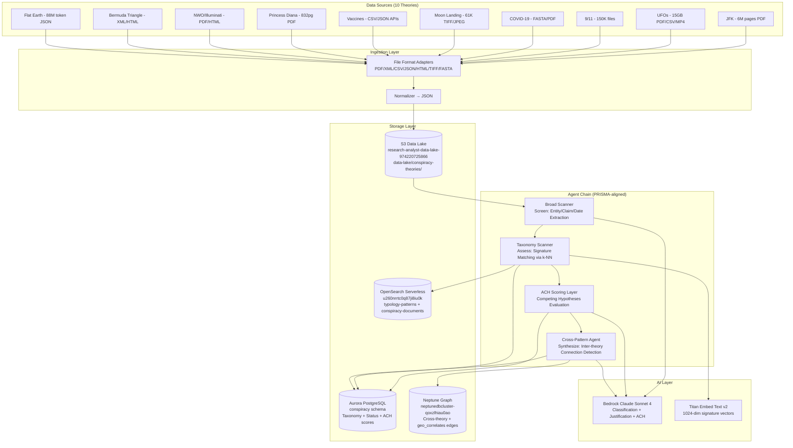
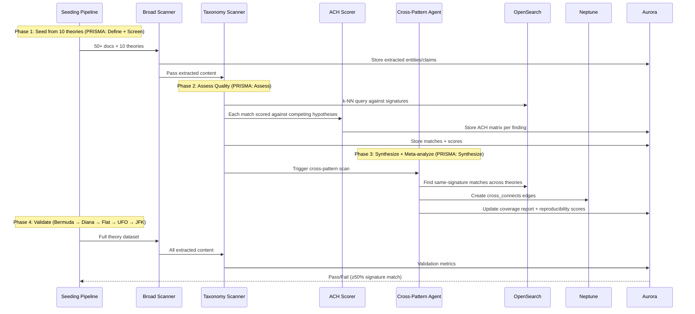
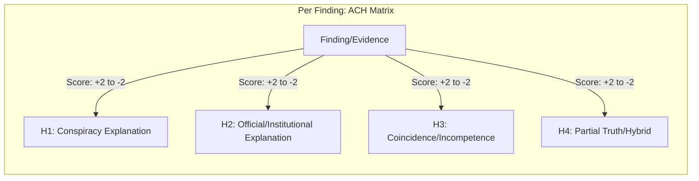

# Design Document: Conspiracy Theory Taxonomy

## Overview

This design extends the Research Analyst platform's existing 5-level taxonomy architecture (Domain → Typology → Method → Signature → Precedent Case) into the conspiracy theory domain. Rather than classifying geographic/archaeological patterns (Ancient Mysteries), this taxonomy classifies **behavioral and informational patterns** — the structural techniques by which information is suppressed, narratives are controlled, and alternative explanations emerge.

### Cross-Industry Investigative Methodology Foundation

The taxonomy structure draws on validated pattern-detection frameworks from multiple professional investigative disciplines:

| Industry | Framework | Parallel to Our Design |
|----------|-----------|----------------------|
| **Financial Services (FinCEN SARs)** | Predicate Offense → Instrument → Method → Indicator | Domain → Typology → Method → Signature |
| **Healthcare (CMS Fraud Detection)** | Expected Norm → Aberrant Pattern → Network Analysis | Information Asymmetry domain + circular referral detection |
| **Intelligence Community (CIA SATs)** | Analysis of Competing Hypotheses (ACH) | ACH scoring layer on each finding |
| **Insurance (SIU Red Flags)** | Category → Timing Anomaly → Behavioral Indicator | Timeline Anomalies domain + Signature indicators |
| **Academic (PRISMA)** | Define → Screen → Assess → Synthesize → Meta-analyze | Broad Scanner → Taxonomy Scanner → Cross-Pattern Agent |
| **Scientific Methodology** | Independent reproducibility + multi-source corroboration | Confidence scoring with reproducibility multiplier |

The FinCEN SAR typology is nearly identical to our structure: a SAR classifies suspicious activity as `Predicate Offense (Money Laundering) → Instrument (Shell Company) → Method (Layering) → Indicator (Rapid in/out transfers)`. Our taxonomy maps this exactly: `Domain (Evidence Suppression) → Typology (Document Classification) → Method (Retroactive Reclassification) → Signature (Classification stamp applied post-publication)`. This isn't coincidental — both systems solve the same problem: detecting hidden patterns through structured decomposition of observed behaviors.

The **PRISMA systematic review** pipeline (define criteria → screen → assess quality → synthesize → meta-analyze) maps directly to our agent chain: Broad Scanner (screen), Taxonomy Scanner (assess quality against criteria), Cross-Pattern Agent (synthesize + meta-analyze across theories). This gives academic rigor to what could otherwise be ad-hoc pattern matching.

### Documentary Investigation Methodology Mapping

The design philosophy mirrors investigative documentary methodology:

1. **HOOK** — What's anomalous enough to investigate?
2. **COUNTER-NARRATIVE** — What's the official story, where does it crack?
3. **CONVERGENCE** — Do multiple independent lines point the same way?
4. **RELUCTANT EXPERT** — Who knows but won't talk?
5. **IMPLICATIONS** — If THIS is true, what else must be true?

This maps directly to the agent chain: **Broad Scanner** (finds the hook) → **Taxonomy Scanner** (tests against known patterns) → **Cross-Pattern Agent** (finds convergence across theories).

### Key Design Principles

- **Domain-agnostic structure**: The 5-level hierarchy is identical to Ancient Mysteries and Crime taxonomies — only content differs
- **10 Universal Domains** (expanded from 7): Original 7 behavioral domains + 3 documentary-methodology-inspired domains (Narrative Coherence, Expert Divergence, Methodological Red Flags)
- **Cross-domain detection** is the killer feature: when a UFO document and a JFK document both match "Evidence Suppression > Document Classification > Retroactive Reclassification", that's a meaningful finding
- **Reuse existing infrastructure**: Aurora, OpenSearch, Neptune, S3, Bedrock — new tables and indices, not new services
- **Seed broad, validate narrow**: 50+ docs from all 10 theories simultaneously, then validate Bermuda Triangle first
- **ACH-driven scoring**: Every finding is scored against multiple competing hypotheses, not just the conspiracy explanation

---

## Architecture

### System Context Diagram



### Processing Pipeline Flow



### ACH (Analysis of Competing Hypotheses) Integration

Inspired by the CIA's Structured Analytic Techniques, the ACH layer evaluates each finding against multiple competing explanations rather than only the conspiracy hypothesis. This prevents confirmation bias and produces more rigorous intelligence assessments.



**ACH Scoring Rules** (adapted from Richards Heuer's methodology):
- **+2**: Finding is highly consistent with hypothesis, would be very likely if hypothesis were true
- **+1**: Finding is consistent with hypothesis
- **0**: Finding is neutral / irrelevant to hypothesis
- **-1**: Finding is inconsistent with hypothesis
- **-2**: Finding strongly contradicts hypothesis

The ACH matrix is generated by Bedrock Claude Sonnet for each signature match, producing a structured JSON assessment stored in Aurora. This prevents the system from simply confirming conspiracy narratives — it equally evaluates mundane explanations.

### Reproducibility Scoring (Scientific Methodology)

From scientific methodology: a finding's confidence increases when independently corroborated across multiple sources and theories. The reproducibility score quantifies this:

```
reproducibility_score = (independent_sources × source_diversity_weight) / max_possible_score

where:
  independent_sources = count of distinct Theory_Datasets confirming the pattern
  source_diversity_weight = 1.0 + (0.2 × count of distinct file_format_types contributing)
  max_possible_score = 10 (all theories) × 2.0 (maximum diversity bonus)
```

A finding corroborated by 3 independent sources across 3 theories using 3 different file formats scores significantly higher than one from a single source in a single theory. This maps to scientific reproducibility standards where independent replication is the gold standard.

### Insurance SIU Red Flag Parallels

The Insurance Special Investigation Unit methodology scores suspicious claims against categorical red flags: timing anomalies, over-insurance, witness inconsistencies, staged events. Our taxonomy captures these same behavioral signatures:

| SIU Red Flag Category | Our Taxonomy Domain | Detection Method |
|----------------------|--------------------|--------------------|
| Timing anomalies | Timeline Anomalies | Sequence analysis, impossible timings |
| Witness inconsistencies | Witness Reliability | Cross-statement comparison, recantation detection |
| Staged events | Methodological Red Flags | Investigation procedure analysis |
| Over-documentation / over-insurance | Information Asymmetry | Selective disclosure detection |
| Network referral patterns | Institutional Behavior | Circular coordination detection |

### CMS Fraud Detection Parallels

Healthcare fraud detection (CMS) uses aberrant pattern detection against expected norms — upcoding detection, circular referral analysis (referral ring = kickback scheme). These statistical deviation patterns map directly to our domains:

- **Aberrant pattern detection** → Information Asymmetry: what's known vs. disclosed deviates from expected norms
- **Circular referral analysis** → Institutional Behavior: organizations referencing each other in closed loops to mutual benefit
- **Upcoding detection** → Evidence Suppression: inflating severity/significance of evidence while hiding contradictory data

---

## Components and Interfaces

### 1. File Format Adapters (`src/services/conspiracy_ingestion_adapters.py`)

Responsible for normalizing diverse file formats into a unified JSON structure for downstream processing.

```python
class BaseAdapter(ABC):
    """Abstract base for all file format adapters."""
    
    @abstractmethod
    def can_handle(self, file_path: str, mime_type: str) -> bool: ...
    
    @abstractmethod
    def extract(self, file_path: str) -> list[NormalizedRecord]: ...


@dataclass
class NormalizedRecord:
    """Universal output format from any adapter."""
    record_id: str                    # UUID
    theory_name: str                  # e.g., "jfk_assassination"
    source_file: str                  # Original file path
    source_type: str                  # "pdf", "xml", "csv", etc.
    content_text: str                 # Extracted text (max 50K chars)
    metadata: dict                    # Format-specific metadata
    extracted_entities: list[str]     # Quick-pass entity mentions
    extracted_dates: list[str]        # ISO dates found
    extracted_locations: list[dict]   # {name, lat, lon} if parseable
    ingested_at: str                  # ISO timestamp


class PDFAdapter(BaseAdapter): ...       # PyPDF2 + pdfplumber for tables
class XMLAdapter(BaseAdapter): ...       # ElementTree for NTSB reports
class CSVJSONAdapter(BaseAdapter): ...   # pandas for tabular data
class HTMLTableAdapter(BaseAdapter): ... # BeautifulSoup for wiki tables
class ImageMetadataAdapter(BaseAdapter): ...  # Pillow for EXIF extraction
class FASTAAdapter(BaseAdapter): ...     # BioPython for sequence headers
```

**S3 Output Path**: `data-lake/conspiracy-theories/{theory_name}/{source_type}/{filename}.json`

### 2. Conspiracy Taxonomy Service (`src/services/conspiracy_taxonomy_service.py`)

Manages the 10-domain taxonomy CRUD, validation, and coverage reporting.

```python
class ConspiracyTaxonomyService:
    """Manages the conspiracy theory universal taxonomy."""
    
    def create_domain(self, name: str, description: str) -> str: ...
    def create_typology(self, domain_id: str, name: str, description: str) -> str: ...
    def create_method(self, typology_id: str, name: str, description: str) -> str: ...
    def create_signature(self, method_id: str, description: str, 
                         vector_text: str, indicators: list[str],
                         precedent_cases: list[str]) -> str: ...
    
    def validate_no_proper_nouns(self, text: str) -> bool:
        """Reject definitions containing theory-specific proper nouns.
        
        Enforces universality: taxonomy nodes must be domain-agnostic.
        Checks against blocklist: JFK, Roswell, COVID, Diana, etc.
        """
        ...
    
    def get_coverage_report(self) -> CoverageReport: ...
    def get_balance_score(self) -> float:
        """Ratio of smallest domain's signature count to largest. 1.0 = perfect balance."""
        ...
    def get_context_key(self, signature_id: str) -> str:
        """Returns: conspiracy/{domain}/{typology}/{method}/{signature}"""
        ...
```

### 3. ACH Scoring Service (`src/services/ach_scoring_service.py`)

Implements the CIA-inspired Analysis of Competing Hypotheses framework. Every finding is scored against 4 competing explanations, preventing confirmation bias.

```python
@dataclass
class ACHHypothesis:
    """One competing explanation for a finding."""
    hypothesis_id: str
    label: str          # e.g., "conspiracy", "official", "coincidence", "hybrid"
    description: str    # Full hypothesis statement

@dataclass
class ACHScore:
    """Score of one piece of evidence against one hypothesis."""
    finding_id: str
    hypothesis_id: str
    score: int          # -2 to +2 (Heuer scale)
    reasoning: str      # Claude's justification for the score

@dataclass
class ACHMatrix:
    """Complete ACH evaluation for a single finding."""
    finding_id: str
    document_id: str
    signature_id: str
    hypotheses: list[ACHHypothesis]
    scores: list[ACHScore]
    dominant_hypothesis: str   # Which hypothesis has highest cumulative score
    confidence_delta: float    # Gap between top two hypotheses (higher = more decisive)


class ACHScoringService:
    """Evaluates findings against competing hypotheses using Bedrock Claude."""
    
    DEFAULT_HYPOTHESES = [
        ACHHypothesis("h_conspiracy", "conspiracy", 
                      "Deliberate concealment or coordination by powerful actors"),
        ACHHypothesis("h_official", "official",
                      "Official/institutional explanation is accurate"),
        ACHHypothesis("h_coincidence", "coincidence",
                      "Random coincidence, incompetence, or bureaucratic inertia"),
        ACHHypothesis("h_hybrid", "hybrid",
                      "Partial truth in multiple explanations; complex multi-causal reality"),
    ]
    
    def score_finding(self, finding: dict, signature_match: dict, 
                      document_context: str) -> ACHMatrix:
        """Score a single finding against all competing hypotheses.
        
        Uses Bedrock Claude to evaluate each hypothesis, producing a
        structured -2 to +2 score with reasoning for each.
        """
        ...
    
    def aggregate_theory_scores(self, theory_name: str) -> dict:
        """Aggregate ACH scores across all findings for a theory.
        
        Returns per-hypothesis totals and identifies which hypotheses
        are most/least supported by cumulative evidence.
        """
        ...
    
    def get_key_assumptions(self, theory_name: str) -> list[str]:
        """CIA Key Assumptions Check: identify assumptions that, if wrong,
        would change the dominant hypothesis."""
        ...
```

### 4. Agent Chain Handlers (new handlers in `src/services/agent_orchestrator.py`)

Three new handler functions added to the existing orchestrator — not a rewrite. The agent definitions follow the same `AgentDefinition` dataclass pattern.

```python
# New agent definitions for conspiracy processing
CONSPIRACY_BROAD_SCANNER = AgentDefinition(
    id="conspiracy_broad_scanner",
    name="Conspiracy Broad Scanner",
    description="Extract entities, claims, dates, behavioral indicators from conspiracy documents",
    trigger_type=TriggerType.MANUAL,
    trigger_condition={},
    research_strategy="Entity extraction + claim identification + behavioral indicator tagging",
    taxonomy_scope=["conspiracy/*"],
    follow_up_agents=["conspiracy_taxonomy_scanner"],
    priority=1,
)

CONSPIRACY_TAXONOMY_SCANNER = AgentDefinition(
    id="conspiracy_taxonomy_scanner",
    name="Conspiracy Taxonomy Scanner",
    description="Score documents against conspiracy taxonomy signatures via k-NN",
    trigger_type=TriggerType.ON_FINDINGS,
    trigger_condition={"keywords": ["entity", "claim", "suppression", "anomaly", "witness"]},
    research_strategy="Embed document → k-NN against typology-patterns → ACH score each match",
    taxonomy_scope=["conspiracy/*"],
    follow_up_agents=["conspiracy_cross_pattern_agent"],
    priority=2,
)

CONSPIRACY_CROSS_PATTERN_AGENT = AgentDefinition(
    id="conspiracy_cross_pattern_agent",
    name="Conspiracy Cross-Pattern Agent",
    description="Detect cross-theory connections via shared signatures and geographic proximity",
    trigger_type=TriggerType.ON_SIGNATURE,
    trigger_condition={"signature_id": "conspiracy/*", "min_count": 2},
    research_strategy="k-NN(k=10, threshold=0.85) across theories + Neptune edge creation",
    taxonomy_scope=["conspiracy/*"],
    follow_up_agents=[],
    priority=3,
)
```

**Handler function signatures:**

```python
def conspiracy_broad_scanner_handler(context: InvestigationContext) -> dict:
    """Extracts entities, claims, dates, behavioral indicators from conspiracy docs.
    
    Uses Bedrock Claude Sonnet to identify:
    - Named entities (people, organizations, documents, locations)
    - Claims and counter-claims
    - Temporal markers and sequences
    - Behavioral indicators (suppression language, institutional hedging, etc.)
    - Red flags per Insurance SIU methodology (timing, witness, procedural)
    """
    ...

def conspiracy_taxonomy_scanner_handler(context: InvestigationContext) -> dict:
    """Scores extracted content against all conspiracy taxonomy signatures.
    
    Pipeline (mirrors PRISMA Assess phase):
    1. Generates Titan Embed v2 embedding of document content
    2. k-NN query against typology-patterns index (k=5, cosine, threshold 0.80)
    3. For each match: run ACH scoring against 4 hypotheses
    4. Stores matches + ACH matrices in Aurora
    5. Logs unclassified documents for review
    """
    ...

def conspiracy_cross_pattern_handler(context: InvestigationContext) -> dict:
    """Detects cross-theory connections via shared signatures.
    
    Pipeline (mirrors PRISMA Synthesize + Meta-analyze):
    1. For each match, k-NN search (k=10, threshold 0.85) for same signature in other theories
    2. Calculate reproducibility score (independent sources × diversity weight)
    3. Creates Neptune cross_connects edges with justification
    4. Checks geographic proximity (50km) with Ancient Mysteries nodes
    5. Promotes signatures matching 5+ theories to "Universal Confirmed"
    6. Generates cross-theory connection summary (top 10 most-connected, top 10 strongest)
    """
    ...
```

### 5. Seeding Pipeline (`src/services/conspiracy_seeding_pipeline.py`)

Orchestrates the initial taxonomy derivation from all 10 theory datasets simultaneously.

```python
class ConspiracySeedingPipeline:
    """Derives universal taxonomy from 10 conspiracy theory datasets.
    
    Methodology: FinCEN-inspired pattern derivation.
    Each candidate pattern must appear in 3+ theories to qualify as universal
    (same threshold as FinCEN requiring 3+ suspicious transactions to file SAR).
    """
    
    THEORY_DATASETS = [
        ("jfk_assassination", ["pdf"]),
        ("ufos_uaps", ["pdf", "csv"]),
        ("nine_eleven", ["pdf", "jpeg"]),
        ("covid_lab_leak", ["pdf", "fasta"]),
        ("moon_landing", ["tiff", "jpeg"]),
        ("vaccine_conspiracies", ["csv", "json"]),
        ("princess_diana", ["pdf"]),
        ("new_world_order", ["pdf", "html"]),
        ("bermuda_triangle", ["xml", "html"]),
        ("flat_earth", ["json"]),
    ]
    
    def initiate_seeding(self, sample_size_per_theory: int = 50) -> str:
        """Start seeding pipeline, returns execution_id."""
        ...
    
    def derive_universal_patterns(self, extractions: list[dict]) -> list[CandidatePattern]:
        """Identify patterns appearing in 3+ theories.
        
        Uses Bedrock Claude to cluster extracted behavioral indicators,
        then verifies each cluster appears across 3+ distinct theory datasets.
        Patterns below threshold routed to theory_specific_patterns table.
        """
        ...
    
    def classify_theory_specific(self, pattern: CandidatePattern) -> None:
        """Route patterns appearing in <3 theories to theory_specific_patterns table."""
        ...
    
    def generate_coverage_report(self) -> dict:
        """Per-domain signature counts, under-specified domain flags (<5 signatures)."""
        ...
```

### 6. Validation Pipeline (`src/services/conspiracy_validation_pipeline.py`)

Processes complete theory datasets in sequence, gating progression on 50% signature match rate.

```python
class ConspiracyValidationPipeline:
    """Sequential theory validation: Bermuda → Diana → Flat → UFO → JFK.
    
    Each theory must achieve ≥50% signature match rate before the next
    theory is unlocked. Failures produce gap analysis identifying which
    Domains lack coverage for the failing theory.
    """
    
    PROCESSING_ORDER = [
        "bermuda_triangle",    # Small, diverse, solved — ideal validator
        "princess_diana",      # Single dense document — tests depth
        "flat_earth",          # Massive scale — tests throughput
        "ufos_uaps",           # Multi-format, large — tests format handling
        "jfk_assassination",   # 6M pages — tests at full scale
    ]
    
    UNGATED_THEORIES = [       # Processable in any order after first 5
        "nine_eleven",
        "covid_lab_leak",
        "moon_landing",
        "vaccine_conspiracies",
        "new_world_order",
    ]
    
    def start_validation(self, theory_name: str) -> str: ...
    def check_gate(self, theory_name: str) -> ValidationResult: ...
    def produce_validation_report(self, theory_name: str) -> dict: ...
    def produce_gap_analysis(self, theory_name: str) -> dict: ...
```

### 7. Cross-Theory Detection Algorithm

The core detection algorithm combines k-NN similarity search with Neptune graph traversal:

```python
def detect_cross_theory_connections(document_id: str, signature_matches: list[dict]) -> list[CrossTheoryConnection]:
    """
    Algorithm:
    1. For each signature match on the current document:
       a. Query OpenSearch: k-NN(embedding, k=10, cosine, threshold=0.85) 
          filtered to exclude documents from same theory
       b. For each hit above threshold:
          - Generate justification via Bedrock (structural parallel, not just vocabulary)
          - Calculate reproducibility score
          - Create Neptune cross_connects edge
    
    2. Geographic proximity check:
       a. If document has extracted_locations:
          - Query Neptune: g.V().hasLabel('AncientMysteryNode')
            .has('latitude', between(lat-0.45, lat+0.45))
            .has('longitude', between(lon-0.45, lon+0.45))
          - For matches within 50km: create geo_correlates edge
    
    3. Universal promotion check:
       a. Count distinct theories per signature
       b. If signature matches 5+ distinct theories: 
          UPDATE conspiracy.signatures SET status='universal_confirmed'
    
    Returns: list of CrossTheoryConnection objects created
    """
    ...
```

**Performance characteristics:**
- OpenSearch k-NN query: ~50ms per search (HNSW index, nmslib engine)
- Neptune traversal: <5s for theory→theory connections (as required by Req 8.4)
- Bedrock justification: ~2s per call (batched where possible)
- Full Bermuda Triangle validation: target <30 minutes (Req 3.4)

### 8. Coverage Monitoring API

Two new Lambda-backed endpoints added to the existing API Gateway:

```python
# GET /taxonomy/conspiracy/coverage
def get_coverage_handler(event, context):
    """Returns taxonomy coverage metrics.
    
    Response:
    {
        "total_domains": 10,
        "total_typologies": 42,
        "total_methods": 98,
        "total_signatures": 220,
        "total_precedent_cases": 150,
        "per_domain": [
            {"domain": "evidence_suppression", "typologies": 5, "methods": 12, "signatures": 28},
            ...
        ],
        "balance_score": 0.72,  # min_sigs / max_sigs across domains
        "under_specified_domains": ["geographic_clustering"],  # <5 signatures
        "last_updated": "2026-08-15T14:30:00Z"
    }
    """
    ...

# GET /taxonomy/conspiracy/cross-theory-report
def get_cross_theory_report_handler(event, context):
    """Returns cross-theory connection analytics.
    
    Response:
    {
        "total_connections": 847,
        "connections_per_theory_pair": [
            {"theory_a": "jfk_assassination", "theory_b": "ufos_uaps", "count": 42},
            ...
        ],
        "most_connected_signatures": [
            {"context_key": "conspiracy/evidence_suppression/...", "theory_count": 7},
            ...
        ],
        "theories_with_zero_connections": [],
        "universal_confirmed_signatures": 12,
        "average_reproducibility_score": 0.45
    }
    """
    ...
```

---

## Data Models

### Aurora PostgreSQL Tables

All tables are created in the existing Aurora cluster (account 974220725866, us-east-1) under a new `conspiracy` schema to isolate from existing `public` schema tables.

```sql
-- Schema isolation
CREATE SCHEMA IF NOT EXISTS conspiracy;

-- 5-level taxonomy hierarchy (mirrors FinCEN SAR: Offense → Instrument → Method → Indicator)
CREATE TABLE conspiracy.domains (
    domain_id       UUID PRIMARY KEY DEFAULT gen_random_uuid(),
    name            VARCHAR(128) NOT NULL UNIQUE,
    description     TEXT NOT NULL,
    created_at      TIMESTAMPTZ DEFAULT NOW(),
    updated_at      TIMESTAMPTZ DEFAULT NOW()
);

CREATE TABLE conspiracy.typologies (
    typology_id     UUID PRIMARY KEY DEFAULT gen_random_uuid(),
    domain_id       UUID NOT NULL REFERENCES conspiracy.domains(domain_id),
    name            VARCHAR(128) NOT NULL,
    description     TEXT NOT NULL,
    created_at      TIMESTAMPTZ DEFAULT NOW(),
    UNIQUE(domain_id, name)
);

CREATE TABLE conspiracy.methods (
    method_id       UUID PRIMARY KEY DEFAULT gen_random_uuid(),
    typology_id     UUID NOT NULL REFERENCES conspiracy.typologies(typology_id),
    name            VARCHAR(128) NOT NULL,
    description     TEXT NOT NULL,
    created_at      TIMESTAMPTZ DEFAULT NOW(),
    UNIQUE(typology_id, name)
);

CREATE TABLE conspiracy.signatures (
    signature_id    UUID PRIMARY KEY DEFAULT gen_random_uuid(),
    method_id       UUID NOT NULL REFERENCES conspiracy.methods(method_id),
    context_key     VARCHAR(512) NOT NULL UNIQUE,  -- conspiracy/{domain}/{typology}/{method}/{sig}
    description     VARCHAR(512) NOT NULL,          -- Max 512 chars (embeddable)
    vector_text     VARCHAR(512) NOT NULL,          -- Text sent to Titan Embed v2
    indicators      JSONB NOT NULL,                 -- Array of indicator strings
    precedent_cases JSONB NOT NULL,                 -- Array of case descriptions
    status          VARCHAR(32) DEFAULT 'active',   -- active | universal_confirmed | deprecated
    created_at      TIMESTAMPTZ DEFAULT NOW()
);

CREATE TABLE conspiracy.precedent_cases (
    case_id         UUID PRIMARY KEY DEFAULT gen_random_uuid(),
    signature_id    UUID NOT NULL REFERENCES conspiracy.signatures(signature_id),
    description     TEXT NOT NULL,
    source_theory   VARCHAR(64) NOT NULL,
    source_reference TEXT,
    confirmed_at    TIMESTAMPTZ,
    created_at      TIMESTAMPTZ DEFAULT NOW()
);
```

```sql
-- Document tracking
CREATE TABLE conspiracy.documents (
    document_id     UUID PRIMARY KEY DEFAULT gen_random_uuid(),
    theory_name     VARCHAR(64) NOT NULL,
    source_file     TEXT NOT NULL,
    source_type     VARCHAR(16) NOT NULL,           -- pdf, xml, csv, json, html, tiff, fasta
    s3_key          TEXT NOT NULL,
    content_hash    VARCHAR(64),                    -- SHA-256 for dedup
    ingested_at     TIMESTAMPTZ DEFAULT NOW()
);

-- Signature matches (document ↔ signature assignments)
CREATE TABLE conspiracy.signature_matches (
    match_id        UUID PRIMARY KEY DEFAULT gen_random_uuid(),
    document_id     UUID NOT NULL REFERENCES conspiracy.documents(document_id),
    signature_id    UUID NOT NULL REFERENCES conspiracy.signatures(signature_id),
    similarity_score FLOAT NOT NULL CHECK (similarity_score BETWEEN 0.0 AND 1.0),
    matched_excerpt TEXT CHECK (char_length(matched_excerpt) <= 1000),
    theory_name     VARCHAR(64) NOT NULL,
    assigned_at     TIMESTAMPTZ DEFAULT NOW(),
    UNIQUE(document_id, signature_id)
);

-- ACH scoring matrix (CIA Structured Analytic Techniques)
CREATE TABLE conspiracy.ach_scores (
    ach_id          UUID PRIMARY KEY DEFAULT gen_random_uuid(),
    match_id        UUID NOT NULL REFERENCES conspiracy.signature_matches(match_id),
    document_id     UUID NOT NULL REFERENCES conspiracy.documents(document_id),
    hypothesis_id   VARCHAR(32) NOT NULL,           -- h_conspiracy, h_official, h_coincidence, h_hybrid
    score           SMALLINT NOT NULL CHECK (score BETWEEN -2 AND 2),
    reasoning       TEXT NOT NULL,
    scored_at       TIMESTAMPTZ DEFAULT NOW(),
    UNIQUE(match_id, hypothesis_id)
);

-- ACH aggregates per document (cached for performance)
CREATE TABLE conspiracy.ach_document_summary (
    document_id         UUID PRIMARY KEY REFERENCES conspiracy.documents(document_id),
    dominant_hypothesis VARCHAR(32) NOT NULL,
    conspiracy_total    INTEGER DEFAULT 0,
    official_total      INTEGER DEFAULT 0,
    coincidence_total   INTEGER DEFAULT 0,
    hybrid_total        INTEGER DEFAULT 0,
    confidence_delta    FLOAT,                      -- Gap between top two
    computed_at         TIMESTAMPTZ DEFAULT NOW()
);

-- Theory-specific patterns (didn't meet 3-theory threshold)
CREATE TABLE conspiracy.theory_specific_patterns (
    pattern_id      UUID PRIMARY KEY DEFAULT gen_random_uuid(),
    theory_name     VARCHAR(64) NOT NULL,
    description     TEXT NOT NULL,
    source_theories JSONB NOT NULL,                 -- Theories where it appeared (< 3)
    created_at      TIMESTAMPTZ DEFAULT NOW()
);

-- Processing status (sequential validation gate)
CREATE TABLE conspiracy.processing_status (
    theory_name         VARCHAR(64) PRIMARY KEY,
    status              VARCHAR(16) NOT NULL DEFAULT 'pending',  -- pending|processing|validated|failed
    documents_processed INTEGER DEFAULT 0,
    signatures_matched  INTEGER DEFAULT 0,
    cross_connections   INTEGER DEFAULT 0,
    match_rate          FLOAT,                      -- Signature match rate (0.0-1.0)
    started_at          TIMESTAMPTZ,
    completed_at        TIMESTAMPTZ,
    gap_analysis        JSONB                       -- Populated on failure
);

-- Reproducibility scores (scientific methodology)
CREATE TABLE conspiracy.reproducibility_scores (
    signature_id        UUID NOT NULL REFERENCES conspiracy.signatures(signature_id),
    independent_sources INTEGER NOT NULL DEFAULT 0,
    source_theories     JSONB NOT NULL DEFAULT '[]',
    format_diversity    INTEGER NOT NULL DEFAULT 0,
    reproducibility_score FLOAT NOT NULL DEFAULT 0.0,
    last_updated        TIMESTAMPTZ DEFAULT NOW(),
    PRIMARY KEY(signature_id)
);

-- Unclassified documents (below 0.80 threshold)
CREATE TABLE conspiracy.unclassified_documents (
    document_id         UUID NOT NULL REFERENCES conspiracy.documents(document_id),
    highest_score       FLOAT NOT NULL,
    nearest_signature   UUID REFERENCES conspiracy.signatures(signature_id),
    logged_at           TIMESTAMPTZ DEFAULT NOW(),
    PRIMARY KEY(document_id)
);

-- Skipped files (unrecognized formats)
CREATE TABLE conspiracy.skipped_files (
    id              SERIAL PRIMARY KEY,
    file_path       TEXT NOT NULL,
    detected_format VARCHAR(32),
    theory_name     VARCHAR(64),
    reason          TEXT,
    logged_at       TIMESTAMPTZ DEFAULT NOW()
);

-- Audit log (all taxonomy modifications)
CREATE TABLE conspiracy.taxonomy_audit (
    audit_id        UUID PRIMARY KEY DEFAULT gen_random_uuid(),
    action          VARCHAR(16) NOT NULL,           -- add|remove|reclassify|update
    level           VARCHAR(16) NOT NULL,           -- domain|typology|method|signature
    context_key     VARCHAR(512),
    old_value       TEXT,
    new_value       TEXT,
    reason          TEXT,
    modified_at     TIMESTAMPTZ DEFAULT NOW()
);

-- Indexes for performance
CREATE INDEX idx_sig_matches_theory ON conspiracy.signature_matches(theory_name);
CREATE INDEX idx_sig_matches_signature ON conspiracy.signature_matches(signature_id);
CREATE INDEX idx_documents_theory ON conspiracy.documents(theory_name);
CREATE INDEX idx_signatures_status ON conspiracy.signatures(status);
CREATE INDEX idx_processing_status ON conspiracy.processing_status(status);
CREATE INDEX idx_ach_scores_doc ON conspiracy.ach_scores(document_id);
CREATE INDEX idx_ach_scores_hypothesis ON conspiracy.ach_scores(hypothesis_id);
CREATE INDEX idx_repro_score ON conspiracy.reproducibility_scores(reproducibility_score DESC);
```

### OpenSearch Index Mappings

Two indices in the existing OpenSearch Serverless collection (`u260nrrtc0q87ji8iu0k`):

**Index: `typology-patterns`** (existing — add conspiracy signatures alongside Ancient Mysteries and Crime)

```json
{
  "settings": {
    "index": { "knn": true, "knn.algo_param.ef_search": 512 }
  },
  "mappings": {
    "properties": {
      "signature_id": { "type": "keyword" },
      "domain": { "type": "keyword" },
      "domain_type": { "type": "keyword" },       
      "context_key": { "type": "keyword" },
      "description": { "type": "text" },
      "vector_text": { "type": "text" },
      "embedding": { 
        "type": "knn_vector", 
        "dimension": 1024,
        "method": { "name": "hnsw", "engine": "nmslib", "space_type": "cosinesimil",
                    "parameters": { "ef_construction": 512, "m": 16 } }
      },
      "indicators": { "type": "keyword" },
      "status": { "type": "keyword" },
      "taxonomy_domain": { "type": "keyword" }
    }
  }
}
```

The `taxonomy_domain` field discriminates between `"ancient_mysteries"`, `"crime"`, and `"conspiracy_theory"` signatures in the shared index. Queries filter by `taxonomy_domain` for isolated searches, or omit the filter for cross-domain discovery.

**Index: `conspiracy-documents`** (new — stores document embeddings for k-NN matching)

```json
{
  "settings": {
    "index": { "knn": true, "knn.algo_param.ef_search": 512 }
  },
  "mappings": {
    "properties": {
      "document_id": { "type": "keyword" },
      "theory_name": { "type": "keyword" },
      "source_file": { "type": "text" },
      "source_type": { "type": "keyword" },
      "content_summary": { "type": "text" },
      "embedding": {
        "type": "knn_vector",
        "dimension": 1024,
        "method": { "name": "hnsw", "engine": "nmslib", "space_type": "cosinesimil",
                    "parameters": { "ef_construction": 512, "m": 16 } }
      },
      "matched_signatures": { "type": "keyword" },
      "ach_dominant_hypothesis": { "type": "keyword" },
      "reproducibility_score": { "type": "float" },
      "ingestion_timestamp": { "type": "date" }
    }
  }
}
```

### Neptune Graph Model

Extends the existing Neptune cluster (`neptunedbcluster-qoxzlhiau0ao.cluster-cgaj5jxtrulh.us-east-1.neptune.amazonaws.com:8182`) with new vertex and edge labels.

**Vertex Labels:**

| Label | Key Properties | Description |
|-------|---------------|-------------|
| `Theory` | theory_name, dataset_size, primary_formats | One of 10 conspiracy theories |
| `ConspiracyDocument` | document_id, theory_name, source_file, ingested_at | Individual ingested document |
| `ConspiracyDomain` | domain_id, name | Level 1 taxonomy node |
| `ConspiracyTypology` | typology_id, domain_id, name | Level 2 taxonomy node |
| `ConspiracyMethod` | method_id, typology_id, name | Level 3 taxonomy node |
| `ConspiracySignature` | signature_id, method_id, context_key, status | Level 4 taxonomy node |
| `PrecedentCase` | case_id, signature_id, description, source_theory | Level 5 taxonomy node |

**Edge Labels:**

| Label | From → To | Properties | Description |
|-------|-----------|------------|-------------|
| `belongs_to` | ConspiracyDocument → Theory | — | Document membership in theory dataset |
| `matches` | ConspiracyDocument → ConspiracySignature | similarity_score, assigned_at | Document matched this signature |
| `contains` | ConspiracyDomain → ConspiracyTypology | — | Taxonomy hierarchy |
| `contains` | ConspiracyTypology → ConspiracyMethod | — | Taxonomy hierarchy |
| `contains` | ConspiracyMethod → ConspiracySignature | — | Taxonomy hierarchy |
| `contains` | ConspiracySignature → PrecedentCase | — | Taxonomy hierarchy |
| `cross_connects` | ConspiracyDocument → ConspiracyDocument | shared_signature_id, similarity_score, justification_text, detected_at | Cross-theory behavioral parallel |
| `geo_correlates` | ConspiracyDocument → Entity (Ancient Mystery) | distance_km, ancient_mystery_node_id, conspiracy_document_id | Geographic proximity cross-domain |

**Key Traversal Patterns:**

```gremlin
// Find all theories connected to "bermuda_triangle" through shared signatures
g.V().has('Theory', 'theory_name', 'bermuda_triangle')
  .in('belongs_to').as('doc')
  .out('matches').as('sig')
  .in('matches').where(neq('doc'))
  .out('belongs_to').dedup()
  .values('theory_name')

// Find all theories connected through a specific signature
g.V().has('ConspiracySignature', 'context_key', 
     'conspiracy/evidence_suppression/document_classification/retroactive_reclassification/sig_001')
  .in('matches')
  .out('belongs_to').dedup()
  .values('theory_name')

// Cross-domain: conspiracy docs near ancient mystery sites (within 50km ≈ 0.45°)
g.V().hasLabel('ConspiracyDocument')
  .outE('geo_correlates').has('distance_km', lte(50))
  .inV().hasLabel('Entity')
  .valueMap('name', 'latitude', 'longitude')

// Path query: "find all theories connected to Theory X through Signature Y"
g.V().has('Theory', 'theory_name', theoryX)
  .in('belongs_to')
  .out('matches').has('context_key', signatureY)
  .in('matches')
  .path().by(valueMap())
```

### The 10 Universal Domains

| # | Domain | Description | Cross-Industry Parallel | Documentary Mapping |
|---|--------|-------------|------------------------|---------------------|
| 1 | Evidence Suppression | Documents hidden, destroyed, classified, or made inaccessible | FinCEN: concealment indicators | HOOK — what's missing? |
| 2 | Institutional Behavior | Inter-agency coordination, contradictory official statements, self-protection | CMS: circular referral patterns | COUNTER-NARRATIVE |
| 3 | Witness Reliability | Credibility indicators, corroboration patterns, recantation under pressure | Insurance SIU: witness inconsistency flags | RELUCTANT EXPERT |
| 4 | Timeline Anomalies | Events that don't fit official sequence, impossible timing, retroactive dating | Insurance SIU: timing anomaly category | HOOK — out of order |
| 5 | Geographic Clustering | Statistically unlikely spatial concentration of events/evidence | CMS: geographic outlier detection | CONVERGENCE |
| 6 | Information Asymmetry | What was known vs disclosed, delayed revelations, selective briefings | CMS: upcoding / selective reporting | COUNTER-NARRATIVE |
| 7 | Counter-Narrative Emergence | How alternative explanations develop, propagate, gain traction | CIA ACH: hypothesis evolution tracking | IMPLICATIONS |
| 8 | Narrative Coherence | Does official story survive logical scrutiny? Internal contradictions | CIA: Key Assumptions Check | COUNTER-NARRATIVE — logical test |
| 9 | Expert Divergence | Credentialed experts contradicting institutional position, whistleblowers | CIA: Devil's Advocacy / Red Team | RELUCTANT EXPERT |
| 10 | Methodological Red Flags | Investigation flawed: evidence mishandled, scope narrowed, predetermined conclusions | Insurance SIU: procedural anomalies | HOOK — investigation is the anomaly |

---

## Correctness Properties

*A property is a characteristic or behavior that should hold true across all valid executions of a system — essentially, a formal statement about what the system should do. Properties serve as the bridge between human-readable specifications and machine-verifiable correctness guarantees.*

### Property 1: Taxonomy Structural Completeness

*For any* domain in the conspiracy taxonomy, it SHALL have at least 3 typologies; *for any* typology, it SHALL have at least 2 methods; *for any* method, it SHALL have at least 2 signatures; and *for any* signature, its vector_text field SHALL be at most 512 characters.

**Validates: Requirements 1.2, 1.3, 1.4**

### Property 2: Proper Noun Universality Enforcement

*For any* text string submitted as a taxonomy node definition (domain, typology, method, or signature), if the text contains a theory-specific proper noun from the blocklist (e.g., "JFK", "Roswell", "COVID", "Diana", "Bermuda"), `validate_no_proper_nouns` SHALL return false. *For any* text string that contains no theory-specific proper nouns, it SHALL return true.

**Validates: Requirements 1.7**

### Property 3: Context Key Format Validity

*For any* signature in the taxonomy, its context_key SHALL match the pattern `conspiracy/{domain_slug}/{typology_slug}/{method_slug}/{signature_slug}` (all lowercase, underscores for spaces), SHALL be unique across all signatures, and SHALL not exceed 512 characters in total length.

**Validates: Requirements 1.8**

### Property 4: Universal Pattern Routing

*For any* candidate pattern identified during seeding: if it appears in 3 or more distinct Theory_Datasets, it SHALL be stored in the universal taxonomy (conspiracy.signatures table); if it appears in fewer than 3 Theory_Datasets, it SHALL be stored in the `conspiracy.theory_specific_patterns` table and SHALL NOT appear in the universal taxonomy.

**Validates: Requirements 2.2, 2.6**

### Property 5: Validation Gate Threshold

*For any* theory validation result: if the signature match rate is ≥ 0.50, the processing_status SHALL be set to 'validated' and the next theory in the ordered sequence SHALL be enabled; if the match rate is < 0.50, the processing_status SHALL be set to 'failed' and a gap_analysis JSON SHALL be populated identifying under-covered domains.

**Validates: Requirements 3.6, 3.7, 7.1, 7.2, 7.3, 7.4, 7.5**

### Property 6: Sequential Processing Gate Ordering

*For any* theory at position N in the ordered processing list [bermuda_triangle, princess_diana, flat_earth, ufos_uaps, jfk_assassination], it SHALL NOT be processable (start_validation returns error) unless the theory at position N-1 has status = 'validated'. The first theory (bermuda_triangle) has no predecessor constraint.

**Validates: Requirements 7.1, 7.2, 7.3, 7.4, 7.5**

### Property 7: Cross-Theory Edge Completeness

*For any* `cross_connects` edge created in Neptune, it SHALL contain all required properties: shared_signature_id (non-null UUID), similarity_score (float between 0.85 and 1.0), justification_text (non-empty string), and detected_at (valid ISO timestamp). Additionally, the source and target documents SHALL belong to different Theory_Datasets.

**Validates: Requirements 4.2, 8.3**

### Property 8: Geographic Proximity Cross-Domain Detection

*For any* conspiracy theory document with an extracted geographic location and *for any* Ancient Mysteries node in Neptune: if the haversine distance between them is ≤ 50km, a `geo_correlates` edge SHALL exist between them with properties distance_km, ancient_mystery_node_id, and conspiracy_document_id. If the distance is > 50km, no such edge SHALL exist.

**Validates: Requirements 4.4, 8.6**

### Property 9: Universal Confirmed Promotion

*For any* signature in the taxonomy: if it has been matched by documents from 5 or more distinct Theory_Datasets, its status SHALL be 'universal_confirmed'. If matched by fewer than 5 distinct Theory_Datasets, its status SHALL remain 'active'.

**Validates: Requirements 4.6**

### Property 10: k-NN Threshold Assignment Logic

*For any* k-NN search result between a document embedding and a signature embedding: if the cosine similarity score is ≥ 0.80, a signature_match record SHALL be created in Aurora; if the score is < 0.80, no assignment SHALL be created and the document SHALL appear in unclassified_documents if no other signature meets the threshold.

**Validates: Requirements 6.2, 6.5**

### Property 11: Query Result Sort Order

*For any* query to the Pattern_Library by signature_id, the returned documents SHALL be sorted by similarity_score in descending order — that is, for any adjacent pair of results at positions i and i+1, `results[i].similarity_score >= results[i+1].similarity_score`.

**Validates: Requirements 6.6**

### Property 12: Balance Score Calculation

*For any* set of domain signature counts in the taxonomy, the balance_score SHALL equal `min(signature_counts) / max(signature_counts)`, bounded between 0.0 and 1.0. *For any* domain with fewer than 5 signatures, it SHALL appear in the under_specified_domains list of the coverage report.

**Validates: Requirements 9.2, 9.4**

### Property 13: Audit Log Completeness

*For any* taxonomy modification operation (create domain, create typology, create method, create signature, update, or delete), a corresponding record SHALL exist in the `conspiracy.taxonomy_audit` table with non-null values for: action, level, context_key, new_value (for creates/updates), and modified_at timestamp.

**Validates: Requirements 9.6**

### Property 14: File Adapter Output Validity

*For any* valid file processed by a recognized adapter (PDF, XML, CSV, JSON, HTML, TIFF, FASTA), the adapter SHALL produce at least one NormalizedRecord with non-empty content_text and a valid S3 key matching the pattern `data-lake/conspiracy-theories/{theory_name}/{source_type}/{filename}.json`. *For any* file with an unrecognized format, it SHALL be logged to `conspiracy.skipped_files` and pipeline processing SHALL continue without interruption.

**Validates: Requirements 5.1, 5.2, 5.3, 5.4, 5.5, 5.6, 5.7, 5.8**

### Property 15: ACH Score Validity

*For any* ACH score produced by the scoring service, the score SHALL be an integer between -2 and +2 inclusive, the reasoning field SHALL be non-empty, and exactly 4 hypothesis scores SHALL exist per finding (one for each of: conspiracy, official, coincidence, hybrid). The confidence_delta SHALL equal the absolute difference between the highest and second-highest cumulative hypothesis scores.

**Validates: Requirements 3.2, 4.3**

---

## Error Handling

### Ingestion Layer Errors

| Error Condition | Handling Strategy | Recovery |
|----------------|-------------------|----------|
| Unrecognized file format | Log to `conspiracy.skipped_files` with file_path, format, theory, reason | Continue processing remaining files |
| Corrupted PDF (unreadable) | Log extraction error, store partial content if any pages succeeded | Mark document as `partial` in metadata |
| S3 upload failure | Retry 3× with exponential backoff (1s, 4s, 16s) | Dead-letter to SQS for manual retry |
| File exceeds 100MB | Skip with reason "exceeds_size_limit" in skipped_files | Alert operator for manual chunking |
| FASTA file with no valid headers | Log as skipped with reason "no_valid_sequences" | Continue pipeline |

### Agent Chain Errors

| Error Condition | Handling Strategy | Recovery |
|----------------|-------------------|----------|
| Bedrock throttling (429) | Exponential backoff, max 5 retries, adaptive batch sizing | Queue remaining docs for next batch window |
| Bedrock timeout (>120s) | Abort single call, retry with truncated input (halve content length) | Log truncation in document metadata |
| Titan Embed failure | Retry 3×; if persistent, log document as "embedding_failed" | Exclude from k-NN but still store in Aurora |
| Agent handler exception | Catch at orchestrator level, return `AgentStatus.FAILED` | Log error, continue chain with available results |
| Context window overflow | Chunk document into ≤4000-char segments, process each | Aggregate results across chunks |

### Cross-Pattern Detection Errors

| Error Condition | Handling Strategy | Recovery |
|----------------|-------------------|----------|
| OpenSearch k-NN timeout | Retry once with reduced k (k=3 instead of k=10) | Log degraded search, proceed with partial results |
| Neptune write conflict | Retry with idempotent edge creation (check-before-write) | Edge creation is idempotent by unique constraint |
| Justification generation fails | Create edge without justification_text (set to "pending_justification") | Background job to backfill justifications |
| Geographic coordinate parsing failure | Skip geo_correlates check for this document | Log in document metadata |
| Similarity score below all thresholds | Route to unclassified_documents, no error raised | Available for manual review |

### Validation Pipeline Errors

| Error Condition | Handling Strategy | Recovery |
|----------------|-------------------|----------|
| Theory gate blocked (predecessor not validated) | Return clear error: "Predecessor {theory} has status {status}" | Operator must resolve predecessor first |
| Validation timeout (>30 min for Bermuda) | Checkpoint progress, allow resume from last processed doc | Store checkpoint in processing_status.gap_analysis |
| Coverage report generation fails | Return stale cached report with `stale: true` flag | Background re-computation |
| Database connection pool exhaustion | Queue operations, process sequentially when pool frees | Auto-scale connection pool if persistent |

### ACH Scoring Errors

| Error Condition | Handling Strategy | Recovery |
|----------------|-------------------|----------|
| Claude returns non-integer score | Parse nearest integer; if unparseable, default to 0 with flag | Log parsing failure for model prompt refinement |
| Missing hypothesis in response | Retry with explicit reminder; if persistent, score as 0 | Partial ACH matrix is valid (flagged incomplete) |
| ACH scoring timeout | Skip ACH for this finding, mark as "ach_pending" | Background backfill job |

### Audit and Monitoring

- All errors logged to CloudWatch Logs with structured JSON (error_type, component, document_id, theory_name)
- Error rate alerts: if >10% of documents in a batch fail any stage, halt batch and alert operator
- Dead-letter queues for retryable failures (S3 upload, Bedrock throttle)
- Processing_status table tracks per-theory error counts alongside success metrics

---

## Testing Strategy

### Dual Testing Approach

This feature uses both **property-based tests** (for universal invariants across all inputs) and **example-based unit/integration tests** (for specific scenarios and infrastructure verification).

### Property-Based Testing

**Library**: [Hypothesis](https://hypothesis.readthedocs.io/) (Python) — the standard PBT library for Python, already compatible with pytest.

**Configuration**: Minimum 100 iterations per property test. Each property test references its design document property.

**Tag format**: `# Feature: conspiracy-theory-taxonomy, Property {N}: {property_text}`

#### Property Tests to Implement

| Property | What It Tests | Generator Strategy |
|----------|--------------|-------------------|
| P1: Taxonomy Structural Completeness | Hierarchy count invariants | Generate random taxonomy trees, verify min counts at each level |
| P2: Proper Noun Validation | Blocklist enforcement | Generate random strings + inject proper nouns, verify rejection |
| P3: Context Key Format | Key format and uniqueness | Generate random domain/typology/method/signature names, verify output format |
| P4: Universal Pattern Routing | 3-theory threshold logic | Generate patterns with random theory counts (1-10), verify routing |
| P5: Validation Gate Threshold | Match rate → status mapping | Generate random match rates (0.0-1.0), verify correct status |
| P6: Sequential Gate Ordering | Processing order enforcement | Generate random processing_status states, verify gate logic |
| P7: Cross-Theory Edge Completeness | Edge property validation | Generate random edge data, verify all required fields present |
| P8: Geographic Proximity | Haversine + threshold logic | Generate random lat/lon pairs, verify edge creation at 50km boundary |
| P9: Universal Confirmed Promotion | 5-theory promotion threshold | Generate signatures with random theory counts, verify status |
| P10: k-NN Threshold Assignment | 0.80 score threshold routing | Generate random scores (0.0-1.0), verify correct assignment/unclassified routing |
| P11: Sort Order | Descending score ordering | Generate random result sets, verify sort invariant |
| P12: Balance Score | Mathematical calculation correctness | Generate random domain counts, verify min/max ratio |
| P13: Audit Log Completeness | Audit record creation | Generate random taxonomy operations, verify audit records |
| P14: File Adapter Output | NormalizedRecord validity | Generate random file content, verify output structure |
| P15: ACH Score Validity | Score bounds and completeness | Generate random ACH evaluations, verify -2 to +2 bounds and 4 hypotheses |

### Example-Based Unit Tests

| Test | What It Verifies | Type |
|------|-----------------|------|
| Bermuda Triangle XML ingestion | NTSB report XML parsed correctly | Integration |
| Princess Diana PDF extraction | 832-page PDF produces expected entity count | Integration |
| Coverage report schema | GET /taxonomy/conspiracy/coverage returns all required fields | API contract |
| Cross-theory report schema | GET /taxonomy/conspiracy/cross-theory-report returns all required fields | API contract |
| Neptune traversal query | "Find theories connected through Signature Y" returns correct path | Integration |
| Seeding coverage report | Report contains per-theory signature counts | Integration |
| ACH matrix generation | Single finding produces 4 hypothesis scores | Unit |
| Agent orchestrator integration | Conspiracy agents register and chain correctly | Unit |

### Integration Tests

| Test | Infrastructure | Assertion |
|------|---------------|-----------|
| End-to-end Bermuda validation | Aurora + OpenSearch + Neptune + Bedrock | Completes in <30 min, ≥50% match rate |
| OpenSearch k-NN scoring | OpenSearch Serverless | Returns results with correct similarity scores |
| Neptune edge creation | Neptune cluster | cross_connects edges queryable via Gremlin |
| S3 normalized output | S3 bucket | Files stored at correct path with valid JSON |
| Bedrock embedding generation | Bedrock Titan Embed v2 | 1024-dimension vector returned |
| Theory gate enforcement | Aurora | Blocked theories return clear error |

### Test Data Strategy

- **Property tests**: Use Hypothesis strategies to generate random taxonomy structures, documents, scores, and coordinates. No real infrastructure needed — pure logic testing with mocked dependencies.
- **Unit tests**: Use fixtures with representative samples from each theory dataset (1-2 docs per format type).
- **Integration tests**: Use the Bermuda Triangle dataset (smallest) as the canonical integration test corpus. Tests run against real AWS infrastructure in the dev account.

### Performance Benchmarks

| Operation | Target | Measurement |
|-----------|--------|-------------|
| Single k-NN query (OpenSearch) | <100ms | pytest-benchmark |
| Neptune theory traversal | <5s | pytest-benchmark |
| Full Bermuda validation | <30 min | Integration test timer |
| Coverage report generation | <60s after validation | Integration test timer |
| ACH scoring (single finding) | <5s | Unit test timer |
