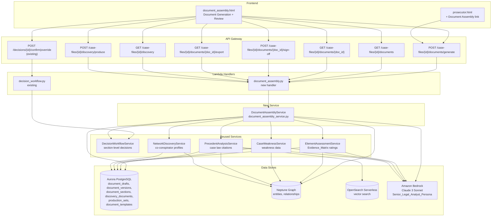
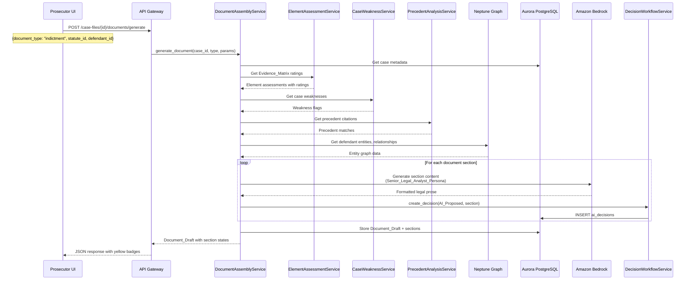
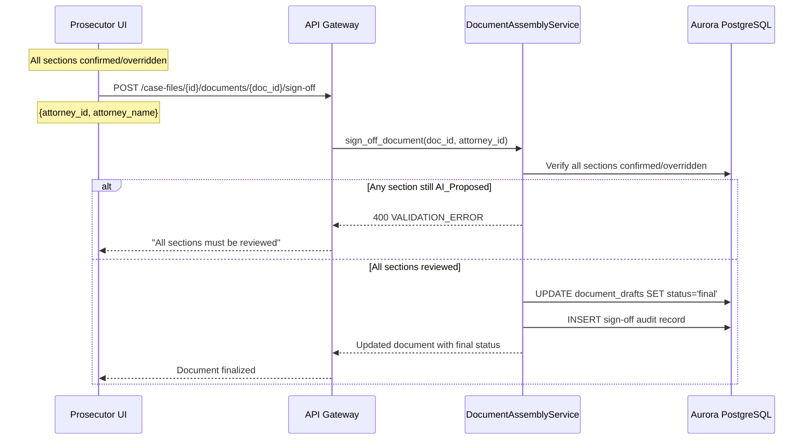
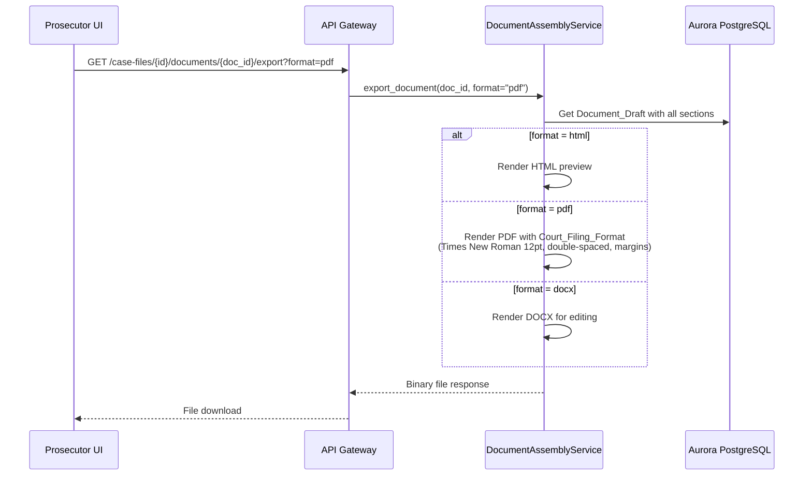

# Design Document: Court Document Assembly

## Overview

The Court Document Assembly module adds an AI-powered document generation layer to the Research Analyst platform's prosecutor workflow. It automatically produces court-ready legal documents — indictments, evidence summaries, witness lists, exhibit lists, sentencing memoranda, case briefs, and template-based filings — from case evidence stored in the Neptune knowledge graph, OpenSearch vector search, and Aurora PostgreSQL.

The module reuses the `DecisionWorkflowService`, `ai_decisions` table, and `ai_decision_audit_log` table from the prosecutor-case-review spec for section-level human-in-the-loop review. It draws evidence ratings from the `Evidence_Matrix` and `element_assessments` table, weakness data from the `Case_Weakness_Analyzer` and `case_weaknesses` table, precedent citations from the `Precedent_Analysis_Service` and `precedent_cases` table, and co-conspirator profiles from the conspiracy-network-discovery spec's `conspirator_profiles` table. Amazon Bedrock generates first drafts of all document sections using the `Senior_Legal_Analyst_Persona`, and every section flows through the three-state Decision Workflow (AI_Proposed → Human_Confirmed → Human_Overridden) before finalization.

The module extends the existing `report_generation_service.py` pattern but introduces a new `document_assembly_service.py` as the core orchestration service, a new Lambda handler `document_assembly.py`, a new frontend page `document_assembly.html`, and new Aurora tables for document drafts, versions, discovery tracking, and production sets. Multi-format export supports HTML (preview), PDF (court filing with federal formatting standards), and DOCX (editing). A `Discovery_Tracker` component manages evidence production to defense counsel with five privilege categories and privilege log generation.

The module must handle cases with 3M+ documents by querying pre-computed data from the Evidence_Matrix, element_assessments, case_weaknesses, and precedent_cases tables rather than scanning raw document content. Paginated queries (1,000 records per batch), Bedrock context window limits (100K tokens), and async generation for large evidence sets ensure scalability.

### Design Principles

- **Extend, don't duplicate**: Reuse `DecisionWorkflowService` for section-level decisions, `Evidence_Matrix` for evidence ratings, `Case_Weakness_Analyzer` for weakness data, `Precedent_Analysis_Service` for case law citations, and `conspirator_profiles` for co-conspirator data
- **Same infrastructure**: All new services deploy as Lambda functions behind the existing API Gateway, using the same Aurora/Neptune/OpenSearch/Bedrock stack
- **Section-level granularity**: Every generated document section is an independent `AI_Proposed` decision, reviewable and overridable individually
- **Attorney Sign-Off**: Documents requiring court filing (indictments, sentencing memoranda, template filings) require explicit attorney sign-off before finalization
- **Senior Legal Analyst Persona**: All Bedrock calls use the same system prompt from prosecutor-case-review instructing the model to reason as a seasoned federal prosecutor (AUSA)
- **Scalability-first**: Query pre-computed indices, paginate large result sets, summarize before passing to Bedrock, and support async generation for large cases
- **Loose coupling**: `DocumentAssemblyService` follows the existing Protocol/constructor-injection pattern, independently testable with injected dependencies

## Architecture



### Data Flow: Document Generation



### Data Flow: Attorney Sign-Off



### Data Flow: Multi-Format Export



## Components and Interfaces

### 1. DocumentAssemblyService (`src/services/document_assembly_service.py`)

The core orchestration service. Follows the existing Protocol/constructor-injection pattern used by `element_assessment_service.py` and `decision_workflow_service.py`. Coordinates evidence gathering from pre-computed tables, Bedrock AI generation, section-level decision workflow, version control, and multi-format export.

```python
class DocumentAssemblyService:
    SENIOR_LEGAL_ANALYST_PERSONA = (
        "You are a senior federal prosecutor (AUSA) with 20+ years of experience. "
        "Reason using proper legal terminology. Cite case law patterns and reference "
        "federal sentencing guidelines (USSG) where applicable. Provide thorough legal "
        "justifications for every recommendation. Format all output for federal court "
        "filing standards."
    )

    DOCUMENT_TYPES = [
        "indictment", "evidence_summary", "witness_list", "exhibit_list",
        "sentencing_memorandum", "case_brief", "motion_in_limine",
        "motion_to_compel", "response_to_motion", "notice_of_evidence",
        "plea_agreement",
    ]

    PAGE_SIZE = 1000  # paginated query batch size
    MAX_BEDROCK_TOKENS = 100_000  # context window limit
    ASYNC_THRESHOLD = 10_000  # evidence items before async generation

    def __init__(
        self,
        aurora_cm,
        neptune_endpoint: str,
        neptune_port: str,
        bedrock_client,
        decision_workflow_svc: "DecisionWorkflowService",
        element_assessment_svc: "ElementAssessmentService" = None,
        case_weakness_svc: "CaseWeaknessService" = None,
        precedent_analysis_svc: "PrecedentAnalysisService" = None,
    ):
        ...

    # --- Document Generation ---

    def generate_document(
        self, case_id: str, document_type: str,
        statute_id: str = None, defendant_id: str = None,
    ) -> "DocumentDraft":
        """Generate a court document with section-level decision workflow.
        1. Validate document_type and gather case data from pre-computed tables
        2. If evidence items > ASYNC_THRESHOLD, return {status: 'processing'}
        3. For each section, invoke Bedrock with Senior_Legal_Analyst_Persona
        4. Create AI_Proposed decision for each section via DecisionWorkflowService
        5. Store DocumentDraft with all sections in Aurora
        6. Return DocumentDraft with section decision states."""

    def get_document(self, doc_id: str) -> "DocumentDraft":
        """Retrieve a DocumentDraft with all sections, version history, and decision states."""

    def list_documents(
        self, case_id: str, document_type: str = None, status: str = None,
    ) -> list["DocumentDraft"]:
        """List all DocumentDrafts for a case, filterable by type and status."""

    # --- Section Management ---

    def get_section(self, doc_id: str, section_id: str) -> "DocumentSection":
        """Retrieve a single document section with its decision state."""

    def update_section_content(
        self, doc_id: str, section_id: str, new_content: str, author_id: str,
    ) -> "DocumentSection":
        """Update section content (used during override). Creates new version."""

    # --- Attorney Sign-Off ---

    def sign_off_document(
        self, doc_id: str, attorney_id: str, attorney_name: str,
    ) -> "DocumentDraft":
        """Record Attorney_Sign_Off. Requires all sections to be
        Human_Confirmed or Human_Overridden. Updates status to 'final'."""

    # --- Version Control ---

    def create_version(
        self, doc_id: str, changed_sections: list[str], author_id: str,
    ) -> "DocumentVersion":
        """Create a new version snapshot when sections are confirmed/overridden."""

    def get_version_history(self, doc_id: str) -> list["DocumentVersion"]:
        """Get chronological list of all versions for a document."""

    def get_version(self, doc_id: str, version_number: int) -> "DocumentVersion":
        """Retrieve a specific historical version with full content."""

    def compare_versions(
        self, doc_id: str, version_a: int, version_b: int,
    ) -> "VersionDiff":
        """Compare two versions and return section-level diffs."""

    # --- Multi-Format Export ---

    def export_document(self, doc_id: str, format: str) -> bytes:
        """Export document in HTML, PDF, or DOCX format.
        PDF uses Court_Filing_Format (Times New Roman 12pt, double-spaced,
        1-inch margins, page numbering per local court rules)."""

    # --- Discovery Tracking ---

    def get_discovery_status(self, case_id: str) -> "DiscoveryStatus":
        """Return production status dashboard: counts by Privilege_Category,
        total produced, pending, withheld."""

    def categorize_document_privilege(
        self, case_id: str, document_id: str,
    ) -> "PrivilegeCategorization":
        """Auto-categorize a document into one of 5 Privilege_Categories
        using Bedrock. Creates AI_Proposed decision for review."""

    def create_production_set(
        self, case_id: str, recipient: str, document_ids: list[str],
    ) -> "ProductionSet":
        """Create a new Production_Set with metadata."""

    def generate_privilege_log(self, case_id: str) -> list["PrivilegeLogEntry"]:
        """Generate privilege log entries for all withheld documents."""

    # --- USSG Calculator ---

    def compute_sentencing_guidelines(
        self, statute_id: str, offense_characteristics: dict,
        criminal_history_category: int,
    ) -> "GuidelineCalculation":
        """Compute USSG guideline range from base offense level,
        specific offense characteristics, adjustments, and criminal
        history category. Returns range in months."""

    # --- Internal Methods ---

    def _gather_evidence_data(self, case_id: str, statute_id: str = None) -> dict:
        """Query Evidence_Matrix, element_assessments, case_weaknesses,
        and precedent_cases tables. Paginated in batches of PAGE_SIZE."""

    def _gather_witness_data(self, case_id: str) -> list[dict]:
        """Query Neptune for person entities with document co-occurrence >= 2.
        Paginated in batches of 10,000 for large cases."""

    def _gather_exhibit_data(self, case_id: str) -> list[dict]:
        """Query Aurora documents and Neptune entity links for exhibit catalog."""

    def _gather_conspirator_data(self, case_id: str) -> list[dict]:
        """Query conspirator_profiles table for co-conspirator data."""

    def _summarize_for_bedrock(self, data: dict) -> str:
        """Summarize large evidence sets into structured data that fits
        within MAX_BEDROCK_TOKENS context window."""

    def _invoke_bedrock_section(
        self, section_type: str, context_data: str,
    ) -> str:
        """Invoke Bedrock with Senior_Legal_Analyst_Persona for a single
        document section. Returns formatted legal prose."""

    def _render_html(self, draft: "DocumentDraft") -> bytes:
        """Render document as HTML preview."""

    def _render_pdf(self, draft: "DocumentDraft") -> bytes:
        """Render document as PDF with Court_Filing_Format."""

    def _render_docx(self, draft: "DocumentDraft") -> bytes:
        """Render document as DOCX for editing."""
```

### 2. Document Type Generators

Each document type has a dedicated generation method within `DocumentAssemblyService` that defines the section structure and data gathering strategy:

| Generator | Sections | Data Sources |
|---|---|---|
| `_generate_indictment` | Caption, Counts (per charge), Factual Basis (per count), Overt Acts, Forfeiture Allegations | Evidence_Matrix, Statute_Library, Neptune (defendants, events, assets) |
| `_generate_evidence_summary` | Per-element sections with evidence items, strength ratings, evidence chains, narrative summaries per category | Evidence_Matrix, element_assessments, document metadata |
| `_generate_witness_list` | Per-witness entries with role, testimony summary, credibility, impeachment flags | Neptune (person entities), Case_Weakness_Analyzer, document co-occurrence |
| `_generate_exhibit_list` | Numbered exhibit entries with description, source, relevance, authentication notes | Aurora documents, Evidence_Matrix element mappings |
| `_generate_sentencing_memo` | Introduction, Offense Conduct, Criminal History, USSG Calculations, Aggravating Factors, Mitigating Factors, Victim Impact, Recommendation | Evidence_Matrix, USSG_Calculator, Precedent_Analysis_Service, Neptune (victim entities) |
| `_generate_case_brief` | Case Overview, Investigation Summary, Evidence Analysis, Legal Theory, Anticipated Defenses, Trial Strategy | Aurora metadata, Evidence_Matrix, Case_Weakness_Analyzer, Precedent_Analysis_Service |
| `_generate_template_filing` | Template-specific sections with AI-generated legal arguments | Document_Templates table, Neptune, Evidence_Matrix |

### 3. Lambda Handler (`src/lambdas/api/document_assembly.py`)

Follows the existing dispatch pattern from `cross_case.py`:

```python
def dispatch_handler(event, context):
    """Route by HTTP method + resource path."""
    method = event.get("httpMethod", "")
    resource = event.get("resource", "")

    if method == "OPTIONS":
        return {"statusCode": 200, "headers": CORS_HEADERS, "body": ""}

    routes = {
        ("POST", "/case-files/{id}/documents/generate"): generate_handler,
        ("GET", "/case-files/{id}/documents"): list_documents_handler,
        ("GET", "/case-files/{id}/documents/{doc_id}"): get_document_handler,
        ("POST", "/case-files/{id}/documents/{doc_id}/sign-off"): sign_off_handler,
        ("GET", "/case-files/{id}/documents/{doc_id}/export"): export_handler,
        ("GET", "/case-files/{id}/discovery"): get_discovery_handler,
        ("POST", "/case-files/{id}/discovery/produce"): produce_handler,
    }
    handler = routes.get((method, resource))
    if handler:
        return handler(event, context)
    return error_response(404, "NOT_FOUND", f"Unknown route: {method} {resource}", event)


def _build_document_assembly_service():
    """Construct DocumentAssemblyService with all dependencies from environment."""
    import boto3
    from db.connection import ConnectionManager
    from services.document_assembly_service import DocumentAssemblyService
    from services.decision_workflow_service import DecisionWorkflowService
    from services.element_assessment_service import ElementAssessmentService
    from services.case_weakness_service import CaseWeaknessService
    from services.precedent_analysis_service import PrecedentAnalysisService

    aurora_cm = ConnectionManager()
    bedrock = boto3.client("bedrock-runtime")
    dws = DecisionWorkflowService(aurora_cm)
    eas = ElementAssessmentService(aurora_cm, ...)
    cws = CaseWeaknessService(aurora_cm, ...)
    pas = PrecedentAnalysisService(aurora_cm, ...)

    return DocumentAssemblyService(
        aurora_cm=aurora_cm,
        neptune_endpoint=os.environ.get("NEPTUNE_ENDPOINT", ""),
        neptune_port=os.environ.get("NEPTUNE_PORT", "8182"),
        bedrock_client=bedrock,
        decision_workflow_svc=dws,
        element_assessment_svc=eas,
        case_weakness_svc=cws,
        precedent_analysis_svc=pas,
    )
```

### 4. API Gateway Routes (additions to `api_definition.yaml`)

```yaml
/case-files/{id}/documents/generate:
  post:
    summary: Generate a court document
    operationId: generateDocument
    parameters:
      - {name: id, in: path, required: true, schema: {type: string, format: uuid}}
    requestBody:
      required: true
      content:
        application/json:
          schema:
            properties:
              document_type:
                type: string
                enum: [indictment, evidence_summary, witness_list, exhibit_list,
                       sentencing_memorandum, case_brief, motion_in_limine,
                       motion_to_compel, response_to_motion, notice_of_evidence,
                       plea_agreement]
              statute_id: {type: string, format: uuid}
              defendant_id: {type: string, format: uuid}
            required: [document_type]
    responses:
      "200": {description: "DocumentDraft with sections and decision states"}
      "202": {description: "Async processing started (>10K evidence items)"}
      "400": {description: "Validation error"}
      "404": {description: "Case not found"}
  options:
    summary: CORS preflight
    operationId: optionsGenerateDocument

/case-files/{id}/documents:
  get:
    summary: List all documents for a case
    operationId: listDocuments
    parameters:
      - {name: id, in: path, required: true, schema: {type: string, format: uuid}}
      - {name: document_type, in: query, schema: {type: string}}
      - {name: status, in: query, schema: {type: string, enum: [draft, final, archived]}}
    responses:
      "200": {description: "List of DocumentDrafts"}
  options:
    summary: CORS preflight
    operationId: optionsListDocuments

/case-files/{id}/documents/{doc_id}:
  get:
    summary: Get a specific document with sections and version history
    operationId: getDocument
    parameters:
      - {name: id, in: path, required: true, schema: {type: string, format: uuid}}
      - {name: doc_id, in: path, required: true, schema: {type: string, format: uuid}}
    responses:
      "200": {description: "DocumentDraft with full details"}
      "404": {description: "Document not found"}
  options:
    summary: CORS preflight
    operationId: optionsGetDocument

/case-files/{id}/documents/{doc_id}/sign-off:
  post:
    summary: Record Attorney Sign-Off for a document
    operationId: signOffDocument
    parameters:
      - {name: id, in: path, required: true, schema: {type: string, format: uuid}}
      - {name: doc_id, in: path, required: true, schema: {type: string, format: uuid}}
    requestBody:
      required: true
      content:
        application/json:
          schema:
            properties:
              attorney_id: {type: string}
              attorney_name: {type: string}
            required: [attorney_id, attorney_name]
    responses:
      "200": {description: "Document finalized"}
      "400": {description: "Not all sections reviewed"}
      "404": {description: "Document not found"}
  options:
    summary: CORS preflight
    operationId: optionsSignOff

/case-files/{id}/documents/{doc_id}/export:
  get:
    summary: Export document in specified format
    operationId: exportDocument
    parameters:
      - {name: id, in: path, required: true, schema: {type: string, format: uuid}}
      - {name: doc_id, in: path, required: true, schema: {type: string, format: uuid}}
      - {name: format, in: query, required: true, schema: {type: string, enum: [html, pdf, docx]}}
    responses:
      "200": {description: "Binary file response"}
      "404": {description: "Document not found"}
  options:
    summary: CORS preflight
    operationId: optionsExportDocument

/case-files/{id}/discovery:
  get:
    summary: Get discovery production status dashboard
    operationId: getDiscoveryStatus
    parameters:
      - {name: id, in: path, required: true, schema: {type: string, format: uuid}}
    responses:
      "200": {description: "Discovery status with counts by privilege category"}
  options:
    summary: CORS preflight
    operationId: optionsDiscovery

/case-files/{id}/discovery/produce:
  post:
    summary: Create a new production set
    operationId: createProductionSet
    parameters:
      - {name: id, in: path, required: true, schema: {type: string, format: uuid}}
    requestBody:
      required: true
      content:
        application/json:
          schema:
            properties:
              recipient: {type: string}
              document_ids:
                type: array
                items: {type: string, format: uuid}
            required: [recipient, document_ids]
    responses:
      "201": {description: "Production set created"}
      "400": {description: "Validation error"}
  options:
    summary: CORS preflight
    operationId: optionsProduceDiscovery
```

### 5. Frontend (`src/frontend/document_assembly.html`)

New page accessible from the prosecutor navigation, following the same layout patterns as `prosecutor.html` with the orange (#f6ad55) accent.

- **Document Type Selector**: Dropdown to choose from Indictment, Evidence Summary Report, Witness List, Exhibit List, Sentencing Memorandum, Case Brief, and template-based filings (Motion in Limine, Motion to Compel, Response to Motion, Notice of Evidence, Plea Agreement). Includes optional statute and defendant selectors.
- **Document Generation Panel**: "Generate" button triggers document creation. Shows progress indicator during generation. For async generation (>10K evidence items), shows polling status.
- **Section Review Panel**: Each generated document displays with individually expandable sections. Each section shows:
  - Decision state badge: yellow (AI_Proposed), green (Human_Confirmed), blue (Human_Overridden)
  - Accept and Override buttons following the prosecutor-case-review UI pattern
  - Override triggers inline text editor pre-populated with AI content, with tracked changes on submit
- **Attorney Sign-Off Panel**: Enabled only when all sections are confirmed/overridden. Shows sign-off button with attorney identity field. Disabled with tooltip when sections remain unreviewed.
- **Export Buttons**: HTML preview, PDF download, DOCX download for each document.
- **Version History Panel**: Chronological list of versions with author, timestamp, and changed sections summary. Side-by-side comparison when two versions are selected.
- **Discovery Production Tab**: Tabbed sub-panel showing:
  - Production status dashboard (counts by Privilege_Category, produced/pending/withheld)
  - Privilege categorization review interface with Accept/Override per document
  - Production set management (create new set, view history)
  - Privilege log viewer/exporter

## Data Models

### Aurora PostgreSQL Schema (new tables)

```sql
-- Migration: 004_court_document_assembly.sql

-- Document drafts: top-level container for generated documents
CREATE TABLE document_drafts (
    draft_id UUID PRIMARY KEY DEFAULT gen_random_uuid(),
    case_id UUID NOT NULL REFERENCES case_files(case_id) ON DELETE CASCADE,
    document_type VARCHAR(50) NOT NULL
        CHECK (document_type IN ('indictment', 'evidence_summary', 'witness_list',
               'exhibit_list', 'sentencing_memorandum', 'case_brief',
               'motion_in_limine', 'motion_to_compel', 'response_to_motion',
               'notice_of_evidence', 'plea_agreement')),
    title VARCHAR(500) NOT NULL,
    status VARCHAR(20) NOT NULL DEFAULT 'draft'
        CHECK (status IN ('draft', 'processing', 'final', 'archived')),
    statute_id UUID REFERENCES statutes(statute_id),
    defendant_id VARCHAR(255),  -- Neptune entity reference
    current_version INT NOT NULL DEFAULT 1,
    sign_off_attorney_id VARCHAR(255),
    sign_off_attorney_name VARCHAR(255),
    sign_off_at TIMESTAMP WITH TIME ZONE,
    is_work_product BOOLEAN NOT NULL DEFAULT FALSE,  -- excluded from discovery
    created_at TIMESTAMP WITH TIME ZONE DEFAULT NOW(),
    updated_at TIMESTAMP WITH TIME ZONE DEFAULT NOW()
);

-- Document sections: individually reviewable units
CREATE TABLE document_sections (
    section_id UUID PRIMARY KEY DEFAULT gen_random_uuid(),
    draft_id UUID NOT NULL REFERENCES document_drafts(draft_id) ON DELETE CASCADE,
    section_type VARCHAR(100) NOT NULL,  -- 'caption', 'count_1', 'factual_basis_1', 'overt_acts', etc.
    section_order INT NOT NULL,
    title VARCHAR(500) NOT NULL,
    content TEXT NOT NULL,  -- generated legal prose
    decision_id UUID REFERENCES ai_decisions(decision_id),
    created_at TIMESTAMP WITH TIME ZONE DEFAULT NOW(),
    updated_at TIMESTAMP WITH TIME ZONE DEFAULT NOW(),
    UNIQUE (draft_id, section_order)
);

-- Document versions: full snapshots for version control
CREATE TABLE document_versions (
    version_id UUID PRIMARY KEY DEFAULT gen_random_uuid(),
    draft_id UUID NOT NULL REFERENCES document_drafts(draft_id) ON DELETE CASCADE,
    version_number INT NOT NULL,
    content_snapshot JSONB NOT NULL,  -- full document content at this version
    changed_sections JSONB NOT NULL DEFAULT '[]',  -- list of section_ids that changed
    author_id VARCHAR(255) NOT NULL,
    author_name VARCHAR(255),
    change_summary TEXT,
    created_at TIMESTAMP WITH TIME ZONE DEFAULT NOW(),
    UNIQUE (draft_id, version_number)
);

-- Document templates: reusable filing templates
CREATE TABLE document_templates (
    template_id UUID PRIMARY KEY DEFAULT gen_random_uuid(),
    template_type VARCHAR(50) NOT NULL
        CHECK (template_type IN ('motion_in_limine', 'motion_to_compel',
               'response_to_motion', 'notice_of_evidence', 'plea_agreement')),
    title VARCHAR(500) NOT NULL,
    template_content TEXT NOT NULL,  -- template with {{placeholders}}
    section_definitions JSONB NOT NULL DEFAULT '[]',  -- [{section_type, title, is_ai_generated}]
    court_jurisdiction VARCHAR(100),  -- for local rule formatting
    created_at TIMESTAMP WITH TIME ZONE DEFAULT NOW(),
    updated_at TIMESTAMP WITH TIME ZONE DEFAULT NOW()
);

-- Discovery document tracking: privilege categorization per document
CREATE TABLE discovery_documents (
    discovery_id UUID PRIMARY KEY DEFAULT gen_random_uuid(),
    case_id UUID NOT NULL REFERENCES case_files(case_id) ON DELETE CASCADE,
    document_id UUID NOT NULL,  -- references documents table
    privilege_category VARCHAR(30) NOT NULL DEFAULT 'pending'
        CHECK (privilege_category IN ('producible', 'attorney_client_privilege',
               'work_product', 'brady_material', 'jencks_material', 'pending')),
    production_status VARCHAR(20) NOT NULL DEFAULT 'pending'
        CHECK (production_status IN ('produced', 'pending', 'withheld')),
    privilege_description TEXT,  -- AI-drafted privilege log entry
    privilege_doctrine TEXT,  -- applicable privilege doctrine
    linked_witness_id VARCHAR(255),  -- for Jencks material
    disclosure_alert BOOLEAN NOT NULL DEFAULT FALSE,  -- Brady high-priority flag
    disclosure_alert_at TIMESTAMP WITH TIME ZONE,
    waiver_flag BOOLEAN NOT NULL DEFAULT FALSE,  -- privilege waiver risk
    decision_id UUID REFERENCES ai_decisions(decision_id),
    created_at TIMESTAMP WITH TIME ZONE DEFAULT NOW(),
    updated_at TIMESTAMP WITH TIME ZONE DEFAULT NOW(),
    UNIQUE (case_id, document_id)
);

-- Production sets: batches of documents produced to defense
CREATE TABLE production_sets (
    production_id UUID PRIMARY KEY DEFAULT gen_random_uuid(),
    case_id UUID NOT NULL REFERENCES case_files(case_id) ON DELETE CASCADE,
    production_number INT NOT NULL,
    production_date DATE NOT NULL DEFAULT CURRENT_DATE,
    recipient VARCHAR(500) NOT NULL,  -- defense counsel name
    document_ids JSONB NOT NULL DEFAULT '[]',  -- list of document_ids
    document_count INT NOT NULL DEFAULT 0,
    notes TEXT,
    created_at TIMESTAMP WITH TIME ZONE DEFAULT NOW(),
    UNIQUE (case_id, production_number)
);

-- USSG guideline reference data
CREATE TABLE ussg_guidelines (
    guideline_id UUID PRIMARY KEY DEFAULT gen_random_uuid(),
    statute_citation VARCHAR(100) NOT NULL,
    base_offense_level INT NOT NULL,
    specific_offense_characteristics JSONB NOT NULL DEFAULT '[]',
        -- [{description, level_adjustment, condition}]
    chapter_adjustments JSONB NOT NULL DEFAULT '[]',
        -- [{description, level_adjustment, condition}]
    guideline_section VARCHAR(50),  -- e.g., '§2B1.1'
    created_at TIMESTAMP WITH TIME ZONE DEFAULT NOW()
);

-- Indexes
CREATE INDEX idx_document_drafts_case ON document_drafts(case_id);
CREATE INDEX idx_document_drafts_type ON document_drafts(document_type);
CREATE INDEX idx_document_drafts_status ON document_drafts(status);
CREATE INDEX idx_document_sections_draft ON document_sections(draft_id);
CREATE INDEX idx_document_sections_decision ON document_sections(decision_id);
CREATE INDEX idx_document_versions_draft ON document_versions(draft_id);
CREATE INDEX idx_discovery_documents_case ON discovery_documents(case_id);
CREATE INDEX idx_discovery_documents_category ON discovery_documents(privilege_category);
CREATE INDEX idx_discovery_documents_status ON discovery_documents(production_status);
CREATE INDEX idx_production_sets_case ON production_sets(case_id);
CREATE INDEX idx_ussg_guidelines_statute ON ussg_guidelines(statute_citation);
```

### Pydantic Models (`src/models/document_assembly.py`)

```python
from enum import Enum
from typing import Optional
from pydantic import BaseModel, Field


class DocumentType(str, Enum):
    INDICTMENT = "indictment"
    EVIDENCE_SUMMARY = "evidence_summary"
    WITNESS_LIST = "witness_list"
    EXHIBIT_LIST = "exhibit_list"
    SENTENCING_MEMORANDUM = "sentencing_memorandum"
    CASE_BRIEF = "case_brief"
    MOTION_IN_LIMINE = "motion_in_limine"
    MOTION_TO_COMPEL = "motion_to_compel"
    RESPONSE_TO_MOTION = "response_to_motion"
    NOTICE_OF_EVIDENCE = "notice_of_evidence"
    PLEA_AGREEMENT = "plea_agreement"


class DocumentStatus(str, Enum):
    DRAFT = "draft"
    PROCESSING = "processing"
    FINAL = "final"
    ARCHIVED = "archived"


class PrivilegeCategory(str, Enum):
    PRODUCIBLE = "producible"
    ATTORNEY_CLIENT_PRIVILEGE = "attorney_client_privilege"
    WORK_PRODUCT = "work_product"
    BRADY_MATERIAL = "brady_material"
    JENCKS_MATERIAL = "jencks_material"
    PENDING = "pending"


class ProductionStatus(str, Enum):
    PRODUCED = "produced"
    PENDING = "pending"
    WITHHELD = "withheld"


class WitnessRole(str, Enum):
    VICTIM = "victim"
    FACT_WITNESS = "fact_witness"
    EXPERT_WITNESS = "expert_witness"
    COOPERATING_WITNESS = "cooperating_witness"
    LAW_ENFORCEMENT = "law_enforcement"


class ExhibitType(str, Enum):
    DOCUMENTARY = "documentary"
    PHYSICAL = "physical"
    DIGITAL = "digital"
    TESTIMONIAL = "testimonial"


class DocumentSection(BaseModel):
    section_id: str
    draft_id: str
    section_type: str
    section_order: int
    title: str
    content: str
    decision_id: Optional[str] = None
    decision_state: str = "ai_proposed"  # from ai_decisions table


class DocumentDraft(BaseModel):
    draft_id: str
    case_id: str
    document_type: DocumentType
    title: str
    status: DocumentStatus
    statute_id: Optional[str] = None
    defendant_id: Optional[str] = None
    current_version: int = 1
    sections: list[DocumentSection] = []
    sign_off_attorney_id: Optional[str] = None
    sign_off_attorney_name: Optional[str] = None
    sign_off_at: Optional[str] = None
    is_work_product: bool = False
    created_at: str
    updated_at: str


class DocumentVersion(BaseModel):
    version_id: str
    draft_id: str
    version_number: int
    content_snapshot: dict  # full document content
    changed_sections: list[str] = []
    author_id: str
    author_name: Optional[str] = None
    change_summary: Optional[str] = None
    created_at: str


class VersionDiff(BaseModel):
    draft_id: str
    version_a: int
    version_b: int
    section_diffs: list[dict]  # [{section_id, old_content, new_content}]


class WitnessEntry(BaseModel):
    entity_name: str
    role: WitnessRole
    testimony_summary: str
    documents: list[dict]  # [{document_id, document_name, page_reference}]
    credibility_assessment: str
    impeachment_flags: list[str] = []
    decision_id: Optional[str] = None


class ExhibitEntry(BaseModel):
    exhibit_number: int
    description: str
    source: str
    exhibit_type: ExhibitType
    statutory_elements: list[str] = []  # element_ids it supports
    authentication_notes: str
    decision_id: Optional[str] = None


class GuidelineCalculation(BaseModel):
    statute_citation: str
    guideline_section: str
    base_offense_level: int
    specific_offense_adjustments: list[dict] = []
    chapter_adjustments: list[dict] = []
    total_offense_level: int
    criminal_history_category: int
    guideline_range_months_low: int
    guideline_range_months_high: int


class DiscoveryDocument(BaseModel):
    discovery_id: str
    case_id: str
    document_id: str
    privilege_category: PrivilegeCategory
    production_status: ProductionStatus
    privilege_description: Optional[str] = None
    privilege_doctrine: Optional[str] = None
    linked_witness_id: Optional[str] = None
    disclosure_alert: bool = False
    waiver_flag: bool = False
    decision_id: Optional[str] = None


class ProductionSet(BaseModel):
    production_id: str
    case_id: str
    production_number: int
    production_date: str
    recipient: str
    document_ids: list[str] = []
    document_count: int = 0
    notes: Optional[str] = None


class DiscoveryStatus(BaseModel):
    case_id: str
    total_documents: int
    producible_count: int
    attorney_client_count: int
    work_product_count: int
    brady_count: int
    jencks_count: int
    pending_count: int
    produced_count: int
    withheld_count: int
    production_sets: list[ProductionSet] = []


class PrivilegeLogEntry(BaseModel):
    document_id: str
    document_name: str
    privilege_category: PrivilegeCategory
    privilege_description: str
    privilege_doctrine: str
    date_withheld: str
```

## Correctness Properties

*A property is a characteristic or behavior that should hold true across all valid executions of a system — essentially, a formal statement about what the system should do. Properties serve as the bridge between human-readable specifications and machine-verifiable correctness guarantees.*

### Property 1: Document structural completeness

*For any* valid document type and case data, the generated `DocumentDraft` should contain all required sections for that document type: indictments must have caption, at least one count, factual basis per count, overt acts, and forfeiture allegations; evidence summaries must have one section per statutory element; sentencing memoranda must have introduction, offense conduct, criminal history, USSG calculations, aggravating factors, mitigating factors, and recommendation; case briefs must have case overview, investigation summary, evidence analysis, legal theory, anticipated defenses, and trial strategy.

**Validates: Requirements 1.1, 2.1, 5.1, 6.1**

### Property 2: Section-decision invariant

*For any* generated `DocumentDraft`, every `DocumentSection` in the draft should have a corresponding `ai_decisions` record with `state = 'ai_proposed'` and a valid `decision_id`. The count of AI_Proposed decisions created should equal the count of sections in the document.

**Validates: Requirements 1.7, 2.7, 3.7, 4.6, 5.7, 6.7, 7.8, 8.7**

### Property 3: Attorney sign-off requires all sections reviewed

*For any* `DocumentDraft` with `status = 'final'`, the `sign_off_attorney_id` and `sign_off_attorney_name` must be non-null and non-empty, `sign_off_at` must be a valid timestamp, and every section in the document must have a decision state of either `human_confirmed` or `human_overridden` (no `ai_proposed` sections remain).

**Validates: Requirements 1.8, 5.8, 8.8**

### Property 4: Caption section contains required fields

*For any* indictment document generated for a case with known metadata, the caption section content should contain the case number, district court name, at least one defendant name, and at least one statute citation.

**Validates: Requirements 1.3**

### Property 5: Overt acts chronological ordering

*For any* indictment document with an overt acts section containing two or more overt acts, the acts should be ordered chronologically by date, with each act's date being less than or equal to the next act's date.

**Validates: Requirements 1.5**

### Property 6: Witness co-occurrence filter

*For any* case with person entities having varying document co-occurrence counts, the `Witness_List_Generator` should include only persons with a co-occurrence count of two or more. No person with a co-occurrence count of zero or one should appear in the witness list.

**Validates: Requirements 3.1**

### Property 7: Witness entry completeness and role domain

*For any* witness entry in a generated witness list, the entry should have a non-empty `entity_name`, a `role` in {victim, fact_witness, expert_witness, cooperating_witness, law_enforcement}, a non-empty `testimony_summary`, at least one document reference, and a non-empty `credibility_assessment`.

**Validates: Requirements 3.2, 3.3**

### Property 8: Impeachment flags from weakness data

*For any* witness who has conflicting statements identified by the `Case_Weakness_Analyzer`, the corresponding witness entry should have a non-empty `impeachment_flags` list containing references to the conflicting documents.

**Validates: Requirements 3.5, 3.6**

### Property 9: Exhibit sequential numbering and type domain

*For any* generated exhibit list with N exhibits, the exhibit numbers should be a contiguous sequence from 1 to N with no gaps or duplicates, and each exhibit's `exhibit_type` must be one of {documentary, physical, digital, testimonial}.

**Validates: Requirements 4.1, 4.3**

### Property 10: Exhibit element linkage filter

*For any* exhibit linked to statutory elements, those elements should have corresponding `element_assessments` records with ratings of `green` or `yellow` (not `red`). No exhibit should be linked to an element with only `red` ratings.

**Validates: Requirements 4.4**

### Property 11: USSG guideline calculation

*For any* valid base offense level, set of specific offense characteristics (each with a level adjustment), chapter adjustments, and criminal history category (1-6), the `USSG_Calculator` should produce a `total_offense_level` equal to the base level plus all adjustments (clamped to 1-43), and the guideline range months should be non-negative with `guideline_range_months_low <= guideline_range_months_high`.

**Validates: Requirements 5.3**

### Property 12: Sentencing memorandum cites precedent

*For any* sentencing memorandum generated for a case with available precedent data, the document content should contain at least one precedent case name from the `Precedent_Analysis_Service` results and at least one USSG guideline section reference (matching pattern "USSG §" or "§").

**Validates: Requirements 5.4**

### Property 13: Case brief work product exclusion

*For any* `DocumentDraft` with `document_type = 'case_brief'`, the `is_work_product` flag must be `true`. Case briefs must never appear in discovery production tracking.

**Validates: Requirements 6.8**

### Property 14: Case brief risk rating domain

*For any* case brief document, the risk assessment section should contain a risk rating that is exactly one of {Low, Medium, High}.

**Validates: Requirements 6.5**

### Property 15: Discovery privilege category domain and Brady alert

*For any* discovery document record, the `privilege_category` must be one of {producible, attorney_client_privilege, work_product, brady_material, jencks_material, pending}. Additionally, *for any* document with `privilege_category = 'brady_material'`, the `disclosure_alert` must be `true` and `disclosure_alert_at` must be a non-null timestamp.

**Validates: Requirements 7.2, 7.3**

### Property 16: Jencks material witness linkage

*For any* discovery document with `privilege_category = 'jencks_material'`, the `linked_witness_id` must be non-null and non-empty, referencing the specific witness whose prior statement the document contains.

**Validates: Requirements 7.4**

### Property 17: Discovery dashboard count invariant

*For any* case with discovery documents, the `DiscoveryStatus` dashboard counts should satisfy: `producible_count + attorney_client_count + work_product_count + brady_count + jencks_count + pending_count = total_documents`, and `produced_count + withheld_count + pending_count` (by production status) should also equal `total_documents`.

**Validates: Requirements 7.7**

### Property 18: Privilege waiver detection

*For any* discovery document that has `production_status = 'produced'` and whose `privilege_category` is subsequently changed from `producible` to any privileged category (attorney_client_privilege, work_product, brady_material, or jencks_material), the `waiver_flag` must be set to `true`.

**Validates: Requirements 7.9**

### Property 19: Template placeholder resolution

*For any* document template with placeholder tokens and valid case data (case number, defendant names, statute citations), the generated output should contain zero unresolved placeholder tokens (no `{{...}}` patterns remaining in the output).

**Validates: Requirements 8.2**

### Property 20: Document draft round-trip

*For any* `DocumentDraft` stored in Aurora, retrieving it by `draft_id` should return the same `case_id`, `document_type`, `title`, `status`, `statute_id`, `defendant_id`, and the same number of sections with matching `section_type` and `content` values.

**Validates: Requirements 9.2, 9.5**

### Property 21: Version history growth on section state change

*For any* `DocumentDraft` that undergoes N section state transitions (confirm or override), the version history should contain exactly N + 1 entries (initial version plus one per transition), each with a monotonically increasing `version_number`, a non-null `author_id`, and a non-empty `changed_sections` list (except for the initial version).

**Validates: Requirements 12.1, 12.2**

### Property 22: Async threshold behavior

*For any* document generation request where the evidence item count exceeds 10,000, the initial response should have `status = 'processing'`. *For any* request where the evidence item count is 10,000 or fewer, the response should contain the complete `DocumentDraft` with `status = 'draft'`.

**Validates: Requirements 13.3**

### Property 23: Privilege log completeness for withheld documents

*For any* discovery document with `production_status = 'withheld'`, there should be a corresponding privilege log entry with a non-empty `privilege_description` and a non-empty `privilege_doctrine`.

**Validates: Requirements 7.5**

### Property 24: Production set metadata completeness

*For any* `ProductionSet`, the `production_number` must be a positive integer, `production_date` must be a valid date, `recipient` must be non-empty, `document_ids` must be a non-empty list, and `document_count` must equal the length of `document_ids`.

**Validates: Requirements 7.6**

## Error Handling

### Bedrock Unavailability

The `DocumentAssemblyService` depends on Amazon Bedrock for AI-generated narrative sections. When Bedrock is unavailable:

- **Deterministic sections generated**: Caption (from case metadata), exhibit list (from Aurora documents), witness list (from Neptune entities), USSG calculations (from guideline tables) are generated from structured data without AI
- **AI sections marked unavailable**: Narrative sections (factual basis, offense conduct, testimony summaries, legal arguments) are replaced with a placeholder: `"[AI-generated content unavailable — Bedrock service error. Retry or draft manually.]"`
- **Partial document returned**: The `DocumentDraft` is returned with `status = 'draft'` and a `warnings` field listing which sections could not be generated
- **Discovery categorization skipped**: Privilege categorization requires Bedrock; documents remain in `pending` category until Bedrock is available

### Invalid Input Handling

| Scenario | Response |
|---|---|
| Missing case_id | 400 VALIDATION_ERROR |
| Case not found | 404 NOT_FOUND |
| Invalid document_type | 400 VALIDATION_ERROR with valid types list |
| Statute not found (when required) | 404 NOT_FOUND |
| Document not found | 404 NOT_FOUND |
| Sign-off with unreviewed sections | 400 VALIDATION_ERROR "All sections must be reviewed before sign-off" |
| Sign-off on already-final document | 409 CONFLICT |
| Invalid export format | 400 VALIDATION_ERROR with valid formats list |
| Empty document_ids in production set | 400 VALIDATION_ERROR |
| Production set with non-existent documents | 400 VALIDATION_ERROR |
| Privilege category change on produced document | 200 with waiver_flag = true and alert |

### Database Errors

- **Aurora connection failures**: Return 500 INTERNAL_ERROR with logged details
- **Neptune query timeouts**: Return partial results with `warnings` field indicating incomplete graph data; deterministic sections still generated from Aurora
- **Concurrent version updates**: Use `ON CONFLICT (draft_id, version_number) DO NOTHING` with retry logic to handle concurrent section confirmations

### Scalability Error Handling

- **Evidence count > 10,000**: Return 202 with `{status: "processing", draft_id}` for async polling
- **Lambda timeout approaching (>800s elapsed)**: Save partially generated document with completed sections and `status = 'processing'`; remaining sections marked as pending
- **Bedrock token limit exceeded**: Summarize evidence data before passing to Bedrock; if still too large, split into multiple invocations and concatenate results

## Testing Strategy

### Property-Based Testing

Property-based tests use **Hypothesis** (Python) with a minimum of 100 iterations per property. Each test references its design document property.

```python
# Tag format for each property test:
# Feature: court-document-assembly, Property {N}: {property_text}
```

Properties to implement as Hypothesis tests:

1. **Property 1** (Document structural completeness): Generate random document types with random case data, verify all required sections present for each type
2. **Property 2** (Section-decision invariant): Generate random documents, verify decision count equals section count and all decisions are AI_Proposed
3. **Property 3** (Attorney sign-off invariant): Generate random documents with various section states, verify sign-off constraints
4. **Property 4** (Caption required fields): Generate random case metadata (case numbers, court names, defendant names, statute citations), verify caption contains all
5. **Property 5** (Overt acts ordering): Generate random lists of dated events, verify chronological ordering in output
6. **Property 6** (Witness co-occurrence filter): Generate random person entities with varying co-occurrence counts, verify only count >= 2 included
7. **Property 7** (Witness entry completeness): Generate random witness entries, verify all required fields present and role in valid domain
8. **Property 8** (Impeachment flags): Generate random witnesses with and without conflicting statements, verify flags present when conflicts exist
9. **Property 9** (Exhibit numbering and type): Generate random exhibit lists, verify sequential numbering 1..N and valid types
10. **Property 10** (Exhibit element linkage): Generate random exhibits with element assessments of varying ratings, verify only green/yellow linked
11. **Property 11** (USSG calculation): Generate random offense levels (1-43), random adjustments, random criminal history categories (1-6), verify total clamped to 1-43 and range_low <= range_high
12. **Property 12** (Sentencing memo citations): Generate random sentencing memos with precedent data, verify precedent case name and USSG reference present
13. **Property 13** (Case brief work product): Generate random case briefs, verify is_work_product = true
14. **Property 14** (Risk rating domain): Generate random case briefs, verify risk rating in {Low, Medium, High}
15. **Property 15** (Privilege category domain + Brady alert): Generate random discovery documents with all categories, verify domain and Brady alert invariant
16. **Property 16** (Jencks witness linkage): Generate random Jencks material documents, verify linked_witness_id non-null
17. **Property 17** (Dashboard count invariant): Generate random sets of discovery documents with various categories and statuses, verify sums
18. **Property 18** (Privilege waiver detection): Generate random produced documents, change category to privileged, verify waiver_flag
19. **Property 19** (Template placeholder resolution): Generate random templates with placeholders and random case data, verify no unresolved placeholders
20. **Property 20** (Document draft round-trip): Generate random DocumentDrafts, store and retrieve, verify equality
21. **Property 21** (Version history growth): Generate random documents with N state transitions, verify N+1 versions with monotonic numbering
22. **Property 22** (Async threshold): Generate random evidence counts above and below 10,000, verify response status
23. **Property 23** (Privilege log completeness): Generate random withheld documents, verify privilege log entries present
24. **Property 24** (Production set metadata): Generate random production sets, verify all required fields and document_count = len(document_ids)

### Unit Tests

Unit tests cover specific examples, edge cases, and integration points:

- **Indictment with single count**: Generate indictment for case with one statute, verify structure
- **Indictment with multiple counts**: Generate indictment for case with 3 statutes, verify one count section per statute
- **Evidence summary for empty case**: Generate report for case with no evidence, verify sections present with empty evidence lists
- **Witness list with no qualifying witnesses**: Generate for case where all persons have co-occurrence < 2, verify empty list
- **Exhibit list numbering starts at 1**: Generate exhibit list, verify first exhibit is number 1
- **USSG calculation edge cases**: Test offense level clamping at 1 and 43, criminal history category boundaries
- **Bedrock fallback**: Mock Bedrock to raise exception, verify partial document with deterministic sections and warning message
- **Sign-off rejected with AI_Proposed sections**: Attempt sign-off on document with one unreviewed section, verify 400 error
- **Sign-off on already-final document**: Attempt sign-off on final document, verify 409 conflict
- **Brady material auto-alert**: Categorize document as Brady, verify disclosure_alert = true and timestamp set
- **Jencks material without witness**: Attempt to create Jencks categorization without witness ID, verify validation error
- **Privilege waiver scenario**: Produce a document, then change category from producible to work_product, verify waiver_flag
- **Discovery dashboard math**: Create 10 documents with known categories, verify dashboard counts match
- **Template placeholder resolution**: Create template with 5 placeholders, provide case data, verify all resolved
- **Version history after 3 overrides**: Create document, override 3 sections, verify 4 versions exist
- **Lambda handler routing**: Verify dispatch_handler routes correctly for each HTTP method/resource combination
- **CORS preflight**: Verify OPTIONS returns correct CORS headers
- **Async generation trigger**: Create request with 15,000 evidence items, verify 202 response with processing status
- **Export format validation**: Request export with invalid format, verify 400 error
- **Case brief work product flag**: Generate case brief, verify is_work_product = true and excluded from discovery queries

### Test File Organization

```
tests/unit/
    test_document_assembly_service.py     # Properties 1-5, 11-14, 19-22, unit tests
    test_witness_list_generator.py        # Properties 6-8, unit tests
    test_exhibit_list_generator.py        # Properties 9-10, unit tests
    test_discovery_tracker.py             # Properties 15-18, 23-24, unit tests
    test_document_assembly_models.py      # Model validation tests
    test_document_assembly_handler.py     # Lambda handler routing tests
```
