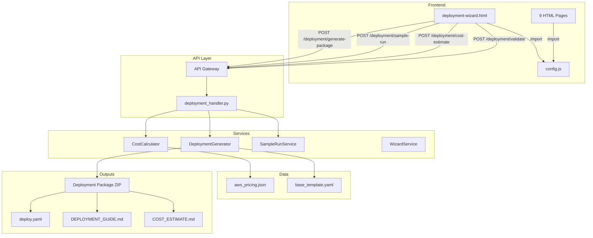

# Design Document — Customer Deployment Wizard

## Overview

The Customer Deployment Wizard transforms the Research Analyst Platform from a single-tenant development deployment into a customer-deployable product. It introduces a shared `config.js` for frontend configuration, removes legacy Streamlit dependencies, and provides a guided wizard UI that walks customers through environment configuration, module selection, data volume sizing, cost estimation, optional sample test runs, and deployment package generation.

The system enhances the existing `DeploymentGenerator` service to produce tier-aware CloudFormation templates and ZIP deployment packages. The wizard frontend is a new `deployment-wizard.html` page that communicates with backend API endpoints for cost calculation, sample test runs, and package generation.

### Key Design Decisions

1. **New `deployment-wizard.html` page** rather than modifying the existing `wizard.html` — the existing wizard handles pipeline configuration for individual cases, while the deployment wizard handles infrastructure provisioning for an entire platform instance. These are distinct concerns.

2. **Shared `config.js` as a simple ES module** — all 9 HTML pages import configuration from a single file. The file uses a `window.APP_CONFIG` global pattern (not ES modules) for maximum browser compatibility without a build step.

3. **Tier-based CloudFormation generation** — the `DeploymentGenerator` is enhanced with a tier mapping system that translates the 4 data volume tiers (Small/Medium/Large/Enterprise) into specific resource configurations, extending the existing placeholder-substitution approach in `base_template.yaml`.

4. **Client-side cost calculation with server-side validation** — cost estimation runs in the browser for instant feedback using `config/aws_pricing.json` data, with a server-side endpoint for generating the final cost report in the deployment package.

5. **Sample test run reuses existing `SampleRunService`** — the deployment wizard's sample test run delegates to the existing sample run infrastructure (Step Functions pipeline), limiting uploads to 1-5 documents.

## Architecture



### Request Flow

1. **Wizard Navigation**: User progresses through 6 steps in `deployment-wizard.html`, with client-side validation at each step.
2. **Cost Estimation**: On completing data volume sizing, the wizard computes costs client-side using embedded pricing data, and optionally calls `POST /deployment/cost-estimate` for server-validated figures.
3. **Sample Test Run** (optional): User uploads 1-5 documents, wizard calls `POST /deployment/sample-run` which delegates to `SampleRunService`.
4. **Package Generation**: User clicks "Generate Deployment Package", wizard calls `POST /deployment/generate-package` with all wizard inputs. The backend `DeploymentGenerator` produces a ZIP containing the CloudFormation template, frontend files, scripts, deployment guide, and cost estimate.

## Components and Interfaces

### 1. `config.js` — Shared Frontend Configuration

**Location**: `src/frontend/config.js`

```javascript
// Shared configuration for all frontend pages.
// Deployment tooling replaces placeholder values during package generation.
window.APP_CONFIG = {
    API_URL: '__API_URL__',
    TENANT_NAME: 'Research Analyst Platform',
    MODULES_ENABLED: ['investigator', 'prosecutor', 'network_discovery', 'document_assembly'],
    REGION: 'us-east-1'
};
```

All 9 HTML pages replace their hardcoded `const API_URL = '...'` with:
```javascript
<script src="config.js"></script>
<script>
const API_URL = window.APP_CONFIG.API_URL;
// ... rest of page script
</script>
```

Pages also conditionally render navigation links based on `MODULES_ENABLED` and display `TENANT_NAME` in headers.

### 2. `deployment-wizard.html` — Wizard UI

**Location**: `src/frontend/deployment-wizard.html`

A 6-step wizard page following the existing wizard.html styling patterns (progress bar, step sections, nav buttons):

| Step | Content | Validation |
|------|---------|------------|
| 1. Environment Configuration | AWS region dropdown, account ID, VPC CIDR, KMS ARN, S3 bucket name | 12-digit account ID, CIDR format, ARN format |
| 2. Module Selection | 4 checkboxes (Investigator pre-selected) | At least 1 module selected |
| 3. Data Volume Sizing | Document count, avg doc size MB, entity count estimate | Positive numbers, auto-tier calculation |
| 4. Cost Estimate Review | Monthly/annual breakdown by service, one-time vs recurring | Display only |
| 5. Sample Test Run (optional) | Upload 1-5 docs, view extraction results | Optional step, skippable |
| 6. Generate Deployment Package | Summary review, generate + download ZIP | All previous steps valid |

### 3. Enhanced `DeploymentGenerator` Service

**Location**: `src/services/deployment_generator.py`

New/modified methods:

```python
class DeploymentGenerator:
    # Existing methods enhanced:
    def generate_bundle(self, answers: dict, config: dict, cost_estimate: dict) -> dict
    def _render_cfn_template(self, answers: dict, config: dict) -> str

    # New methods:
    def determine_tier(self, document_count: int) -> str
        """Map document count to tier: Small/Medium/Large/Enterprise."""

    def get_tier_sizing(self, tier: str) -> dict
        """Return Neptune, Aurora, OpenSearch sizing for a tier."""

    def generate_deployment_package_zip(self, answers: dict, config: dict, cost: dict) -> bytes
        """Generate complete ZIP with deploy.yaml, frontend/, scripts/, guides."""

    def _generate_cost_estimate_md(self, cost: dict, answers: dict) -> str
        """Generate COST_ESTIMATE.md markdown from cost data."""

    def _select_frontend_files(self, modules: list[str]) -> list[str]
        """Return list of HTML files to include based on selected modules."""

    def _generate_helper_scripts(self, answers: dict) -> dict[str, str]
        """Generate migrate_db.sh, seed_statutes.sh, deploy_lambdas.sh."""

    def _render_cfn_for_tier(self, answers: dict, config: dict, tier: str) -> str
        """Render CloudFormation template with tier-specific resource sizing."""
```

### 4. `CostCalculator` Service

**Location**: `src/services/cost_calculator.py`

```python
class CostCalculator:
    def __init__(self, pricing_path: str = 'config/aws_pricing.json'):
        """Load pricing data from JSON file."""

    def calculate(self, tier: str, modules: list[str], document_count: int,
                  avg_doc_size_mb: float, entity_count: int) -> dict:
        """Compute cost breakdown.

        Returns:
            {
                'monthly': {'aurora': float, 'neptune': float, 'opensearch': float,
                            's3': float, 'lambda': float, 'api_gateway': float,
                            'bedrock': float, 'cloudfront': float, 'total': float},
                'annual': float,
                'one_time': {'ingestion_processing': float, 'total': float}
            }
        """

    def _compute_service_cost(self, service: str, tier: str, params: dict) -> float
        """Compute monthly cost for a single AWS service."""
```

### 5. `deployment_handler.py` — API Lambda Handler

**Location**: `src/lambdas/api/deployment_handler.py`

```python
def dispatch_handler(event, context):
    """Route deployment wizard API requests."""

# Endpoints:
# POST /deployment/validate        — validate wizard inputs
# POST /deployment/cost-estimate    — compute cost breakdown
# POST /deployment/sample-run       — start sample pipeline run
# GET  /deployment/sample-run/{id}  — get sample run status/results
# POST /deployment/generate-package — generate and return ZIP download URL
```

### 6. Tier Mapping

| Tier | Doc Count | Neptune | Aurora ACU | OpenSearch OCU | Extra |
|------|-----------|---------|------------|----------------|-------|
| Small | < 100K | Serverless 1-4 NCU | 0.5-4 ACU | 2 OCU | — |
| Medium | 100K-1M | r6g.xlarge | 1-8 ACU | 4 OCU | — |
| Large | 1M-10M | r6g.2xlarge | 2-16 ACU | 8 OCU | Parallel Step Functions |
| Enterprise | 10M+ | r6g.4xlarge | 4-32 ACU | 16+ OCU | SQS + Lambda fleet, S3 batch ops |

### 7. Module-to-Resource Mapping

Each module maps to specific Lambda functions, API routes, and frontend pages:

| Module | Lambda Handlers | Frontend Pages | API Routes |
|--------|----------------|----------------|------------|
| Investigator | case_files, search, drill_down, patterns, chat | investigator.html, chatbot.html | /case-files/*, /search, /chat |
| Prosecutor | decision_workflow, statutes | prosecutor.html | /decision-workflow/*, /statutes |
| Network Discovery | network_discovery | network_discovery.html | /network-discovery/* |
| Document Assembly | document_assembly | document_assembly.html | /documents/* |

Shared pages always included: pipeline-config.html, wizard.html, portfolio.html, workbench.html, deployment-wizard.html.

## Data Models

### Wizard Input Schema

```python
@dataclass
class DeploymentWizardInputs:
    # Step 1: Environment
    aws_region: str          # us-east-1, us-west-2, us-gov-west-1, us-gov-east-1
    aws_account_id: str      # 12-digit string
    vpc_cidr: str            # CIDR notation e.g. "10.0.0.0/16"
    kms_key_arn: str         # arn:aws:kms:... or arn:aws-us-gov:kms:...
    s3_bucket_name: str      # deployment bucket name

    # Step 2: Modules
    modules: list[str]       # subset of [investigator, prosecutor, network_discovery, document_assembly]

    # Step 3: Data Volume
    document_count: int
    avg_doc_size_mb: float
    entity_count: int

    # Derived
    tier: str                # Small, Medium, Large, Enterprise (auto-computed)
    total_data_volume_gb: float  # document_count * avg_doc_size_mb / 1024
```

### Tier Sizing Schema

```python
TIER_SIZING = {
    "Small": {
        "neptune": {"type": "serverless", "min_ncu": 1, "max_ncu": 4},
        "aurora": {"min_acu": 0.5, "max_acu": 4},
        "opensearch": {"ocu": 2},
    },
    "Medium": {
        "neptune": {"type": "r6g.xlarge"},
        "aurora": {"min_acu": 1, "max_acu": 8},
        "opensearch": {"ocu": 4},
    },
    "Large": {
        "neptune": {"type": "r6g.2xlarge"},
        "aurora": {"min_acu": 2, "max_acu": 16},
        "opensearch": {"ocu": 8},
        "orchestration": "parallel_step_functions",
    },
    "Enterprise": {
        "neptune": {"type": "r6g.4xlarge"},
        "aurora": {"min_acu": 4, "max_acu": 32},
        "opensearch": {"ocu": 16},
        "orchestration": "sqs_lambda_fleet",
        "batch_operations": True,
    },
}
```

### Cost Estimate Schema

```python
@dataclass
class CostEstimate:
    monthly: dict[str, float]   # service -> monthly cost
    annual: float               # monthly.total * 12
    one_time: dict[str, float]  # ingestion processing costs
```

### Deployment Package Structure

```
deployment-package.zip
├── deploy.yaml                    # Parameterized CloudFormation template
├── frontend/
│   ├── config.js                  # With API_URL: '__API_URL__' placeholder
│   ├── common.css
│   ├── investigator.html          # (if module selected)
│   ├── prosecutor.html            # (if module selected)
│   ├── network_discovery.html     # (if module selected)
│   ├── document_assembly.html     # (if module selected)
│   ├── chatbot.html               # (always included)
│   ├── pipeline-config.html       # (always included)
│   ├── portfolio.html             # (always included)
│   ├── workbench.html             # (always included)
│   └── deployment-wizard.html     # (always included)
├── scripts/
│   ├── migrate_db.sh              # Aurora schema migrations
│   ├── seed_statutes.sh           # Statute reference data seeding
│   └── deploy_lambdas.sh          # Lambda code packaging + S3 upload
├── DEPLOYMENT_GUIDE.md            # Step-by-step with customer's config pre-filled
└── COST_ESTIMATE.md               # Detailed cost breakdown
```


## Correctness Properties

*A property is a characteristic or behavior that should hold true across all valid executions of a system — essentially, a formal statement about what the system should do. Properties serve as the bridge between human-readable specifications and machine-verifiable correctness guarantees.*

### Property 1: Tier determination is consistent with document count thresholds

*For any* non-negative integer document count, `determine_tier(count)` shall return:
- "Small" if count < 100,000
- "Medium" if 100,000 ≤ count < 1,000,000
- "Large" if 1,000,000 ≤ count < 10,000,000
- "Enterprise" if count ≥ 10,000,000

And `get_tier_sizing(determine_tier(count))` shall return the correct Neptune type, Aurora ACU range, and OpenSearch OCU count for that tier.

**Validates: Requirements 5.3, 6.1, 6.2, 6.3, 6.4**

### Property 2: Wizard input validation correctly accepts and rejects inputs

*For any* string, the following validators shall hold:
- `validate_account_id(s)` returns valid if and only if `s` is exactly 12 decimal digits
- `validate_vpc_cidr(s)` returns valid if and only if `s` matches CIDR notation (e.g., `10.0.0.0/16`)
- `validate_kms_arn(s)` returns valid if and only if `s` starts with `arn:aws:kms:` or `arn:aws-us-gov:kms:`

**Validates: Requirements 3.3, 3.4, 3.5**

### Property 3: Module selection requires at least one module

*For any* subset of the four modules (including the empty set), the module validation function shall reject the empty set and accept any non-empty subset.

**Validates: Requirements 4.2**

### Property 4: Template includes only selected module resources

*For any* non-empty subset of modules and valid wizard inputs, the generated CloudFormation template shall contain Lambda function resources and API route definitions only for the selected modules, and shall not contain resources for unselected modules.

**Validates: Requirements 4.3**

### Property 5: Data volume computation is correct

*For any* positive document count and positive average document size in MB, the computed total data volume shall equal `document_count * avg_doc_size_mb / 1024` (in GB).

**Validates: Requirements 5.2**

### Property 6: Cost estimate structural invariants

*For any* valid tier, module selection, and data volume inputs:
- The cost estimate shall contain separate `monthly` and `one_time` dictionaries
- The `monthly` dictionary shall contain keys for all 8 services (Aurora, Neptune, OpenSearch, S3, Lambda, API Gateway, Bedrock, CloudFront) and a `total`
- The `annual` value shall equal `monthly['total'] * 12`
- All cost values shall be non-negative

**Validates: Requirements 7.1, 7.2, 7.5**

### Property 7: Cost estimate scales with tier

*For any* two different tiers where tier A < tier B (Small < Medium < Large < Enterprise), with the same module selection and proportional document counts, the monthly cost for tier B shall be greater than or equal to the monthly cost for tier A.

**Validates: Requirements 7.1**

### Property 8: Sample test runner accepts 1-5 documents only

*For any* non-negative integer n, the sample test runner shall accept the request if 1 ≤ n ≤ 5 and reject it otherwise.

**Validates: Requirements 8.1**

### Property 9: Sample run summary aggregation is correct

*For any* list of per-document sample run results, the summary total entities shall equal the sum of entities across all documents, and the summary total relationships shall equal the sum of relationships across all documents.

**Validates: Requirements 8.5**

### Property 10: CloudFormation template structure invariants

*For any* valid wizard inputs, the generated CloudFormation template shall:
- Contain Parameters for: EnvironmentName, AdminEmail, VpcCidr, DeploymentBucketName, LambdaCodeKey, KmsKeyArn, DataVolumeTier
- Contain Outputs for: FrontendURL, ApiGatewayURL, S3DataBucket, AuroraEndpoint, NeptuneEndpoint
- Contain resource definitions for Aurora, Neptune, OpenSearch, S3, Lambda, API Gateway, Step Functions, CloudFront, IAM, and VPC

**Validates: Requirements 9.1, 9.2, 9.5**

### Property 11: GovCloud partition correctness

*For any* wizard inputs where the region is `us-gov-west-1` or `us-gov-east-1`, all ARN references in the generated CloudFormation template shall use the `aws-us-gov` partition. *For any* inputs with a commercial region, all ARN references shall use the `aws` partition.

**Validates: Requirements 9.4**

### Property 12: KMS encryption propagation

*For any* wizard inputs that include a KMS key ARN, the generated CloudFormation template shall reference that KMS key in the Aurora, Neptune, S3, and OpenSearch resource configurations.

**Validates: Requirements 9.3**

### Property 13: Deployment package structure completeness

*For any* valid wizard inputs and module selection, the generated ZIP deployment package shall:
- Contain `deploy.yaml` at the root
- Contain `DEPLOYMENT_GUIDE.md` at the root
- Contain `COST_ESTIMATE.md` at the root
- Contain `frontend/config.js` with `'__API_URL__'` as the API_URL value
- Contain `frontend/` HTML files for exactly the selected modules plus shared pages (chatbot.html, pipeline-config.html, portfolio.html, workbench.html)
- Contain `scripts/migrate_db.sh`, `scripts/seed_statutes.sh`, `scripts/deploy_lambdas.sh`
- Not contain any `.py` files that import `streamlit`

**Validates: Requirements 10.1, 10.3, 10.4, 10.5, 2.4**

### Property 14: Deployment guide contains customer-specific values

*For any* wizard inputs, the generated `DEPLOYMENT_GUIDE.md` shall contain the deployer's selected AWS region, Data_Volume_Tier name, each selected module name, and the S3 bucket name in CLI command examples.

**Validates: Requirements 10.2**

### Property 15: Navigation links match enabled modules

*For any* subset of modules in `MODULES_ENABLED`, the navigation bar rendering shall produce links only for the enabled modules plus shared pages, and shall not produce links for disabled modules.

**Validates: Requirements 1.4**

### Property 16: Wizard step validation prevents invalid progression

*For any* wizard step with invalid or missing required fields, attempting to advance to the next step shall be blocked. *For any* step with all required fields valid, advancing shall succeed.

**Validates: Requirements 11.3**

### Property 17: Wizard back navigation preserves data (round-trip)

*For any* sequence of valid inputs entered across wizard steps, navigating backward to a previous step and then forward again shall preserve all previously entered data in subsequent steps.

**Validates: Requirements 11.4**

## Error Handling

### Input Validation Errors

| Error Condition | Handling |
|----------------|----------|
| Invalid AWS account ID (not 12 digits) | Client-side validation error message, prevent step progression |
| Invalid VPC CIDR format | Client-side validation error with format hint |
| Invalid KMS ARN prefix | Client-side validation error with expected format |
| No modules selected | Client-side validation error, disable Next button |
| Document count ≤ 0 | Client-side validation, require positive integer |
| Sample run with 0 or >5 documents | Server returns 400 with descriptive message |

### Backend Errors

| Error Condition | Handling |
|----------------|----------|
| Base CloudFormation template not found | 500 error with message "Template file missing" |
| aws_pricing.json not found or malformed | 500 error, fall back to hardcoded default pricing |
| Sample run pipeline failure | Return partial results with per-document error details including failed stage |
| ZIP generation failure (disk/memory) | 500 error with message, suggest reducing module selection |
| S3 upload for sample docs fails | 500 error with retry suggestion |

### GovCloud-Specific Errors

| Error Condition | Handling |
|----------------|----------|
| Service not available in GovCloud region | Template generation warns about unavailable services, suggests alternatives |
| Bedrock model not available in GovCloud | Template uses GovCloud-compatible model IDs |

## Testing Strategy

### Unit Tests

Unit tests cover specific examples, edge cases, and integration points:

- **config.js structure**: Verify the file exports all 4 required properties with correct types
- **Streamlit removal**: Verify no `.py` files under `src/frontend/` import streamlit, no `.streamlit/` directory exists
- **Tier boundary values**: Test document counts at exact boundaries (99999, 100000, 999999, 1000000, 9999999, 10000000)
- **GovCloud detection**: Test `us-gov-west-1` and `us-gov-east-1` produce `aws-us-gov` partition
- **Empty module selection**: Verify validation rejects empty list
- **Sample run boundaries**: Test with 0, 1, 5, and 6 documents
- **ZIP structure**: Verify specific file presence/absence in generated packages
- **Cost calculation with zero documents**: Verify graceful handling
- **Wizard default state**: Verify Investigator module is pre-selected

### Property-Based Tests

Property-based tests use `hypothesis` (Python) for server-side logic and `fast-check` (JavaScript) for client-side validation. Each test runs a minimum of 100 iterations and references its design document property.

| Property | Test Description | Library |
|----------|-----------------|---------|
| Property 1 | Generate random document counts, verify tier + sizing | hypothesis |
| Property 2 | Generate random strings, verify validator accept/reject | hypothesis |
| Property 3 | Generate random subsets of modules, verify validation | hypothesis |
| Property 4 | Generate random module subsets + inputs, verify template contents | hypothesis |
| Property 5 | Generate random count/size pairs, verify volume calculation | hypothesis |
| Property 6 | Generate random valid inputs, verify cost structure invariants | hypothesis |
| Property 7 | Generate tier pairs, verify cost monotonicity | hypothesis |
| Property 8 | Generate random integers, verify sample run acceptance | hypothesis |
| Property 9 | Generate random per-doc results, verify summary aggregation | hypothesis |
| Property 10 | Generate random valid inputs, verify template parameters/outputs | hypothesis |
| Property 11 | Generate random inputs with gov/commercial regions, verify partition | hypothesis |
| Property 12 | Generate random inputs with KMS ARN, verify encryption refs | hypothesis |
| Property 13 | Generate random module selections, verify ZIP contents | hypothesis |
| Property 14 | Generate random inputs, verify guide contains customer values | hypothesis |
| Property 15 | Generate random module subsets, verify nav link rendering | fast-check |
| Property 16 | Generate random invalid/valid field combinations, verify step validation | fast-check |
| Property 17 | Generate random input sequences, verify data preservation on back-nav | fast-check |

Each property test must be tagged with a comment:
```python
# Feature: customer-deployment-wizard, Property 1: Tier determination is consistent with document count thresholds
```

### Test File Organization

```
tests/
├── unit/
│   ├── test_deployment_generator.py      # Enhanced with new methods
│   ├── test_cost_calculator.py           # New
│   └── test_deployment_handler.py        # New API handler tests
├── property/
│   ├── test_tier_determination_props.py  # Properties 1
│   ├── test_validation_props.py          # Properties 2, 3
│   ├── test_template_gen_props.py        # Properties 4, 10, 11, 12
│   ├── test_cost_calc_props.py           # Properties 5, 6, 7
│   ├── test_sample_run_props.py          # Properties 8, 9
│   └── test_package_gen_props.py         # Properties 13, 14
```
