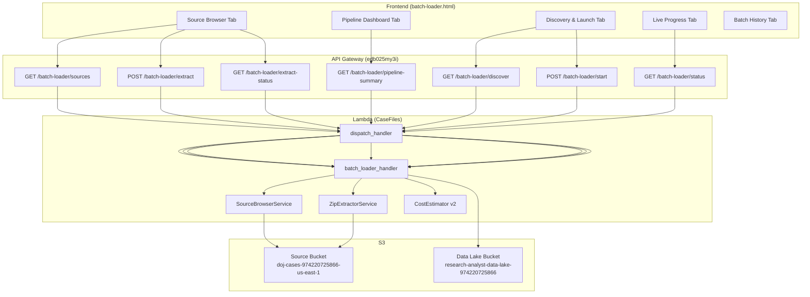
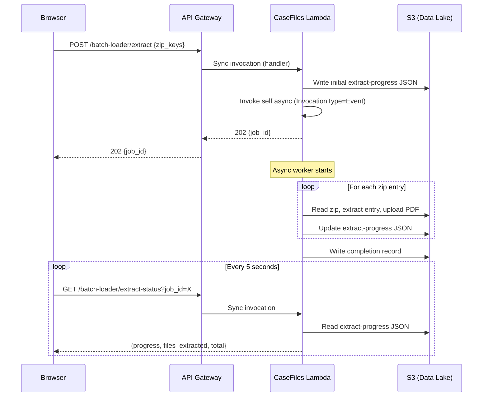

# Design Document: Data Prep & Source Management

## Overview

This feature extends the existing Batch Loader UI (`src/frontend/batch-loader.html`) and its Lambda handler (`src/lambdas/api/batch_loader_handler.py`) with four new capabilities:

1. **Source Browser** — A new tab showing all S3 prefixes in the source bucket with file counts, sizes, zip archives, and extraction status.
2. **Zip Extraction** — UI-driven extraction of zip archives to the `pdfs/` prefix via async Lambda invocations with progress tracking.
3. **Blank-Adjusted Cost Estimates** — Enhanced cost estimator that produces gross/net estimates with a configurable blank page rate (default 40%).
4. **Pipeline Dashboard** — Visual flow showing the data lifecycle from source archives through ingestion, with real-time stage counts.
5. **Multi-Prefix Scanning** — Checkbox-based prefix selector letting users choose which S3 prefixes to include in batch discovery.

All changes are Lambda code + frontend HTML only. No CDK stack changes. New API routes are added via `infra/cdk/add_routes.py`. Lambda deployment uses `infra/cdk/deploy.py` (direct `aws lambda update-function-code`).

### Key Design Decision: Async Execution Pattern

The #1 blocker is API Gateway's 29-second timeout. Both batch processing and zip extraction are long-running operations. The design uses the same async pattern already proven in `handle_start`:

1. API endpoint receives request, writes initial progress to S3, invokes Lambda asynchronously (`InvocationType=Event`), returns job ID immediately.
2. Long-running Lambda worker reads progress from S3, does work in phases, writes progress updates to S3.
3. UI polls a status endpoint every 5 seconds to read progress from S3.

This pattern is already implemented for batch processing. Zip extraction will follow the identical pattern.

### Deployment Constraints

- **No CDK changes** — CDK deploy has circular dependency issues. All Lambda code updates go through `deploy.py` which calls `aws lambda update-function-code`.
- **New API routes** — Added via `add_routes.py` which calls API Gateway REST API directly to create resources and integrations pointing to the existing CaseFiles Lambda.
- **Single Lambda** — All API routes funnel through `dispatch_handler` in `case_files.py` → `batch_loader_handler.py`. No new Lambda functions needed.

## Architecture



### Async Execution Flow (Zip Extraction)




## Components and Interfaces

### New API Endpoints

All endpoints are added to `batch_loader_handler.py` dispatch and registered via `add_routes.py`.

| Endpoint | Method | Description |
|---|---|---|
| `/batch-loader/sources` | GET | List all prefixes in source bucket with metadata |
| `/batch-loader/extract` | POST | Start async zip extraction job |
| `/batch-loader/extract-status` | GET | Poll extraction job progress |
| `/batch-loader/pipeline-summary` | GET | Get pipeline stage counts for dashboard |

### Existing Endpoints (Modified)

| Endpoint | Change |
|---|---|
| `GET /batch-loader/discover` | Add `blank_page_rate` param; return gross + net cost estimates |
| `POST /batch-loader/start` | Accept `source_prefixes` list from prefix selector |

### Component: SourceBrowserService

New service class in `src/services/source_browser_service.py`.

```python
class SourceBrowserService:
    """Inventories the source S3 bucket by prefix."""

    def __init__(self, s3_client, source_bucket: str):
        self.s3 = s3_client
        self.bucket = source_bucket

    def list_prefixes(self) -> list[PrefixInfo]:
        """List all top-level prefixes with file counts, sizes, types.
        
        Uses S3 list_objects_v2 with Delimiter='/' to get top-level prefixes,
        then paginates each prefix to count objects, sum sizes, and identify
        PDF vs zip files.
        
        Returns list of PrefixInfo dataclasses.
        """

    def get_zip_metadata(self, zip_key: str) -> ZipMetadata:
        """Read zip central directory to get file count and names.
        
        Downloads only the last ~64KB of the zip (central directory) using
        S3 range reads to avoid downloading the entire archive.
        Uses zipfile module to parse the central directory.
        """

    def get_summary(self, prefixes: list[PrefixInfo]) -> BucketSummary:
        """Compute summary: total files, extracted PDFs, processed, unprocessed."""

    def get_extraction_records(self) -> dict[str, dict]:
        """Read completion records from S3 to determine which zips are already extracted.
        
        Reads from extract-jobs/ prefix in data lake bucket.
        Returns {zip_key: completion_record}.
        """
```

### Component: ZipExtractorService

New service class in `src/services/zip_extractor_service.py`.

```python
class ZipExtractorService:
    """Streams zip archives from S3 and extracts PDFs."""

    def __init__(self, s3_client, source_bucket: str, data_lake_bucket: str):
        self.s3 = s3_client
        self.source_bucket = source_bucket
        self.data_lake_bucket = data_lake_bucket

    def start_extraction(self, zip_keys: list[str], job_id: str) -> dict:
        """Write initial progress and return job metadata.
        
        Progress stored at: extract-jobs/{job_id}/progress.json
        """

    def extract_zip(self, zip_key: str, job_id: str, start_index: int = 0) -> dict:
        """Stream zip from S3, extract PDFs to pdfs/ prefix.
        
        - Streams zip using S3 get_object
        - Iterates entries using zipfile.ZipFile
        - Uploads each PDF to source_bucket/pdfs/{dataset_prefix}_{filename}
        - Updates progress JSON every 50 files
        - If approaching Lambda timeout (check context.get_remaining_time_in_millis),
          saves resume point and re-invokes self async for remaining entries
        
        Returns completion/resume status.
        """

    def read_progress(self, job_id: str) -> dict | None:
        """Read extraction progress from S3."""

    def write_completion_record(self, job_id: str, zip_key: str, stats: dict) -> None:
        """Write completion record to S3 for 'already extracted' detection."""
```

### Component: Enhanced CostEstimator

Modified `scripts/batch_loader/cost_estimator.py` — add `blank_page_rate` parameter and dual estimate output.

```python
@dataclass
class DualCostEstimate:
    """Gross and net cost estimates with per-component breakdown."""
    gross: CostEstimate
    net: CostEstimate
    blank_page_rate: float
    component_breakdown: dict  # {component: {gross: float, net: float}}

class CostEstimator:
    def estimate_dual(self, file_count: int, blank_page_rate: float = 0.40, 
                      avg_pages: float = 3.0) -> DualCostEstimate:
        """Calculate both gross (all files) and net (blank-adjusted) estimates.
        
        Gross: all files treated as non-blank.
        Net: applies blank_page_rate reduction to Textract, Bedrock entity,
             Bedrock embedding, and Neptune write costs.
        """
```

### Component: Pipeline Summary

Added to `batch_loader_handler.py` as `handle_pipeline_summary`.

```python
def handle_pipeline_summary(event, context):
    """Return pipeline stage counts for the dashboard.
    
    Counts:
    - zip_archives: count of .zip files in source bucket
    - extracted_pdfs: count of PDFs in pdfs/ and other selected prefixes
    - blank_filtered: sum of blank_filtered from all batch manifests
    - ingested: sum of succeeded from all batch manifests
    
    Also returns selected_prefixes from the most recent batch config.
    """
```

### Frontend Changes

New tabs added to `src/frontend/batch-loader.html`:

1. **Source Browser tab** — Table of prefixes with expand/collapse for zip details. Extract button per zip. Refresh button. Summary row at top.
2. **Pipeline Dashboard tab** — Visual flow diagram with stage counts. Auto-refreshes during active batch.

Modified tabs:
- **Discovery & Launch** — Prefix selector checkboxes. Dual cost estimate display with blank rate slider.
- **Batch History** — Already exists, enhanced with extraction job history.

### Route Registration (add_routes.py)

New routes added to the `main()` function:

```python
# --- Source browser routes ---
for sub in ["sources", "extract", "extract-status", "pipeline-summary"]:
    sub_id = find_resource(f"/batch-loader/{sub}") or create_resource(bl_id, sub)
    method = "POST" if sub == "extract" else "GET"
    add_method_and_integration(sub_id, method, f"/batch-loader/{sub}")
    add_cors_options(sub_id, f"/batch-loader/{sub}")
```


## Data Models

### PrefixInfo

```python
@dataclass
class PrefixInfo:
    """Metadata for a single S3 prefix in the source bucket."""
    prefix: str              # e.g. "pdfs/", "bw-documents/"
    total_objects: int       # Total object count
    total_size_bytes: int    # Sum of all object sizes
    pdf_count: int           # Count of .pdf files
    zip_count: int           # Count of .zip files
    zip_files: list[ZipFileInfo]  # Details per zip archive
```

### ZipFileInfo

```python
@dataclass
class ZipFileInfo:
    """Metadata for a zip archive in the source bucket."""
    key: str                 # S3 key of the zip file
    size_bytes: int          # Size of the zip archive
    estimated_file_count: int  # From central directory metadata
    already_extracted: bool  # True if completion record exists
    extraction_job_id: str | None  # Job ID if extracted
```

### ZipMetadata

```python
@dataclass
class ZipMetadata:
    """Central directory metadata for a zip archive."""
    key: str
    total_entries: int
    pdf_entries: int
    filenames: list[str]     # First 100 filenames for preview
    total_uncompressed_bytes: int
```

### BucketSummary

```python
@dataclass
class BucketSummary:
    """Aggregate summary of the source bucket."""
    total_files: int
    total_extracted_pdfs: int    # PDFs ready for processing
    already_processed: int       # Files in completed manifests
    remaining_unprocessed: int   # extracted_pdfs - already_processed
```

### ExtractionJobProgress

Stored in S3 at `extract-jobs/{job_id}/progress.json` in the data lake bucket.

```json
{
    "job_id": "ext_20240115_001",
    "status": "extracting",          // "pending" | "extracting" | "completed" | "failed"
    "zip_keys": ["DataSet_11_v2.zip"],
    "current_zip": "DataSet_11_v2.zip",
    "files_extracted": 1523,
    "files_total": 45000,
    "files_skipped": 3,
    "bytes_uploaded": 234567890,
    "started_at": "2024-01-15T10:30:00Z",
    "last_updated": "2024-01-15T10:35:00Z",
    "elapsed_seconds": 300,
    "errors": [
        {"file": "corrupted.pdf", "error": "Bad zip entry"}
    ],
    "resume_index": 1523,            // For chunked extraction
    "chunk_number": 1
}
```

### ExtractionCompletionRecord

Stored in S3 at `extract-jobs/{job_id}/completion.json`.

```json
{
    "job_id": "ext_20240115_001",
    "zip_key": "DataSet_11_v2.zip",
    "total_extracted": 44997,
    "total_skipped": 3,
    "total_bytes_uploaded": 12345678900,
    "duration_seconds": 1800,
    "completed_at": "2024-01-15T11:00:00Z",
    "target_prefix": "pdfs/"
}
```

### DualCostEstimate API Response

```json
{
    "gross_estimate": {
        "textract_ocr_cost": 12.50,
        "bedrock_entity_cost": 180.00,
        "bedrock_embedding_cost": 4.50,
        "neptune_write_cost": 45.00,
        "total_estimated": 242.00,
        "estimated_ocr_pages": 8333,
        "estimated_non_blank_docs": 45000
    },
    "net_estimate": {
        "textract_ocr_cost": 7.50,
        "bedrock_entity_cost": 108.00,
        "bedrock_embedding_cost": 2.70,
        "neptune_write_cost": 27.00,
        "total_estimated": 145.20,
        "estimated_ocr_pages": 5000,
        "estimated_non_blank_docs": 27000
    },
    "blank_page_rate": 0.40,
    "component_breakdown": {
        "textract": {"gross": 12.50, "net": 7.50},
        "bedrock_entity": {"gross": 180.00, "net": 108.00},
        "bedrock_embedding": {"gross": 4.50, "net": 2.70},
        "neptune": {"gross": 45.00, "net": 27.00}
    }
}
```

### PipelineSummary API Response

```json
{
    "stages": {
        "zip_archives": {"count": 5, "label": "Source Archives"},
        "extracted_pdfs": {"count": 331000, "label": "Raw PDFs"},
        "blank_filtered": {"count": 132400, "label": "Blank Filtered"},
        "ingested": {"count": 8000, "label": "Ingested"}
    },
    "selected_prefixes": ["pdfs/", "bw-documents/"],
    "active_batch": null
}
```


## Correctness Properties

*A property is a characteristic or behavior that should hold true across all valid executions of a system — essentially, a formal statement about what the system should do. Properties serve as the bridge between human-readable specifications and machine-verifiable correctness guarantees.*

### Property 1: Prefix inventory completeness

*For any* source bucket containing an arbitrary set of objects across multiple prefixes, the `list_prefixes` function should return one `PrefixInfo` per top-level prefix where: `total_objects` equals the actual count of objects under that prefix, `total_size_bytes` equals the sum of all object sizes, `pdf_count` equals the count of `.pdf` files, and `zip_count` equals the count of `.zip` files.

**Validates: Requirements 1.1**

### Property 2: Bucket summary arithmetic consistency

*For any* list of `PrefixInfo` objects and any set of completed batch manifests, the computed `BucketSummary` should satisfy: `remaining_unprocessed == total_extracted_pdfs - already_processed`, and the pipeline stage counts should satisfy: `blank_filtered + ingested <= total_extracted_pdfs`.

**Validates: Requirements 1.2, 4.2**

### Property 3: Zip files associated with correct prefix

*For any* prefix containing zip archives, each `ZipFileInfo` in that prefix's `zip_files` list should have a `key` that starts with the prefix string, and the count of `ZipFileInfo` entries should equal the prefix's `zip_count`.

**Validates: Requirements 1.3**

### Property 4: Extraction progress contains all required fields

*For any* extraction job (started with any non-empty list of zip keys), the progress JSON should always contain: `job_id`, `status`, `zip_keys`, `files_extracted`, `files_total`, `files_skipped`, `bytes_uploaded`, `started_at`, and `last_updated`. Additionally, `files_extracted + files_skipped <= files_total` should hold at all times.

**Validates: Requirements 2.1, 2.2**

### Property 5: Extraction round trip — zip contents match extracted files

*For any* zip archive containing PDF entries, after extraction completes, the set of extracted S3 keys in the `pdfs/` prefix should contain one key per non-failed PDF entry in the original zip, and each extracted file's content should match the original zip entry content.

**Validates: Requirements 2.3**

### Property 6: Chunked extraction produces no duplicates

*For any* zip archive processed across multiple chunks (due to Lambda timeout), the union of files extracted across all chunks should have no duplicate S3 keys, and the total count should equal the sum of per-chunk extracted counts.

**Validates: Requirements 2.4**

### Property 7: Completion record consistency

*For any* completed extraction job, the completion record should satisfy: `total_extracted + total_skipped == total_entries_in_zip`, and the `zip_key` should match the source archive.

**Validates: Requirements 2.6**

### Property 8: Already-extracted detection

*For any* zip key that has a completion record in S3, the `already_extracted` field in the corresponding `ZipFileInfo` should be `True`, and for any zip key without a completion record, it should be `False`.

**Validates: Requirements 2.7**

### Property 9: Dataset-prefixed filenames prevent collisions

*For any* set of zip archives with overlapping internal filenames, the extracted S3 keys should all be unique (no two extracted files share the same key), achieved by prefixing with the dataset name.

**Validates: Requirements 2.8**

### Property 10: Dual cost estimate correctness

*For any* file count > 0 and any `blank_page_rate` in [0.0, 1.0], the `estimate_dual` function should return: (a) a gross estimate where `estimated_non_blank_docs == file_count`, (b) a net estimate where `estimated_non_blank_docs == round(file_count * (1 - blank_page_rate))`, (c) for each cost component (Textract, Bedrock entity, Bedrock embedding, Neptune), `net_cost == gross_cost * (1 - blank_page_rate)`, and (d) the response contains `gross_estimate`, `net_estimate`, `blank_page_rate`, and `component_breakdown` fields.

**Validates: Requirements 3.1, 3.2, 3.5**

### Property 11: Prefix filter — only PDF-containing prefixes returned

*For any* set of S3 prefixes, the prefix list returned for the Prefix_Selector should include only prefixes where `pdf_count > 0`, and should exclude all prefixes with zero PDF files.

**Validates: Requirements 5.1**

### Property 12: Scoped discovery — results only from selected prefixes

*For any* set of selected prefixes and any S3 bucket contents, the discovery results should contain only files whose S3 keys start with one of the selected prefixes. No file from an unselected prefix should appear in the results.

**Validates: Requirements 5.3**


## Error Handling

### S3 Errors

| Error | Handler Behavior |
|---|---|
| `NoSuchBucket` / `AccessDenied` on source bucket | Return 503 with error code and message. UI shows retry button. |
| `NoSuchKey` on progress/completion JSON | Return `None` / empty state (not an error — means no prior data). |
| Throttling (`SlowDown`) | Exponential backoff with jitter, up to 3 retries. |

### Zip Extraction Errors

| Error | Handler Behavior |
|---|---|
| Corrupted zip entry | Log error with filename, increment `files_skipped`, continue to next entry. |
| S3 upload failure for extracted file | Retry 3x with backoff. If still fails, log and skip. |
| Lambda timeout approaching | Save `resume_index` to progress JSON, re-invoke self async with `start_index`. |
| Out of memory | Caught by Lambda runtime. Progress JSON shows last successful index for manual resume. |
| Zip file not found in S3 | Mark job as failed with error message. Skip to next zip if multiple. |

### Cost Estimator Errors

| Error | Handler Behavior |
|---|---|
| `blank_page_rate` outside [0.0, 1.0] | Clamp to valid range and log warning. |
| `file_count <= 0` | Return zero-cost estimate (all fields 0). |
| Missing `aws_pricing.json` | Return error response with config error code. |

### Batch Start Errors (Existing)

The existing `handle_start` already handles:
- Missing `case_id` → 400
- Invalid `batch_size` → 400
- Empty `source_prefixes` → 400
- Batch already in progress → 409

### API Response Error Format

All errors use the existing `error_response` helper:

```json
{
    "error": {
        "code": "S3_ERROR",
        "message": "Failed to list source bucket: AccessDenied"
    },
    "requestId": "abc-123"
}
```

## Testing Strategy

### Property-Based Testing

Property-based tests use the `hypothesis` library (already available in the project's test dependencies). Each test runs a minimum of 100 iterations.

Tests are organized in `tests/unit/test_source_browser_service.py`, `tests/unit/test_zip_extractor_service.py`, and `tests/unit/test_cost_estimator_v2.py`.

Each property test is tagged with a comment referencing the design property:
```python
# Feature: data-prep-source-management, Property 1: Prefix inventory completeness
```

**Property tests to implement:**

1. **Property 1** — Generate random S3 object listings (varying prefixes, file types, sizes). Verify `list_prefixes` returns correct counts.
2. **Property 2** — Generate random `PrefixInfo` lists and manifest data. Verify summary arithmetic.
3. **Property 3** — Generate prefixes with random zip files. Verify association.
4. **Property 4** — Generate random extraction job states. Verify all fields present and count invariant holds.
5. **Property 5** — Generate small in-memory zip archives with known PDF contents. Extract and verify round-trip.
6. **Property 6** — Generate extraction sequences split at random points. Verify no duplicates across chunks.
7. **Property 7** — Generate completed extraction stats. Verify completion record consistency.
8. **Property 8** — Generate random zip keys with/without completion records. Verify `already_extracted` flag.
9. **Property 9** — Generate multiple zip archives with intentionally overlapping filenames. Verify all extracted keys are unique.
10. **Property 10** — Generate random `(file_count, blank_page_rate)` pairs. Verify gross/net math.
11. **Property 11** — Generate prefixes with varying PDF counts (including 0). Verify filter.
12. **Property 12** — Generate S3 contents and random prefix selections. Verify scoped discovery.

### Unit Tests

Unit tests cover specific examples, edge cases, and integration points:

- **S3 error handling** — Mock S3 `ClientError` responses, verify error propagation (Req 1.5).
- **Empty bucket** — Verify `list_prefixes` returns empty list.
- **Single failed zip entry** — Verify extraction continues past bad entry (Req 2.5).
- **Already-extracted zip** — Verify UI data shows disabled extract button (Req 2.7).
- **Default prefix selection** — Verify `pdfs/` and `bw-documents/` are checked by default (Req 5.2).
- **Empty prefix selection** — Verify 400 error when no prefixes selected (Req 5.6).
- **Zero file count cost estimate** — Verify all costs are 0.
- **Blank rate at boundaries** — Test `blank_page_rate` = 0.0 (gross == net) and 1.0 (net == 0).
- **Pipeline summary with no manifests** — Verify all stage counts are 0 or reflect only S3 state.

### Test Configuration

- Property tests: `hypothesis` with `@settings(max_examples=100)`
- Unit tests: `pytest` with `unittest.mock` for S3/Lambda mocking
- All tests runnable via `pytest tests/unit/ --run`
- Each property-based test must reference its design property number in a comment
