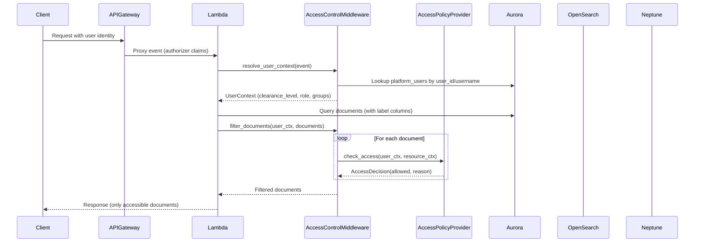
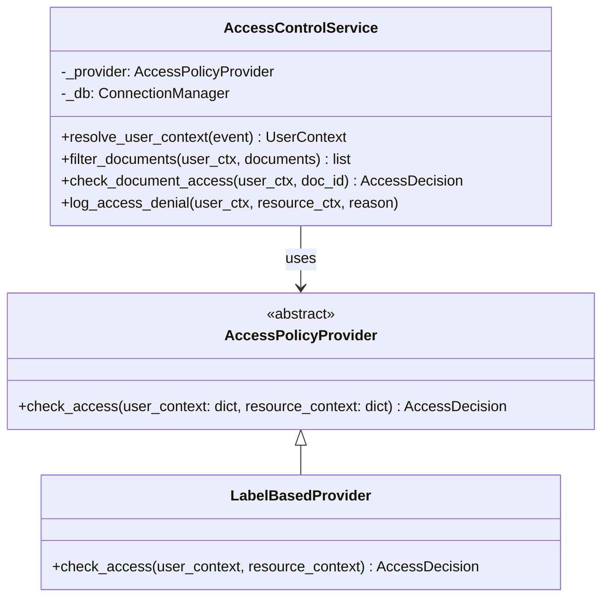

# Design: Document Access Control

## Overview

This design adds hierarchical security-label-based access control to the DOJ document analysis platform. The system introduces a four-level security label hierarchy (public, restricted, confidential, top_secret), assigns labels at the case (Matter) level with optional per-document overrides, and enforces access filtering at the API layer based on user clearance levels.

The architecture centers on a pluggable `AccessPolicyProvider` interface. The default `LabelBasedProvider` compares integer label ranks, but the middleware is decoupled from this logic so customers can swap in OIDC, OPA, or AWS Verified Permissions providers without touching handler code. A new `AccessControlService` orchestrates provider resolution, user lookup, and audit logging.

All existing endpoints continue to work unchanged — the migration backfills existing matters with the "restricted" label, and a configurable `ACCESS_CONTROL_ENABLED` flag allows operators to disable filtering entirely during rollout.

## Architecture

### High-Level Flow



### Provider Pattern



### Integration with Existing Lambda Handlers

The access control middleware integrates via a decorator/helper function pattern that wraps existing handler functions. Each Lambda handler file (case_files.py, search.py, pipeline_config.py, batch_loader_handler.py) already uses a `dispatch_handler` pattern. The middleware hooks in at two points:

1. **User resolution**: At the start of each handler, `resolve_user_context(event)` extracts the caller identity from API Gateway authorizer claims or a `X-User-Id` header, then looks up the `platform_users` row to get clearance_level.

2. **Result filtering**: Before returning document data, handlers call `filter_documents(user_context, documents)` which iterates through results and calls the configured `AccessPolicyProvider.check_access()` for each document.

For SQL-level filtering (Aurora queries), the middleware provides a helper `build_label_filter_clause(clearance_rank)` that returns a WHERE clause fragment: `COALESCE(d.security_label_override, m.security_label) <= %s` with the user's clearance rank as the parameter. This is injected into existing queries in services like `SemanticSearchService`, `CaseFileService`, and `PatternDiscoveryService`.

For Neptune queries, the middleware provides `get_accessible_document_ids(user_context, case_id)` which queries Aurora for the set of document IDs the user can access, then Neptune queries cross-reference `source_document_refs` against this set.

### Environment Variables

| Variable | Default | Description |
|---|---|---|
| `ACCESS_CONTROL_ENABLED` | `"true"` | Master switch to enable/disable label filtering |
| `ACCESS_POLICY_PROVIDER` | `"label_based"` | Active provider: "label_based", "oidc_claims", "verified_permissions", "external_api" |
| `DEFAULT_SECURITY_LABEL` | `"restricted"` | System-wide default label for new matters |
| `TRANSITION_PERIOD_ENABLED` | `"false"` | When true, unauthenticated requests get "restricted" clearance instead of 401 |


## Components and Interfaces

### 1. Security Label Model (`src/models/access_control.py`)

```python
from enum import IntEnum
from typing import Optional
from pydantic import BaseModel

class SecurityLabel(IntEnum):
    """Hierarchical security labels with integer ranks for comparison."""
    PUBLIC = 0
    RESTRICTED = 1
    CONFIDENTIAL = 2
    TOP_SECRET = 3

class AccessDecision(BaseModel):
    """Result of an access policy check."""
    allowed: bool
    reason: str

class UserContext(BaseModel):
    """Resolved caller identity and clearance."""
    user_id: str
    username: str
    clearance_level: SecurityLabel
    role: str
    groups: list[str] = []

class ResourceContext(BaseModel):
    """Document-level context for access decisions."""
    document_id: str
    case_id: str
    effective_label: SecurityLabel
    security_label_override: Optional[SecurityLabel] = None
```

### 2. AccessPolicyProvider Interface (`src/services/access_policy_provider.py`)

```python
from abc import ABC, abstractmethod
from models.access_control import AccessDecision

class AccessPolicyProvider(ABC):
    """Abstract interface for access policy decisions.
    
    Implementations receive user and resource context dicts and return
    an AccessDecision. The middleware never hardcodes label comparison
    logic — it always delegates to the configured provider.
    """
    
    @abstractmethod
    def check_access(self, user_context: dict, resource_context: dict) -> AccessDecision:
        """Determine whether the user may access the resource.
        
        Args:
            user_context: Contains user_id, username, clearance_level, role, groups.
            resource_context: Contains document_id, case_id, effective_label, 
                            security_label_override.
        
        Returns:
            AccessDecision with allowed=True/False and a reason string.
        """
        ...
```

### 3. LabelBasedProvider (`src/services/label_based_provider.py`)

```python
from models.access_control import AccessDecision, SecurityLabel
from services.access_policy_provider import AccessPolicyProvider

class LabelBasedProvider(AccessPolicyProvider):
    """Default provider: compares clearance_level rank vs effective_label rank.
    
    Ignores the groups field entirely. A user with clearance N can access
    any document with effective_label <= N.
    """
    
    def check_access(self, user_context: dict, resource_context: dict) -> AccessDecision:
        clearance = SecurityLabel(user_context["clearance_level"])
        effective = SecurityLabel(resource_context["effective_label"])
        
        if clearance >= effective:
            return AccessDecision(allowed=True, reason="clearance_sufficient")
        
        return AccessDecision(
            allowed=False,
            reason=f"clearance_{clearance.name.lower()}_insufficient_for_{effective.name.lower()}"
        )
```

### 4. AccessControlService (`src/services/access_control_service.py`)

The central orchestrator that:
- Resolves user identity from API Gateway events
- Loads the configured `AccessPolicyProvider`
- Filters document lists by calling the provider for each document
- Provides SQL clause helpers for Aurora queries
- Logs access denials to the audit trail

```python
class AccessControlService:
    def __init__(self, connection_manager, provider: AccessPolicyProvider = None):
        self._db = connection_manager
        self._provider = provider or self._load_provider()
        self._enabled = os.environ.get("ACCESS_CONTROL_ENABLED", "true").lower() == "true"
    
    def _load_provider(self) -> AccessPolicyProvider:
        """Load provider from ACCESS_POLICY_PROVIDER env var."""
        provider_name = os.environ.get("ACCESS_POLICY_PROVIDER", "label_based")
        if provider_name == "label_based":
            from services.label_based_provider import LabelBasedProvider
            return LabelBasedProvider()
        raise ValueError(f"Unknown provider: {provider_name}")
    
    def resolve_user_context(self, event: dict) -> UserContext:
        """Extract user identity from API Gateway event and look up clearance."""
        ...
    
    def filter_documents(self, user_ctx: UserContext, documents: list[dict]) -> list[dict]:
        """Filter a list of documents, keeping only those the user can access."""
        ...
    
    def check_document_access(self, user_ctx: UserContext, document_id: str) -> AccessDecision:
        """Check access for a single document by ID. Returns 403-worthy decision if denied."""
        ...
    
    def build_label_filter_clause(self, clearance_rank: int) -> tuple[str, list]:
        """Return (sql_fragment, params) for WHERE clause filtering."""
        ...
    
    def get_accessible_document_ids(self, user_ctx: UserContext, case_id: str) -> set[str]:
        """Return set of document_ids the user can access within a case."""
        ...
    
    def log_access_denial(self, user_ctx: UserContext, resource_ctx: dict, reason: str):
        """Insert an access_denied audit entry."""
        ...
```

### 5. Access Control Decorator (`src/services/access_control_middleware.py`)

A lightweight decorator for Lambda handlers that auto-resolves user context and injects it into the event:

```python
def with_access_control(handler_fn):
    """Decorator that resolves user context and adds it to the event.
    
    If ACCESS_CONTROL_ENABLED is false, passes through without filtering.
    If user identity cannot be resolved and TRANSITION_PERIOD_ENABLED is true,
    defaults to 'restricted' clearance. Otherwise returns 401.
    """
    def wrapper(event, context):
        if not _is_enabled():
            return handler_fn(event, context)
        
        ac_service = _build_access_control_service()
        try:
            user_ctx = ac_service.resolve_user_context(event)
        except UnauthorizedError:
            if _transition_period():
                user_ctx = _default_restricted_user()
            else:
                return error_response(401, "UNAUTHORIZED", "User identity not resolved", event)
        
        event["_user_context"] = user_ctx.model_dump()
        return handler_fn(event, context)
    
    return wrapper
```

### 6. Admin Handler (`src/lambdas/api/access_control_admin.py`)

New Lambda handler for admin endpoints, following the existing `dispatch_handler` pattern:

```
POST   /admin/users                    — create platform user
GET    /admin/users                    — list platform users
GET    /admin/users/{id}               — get user details
PUT    /admin/users/{id}               — update user (clearance, role)
DELETE /admin/users/{id}               — delete user
PUT    /matters/{id}/security-label    — update case default label
PUT    /documents/{id}/security-label  — set document label override
DELETE /documents/{id}/security-label  — clear document label override
GET    /admin/audit-log                — query audit log with filters
```

### 7. Audit Service (`src/services/audit_service.py`)

Handles all writes to the `label_audit_log` table:

```python
class AuditService:
    def __init__(self, connection_manager):
        self._db = connection_manager
    
    def log_label_change(self, entity_type: str, entity_id: str, 
                         previous_label: str, new_label: str,
                         changed_by: str, change_reason: str = None):
        """Insert an immutable audit entry for a label change."""
        ...
    
    def log_access_denial(self, user_id: str, resource_id: str, reason: str):
        """Insert an audit entry for an access denial (entity_type='access_denied')."""
        ...
    
    def query_audit_log(self, entity_type=None, entity_id=None, 
                        changed_by=None, date_from=None, date_to=None,
                        limit=100, offset=0) -> list[dict]:
        """Query audit log with optional filters, reverse chronological."""
        ...
```


## Data Models

### Schema Migration (`src/db/migrations/007_document_access_control.sql`)

```sql
BEGIN;

-- 1. Security label type (stored as TEXT for flexibility, validated in app layer)
-- Using TEXT with CHECK constraint rather than ENUM to allow future extension.

-- 2. Add security_label to matters table
ALTER TABLE matters ADD COLUMN IF NOT EXISTS security_label TEXT DEFAULT 'restricted'
    CHECK (security_label IN ('public', 'restricted', 'confidential', 'top_secret'));

-- 3. Add security_label_override to documents table
ALTER TABLE documents ADD COLUMN IF NOT EXISTS security_label_override TEXT
    CHECK (security_label_override IS NULL OR 
           security_label_override IN ('public', 'restricted', 'confidential', 'top_secret'));

-- 4. Platform users table
CREATE TABLE IF NOT EXISTS platform_users (
    user_id UUID PRIMARY KEY DEFAULT gen_random_uuid(),
    username TEXT NOT NULL UNIQUE,
    display_name TEXT NOT NULL DEFAULT '',
    role TEXT NOT NULL DEFAULT 'analyst',
    clearance_level TEXT NOT NULL DEFAULT 'restricted'
        CHECK (clearance_level IN ('public', 'restricted', 'confidential', 'top_secret')),
    created_at TIMESTAMP WITH TIME ZONE DEFAULT NOW(),
    updated_at TIMESTAMP WITH TIME ZONE DEFAULT NOW()
);

-- 5. Label audit log table (append-only)
CREATE TABLE IF NOT EXISTS label_audit_log (
    audit_id UUID PRIMARY KEY DEFAULT gen_random_uuid(),
    entity_type TEXT NOT NULL CHECK (entity_type IN ('matter', 'document', 'user', 'access_denied')),
    entity_id UUID NOT NULL,
    previous_label TEXT,
    new_label TEXT,
    changed_by TEXT NOT NULL DEFAULT 'system',
    changed_at TIMESTAMP WITH TIME ZONE DEFAULT NOW(),
    change_reason TEXT
);

-- 6. Indexes
CREATE INDEX IF NOT EXISTS idx_documents_security_label_override 
    ON documents(security_label_override);
CREATE INDEX IF NOT EXISTS idx_platform_users_username 
    ON platform_users(username);
CREATE INDEX IF NOT EXISTS idx_label_audit_log_entity 
    ON label_audit_log(entity_type, entity_id);
CREATE INDEX IF NOT EXISTS idx_label_audit_log_changed_at 
    ON label_audit_log(changed_at);

-- 7. Backfill existing matters with default label
UPDATE matters SET security_label = 'restricted' WHERE security_label IS NULL;

-- 8. Revoke UPDATE/DELETE on label_audit_log for application role
-- (Enforced at application layer; DB-level REVOKE depends on role setup)
-- REVOKE UPDATE, DELETE ON label_audit_log FROM app_role;

COMMIT;
```

### Pydantic Models

**UserContext** — resolved from API Gateway event:
```python
class UserContext(BaseModel):
    user_id: str
    username: str
    clearance_level: SecurityLabel  # IntEnum: PUBLIC=0, RESTRICTED=1, CONFIDENTIAL=2, TOP_SECRET=3
    role: str
    groups: list[str] = []
```

**PlatformUser** — database record:
```python
class PlatformUser(BaseModel):
    user_id: str
    username: str
    display_name: str
    role: str
    clearance_level: SecurityLabel
    created_at: datetime
    updated_at: datetime
```

**LabelAuditEntry** — audit log record:
```python
class LabelAuditEntry(BaseModel):
    audit_id: str
    entity_type: str  # "matter", "document", "user", "access_denied"
    entity_id: str
    previous_label: Optional[str]
    new_label: Optional[str]
    changed_by: str
    changed_at: datetime
    change_reason: Optional[str] = None
```

**AccessDecision** — provider return type:
```python
class AccessDecision(BaseModel):
    allowed: bool
    reason: str
```

### Effective Label Resolution

The effective label for a document is computed as:

```
effective_label = document.security_label_override ?? matter.security_label
```

In SQL:
```sql
COALESCE(d.security_label_override, m.security_label) AS effective_label
```

The access check is:
```
SecurityLabel[user.clearance_level].value >= SecurityLabel[effective_label].value
```

### Search Filtering

**Aurora/OpenSearch**: The `AccessControlService.build_label_filter_clause()` returns a SQL WHERE fragment that joins documents with their parent matter to compute the effective label and compare against the user's clearance rank. For OpenSearch, the same logic is applied as a post-query filter on returned results (since OpenSearch doesn't store the matter's label).

**Neptune**: Entity nodes store `source_document_refs` as a JSON array of document IDs. The middleware pre-computes the set of accessible document IDs for the user within the case, then Neptune query results are filtered to exclude entities whose `source_document_refs` have zero overlap with the accessible set.

```python
# Neptune filtering pseudocode
accessible_doc_ids = ac_service.get_accessible_document_ids(user_ctx, case_id)
entities = neptune_query(case_id)
filtered = [e for e in entities 
            if set(json.loads(e.source_document_refs)) & accessible_doc_ids]
```

### Frontend Admin Page (`src/frontend/admin.html`)

The admin page follows the existing dark-theme DOJ styling from `investigator.html` with three tab sections:

1. **User Management** — Table of platform_users with inline edit for clearance_level and role. Create user form. Delete confirmation modal.
2. **Case Labels** — Table of matters with current security_label, inline dropdown to change. Shows document count per label level.
3. **Audit Log** — Reverse-chronological table with filters for entity_type, entity_id, changed_by, and date range. Pagination.

All API calls use the same `fetch()` pattern as existing frontend pages, hitting the `/admin/*` endpoints.


## Correctness Properties

*A property is a characteristic or behavior that should hold true across all valid executions of a system — essentially, a formal statement about what the system should do. Properties serve as the bridge between human-readable specifications and machine-verifiable correctness guarantees.*

### Property 1: Label hierarchy ordering is total and consistent

*For any* two SecurityLabel values A and B, `A < B` if and only if `A.value < B.value`, and the ordering is: PUBLIC(0) < RESTRICTED(1) < CONFIDENTIAL(2) < TOP_SECRET(3).

**Validates: Requirements 1.3**

### Property 2: Label validation rejects invalid values

*For any* arbitrary string that is not one of "public", "restricted", "confidential", "top_secret", the system shall reject it when used as a security_label on a matter, a security_label_override on a document, or a clearance_level on a user.

**Validates: Requirements 1.4, 4.2**

### Property 3: Effective label resolution

*For any* document D belonging to matter M, the effective label of D equals `D.security_label_override` when it is non-null, and equals `M.security_label` when `D.security_label_override` is null.

**Validates: Requirements 3.2, 3.3**

### Property 4: Matter label change preserves document overrides

*For any* matter M with documents that have non-null `security_label_override` values, changing M's `security_label` to any valid label shall not modify any document's `security_label_override` value.

**Validates: Requirements 2.3, 8.4**

### Property 5: Access filtering excludes documents above clearance

*For any* user with clearance_level C and any set of documents with varying effective labels, the `filter_documents` function shall return only documents whose effective label rank is less than or equal to C's rank. No document with effective_label > C shall appear in the result.

**Validates: Requirements 5.2, 7.1, 7.3**

### Property 6: Single document access returns 403 when above clearance

*For any* user with clearance_level C and any document whose effective_label rank exceeds C's rank, `check_document_access` shall return `AccessDecision(allowed=False, ...)`.

**Validates: Requirements 5.4**

### Property 7: Ingestion labeling round-trip

*For any* ingestion request with a `security_label` parameter set to label L, all resulting documents shall have `security_label_override = L`. *For any* ingestion request without a `security_label` parameter, all resulting documents shall have `security_label_override = None`.

**Validates: Requirements 6.2, 6.3, 6.4**

### Property 8: Neptune entity filtering by accessible documents

*For any* user and any Neptune entity whose `source_document_refs` all reference documents with effective_label above the user's clearance, that entity shall be excluded from query results. *For any* entity with at least one source document within the user's clearance, the entity shall be included.

**Validates: Requirements 7.2, 7.4**

### Property 9: Audit trail completeness for label changes

*For any* label change operation (matter security_label update, document security_label_override set/clear, user clearance_level update), the `label_audit_log` table shall contain a corresponding entry with the correct entity_type, entity_id, previous_label, new_label, and changed_by.

**Validates: Requirements 4.4, 8.2, 9.2, 9.3, 9.4**

### Property 10: Audit log reverse chronological ordering

*For any* query to the audit log endpoint, the returned entries shall be ordered by `changed_at` descending — each entry's `changed_at` shall be greater than or equal to the next entry's `changed_at`.

**Validates: Requirements 10.5**

### Property 11: ACCESS_CONTROL_ENABLED=false bypasses all filtering

*For any* request when `ACCESS_CONTROL_ENABLED` is set to `"false"`, the middleware shall return all documents unfiltered, regardless of the user's clearance level or the documents' effective labels.

**Validates: Requirements 11.5**

### Property 12: Provider delegation — middleware uses configured provider

*For any* access check, the middleware shall delegate to the `AccessPolicyProvider` returned by the provider factory. Swapping the provider implementation shall change the access decision for the same inputs.

**Validates: Requirements 13.3**

### Property 13: LabelBasedProvider ignores groups

*For any* user_context where only the `groups` field varies (all other fields identical), the `LabelBasedProvider.check_access` shall return the same `AccessDecision`.

**Validates: Requirements 13.6**

### Property 14: Access denial audit logging

*For any* access check that results in `allowed=False`, the system shall insert a `label_audit_log` entry with `entity_type='access_denied'`, the user_id, the resource_id, and the provider's reason string.

**Validates: Requirements 13.7**

### Property 15: User and resource context completeness

*For any* resolved user context, the dict shall contain keys: user_id, username, clearance_level, role, groups. *For any* constructed resource context, the dict shall contain keys: document_id, case_id, effective_label, security_label_override.

**Validates: Requirements 13.5**


## Error Handling

### Access Control Errors

| Scenario | HTTP Status | Error Code | Behavior |
|---|---|---|---|
| User identity not resolvable, transition period OFF | 401 | `UNAUTHORIZED` | Request rejected |
| User identity not resolvable, transition period ON | — | — | Falls back to "restricted" clearance |
| User requests document above clearance | 403 | `FORBIDDEN` | Access denied, audit logged |
| Invalid security_label value in request | 400 | `VALIDATION_ERROR` | Rejected with valid values listed |
| Invalid clearance_level on user create/update | 400 | `VALIDATION_ERROR` | Rejected with valid values listed |
| Attempt to UPDATE/DELETE audit log entry | 400 | `AUDIT_IMMUTABLE` | Operation rejected |
| ACCESS_CONTROL_ENABLED=false | — | — | All filtering bypassed, no access checks |
| Provider not found for ACCESS_POLICY_PROVIDER value | 500 | `CONFIG_ERROR` | Startup failure, logged |

### Graceful Degradation

- If the `platform_users` table lookup fails (DB connection issue), the middleware returns 500 rather than silently granting access.
- If the `AccessPolicyProvider.check_access()` raises an exception, the middleware denies access (fail-closed) and logs the error.
- The `ACCESS_CONTROL_ENABLED=false` flag provides an escape hatch if the access control system causes issues in production.

### Audit Log Integrity

- The `AuditService` never exposes UPDATE or DELETE methods for audit entries.
- The `label_audit_log` table uses `gen_random_uuid()` for audit_id to prevent ID prediction.
- All audit writes happen within the same database transaction as the label change they record, ensuring atomicity.

## Testing Strategy

### Unit Tests

Unit tests cover specific examples and edge cases:

- SecurityLabel enum has exactly 4 members with correct integer values
- Creating a matter without security_label defaults to "restricted"
- PUT /documents/{id}/security-label sets the override correctly
- DELETE /documents/{id}/security-label clears the override
- CRUD endpoints for platform_users work correctly
- Migration 007 adds expected columns and tables
- Admin page API endpoints return correct response shapes
- 401 returned when user identity missing and transition period off
- 403 returned for specific document access above clearance
- Audit log entries created for specific label change scenarios

### Property-Based Tests

Property-based tests use `hypothesis` (Python) with minimum 100 iterations per property. Each test references its design property.

| Test | Property | Description |
|---|---|---|
| `test_label_ordering` | Property 1 | Generate random pairs of SecurityLabel, verify ordering matches integer comparison |
| `test_label_validation` | Property 2 | Generate random strings, verify only valid labels accepted |
| `test_effective_label_resolution` | Property 3 | Generate random (matter_label, override) pairs, verify COALESCE logic |
| `test_matter_label_change_preserves_overrides` | Property 4 | Generate matters with documents, change matter label, verify overrides unchanged |
| `test_access_filtering` | Property 5 | Generate random users and document sets, verify filter_documents correctness |
| `test_single_doc_403` | Property 6 | Generate user/doc pairs where effective > clearance, verify denial |
| `test_ingestion_labeling` | Property 7 | Generate ingestion requests with/without labels, verify override values |
| `test_neptune_entity_filtering` | Property 8 | Generate entities with source_doc_refs, verify filtering by accessible set |
| `test_audit_completeness` | Property 9 | Generate label change operations, verify audit entries exist |
| `test_audit_ordering` | Property 10 | Generate audit entries with random timestamps, verify descending order |
| `test_access_control_disabled` | Property 11 | Generate requests with flag=false, verify no filtering |
| `test_provider_delegation` | Property 12 | Swap providers, verify different decisions for same inputs |
| `test_groups_ignored` | Property 13 | Generate user contexts with varying groups, verify same decision |
| `test_denial_audit_logging` | Property 14 | Generate denied access checks, verify audit entries |
| `test_context_completeness` | Property 15 | Generate events, verify resolved contexts have all required keys |

Each test is tagged with: `# Feature: document-access-control, Property {N}: {title}`

### Integration Tests

- End-to-end test: create matter with label, ingest documents with overrides, search as users with different clearances, verify correct filtering
- Migration test: run 007 migration against a test database with existing data, verify backfill and schema changes
- Admin UI smoke test: verify admin.html loads and API calls succeed

