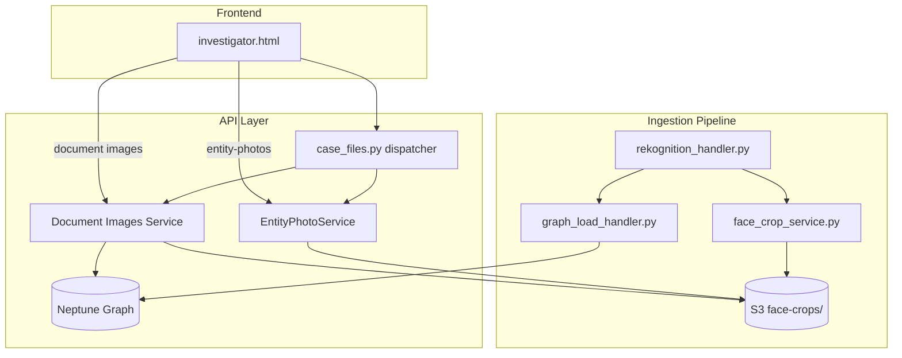
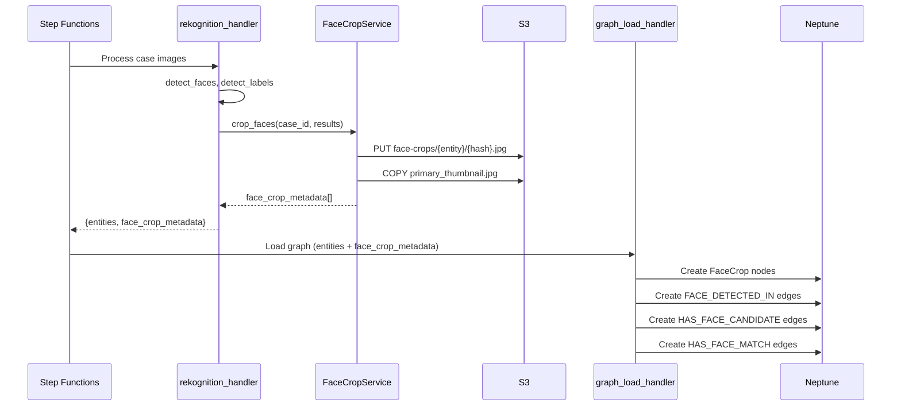
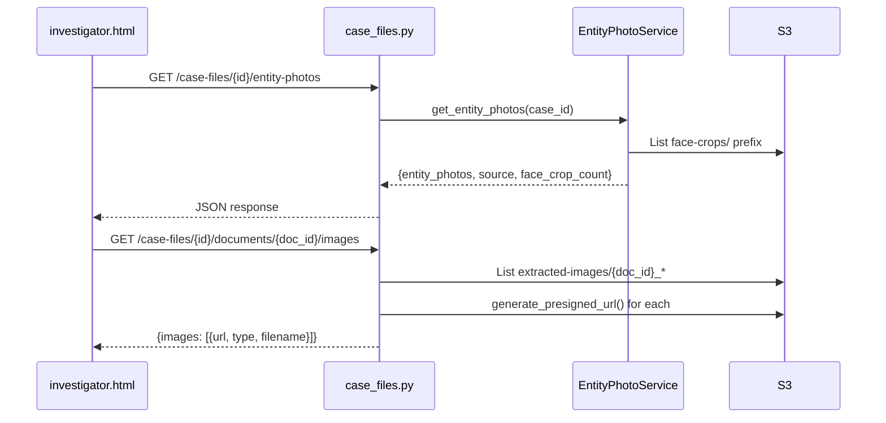

# Design Document: Entity Photo Intelligence

## Overview

Entity Photo Intelligence closes the loop between the PDF image extraction pipeline and the investigator UI by:

1. Persisting face-crop-to-document and face-crop-to-entity edges in Neptune during ingestion
2. Extending the existing `EntityPhotoService` to return richer metadata (source, face_crop_count)
3. Adding a document-images endpoint to serve extracted images and face crops per document
4. Updating the investigator drill-down panel to display face crop thumbnails and document images

The design follows an MVP approach: extend existing services and frontend code with no new Lambda functions, no CDK changes, and no new infrastructure. The Aurora `face_crops` table (Requirement 7) is deferred — the MVP uses S3 listing and Neptune graph queries for lookups.

### Key Design Decisions

| Decision | Choice | Rationale |
|---|---|---|
| Graph edges vs. S3 filename convention | Both — Neptune edges for structured queries, S3 conventions for listing | Neptune edges enable `FACE_DETECTED_IN` and `HAS_FACE_CANDIDATE` traversals; S3 prefix listing is the fallback for photo serving |
| New Lambda vs. extend existing | Extend `case_files.py` dispatcher + `EntityPhotoService` | Stays under CloudFormation resource limits, no CDK changes needed |
| Aurora face_crops table | Deferred (optional) | S3 listing + Neptune queries are sufficient for MVP scale; Aurora can be added later for performance |
| Presigned URLs vs. base64 data URIs | Keep existing base64 data URI approach for graph nodes; presigned URLs for document images endpoint | Graph nodes need inline images (vis.js `circularImage`); document image gallery benefits from lazy-loading presigned URLs |
| Face crop association strategy | Document co-occurrence + watchlist match | Two-tier: `HAS_FACE_CANDIDATE` (weak, from document co-occurrence) and `HAS_FACE_MATCH` (strong, from Rekognition watchlist) |

## Architecture

### System Context



### Data Flow — Ingestion



### Data Flow — API Serving



## Components and Interfaces

### 1. Rekognition Handler Extension (`rekognition_handler.py`)

The handler already processes images and returns entities. The extension adds `face_crop_metadata` to the output so the graph loader can create edges.

**Changes:**
- After `FaceCropService.crop_faces()` returns, build a `face_crop_metadata` list from the crop results
- Each entry contains: `s3_key`, `source_s3_key`, `source_document_id`, `bounding_box`, `confidence`, `entity_name`
- Include `face_crop_metadata` in the handler return value alongside `entities`

**Interface (addition to handler return):**
```python
{
    "case_id": str,
    "status": "completed",
    "entities": [...],
    "face_crop_metadata": [
        {
            "crop_s3_key": "cases/{case_id}/face-crops/{entity}/abc123.jpg",
            "source_s3_key": "cases/{case_id}/extracted-images/{doc_id}_page1_img0.jpg",
            "source_document_id": str,  # parsed from filename, or "unknown"
            "bounding_box": {"Left": float, "Top": float, "Width": float, "Height": float},
            "confidence": float,
            "entity_name": str,
        }
    ],
    "media_processed": int,
    "artifact_key": str,
}
```

### 2. Graph Load Handler Extension (`graph_load_handler.py`)

Extends the existing graph loader to create FaceCrop nodes and relationship edges.

**New node type:** `FaceCrop_{case_id}` with properties:
- `crop_s3_key` (String)
- `source_document_id` (String)
- `confidence` (Double)
- `case_file_id` (String)

**New edge types:**
| Edge Label | From | To | Properties |
|---|---|---|---|
| `FACE_DETECTED_IN` | FaceCrop node | Document node | `confidence` |
| `HAS_FACE_CANDIDATE` | Person entity node | FaceCrop node | `association_source: "document_co_occurrence"` |
| `HAS_FACE_MATCH` | Person entity node | FaceCrop node | `association_source: "watchlist_match"`, `similarity: float` |

**Changes:**
- Add `_load_face_crop_metadata()` function that processes `face_crop_metadata` from the event
- Generate FaceCrop nodes CSV rows
- Generate `FACE_DETECTED_IN` edges (FaceCrop → Document) when `source_document_id != "unknown"`
- Generate `HAS_FACE_CANDIDATE` edges by joining: for each document with face crops, find person entities extracted from that same document, create edges
- Generate `HAS_FACE_MATCH` edges from watchlist match data
- Log warning when `source_document_id == "unknown"` (Requirement 1.3)

### 3. Entity Photo Service Extension (`entity_photo_service.py`)

Extends the existing service to return `source` and `face_crop_count` metadata.

**Changes to `get_entity_photos()` return:**
```python
{
    "entity_photos": {
        "Jeffrey Epstein": "data:image/jpeg;base64,...",
    },
    "photo_count": int,
    "source_breakdown": {"pipeline": int, "demo": int},
    "entity_metadata": {
        "Jeffrey Epstein": {
            "source": "pipeline" | "demo",
            "face_crop_count": int,
        },
    },
}
```

**New method:** `_count_entity_crops(case_id, entity_name) -> int`
- Lists all files under `cases/{case_id}/face-crops/{entity_name}/` (excluding `primary_thumbnail.jpg`)
- Returns count of individual crop files

### 4. Document Images Handler (new function in `case_files.py`)

A new handler function dispatched from the existing `case_files.py` router.

**Endpoint:** `GET /case-files/{id}/documents/{doc_id}/images`

**Response:**
```python
{
    "document_id": str,
    "images": [
        {
            "url": str,          # presigned S3 URL
            "type": "extracted_image" | "face_crop",
            "filename": str,     # original filename
            "s3_key": str,
        }
    ],
    "total_count": int,
}
```

**Implementation:**
- Parse `doc_id` from path parameters
- List S3 objects under `cases/{case_id}/extracted-images/` matching `{doc_id}_page*`
- Query Neptune for `FACE_DETECTED_IN` edges pointing to this document to find linked face crops
- Fallback: list S3 face-crops and match by filename convention if Neptune query fails
- Generate presigned URLs with 3600s expiration
- Return empty list with 200 if no images found

### 5. Frontend Drill-Down Extension (`investigator.html`)

**Changes to `DrillDown.renderL3()`:**
- Add a "📸 FACE CROPS" section after the entity profile header for person entities
- Fetch face crops from entity-photos API metadata (`face_crop_count`)
- Display as a scrollable horizontal thumbnail strip (max 120px height)
- Click on a thumbnail opens the full-size source image

**Changes to `DrillDown.openDoc()` or document card expansion:**
- When a document card is expanded, fetch `GET /case-files/{id}/documents/{doc_id}/images`
- Display extracted image thumbnails in a grid below the document excerpt
- Lazy-load images using presigned URLs

**Changes to graph rendering:**
- Already handled — `fetchEntityPhotos()` loads photos and `circularImage` is applied to person nodes
- The `source` field from the API response can be used to add a visual indicator (e.g., green border for pipeline photos vs. orange for demo)

### 6. Routing Addition (`case_files.py` dispatcher)

Add a route match in `dispatch_handler()`:
```python
# Document Images
if "/documents/" in path and "/images" in path and "/case-files/" in path:
    if method == "GET":
        return document_images_handler(event, context)
```

This must be placed before the existing `/documents/` catch-all for document assembly routes.

## Data Models

### Neptune Graph Nodes

**FaceCrop Node:**
```
~label: FaceCrop_{case_id}
Properties:
  - crop_s3_key: String (S3 key of the 100×100 JPEG crop)
  - source_s3_key: String (S3 key of the source extracted image)
  - source_document_id: String (parsed document ID, or "unknown")
  - confidence: Double (Rekognition face detection confidence)
  - case_file_id: String
  - entity_name: String (associated entity, if any)
```

### Neptune Graph Edges

**FACE_DETECTED_IN:**
```
~from: FaceCrop_{case_id} node
~to: Entity_{case_id} node (document)
~label: FACE_DETECTED_IN
Properties:
  - confidence: Double
  - case_file_id: String
```

**HAS_FACE_CANDIDATE:**
```
~from: Entity_{case_id} node (person)
~to: FaceCrop_{case_id} node
~label: HAS_FACE_CANDIDATE
Properties:
  - association_source: "document_co_occurrence"
  - case_file_id: String
```

**HAS_FACE_MATCH:**
```
~from: Entity_{case_id} node (person)
~to: FaceCrop_{case_id} node
~label: HAS_FACE_MATCH
Properties:
  - association_source: "watchlist_match"
  - similarity: Double
  - case_file_id: String
```

### S3 Key Conventions

```
cases/{case_id}/
  ├── extracted-images/
  │   └── {document_id}_page{N}_img{M}.jpg    # PyMuPDF extracted images
  ├── face-crops/
  │   ├── {entity_name}/
  │   │   ├── {hash}.jpg                       # Individual face crops
  │   │   └── primary_thumbnail.jpg            # Best crop (highest confidence)
  │   └── demo/
  │       └── {person_name}.jpg                # Demo photos from setup script
  └── rekognition-artifacts/
      └── {batch}_rekognition.json             # Rekognition results artifact
```

### API Response Models

**Entity Photos Response (extended):**
```json
{
  "entity_photos": {"Entity Name": "data:image/jpeg;base64,..."},
  "photo_count": 5,
  "source_breakdown": {"pipeline": 3, "demo": 2},
  "entity_metadata": {
    "Entity Name": {
      "source": "pipeline",
      "face_crop_count": 4
    }
  }
}
```

**Document Images Response (new):**
```json
{
  "document_id": "abc-123",
  "images": [
    {
      "url": "https://s3.amazonaws.com/...",
      "type": "extracted_image",
      "filename": "abc-123_page1_img0.jpg",
      "s3_key": "cases/.../extracted-images/abc-123_page1_img0.jpg"
    },
    {
      "url": "https://s3.amazonaws.com/...",
      "type": "face_crop",
      "filename": "a1b2c3d4e5f6.jpg",
      "s3_key": "cases/.../face-crops/John Doe/a1b2c3d4e5f6.jpg"
    }
  ],
  "total_count": 2
}
```


## Correctness Properties

*A property is a characteristic or behavior that should hold true across all valid executions of a system — essentially, a formal statement about what the system should do. Properties serve as the bridge between human-readable specifications and machine-verifiable correctness guarantees.*

### Property 1: FACE_DETECTED_IN edge creation for valid document IDs

*For any* face crop metadata entry with a `source_document_id` that is not `"unknown"`, the graph loader SHALL produce a `FACE_DETECTED_IN` edge row from the FaceCrop node to the document node. Conversely, for any entry where `source_document_id == "unknown"`, the FaceCrop node SHALL be created but no `FACE_DETECTED_IN` edge SHALL exist for it.

**Validates: Requirements 1.1, 1.3**

### Property 2: face_crop_metadata output completeness

*For any* set of Rekognition face detection results processed by the handler, every face crop in the output `face_crop_metadata` list SHALL contain all required fields: `crop_s3_key`, `source_s3_key`, `source_document_id`, `bounding_box` (with `Left`, `Top`, `Width`, `Height`), `confidence`, and `entity_name`.

**Validates: Requirements 1.2**

### Property 3: HAS_FACE_CANDIDATE edges from document co-occurrence

*For any* person entity extracted from a document, and *for any* FaceCrop node linked to that same document via `FACE_DETECTED_IN`, the graph loader SHALL produce a `HAS_FACE_CANDIDATE` edge from the person entity to the FaceCrop node with `association_source` set to `"document_co_occurrence"`.

**Validates: Requirements 2.1, 2.3**

### Property 4: HAS_FACE_MATCH edges from watchlist matches

*For any* Rekognition watchlist match that identifies a face as a named person, the graph loader SHALL produce a `HAS_FACE_MATCH` edge from the person entity to the FaceCrop node with `association_source` set to `"watchlist_match"` and `similarity` set to the watchlist similarity score.

**Validates: Requirements 2.2, 2.3**

### Property 5: Photo source priority

*For any* entity name, if both a pipeline `primary_thumbnail.jpg` and a demo photo exist, the entity photos API SHALL return the pipeline photo and report `source` as `"pipeline"`. If only a demo photo exists, it SHALL return the demo photo with `source` as `"demo"`. The `source` field SHALL always be present and equal to one of `"pipeline"` or `"demo"`.

**Validates: Requirements 3.1, 3.2, 3.3**

### Property 6: Face crop count accuracy

*For any* entity returned by the entity photos API, the `face_crop_count` field SHALL equal the number of individual face crop files (excluding `primary_thumbnail.jpg`) stored under `cases/{case_id}/face-crops/{entity_name}/` in S3.

**Validates: Requirements 3.4**

### Property 7: Document image filtering by document ID prefix

*For any* document ID and set of extracted image files in S3, the document images endpoint SHALL return exactly those images whose filenames begin with the specified document ID, and no others.

**Validates: Requirements 4.1**

### Property 8: Document face crops from graph linkage

*For any* document that has FaceCrop nodes linked via `FACE_DETECTED_IN` edges, the document images endpoint SHALL include presigned URLs for all linked face crops in its response.

**Validates: Requirements 4.2**

## Error Handling

| Scenario | Handling |
|---|---|
| S3 listing fails for face-crops prefix | Log warning, return empty photo map; do not fail the API call |
| Neptune query fails for FACE_DETECTED_IN edges | Fall back to S3 filename convention matching for document images |
| Presigned URL generation fails for a single image | Skip that image, log warning, continue with remaining images |
| `source_document_id` is `"unknown"` | Create FaceCrop node without FACE_DETECTED_IN edge; log warning |
| Face crop download fails during base64 encoding | Skip entity, log warning, continue with remaining entities |
| No face crops or extracted images for a document | Return 200 with empty `images` list |
| Invalid or missing `doc_id` path parameter | Return 400 with validation error |
| Bounding box coordinates out of range (0-1) | Clamp to image boundaries (existing behavior in FaceCropService) |
| Neptune endpoint not configured | Skip graph edge creation, log warning, return success with 0 edges |
| S3 bucket not configured | Return 500 with descriptive error |

## Testing Strategy

### Unit Tests

Unit tests cover specific examples, edge cases, and integration points:

- `test_parse_source_document_id`: Verify filename parsing for known patterns (`doc123_page1_img0.jpg` → `doc123`) and edge cases (no `_page` → `"unknown"`)
- `test_face_crop_metadata_structure`: Verify a specific Rekognition result produces metadata with all required fields
- `test_entity_photos_empty_case`: Verify empty S3 listings return empty photo map with 200
- `test_document_images_no_results`: Verify empty document returns 200 with empty list
- `test_document_images_handler_routing`: Verify the dispatcher routes `/case-files/{id}/documents/{doc_id}/images` correctly
- `test_graph_loader_unknown_doc_id`: Verify FaceCrop node is created but no FACE_DETECTED_IN edge when doc_id is "unknown"
- `test_presigned_url_expiration`: Verify presigned URLs are generated with 3600s expiration parameter

### Property-Based Tests

Property-based tests use `hypothesis` (Python) with minimum 100 iterations per property. Each test is tagged with its design property reference.

- **Feature: entity-photo-intelligence, Property 1: FACE_DETECTED_IN edge creation** — Generate random face_crop_metadata lists with mix of valid and "unknown" document IDs. Verify edge CSV output contains FACE_DETECTED_IN rows only for valid doc IDs.
- **Feature: entity-photo-intelligence, Property 2: face_crop_metadata completeness** — Generate random Rekognition results with varying numbers of faces and watchlist matches. Verify every entry in the output metadata has all required fields.
- **Feature: entity-photo-intelligence, Property 3: HAS_FACE_CANDIDATE from co-occurrence** — Generate random sets of person entities and face crops sharing document IDs. Verify HAS_FACE_CANDIDATE edges are created for every (person, face_crop) pair sharing a document, with `association_source == "document_co_occurrence"`.
- **Feature: entity-photo-intelligence, Property 4: HAS_FACE_MATCH from watchlist** — Generate random watchlist match results. Verify HAS_FACE_MATCH edges are created with correct similarity scores and `association_source == "watchlist_match"`.
- **Feature: entity-photo-intelligence, Property 5: Photo source priority** — Generate random combinations of pipeline and demo photo S3 listings. Verify pipeline always wins when both exist, demo is used as fallback, and source field is always correct.
- **Feature: entity-photo-intelligence, Property 6: Face crop count accuracy** — Generate random S3 listings with varying numbers of crop files per entity. Verify face_crop_count matches actual file count (excluding primary_thumbnail.jpg).
- **Feature: entity-photo-intelligence, Property 7: Document image filtering** — Generate random sets of extracted image filenames and random document IDs. Verify the filtering returns exactly the files whose names start with the document ID.
- **Feature: entity-photo-intelligence, Property 8: Document face crops from graph** — Generate random sets of FACE_DETECTED_IN edge results. Verify all linked face crops appear in the document images response.

### Test Configuration

- Library: `hypothesis` (Python property-based testing)
- Minimum iterations: 100 per property test (`@settings(max_examples=100)`)
- Tag format: `# Feature: entity-photo-intelligence, Property {N}: {title}`
- Each correctness property is implemented by a single property-based test
