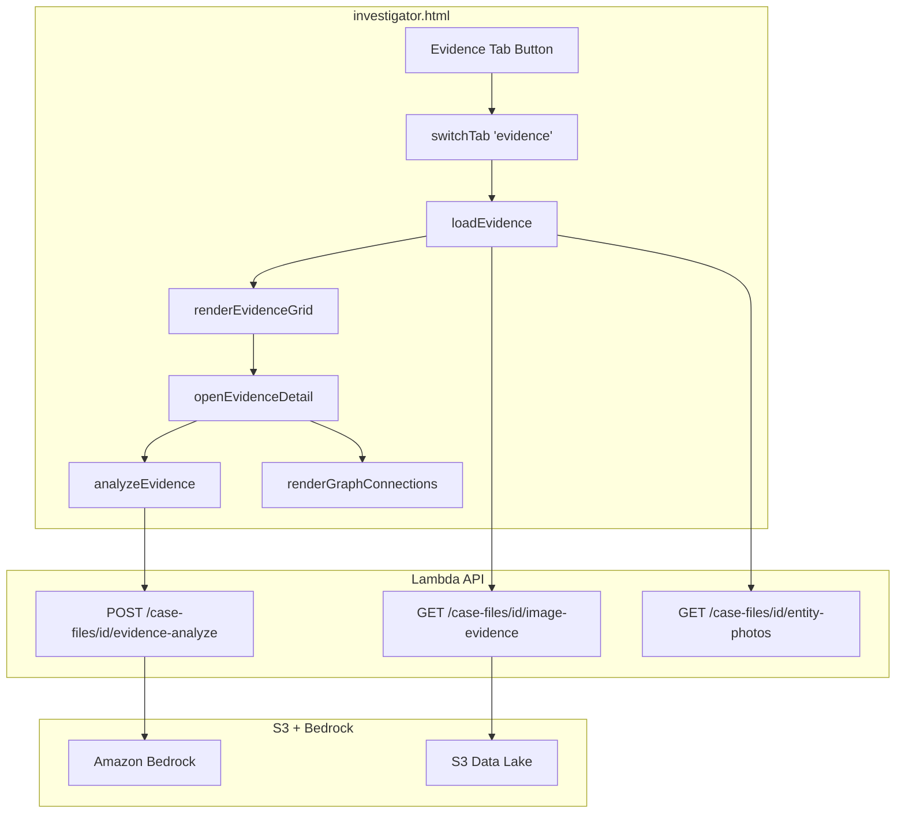

# Design Document: Evidence Library Tab

## Overview

The Evidence Library Tab adds a dedicated "🔍 Evidence" tab to `investigator.html` that provides a centralized, browsable evidence gallery for a selected case. It surfaces images (with Rekognition labels and face data), videos (with HTML5 playback), and documents in a responsive grid layout — a "war room wall" for investigators.

The feature is primarily frontend work. The backend APIs for images (`GET /case-files/{id}/image-evidence`) and entity photos (`GET /case-files/{id}/entity-photos`) already exist. The only new backend addition is a small `POST /case-files/{id}/evidence-analyze` endpoint that sends evidence metadata to Amazon Bedrock and returns AI-generated investigative insights.

Video evidence is served via presigned S3 URLs using the same pattern as images (1-hour expiration). Videos live at `cases/{case_id}/videos/` or `epstein_downloads/videos/` in S3.

## Architecture



The frontend follows the same pattern as the Timeline tab:
1. Tab button in `.tabs` bar calls `switchTab('evidence')`
2. `switchTab` activates `#tab-evidence` div and calls `loadEvidence()`
3. `loadEvidence()` fetches data from existing APIs, then calls `renderEvidenceGrid()`
4. Clicking a card opens `openEvidenceDetail()` which renders the modal
5. The "Analyze" button in the modal calls `analyzeEvidence()` which hits the new backend endpoint

## Components and Interfaces

### Frontend Components

#### 1. Tab Registration
- Add `<div class="tab" onclick="switchTab('evidence')">🔍 Evidence</div>` to the `.tabs` bar after the existing tabs
- Add `'evidence'` to the `allTabs` array in `switchTab()`
- Add `if (tab === 'evidence' && selectedCaseId) loadEvidence();` to `switchTab()`

#### 2. Tab Content Panel (`#tab-evidence`)
HTML structure inside `<div id="tab-evidence" class="tab-content">`:

```
tab-evidence
├── <style> (evidence-specific CSS)
├── section-card (main container)
│   ├── Header row (title + refresh button)
│   ├── Summary Statistics Bar (#evidenceStats)
│   │   └── stat cards: total images, videos, documents, faces, labeled images
│   ├── Filter Controls (#evidenceFilters)
│   │   ├── Media Type toggles (All | Images | Videos | Documents)
│   │   └── Label Filter dropdown (populated from API label_counts)
│   ├── Evidence Grid (#evidenceGrid)
│   │   └── responsive grid of evidence cards
│   └── Pagination Controls (#evidencePagination)
│       └── prev | page X of Y | next
└── Evidence Detail Modal (#evidenceDetailOverlay)
    ├── close button + Escape key handler
    ├── Content area (image full-size / video player / doc info)
    ├── Metadata panel (labels, faces, source doc)
    ├── Graph Connection View (#evidenceGraphConnections)
    └── AI Insights Panel (#evidenceAiInsights)
```

#### 3. JavaScript Functions

**`loadEvidence()`** — Main data loader
- Guards on `selectedCaseId`
- Fetches `GET /case-files/{selectedCaseId}/image-evidence?page=1&page_size=50`
- Fetches `GET /case-files/{selectedCaseId}/entity-photos` (for graph connections)
- Lists video files from case data (fetched via a lightweight S3 listing or cached from case details)
- Stores results in module-level variables: `evidenceImages`, `evidenceVideos`, `evidenceEntityPhotos`, `evidenceSummary`
- Calls `renderEvidenceStats()` and `renderEvidenceGrid()`

**`renderEvidenceStats(summary)`** — Renders the summary statistics bar
- Reads `summary.total`, `summary.total_faces`, `summary.matched_faces`, `summary.images_with_labels`, `summary.label_counts`
- Renders stat cards with counts

**`renderEvidenceGrid()`** — Renders the card grid
- Reads current filter state (`evidenceMediaFilter`, `evidenceLabelFilter`)
- For images: renders thumbnail via `presigned_url`, filename, face count badge, up to 3 label badges
- For videos: renders video icon placeholder, filename, format badge, play overlay
- For documents: renders document icon, filename, type badge
- Applies responsive CSS grid: `grid-template-columns: repeat(auto-fill, minmax(200px, 1fr))`

**`openEvidenceDetail(type, index)`** — Opens the detail modal
- For images: loads full-size image, draws face bounding boxes on a canvas overlay, lists labels with confidence, shows source doc, shows AI description if available
- For videos: creates `<video>` element with presigned URL, controls enabled, supports .mp4 and .mov
- Shows Graph Connection View with matched entities and source document link
- Shows "Analyze" button

**`analyzeEvidence(type, itemData)`** — Triggers AI analysis
- POSTs to `/case-files/{selectedCaseId}/evidence-analyze` with evidence metadata
- Shows loading spinner "Analyzing evidence..."
- On success, renders analysis text in the AI Insights Panel
- On error, shows error message

**`filterEvidenceByType(mediaType)`** — Handles media type filter clicks
- Sets `evidenceMediaFilter` to 'all', 'images', 'videos', or 'documents'
- Re-renders grid

**`filterEvidenceByLabel(label)`** — Handles label filter selection
- Re-fetches from Image_Evidence_API with `label_filter` param
- Re-renders grid

**`loadEvidencePage(page)`** — Handles pagination
- Fetches the specified page from Image_Evidence_API
- Re-renders grid

### Backend Components

#### 4. Evidence Analyze Endpoint

**Route:** `POST /case-files/{id}/evidence-analyze`
**Handler:** `evidence_analyze_handler` in `case_files.py`

Request body:
```json
{
  "evidence_type": "image" | "video",
  "filename": "string",
  "s3_key": "string",
  "labels": [{"name": "Weapon", "confidence": 95.2}],
  "faces": [{"entity_name": "Jeffrey Epstein", "confidence": 88.1}],
  "source_document_id": "string",
  "case_context": "string (case topic_name)"
}
```

Response:
```json
{
  "analysis": "string (Bedrock-generated analysis text)",
  "evidence_type": "image",
  "model_id": "anthropic.claude-3-haiku-20240307-v1:0"
}
```

Implementation:
- Constructs a prompt from the evidence metadata describing what was detected
- Calls Bedrock `invoke_model` with Claude 3 Haiku (fast, cheap)
- Returns the generated analysis text
- Uses a focused prompt: "You are an investigative analyst. Analyze this evidence item from case '{topic_name}'. The image contains: [labels]. Persons identified: [faces]. Source document: [doc_id]. Provide a brief investigative analysis of what this evidence shows and its potential significance."

#### 5. Video Presigned URL Generation

Videos are served using the same presigned URL pattern as images. The `loadEvidence()` function will list video files from S3 prefix `cases/{case_id}/videos/` and also check `epstein_downloads/videos/`. Presigned URLs are generated client-side by calling a small helper or by extending the image-evidence API response to include video items.

For simplicity, we add a `GET /case-files/{id}/video-evidence` handler that:
- Lists `.mp4` and `.mov` files under `cases/{case_id}/videos/`
- Also checks `epstein_downloads/videos/` for the Epstein case
- Generates presigned URLs (1-hour expiration) for each
- Returns `{ "videos": [{ "s3_key", "filename", "format", "presigned_url", "size_bytes" }], "total": N }`

## Data Models

### Evidence Item (Frontend)
```javascript
{
  type: 'image' | 'video' | 'document',
  s3_key: string,
  filename: string,
  presigned_url: string,
  // Image-specific
  labels: [{ name: string, confidence: number }],
  faces: [{ entity_name: string, confidence: number, crop_key: string }],
  face_count: number,
  source_document_id: string,
  ai_description: string,
  likely_false_positive: boolean,
  // Video-specific
  format: 'mp4' | 'mov',
  size_bytes: number,
  // Document-specific
  document_type: string
}
```

### Evidence Analyze Request (Backend)
```python
class EvidenceAnalyzeRequest:
    evidence_type: str        # 'image' or 'video'
    filename: str
    s3_key: str
    labels: list[dict]        # [{"name": str, "confidence": float}]
    faces: list[dict]         # [{"entity_name": str, "confidence": float}]
    source_document_id: str
    case_context: str         # case topic_name for prompt context
```

### Evidence Analyze Response (Backend)
```python
class EvidenceAnalyzeResponse:
    analysis: str             # Bedrock-generated text
    evidence_type: str
    model_id: str             # e.g. "anthropic.claude-3-haiku-20240307-v1:0"
```

### Video Evidence Response (Backend)
```python
class VideoEvidenceResponse:
    videos: list[dict]        # [{"s3_key", "filename", "format", "presigned_url", "size_bytes"}]
    total: int
```


## Correctness Properties

*A property is a characteristic or behavior that should hold true across all valid executions of a system — essentially, a formal statement about what the system should do. Properties serve as the bridge between human-readable specifications and machine-verifiable correctness guarantees.*

### Property 1: Tab switching shows only the active tab

*For any* tab name in the allTabs array (including 'evidence'), calling `switchTab(tabName)` should result in exactly one `.tab-content` element having the `active` class, and its `id` should equal `'tab-' + tabName`.

**Validates: Requirements 1.2**

### Property 2: Summary statistics bar displays all required counts

*For any* valid Image_Evidence_API summary response (with arbitrary non-negative integer values for total, total_faces, matched_faces, images_with_labels, and label_counts), the rendered Summary_Statistics_Bar should contain all five count values: total images, total videos, total documents, images with faces, and images with labels.

**Validates: Requirements 2.1**

### Property 3: Evidence card rendering includes required metadata

*For any* evidence item (image, video, or document) with a non-empty filename, the rendered grid card should contain the item's filename. For image items, the card should also contain the face count and up to 3 label badges. For video items, the card should contain the file format. For document items, the card should contain the document type.

**Validates: Requirements 3.2, 3.3, 3.4**

### Property 4: Pagination computes correct page boundaries

*For any* total item count > 0 and page_size > 0, the computed total_pages should equal `ceil(total / page_size)`, and for any page number between 1 and total_pages, the displayed items should be the slice from `(page-1)*page_size` to `min(page*page_size, total)`.

**Validates: Requirements 3.5**

### Property 5: Media type filter returns only matching items

*For any* mixed list of evidence items containing images, videos, and documents, and *for any* selected media type filter ('images', 'videos', 'documents', or 'all'), the filtered result should contain only items whose type matches the filter. When filter is 'all', all items should be returned.

**Validates: Requirements 4.2, 4.3, 4.4, 4.5**

### Property 6: Label filter dropdown contains all labels with counts

*For any* label_counts object returned by the Image_Evidence_API (mapping label names to positive integer counts), the rendered Label_Filter dropdown should contain exactly those label names, each displayed with its corresponding count.

**Validates: Requirements 5.1, 5.4**

### Property 7: Filter selection constructs correct API query parameters

*For any* label filter selection (a label string or empty) and *for any* has_faces boolean, the constructed API URL should include `label_filter={label}` when a label is selected, `has_faces=true` when has_faces is true, and neither parameter when both are cleared.

**Validates: Requirements 5.2, 5.3, 5.5**

### Property 8: Detail modal displays all metadata for any evidence item

*For any* evidence item (image or video) with arbitrary labels, faces, source_document_id, and filename, the rendered Evidence_Detail_Modal should contain the filename, the source_document_id (when present), and all label names with their confidence scores.

**Validates: Requirements 6.3, 6.4, 7.5**

### Property 9: Face bounding boxes match face data count

*For any* image evidence item with N faces (where N >= 0), the rendered Evidence_Detail_Modal should draw exactly N face bounding box overlays, each displaying the corresponding entity_name (or "Unidentified").

**Validates: Requirements 6.2**

### Property 10: Analyze request includes all relevant evidence metadata

*For any* evidence item (image or video) with arbitrary labels, faces, source_document_id, and filename, the constructed analyze request body should include the evidence_type, filename, s3_key, all labels, all faces, and the source_document_id.

**Validates: Requirements 8.2, 8.3**

### Property 11: Graph connections grouped by entity type

*For any* set of entity connections with mixed types (persons, documents, locations), the rendered Graph_Connection_View should group entities by type, each matched entity should appear with its name and confidence score, and the total count of rendered entities should equal the input count.

**Validates: Requirements 9.2, 9.4**

## Error Handling

| Scenario | Handling |
|---|---|
| No case selected when Evidence tab clicked | Show toast "Select a case first", do not fetch |
| Image_Evidence_API returns 500 | Show error message in grid area, log to console |
| Image_Evidence_API returns empty data | Show empty state message, stats bar shows zeros |
| Video presigned URL fails (403/expired) | Show error message with filename and download suggestion |
| Evidence-analyze API returns 500 | Show "Analysis could not be completed" in AI panel |
| Evidence-analyze API times out | Show timeout message, suggest retry |
| Presigned URL expired (403 on image load) | Show broken image placeholder, suggest refresh |
| Entity photos API fails | Continue without entity thumbnails in graph connections |
| Video format unsupported by browser | Show error with filename and download suggestion |
| Modal Escape key / close button | Always close modal, clean up video playback if active |

## Testing Strategy

### Unit Tests
- Test `renderEvidenceStats()` with specific known summary data and verify output HTML
- Test `filterEvidenceByType()` with a known mixed list and verify correct filtering
- Test pagination boundary cases: page 1 of 1, last page with partial items, empty list
- Test `openEvidenceDetail()` with an image that has no faces (edge case)
- Test `openEvidenceDetail()` with a video that has an unsupported format (edge case)
- Test `analyzeEvidence()` error handling when API returns 500
- Test `evidence_analyze_handler` with missing required fields returns 400
- Test `evidence_analyze_handler` with valid input returns analysis text
- Test `video_evidence_handler` with no videos returns empty list

### Property-Based Tests
- Use **fast-check** (JavaScript) for frontend property tests
- Use **Hypothesis** (Python) for backend property tests
- Each property test runs minimum 100 iterations
- Each test is tagged with a comment referencing the design property

**Frontend property tests (fast-check):**
- **Feature: evidence-library-tab, Property 4: Pagination computes correct page boundaries** — Generate random (total, page_size, page) tuples and verify slice math
- **Feature: evidence-library-tab, Property 5: Media type filter returns only matching items** — Generate random mixed evidence lists and filter types, verify output
- **Feature: evidence-library-tab, Property 7: Filter selection constructs correct API query parameters** — Generate random filter combinations and verify URL construction
- **Feature: evidence-library-tab, Property 10: Analyze request includes all relevant evidence metadata** — Generate random evidence items and verify request body completeness

**Backend property tests (Hypothesis):**
- **Feature: evidence-library-tab, Property 4: Pagination computes correct page boundaries** — Generate random (total, page_size) and verify total_pages calculation in the API response

**Integration tests:**
- Test full flow: loadEvidence → renderEvidenceGrid → openEvidenceDetail → analyzeEvidence with mocked API responses
- Test tab switching integration: verify 'evidence' tab activates correctly alongside all other tabs
