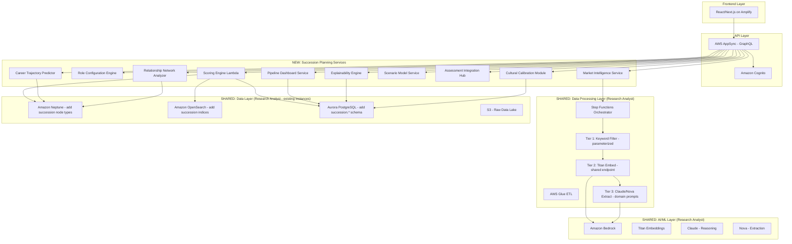
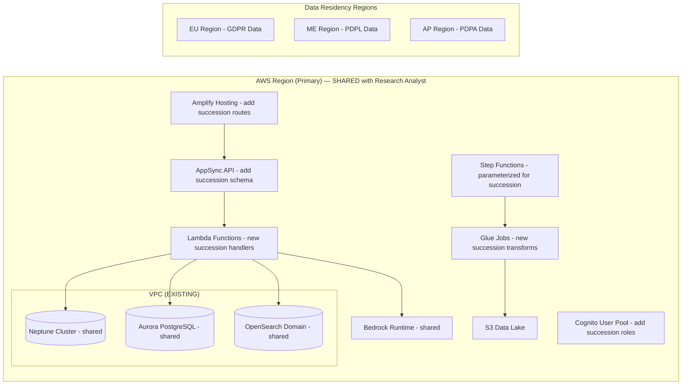
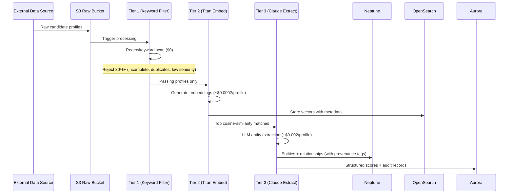
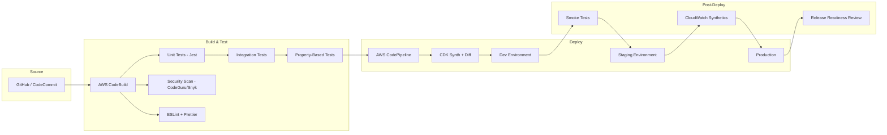

# Design Document: Executive Succession Planning Platform
# (Domain Module within Research Analyst Platform)

## Overview

This document defines the technical design for an AI-driven Executive Succession Planning module deployed **within the existing Research Analyst platform**. The module shares Neptune (knowledge graph), OpenSearch (vector search), Aurora PostgreSQL (transactional data), and the Tiered Pipeline infrastructure already operational in the Research Analyst project, eliminating ~$1,500-4,300/month in duplicated infrastructure costs.

The core insight: executive succession planning is structurally identical to intelligence research — ingest diverse sources, filter through a tiered pipeline, extract entities into a knowledge graph, score against a domain taxonomy, and surface prioritized results with explainability. The difference is domain-specific: leadership competency signatures instead of crime pattern signatures, executive profiles instead of court documents, and a three-layer cultural/sector scoring algorithm instead of threat-level scoring.

### Integration with Research Analyst Platform

```
Research Analyst Platform (EXISTING — shared infrastructure)
├── Core Engine (SHARED)
│   ├── Tiered Pipeline (Step Functions) ← reused, different keyword/signature configs
│   ├── Amazon Neptune ← same instance, new node labels & edge types
│   ├── Amazon OpenSearch ← same cluster, new indices
│   ├── Amazon Aurora PostgreSQL ← same cluster, new schema (succession.*)
│   ├── Amazon Bedrock (Titan + Claude) ← same endpoints, different prompts
│   └── Provenance & Compliance ← reused pattern
│
├── Domain Module: Intelligence Research (EXISTING)
│   ├── Crime Pattern Library (taxonomy/signatures)
│   ├── DOJ/Court document sources
│   ├── Threat scoring & red flag detection
│   └── Entity extraction prompts (crime-specific)
│
└── Domain Module: Executive Succession (NEW — this design)
    ├── Leadership Competency Taxonomy (25 criteria + 15 master variables)
    ├── External sources (LinkedIn, BoardEx, country-specific APIs)
    ├── Three-Layer Scoring Algorithm (Core + Flex + Sector)
    ├── Cultural Calibration (GLOBE/Hofstede parameter matrices)
    ├── Government Overlays (ECQ, CAP, UK Success Profiles)
    ├── Scenario Modeling & Explainability
    └── Succession Dashboard UI (heat map, three-scenario lists)
```

### What's Shared vs. New

| Component | Status | Approach |
|-----------|--------|----------|
| Neptune instance | **SHARED** | Add node labels (Executive, CompetencyScore, RoleConfig); new edge types (SUCCEEDS, DEMONSTRATES); namespace via `domain:succession:` prefix |
| OpenSearch cluster | **SHARED** | New indices: `succession-candidates`, `role-competency-signatures`; same HNSW/cosinesimil config |
| Aurora PostgreSQL | **SHARED** | New schema: `succession.*` tables; same RLS tenant isolation pattern |
| Tiered Pipeline (Step Functions) | **SHARED** | Parameterized: different Tier 1 keywords, Tier 2 signatures, Tier 3 prompts per domain |
| Bedrock (Titan Embed) | **SHARED** | Same embedding endpoint, different input profiles |
| Bedrock (Claude/Nova) | **SHARED** | Same LLM, domain-specific extraction prompts |
| Provenance tagging | **SHARED** | Same pattern, source = "succession" domain tag |
| Cognito auth | **SHARED** | Same user pool, add succession-specific RBAC roles |
| Three-Layer Scoring Algorithm | **NEW** | Core + Flex + Sector weighting engine |
| Cultural Calibration Module | **NEW** | GLOBE clusters, Hofstede dimensions, wasta scoring |
| Role Configuration Engine | **NEW** | Parameter matrix lookup + crisis/growth modifiers |
| Government Overlays (ECQ, CAP) | **NEW** | Composable scoring plugins |
| Scenario Modeling | **NEW** | What-if simulation with non-persisted weight changes |
| Succession Dashboard | **NEW** | Heat maps, three-scenario lists, candidate comparison |
| External Source Connectors | **NEW** | LinkedIn, BoardEx, country-specific APIs (16+ countries) |

### Design Rationale

The architecture prioritizes:
- **Infrastructure reuse** — Leverage existing Neptune/OpenSearch/Aurora/Bedrock, saving $1,500-4,300/month
- **Domain isolation** — Node prefixes, separate OpenSearch indices, and Aurora schema separation ensure no cross-contamination between Intelligence Research and Succession Planning data
- **Separation of scoring concerns** — Each algorithm layer is independently configurable and auditable
- **Cost efficiency** — The existing tiered pipeline rejects 80%+ of data before paid processing
- **Cultural fidelity** — GLOBE clusters and Hofstede dimensions drive dynamic weight adjustment
- **Regulatory compliance** — EU AI Act, GDPR, CCPA built into the shared data layer
- **Multi-tenancy isolation** — Existing Cognito + RLS pattern extended to succession domain

### Key Technology Choices (All Existing in Research Analyst)

| Decision | Choice | Status | Integration Notes |
|----------|--------|--------|-------------------|
| Graph DB | Amazon Neptune | EXISTING | Add succession node/edge types to existing graph |
| Vector Search | Amazon OpenSearch (k-NN) | EXISTING | New indices on existing cluster |
| Transactional DB | Aurora PostgreSQL | EXISTING | New `succession.*` schema |
| AI/ML | Amazon Bedrock (Claude, Titan) | EXISTING | Same endpoints, domain-specific prompts |
| Pipeline | AWS Step Functions | EXISTING | Parameterized pipeline, new domain config |
| API | AWS AppSync (GraphQL) | EXISTING | Add succession queries/mutations/subscriptions |
| Auth | Amazon Cognito | EXISTING | Add succession roles to existing pool |
| Frontend | React + Next.js on Amplify | EXISTING | Add succession module/routes |
| ETL | AWS Glue | EXISTING | New domain-specific transforms |


## Architecture

### High-Level System Architecture



### Domain Isolation Within Shared Infrastructure

| Data Store | Isolation Mechanism | Succession Namespace |
|------------|-------------------|---------------------|
| Neptune | Node ID prefix | `succession:{tenant_id}:person:{uuid}`, `succession:{tenant_id}:role:{uuid}` |
| Neptune | Edge labels | `SUCCEEDS`, `DEMONSTRATES`, `SCORED_FOR` (distinct from intelligence domain) |
| OpenSearch | Separate indices | `succession-candidates-{tenant_id}`, `succession-role-signatures` |
| Aurora | Schema separation | `succession.*` tables (succession.scoring_decisions, succession.role_configurations, etc.) |
| S3 | Prefix separation | `s3://data-lake/succession/raw/`, `s3://data-lake/succession/processed/` |
| Step Functions | Parameterized config | Same state machine, `domain: "succession"` in input triggers succession-specific keyword/prompt configs |

### Deployment Architecture



### Multi-Tenancy Isolation Strategy

Each tenant organization operates within a logically isolated boundary:
- **Cognito**: Separate user pool groups per tenant with custom claims embedding `tenantId`
- **Aurora**: Row-level security policies filtering on `tenant_id` column; all tables include this partition key
- **Neptune**: Graph partitioning via `tenant_id` property on all nodes; queries scoped by Gremlin `has('tenant_id', tenantId)` predicates
- **OpenSearch**: Index-per-tenant pattern for vector data; IAM policies restrict cross-index access
- **AppSync**: Resolver-level authorization checks extracting `tenantId` from Cognito JWT claims

### Data Flow: Tiered Pipeline




## Components and Interfaces

### 1. Scoring Engine

**Responsibility**: Computes candidate composite scores using the three-layer weighted formula.

**Interface**:
```typescript
interface ScoringEngine {
  computeScore(candidateId: string, roleConfigId: string): ScoringResult;
  computeBatchScores(candidateIds: string[], roleConfigId: string): ScoringResult[];
  rankCandidates(roleConfigId: string, filters?: CandidateFilter): RankedList;
  validateThresholds(scores: CriterionScore[], config: LayerConfig): ThresholdValidation;
}

interface ScoringResult {
  candidateId: string;
  compositeScore: number;          // 0-100
  layerBreakdown: {
    universalCore: number;
    culturalFlex: number;
    sectorParameter: number;
  };
  criterionScores: CriterionScore[];  // 25 criteria, each 1-10
  masterVariableScores: MasterVariableScore[];  // 15 variables
  thresholdViolations: ThresholdViolation[];
  belowMinimum: boolean;
  timestamp: string;
}

interface CriterionScore {
  criterionId: string;
  name: string;
  rawScore: number;       // 1-10
  weight: number;         // normalized, sum = 1.0
  weightedScore: number;
  layer1Weight: number;
  layer2Adjustment: number;
  layer3Adjustment: number;
}
```

**Algorithm Flow**:
1. Load role configuration (sector + country + role → weight profile)
2. Retrieve candidate scores for all 25 criteria from Aurora/Neptune
3. Apply Layer 1 universal core weights
4. Apply Layer 2 cultural flex adjustments (from Cultural Calibration Module)
5. Apply Layer 3 sector parameter adjustments
6. Normalize weights: Σ(w_i) = 1.0
7. Compute composite: Score = Σ(w_i × s_i)
8. Validate universal core thresholds (flag if below minimum)
9. Return scored result with full breakdown


### 2. Role Configuration Engine

**Responsibility**: Maps sector + country + role combinations to three-layer weight profiles.

**Interface**:
```typescript
interface RoleConfigurationEngine {
  getConfiguration(sector: Sector, country: Country, role: RoleType): RoleConfig;
  applyContextOverride(configId: string, context: 'crisis' | 'growth'): RoleConfig;
  saveCustomConfig(orgId: string, config: RoleConfig): string;
  listCustomConfigs(orgId: string): RoleConfigSummary[];
  validateOverride(configId: string, overrides: WeightOverride[]): ValidationResult;
}

interface RoleConfig {
  id: string;
  sector: Sector;
  country: Country;
  role: RoleType;
  context?: 'crisis' | 'growth' | 'baseline';
  masterVariableWeights: Record<MasterVariable, number>;  // 1-10 scale
  universalCoreThresholds: Record<CoreAttribute, number>; // minimum scores
  culturalFlexAdjustments: Record<string, number>;        // -0.15 to +0.15
  sectorParameterAdjustments: Record<string, number>;
  createdAt: string;
  updatedAt: string;
}

type Sector = 'PRIVATE' | 'GOVERNMENT' | 'MILITARY';
type CoreAttribute = 'STRATEGIC_VISION' | 'INTEGRITY' | 'COGNITIVE_ABILITY' | 'RESILIENCE' | 'RESULTS_ORIENTATION';
```

### 3. Cultural Calibration Module

**Responsibility**: Applies GLOBE cluster and Hofstede dimension adjustments to Layer 2 weights.

**Interface**:
```typescript
interface CulturalCalibrationModule {
  getGlobeCluster(country: Country): GlobeCluster;
  computeFlexWeights(country: Country, baseWeights: WeightProfile): AdjustedWeights;
  getLoyaltyCompetenceRatio(searchId: string): number;
  setLoyaltyCompetenceRatio(searchId: string, ratio: number): void;
  computeCrossCulturalAgility(candidateId: string, targetClusters: GlobeCluster[]): number;
  checkNationalizationCompliance(slate: CandidateSlate, country: Country): ComplianceResult;
}

interface AdjustedWeights {
  weights: Record<string, number>;
  adjustments: FlexAdjustment[];
  thresholdsCapped: CappedAdjustment[];  // Where cultural adjustment was limited
  globeCluster: GlobeCluster;
  hofstedeDimensions: HofstedeDimensions;
}
```


### 4. Pipeline Dashboard Service

**Responsibility**: Manages internal candidate pipeline, three-scenario lists, heat maps, and readiness monitoring.

**Interface**:
```typescript
interface PipelineDashboardService {
  getHeatMap(orgId: string): HeatMapData;
  getScenarioLists(roleId: string): ThreeScenarioLists;
  getReadinessScore(candidateId: string, roleId: string): ReadinessScore;
  triggerReEvaluation(candidateId: string): void;
  getGapAnalysis(candidateId: string, roleId: string): GapAnalysis;
  getDevelopmentPlan(candidateId: string, roleId: string): DevelopmentPlan;
  getConfirmationPipeline(candidateId: string): ConfirmationStages;  // US Gov
}

interface ThreeScenarioLists {
  roleId: string;
  emergency: CandidateReadiness[];    // Ready in 48 hours
  accelerated: CandidateReadiness[];  // 6-12 months
  planned: CandidateReadiness[];      // Multi-year
}

interface HeatMapCell {
  roleId: string;
  roleName: string;
  strength: 'STRONG' | 'ADEQUATE' | 'WEAK' | 'EMPTY';
  readyNowCount: number;
  totalCandidates: number;
  lastUpdated: string;
}

interface GapAnalysis {
  candidateId: string;
  targetRoleId: string;
  gaps: CompetencyGap[];
  timeToReadiness: { months: number; confidence: 'HIGH' | 'MEDIUM' | 'LOW' };
  recommendations: DevelopmentRecommendation[];
}
```

### 5. Market Intelligence Service

**Responsibility**: External candidate sourcing, tiered pipeline processing, real-time market monitoring.

**Interface**:
```typescript
interface MarketIntelligenceService {
  sourceExternalCandidates(roleConfigId: string, countries: Country[]): SourcingJob;
  getPassiveCandidates(roleConfigId: string, threshold?: number): ExternalCandidate[];
  getMarketAlerts(orgId: string, since: string): MarketAlert[];
  getCompensationBenchmark(role: RoleType, country: Country, sector: Sector): CompBenchmark;
  getCompetitorBenchStrength(competitorOrgId: string): BenchStrength;
  configureMonitoring(config: MonitoringConfig): void;
}

interface TieredPipelineResult {
  tier1: { processed: number; passed: number; rejected: number; cost: 0 };
  tier2: { processed: number; embedded: number; cost: number };
  tier3: { processed: number; extracted: number; cost: number };
  totalCost: number;
  candidatesLoaded: number;
  sourcesUnavailable: string[];
}
```

## Data Models

### Neptune Knowledge Graph Schema

**Node Types**: Person, Organization, Role, Competency, Assessment, Relationship, CulturalContext

**Person Node Properties:**
- `id`: string (tenant-prefixed: `{tenant_id}:person:{uuid}`)
- `name`, `currentTitle`, `currentOrganization`: string
- `sector`: enum (private, government, military)
- `country`: string (ISO 3166-1 alpha-2)
- `clearanceLevel`: string (optional, for gov/mil)
- `consentRecorded`: boolean; `consentTimestamp`: datetime
- `sourceProvenance`: json (sourceSystem, ingestionTimestamp, tierFlags, docRef)
- `tenantId`: string

**Edge Types and Properties:**
- `HELD_ROLE`: startDate, endDate, tenure_months, performanceRating (1-10), isRotational, isPnLResponsibility, isCrossFunctional
- `DEMONSTRATES`: score (1-10), assessmentSource, assessedAt, confidence (0-1)
- `CONNECTED_TO`: relationshipType (board_coservice, alumni, former_colleagues, mentor_mentee, tribal_family, military_unit, wasta), strength (0-1), recency, decayedWeight (half-life 3 years)
- `ASSESSED_BY`: scores (json), mappedCriteria (json), assessmentDate
- `SUCCEEDS`: readinessLevel (emergency, accelerated, planned), readinessScore (0-100), assignedAt, lastEvaluated

### Aurora PostgreSQL Schema (Key Tables)

- `role_configurations`: Weight matrices per sector-country-role (universal_core, cultural_flex, sector_params as JSONB); max 50 custom per tenant
- `scoring_decisions`: Full audit trail (composite_score, layer_breakdown, weights_applied, model_version); 5-year retention; RLS on tenant_id
- `human_overrides`: EU AI Act Article 14 compliance (action, rationale, timestamp)
- `assessment_ingestions`: Platform scores, mapped criteria, staleness tracking (24-month expiry)
- `consent_records`: GDPR/CCPA/PDPA consent with purpose, regulation, timestamps
- `data_rights_requests`: Erasure/access requests with deadline tracking
- `bias_reports`: Four-fifths rule results, chi-squared, group analyses
- `confirmation_pipeline`: Senate confirmation stages with days-elapsed tracking
- `saved_scenarios`: Named simulations with weight overrides and result rankings
- `tenants`: Cognito pool mapping, data residency region, settings

All tables use Row-Level Security with `tenant_id = current_setting('app.current_tenant')::uuid`.

### OpenSearch Index Schemas

- **Candidate profile embeddings**: 1536-dim kNN vectors (HNSW, cosinesimil), tenant-filtered, with provenance metadata
- **Role competency signatures**: 1536-dim vectors per role configuration for matching against candidate embeddings

## Correctness Properties

### Property 1: Weight Normalization
*For any* valid role configuration, Σ(w_i) = 1.0 (±0.0001) and each w_i > 0. **Validates: Requirements 1.1**

### Property 2: Threshold Enforcement
*For any* candidate below any Universal Core minimum (Strategic Vision, Integrity, Cognitive Ability, Resilience, Results Orientation) → excluded from ranked output regardless of composite score. **Validates: Requirements 1.2, 2.3, 6.5**

### Property 3: Threshold Floor Protection
*For any* Flex_Weight or Sector_Parameter application, no core attribute weight falls below its configured minimum floor. **Validates: Requirements 1.3, 6.6**

### Property 4: Score Range
*For any* candidate, all criteria scores are integers in [1, 10]; composite score normalized to [0, 100]. **Validates: Requirements 1.4, 1.5**

### Property 5: Ranked Output Ordering
*For any* set of scored candidates, output is strictly descending by composite score with highest Universal Core attribute as tiebreaker. **Validates: Requirements 1.7**

### Property 6: Context Modifier Bounds
*For any* crisis/growth application, target variables increase by ≥2 points capped at 10; all resulting weights in [1, 10]. **Validates: Requirements 2.4, 2.5**

### Property 7: Tier 1 Filter Determinism
*For any* raw profile, same input always produces same pass/fail; rejects if missing ≥2 required fields OR duplicate OR below director seniority. **Validates: Requirements 5.3, 5.4**

### Property 8: Passive Candidate Classification
*For any* profile, passive = cosine similarity ≥ 0.75 AND no update 90 days AND no open-to-work AND no recent applications; else not passive. **Validates: Requirements 5.5**

### Property 9: Cultural Flex Bounds
*For any* country, GLOBE adjustments in [0.7, 1.3]; Hofstede modifiers in [-0.15, +0.15]; loyalty-competence ratio in [0.1, 0.9]. **Validates: Requirements 6.1, 6.2, 6.4**

### Property 10: Heat Map Categorization
*For any* critical role, categories are mutually exclusive: Strong (3+ Ready Now) | Adequate (1-2 Ready Now) | Weak (development only) | Empty (none). **Validates: Requirements 3.6, 19.1**

### Property 11: CAPER Confidence Gate
*For any* prediction, below threshold (default 0.6) → not surfaced; <2 career transitions → no predictions. **Validates: Requirements 4.2, 4.6**

### Property 12: CAP Completeness Gate
*For any* military candidate, <10 assessment points OR physical fitness fail → excluded from ranked lists. **Validates: Requirements 8.1, 8.2, 8.6**

### Property 13: Military Weight Multiplier
*For any* military config, Chain of Command, Mission Execution, Combat Performance each ≥2x their private sector weight. **Validates: Requirements 8.5**

### Property 14: Four-Fifths Rule
*For any* slate, flag when any protected group selection rate < 80% of highest group OR chi-squared p < 0.05. **Validates: Requirements 10.3**

### Property 15: Explanation Consistency
*For any* scoring result, layer contributions sum to composite score; percentages sum to 100%; exactly 5 positive + 5 negative factors. **Validates: Requirements 10.1, 10.5**

### Property 16: Human-in-the-Loop Gate
*For any* final-stage candidate, no code path auto-advances or auto-eliminates without authenticated human confirmation. **Validates: Requirements 10.7**

### Property 17: Tenant Isolation
*For any* request with Tenant A credentials, zero results returned from Tenant B across all data stores. **Validates: Requirements 13.3, 13.4**

### Property 18: Provenance Gate
*For any* record submission, rejected without all three tier-completion flags + source metadata. **Validates: Requirements 12.4, 12.5**

### Property 19: Gap Analysis Accuracy
*For any* candidate on Accelerated/Planned list, identifies every criterion where score < threshold and none where score ≥ threshold. **Validates: Requirements 14.1**

### Property 20: Relationship Time Decay
*For any* relationship edge, weight = strength × 0.5^(years/3); centrality in [0, 1]; <3 edges → low-confidence flag. **Validates: Requirements 18.1, 18.2, 18.6**

### Property 21: Consent-Before-Ingestion
*For any* candidate data in any store, a consent record with earlier timestamp must exist. **Validates: Requirements 17.1**

### Property 22: ECQ Multiplier
*For any* inter-agency role, Building Coalitions weighted at exactly 1.5x; all ECQ scores in [0, 100]. **Validates: Requirements 7.1, 7.2**

## Error Handling

| Category | Error Type | Strategy |
|----------|-----------|----------|
| Scoring | Missing assessment data | Flag candidate incomplete, exclude from ranking |
| Scoring | Threshold violation override attempt | Reject, return specific threshold violated |
| Pipeline | Tier 1 rejection | Log reason, discard silently (pre-processing) |
| Pipeline | Tier 2/3 failure | Retry 3x with exponential backoff, quarantine on final failure |
| Pipeline | Source API unavailable | Log, skip source, indicate in results summary |
| Assessment | Platform API failure | Retry 3x/60s, mark ingestion incomplete, notify specialist |
| Assessment | Unmappable scores | Quarantine, log mapping failure, notify admin |
| Auth | 5 failed logins in 15min | Lock 30min, notify org admin |
| Auth | Cross-tenant access | Deny + log attempt + security alert |
| Auth | 30min inactivity | Terminate session, require re-auth |
| Privacy | Erasure deadline at risk | Notify candidate of delay, log compliance exception |
| Privacy | Missing consent | Reject ingestion, return consent-required error |
| Graph | <3 relationship edges | Flag low-confidence, exclude from network scoring |
| CAPER | <2 career transitions | Skip predictions, display "insufficient data" |
| Realtime | WebSocket lost | Connection indicator, retry 12x at 5s intervals |
| Bias | Disparity exceeded | Alert compliance officers within 24h |

**Retry Strategy:** Assessment APIs (3x, exponential 1s/2s/4s, 60s total); External sources (3x, fixed 10s, 30s/attempt); Neptune/OpenSearch writes (2x, exponential 500ms/1s, 10s); AppSync reconnect (12x, fixed 5s, 60s total).

**Circuit Breaker:** Per external data source — 3 consecutive failures → OPEN (stop calling) → 300s cooldown → HALF_OPEN (1 probe) → CLOSED if success.

## Testing Strategy

### Unit Testing (Jest + TypeScript, per-component 85-95% coverage)
- Scoring Engine: Weight normalization, threshold enforcement, composite calculation, tiebreakers
- Role Configuration: Matrix lookup, context modifiers, override validation, config persistence
- Cultural Calibration: Flex bounds, Hofstede modifiers, loyalty-competence ratio, threshold capping
- Tiered Pipeline: Tier 1 rejection rules, similarity threshold, provenance generation
- Assessment Hub: Mapping coverage (≥90%), staleness detection, retry logic, quarantine

### Integration Testing (6 E2E suites)
- Scoring Pipeline E2E: Score candidate → verify Neptune traversal → confirm Aurora audit trail
- Data Ingestion E2E: 100 profiles through Tier 1→2→3 → verify 80%+ rejection at Tier 1
- Multi-Tenant Isolation: Tenant A cannot access Tenant B across Neptune/Aurora/OpenSearch
- Assessment Re-scoring: Ingest → re-score triggers within 30s → subscription fires
- Cultural Calibration Flow: Middle East config → elevated wasta weights → thresholds preserved
- Government Module E2E: ECQ score → confirmation pipeline stages → stage advancement

### Property-Based Testing (fast-check)
- Weight normalization Σ=1.0 for random weight combinations
- Threshold enforcement with random scores/thresholds
- Ranked output strictly descending for random candidate sets
- Tier 1 filter determinism — same input always same result
- Flex weight bounds for all supported countries
- Four-fifths rule calculation with random slate compositions

### Performance Testing (k6, nightly)
- Scoring latency: <500ms/candidate (p95)
- Batch ranking: <3s for 500 candidates
- Scenario simulation: <3s for weight change + re-rank
- Neptune traversal: <2s for 3-degree path on 1M nodes
- OpenSearch k-NN: <1s for similarity search on 100K embeddings
- Dashboard LCP: <3s on 10Mbps (Lighthouse CI)

### Security Testing
- Tenant isolation (every CI build); RBAC matrix (every CI build)
- Session timeout/lockout verification (weekly)
- Input fuzzing on GraphQL (weekly); JWT token validation (every CI build)
- CDK Nag for IaC compliance (every build)

### Compliance Testing
- Consent-before-ingestion gate; right to erasure (30-day verification)
- EU AI Act audit trail completeness; human-in-the-loop gate enforcement
- CCPA deletion (45-day); SOX retention (7-year); data residency enforcement

## AWS Well-Architected Framework Compliance

This platform is designed and built entirely on AWS services, adhering to the six pillars of the AWS Well-Architected Framework (WAF).

### Pillar 1: Operational Excellence

| Practice | Implementation |
|----------|---------------|
| **Organization** | IaC-first via AWS CDK (TypeScript), all resources in CloudFormation stacks |
| **Prepare** | Runbooks in SSM Automation for common operational tasks (data migration, tenant onboarding, config rollback) |
| **Operate** | CloudWatch dashboards per service, X-Ray distributed tracing across AppSync → Lambda → Neptune/Aurora/OpenSearch |
| **Evolve** | CloudWatch Anomaly Detection on scoring latency, pipeline throughput; regular Well-Architected reviews |
| **Observability** | Structured JSON logging via CloudWatch Logs Insights; custom metrics for Tier 1/2/3 pipeline throughput, scoring latency p50/p95/p99, assessment staleness |
| **Deployment** | Blue/green deployments via CodeDeploy for Lambda; AppSync versioned APIs; database migrations via Aurora Global Database failover |

### Pillar 2: Security

| Practice | Implementation |
|----------|---------------|
| **Identity & Access** | Amazon Cognito with SAML 2.0 federation; fine-grained IAM roles per Lambda function (least privilege); Cognito custom claims for tenant_id |
| **Detection** | AWS GuardDuty enabled; CloudTrail for all API calls; Security Hub for consolidated findings |
| **Infrastructure Protection** | VPC with private subnets for Neptune/Aurora/OpenSearch; VPC endpoints for AWS services; WAF on AppSync/CloudFront |
| **Data Protection** | Encryption at rest (KMS CMK) for Neptune, Aurora, OpenSearch, S3; TLS 1.2+ in transit; field-level encryption for PII |
| **Incident Response** | Security Hub automated remediations; SNS alerts for GuardDuty findings; IR playbooks in SSM |
| **Application Security** | Dependency scanning (CodeGuru/Snyk); SAST in pipeline; secrets in AWS Secrets Manager (never in code) |
| **Network Security** | Neptune/Aurora/OpenSearch in private subnets; no public internet access; NAT Gateway for outbound API calls only |
| **Tenant Isolation** | Row-Level Security (Aurora), graph partition by tenant prefix (Neptune), index-level filtering (OpenSearch); IAM session policies |

### Pillar 3: Reliability

| Practice | Implementation |
|----------|---------------|
| **Foundations** | Multi-AZ deployments for Aurora, Neptune, OpenSearch; service quotas monitored via Service Quotas API |
| **Workload Architecture** | Decoupled microservices via EventBridge; Step Functions for pipeline orchestration with retry/catch |
| **Change Management** | Feature flags (AWS AppConfig); canary deployments; automated rollback on CloudWatch alarm |
| **Failure Management** | Dead-letter queues (SQS DLQ) for failed pipeline items; Neptune snapshot + point-in-time recovery; Aurora Global Database for DR |
| **Recovery** | RPO < 1 hour (Aurora continuous backup); RTO < 4 hours (automated failover); S3 Cross-Region Replication for compliance data |
| **Resilience Testing** | AWS Fault Injection Service (FIS) experiments: Neptune failover, Lambda throttling, OpenSearch node failure |

### Pillar 4: Performance Efficiency

| Practice | Implementation |
|----------|---------------|
| **Compute** | Lambda (scoring, pipeline processing) with provisioned concurrency for hot paths; Fargate for batch processing |
| **Data Management** | Neptune for graph traversals (<2s for 1M nodes); OpenSearch k-NN for vector similarity (<1s); Aurora with read replicas for reporting |
| **Networking** | CloudFront CDN for static assets; AppSync caching for frequently-read configs; VPC endpoints eliminate NAT overhead |
| **Process & Culture** | Load testing with k6 against staging; right-sizing Lambda memory via Power Tuning; Neptune instance size reviews quarterly |
| **Caching** | AppSync response caching (TTL 60s) for role configs; ElastiCache Redis for session data and frequently-accessed candidate scores |
| **Auto-scaling** | Neptune serverless (auto-scales NCUs); OpenSearch managed auto-scaling; Lambda concurrency limits per function |

### Pillar 5: Cost Optimization

| Practice | Implementation |
|----------|---------------|
| **Cloud Financial Management** | AWS Cost Explorer tags by service/tenant; Budgets with alerts at 80%/100% |
| **Expenditure Awareness** | Cost allocation tags: `Service`, `Tenant`, `Environment`, `CostCenter` on all resources |
| **Cost-Effective Resources** | Neptune Serverless (pay-per-use vs provisioned); Aurora Serverless v2 for dev/test; Spot instances for batch pipeline processing |
| **Demand & Supply** | Tiered Pipeline rejects 80%+ of profiles at $0 (Tier 1) before paid embedding/LLM; Lambda pay-per-invocation vs always-on |
| **Optimization** | Graviton instances for Fargate tasks; S3 Intelligent Tiering for assessment archives; Reserved capacity for production Neptune/Aurora |
| **Right-sizing** | Monthly review of Lambda memory/duration; Neptune NCU utilization monitoring; OpenSearch instance optimization |

### Pillar 6: Sustainability

| Practice | Implementation |
|----------|---------------|
| **Region Selection** | Deploy in regions with lowest carbon intensity where data residency allows (e.g., us-west-2, eu-north-1) |
| **Alignment to Demand** | Serverless-first architecture (Lambda, Neptune Serverless, Aurora Serverless v2) scales to zero when idle |
| **Software & Architecture** | Tiered Pipeline eliminates 80-90% unnecessary processing; caching reduces redundant computations |
| **Data** | S3 lifecycle policies archive stale assessments to Glacier after 24 months; data minimization per GDPR |
| **Hardware** | Graviton3 processors for Fargate/Lambda (up to 60% less energy per compute); managed services handle hardware efficiency |

---

## AWS Services Architecture (Shared + New)

| Layer | Service | Status | Purpose |
|-------|---------|--------|---------|
| **Frontend** | AWS Amplify Hosting | SHARED | Add succession routes to existing app |
| **CDN** | Amazon CloudFront | SHARED | Static asset delivery |
| **API** | AWS AppSync (GraphQL) | SHARED | Add succession queries/mutations/subscriptions |
| **Auth** | Amazon Cognito | SHARED | Add succession roles (Succession Planner, Board Member) |
| **Compute** | AWS Lambda | NEW functions | Scoring engine, cultural calibration, scenario modeling |
| **Compute** | AWS Fargate | SHARED | Batch external sourcing jobs |
| **Orchestration** | AWS Step Functions | SHARED | Parameterized pipeline with succession domain config |
| **Graph DB** | Amazon Neptune (Serverless) | SHARED | Add succession node/edge types |
| **Vector Search** | Amazon OpenSearch (k-NN) | SHARED | New `succession-*` indices |
| **Relational DB** | Amazon Aurora PostgreSQL (Serverless v2) | SHARED | New `succession.*` schema |
| **Cache** | Amazon ElastiCache (Redis) | SHARED | Cache succession role configs and hot scores |
| **AI/ML** | Amazon Bedrock (Claude, Titan) | SHARED | Same endpoints, succession-specific prompts |
| **ETL** | AWS Glue | SHARED | New succession domain transforms |
| **Events** | Amazon EventBridge | SHARED | Succession-specific event rules for re-scoring |
| **Messaging** | Amazon SQS | SHARED | DLQs for succession pipeline failures |
| **Notifications** | Amazon SNS | SHARED | Succession alerts (readiness, compliance, movement) |
| **Storage** | Amazon S3 | SHARED | `succession/` prefix for domain data |
| **Secrets** | AWS Secrets Manager | SHARED | Add LinkedIn, BoardEx, country-specific API keys |
| **Config** | AWS AppConfig | SHARED | Succession feature flags |
| **Monitoring** | Amazon CloudWatch | SHARED | Add succession-specific dashboards and alarms |
| **Tracing** | AWS X-Ray | SHARED | Trace succession scoring paths |
| **Security** | AWS WAF | SHARED | Existing protection covers succession endpoints |
| **Security** | Amazon GuardDuty | SHARED | Already monitoring |
| **Security** | AWS Security Hub | SHARED | Already aggregating findings |
| **Security** | AWS CloudTrail | SHARED | Already logging all API calls |
| **Compliance** | AWS Audit Manager | SHARED | Add succession-specific assessment frameworks |
| **Compliance** | AWS Config | SHARED | Add succession resource compliance rules |
| **Encryption** | AWS KMS | SHARED | Same CMK for succession data encryption |
| **Networking** | Amazon VPC | SHARED | Same private subnets |
| **DNS** | Amazon Route 53 | SHARED | Add succession subdomain if needed |
| **CI/CD** | AWS CodePipeline | SHARED | Add succession build/deploy stages |
| **CI/CD** | AWS CodeBuild | SHARED | Succession test and build jobs |
| **CI/CD** | AWS CodeDeploy | SHARED | Blue/green for succession Lambdas |
| **IaC** | AWS CDK (TypeScript) | SHARED | New CDK constructs for succession module |

**Net new infrastructure cost: ~$0** (all services already provisioned and paid for)

---

## DevOps & CI/CD Architecture

### Pipeline Architecture



### Environment Strategy

| Environment | Purpose | Neptune | Aurora | OpenSearch | Lambda | Data |
|-------------|---------|---------|--------|-----------|--------|------|
| **Dev** | Developer feature branches | Serverless (min NCU) | Serverless v2 (0.5-2 ACU) | 1-node dev | 128MB memory | Synthetic only |
| **Staging** | Pre-production validation | Serverless (prod-like) | Serverless v2 (2-8 ACU) | 2-node | Prod-like memory | Anonymized prod subset |
| **Production** | Live workload | Serverless (auto-scale) | Serverless v2 (4-64 ACU) | 3-node HA | Provisioned concurrency | Real data |
| **DR** | Disaster recovery | Global Database replica | Aurora Global Database | Cross-cluster replication | Same as prod | Replicated |

### Deployment Strategy

| Component | Strategy | Rollback Mechanism |
|-----------|----------|-------------------|
| Lambda functions | Blue/Green via CodeDeploy (10% → 50% → 100% over 15min) | Automatic on CloudWatch alarm (5xx rate > 1%) |
| AppSync API | Versioned schemas; backward-compatible changes | Schema rollback via CDK stack update |
| Neptune schema | Additive-only migrations; no breaking changes | Graph snapshot restore |
| Aurora schema | Flyway migrations with rollback scripts | Point-in-time recovery |
| OpenSearch indices | Blue/green index aliasing | Alias swap to previous index |
| Frontend (Amplify) | Atomic deployments with instant rollback | One-click rollback to previous build |
| CDK stacks | Stack-level rollback on failure | CloudFormation automatic rollback |

### Monitoring & Alerting

| Metric | Alarm Threshold | Action |
|--------|----------------|--------|
| Scoring latency p95 | > 500ms | PagerDuty alert + auto-scale Lambda concurrency |
| Pipeline Tier 1 rejection rate | < 70% or > 95% | Warning — possible keyword pattern drift |
| Pipeline Tier 3 failure rate | > 5% | Alert — LLM extraction issue |
| Neptune query latency p99 | > 2s | Scale NCUs, review query patterns |
| Aurora connection count | > 80% max | Warning — connection pool pressure |
| OpenSearch cluster health | Yellow/Red | PagerDuty alert |
| 5xx error rate (AppSync) | > 0.1% | Auto-rollback deployment |
| Assessment Hub API failures | 3 consecutive failures | Circuit breaker opens, alert to ops |
| Bias disparity detected | Four-fifths rule violation | Compliance officer notification within 24h |
| Data rights request deadline | < 7 days remaining | Escalation to compliance team |
| Cost anomaly | > 20% over baseline | Budget alert to finance + ops |

### Infrastructure as Code (CDK — Succession Module within Research Analyst)

```
cdk/
├── lib/
│   ├── stacks/
│   │   ├── networking-stack.ts         # EXISTING — no changes needed
│   │   ├── data-stack.ts              # EXISTING — add succession indices/schema via migrations
│   │   ├── auth-stack.ts             # EXISTING — add succession RBAC roles
│   │   ├── api-stack.ts              # EXISTING — add succession GraphQL schema extensions
│   │   ├── pipeline-stack.ts         # EXISTING — add succession domain config
│   │   ├── frontend-stack.ts         # EXISTING — succession routes added to app
│   │   ├── monitoring-stack.ts       # EXISTING — add succession dashboards/alarms
│   │   ├── security-stack.ts         # EXISTING — no changes
│   │   ├── compliance-stack.ts       # EXISTING — add EU AI Act succession rules
│   │   ├── cicd-stack.ts            # EXISTING — add succession build stages
│   │   └── succession-stack.ts      # NEW — succession-specific Lambdas & configs
│   └── constructs/
│       ├── tenant-isolation.ts       # EXISTING — reused for succession
│       ├── tiered-pipeline.ts        # EXISTING — parameterized for succession domain
│       ├── scoring-engine.ts         # NEW — three-layer scoring Lambda construct
│       ├── cultural-calibration.ts   # NEW — GLOBE/Hofstede parameter module
│       ├── role-configuration.ts     # NEW — parameter matrix management
│       └── succession-dashboard.ts   # NEW — heat map & scenario UI components
├── config/
│   └── succession/
│       ├── parameter-matrix.json     # The consolidated global parameter matrix
│       ├── globe-clusters.json       # GLOBE cultural cluster mappings
│       ├── hofstede-dimensions.json  # Hofstede scores per country
│       ├── tier1-keywords.json       # Executive seniority keywords
│       └── tier3-prompts.json        # LLM extraction prompts for leadership entities
├── test/
│   └── stacks/
│       └── succession-stack.test.ts  # CDK snapshot tests for succession constructs
└── cdk.json
```

### Security in the Pipeline

| Stage | Tool | Check |
|-------|------|-------|
| Pre-commit | Gitleaks | No secrets in code |
| Build | CodeGuru Reviewer | Code quality, security suggestions |
| Build | Snyk / npm audit | Dependency vulnerabilities (pinned versions only) |
| Build | CDK Nag | IaC security/compliance rules |
| Build | ESLint security plugin | Unsafe patterns (eval, SQL injection) |
| Deploy | CloudFormation Guard | Policy-as-code validation before deploy |
| Post-deploy | AWS Config Rules | Resource compliance drift detection |
| Continuous | GuardDuty + Security Hub | Runtime threat detection |
| Continuous | CloudTrail + Athena | Audit log analysis |

### Operational Runbooks (SSM Automation)

| Runbook | Trigger | Actions |
|---------|---------|---------|
| Tenant Onboarding | Manual / API | Create Cognito pool, Neptune partition, Aurora RLS policy, OpenSearch tenant index |
| Emergency Failover | Aurora/Neptune alarm | Promote read replica, update Route 53, notify stakeholders |
| Data Rights Erasure | Data rights request | Query all stores for candidate PII, anonymize/delete, generate confirmation |
| Pipeline Backpressure | SQS queue depth > 10K | Scale Fargate tasks, increase Lambda concurrency, alert ops |
| Assessment Staleness Sweep | Daily cron | Scan for assessments > 24 months, flag stale, send re-assessment notifications |
| Scoring Engine Warmup | Post-deployment | Pre-warm Lambda provisioned concurrency, populate ElastiCache with hot configs |
| Compliance Evidence Collection | Monthly | AWS Audit Manager assessment run, export to S3, notify compliance team |

### 6. Assessment Integration Hub

**Responsibility**: Connects external assessment platforms (SHL, Hogan, Korn Ferry, DDI) and maps scores to the 25-criteria framework.

**Interface**:
```typescript
interface AssessmentIntegrationHub {
  ingestAssessment(platform: AssessmentPlatform, candidateId: string, data: RawAssessment): MappedAssessment;
  getMappingSchema(platform: AssessmentPlatform): MappingSchema;
  computeTrendScore(candidateId: string): TrendScore | null;
  flagStaleAssessments(orgId: string): StaleAssessment[];
  retryIngestion(ingestionId: string): IngestionResult;
}

interface MappedAssessment {
  candidateId: string;
  platform: AssessmentPlatform;
  criterionMappings: { criterionId: string; score: number; confidence: number }[];
  unmappedScores: { dimension: string; score: number }[];  // Quarantined
  isComplete: boolean;
  ingestedAt: string;
  expiresAt: string;  // 24 months from assessment date
}

type AssessmentPlatform = 'SHL' | 'HOGAN' | 'KORN_FERRY' | 'DDI';
```

### 7. Explainability Engine

**Responsibility**: Produces SHAP/LIME attributions for every scoring decision, maintains audit trails.

**Interface**:
```typescript
interface ExplainabilityEngine {
  explainRanking(candidateId: string, roleConfigId: string): Explanation;
  getAuditTrail(candidateId: string, fromDate: string, toDate: string): AuditEntry[];
  getBiasReport(roleConfigId: string, slateId: string): BiasReport;
  logDecision(decision: ScoringDecision): void;
  getLayerContributions(candidateId: string, roleConfigId: string): LayerContribution;
}

interface Explanation {
  candidateId: string;
  roleConfigId: string;
  topPositiveFactors: AttributionFactor[];  // Top 5
  topNegativeFactors: AttributionFactor[];  // Top 5
  layerContributions: {
    universalCore: { points: number; percentage: number };
    culturalFlex: { points: number; percentage: number };
    sectorParameter: { points: number; percentage: number };
  };
  method: 'SHAP' | 'LIME';
  generatedAt: string;
}

interface BiasReport {
  slateId: string;
  demographics: DemographicBreakdown[];
  fourFifthsViolations: FourFifthsResult[];
  chiSquaredResults: ChiSquaredResult[];
  generatedAt: string;
}
```


### 8. Career Trajectory Predictor (CAPER Model)

**Responsibility**: Temporal knowledge graph modeling for career path prediction and readiness estimation.

**Interface**:
```typescript
interface CareerTrajectoryPredictor {
  predictTrajectory(candidateId: string, horizonYears: number): TrajectoryPrediction[];
  computeSkillAdjacency(candidateId: string, targetRoleId: string): SkillAdjacencyResult;
  getDevRecommendations(candidateId: string, targetReadiness: ReadinessLevel): DevRecommendation[];
  getHistoricalPatterns(sector: Sector, roleType: RoleType, minPatterns?: number): CareerPattern[];
}

interface TrajectoryPrediction {
  candidateId: string;
  predictedPosition: string;
  predictedOrganizationType: string;
  confidence: number;           // 0-1, only surfaced if >= threshold (default 0.6)
  horizonMonths: number;
  basedOnPatterns: number;      // Count of historical patterns used
}

interface SkillAdjacencyResult {
  candidateId: string;
  targetRoleId: string;
  overallSimilarity: number;    // 0-1
  gaps: { competency: string; relevance: number; candidateLevel: number; requiredLevel: number }[];
}
```

### 9. Scenario Model Service

**Responsibility**: What-if simulations for weight configuration changes and candidate comparison.

**Interface**:
```typescript
interface ScenarioModelService {
  simulate(baseConfigId: string, overrides: WeightOverride[]): SimulationResult;
  compareContexts(roleConfigId: string): ContextComparison;  // crisis vs growth
  compareCandidates(candidateIds: string[], roleConfigId: string): CandidateComparison;
  matchHistoricalPatterns(candidateId: string, roleConfigId: string): PatternMatch[];
  saveScenario(orgId: string, scenario: SavedScenario): string;
  exportScenario(scenarioId: string): ScenarioExport;
}

interface SimulationResult {
  rankedCandidates: ScoringResult[];
  weightChanges: { variable: string; from: number; to: number }[];
  rankingShifts: { candidateId: string; previousRank: number; newRank: number }[];
  thresholdWarnings: string[];
  isPersisted: false;  // Never persists to production
}
```


### 10. Relationship Network Analyzer

**Responsibility**: Computes network centrality, maps professional relationships, and scores connectivity.

**Interface**:
```typescript
interface RelationshipNetworkAnalyzer {
  computeCentrality(candidateId: string): CentralityScore;
  getSharedConnections(candidateId: string, targetOrgId: string): SharedConnection[];
  getRelationshipStrength(candidateId: string, targetId: string): number;
  getWastaScore(candidateId: string, context: MiddleEastContext): number;
  getMilitaryNetworks(candidateId: string, country: 'IL'): MilitaryNetworkResult;
}

interface CentralityScore {
  candidateId: string;
  overallScore: number;         // 0.0-1.0 normalized
  degreeCentrality: number;     // Direct connections relative to network
  betweennessCentrality: number; // Bridge frequency
  connectionCount: number;
  lowConfidence: boolean;       // true if < 3 verified edges
}
```

### 11. Government/Military Modules

**Interface**:
```typescript
// US Federal - ECQ Overlay
interface ECQOverlay {
  scoreCandidate(candidateId: string, roleId: string): ECQResult;
  applyInterAgencyMultiplier(result: ECQResult): ECQResult;
}

interface ECQResult {
  leadingChange: number;       // 0-100
  leadingPeople: number;       // 0-100
  resultsDriven: number;       // 0-100
  businessAcumen: number;      // 0-100
  buildingCoalitions: number;  // 0-100
  aggregateScore: number;      // 0-100 weighted
  interAgencyMultiplierApplied: boolean;
}

// Military - CAP Assessment
interface CAPAssessment {
  evaluateCandidate(candidateId: string): CAPResult;
  getCompletionStatus(candidateId: string): CAPCompletionStatus;
  getJointQualification(candidateId: string): GoldwaterNicholsStatus;
}

interface CAPResult {
  assessmentPoints: CAPPoint[];  // All 10 required
  isComplete: boolean;
  missingPoints: string[];
  physicalFitnessPass: boolean;
  compositeEligible: boolean;    // false if incomplete or fitness fail
}
```


### GraphQL API Schema (AppSync)

```graphql
type Query {
  # Scoring
  getCandidateScore(candidateId: ID!, roleConfigId: ID!): ScoringResult!
  rankCandidates(roleConfigId: ID!, limit: Int, offset: Int): RankedList!

  # Role Configuration
  getRoleConfig(sector: Sector!, country: String!, role: String!): RoleConfig!
  listCustomConfigs(orgId: ID!): [RoleConfigSummary!]!

  # Pipeline
  getHeatMap: HeatMap!
  getScenarioLists(roleId: ID!): ThreeScenarioLists!
  getGapAnalysis(candidateId: ID!, roleId: ID!): GapAnalysis!
  getDevelopmentPlan(candidateId: ID!, roleId: ID!): DevelopmentPlan!

  # Market Intelligence
  getMarketAlerts(since: AWSDateTime): [MarketAlert!]!
  getPassiveCandidates(roleConfigId: ID!, threshold: Float): [ExternalCandidate!]!
  getCompensationBenchmark(role: String!, country: String!, sector: Sector!): CompBenchmark!

  # Explainability
  explainRanking(candidateId: ID!, roleConfigId: ID!): Explanation!
  getBiasReport(roleConfigId: ID!, slateId: ID!): BiasReport!
  getAuditTrail(candidateId: ID!, from: AWSDateTime!, to: AWSDateTime!): [AuditEntry!]!

  # Scenario
  getScenario(scenarioId: ID!): SavedScenario!
  listScenarios(orgId: ID!): [ScenarioSummary!]!

  # Network
  getCentralityScore(candidateId: ID!): CentralityScore!
  getSharedConnections(candidateId: ID!, targetOrgId: ID!): [SharedConnection!]!

  # Career Trajectory
  predictTrajectory(candidateId: ID!, horizonYears: Int!): [TrajectoryPrediction!]!

  # Government
  getECQScore(candidateId: ID!, roleId: ID!): ECQResult!
  getCAPStatus(candidateId: ID!): CAPResult!
  getConfirmationPipeline(candidateId: ID!): ConfirmationStages!
}

type Mutation {
  # Role Configuration
  saveCustomConfig(input: RoleConfigInput!): RoleConfig!
  deleteCustomConfig(configId: ID!): Boolean!

  # Scoring
  triggerReScore(candidateId: ID!): Boolean!
  confirmCandidateAdvancement(candidateId: ID!, roleId: ID!, action: AdvancementAction!): Boolean!

  # Scenario
  runSimulation(baseConfigId: ID!, overrides: [WeightOverrideInput!]!): SimulationResult!
  saveScenario(input: SaveScenarioInput!): SavedScenario!

  # Assessment
  ingestAssessment(input: AssessmentInput!): MappedAssessment!

  # Pipeline
  updateMilestone(candidateId: ID!, milestoneId: ID!, status: MilestoneStatus!): DevelopmentPlan!

  # Market
  configureMonitoring(input: MonitoringConfigInput!): Boolean!

  # Compliance
  requestDataErasure(candidateId: ID!): DataRightsRequest!
  approveDataRightsRequest(requestId: ID!): DataRightsRequest!
}

type Subscription {
  onAlertCreated(orgId: ID!): MarketAlert @aws_subscribe(mutations: ["createAlert"])
  onHeatMapChanged(orgId: ID!): HeatMapCell @aws_subscribe(mutations: ["updateHeatMap"])
  onScoreUpdated(candidateId: ID!): ScoringResult @aws_subscribe(mutations: ["triggerReScore"])
  onPipelineStrengthChanged(orgId: ID!): PipelineAlert @aws_subscribe(mutations: ["updatePipelineStrength"])
}

enum Sector { PRIVATE, GOVERNMENT, MILITARY }
enum AdvancementAction { ADVANCE, ELIMINATE }
enum MilestoneStatus { NOT_STARTED, IN_PROGRESS, COMPLETE }
```


## Data Models

### Neptune Knowledge Graph Schema

```
Node Types:
┌─────────────────────────────────────────────────────────────────┐
│ Person                                                           │
│   id: UUID, tenant_id: UUID, name: String, nationality: String  │
│   sector: Enum, clearance_level?: String, created_at: DateTime  │
│   source_provenance: { system: String, ingested: DateTime,      │
│     tier_flags: [T1, T2, T3], original_ref: String }            │
├─────────────────────────────────────────────────────────────────┤
│ Organization                                                     │
│   id: UUID, tenant_id: UUID, name: String, sector: Enum         │
│   country: String, industry: String                             │
├─────────────────────────────────────────────────────────────────┤
│ Role                                                             │
│   id: UUID, title: String, level: Enum, functional_domain: Str  │
│   organization_id: UUID, is_critical: Boolean                   │
├─────────────────────────────────────────────────────────────────┤
│ Competency                                                       │
│   id: UUID, name: String, category: Enum (personal/professional)│
│   criterion_index: Int (1-25)                                   │
├─────────────────────────────────────────────────────────────────┤
│ Assessment                                                       │
│   id: UUID, platform: Enum, date: DateTime, expires_at: DateTime│
│   modality: Enum (cognitive/personality/peer/interview/360)      │
├─────────────────────────────────────────────────────────────────┤
│ CulturalContext                                                  │
│   id: UUID, country: String, globe_cluster: Enum                │
│   hofstede_dimensions: Map<String, Float>                       │
└─────────────────────────────────────────────────────────────────┘

Edge Types:
┌─────────────────────────────────────────────────────────────────┐
│ HELD_ROLE (Person → Role)                                        │
│   start_date: DateTime, end_date?: DateTime, tenure_months: Int │
│   performance_rating: Float, is_pnl: Boolean                    │
├─────────────────────────────────────────────────────────────────┤
│ DEMONSTRATES (Person → Competency)                               │
│   score: Float (1-10), assessed_date: DateTime                  │
│   source: String, confidence: Float (0-1)                       │
├─────────────────────────────────────────────────────────────────┤
│ CONNECTED_TO (Person → Person)                                   │
│   type: Enum (board_co_service/alumni/colleagues/mentor_mentee) │
│   strength: Float (0-1), last_active: DateTime                  │
│   time_decayed_weight: Float (half-life: 3 years)               │
├─────────────────────────────────────────────────────────────────┤
│ ASSESSED_BY (Person → Assessment)                                │
│   scores: Map<String, Float>, overall: Float                    │
├─────────────────────────────────────────────────────────────────┤
│ OPERATES_IN (Person → CulturalContext)                           │
│   years_active: Int, language_proficiency: String[]             │
├─────────────────────────────────────────────────────────────────┤
│ SUCCEEDS (Person → Role)                                         │
│   readiness: Enum (EMERGENCY/ACCELERATED/PLANNED)               │
│   readiness_score: Float (0-100), last_evaluated: DateTime      │
└─────────────────────────────────────────────────────────────────┘
```


### Aurora PostgreSQL Schema

```sql
-- Multi-tenancy: all tables include tenant_id with RLS policies

-- Organizations and Users
CREATE TABLE organizations (
    id UUID PRIMARY KEY,
    name VARCHAR(255) NOT NULL,
    tier VARCHAR(50) NOT NULL,  -- enterprise, government, military
    data_residency_region VARCHAR(50) NOT NULL,
    created_at TIMESTAMPTZ DEFAULT NOW()
);

CREATE TABLE users (
    id UUID PRIMARY KEY,
    tenant_id UUID REFERENCES organizations(id),
    cognito_sub VARCHAR(255) UNIQUE NOT NULL,
    role VARCHAR(50) NOT NULL,  -- platform_admin, org_admin, succession_planner, board_member, search_consultant
    clearance_level VARCHAR(50),
    last_active TIMESTAMPTZ,
    locked_until TIMESTAMPTZ,
    failed_login_count INT DEFAULT 0
);

-- Role Configurations
CREATE TABLE role_configurations (
    id UUID PRIMARY KEY,
    tenant_id UUID REFERENCES organizations(id),
    sector VARCHAR(20) NOT NULL,
    country VARCHAR(3) NOT NULL,
    role_type VARCHAR(100) NOT NULL,
    context VARCHAR(20) DEFAULT 'baseline',
    master_variable_weights JSONB NOT NULL,  -- 15 variables, each 1-10
    universal_core_thresholds JSONB NOT NULL,
    cultural_flex_adjustments JSONB NOT NULL,
    sector_parameter_adjustments JSONB NOT NULL,
    is_custom BOOLEAN DEFAULT FALSE,
    name VARCHAR(255),
    created_at TIMESTAMPTZ DEFAULT NOW(),
    updated_at TIMESTAMPTZ DEFAULT NOW()
);

-- Scoring Records (audit trail)
CREATE TABLE scoring_decisions (
    id UUID PRIMARY KEY,
    tenant_id UUID REFERENCES organizations(id),
    candidate_id UUID NOT NULL,
    role_config_id UUID REFERENCES role_configurations(id),
    composite_score NUMERIC(5,2) NOT NULL,
    layer1_contribution NUMERIC(5,2),
    layer2_contribution NUMERIC(5,2),
    layer3_contribution NUMERIC(5,2),
    criterion_scores JSONB NOT NULL,
    threshold_violations JSONB,
    below_minimum BOOLEAN DEFAULT FALSE,
    model_version VARCHAR(50) NOT NULL,
    human_override BOOLEAN DEFAULT FALSE,
    override_by UUID REFERENCES users(id),
    override_reason TEXT,
    created_at TIMESTAMPTZ DEFAULT NOW(),
    -- EU AI Act: retain 10 years minimum
    retention_expires_at TIMESTAMPTZ NOT NULL
);

-- Assessment Scores
CREATE TABLE assessment_results (
    id UUID PRIMARY KEY,
    tenant_id UUID REFERENCES organizations(id),
    candidate_id UUID NOT NULL,
    platform VARCHAR(50) NOT NULL,
    modality VARCHAR(50) NOT NULL,
    raw_scores JSONB NOT NULL,
    mapped_criteria JSONB NOT NULL,
    unmapped_scores JSONB,
    assessed_at TIMESTAMPTZ NOT NULL,
    ingested_at TIMESTAMPTZ DEFAULT NOW(),
    is_stale BOOLEAN DEFAULT FALSE,
    stale_notified_at TIMESTAMPTZ
);
```


```sql
-- Pipeline and Succession
CREATE TABLE succession_assignments (
    id UUID PRIMARY KEY,
    tenant_id UUID REFERENCES organizations(id),
    candidate_id UUID NOT NULL,
    role_id UUID NOT NULL,
    scenario VARCHAR(20) NOT NULL,  -- EMERGENCY, ACCELERATED, PLANNED
    readiness_score NUMERIC(5,2),
    nine_box_position VARCHAR(20),
    unified_readiness NUMERIC(5,2),  -- 0-100
    last_evaluated TIMESTAMPTZ,
    created_at TIMESTAMPTZ DEFAULT NOW()
);

CREATE TABLE development_plans (
    id UUID PRIMARY KEY,
    tenant_id UUID REFERENCES organizations(id),
    candidate_id UUID NOT NULL,
    target_role_id UUID NOT NULL,
    gap_variables JSONB NOT NULL,
    milestones JSONB NOT NULL,
    progress_percentage NUMERIC(5,2) DEFAULT 0,
    time_to_readiness_months INT,
    confidence VARCHAR(10),  -- HIGH, MEDIUM, LOW
    created_at TIMESTAMPTZ DEFAULT NOW(),
    updated_at TIMESTAMPTZ DEFAULT NOW()
);

-- Compliance
CREATE TABLE consent_records (
    id UUID PRIMARY KEY,
    tenant_id UUID REFERENCES organizations(id),
    candidate_id UUID NOT NULL,
    purpose TEXT NOT NULL,
    consented_at TIMESTAMPTZ NOT NULL,
    withdrawn_at TIMESTAMPTZ,
    regulation VARCHAR(50) NOT NULL  -- GDPR, CCPA, PDPA, PDPL
);

CREATE TABLE data_rights_requests (
    id UUID PRIMARY KEY,
    tenant_id UUID REFERENCES organizations(id),
    candidate_id UUID NOT NULL,
    request_type VARCHAR(50) NOT NULL,  -- ERASURE, DISCLOSURE, OPT_OUT
    regulation VARCHAR(50) NOT NULL,
    received_at TIMESTAMPTZ NOT NULL,
    deadline_at TIMESTAMPTZ NOT NULL,
    completed_at TIMESTAMPTZ,
    status VARCHAR(20) DEFAULT 'PENDING',
    confirmation_sent_at TIMESTAMPTZ
);

CREATE TABLE bias_detection_results (
    id UUID PRIMARY KEY,
    tenant_id UUID REFERENCES organizations(id),
    role_config_id UUID NOT NULL,
    slate_id UUID,
    demographic_breakdown JSONB NOT NULL,
    four_fifths_violations JSONB,
    chi_squared_results JSONB,
    alert_generated BOOLEAN DEFAULT FALSE,
    created_at TIMESTAMPTZ DEFAULT NOW()
);

-- Government-specific
CREATE TABLE senate_confirmation_pipeline (
    id UUID PRIMARY KEY,
    tenant_id UUID REFERENCES organizations(id),
    candidate_id UUID NOT NULL,
    role_id UUID NOT NULL,
    current_stage VARCHAR(50) NOT NULL,
    stage_entered_at TIMESTAMPTZ NOT NULL,
    days_elapsed INT GENERATED ALWAYS AS (
        EXTRACT(DAY FROM NOW() - stage_entered_at)
    ) STORED,
    stages_history JSONB NOT NULL DEFAULT '[]'
);

-- Scenarios
CREATE TABLE saved_scenarios (
    id UUID PRIMARY KEY,
    tenant_id UUID REFERENCES organizations(id),
    name VARCHAR(255) NOT NULL,
    base_config_id UUID REFERENCES role_configurations(id),
    weight_overrides JSONB NOT NULL,
    resulting_top5 JSONB NOT NULL,
    score_deltas JSONB NOT NULL,
    created_by UUID REFERENCES users(id),
    created_at TIMESTAMPTZ DEFAULT NOW()
);
```


### OpenSearch Index Schema

```json
{
  "candidate-profiles": {
    "mappings": {
      "properties": {
        "candidate_id": { "type": "keyword" },
        "tenant_id": { "type": "keyword" },
        "profile_embedding": {
          "type": "knn_vector",
          "dimension": 1536,
          "method": { "name": "hnsw", "space_type": "cosinesimil" }
        },
        "competency_embeddings": {
          "type": "nested",
          "properties": {
            "criterion_id": { "type": "keyword" },
            "vector": { "type": "knn_vector", "dimension": 1536 }
          }
        },
        "name": { "type": "text" },
        "current_title": { "type": "text" },
        "current_org": { "type": "text" },
        "sector": { "type": "keyword" },
        "country": { "type": "keyword" },
        "seniority_level": { "type": "keyword" },
        "source_provenance": {
          "type": "object",
          "properties": {
            "system": { "type": "keyword" },
            "ingested_at": { "type": "date" },
            "tier_flags": { "type": "keyword" },
            "original_ref": { "type": "keyword" }
          }
        },
        "last_updated": { "type": "date" }
      }
    }
  },
  "role-requirements": {
    "mappings": {
      "properties": {
        "role_config_id": { "type": "keyword" },
        "tenant_id": { "type": "keyword" },
        "competency_signature": {
          "type": "knn_vector",
          "dimension": 1536,
          "method": { "name": "hnsw", "space_type": "cosinesimil" }
        },
        "role_type": { "type": "keyword" },
        "sector": { "type": "keyword" },
        "country": { "type": "keyword" }
      }
    }
  }
}
```


## Correctness Properties

*A property is a characteristic or behavior that should hold true across all valid executions of a system — essentially, a formal statement about what the system should do. Properties serve as the bridge between human-readable specifications and machine-verifiable correctness guarantees.*

### Property 1: Weight Normalization Invariant

*For any* valid set of Layer 1 (Universal Core), Layer 2 (Cultural Flex), and Layer 3 (Sector Parameter) weights applied to any candidate, the final normalized weights SHALL satisfy Σ(w_i) = 1.0, and the composite score SHALL equal Σ(w_i × s_i) where s_i are the candidate's criterion scores.

**Validates: Requirements 1.1**

### Property 2: Universal Core Threshold Inviolability

*For any* weight adjustment — whether from Cultural Flex (Layer 2), Sector Parameters (Layer 3), user override, or scenario simulation — the adjusted weight for any Universal Core attribute (Strategic Vision, Integrity, Cognitive Ability, Resilience, Results Orientation) SHALL never fall below its configured minimum weight value.

**Validates: Requirements 1.3, 2.3, 6.5, 6.6, 11.6**

### Property 3: Below-Threshold Candidate Exclusion

*For any* candidate whose score on any Universal Core attribute falls below the configured minimum threshold (on the 1-10 scale), that candidate SHALL be flagged as "below minimum" and excluded from the ranked output list, regardless of their composite score.

**Validates: Requirements 1.2**


### Property 4: Ranked List Ordering

*For any* set of scored candidates for a given role configuration, the ranked output list SHALL be ordered by composite score in descending order, and when two or more candidates share the same composite score, the tiebreaker SHALL be the highest Universal Core attribute score.

**Validates: Requirements 1.7**

### Property 5: Context Override Bounds

*For any* baseline role configuration and context override (crisis or growth), the specified variables (crisis: Resilience, Change Leadership, Mission Execution; growth: Strategic Vision, Innovation Tolerance, Market Understanding) SHALL each be increased by at minimum 2 points relative to baseline and SHALL not exceed a maximum value of 10.

**Validates: Requirements 2.4, 2.5**

### Property 6: Configuration Validity Gate

*For any* (sector, country, role) tuple submitted to the Role Configuration Engine, if the tuple does not exist in the consolidated parameter matrix, the system SHALL return an error and prevent the search from proceeding; if the tuple does exist, the system SHALL return the corresponding valid configuration.

**Validates: Requirements 2.7**

### Property 7: Cultural Flex Weight Ranges

*For any* supported country, the GLOBE cluster mapping SHALL produce Flex_Weight values within [0.7, 1.3] relative to baseline, and each Hofstede dimension modifier SHALL be within [-0.15, +0.15]. For Middle Eastern countries (Saudi Arabia, UAE, Qatar, Egypt), Relationship Networks, Power Distance, and Faith/Ethics weights SHALL be within [1.15, 1.3].

**Validates: Requirements 6.1, 6.2, 6.3**

### Property 8: Tiered Pipeline Tier 1 Discard

*For any* candidate profile submitted to the Tiered Pipeline, if the profile is missing two or more required fields (name, current title, current organization, industry), or is a duplicate, or has seniority below director level, it SHALL be discarded at Tier 1 before any paid processing occurs.

**Validates: Requirements 5.4**


### Property 9: Passive Candidate Dual-Condition Filter

*For any* candidate profile identified as a passive candidate, that profile SHALL satisfy both conditions simultaneously: (a) no job-seeking indicators (no profile updates within 90 days, no open-to-work status, no recent applications) AND (b) cosine similarity ≥ 0.75 against the role competency signature. Profiles meeting only one condition SHALL NOT be classified as passive candidates.

**Validates: Requirements 5.5**

### Property 10: Heat Map Classification Correctness

*For any* critical role's candidate distribution across scenario lists, the pipeline strength classification SHALL be: Strong when 3+ candidates are in "Ready Now", Adequate when 1-2 candidates are in "Ready Now", Weak when candidates exist only in longer-term lists, and Empty when no candidates are in any scenario list. A classification change from Strong/Adequate to Weak/Empty SHALL trigger an alert.

**Validates: Requirements 3.6, 3.9, 19.1, 19.3**

### Property 11: Prediction Confidence Threshold

*For any* career trajectory prediction generated by the CAPER Model, predictions with confidence score below the configured threshold (default 0.6) SHALL NOT be surfaced to the user. Only predictions at or above the threshold SHALL be returned. Candidates with fewer than 2 career transitions SHALL produce no predictions.

**Validates: Requirements 4.2, 4.6, 16.5**

### Property 12: Skill Adjacency Score Bounds and Gap Ordering

*For any* candidate-role pair, the skill adjacency similarity score SHALL be in [0.0, 1.0], and the experience gaps SHALL be returned in descending order of relevance to the target role, with a maximum of 10 development recommendations.

**Validates: Requirements 4.3, 4.4**

### Property 13: Assessment Mapping Coverage

*For any* set of behavioral indicators (from 360° feedback) or assessment dimensions (from psychometric platforms) ingested by the system, at least 90% of the indicators/dimensions SHALL successfully map to at least one of the 25 criteria in the scoring framework.

**Validates: Requirements 3.2, 3.3**


### Property 14: CAP Assessment Completeness Gate

*For any* military candidate, composite score calculation SHALL be blocked and the candidate SHALL be excluded from ranked succession lists unless all 10 CAP assessment points are scored. Missing assessment components SHALL be identified in the output.

**Validates: Requirements 8.1, 8.6**

### Property 15: Physical Fitness Pass/Fail Gate

*For any* military candidate, if the physical fitness assessment result is a fail, the system SHALL block composite score calculation and flag the candidate as "ineligible for ranking" regardless of scores on all other assessment points.

**Validates: Requirements 8.2**

### Property 16: Military Weight Multiplier

*For any* military sector configuration, the weights assigned to Chain of Command adherence, Mission Execution, and Combat Performance SHALL each be at minimum 2x the weight assigned to those same variables in the corresponding private sector configuration.

**Validates: Requirements 8.5**

### Property 17: Multi-Modal Assessment Minimum

*For any* candidate assessment through the Assessment Hub using CAP-style multi-modal ingestion, a composite score SHALL only be produced when at least 2 of the 4 modalities (cognitive, personality, peer evaluation, interview) are present. Fewer than 2 modalities SHALL result in no composite score.

**Validates: Requirements 9.3**

### Property 18: Stale Assessment Detection

*For any* assessment result in the system, if the assessment date is more than 24 months prior to the current date, the assessment SHALL be flagged as stale with a visual indicator and notification recommending re-assessment.

**Validates: Requirements 9.6**

### Property 19: Four-Fifths Rule Violation Detection

*For any* candidate slate evaluated across protected characteristics (gender, age, nationality, ethnicity, education), if the selection rate for any protected group falls below 80% of the highest-performing group's selection rate, the system SHALL flag this as a four-fifths rule violation.

**Validates: Requirements 10.3**


### Property 20: Layer Contribution Accounting

*For any* scoring explanation, the three layer contributions (Universal Core, Cultural Flex, Sector Parameters) expressed as absolute points SHALL sum to the candidate's composite score, and expressed as percentages SHALL sum to 100%.

**Validates: Requirements 10.5**

### Property 21: Data Provenance Completeness

*For any* record loaded into Neptune, OpenSearch, or Aurora, the record SHALL include source provenance metadata consisting of: source system identifier, ingestion timestamp, pipeline tier completion flags (T1, T2, T3), and original document reference identifier. Records missing any provenance field SHALL be rejected.

**Validates: Requirements 12.4, 12.5, 12.8**

### Property 22: Relationship Time-Decay

*For any* professional relationship edge in the Knowledge Graph, the time-decayed weight SHALL follow exponential decay with a half-life of 3 years calculated from the years since last active interaction: weight = strength × 0.5^(years_since_active / 3).

**Validates: Requirements 18.1**

### Property 23: Network Centrality Normalization

*For any* candidate in the Knowledge Graph, the computed network centrality score (combining degree and betweenness centrality) SHALL be normalized to the range [0.0, 1.0]. Candidates with fewer than 3 verified relationship edges SHALL be flagged as low-confidence.

**Validates: Requirements 18.2, 18.6**

### Property 24: Gap Analysis Identification

*For any* internal candidate placed on an Accelerated or Planned scenario list for a target role, the gap analysis SHALL identify every competency where the candidate's score is below the minimum threshold defined for that role. No gaps where the candidate meets or exceeds the threshold SHALL be included.

**Validates: Requirements 14.1**

### Property 25: Development Recommendations Bounds

*For any* identified competency gap, the system SHALL recommend between 1 and 5 developmental experiences (inclusive), ranked by relevance using CAPER career pattern data. Zero recommendations or more than 5 per gap SHALL not occur.

**Validates: Requirements 14.2**


### Property 26: Development Progress Calculation

*For any* development plan with N total milestones and M completed milestones, the progress percentage SHALL equal (M / N) × 100, rounded to two decimal places. When M = 0, progress SHALL be 0%. When M = N, progress SHALL be 100%.

**Validates: Requirements 14.6**

### Property 27: Erasure Anonymization (K-Anonymity)

*For any* candidate who exercises a right to erasure, after data removal is complete, the remaining anonymized aggregate data SHALL satisfy k-anonymity with k ≥ 5 — meaning no individual can be re-identified from fewer than 5 quasi-identifiers in the remaining dataset.

**Validates: Requirements 17.6**

### Property 28: Consent Gate for Data Ingestion

*For any* candidate data ingestion into Neptune, OpenSearch, or Aurora, a valid consent record (with timestamp and stated processing purpose) SHALL exist for that candidate before processing begins. Ingestion attempts without valid consent SHALL be rejected.

**Validates: Requirements 17.1**

### Property 29: ECQ Inter-Agency Multiplier

*For any* federal candidate being scored for a role designated as inter-agency coordination, the Building Coalitions ECQ category score SHALL be weighted at exactly 1.5x relative to the other four ECQ categories in the aggregate score computation.

**Validates: Requirements 7.2**

### Property 30: Nationalization Compliance Calculation

*For any* candidate slate in a country with nationalization requirements (Saudization, Emiratisation), the system SHALL correctly compute the shortfall percentage as (mandated_percentage − actual_national_percentage) and flag non-compliant slates when actual representation is below the mandated level.

**Validates: Requirements 6.7**


## Error Handling

### Error Categories and Strategies

| Category | Strategy | Example |
|----------|----------|---------|
| **Data Source Failures** | Retry 3x → skip & log → notify user of unavailable sources | LinkedIn API timeout, Companies House downtime |
| **Threshold Violations** | Reject mutation, return specific violation details | User overrides weight below core minimum |
| **Assessment Incompleteness** | Flag candidate, exclude from rankings, display missing items | CAP missing 2 of 10 points |
| **Tier Pipeline Failures** | Halt at failed tier, quarantine record, continue batch | LLM extraction returns malformed JSON |
| **Configuration Gaps** | Block search, display unsupported combination error | No parameter matrix for Qatar + Military + CTO |
| **Authentication Failures** | Lock after 5 attempts for 30 min, notify org admin | Brute force login attempt |
| **Tenant Isolation Breach** | Deny request, log attempt, alert security team | Cross-tenant resource access attempt |
| **Consent Missing** | Reject ingestion, return consent requirement error | GDPR-regulated candidate without consent record |
| **Stale Data** | Flag visually, notify specialist, continue with warning | Assessment older than 24 months |
| **Real-time Connection Loss** | Display indicator, retry every 5s for 12 attempts | WebSocket disconnection |

### Error Response Format

```typescript
interface PlatformError {
  code: string;                    // e.g., "THRESHOLD_VIOLATION", "CONSENT_MISSING"
  message: string;                 // Human-readable description
  details: Record<string, any>;    // Context-specific details
  severity: 'ERROR' | 'WARNING' | 'INFO';
  retryable: boolean;
  suggestedAction?: string;
}
```

### Circuit Breaker Pattern (External Integrations)

For each external data source (LinkedIn, BoardEx, assessment platforms, etc.):
- **Closed**: Normal operation, requests flow through
- **Open**: After 3 consecutive failures, stop requests for 60 seconds
- **Half-Open**: After cooldown, allow single probe request
- State transitions logged to CloudWatch with alert on circuit opening

### Data Quality Error Handling

Records that fail Tiered Pipeline processing are handled as follows:
1. **Tier 1 rejection**: Silently discarded (no cost incurred), counted in batch statistics
2. **Tier 2 failure** (embedding error): Quarantined in S3 with error metadata, retry in next cycle
3. **Tier 3 failure** (extraction error): Quarantined with partial data preserved, flagged for manual review
4. **Provenance validation failure**: Rejected at storage layer, logged as data integrity violation


## Testing Strategy

### Dual Testing Approach

This platform requires both property-based tests and example-based unit/integration tests for comprehensive coverage.

### Property-Based Testing

**Library**: [fast-check](https://github.com/dubzzz/fast-check) (TypeScript/JavaScript ecosystem)

**Configuration**: Minimum 100 iterations per property test.

**Tag Format**: `Feature: executive-succession-planning, Property {number}: {property_text}`

The 30 correctness properties defined above SHALL each be implemented as a single property-based test validating the universal invariant across randomly generated inputs. Key generator strategies:

| Property Group | Generator Strategy |
|---------------|-------------------|
| Scoring (P1-P5) | Random weight vectors (1-10 scale), random score vectors (1-10), random sector/country/role tuples |
| Cultural Calibration (P7) | Random countries mapped to GLOBE clusters, random Hofstede dimension values |
| Tiered Pipeline (P8-P9) | Random candidate profiles with varying field completeness, activity indicators, similarity scores |
| Heat Map (P10) | Random candidate count distributions across three scenario categories |
| Career Prediction (P11-P12) | Random career histories with varying transition counts and confidence scores |
| Assessment (P13-P18) | Random assessment dimension sets, random dates, random modality combinations |
| Bias Detection (P19) | Random selection rates across demographic groups |
| Network (P22-P23) | Random graph topologies with varying edge counts and last-active dates |
| Gap Analysis (P24-P26) | Random candidate scores vs. random role thresholds, random milestone sets |
| Compliance (P27-P28) | Random consent records, random quasi-identifier sets |

### Example-Based Unit Tests

Focus areas (where PBT is not applicable):
- Role type enumeration validation (2.2)
- Senate confirmation stage transitions (7.3, 7.4)
- Goldwater-Nichols qualification tracking (8.3)
- API retry behavior (9.2)
- Source failure notification (5.8, 16.3)
- Scenario export format validation (11.7)
- International framework configuration (15.1-15.4)

### Integration Tests

Focus areas (external service interactions):
- HRIS platform connectivity and sync (3.1)
- Assessment platform API connections (9.1)
- LinkedIn/BoardEx/country-specific source integrations (5.1, 5.2)
- Cognito authentication flows (13.1-13.6)
- Data residency routing (17.3)
- Real-time subscription delivery (20.2)
- Alert timing (3.8, 5.6, 10.8, 16.2)

### Performance Tests

- Scoring computation: < 3 seconds for role config application (2.1)
- Scenario simulation: < 3 seconds for rank recalculation (11.1)
- Explanation generation: < 5 seconds (10.5)
- Bias report: < 30 seconds (10.4)
- Graph traversal: < 2 seconds for 1M nodes within 3 degrees (12.3)
- Page load (LCP): < 3 seconds on 10 Mbps (20.6)
- Client navigation: < 1 second between modules (20.6)

### Accessibility Tests

- WCAG 2.1 Level AA compliance audit for all interactive components (20.5)
- Automated axe-core checks in CI pipeline
- Manual screen reader testing for critical workflows (heat map, scoring, scenario modeling)

