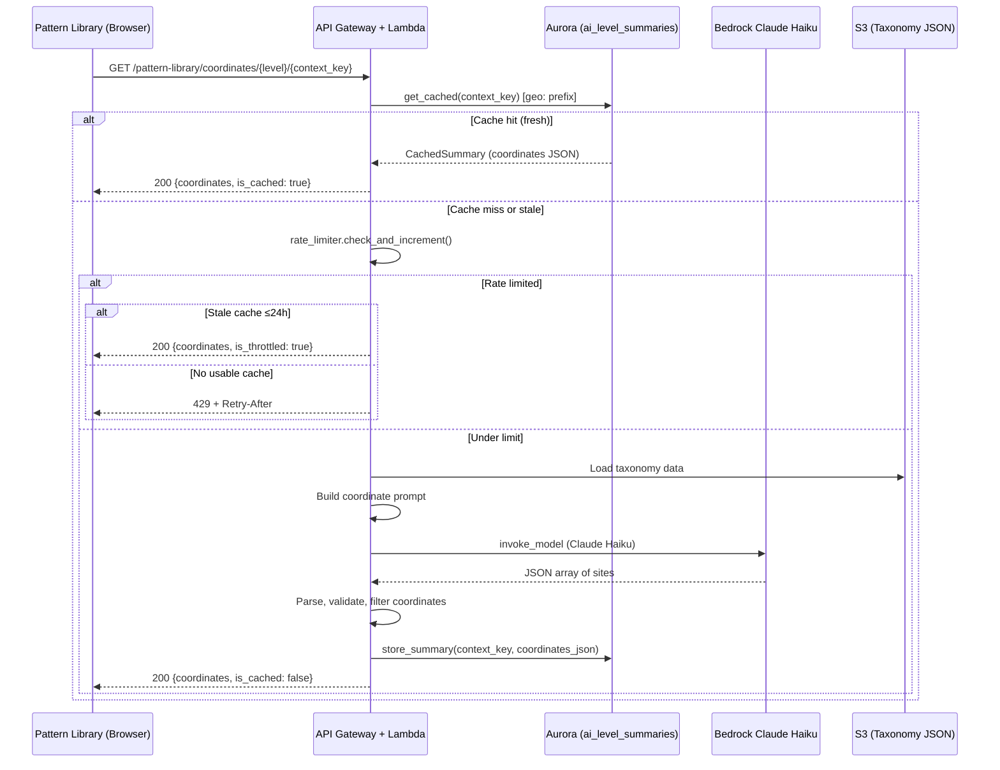

# Design Document: Geospatial Insight Map

## Overview

This feature adds an interactive Leaflet.js map panel to the Pattern Library drill-down view, displaying geographic locations relevant to each taxonomy node. The backend generates coordinates on-demand via Amazon Bedrock (Claude Haiku), caches them in Aurora PostgreSQL, and shares the existing 60/hour rate limiter with AI summaries. The frontend renders markers on an OpenStreetMap-tiled Leaflet map positioned below the AI Insight panel.

The design mirrors the existing `level_summary.py` handler pattern: Bedrock invocation → cache check → rate limiting → structured JSON response. This keeps the codebase consistent and minimizes new abstractions.

## Architecture



### Design Decisions

1. **Reuse `ai_level_summaries` table with a `geo:` prefix** — Rather than creating a new table, coordinate data is stored in the same cache table using context keys prefixed with `geo:` (e.g., `geo:crime/sex_trafficking`). The `summary_text` column stores the serialized JSON coordinate array. This reuses the existing TTL, invalidation, and stale-serving logic without schema changes.

2. **Share the module-level `SummaryRateLimiter` singleton** — The existing rate limiter already persists across Lambda container reuse. Coordinate generation calls `check_and_increment()` on the same instance, ensuring the 60/hour budget is shared across both summaries and coordinates.

3. **New handler file `level_coordinates.py`** — Parallels `level_summary.py` in structure but with coordinate-specific prompt building and response parsing. Keeps concerns separated while following the same patterns.

4. **Leaflet.js from unpkg CDN** — No API key required. OpenStreetMap tiles are free and public. The map library + CSS are loaded lazily when the panel first renders.

## Components and Interfaces

### Backend Components

#### `src/lambdas/api/level_coordinates.py`

The main handler module, mirroring `level_summary.py`:

```python
# Public handlers
def get_coordinates_handler(event, context) -> dict:
    """GET /pattern-library/coordinates/{level}/{context_key}
    
    Flow: validate → cache check → rate limit → generate → cache → respond
    """

def invalidate_coordinates_handler(event, context) -> dict:
    """POST /pattern-library/coordinates/invalidate
    
    Invalidate cached coordinates by path prefix or all.
    """
```

Internal functions:
- `_invoke_bedrock(prompt_payload: dict) -> dict` — Calls Bedrock, returns raw text + token counts
- `_parse_coordinate_response(raw_text: str) -> list[dict]` — Strips markdown, parses JSON, validates coordinates
- `_validate_coordinate(obj: dict) -> bool` — Checks lat ∈ [-90, 90], lng ∈ [-180, 180], name/description present

#### `src/services/coordinate_prompt_builder.py`

Constructs Bedrock prompts for coordinate generation:

```python
class CoordinatePromptBuilder:
    def build_prompt(self, level: str, context_key: str, taxonomy_data: dict) -> dict:
        """Returns {system, messages, max_tokens} for Bedrock invocation."""
    
    def _gather_context(self, level: str, context_key: str, taxonomy_data: dict) -> str:
        """Extracts node name, description, and domain context."""
```

The prompt includes:
- System prompt establishing the coordinate generation role
- Node name, description, and hierarchical context
- Domain-specific instructions (Crime → cities/regions; Ancient Mysteries → archaeological sites)
- Output format specification (JSON array with name, lat, lng, description)
- Constraint: return 3-8 sites

#### `src/services/summary_cache_manager.py` (existing, reused)

No changes needed. The `SummaryCacheManager` is key-agnostic — it stores/retrieves by `context_key`. Coordinate data uses keys like `geo:crime/sex_trafficking` to namespace within the same table.

#### `src/services/summary_rate_limiter.py` (existing, reused)

No changes. The singleton `_rate_limiter` in `level_coordinates.py` references the same `SummaryRateLimiter` class. Since both handlers run in the same Lambda container, they share the same instance via module-level state.

#### `src/lambdas/api/case_files.py` (router — modified)

Add route matching for `/pattern-library/coordinates/`:

```python
# --- Pattern Library Coordinates routes ---
if path.startswith("/pattern-library/coordinates/"):
    from lambdas.api.level_coordinates import get_coordinates_handler, invalidate_coordinates_handler
    if path == "/pattern-library/coordinates/invalidate" and method == "POST":
        return invalidate_coordinates_handler(event, context)
    if method == "GET":
        parts = path.strip("/").split("/", 3)
        if len(parts) >= 4:
            params = event.get("pathParameters") or {}
            params["level"] = parts[2]
            params["context_key"] = parts[3]
            event["pathParameters"] = params
            return get_coordinates_handler(event, context)
    return error_response(404, "NOT_FOUND", f"No handler for {method} {path}", event)
```

### Frontend Components

#### Map Panel (in `pattern-library.html`)

```html
<!-- Geospatial Map Panel — below AI Insight Panel -->
<div class="map-panel" id="mapPanel" style="display:none;">
    <div class="map-panel-header">
        <span class="map-label">🗺️ Geographic Context</span>
        <span class="map-status" id="mapStatus">—</span>
        <button class="map-toggle-btn" id="mapToggleBtn">Hide Map</button>
    </div>
    <div class="map-panel-body" id="mapPanelBody">
        <div id="leafletMap" style="height: 350px; border-radius: 8px;"></div>
    </div>
</div>
```

#### JavaScript Functions

```javascript
// Coordinate fetching (mirrors fetchSummary pattern)
async function fetchCoordinates(level, contextKey) { ... }

// Map rendering
function renderMap(coordinates) { ... }

// Toggle visibility
function toggleMapPanel() { ... }

// Lifecycle — called alongside triggerAiSummary on navigation
function triggerMapCoordinates() { ... }
```

### API Response Schema

**Success (200):**
```json
{
  "coordinates": [
    {
      "name": "Ancient Giza Complex",
      "lat": 29.9792,
      "lng": 31.1342,
      "description": "Primary pyramid complex with Great Pyramid of Khufu."
    }
  ],
  "generated_at": "2025-01-15T10:30:00+00:00",
  "is_cached": true,
  "is_stale": false,
  "is_throttled": false,
  "taxonomy_level": "typology"
}
```

**Rate limited (429):**
```json
{
  "error": {
    "code": "RATE_LIMITED",
    "message": "Rate limit exceeded. Retry after 1847 seconds."
  }
}
```

**Validation error (400):**
```json
{
  "error": {
    "code": "INVALID_TAXONOMY_LEVEL",
    "message": "Invalid taxonomy level 'foo'. Accepted values: domain, typology, method, signature, precedent_case"
  }
}
```

## Data Models

### Coordinate Site Object

| Field | Type | Constraints |
|-------|------|-------------|
| name | string | Non-empty |
| lat | float | -90 ≤ lat ≤ 90 |
| lng | float | -180 ≤ lng ≤ 180 |
| description | string | Non-empty, ≤ 200 chars |

### Cache Storage (reuses `ai_level_summaries` table)

| Column | Usage for Coordinates |
|--------|----------------------|
| context_key | `geo:{domain}/{typology}/...` — prefixed with `geo:` |
| taxonomy_level | One of: domain, typology, method, signature, precedent_case |
| summary_text | JSON-serialized array of coordinate site objects |
| model_id | `anthropic.claude-3-haiku-20240307-v1:0` |
| prompt_token_count | Tokens consumed by prompt |
| completion_token_count | Tokens in Bedrock response |
| generated_at | Timestamp of generation |
| expires_at | generated_at + 7 days |

### Prompt Structure

```python
COORDINATE_SYSTEM_PROMPT = (
    "You are a geographic research assistant. Given a taxonomy node from an "
    "investigative intelligence system, identify 3-8 real-world geographic "
    "locations relevant to the described pattern, method, or case. "
    "Return ONLY a JSON array of objects with keys: name, lat, lng, description. "
    "No markdown, no preamble — just the JSON array."
)

# Domain-specific user instructions appended:
CRIME_INSTRUCTION = (
    "Identify cities or regions where precedent cases, criminal operations, "
    "or pattern instances of this type have been documented."
)

ANCIENT_MYSTERIES_INSTRUCTION = (
    "Identify actual archaeological sites, historical monuments, temples, "
    "ley line endpoints, or geological formations associated with this topic."
)
```

## Correctness Properties

*A property is a characteristic or behavior that should hold true across all valid executions of a system — essentially, a formal statement about what the system should do. Properties serve as the bridge between human-readable specifications and machine-verifiable correctness guarantees.*

### Property 1: Domain-aware prompt construction

*For any* valid taxonomy node, the coordinate prompt SHALL contain the node's name, description, and domain context, AND include domain-specific geographic instructions (crime-oriented for Crime domain, archaeology-oriented for Ancient Mysteries domain).

**Validates: Requirements 1.4, 1.5, 1.6, 9.1**

### Property 2: Coordinate validation filters invalid entries

*For any* set of coordinate objects returned by Bedrock, only those with lat ∈ [-90, 90], lng ∈ [-180, 180], a non-empty name, and a non-empty description SHALL appear in the final result set.

**Validates: Requirements 9.2, 9.3**

### Property 3: Markdown-tolerant JSON parsing

*For any* Bedrock response text that contains valid JSON (possibly wrapped in markdown code fences or preceded by preamble text), the parser SHALL extract and return the coordinate array. For any response that contains no valid JSON, the parser SHALL return an empty array.

**Validates: Requirements 9.4, 9.5**

### Property 4: Result count enforcement

*For any* parsed and validated coordinate set, if the count is fewer than 3 valid sites, the Coordinate_Service SHALL return an empty coordinate array. If the count is between 3 and 8, all sites are returned.

**Validates: Requirements 1.1, 1.8**

### Property 5: Cache round-trip preserves coordinate data

*For any* valid coordinate array stored in the cache, retrieving it by the same context_key SHALL return an equivalent coordinate array (same sites, same order).

**Validates: Requirements 2.1**

### Property 6: Input validation rejects invalid parameters

*For any* level string not in {domain, typology, method, signature, precedent_case}, the service SHALL return HTTP 400 with code INVALID_TAXONOMY_LEVEL. For any context_key that is empty or exceeds 256 characters, the service SHALL return HTTP 400.

**Validates: Requirements 6.3, 6.4**

### Property 7: API response schema completeness

*For any* successful coordinate response, the JSON body SHALL contain the fields: coordinates (array), generated_at (string), is_cached (boolean), is_throttled (boolean), and taxonomy_level (string). Each coordinate object SHALL contain: name (string), lat (number), lng (number), description (string).

**Validates: Requirements 6.2, 1.2**

### Property 8: Marker-to-coordinate bijection

*For any* non-empty coordinate array rendered on the map, the number of Leaflet markers placed SHALL equal the number of coordinate objects, and each marker's position SHALL correspond to the lat/lng of exactly one coordinate object.

**Validates: Requirements 4.2**

## Error Handling

| Scenario | Behavior | HTTP Status |
|----------|----------|-------------|
| Invalid taxonomy level | Return error with code `INVALID_TAXONOMY_LEVEL` | 400 |
| Empty or oversized context_key | Return descriptive validation error | 400 |
| Bedrock timeout (>10s) | Log error, return `GENERATION_FAILED` | 503 |
| Bedrock returns unparseable text | Log error, return empty coordinates | 200 |
| Bedrock returns <3 valid sites | Log warning, return empty coordinates | 200 |
| Rate limit exceeded + stale cache ≤24h | Serve stale with `is_throttled: true` | 200 |
| Rate limit exceeded + no cache | Return `RATE_LIMITED` with Retry-After | 429 |
| Cache write failure | Log error, still return coordinates to caller | 200 |
| Network error (frontend) | Show dismissible error message, taxonomy content intact | — |
| S3 taxonomy load failure | Return `GENERATION_FAILED` | 503 |

All errors are logged with `context_key`, timestamp, and error details. Bedrock invocations additionally log prompt/completion token counts and latency in milliseconds.

## Testing Strategy

### Property-Based Tests (pytest + Hypothesis)

Each correctness property is implemented as a property-based test with minimum 100 iterations using the `hypothesis` library:

- **Property 1**: Generate random taxonomy node dicts (varying domain, name, description), invoke `CoordinatePromptBuilder.build_prompt()`, assert prompt contains node name + description + domain-appropriate instructions.
- **Property 2**: Generate random lists of coordinate dicts with lat/lng values spanning [-200, 200], run through `_validate_coordinate()` filter, assert only valid ones survive.
- **Property 3**: Generate random valid JSON arrays, wrap in various markdown patterns (`\`\`\`json ... \`\`\``, preamble + JSON, bare JSON), feed to `_parse_coordinate_response()`, assert correct extraction. Also generate random non-JSON strings, assert empty result.
- **Property 4**: Generate random validated coordinate lists of length 0-10, apply count enforcement, assert empty for <3 and passthrough for 3-8.
- **Property 5**: Generate random coordinate arrays, serialize + store via `SummaryCacheManager`, retrieve, assert equality.
- **Property 6**: Generate random strings (including valid levels for negative testing), call handler with them, assert appropriate HTTP status codes.
- **Property 7**: Generate valid coordinate sets, run through full handler (mocked Bedrock), assert response contains all required fields.
- **Property 8**: Generate random coordinate arrays (3-8 items), call `renderMap()` logic, assert marker count matches and positions correspond.

**Configuration:**
- Library: `hypothesis` (Python) for backend; `fast-check` (JS) for frontend marker logic
- Minimum iterations: 100 per property
- Tag format: `# Feature: geospatial-insight-map, Property N: {description}`

### Unit Tests (pytest)

- Cache hit path returns coordinates without Bedrock call
- Rate limited + stale cache returns `is_throttled: true`
- Rate limited + no cache returns 429 with Retry-After header
- Bedrock timeout triggers 503 response
- Cache write failure does not block response
- Toggle button label reflects panel state
- Navigation change triggers new coordinate fetch

### Integration Tests

- End-to-end: API Gateway → Lambda → Aurora cache round-trip
- Bedrock invocation with real model (manual/staging only)
- Invalidation endpoint clears `geo:`-prefixed entries
- Frontend fetches and renders markers on live map
