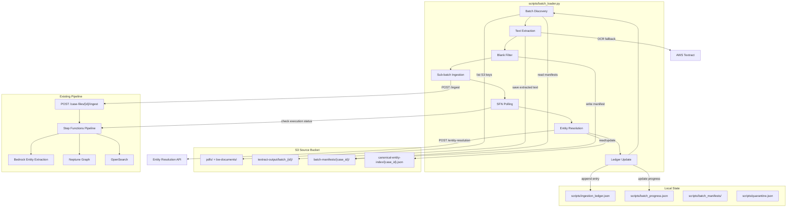
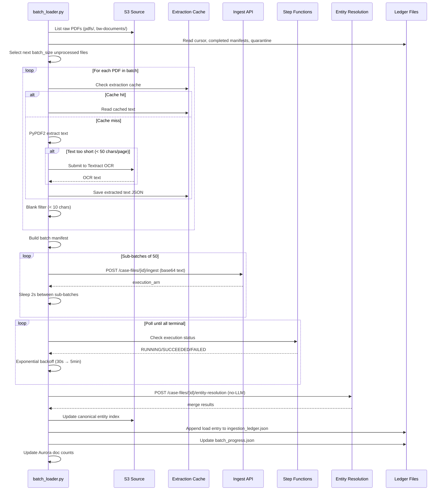

# Design: Incremental Batch Loader

## Overview

The Incremental Batch Loader is a CLI Python script (`scripts/batch_loader.py`) that automates processing of ~326K remaining raw PDFs through the existing DOJ document analysis pipeline. It builds on the proven Phase 1/Phase 2 loading pattern but adds: automatic batch discovery with cursor-based resumption, PyPDF2 text extraction with Textract OCR fallback, blank filtering, sub-batch ingestion via the existing ingest API, entity resolution at batch boundaries using a canonical entity index for O(n) dedup, cost estimation with dry-run mode, and full audit trail integration with the existing ingestion ledger.

The script is designed to be run repeatedly — each invocation discovers the next batch of unprocessed files, processes them end-to-end, and updates all tracking state. It is idempotent: re-running after a crash picks up exactly where it left off.

### Key Design Decisions

1. **CLI script, not Lambda**: The batch loader runs locally (or on an EC2 instance) because it needs to orchestrate long-running workflows (hours per batch), poll Step Functions, and manage local state. The actual document processing still happens in Lambda via the existing Step Functions pipeline.

2. **Reuse existing ingest API**: Rather than building a parallel pipeline, we send extracted text through `POST /case-files/{case_id}/ingest` exactly as Phase 1/Phase 2 did. This ensures all documents go through the same Bedrock entity extraction → embedding → Neptune graph load path.

3. **Canonical entity index as local JSON**: For the initial implementation, the canonical entity index is a JSON file persisted to S3 and cached locally. This avoids DynamoDB provisioning overhead while still providing O(n) entity lookup. Can be migrated to DynamoDB later if needed.

4. **Entity resolution at batch boundaries**: Running entity resolution after every 5K docs (one batch) keeps the merge problem tractable. The existing `EntityResolutionService.find_candidates` already partitions by entity type, and the canonical index eliminates re-comparing known entities.

5. **Text extraction happens client-side**: PyPDF2 extraction runs in the batch loader process. Only scanned PDFs that need OCR are sent to Textract. This minimizes AWS costs since ~60% of PDFs have extractable text.

## Architecture



### Data Flow (Single Batch)



## Components and Interfaces

### Module Structure

```
scripts/
├── batch_loader.py          # Main CLI entry point
├── batch_loader/
│   ├── __init__.py
│   ├── discovery.py         # Batch discovery + cursor management
│   ├── extractor.py         # Text extraction (PyPDF2 + Textract fallback)
│   ├── filter.py            # Blank document filtering
│   ├── ingestion.py         # Sub-batch API ingestion + SFN polling
│   ├── entity_index.py      # Canonical entity index management
│   ├── cost_estimator.py    # Cost estimation + dry-run
│   ├── manifest.py          # Batch manifest generation + persistence
│   ├── ledger_integration.py # Ledger + progress file updates
│   └── config.py            # CLI config dataclass + argument parsing
├── batch_manifests/         # Local manifest copies
├── batch_progress.json      # Running progress state
├── quarantine.json          # Quarantined file keys
└── ingestion_ledger.json    # Existing ledger (extended)
```

### Component Interfaces

#### `config.py` — BatchConfig

```python
@dataclass
class BatchConfig:
    batch_size: int = 5000
    case_id: str = "ed0b6c27-3b6b-4255-b9d0-efe8f4383a99"
    sub_batch_size: int = 50
    dry_run: bool = False
    confirm: bool = False
    no_entity_resolution: bool = False
    max_batches: int = 1
    ocr_threshold: int = 50          # chars/page below which Textract is used
    blank_threshold: int = 10        # chars below which doc is blank
    source_prefixes: list[str] = field(default_factory=lambda: ["pdfs/", "bw-documents/"])
    source_bucket: str = "doj-cases-974220725866-us-east-1"
    data_lake_bucket: str = "research-analyst-data-lake-974220725866"
    api_url: str = "https://edb025my3i.execute-api.us-east-1.amazonaws.com/v1"
    sub_batch_delay: float = 2.0     # seconds between sub-batch API calls
    max_retries: int = 3
    failure_threshold: float = 0.10  # pause if >10% of batch fails
    poll_initial_delay: int = 30     # seconds
    poll_max_delay: int = 300        # seconds (5 min)
```

#### `discovery.py` — BatchDiscovery

```python
class BatchDiscovery:
    """Discovers next batch of unprocessed raw PDFs from S3."""

    def __init__(self, config: BatchConfig, s3_client):
        ...

    def list_all_raw_keys(self) -> list[str]:
        """List all PDF keys under configured source prefixes."""
        ...

    def load_processed_keys(self) -> set[str]:
        """Load keys from completed manifests + quarantine."""
        ...

    def get_cursor(self) -> str | None:
        """Read cursor from batch_progress.json."""
        ...

    def discover_batch(self) -> list[str]:
        """Return next batch_size unprocessed keys, starting from cursor."""
        ...

    def save_cursor(self, last_key: str):
        """Persist cursor to batch_progress.json."""
        ...
```

#### `extractor.py` — TextExtractor

```python
@dataclass
class ExtractionResult:
    s3_key: str
    text: str
    method: str              # "pypdf2" | "textract" | "cached" | "failed"
    char_count: int
    error: str | None = None

class TextExtractor:
    """Extracts text from PDFs using PyPDF2 with Textract OCR fallback."""

    def __init__(self, config: BatchConfig, s3_client, textract_client):
        ...

    def extract(self, s3_key: str) -> ExtractionResult:
        """Extract text from a single PDF. Checks cache first."""
        ...

    def _check_cache(self, s3_key: str, batch_id: str) -> str | None:
        """Check if extracted text exists in S3 cache."""
        ...

    def _extract_pypdf2(self, pdf_bytes: bytes) -> tuple[str, int]:
        """Extract text via PyPDF2. Returns (text, pages)."""
        ...

    def _extract_textract(self, s3_key: str) -> str:
        """Submit to Textract OCR and return combined text."""
        ...

    def _save_to_cache(self, s3_key: str, batch_id: str, text: str, method: str):
        """Save extracted text JSON to S3 extraction cache."""
        ...
```

#### `filter.py` — BlankFilter

```python
@dataclass
class FilterResult:
    s3_key: str
    is_blank: bool
    char_count: int

class BlankFilter:
    """Filters out blank documents below character threshold."""

    def __init__(self, config: BatchConfig):
        ...

    def filter(self, extraction: ExtractionResult) -> FilterResult:
        """Determine if extracted text is blank."""
        ...

    def compute_blank_ratio(self, results: list[FilterResult]) -> float:
        """Calculate blank-to-total ratio for batch summary."""
        ...
```

#### `ingestion.py` — PipelineIngestion

```python
class PipelineIngestion:
    """Sends non-blank documents through the existing ingest API."""

    def __init__(self, config: BatchConfig):
        ...

    def send_sub_batches(self, documents: list[tuple[str, str]]) -> list[str]:
        """Send documents in sub-batches to ingest API. Returns execution ARNs."""
        ...

    def poll_executions(self, execution_arns: list[str]) -> dict:
        """Poll Step Functions until all reach terminal state.
        Returns {arn: status} mapping."""
        ...

    def _send_single_batch(self, case_id: str, texts: list[tuple[str, str]]) -> str | None:
        """POST a single sub-batch to the ingest API. Returns execution ARN."""
        ...
```

#### `entity_index.py` — CanonicalEntityIndex

```python
@dataclass
class CanonicalEntry:
    canonical_name: str
    entity_type: str
    aliases: list[str]
    occurrence_count: int

class CanonicalEntityIndex:
    """Persistent lookup table for O(n) entity dedup."""

    def __init__(self, config: BatchConfig, s3_client):
        ...

    def load(self) -> dict[tuple[str, str], CanonicalEntry]:
        """Load index from S3 (or initialize empty)."""
        ...

    def lookup(self, normalized_name: str, entity_type: str) -> CanonicalEntry | None:
        """O(1) lookup by (normalized_name, entity_type)."""
        ...

    def register_merge(self, canonical: str, aliases: list[str], entity_type: str):
        """Add new merge cluster to the index."""
        ...

    def save(self):
        """Persist index back to S3."""
        ...
```

#### `cost_estimator.py` — CostEstimator

```python
@dataclass
class CostEstimate:
    textract_ocr_cost: float
    bedrock_entity_cost: float
    bedrock_embedding_cost: float
    neptune_write_cost: float
    total_estimated: float
    estimated_ocr_pages: int
    estimated_non_blank_docs: int

class CostEstimator:
    """Estimates AWS costs for a batch before processing."""

    def __init__(self, config: BatchConfig, historical_blank_rate: float = 0.45):
        ...

    def estimate(self, file_count: int, avg_pages: float = 3.0) -> CostEstimate:
        """Calculate estimated costs using pricing from config/aws_pricing.json."""
        ...

    def display(self, estimate: CostEstimate):
        """Print formatted cost breakdown to stdout."""
        ...
```

#### `manifest.py` — BatchManifest

```python
@dataclass
class FileEntry:
    s3_key: str
    file_size_bytes: int
    extraction_method: str       # "pypdf2" | "textract" | "failed"
    extracted_char_count: int
    blank_filtered: bool
    pipeline_status: str         # "sent" | "succeeded" | "failed" | "quarantined"
    sfn_execution_arn: str | None = None
    error_message: str | None = None

@dataclass
class BatchManifestData:
    batch_id: str
    batch_number: int
    started_at: str
    completed_at: str | None
    source_prefix: list[str]
    files: list[FileEntry]

class BatchManifest:
    """Generates and persists batch manifest JSON files."""

    def __init__(self, config: BatchConfig, s3_client):
        ...

    def create(self, batch_number: int, source_prefixes: list[str]) -> BatchManifestData:
        """Initialize a new manifest for a batch."""
        ...

    def add_file(self, manifest: BatchManifestData, entry: FileEntry):
        """Add a file entry to the manifest."""
        ...

    def save(self, manifest: BatchManifestData):
        """Save manifest to S3 and local scripts/batch_manifests/."""
        ...

    def load_completed_keys(self) -> set[str]:
        """Load all S3 keys from completed manifests."""
        ...
```

#### `ledger_integration.py` — LedgerIntegration

```python
class LedgerIntegration:
    """Integrates batch results with the existing ingestion ledger."""

    def __init__(self, config: BatchConfig):
        ...

    def record_batch(self, batch_number: int, stats: dict):
        """Append a load entry to ingestion_ledger.json."""
        ...

    def update_progress(self, progress: dict):
        """Update batch_progress.json with running totals."""
        ...

    def update_aurora_doc_counts(self):
        """Update Aurora document counts via the existing pattern."""
        ...
```

## Data Models

### Batch Progress File (`scripts/batch_progress.json`)

```json
{
  "case_id": "ed0b6c27-3b6b-4255-b9d0-efe8f4383a99",
  "total_files_discovered": 331000,
  "total_processed": 15000,
  "total_remaining": 316000,
  "current_batch_number": 3,
  "cursor": "pdfs/EPSTEIN_DOC_045123.pdf",
  "cumulative_blanks": 6750,
  "cumulative_quarantined": 23,
  "cumulative_cost": 142.50,
  "last_updated": "2026-04-01T14:30:00Z"
}
```

### Quarantine File (`scripts/quarantine.json`)

```json
{
  "quarantined_keys": [
    {
      "s3_key": "pdfs/CORRUPTED_FILE.pdf",
      "reason": "PyPDF2 PdfReadError: EOF marker not found",
      "failed_at": "2026-04-01T10:15:00Z",
      "retry_count": 3,
      "batch_number": 1
    }
  ]
}
```

### Batch Manifest (`batch-manifests/{case_id}/batch_001.json`)

```json
{
  "batch_id": "batch_001",
  "batch_number": 1,
  "started_at": "2026-04-01T10:00:00Z",
  "completed_at": "2026-04-01T12:30:00Z",
  "source_prefix": ["pdfs/", "bw-documents/"],
  "summary": {
    "total_files": 5000,
    "extracted_pypdf2": 3000,
    "extracted_textract": 750,
    "extraction_failed": 12,
    "blank_filtered": 2250,
    "sent_to_pipeline": 2488,
    "pipeline_succeeded": 2480,
    "pipeline_failed": 8,
    "quarantined": 8
  },
  "files": [
    {
      "s3_key": "pdfs/EPSTEIN_DOC_000001.pdf",
      "file_size_bytes": 45230,
      "extraction_method": "pypdf2",
      "extracted_char_count": 12450,
      "blank_filtered": false,
      "pipeline_status": "succeeded",
      "sfn_execution_arn": "arn:aws:states:us-east-1:974220725866:execution:...",
      "error_message": null
    }
  ]
}
```

### Canonical Entity Index (`canonical-entity-index/{case_id}.json`)

```json
{
  "version": 1,
  "case_id": "ed0b6c27-3b6b-4255-b9d0-efe8f4383a99",
  "last_updated": "2026-04-01T12:30:00Z",
  "entries": {
    "person::jeffrey epstein": {
      "canonical_name": "Jeffrey Epstein",
      "entity_type": "person",
      "aliases": ["Jeffrey E. Epstein", "J. Epstein", "Epstein, Jeffrey"],
      "occurrence_count": 4521
    },
    "person::ghislaine maxwell": {
      "canonical_name": "Ghislaine Maxwell",
      "entity_type": "person",
      "aliases": ["G. Maxwell", "Maxwell, Ghislaine"],
      "occurrence_count": 2103
    }
  },
  "stats": {
    "total_canonical_entities": 1250,
    "total_aliases": 3400,
    "batches_processed": 3
  }
}
```

### Ingestion Ledger Entry (appended to existing `scripts/ingestion_ledger.json`)

```json
{
  "load_id": "batch_001",
  "timestamp": "2026-04-01T12:30:00Z",
  "source": "Raw PDFs batch 1",
  "source_bucket": "doj-cases-974220725866-us-east-1",
  "source_prefixes": ["pdfs/", "bw-documents/"],
  "source_files_total": 5000,
  "blanks_skipped": 2250,
  "docs_sent_to_pipeline": 2488,
  "sfn_executions": 50,
  "sfn_succeeded": 49,
  "sfn_failed": 1,
  "entity_resolution_result": {
    "clusters_merged": 45,
    "nodes_dropped": 89,
    "edges_relinked": 234,
    "errors": 0
  },
  "textract_ocr_count": 750,
  "extraction_method_breakdown": {
    "pypdf2": 3000,
    "textract": 750,
    "failed": 12,
    "cached": 0
  },
  "cost_actual": 28.50,
  "notes": "Batch 1. 45% blank rate. 12 extraction failures quarantined."
}
```

## Correctness Properties

*A property is a characteristic or behavior that should hold true across all valid executions of a system — essentially, a formal statement about what the system should do. Properties serve as the bridge between human-readable specifications and machine-verifiable correctness guarantees.*

### Property 1: Discovery excludes processed and quarantined keys

*For any* set of S3 keys, any set of completed manifest keys, and any set of quarantined keys, the batch returned by `discover_batch` should contain no keys that appear in either the completed manifests or the quarantine queue.

**Validates: Requirements 1.1, 1.3**

### Property 2: Cursor round-trip persistence

*For any* valid S3 key string, saving it as the cursor via `save_cursor` and then reading it back via `get_cursor` should return the identical string.

**Validates: Requirements 1.2**

### Property 3: Batch size cap

*For any* list of unprocessed files and any positive batch_size, `discover_batch` should return at most `batch_size` files. When fewer than `batch_size` unprocessed files remain, it should return all of them.

**Validates: Requirements 1.4, 1.5**

### Property 4: OCR fallback decision

*For any* PDF extraction result with a known page count and total character count, if `chars / pages < ocr_threshold`, the extraction method should be classified as "textract". If `chars / pages >= ocr_threshold`, the method should be "pypdf2".

**Validates: Requirements 2.2**

### Property 5: Extraction cache round-trip

*For any* extracted text string and S3 key, saving the text to the extraction cache and then reading it back should return the identical text content.

**Validates: Requirements 2.4**

### Property 6: Blank filter correctness

*For any* string, the blank filter should mark it as blank if and only if the non-whitespace character count is less than `blank_threshold`. The computed blank ratio should equal `blank_count / total_count` for any list of filter results.

**Validates: Requirements 3.1, 3.3**

### Property 7: Sub-batch partitioning

*For any* list of N non-blank documents and any positive sub_batch_size S, the ingestion module should produce exactly `ceil(N / S)` API calls, each containing at most S documents, and the union of all sub-batches should equal the original document list.

**Validates: Requirements 4.1**

### Property 8: SFN polling reaches terminal state

*For any* set of Step Functions execution ARNs where each eventually reaches a terminal state (SUCCEEDED, FAILED, TIMED_OUT, ABORTED), `poll_executions` should return a mapping where every ARN has a terminal status and no ARN is left in RUNNING state.

**Validates: Requirements 4.4**

### Property 9: Exponential backoff sequence

*For any* sequence of poll iterations with initial_delay and max_delay, the delay at iteration i should equal `min(initial_delay * 2^i, max_delay)`. The sequence should be monotonically non-decreasing and capped at max_delay.

**Validates: Requirements 4.5**

### Property 10: Canonical entity index round-trip

*For any* canonical entity index containing arbitrary entries, serializing it to JSON and deserializing it back should produce an equivalent index with the same entries, aliases, and occurrence counts.

**Validates: Requirements 6.1, 6.5**

### Property 11: Canonical index alias resolution after merge

*For any* canonical name, entity type, and list of aliases, after calling `register_merge`, looking up any alias by its normalized form and entity type should return the canonical entry. Looking up the canonical name itself should also return the same entry.

**Validates: Requirements 6.2, 6.3**

### Property 12: Entity type partitioning

*For any* set of entities with mixed entity types, the comparison function should never compare two entities of different types. All generated merge candidates should have matching entity_type fields.

**Validates: Requirements 6.4**

### Property 13: Retry exhaustion leads to quarantine

*For any* document that fails extraction or ingestion on every attempt, after `max_retries` attempts the document's S3 key should appear in the quarantine queue with a failure reason and timestamp. The quarantine should persist across save/load cycles.

**Validates: Requirements 7.1, 7.2, 7.3**

### Property 14: Failure threshold triggers pause

*For any* batch where the number of failed documents divided by total documents exceeds `failure_threshold`, the batch loader should signal a pause condition rather than continuing to the next batch.

**Validates: Requirements 7.5**

### Property 15: Cost estimation correctness

*For any* positive file count, historical blank rate between 0 and 1, and average page count, the total estimated cost should equal the sum of: Textract OCR cost (estimated_scanned × pages × $0.001) + Bedrock entity extraction cost (non_blank_docs × $0.004) + Bedrock embedding cost + Neptune write cost. Each component should be non-negative.

**Validates: Requirements 8.1, 8.2**

### Property 16: Ledger entry completeness

*For any* batch processing result, the generated ledger entry should contain all required fields: load_id, timestamp, source_prefixes, source_files_total, blanks_skipped, docs_sent_to_pipeline, sfn_executions, sfn_succeeded, sfn_failed, entity_resolution_result, textract_ocr_count, extraction_method_breakdown, and notes. No required field should be null or missing.

**Validates: Requirements 9.1, 5.3, 7.4**

### Property 17: Running total invariant

*For any* sequence of batch load entries appended to the ledger, the `running_total_s3_docs` for the case should equal the sum of `docs_sent_to_pipeline` across all load entries for that case.

**Validates: Requirements 9.2**

### Property 18: Manifest completeness

*For any* batch of processed files, the batch manifest should contain exactly one entry per input file, and each entry should have all required fields: s3_key, file_size_bytes, extraction_method, extracted_char_count, blank_filtered, pipeline_status. The set of s3_keys in the manifest should equal the set of input file keys.

**Validates: Requirements 11.1, 1.6, 2.6, 3.2, 4.3**

## Error Handling

### Extraction Errors

| Error | Handling | Recovery |
|-------|----------|----------|
| PyPDF2 `PdfReadError` (corrupted/encrypted) | Log error, mark as `extraction_failed` in manifest | Retry up to `max_retries`, then quarantine |
| Textract throttling (`ProvisionedThroughputExceededException`) | Exponential backoff retry | Retry up to `max_retries` with increasing delays |
| Textract timeout | Log, mark as failed | Retry; quarantine after max retries |
| S3 `NoSuchKey` (file deleted between discovery and extraction) | Log, mark as failed | Skip file, do not quarantine (transient) |
| Out of memory (very large PDF) | Catch `MemoryError`, log | Quarantine immediately (no retry) |

### Pipeline Errors

| Error | Handling | Recovery |
|-------|----------|----------|
| Ingest API 429 (throttled) | Exponential backoff | Retry sub-batch up to 3 times |
| Ingest API 5xx | Log, retry | Retry sub-batch; quarantine individual docs after max retries |
| Step Functions execution FAILED | Record in manifest | Log failure details; quarantine if doc-level failure |
| Step Functions execution TIMED_OUT | Record in manifest | Log; doc may need manual re-processing |
| Entity resolution failure | Log error, mark ER as "failed" in ledger | Continue to next batch; ER can be re-run manually |

### Batch-Level Errors

| Error | Handling | Recovery |
|-------|----------|----------|
| Failure rate > `failure_threshold` (10%) | Pause processing, prompt operator | Operator investigates, then resumes with `--confirm` |
| Network connectivity loss | Catch `ConnectionError`, retry | Exponential backoff; abort batch after sustained failure |
| Ledger file corruption | Validate JSON on load | Keep backup copy before each write |
| S3 write failure (manifest/cache) | Retry with backoff | Log and continue; manifest can be regenerated |

## Testing Strategy

### Dual Testing Approach

The batch loader requires both unit tests and property-based tests for comprehensive coverage:

- **Unit tests**: Verify specific examples, edge cases, integration points, and error conditions
- **Property tests**: Verify universal properties across randomly generated inputs using the `hypothesis` library

### Property-Based Testing Configuration

- **Library**: [Hypothesis](https://hypothesis.readthedocs.io/) for Python
- **Minimum iterations**: 100 per property test (via `@settings(max_examples=100)`)
- **Tag format**: Each test tagged with `# Feature: incremental-batch-loader, Property {N}: {title}`
- **Each correctness property implemented by a single property-based test**

### Unit Test Coverage

Unit tests should focus on:

1. **CLI argument parsing**: Verify all flags parse correctly with defaults
2. **S3 integration mocks**: Test discovery with mocked S3 paginator responses
3. **Textract integration**: Mock Textract client for OCR fallback path
4. **Ingest API integration**: Mock HTTP calls to verify request format matches Phase 1/Phase 2 pattern
5. **Step Functions polling**: Mock SFN client with various execution state sequences
6. **Entity resolution API call**: Mock the POST endpoint and verify no-LLM mode
7. **Edge cases**: Empty S3 prefix, all-blank batch, 100% failure rate, single-file batch, unicode filenames

### Property Test Coverage

Each of the 18 correctness properties maps to one `hypothesis` test:

| Property | Module Under Test | Key Generators |
|----------|-------------------|----------------|
| 1: Discovery exclusion | `discovery.py` | Sets of S3 key strings |
| 2: Cursor round-trip | `discovery.py` | Arbitrary S3 key strings |
| 3: Batch size cap | `discovery.py` | Lists of keys, positive integers |
| 4: OCR fallback decision | `extractor.py` | Positive integers (chars, pages) |
| 5: Extraction cache round-trip | `extractor.py` | Text strings, S3 key strings |
| 6: Blank filter correctness | `filter.py` | Arbitrary strings, positive thresholds |
| 7: Sub-batch partitioning | `ingestion.py` | Lists of doc tuples, positive integers |
| 8: SFN polling terminal | `ingestion.py` | Sets of ARN strings, terminal status sequences |
| 9: Exponential backoff | `ingestion.py` | Positive integers (initial, max, iterations) |
| 10: Entity index round-trip | `entity_index.py` | Dicts of canonical entries |
| 11: Alias resolution | `entity_index.py` | Names, types, alias lists |
| 12: Entity type partitioning | `entity_index.py` | Lists of entities with mixed types |
| 13: Retry → quarantine | `extractor.py` / `ingestion.py` | S3 keys, retry counts |
| 14: Failure threshold | `batch_loader.py` | Failure counts, total counts, thresholds |
| 15: Cost estimation | `cost_estimator.py` | Positive file counts, rates, page counts |
| 16: Ledger entry completeness | `ledger_integration.py` | Batch result dicts |
| 17: Running total invariant | `ledger_integration.py` | Sequences of load entries |
| 18: Manifest completeness | `manifest.py` | Lists of file processing results |

### Test File Structure

```
tests/unit/
├── test_batch_discovery.py       # Properties 1-3 + unit tests
├── test_text_extractor.py        # Properties 4-5 + unit tests
├── test_blank_filter.py          # Property 6 + unit tests
├── test_pipeline_ingestion.py    # Properties 7-9 + unit tests
├── test_canonical_entity_index.py # Properties 10-12 + unit tests
├── test_batch_error_handling.py  # Properties 13-14 + unit tests
├── test_cost_estimator.py        # Property 15 + unit tests
├── test_ledger_integration.py    # Properties 16-17 + unit tests
└── test_batch_manifest.py        # Property 18 + unit tests
```
