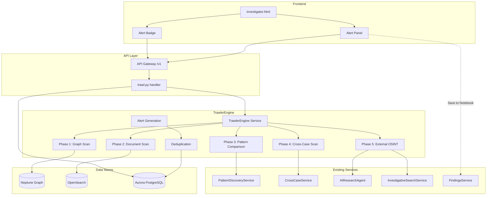

# Design Document: Intelligence Trawler & Alerts

## Overview

The Intelligence Trawler is a background analysis engine that extends the Investigative Intelligence Platform with proactive intelligence detection. Rather than requiring investigators to manually search for leads, the Trawler scans case data across Neptune graph connections, OpenSearch document indices, pattern scores, and cross-case overlaps to detect noteworthy changes and generate prioritized alerts. It optionally trawls external public sources (OSINT) via the existing AIResearchAgent.

The system consists of four layers:

1. **TrawlerEngine** — a Python service class that orchestrates multi-phase scans against existing data stores
2. **Alert persistence** — Aurora tables for alerts, scan history, and per-case configuration
3. **API handlers** — a new `trawl.py` Lambda handler with 6 routes under `/case-files/{id}/`
4. **Frontend Alert Panel** — self-contained HTML/CSS/JS appended to `investigator.html`

All components extend existing code and services without replacing anything.

## Architecture



### Request Flow

1. Investigator clicks "Run Trawl" → `POST /v1/cases/{id}/trawl`
2. API Gateway `{proxy+}` forwards to Lambda → `case_files.py` dispatcher routes to `trawl.py`
3. `trawl.py` instantiates `TrawlerEngine` with injected dependencies
4. `TrawlerEngine.run_scan()` executes phases sequentially with time budgeting
5. Each phase produces candidate alerts → deduplication → persistence to Aurora
6. Response returns scan summary + new alert count
7. Frontend polls `GET /v1/cases/{id}/alerts` to refresh the Alert Panel and Badge

## Components and Interfaces

### 1. TrawlerEngine Service (`src/services/trawler_engine.py`)

```python
class TrawlerEngine:
    """Orchestrates multi-phase trawl scans for a case."""

    def __init__(
        self,
        aurora_cm: ConnectionManager,
        pattern_service: PatternDiscoveryService,
        cross_case_service: CrossCaseService,
        research_agent: Optional[AIResearchAgent] = None,
        search_service: Optional[InvestigativeSearchService] = None,
        neptune_endpoint: str = "",
        neptune_port: str = "8182",
    ) -> None: ...

    def run_scan(
        self, case_id: str, targeted_doc_ids: Optional[list] = None
    ) -> dict:
        """Execute a full or targeted trawl scan. Returns scan summary."""
        ...

    def get_trawl_config(self, case_id: str) -> dict:
        """Load per-case trawl config from Aurora, falling back to defaults."""
        ...

    def save_trawl_config(self, case_id: str, config: dict) -> dict:
        """Persist per-case trawl config to Aurora."""
        ...

    # --- Scan Phases ---
    def _phase_graph_scan(self, case_id: str, since: datetime) -> list:
        """Phase 1: Query Neptune for new entity connections since last scan."""
        ...

    def _phase_document_scan(
        self, case_id: str, since: datetime,
        targeted_doc_ids: Optional[list] = None
    ) -> list:
        """Phase 2: Query OpenSearch for newly ingested documents matching tracked entities."""
        ...

    def _phase_pattern_comparison(
        self, case_id: str, baseline: dict
    ) -> list:
        """Phase 3: Compare current pattern scores against previous baseline."""
        ...

    def _phase_cross_case_scan(self, case_id: str) -> list:
        """Phase 4: Detect new cross-case entity overlaps."""
        ...

    def _phase_external_trawl(
        self, case_id: str, config: dict
    ) -> list:
        """Phase 5: OSINT scan via AIResearchAgent + cross-reference."""
        ...

    # --- Alert Logic ---
    def _generate_alerts(
        self, case_id: str, candidates: list, config: dict
    ) -> list:
        """Apply severity rules and config filters to candidate alerts."""
        ...

    def _deduplicate_alerts(
        self, case_id: str, alerts: list
    ) -> list:
        """Check for existing non-dismissed alerts with overlapping entities within 7 days."""
        ...

    def _persist_alerts(
        self, case_id: str, scan_id: str, alerts: list
    ) -> int:
        """Insert new alerts and update deduplicated alerts in Aurora."""
        ...
```

### 2. Alert Store Service (`src/services/trawler_alert_store.py`)

```python
class TrawlerAlertStore:
    """CRUD operations for trawler alerts in Aurora."""

    def __init__(self, aurora_cm: ConnectionManager) -> None: ...

    def list_alerts(
        self, case_id: str, alert_type: Optional[str] = None,
        severity: Optional[str] = None, source_type: Optional[str] = None,
        is_read: Optional[bool] = None, is_dismissed: Optional[bool] = None,
        limit: int = 50,
    ) -> list: ...

    def get_alert(self, alert_id: str) -> Optional[dict]: ...

    def update_alert(
        self, alert_id: str, is_read: Optional[bool] = None,
        is_dismissed: Optional[bool] = None,
    ) -> Optional[dict]: ...

    def get_unread_count(self, case_id: str) -> int: ...

    def list_scan_history(self, case_id: str, limit: int = 50) -> list: ...

    def find_duplicate(
        self, case_id: str, alert_type: str, entity_names: list,
        days: int = 7,
    ) -> Optional[dict]: ...

    def merge_into_existing(
        self, alert_id: str, new_evidence_refs: list,
        new_summary: str,
    ) -> dict: ...
```

### 3. API Handler (`src/lambdas/api/trawl.py`)

Six routes, all under `/case-files/{id}/`:

| Method | Path | Handler | Description |
|--------|------|---------|-------------|
| POST | `/trawl` | `run_trawl_handler` | Trigger a trawl scan |
| GET | `/alerts` | `list_alerts_handler` | List alerts with filters |
| PATCH | `/alerts/{alert_id}` | `update_alert_handler` | Mark read/dismissed |
| POST | `/alerts/{alert_id}/investigate` | `investigate_alert_handler` | Mark read + return drill-down data |
| GET | `/trawl/history` | `scan_history_handler` | List recent scan records |
| PUT | `/trawl-config` | `trawl_config_handler` | Get/save per-case config |

### 4. Router Integration (`src/lambdas/api/case_files.py`)

Add routing block in `dispatch_handler` before the catch-all:

```python
# Trawler / Alert routes
if any(seg in path for seg in ("/trawl", "/alerts")):
    if "/case-files/" in path:
        from lambdas.api.trawl import dispatch_handler as trawl_dispatch
        return trawl_dispatch(event, context)
```

### 5. Frontend Components

All appended to `src/frontend/investigator.html`:

- **AlertPanelManager** — JS class managing alert panel state, rendering, filtering
- **AlertBadgeManager** — JS class managing the badge count on the Case Dashboard tab
- **CSS** — scoped styles using `.trawler-alert-*` class prefix
- **HTML** — alert panel container injected into the dashboard section

## Data Models

### Aurora Migration (`src/db/migrations/011_intelligence_trawler.sql`)

```sql
BEGIN;

-- ============================================================================
-- 1. Trawler Alerts
-- ============================================================================
CREATE TABLE IF NOT EXISTS trawler_alerts (
    alert_id UUID PRIMARY KEY DEFAULT gen_random_uuid(),
    case_id UUID NOT NULL,
    scan_id UUID,
    alert_type VARCHAR(30) NOT NULL
        CHECK (alert_type IN (
            'new_connection', 'pattern_change', 'entity_spike',
            'new_evidence_match', 'cross_case_overlap', 'temporal_anomaly',
            'network_expansion', 'external_lead'
        )),
    severity VARCHAR(10) NOT NULL
        CHECK (severity IN ('critical', 'high', 'medium', 'low')),
    title VARCHAR(500) NOT NULL,
    summary TEXT,
    entity_names JSONB DEFAULT '[]'::jsonb,
    evidence_refs JSONB DEFAULT '[]'::jsonb,
    source_type VARCHAR(10) NOT NULL DEFAULT 'internal'
        CHECK (source_type IN ('internal', 'osint')),
    is_read BOOLEAN NOT NULL DEFAULT FALSE,
    is_dismissed BOOLEAN NOT NULL DEFAULT FALSE,
    created_at TIMESTAMP WITH TIME ZONE DEFAULT NOW(),
    updated_at TIMESTAMP WITH TIME ZONE DEFAULT NOW()
);

CREATE INDEX idx_trawler_alerts_case ON trawler_alerts(case_id);
CREATE INDEX idx_trawler_alerts_case_unread ON trawler_alerts(case_id)
    WHERE is_read = FALSE AND is_dismissed = FALSE;
CREATE INDEX idx_trawler_alerts_type ON trawler_alerts(alert_type);
CREATE INDEX idx_trawler_alerts_severity ON trawler_alerts(severity);
CREATE INDEX idx_trawler_alerts_source ON trawler_alerts(source_type);
CREATE INDEX idx_trawler_alerts_created ON trawler_alerts(case_id, created_at DESC);
CREATE INDEX idx_trawler_alerts_entities ON trawler_alerts USING GIN(entity_names);
CREATE INDEX idx_trawler_alerts_dedup ON trawler_alerts(case_id, alert_type, created_at)
    WHERE is_dismissed = FALSE;

-- ============================================================================
-- 2. Trawl Scans (audit trail)
-- ============================================================================
CREATE TABLE IF NOT EXISTS trawl_scans (
    scan_id UUID PRIMARY KEY DEFAULT gen_random_uuid(),
    case_id UUID NOT NULL,
    started_at TIMESTAMP WITH TIME ZONE DEFAULT NOW(),
    completed_at TIMESTAMP WITH TIME ZONE,
    alerts_generated INTEGER DEFAULT 0,
    scan_status VARCHAR(15) NOT NULL DEFAULT 'running'
        CHECK (scan_status IN ('running', 'completed', 'failed', 'partial')),
    scan_type VARCHAR(15) NOT NULL DEFAULT 'full'
        CHECK (scan_type IN ('full', 'targeted')),
    phase_timings JSONB DEFAULT '{}'::jsonb,
    error_message TEXT,
    pattern_baseline JSONB DEFAULT '{}'::jsonb
);

CREATE INDEX idx_trawl_scans_case ON trawl_scans(case_id);
CREATE INDEX idx_trawl_scans_case_time ON trawl_scans(case_id, started_at DESC);

-- ============================================================================
-- 3. Trawl Configuration (per-case)
-- ============================================================================
CREATE TABLE IF NOT EXISTS trawl_configs (
    case_id UUID PRIMARY KEY,
    enabled_alert_types JSONB DEFAULT '["new_connection","pattern_change","entity_spike","new_evidence_match","cross_case_overlap","temporal_anomaly","network_expansion"]'::jsonb,
    min_severity VARCHAR(10) DEFAULT 'low'
        CHECK (min_severity IN ('critical', 'high', 'medium', 'low')),
    external_trawl_enabled BOOLEAN DEFAULT FALSE,
    created_at TIMESTAMP WITH TIME ZONE DEFAULT NOW(),
    updated_at TIMESTAMP WITH TIME ZONE DEFAULT NOW()
);

COMMIT;
```

### Evidence Reference Schema

Each entry in `evidence_refs` JSONB array:

```json
{
    "ref_id": "doc-uuid-or-edge-id",
    "ref_type": "document | graph_edge | external_url",
    "source_label": "filename.pdf | edge-id-123 | https://example.com/article",
    "excerpt": "Relevant text snippet, max 500 chars..."
}
```

### Alert Severity Assignment Rules

| Evidence Count | Severity |
|---------------|----------|
| 10+ | critical |
| 5–9 | high |
| 3–4 | medium |
| 1–2 | low |

### Trawl Config Default Shape

```json
{
    "enabled_alert_types": [
        "new_connection", "pattern_change", "entity_spike",
        "new_evidence_match", "cross_case_overlap",
        "temporal_anomaly", "network_expansion"
    ],
    "min_severity": "low",
    "external_trawl_enabled": false
}
```

### Scan Phase Execution Order

```mermaid
sequenceDiagram
    participant API as trawl.py
    participant TE as TrawlerEngine
    participant NP as Neptune
    participant OS as OpenSearch
    participant PDS as PatternDiscoveryService
    participant CCS as CrossCaseService
    participant ARA as AIResearchAgent
    participant AU as Aurora

    API->>TE: run_scan(case_id)
    TE->>AU: Create trawl_scans record (status=running)
    TE->>AU: Load last scan timestamp + baseline
    TE->>AU: Load trawl_config

    rect rgb(40, 60, 80)
        Note over TE,NP: Phase 1: Graph Scan (≤8s)
        TE->>NP: Query new connections since last_scan
        NP-->>TE: New edges + entity pairs
    end

    rect rgb(40, 60, 80)
        Note over TE,OS: Phase 2: Document Scan (≤5s)
        TE->>OS: Query new docs matching tracked entities
        OS-->>TE: Matching documents
    end

    rect rgb(40, 60, 80)
        Note over TE,PDS: Phase 3: Pattern Comparison (≤8s)
        TE->>PDS: discover_top_patterns(case_id)
        PDS-->>TE: Current pattern scores
        TE->>TE: Compare vs baseline
    end

    rect rgb(40, 60, 80)
        Note over TE,CCS: Phase 4: Cross-Case (≤5s)
        TE->>CCS: scan_for_overlaps(case_id)
        CCS-->>TE: New overlaps
    end

    rect rgb(40, 60, 80)
        Note over TE,ARA: Phase 5: External OSINT (≤60s, optional)
        TE->>ARA: research_all_subjects(top 5 entities)
        ARA-->>TE: External findings
        TE->>TE: Cross-reference vs internal
    end

    TE->>TE: Generate alerts (severity rules)
    TE->>TE: Deduplicate against existing alerts
    TE->>AU: Persist alerts + update scan record
    TE-->>API: Scan summary + alert count
```




## Correctness Properties

*A property is a characteristic or behavior that should hold true across all valid executions of a system — essentially, a formal statement about what the system should do. Properties serve as the bridge between human-readable specifications and machine-verifiable correctness guarantees.*

### Property 1: Severity assignment follows evidence count thresholds

*For any* non-negative integer evidence count, the assigned severity SHALL be "critical" if count ≥ 10, "high" if 5 ≤ count ≤ 9, "medium" if 3 ≤ count ≤ 4, and "low" if 1 ≤ count ≤ 2.

**Validates: Requirements 2.7**

### Property 2: Threshold-based alert generation

*For any* candidate detection with a numeric count and an alert type with a defined threshold (new_connection: ≥3 shared docs, entity_spike: ≥5 new docs, network_expansion: ≥3 new connections), an alert SHALL be generated if and only if the count meets or exceeds the threshold for that type.

**Validates: Requirements 2.1, 2.3, 2.5**

### Property 3: Pattern score change detection

*For any* pair of baseline and current pattern score dictionaries, a pattern_change alert SHALL be generated for a pattern if and only if the current score exceeds the baseline score by more than 25% (i.e., current > baseline × 1.25).

**Validates: Requirements 1.3, 2.2**

### Property 4: Temporal anomaly detection

*For any* set of timestamped events associated with entities, a temporal_anomaly alert SHALL be generated if and only if there exists a 48-hour window containing events involving 3 or more distinct tracked entities.

**Validates: Requirements 2.6**

### Property 5: Config-based alert filtering

*For any* trawl configuration specifying enabled alert types and a minimum severity threshold, and any set of candidate alerts, the filtered output SHALL contain only alerts whose alert_type is in the enabled list AND whose severity meets or exceeds the minimum threshold (where critical > high > medium > low).

**Validates: Requirements 7.5**

### Property 6: Alert deduplication

*For any* new candidate alert and any set of existing non-dismissed alerts in the store, the candidate SHALL be identified as a duplicate if and only if there exists an existing alert with the same case_id, same alert_type, at least one overlapping entity_name, and created_at within the past 7 days.

**Validates: Requirements 11.1, 11.2**

### Property 7: Evidence reference structure completeness

*For any* generated evidence reference, the ref object SHALL contain all required fields (ref_id, ref_type, source_label, excerpt), ref_type SHALL be one of "document", "graph_edge", or "external_url", and excerpt SHALL not exceed 500 characters. For external_lead alerts specifically, ref_type SHALL be "external_url" and source_label SHALL be non-empty.

**Validates: Requirements 3.5, 13.7**

### Property 8: External finding categorization produces correct alerts

*For any* cross-reference report entry, if the category is "external_only" then an external_lead alert SHALL be generated, and if the category is "confirmed_internally" then an external_lead alert SHALL be generated with severity "medium". Entries with category "needs_research" SHALL not generate alerts.

**Validates: Requirements 13.3, 13.4**

### Property 9: Alert query filtering correctness

*For any* set of alerts in the store and any combination of filter parameters (alert_type, severity, source_type, is_read, is_dismissed), the query result SHALL contain exactly those alerts that match ALL specified filters, and no others.

**Validates: Requirements 3.3**

## Error Handling

### TrawlerEngine Scan Errors

| Error Scenario | Handling | Status |
|---|---|---|
| Neptune query timeout/failure in Phase 1 | Log error, skip Phase 1, continue to Phase 2 | scan_status = "partial" |
| OpenSearch query failure in Phase 2 | Log error, skip Phase 2, continue to Phase 3 | scan_status = "partial" |
| PatternDiscoveryService failure in Phase 3 | Log error, skip Phase 3, continue to Phase 4 | scan_status = "partial" |
| CrossCaseService failure in Phase 4 | Log error, skip Phase 4, continue to Phase 5 | scan_status = "partial" |
| AIResearchAgent failure in Phase 5 | Log error, skip external trawl | scan_status = "partial" |
| Individual alert persistence failure | Log error, continue persisting remaining alerts (Req 3.4) | alerts_generated reflects successful inserts |
| All phases fail | Record scan with status "failed" and error_message | scan_status = "failed" |
| Case ID not found | Return HTTP 404 from API handler | N/A |
| Scan exceeds 30s budget | Complete current phase, skip remaining phases | scan_status = "partial" |

### API Error Responses

| Scenario | HTTP Status | Error Code |
|---|---|---|
| Missing case_id | 400 | VALIDATION_ERROR |
| Invalid alert_type filter | 400 | VALIDATION_ERROR |
| Case not found | 404 | NOT_FOUND |
| Alert not found | 404 | NOT_FOUND |
| TrawlerEngine internal error | 500 | INTERNAL_ERROR |
| Aurora connection failure | 500 | INTERNAL_ERROR |

### Frontend Error Handling

- API call failures: show toast notification "Unable to load alerts" with retry button
- Empty alert list: show "No alerts yet — run a trawl scan to check for new intelligence"
- Badge count fetch failure: hide badge (fail silent)

## Testing Strategy

### Property-Based Tests (fast-check or Hypothesis)

Use **Hypothesis** (Python PBT library) for property-based tests. Each test runs minimum 100 iterations.

| Property | Test File | Tag |
|---|---|---|
| Property 1: Severity assignment | `tests/unit/test_trawler_engine.py` | Feature: intelligence-trawler-alerts, Property 1: Severity assignment follows evidence count thresholds |
| Property 2: Threshold-based alert generation | `tests/unit/test_trawler_engine.py` | Feature: intelligence-trawler-alerts, Property 2: Threshold-based alert generation |
| Property 3: Pattern score change detection | `tests/unit/test_trawler_engine.py` | Feature: intelligence-trawler-alerts, Property 3: Pattern score change detection |
| Property 4: Temporal anomaly detection | `tests/unit/test_trawler_engine.py` | Feature: intelligence-trawler-alerts, Property 4: Temporal anomaly detection |
| Property 5: Config-based alert filtering | `tests/unit/test_trawler_engine.py` | Feature: intelligence-trawler-alerts, Property 5: Config-based alert filtering |
| Property 6: Alert deduplication | `tests/unit/test_trawler_engine.py` | Feature: intelligence-trawler-alerts, Property 6: Alert deduplication |
| Property 7: Evidence ref structure | `tests/unit/test_trawler_engine.py` | Feature: intelligence-trawler-alerts, Property 7: Evidence reference structure completeness |
| Property 8: External finding categorization | `tests/unit/test_trawler_engine.py` | Feature: intelligence-trawler-alerts, Property 8: External finding categorization produces correct alerts |
| Property 9: Alert query filtering | `tests/unit/test_trawler_alert_store.py` | Feature: intelligence-trawler-alerts, Property 9: Alert query filtering correctness |

### Unit Tests (example-based)

| Test | File | Validates |
|---|---|---|
| Cross-case overlap generates alert | `tests/unit/test_trawler_engine.py` | Req 2.4 |
| Dedup merge resets is_read and updates timestamp | `tests/unit/test_trawler_engine.py` | Req 11.3 |
| Partial scan failure persists pre-failure alerts | `tests/unit/test_trawler_engine.py` | Req 9.4 |
| API returns 404 for missing case | `tests/unit/test_trawl_handler.py` | Req 4.5 |
| POST /trawl invokes TrawlerEngine | `tests/unit/test_trawl_handler.py` | Req 4.1 |
| GET /alerts returns filtered list | `tests/unit/test_trawl_handler.py` | Req 4.2 |
| PATCH /alerts/{id} updates status | `tests/unit/test_trawl_handler.py` | Req 4.3 |
| POST /alerts/{id}/investigate returns drill-down data | `tests/unit/test_trawl_handler.py` | Req 4.4 |
| GET /trawl/history returns sorted scans | `tests/unit/test_trawl_handler.py` | Req 9.2 |
| PUT /trawl-config persists config | `tests/unit/test_trawl_handler.py` | Req 7.4 |
| Alert insert failure doesn't stop remaining alerts | `tests/unit/test_trawler_engine.py` | Req 3.4 |
| Save to Notebook creates finding with type trawler_alert | `tests/unit/test_trawl_handler.py` | Req 8.6 |

### Integration Tests

| Test | Validates |
|---|---|
| Full scan against Neptune + OpenSearch + Aurora | Req 1.1, 1.2, 1.5 |
| Targeted scan with specific doc_ids | Req 10.1, 10.2, 10.3 |
| External trawl with AIResearchAgent mock | Req 13.1, 13.2 |
| Scan completes within 30s budget | Req 1.6 |
