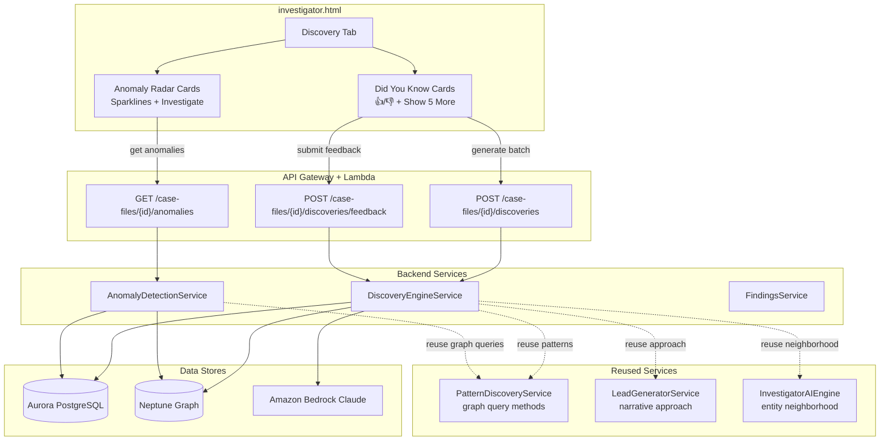

# Design Document: Investigative Discovery Engine

## Overview

This feature replaces the Patterns tab and Patterns sub-panel in the Research Hub with a two-lens investigative discovery experience. Lens 1 ("Did You Know") uses Amazon Bedrock LLMs to generate narrative, surprise-based investigative discoveries with feedback learning. Lens 2 ("Anomaly Radar") uses statistical algorithms to detect structural pattern deviations across temporal, network, frequency, co-absence, and volume dimensions.

The design supports multiple Bedrock models to accommodate government/DOJ environments where specific model providers may not be approved. The frontend includes a model selector dropdown, and the API accepts an optional `model_id` parameter.

Two new backend services are introduced:

- **DiscoveryEngineService** — orchestrates "Did You Know" generation by gathering comprehensive case context from Aurora, Neptune, and existing services, building a Bedrock prompt with an investigator persona, generating 5 discoveries per batch, incorporating feedback from `discovery_feedback`, and excluding already-seen discoveries via `discovery_history`. Supports configurable model selection.
- **AnomalyDetectionService** — computes statistical anomalies across five dimensions (temporal, network, frequency, co-absence, volume) using z-scores, structural hole detection, frequency distribution outliers, co-absence analysis, and entity type ratio comparisons. (No LLM dependency — pure algorithmic.)

### Supported Models

The model registry is environment-aware. When the customer answers qualifying questions (Region → compliance level), the selector filters to only show authorized models.

**Qualifying Logic:**
- GovCloud (us-gov-west-1, us-gov-east-1) → FedRAMP High + DoD IL4/5
- Commercial East/West (us-east-1, us-west-2) → FedRAMP Moderate
- Other commercial regions → No FedRAMP (commercial only)

**FedRAMP High (GovCloud) — Authorized Models:**

| Model ID | Provider | Type | Speed | Depth | Notes |
|----------|----------|------|-------|-------|-------|
| `amazon.titan-text-premier-v1:0` | Amazon | Text | Fast | Good | Native AWS, all Titan models authorized |
| `amazon.titan-text-express-v1` | Amazon | Text | Fast | Basic | Lightweight, low cost |
| `anthropic.claude-sonnet-4-5-20250514-v1:0` | Anthropic | Text | Medium | Excellent | Latest Sonnet, best quality |
| `anthropic.claude-3-7-sonnet-20250219-v1:0` | Anthropic | Text | Medium | Deep | Strong reasoning |
| `anthropic.claude-3-5-sonnet-20240620-v1:0` | Anthropic | Text | Medium | Deep | Proven production model |
| `anthropic.claude-3-haiku-20240307-v1:0` | Anthropic | Text | Fast | Good | Best for 29s API Gateway budget |
| `meta.llama3-8b-instruct-v1:0` | Meta | Text | Fast | Basic | Open source, small |
| `meta.llama3-70b-instruct-v1:0` | Meta | Text | Slow | Deep | Open source, large |
| `amazon.titan-embed-text-v2:0` | Amazon | Embedding | Fast | N/A | For vector search |

**FedRAMP Moderate (Commercial us-east-1, us-west-2) — All above plus:**

| Model ID | Provider | Type | Speed | Depth | Notes |
|----------|----------|------|-------|-------|-------|
| `amazon.nova-pro-v1:0` | Amazon | Text | Medium | Deep | AWS-native, no third-party data concerns |
| `amazon.nova-lite-v1:0` | Amazon | Text | Fast | Good | AWS-native, fast |
| `amazon.nova-micro-v1:0` | Amazon | Text | Fastest | Basic | AWS-native, cheapest |
| `anthropic.claude-sonnet-4-20250514-v1:0` | Anthropic | Text | Medium | Excellent | Latest |
| `mistral.mistral-large-2407-v1:0` | Mistral | Text | Medium | Deep | European provider |
| `ai21.jamba-1-5-large-v1:0` | AI21 | Text | Medium | Deep | Specialized for long context |

**Recommended Model by Use Case:**

| Use Case | GovCloud Pick | Commercial Pick | Why |
|----------|--------------|-----------------|-----|
| Did You Know (speed) | Claude 3 Haiku | Nova Lite | 29s budget, need fast response |
| Did You Know (quality) | Claude 3.7 Sonnet | Claude Sonnet 4.5 | Better narrative depth |
| Entity extraction | Claude 3 Haiku | Nova Lite | High volume, cost-sensitive |
| Research conversation | Claude 3.5 Sonnet v1 | Nova Pro | Needs reasoning depth |
| Embeddings | Titan Embed v2 | Titan Embed v2 | Only embedding model needed |

**NOTE for future:** This model registry should be maintained as a config file (`config/bedrock_models.json`) that can be updated without code changes. The standalone model selector app idea is noted for a separate spec.

All models use the same Bedrock Messages API format. The prompt structure is model-agnostic. Model selection is per-request via the API and persisted per-case in the frontend.

Two new Aurora tables (`discovery_feedback`, `discovery_history`) store feedback and batch history. Two new API endpoints (`POST /discoveries`, `POST /discoveries/feedback`, `GET /anomalies`) are added to the `case_files.py` dispatcher, routed through `investigator_analysis.py`. The frontend replaces the Patterns tab and `rh-patterns` sub-panel with a Discovery layout containing Did You Know cards (top) and Anomaly Radar cards (bottom) with inline SVG sparklines.

The design enforces a zero-overlap rule: Did You Know never shows raw statistics, and Anomaly Radar never generates narratives. Both lenses feed into the existing 3-level investigation drilldown and can save discoveries to case findings via FindingsService.

## Architecture



## Components and Interfaces

### 1. DiscoveryEngineService (new: `src/services/discovery_engine_service.py`)

Generates batches of 5 "Did You Know" narrative discoveries by gathering all available case context, building a Bedrock Claude prompt with the investigator persona, incorporating feedback, and excluding previously seen discoveries.

```python
SUPPORTED_MODELS = {
    "anthropic.claude-3-haiku-20240307-v1:0",
    "anthropic.claude-3-sonnet-20240229-v1:0",
    "amazon.nova-pro-v1:0",
    "amazon.nova-lite-v1:0",
}
DEFAULT_MODEL_ID = "anthropic.claude-3-haiku-20240307-v1:0"

class DiscoveryEngineService:
    def __init__(
        self,
        aurora_cm: Any,
        bedrock_client: Any,
        neptune_endpoint: str = "",
        neptune_port: str = "8182",
        pattern_svc: Optional[PatternDiscoveryService] = None,
        ai_engine: Optional[InvestigatorAIEngine] = None,
        default_model_id: str = DEFAULT_MODEL_ID,
    ) -> None: ...

    def generate_discoveries(self, case_id: str, user_id: str = "investigator",
                             model_id: Optional[str] = None) -> DiscoveryBatch:
        """
        1. Validate model_id against SUPPORTED_MODELS (fall back to default if invalid)
        2. Query discovery_history for previously generated discovery content_hashes
        3. Query discovery_feedback for thumbs-up/down records for this case
        4. Gather case context:
           a. Aurora: documents, entities, entity counts, temporal distribution
           b. Neptune: top entities by centrality (via _gremlin_query or PatternDiscoveryService methods),
              2-hop neighborhoods for top entities (via InvestigatorAIEngine.get_entity_neighborhood)
           c. Co-occurrence patterns from PatternDiscoveryService._query_cooccurrence_patterns
        5. Build Bedrock prompt with INVESTIGATOR_PERSONA, all context,
           feedback preferences, and exclusion list
        6. Invoke Bedrock with the selected model_id
        7. Parse structured JSON response into 5 Discovery objects
        8. Store batch in discovery_history
        9. Return DiscoveryBatch
        """

    def submit_feedback(self, case_id: str, user_id: str, discovery_id: str,
                        rating: int, discovery_type: str, content_hash: str) -> dict:
        """Store feedback record in discovery_feedback table. rating: +1 or -1."""

    def _gather_case_context(self, case_id: str) -> dict:
        """Gather documents, entities, graph connections, temporal data, visual evidence."""

    def _build_prompt(self, case_id: str, context: dict,
                      feedback: list, exclusions: set) -> str:
        """Build Bedrock prompt with context, feedback preferences, and exclusions."""

    def _generate_fallback_discoveries(self, case_id: str, context: dict) -> list:
        """Generate fallback discoveries from graph statistics when Bedrock fails."""

    def _get_previous_discovery_hashes(self, case_id: str) -> set:
        """Query discovery_history for all content_hashes of previously generated discoveries."""

    def _get_feedback(self, case_id: str) -> list:
        """Query discovery_feedback for all feedback records for this case."""
```

### 2. AnomalyDetectionService (new: `src/services/anomaly_detection_service.py`)

Computes statistical anomalies across five dimensions using algorithmic analysis (no AI narrative generation).

```python
class AnomalyDetectionService:
    def __init__(
        self,
        aurora_cm: Any,
        neptune_endpoint: str = "",
        neptune_port: str = "8182",
    ) -> None: ...

    def detect_anomalies(self, case_id: str) -> AnomalyReport:
        """
        Run all five anomaly detectors, collect results, return AnomalyReport.
        Each detector runs independently; failures in one do not block others.
        """

    def _detect_temporal_anomalies(self, case_id: str) -> list[Anomaly]:
        """
        Query Aurora for document counts grouped by time period (month/quarter).
        Compute z-scores for each period's count relative to the mean.
        Flag periods where |z-score| > 2.0 as anomalies.
        Return data_points for sparkline rendering.
        """

    def _detect_network_anomalies(self, case_id: str) -> list[Anomaly]:
        """
        Query Neptune for entities that bridge disconnected clusters (structural holes).
        An entity is a structural hole if it connects to 2+ groups of entities
        that have no direct connections to each other.
        """

    def _detect_frequency_anomalies(self, case_id: str) -> list[Anomaly]:
        """
        Query Aurora for entity/term frequency distributions across documents.
        Identify outliers where occurrence count > mean + 2*std_dev.
        """

    def _detect_coabsence_anomalies(self, case_id: str) -> list[Anomaly]:
        """
        Query Neptune for entity sets that co-occur in most documents
        but are absent together from documents of a specific source or time period.
        """

    def _detect_volume_anomalies(self, case_id: str) -> list[Anomaly]:
        """
        Query Aurora for entity type ratios (person/org/location/event).
        Compare against expected distributions.
        Flag significant deviations (>2 std dev from expected ratio).
        """
```

### 3. API Handlers (new routes in `src/lambdas/api/investigator_analysis.py`)

Three new routes added to the existing `investigator_analysis.dispatch_handler`:

| Route | Method | Handler |
|-------|--------|---------|
| `/case-files/{id}/discoveries` | POST | `discoveries_handler` |
| `/case-files/{id}/discoveries/feedback` | POST | `discovery_feedback_handler` |
| `/case-files/{id}/anomalies` | GET | `anomalies_handler` |

```python
def discoveries_handler(event, context):
    """Generate a batch of Did You Know discoveries for a case.
    Extracts case_id from pathParameters, user_id from body (optional).
    Returns DiscoveryBatch JSON."""

def discovery_feedback_handler(event, context):
    """Submit thumbs-up/down feedback for a discovery.
    Body: {discovery_id, rating, discovery_type, content_hash}
    Returns {status: 'ok'}."""

def anomalies_handler(event, context):
    """Get computed anomalies for a case.
    Extracts case_id from pathParameters.
    Returns AnomalyReport JSON."""
```

### 4. Routing Integration (in `src/lambdas/api/case_files.py`)

Add path matching for `/discoveries` and `/anomalies` to the existing investigator-analysis routing block:

```python
# In the any(seg in path ...) block, add:
"/discoveries", "/anomalies"
```

This routes to `investigator_analysis.dispatch_handler` which contains the new route entries.

### 5. Aurora Migrations

Two new tables:

```sql
-- discovery_feedback: stores thumbs-up/down per discovery
CREATE TABLE IF NOT EXISTS discovery_feedback (
    feedback_id UUID PRIMARY KEY DEFAULT gen_random_uuid(),
    discovery_id UUID NOT NULL,
    case_id UUID NOT NULL,
    user_id VARCHAR(255) NOT NULL,
    rating SMALLINT NOT NULL CHECK (rating IN (-1, 1)),
    discovery_type VARCHAR(50) NOT NULL,
    content_hash VARCHAR(64) NOT NULL,
    created_at TIMESTAMPTZ NOT NULL DEFAULT NOW()
);
CREATE INDEX idx_discovery_feedback_case ON discovery_feedback(case_id);

-- discovery_history: tracks generated batches per case
CREATE TABLE IF NOT EXISTS discovery_history (
    discovery_id UUID PRIMARY KEY DEFAULT gen_random_uuid(),
    case_id UUID NOT NULL,
    batch_number INTEGER NOT NULL,
    discoveries JSONB NOT NULL,
    created_at TIMESTAMPTZ NOT NULL DEFAULT NOW()
);
CREATE INDEX idx_discovery_history_case ON discovery_history(case_id);
```

### 6. Frontend (in `src/frontend/investigator.html`)

**Tab Replacement:**
- Replace the Patterns tab label and `onclick` in the main `.tabs` bar with "🔍 Discovery"
- Replace the `rh-patterns` sub-panel button in the Research Hub sub-nav with "🔍 Discovery"

**Model Selector:**
- Dropdown at the top of the Discovery layout: "Model: [Claude Haiku ▾]"
- Options: Claude Haiku (fast), Claude Sonnet (deep), Nova Pro (AWS-native), Nova Lite (AWS-native fast)
- Selection persisted in `localStorage` per case
- Passed as `model_id` in the POST /discoveries request body

**Discovery Layout (two sections):**

Top section — Did You Know:
- Container `#discovery-dyk` with Discovery_Cards
- Each card: narrative text, 👍/👎 buttons, "Save to Case" button
- "Show me 5 more" button at bottom
- Click card → `DrillDown.openEntity()` for primary entity

Bottom section — Anomaly Radar:
- Container `#discovery-anomalies` with Anomaly_Cards
- Each card: concise factual statement, inline SVG sparkline, "Investigate" button, "Save to Case" button
- Click "Investigate" → entity drilldown or evidence library based on anomaly type

**Sparklines:** Rendered as inline `<svg>` elements (no external charting library). Each sparkline is a polyline of data_points scaled to a 120×30 viewport with anomaly points highlighted in red.


## Data Models

### Discovery (returned by DiscoveryEngineService)

```python
@dataclass
class Discovery:
    discovery_id: str               # UUID
    narrative: str                  # "Did you know...?" narrative text
    discovery_type: str             # One of: temporal_insight, entity_cluster,
                                    #   document_pattern, relationship_anomaly,
                                    #   geographic_convergence, financial_pattern,
                                    #   cross_reference
    entities: List[str]             # Entity names referenced in the discovery
    confidence: float               # 0.0–1.0
    content_hash: str               # SHA-256 of narrative for dedup

    def to_dict(self) -> dict: ...
```

### DiscoveryBatch

```python
@dataclass
class DiscoveryBatch:
    case_id: str
    batch_number: int
    discoveries: List[Discovery]    # Exactly 5 (or fewer on fallback)
    generated_at: str               # ISO timestamp

    def to_dict(self) -> dict: ...
```

### Anomaly (returned by AnomalyDetectionService)

```python
@dataclass
class Anomaly:
    anomaly_id: str                 # UUID
    anomaly_type: str               # One of: temporal, network, frequency,
                                    #   co_absence, volume
    description: str                # Concise factual statement (no narrative)
    data_points: List[float]        # Values for sparkline rendering
    severity: float                 # 0.0–1.0 (based on z-score magnitude)
    entities: List[str]             # Affected entity names
    metadata: dict                  # Type-specific details (e.g., date_range,
                                    #   z_score, expected_ratio, actual_ratio)

    def to_dict(self) -> dict: ...
```

### AnomalyReport

```python
@dataclass
class AnomalyReport:
    case_id: str
    anomalies: List[Anomaly]
    computed_dimensions: List[str]   # Which dimensions succeeded
    failed_dimensions: List[str]     # Which dimensions failed
    computed_at: str                  # ISO timestamp

    def to_dict(self) -> dict: ...
```

### API Request/Response Schemas

**POST /case-files/{id}/discoveries**
```json
// Request (body optional)
{
    "user_id": "investigator",
    "model_id": "amazon.nova-pro-v1:0"
}
// Response
{
    "case_id": "uuid",
    "batch_number": 3,
    "model_id": "amazon.nova-pro-v1:0",
    "discoveries": [
        {
            "discovery_id": "uuid",
            "narrative": "Did you know that Von Braun and three NASA officials appear together in 14 documents from 1945-1952, but never once in the 47 documents from 1953-1960? This gap coincides exactly with the classified Paperclip review period.",
            "discovery_type": "temporal_insight",
            "entities": ["Von Braun", "NASA", "Operation Paperclip"],
            "confidence": 0.85,
            "content_hash": "sha256..."
        }
    ],
    "generated_at": "2024-01-15T10:30:00Z"
}
```

**POST /case-files/{id}/discoveries/feedback**
```json
// Request
{
    "discovery_id": "uuid",
    "rating": 1,
    "discovery_type": "temporal_insight",
    "content_hash": "sha256..."
}
// Response
{
    "status": "ok"
}
```

**GET /case-files/{id}/anomalies**
```json
// Response
{
    "case_id": "uuid",
    "anomalies": [
        {
            "anomaly_id": "uuid",
            "anomaly_type": "temporal",
            "description": "Document frequency dropped 78% between Q3 2019 and Q1 2020 (z-score: -3.2)",
            "data_points": [12, 15, 18, 14, 3, 2, 16, 19],
            "severity": 0.92,
            "entities": ["Epstein Foundation", "Deutsche Bank"],
            "metadata": {
                "period_start": "2019-07",
                "period_end": "2020-03",
                "z_score": -3.2,
                "baseline_mean": 14.5
            }
        },
        {
            "anomaly_id": "uuid",
            "anomaly_type": "network",
            "description": "Entity 'Maxwell' bridges 3 disconnected clusters with no inter-cluster connections",
            "data_points": [8, 12, 5],
            "severity": 0.88,
            "entities": ["Maxwell"],
            "metadata": {
                "cluster_count": 3,
                "cluster_sizes": [8, 12, 5]
            }
        }
    ],
    "computed_dimensions": ["temporal", "network", "frequency", "volume"],
    "failed_dimensions": ["co_absence"],
    "computed_at": "2024-01-15T10:30:00Z"
}
```

## Correctness Properties

*A property is a characteristic or behavior that should hold true across all valid executions of a system — essentially, a formal statement about what the system should do. Properties serve as the bridge between human-readable specifications and machine-verifiable correctness guarantees.*

### Property 1: Discovery batch size invariant

*For any* valid case context (with mocked Bedrock returning valid JSON), the DiscoveryEngineService SHALL return a DiscoveryBatch containing exactly 5 Discovery objects. If Bedrock returns fewer than 5, the service SHALL pad with fallback discoveries to reach 5.

**Validates: Requirements 1.1**

### Property 2: Discovery exclusion across batches

*For any* set of previously generated discovery content_hashes stored in discovery_history, a newly generated DiscoveryBatch SHALL contain no Discovery whose content_hash appears in the exclusion set.

**Validates: Requirements 2.1, 11.3**

### Property 3: Feedback round-trip storage

*For any* feedback submission with a valid discovery_id, case_id, user_id, rating (+1 or -1), discovery_type, and content_hash, storing the feedback and then querying the Feedback_Store for that case SHALL return a record containing all submitted fields with matching values.

**Validates: Requirements 3.2, 3.3**

### Property 4: Feedback incorporation in generation prompt

*For any* case with at least one feedback record in the Feedback_Store, the prompt built by DiscoveryEngineService for a new batch SHALL contain references to the feedback — specifically, thumbs-up discovery types in a "useful" section and thumbs-down discovery types in a "not useful" section.

**Validates: Requirements 2.3, 3.4**

### Property 5: Anomaly dimension completeness

*For any* case, the AnomalyReport returned by AnomalyDetectionService SHALL have computed_dimensions ∪ failed_dimensions equal to the full set {temporal, network, frequency, co_absence, volume}, and every Anomaly in the report SHALL have an anomaly_type that is a member of computed_dimensions.

**Validates: Requirements 5.1, 13.2**

### Property 6: Temporal anomaly z-score correctness

*For any* time series of document counts (at least 3 periods), the temporal anomaly detector SHALL flag exactly those periods where |z-score| > 2.0, where z-score = (count - mean) / std_dev. The data_points array in each returned Anomaly SHALL match the input time series values.

**Validates: Requirements 5.2**

### Property 7: Network structural hole detection

*For any* graph where an entity E connects to nodes in clusters C1 and C2 that have no edges between them, the network anomaly detector SHALL identify E as a structural hole. Conversely, if all of E's neighbors are interconnected, E SHALL NOT be flagged as a structural hole.

**Validates: Requirements 5.3**

### Property 8: Frequency outlier detection

*For any* frequency distribution of entity/term occurrence counts, the frequency anomaly detector SHALL flag exactly those entities/terms whose count exceeds mean + 2 * std_dev.

**Validates: Requirements 5.4**

### Property 9: Co-absence anomaly detection

*For any* set of entities that co-occur in documents from all sources except one specific source, the co-absence detector SHALL identify this entity set and the missing source as a co-absence anomaly.

**Validates: Requirements 5.5**

### Property 10: Volume ratio deviation detection

*For any* set of entity type counts where at least one type's ratio deviates by more than 2 standard deviations from the expected distribution, the volume anomaly detector SHALL flag that deviation. Types within 2 standard deviations SHALL NOT be flagged.

**Validates: Requirements 5.6**

### Property 11: Investigate routing by anomaly type

*For any* anomaly_type, the investigate routing function SHALL return "entity_drilldown" for network and co_absence types, and "evidence_library" for temporal, frequency, and volume types.

**Validates: Requirements 7.1, 7.2**

### Property 12: Zero-overlap — no narrative in anomaly descriptions

*For any* Anomaly returned by AnomalyDetectionService, the description field SHALL NOT contain narrative framing patterns including "Did you know", subjective assessments, or AI-generated prose. The description SHALL contain only factual statistical statements.

**Validates: Requirements 8.4, 6.1, 6.4**

### Property 13: Fallback discoveries on Bedrock failure

*For any* valid case context where Bedrock invocation fails (raises exception or returns empty), the DiscoveryEngineService SHALL return at least 2 fallback Discovery objects with valid discovery_type, non-empty narrative, and confidence in [0.0, 1.0].

**Validates: Requirements 13.1**

## Error Handling

| Scenario | Handling |
|----------|----------|
| Bedrock invocation timeout/failure | DiscoveryEngineService returns 2+ fallback discoveries generated from graph statistics with narrative framing (Req 13.1). Frontend shows discoveries with a "⚠ AI-generated discoveries unavailable — showing graph-based discoveries" warning banner. |
| Neptune graph query failure | DiscoveryEngineService falls back to Aurora-only context (documents + entities table). AnomalyDetectionService marks network and co_absence dimensions as failed, returns partial results for temporal/frequency/volume. |
| Aurora connection failure | Both services return HTTP 500 with descriptive error. Frontend shows "Unable to load discoveries — please retry." |
| No documents/entities for case | DiscoveryEngineService generates discoveries from whatever context is available (even if minimal). AnomalyDetectionService returns empty anomalies list. Frontend shows empty state messages for each section. |
| Feedback submission failure | HTTP 500 returned. Frontend shows inline error toast "Feedback not saved — please try again." Feedback button remains in original state for retry. |
| Individual anomaly dimension failure | AnomalyDetectionService catches the exception, adds the dimension to failed_dimensions, continues with remaining dimensions. Frontend shows available anomalies with indicator showing which dimensions could not be computed. |
| Discovery history query failure | DiscoveryEngineService proceeds without exclusion list (may regenerate seen discoveries). Logs warning. |
| Bedrock returns malformed JSON | DiscoveryEngineService falls back to fallback discoveries, same as Bedrock failure path. |
| Save to Case failure | Frontend shows inline error with retry option. Discovery/anomaly data is not lost — user can retry. |
| Empty batch from Bedrock (< 5 items) | DiscoveryEngineService pads with fallback discoveries to reach 5 items total. |

## Testing Strategy

### Unit Tests (example-based)

- **DiscoveryEngineService**: Test with known case contexts and mocked Bedrock responses. Verify response structure, batch size, content_hash generation, exclusion logic, feedback prompt injection, fallback path on Bedrock failure.
- **AnomalyDetectionService**: Test each dimension detector with known data sets. Verify z-score computation, structural hole identification, frequency outlier detection, co-absence pattern matching, volume ratio comparison. Test partial failure handling.
- **API handlers**: Test routing, request validation (missing fields → 400), error responses (500), CORS headers.
- **Frontend rendering**: Test Discovery card HTML output (narrative present, no raw stats), Anomaly card HTML output (factual statement, SVG sparkline present, no narrative), investigate routing logic, feedback button state management.
- **Sparkline rendering**: Test SVG generation with known data_points arrays, verify polyline coordinates, anomaly point highlighting.

### Property-Based Tests (using Hypothesis for Python)

Property-based tests will use the `hypothesis` library with minimum 100 iterations per property. Each test will be tagged with the corresponding design property.

- **Property 1**: Generate random case contexts (varying entity counts 0–100, document counts 0–500, neighbor lists). Mock Bedrock to return valid JSON arrays of varying lengths (0–10). Verify batch always contains exactly 5 discoveries.
  - Tag: `Feature: investigative-discovery-engine, Property 1: Discovery batch size invariant`

- **Property 2**: Generate random sets of content_hashes (0–50 hashes). Mock Bedrock to return discoveries with random content. Verify no new discovery's content_hash appears in the exclusion set.
  - Tag: `Feature: investigative-discovery-engine, Property 2: Discovery exclusion across batches`

- **Property 3**: Generate random feedback submissions (random UUIDs, ratings from {-1, 1}, random discovery_types, random content_hashes). Submit and query back. Verify all fields match.
  - Tag: `Feature: investigative-discovery-engine, Property 3: Feedback round-trip storage`

- **Property 4**: Generate random feedback records (0–20 records, mix of +1/-1 ratings). Build prompt. Verify prompt contains feedback references when feedback exists.
  - Tag: `Feature: investigative-discovery-engine, Property 4: Feedback incorporation in generation prompt`

- **Property 5**: Generate random dimension failure combinations (subsets of 5 dimensions). Verify computed ∪ failed = all 5, and all anomaly types ∈ computed.
  - Tag: `Feature: investigative-discovery-engine, Property 5: Anomaly dimension completeness`

- **Property 6**: Generate random time series (3–24 periods, counts 0–100). Compute z-scores independently. Verify detector flags exactly the periods where |z| > 2.0.
  - Tag: `Feature: investigative-discovery-engine, Property 6: Temporal anomaly z-score correctness`

- **Property 7**: Generate random graphs with planted structural holes (entity connecting 2+ disconnected clusters). Verify detection. Also generate fully-connected neighborhoods and verify no false positives.
  - Tag: `Feature: investigative-discovery-engine, Property 7: Network structural hole detection`

- **Property 8**: Generate random frequency distributions (5–100 entities, counts 1–1000). Compute mean + 2*std_dev independently. Verify detector flags exactly the outliers.
  - Tag: `Feature: investigative-discovery-engine, Property 8: Frequency outlier detection`

- **Property 9**: Generate random entity-document co-occurrence matrices with planted co-absence patterns. Verify detection of the missing source.
  - Tag: `Feature: investigative-discovery-engine, Property 9: Co-absence anomaly detection`

- **Property 10**: Generate random entity type count distributions. Compute ratio deviations independently. Verify detector flags exactly the significant deviations.
  - Tag: `Feature: investigative-discovery-engine, Property 10: Volume ratio deviation detection`

- **Property 11**: For all anomaly_type values in {temporal, network, frequency, co_absence, volume}, verify routing returns correct target.
  - Tag: `Feature: investigative-discovery-engine, Property 11: Investigate routing by anomaly type`

- **Property 12**: Generate random anomaly descriptions from the detector (using random input data). Verify none contain narrative framing patterns.
  - Tag: `Feature: investigative-discovery-engine, Property 12: Zero-overlap — no narrative in anomaly descriptions`

- **Property 13**: Generate random case contexts, force Bedrock failure. Verify at least 2 fallback discoveries with valid fields.
  - Tag: `Feature: investigative-discovery-engine, Property 13: Fallback discoveries on Bedrock failure`

### Integration Tests

- End-to-end API test: POST to `/case-files/{id}/discoveries` with real case data, verify response schema and batch size.
- End-to-end API test: POST to `/case-files/{id}/discoveries/feedback` with valid feedback, verify 200 response and persistence.
- End-to-end API test: GET `/case-files/{id}/anomalies` with real case data, verify response schema and dimension coverage.
- Iterative batch test: Generate 3 consecutive batches, verify no content_hash overlap between batches.
- Save to Case flow: Save a discovery via FindingsService, verify persistence in Aurora.
- Feedback learning flow: Submit feedback, generate new batch, verify prompt includes feedback context.
