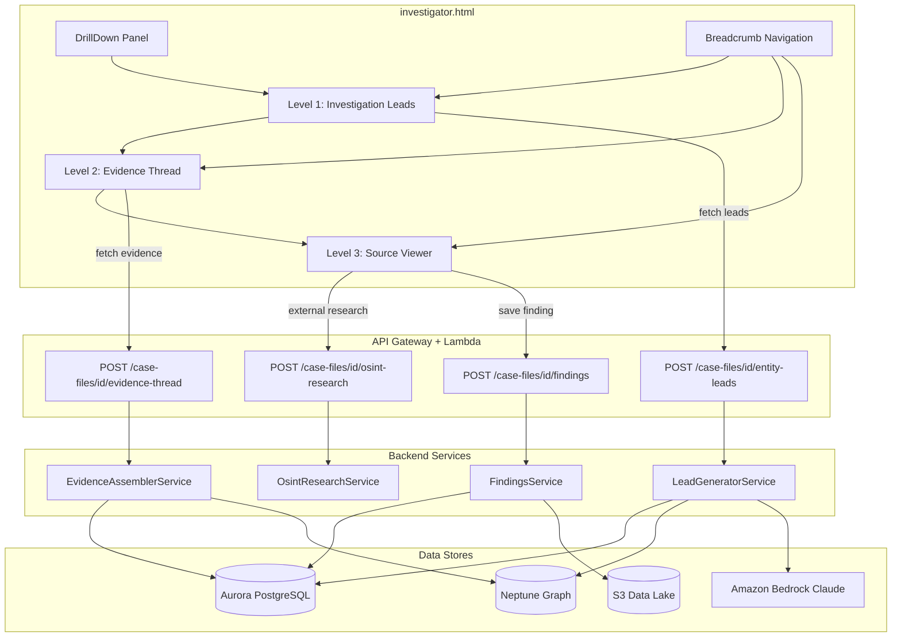

# Design Document: Investigative Findings Drilldown

## Overview

This feature replaces the entity drill-down panel's static graph-statistics-based "⚡ KEY INSIGHTS" section with a 3-level progressive investigation funnel powered by AI-generated narrative leads. The architecture introduces two new backend services (LeadGeneratorService, EvidenceAssemblerService) exposed via two new API endpoints, and a frontend rewrite of the DrillDown panel's insights section into a stateful, breadcrumb-navigated 3-level experience.

The three levels are:
1. **Level 1 — Investigation Leads**: AI-generated narrative leads (3–7 per entity) replacing graph statistics
2. **Level 2 — Evidence Thread**: Supporting documents, entity timeline, focused relationship map for a selected lead
3. **Level 3 — Source Documents**: Document excerpts with highlighted passages, OSINT button, and "Save to Case" action

The design reuses existing infrastructure: Amazon Bedrock Claude for lead generation, Aurora PostgreSQL for document/entity queries, Neptune for graph traversal, the existing FindingsService for persistence, and the existing OSINT Research Agent for external research.

## Architecture



## Components and Interfaces

### 1. LeadGeneratorService (new: `src/services/lead_generator_service.py`)

Generates 3–7 narrative investigation leads for an entity by gathering context from Aurora (documents, entities), Neptune (graph neighborhood, centrality), and the existing PatternDiscoveryService, then synthesizing via Bedrock Claude.

```python
class LeadGeneratorService:
    def __init__(self, aurora_cm, bedrock_client, neptune_endpoint, neptune_port, pattern_svc=None):
        ...

    def generate_leads(self, case_id: str, entity_name: str, entity_type: str,
                       neighbors: Optional[List[dict]] = None,
                       doc_excerpts: Optional[List[str]] = None) -> List[InvestigationLead]:
        """
        1. Query Aurora for documents mentioning entity_name
        2. Query Neptune for 2-hop neighborhood, degree centrality
        3. Query PatternDiscoveryService for patterns involving this entity
        4. Build a Bedrock prompt with all context
        5. Parse structured JSON response into InvestigationLead objects
        6. Assign lead_type and confidence from AI response
        7. Sort by confidence descending
        Returns 3–7 InvestigationLead objects.
        """

    def _generate_fallback_leads(self, entity_name: str, entity_type: str,
                                  neighbors: list, doc_count: int) -> List[InvestigationLead]:
        """Generate 2+ fallback leads from graph statistics with narrative framing
        when Bedrock invocation fails."""
```

### 2. EvidenceAssemblerService (new: `src/services/evidence_assembler_service.py`)

Assembles the evidence thread for a selected lead: retrieves relevant documents with key quotes, builds an entity mention timeline, and extracts focused relationship edges.

```python
class EvidenceAssemblerService:
    def __init__(self, aurora_cm, neptune_endpoint, neptune_port):
        ...

    def assemble_evidence(self, case_id: str, lead_id: str,
                          entity_names: List[str], lead_type: str,
                          narrative: str) -> EvidenceThread:
        """
        1. Query Aurora for documents containing any of entity_names
        2. Extract key quotes (up to 200 chars) from each document
        3. Score document relevance to the lead narrative
        4. Build chronological timeline of entity mentions
        5. Query Neptune for relationship edges between entity_names
        6. Cap at 20 documents, 30 entities
        Returns EvidenceThread with documents, entities, timeline, relationship_edges.
        """
```

### 3. API Handlers (new routes in `src/lambdas/api/investigator_analysis.py`)

Two new routes added to the existing investigator_analysis dispatch:

| Route | Method | Handler |
|-------|--------|---------|
| `/case-files/{id}/entity-leads` | POST | `entity_leads_handler` |
| `/case-files/{id}/evidence-thread` | POST | `evidence_thread_handler` |

Both handlers follow the existing pattern: extract case_id from pathParameters, parse JSON body, validate required fields, call service, return JSON response.

### 4. Frontend DrillDown Panel Rewrite (in `src/frontend/investigator.html`)

The existing `DrillDown` object is extended with:

- `DrillDown.drilldownStack` — navigation state array `[{level, data, title}]`
- `DrillDown.renderLevel1(leads)` — replaces `_generateKeyInsights` content
- `DrillDown.renderLevel2(evidenceThread)` — evidence thread view
- `DrillDown.renderLevel3(document)` — source viewer with highlights
- `DrillDown.breadcrumb()` — renders clickable breadcrumb from stack
- Slide animations via CSS transitions (300ms horizontal slide)

The existing `_generateKeyInsights` call in `openEntity` is replaced with an async call to `POST /case-files/{id}/entity-leads`, rendering Level 1 leads in the same DOM location.

### 5. Routing Integration (in `src/lambdas/api/case_files.py`)

Add path matching for `/entity-leads` and `/evidence-thread` to route to `investigator_analysis.dispatch_handler`, alongside existing routes like `/investigator-analysis`, `/entity-neighborhood`, etc.

## Data Models

### InvestigationLead

```python
@dataclass
class InvestigationLead:
    lead_id: str                    # UUID
    narrative: str                  # AI-generated narrative sentence
    lead_type: str                  # One of: temporal_gap, cross_case_link, entity_cluster,
                                    #         document_pattern, financial_anomaly,
                                    #         geographic_convergence, relationship_anomaly
    confidence: float               # 0.0–1.0
    supporting_entity_names: List[str]
    document_count: int
    date_range: Optional[str]       # e.g., "1945-1969"
```

### EvidenceThread

```python
@dataclass
class EvidenceThread:
    documents: List[EvidenceDocument]    # max 20
    entities: List[EvidenceEntity]       # max 30
    timeline: List[TimelineEntry]
    relationship_edges: List[RelationshipEdge]

@dataclass
class EvidenceDocument:
    doc_id: str
    filename: str
    excerpt: str                         # full text excerpt
    key_quotes: List[str]                # up to 200 chars each
    relevance_score: float               # 0.0–1.0

@dataclass
class EvidenceEntity:
    name: str
    type: str
    mention_count: int

@dataclass
class TimelineEntry:
    date: str
    event_description: str
    source_doc: str

@dataclass
class RelationshipEdge:
    source: str
    target: str
    relationship_type: str
    weight: float
```

### Frontend Navigation State

```javascript
// DrillDown.drilldownStack entry
{
    level: 1 | 2 | 3,
    title: "Investigation Leads" | lead.narrative | doc.filename,
    data: { /* level-specific cached data */ },
    entityName: "Von Braun",
    entityType: "person"
}
```

### API Request/Response Schemas

**POST /case-files/{id}/entity-leads**
```json
// Request
{
    "entity_name": "Wernher von Braun",
    "entity_type": "person",
    "neighbors": [{"name": "NASA", "type": "organization"}],
    "doc_excerpts": ["Von Braun led the development of..."]
}
// Response
{
    "leads": [
        {
            "lead_id": "uuid",
            "narrative": "Von Braun appears in 14 documents spanning 1945-1969, with unexplained gaps in 1947-1949 that coincide with classified Operation Paperclip activities",
            "lead_type": "temporal_gap",
            "confidence": 0.87,
            "supporting_entity_names": ["NASA", "Operation Paperclip", "V-2 Rocket"],
            "document_count": 14,
            "date_range": "1945-1969"
        }
    ]
}
```

**POST /case-files/{id}/evidence-thread**
```json
// Request
{
    "lead_id": "uuid",
    "entity_names": ["Wernher von Braun", "NASA", "Operation Paperclip"],
    "lead_type": "temporal_gap",
    "narrative": "Von Braun appears in 14 documents..."
}
// Response
{
    "documents": [...],
    "entities": [...],
    "timeline": [...],
    "relationship_edges": [...]
}
```


## Correctness Properties

*A property is a characteristic or behavior that should hold true across all valid executions of a system — essentially, a formal statement about what the system should do. Properties serve as the bridge between human-readable specifications and machine-verifiable correctness guarantees.*

### Property 1: Lead count bounds

*For any* valid entity context (entity_name, entity_type, neighbors, doc_excerpts), the LeadGeneratorService SHALL return between 3 and 7 InvestigationLead items inclusive.

**Validates: Requirements 1.1**

### Property 2: Lead field value constraints

*For any* InvestigationLead produced by the LeadGeneratorService, the lead_type SHALL be one of {temporal_gap, cross_case_link, entity_cluster, document_pattern, financial_anomaly, geographic_convergence, relationship_anomaly} AND the confidence SHALL be a float in the range [0.0, 1.0].

**Validates: Requirements 1.4, 1.5**

### Property 3: Lead narrative contains entity context

*For any* InvestigationLead produced by the LeadGeneratorService given an entity context, the narrative field SHALL be non-empty and SHALL contain at least one entity name from the input context (entity_name or supporting entities).

**Validates: Requirements 1.2**

### Property 4: Confidence-to-color mapping

*For any* confidence value in [0.0, 1.0], the priority color mapping function SHALL return red when confidence >= 0.8, amber when confidence >= 0.5 and < 0.8, and green when confidence < 0.5.

**Validates: Requirements 2.1**

### Property 5: Leads sorted by confidence descending

*For any* list of InvestigationLead items returned by the LeadGeneratorService, for all consecutive pairs (leads[i], leads[i+1]), leads[i].confidence >= leads[i+1].confidence.

**Validates: Requirements 2.3**

### Property 6: Evidence documents match queried entities

*For any* EvidenceThread returned by the EvidenceAssemblerService for a set of entity_names, every document in the response SHALL contain at least one mention of an entity from the queried entity_names set.

**Validates: Requirements 3.1**

### Property 7: Key quote length cap

*For any* EvidenceDocument in an EvidenceThread response, every string in key_quotes SHALL have length <= 200 characters.

**Validates: Requirements 3.2**

### Property 8: Timeline chronological order

*For any* EvidenceThread returned by the EvidenceAssemblerService, the timeline entries SHALL be sorted in chronological order by date.

**Validates: Requirements 3.3**

### Property 9: Evidence thread response caps

*For any* EvidenceThread returned by the EvidenceAssemblerService, len(documents) <= 20 AND len(entities) <= 30.

**Validates: Requirements 6.4**

### Property 10: Fallback leads on Bedrock failure

*For any* valid entity context where the Bedrock invocation fails, the LeadGeneratorService SHALL return at least 2 fallback InvestigationLead items with valid lead_type and confidence fields.

**Validates: Requirements 5.4**

### Property 11: OSINT button absent at non-source levels

*For any* drilldown state at Level 1 or Level 2, the rendered HTML SHALL NOT contain the OSINT research button element.

**Validates: Requirements 8.2**

## Error Handling

| Scenario | Handling |
|----------|----------|
| Bedrock invocation timeout/failure | LeadGeneratorService returns 2+ fallback leads generated from graph statistics with narrative framing (Req 5.4). Frontend shows leads with a "⚠ AI-generated leads unavailable — showing graph-based leads" banner. |
| Neptune graph query failure | LeadGeneratorService falls back to Aurora-only queries (documents + entities table). EvidenceAssemblerService returns empty relationship_edges array. |
| Aurora connection failure | Both services return HTTP 500 with descriptive error. Frontend shows "Unable to load investigation leads — please retry." |
| Missing entity_name in request | HTTP 400 with `{"error_code": "VALIDATION_ERROR", "message": "Missing required field: entity_name"}` |
| Missing required fields in evidence-thread request | HTTP 400 with descriptive message listing missing fields |
| No documents found for entity | LeadGeneratorService generates leads from graph connections only. EvidenceAssemblerService returns empty documents array with entities and relationships still populated. |
| Evidence thread exceeds 5s budget | EvidenceAssemblerService returns partial results (whatever was gathered within budget) with a `partial: true` flag. |
| OSINT research failure at Level 3 | Existing OSINT error handling applies — retry button shown inline. |
| Save to Case failure | Frontend shows inline error with retry option. Finding is not lost — user can retry. |

## Testing Strategy

### Unit Tests (example-based)

- **LeadGeneratorService**: Test with known entity contexts, verify response structure, test missing field validation (400 errors), test Bedrock failure fallback path
- **EvidenceAssemblerService**: Test with known document sets, verify key quote extraction, test empty results handling, test response cap enforcement
- **API handlers**: Test routing, request validation, error responses
- **Frontend rendering**: Test breadcrumb generation, Level 1/2/3 HTML output, color mapping, OSINT button placement

### Property-Based Tests (using Hypothesis for Python)

Property-based tests will use the `hypothesis` library with minimum 100 iterations per property. Each test will be tagged with the corresponding design property.

- **Property 1–3, 5, 10**: Test LeadGeneratorService with generated entity contexts (random entity names, types, neighbor lists, document excerpts). Mock Bedrock to return structured JSON. Verify count bounds, field constraints, narrative content, sort order, and fallback behavior.
- **Property 4**: Test the confidence-to-color mapping pure function with random floats in [0.0, 1.0].
- **Property 6–9**: Test EvidenceAssemblerService with generated entity name sets and mock Aurora/Neptune responses. Verify document matching, quote length caps, timeline ordering, and response size caps.
- **Property 11**: Test frontend render functions for Level 1 and Level 2 states, verify OSINT button absence.

### Integration Tests

- End-to-end API test: POST to `/entity-leads` with real case data, verify response schema
- End-to-end API test: POST to `/evidence-thread` with real lead data, verify response schema
- Save to Case flow: POST finding via `/findings`, verify persistence in Aurora
- OSINT trigger from Level 3: POST to `/osint-research` with drilldown context, verify research card returned
