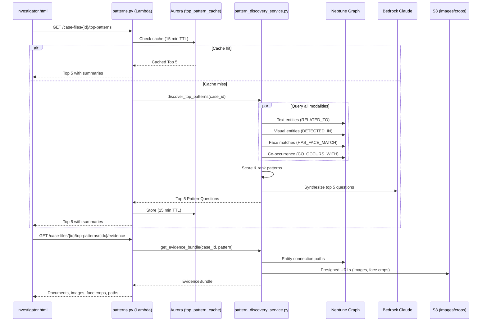

# Design Document: Investigative Patterns (Top 5)

## Overview

This feature extends the existing pattern discovery pipeline to combine multi-modal intelligence — text entities, visual labels, face matches, and document co-occurrence — into a ranked list of 5 investigative questions. Each question is synthesized by Bedrock Claude from Neptune graph evidence and presented in a progressive disclosure UI (collapsed → summary → detail).

The design extends three existing modules:
- `src/services/pattern_discovery_service.py` — new `discover_top_patterns()` method querying all four Neptune edge types
- `src/lambdas/api/patterns.py` — new `GET /case-files/{id}/top-patterns` and `GET /case-files/{id}/top-patterns/{pattern_index}/evidence` endpoints
- `src/frontend/investigator.html` — new Top 5 Patterns panel with progressive disclosure

Key constraints:
- API Gateway 29s timeout (lessons-learned Issue 1) — Top 5 generation must complete within 25s
- Neptune graph has 34 visual entity types, 23,464 DETECTED_IN edges, 152 CO_OCCURS_WITH edges, 8 face matches
- Must EXTEND existing code, never overwrite (lessons-learned critical rule)
- 15-minute Aurora cache to avoid redundant Neptune + Bedrock calls

## Architecture



### Component Interaction

The Top 5 feature sits on top of the existing pattern discovery infrastructure. The new `discover_top_patterns()` method in `PatternDiscoveryService` queries four Neptune edge types in parallel (using sequential HTTP calls within the 25s budget), scores each candidate pattern using a composite formula, then calls Bedrock to synthesize the top 5 into investigative questions.

The frontend uses a three-state interaction model per pattern: collapsed (question text + badges), summary (AI explanation + counts), and detail (full evidence bundle with documents, images, face crops). Only the detail state triggers an additional API call.

## Components and Interfaces

### 1. PatternDiscoveryService Extension (Backend)

New methods added to `src/services/pattern_discovery_service.py`:

```python
class PatternDiscoveryService:
    # ... existing methods unchanged ...

    def discover_top_patterns(self, case_id: str) -> TopPatternReport:
        """Query all four modalities, score, rank, synthesize top 5 questions."""

    def _query_text_entity_patterns(self, case_id: str) -> list[RawPattern]:
        """Query RELATED_TO edges for text entity centrality and clusters."""

    def _query_visual_entity_patterns(self, case_id: str) -> list[RawPattern]:
        """Query DETECTED_IN edges for visual label co-occurrence patterns."""

    def _query_face_match_patterns(self, case_id: str) -> list[RawPattern]:
        """Query HAS_FACE_MATCH edges for person-face connections."""

    def _query_cooccurrence_patterns(self, case_id: str) -> list[RawPattern]:
        """Query CO_OCCURS_WITH edges for cross-document entity co-occurrence."""

    def _score_pattern(self, pattern: RawPattern) -> float:
        """Composite score: evidence_strength * cross_modal * novelty."""

    def _synthesize_questions(self, case_id: str, patterns: list[RawPattern]) -> list[PatternQuestion]:
        """Call Bedrock Claude to convert top patterns into investigative questions."""

    def get_evidence_bundle(self, case_id: str, pattern: PatternQuestion) -> EvidenceBundle:
        """Fetch detailed evidence: doc excerpts, presigned image URLs, face crops, entity paths."""
```

### 2. API Handler Extension (Lambda)

New routes added to `src/lambdas/api/patterns.py`, dispatched via `case_files.py`:

| Method | Path | Description |
|--------|------|-------------|
| GET | `/case-files/{id}/top-patterns` | Returns Top 5 PatternQuestions with summaries |
| GET | `/case-files/{id}/top-patterns/{pattern_index}/evidence` | Returns EvidenceBundle for pattern N (1-5) |

### 3. Frontend Extension (investigator.html)

New section added above the entity graph in `investigator.html`:

- Top 5 Patterns panel with numbered list
- Three-state progressive disclosure per pattern (collapsed → summary → detail)
- Evidence modality icons (📄 text, 📷 visual, 👤 face, 🔗 co-occurrence)
- "Strong Corroboration" / "Single Source" badges
- Thumbnail gallery for images and face crops in detail view
- Clickable entity names that scroll to the entity graph
- Clickable document names that trigger existing download flow

### 4. Cache Layer (Aurora)

New `top_pattern_cache` table in Aurora for 15-minute TTL caching:

```sql
CREATE TABLE IF NOT EXISTS top_pattern_cache (
    case_file_id UUID NOT NULL,
    cached_at TIMESTAMPTZ NOT NULL DEFAULT now(),
    top_patterns JSONB NOT NULL,
    PRIMARY KEY (case_file_id)
);
```

## Data Models

### New Models (added to `src/models/pattern.py`)

```python
class EvidenceModality(str, Enum):
    TEXT = "text"
    VISUAL = "visual"
    FACE = "face"
    COOCCURRENCE = "cooccurrence"

class RawPattern(BaseModel):
    """Intermediate pattern before AI synthesis."""
    entities: list[dict]                    # [{name, type, role}]
    modalities: list[EvidenceModality]      # Which evidence types support this
    source_documents: list[str]             # Document IDs
    source_images: list[str]               # S3 keys for supporting images
    face_crops: list[dict]                 # [{crop_s3_key, entity_name, similarity}]
    evidence_strength: float               # Number of supporting sources normalized
    cross_modal_score: float               # 0-1 based on modality count
    novelty_score: float                   # 0-1 based on unexpected connections
    composite_score: float = 0.0           # Computed: strength * cross_modal * novelty

class PatternQuestion(BaseModel):
    """A single investigative question with summary data."""
    index: int                             # 1-5 priority rank
    question: str                          # Natural language investigative question
    confidence: int                        # 0-100 percentage
    modalities: list[EvidenceModality]     # Supporting evidence types
    summary: str                           # 2-3 sentence AI explanation
    document_count: int                    # Number of supporting documents
    image_count: int                       # Number of supporting images
    raw_pattern: RawPattern                # Underlying pattern data

class EvidenceBundle(BaseModel):
    """Detailed evidence for a single pattern (fetched on second click)."""
    documents: list[dict]                  # [{document_id, filename, excerpt, download_url}]
    images: list[dict]                     # [{s3_key, presigned_url, visual_labels}]
    face_crops: list[dict]                 # [{presigned_url, entity_name, similarity}]
    entity_paths: list[dict]               # [{from_entity, to_entity, path_nodes}]
    cooccurring_labels: list[str]          # Visual labels that co-occur

class TopPatternReport(BaseModel):
    """Top 5 investigative patterns response."""
    case_file_id: str
    patterns: list[PatternQuestion]        # Exactly 5 (or fewer with explanation)
    generated_at: str                      # ISO timestamp
    fewer_patterns_explanation: str = ""   # Set if < 5 patterns found
```

### Scoring Formula

```
composite_score = evidence_strength × cross_modal_bonus × novelty_score

where:
  evidence_strength = min(1.0, supporting_source_count / 10)
  cross_modal_bonus = {1 modality: 0.5, 2: 0.75, 3: 0.9, 4: 1.0}
  novelty_score = min(1.0, unexpected_connection_count / 5)
```

### Neptune Query Strategy (within 25s budget)

| Query | Edge Type | Node Labels | Time Budget |
|-------|-----------|-------------|-------------|
| Text centrality | RELATED_TO | Entity_{case_id} | ~5s |
| Visual co-occurrence | DETECTED_IN | VisualEntity_{case_id} | ~5s |
| Face matches | HAS_FACE_MATCH | FaceCrop_{case_id} → Entity_{case_id} | ~3s |
| Document co-occurrence | CO_OCCURS_WITH | VisualEntity_{case_id} | ~3s |
| Bedrock synthesis | — | — | ~8s |
| Cache write | — | — | ~1s |


## Correctness Properties

*A property is a characteristic or behavior that should hold true across all valid executions of a system — essentially, a formal statement about what the system should do. Properties serve as the bridge between human-readable specifications and machine-verifiable correctness guarantees.*

### Property 1: Multi-modal query coverage

*For any* case with entities across all four modalities (text, visual, face, co-occurrence), calling `discover_top_patterns` should return at least one pattern whose `modalities` list contains entries from each modality present in the graph data.

**Validates: Requirements 1.1**

### Property 2: Composite score computation

*For any* RawPattern with `evidence_strength` in [0,1], `cross_modal_score` in [0,1], and `novelty_score` in [0,1], the `composite_score` should equal `evidence_strength × cross_modal_score × novelty_score`.

**Validates: Requirements 1.2**

### Property 3: Ranking order invariant

*For any* TopPatternReport, the patterns list should be sorted in descending order of `composite_score`, and each pattern's `index` should equal its 1-based position in the list.

**Validates: Requirements 1.3, 1.4**

### Property 4: Output size constraint

*For any* case with N discoverable patterns where N >= 5, `discover_top_patterns` should return exactly 5 PatternQuestions. For any case with N < 5 patterns, it should return exactly N PatternQuestions and `fewer_patterns_explanation` should be non-empty.

**Validates: Requirements 1.4, 1.5**

### Property 5: PatternQuestion structural completeness

*For any* PatternQuestion in a TopPatternReport, the `question` field should be a non-empty string, `confidence` should be an integer in [0, 100], and `modalities` should be a non-empty list of valid EvidenceModality values.

**Validates: Requirements 2.1, 2.3**

### Property 6: Bedrock prompt context completeness

*For any* RawPattern with entities containing names and types across multiple modalities, the prompt sent to Bedrock should contain every entity name and every entity type from the pattern's entities list.

**Validates: Requirements 2.2**

### Property 7: Fallback question on Bedrock failure

*For any* RawPattern, when Bedrock is unavailable, the synthesized PatternQuestion should contain a non-empty question string matching the template format "Investigate the connection between [Entity A] and [Entity B] found in [N] documents with [modalities] evidence."

**Validates: Requirements 2.4**

### Property 8: EvidenceBundle structural completeness

*For any* valid pattern index (1-5) and case with evidence data, the returned EvidenceBundle should contain: a `documents` list where each entry has `document_id`, `filename`, `excerpt`, and `download_url`; an `images` list where each entry has `presigned_url` and `visual_labels`; a `face_crops` list where each entry has `presigned_url` and `entity_name`.

**Validates: Requirements 4.2**

### Property 9: Corroboration classification

*For any* PatternQuestion, if `len(modalities) >= 3` then the corroboration level should be "strong", if `len(modalities) == 2` then "moderate", and if `len(modalities) == 1` then "single_source".

**Validates: Requirements 6.2, 6.3**

### Property 10: Cache consistency

*For any* case, calling the Top 5 endpoint twice within 15 minutes should return identical results (same pattern questions, same ordering, same confidence scores) without triggering a second Neptune/Bedrock query.

**Validates: Requirements 7.3**

## Error Handling

| Error Scenario | Handling Strategy |
|---|---|
| Neptune query timeout (>5s per query) | Return partial results from completed queries; log warning. Patterns from timed-out modalities are excluded. |
| Bedrock unavailable or timeout | Use fallback template: "Investigate the connection between [Entity A] and [Entity B] found in [N] documents with [modalities] evidence." Set confidence to 50. |
| Fewer than 5 patterns discoverable | Return available patterns (0-4) with `fewer_patterns_explanation` describing which modalities had insufficient data. |
| S3 presigned URL generation failure | Return EvidenceBundle with empty `images`/`face_crops` lists; include error message in response metadata. |
| Aurora cache write failure | Log error, return results without caching. Next request will regenerate. |
| Invalid pattern_index (not 1-5) | Return 400 with message "Pattern index must be between 1 and 5." |
| Case not found | Return 404 via existing case_files.py error handling. |
| API Gateway 29s timeout approaching | The 25s budget includes a 4s safety margin. If Neptune queries exceed 15s total, skip Bedrock synthesis and use fallback templates for all 5 questions. |

## Testing Strategy

### Unit Tests

Unit tests verify specific examples and edge cases using mocked dependencies (Neptune, Aurora, Bedrock, S3):

- Test `discover_top_patterns` with a case that has all four modalities → returns 5 questions
- Test `discover_top_patterns` with empty graph → returns 0 patterns with explanation
- Test `discover_top_patterns` with only text entities → returns patterns with single "text" modality
- Test `_score_pattern` with known inputs → verify composite score calculation
- Test `_synthesize_questions` with Bedrock mock → verify question format
- Test `_synthesize_questions` with Bedrock failure → verify fallback template
- Test `get_evidence_bundle` → verify presigned URLs, document excerpts, face crops
- Test cache hit path → verify no Neptune/Bedrock calls on second request
- Test cache expiry → verify regeneration after 15 minutes
- Test API handler routing for new endpoints in `case_files.py`
- Test corroboration badge logic for 1, 2, 3, 4 modalities

### Property-Based Tests

Property-based tests use `hypothesis` (Python PBT library) with minimum 100 iterations per property. Each test references its design document property.

- **Feature: investigative-patterns, Property 2: Composite score computation** — Generate random evidence_strength, cross_modal_score, novelty_score floats in [0,1] and verify composite_score = product.
- **Feature: investigative-patterns, Property 3: Ranking order invariant** — Generate random lists of PatternQuestions with random composite scores, run the ranking function, verify descending order and correct index assignment.
- **Feature: investigative-patterns, Property 4: Output size constraint** — Generate random numbers of discoverable patterns (0-20), verify output size is min(5, N) and explanation is set when N < 5.
- **Feature: investigative-patterns, Property 5: PatternQuestion structural completeness** — Generate random PatternQuestions from the synthesis pipeline, verify question non-empty, confidence in [0,100], modalities non-empty.
- **Feature: investigative-patterns, Property 7: Fallback question on Bedrock failure** — Generate random RawPatterns, simulate Bedrock failure, verify fallback question matches template format with correct entity names and document count.
- **Feature: investigative-patterns, Property 9: Corroboration classification** — Generate random modality lists of length 1-4, verify classification matches the rules (1=single_source, 2=moderate, 3+=strong).

### Test Configuration

- Library: `hypothesis` (already available in Python ecosystem)
- Minimum iterations: 100 per property test
- Test file: `tests/unit/test_top_patterns_service.py`
- Each property test tagged with comment: `# Feature: investigative-patterns, Property N: <title>`
