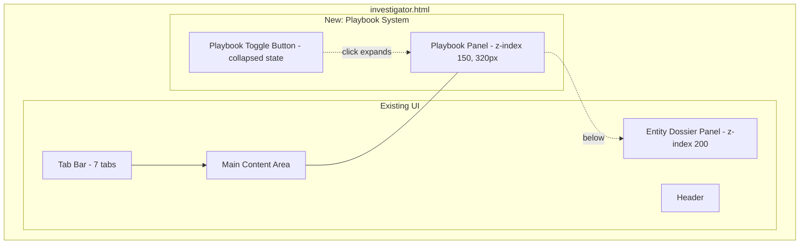
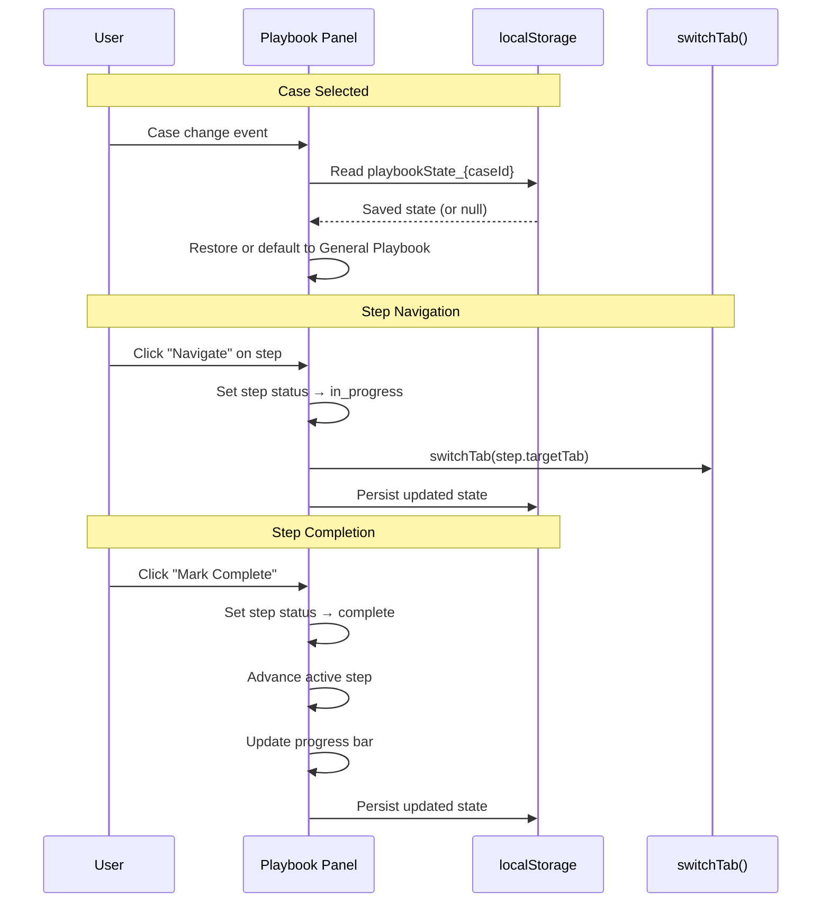

# Design Document: Investigative Playbooks

## Overview

This feature adds a collapsible sidebar panel to the investigator.html single-page application that guides investigators through step-by-step workflows modeled after Palantir Gotham's Investigation Playbooks. The panel sits on the right side of the screen at z-index 150 (below the Entity Dossier at z-index 200), is 320px wide, and contains a playbook template selector, progress bar, and an ordered list of steps with navigation actions, completion tracking, notes, and localStorage persistence per case.

This is a purely frontend feature — no backend changes, no new API endpoints. All playbook templates are hardcoded JavaScript objects. Step "Navigate" actions call the existing `switchTab()` function. State is persisted in `localStorage['playbookState_' + caseId]`.

The implementation follows existing patterns: inline CSS in the `<style>` block, inline JavaScript in `<script>` blocks, the `esc()` helper for escaping, and the same dark theme colors (#1a2332 background, #2d3748 borders, #48bb78 accent).

## Architecture

### Component Layout



### Panel Positioning Strategy

The Playbook Panel is a `position: fixed` element on the right side. When expanded, the main content area (`ops-main`) gets a `margin-right: 320px` to avoid overlap. When collapsed, the margin is removed and only the toggle button is visible.

```
┌──────────────────────────────────────────────────────────┐
│ Header                                                    │
├──────────────────────────────────────────────────────────┤
│ Tab Bar                                                   │
├──────────────────────────────────────────┬───────────────┤
│                                          │  Playbook     │
│  Main Content Area                       │  Panel        │
│  (ops-main + ops-sidebar)                │  320px        │
│                                          │  z-index:150  │
│                                          │               │
│                                          │  [Selector]   │
│                                          │  [Progress]   │
│                                          │  [Steps...]   │
│                                          │               │
└──────────────────────────────────────────┴───────────────┘
```

When Entity Dossier opens (z-index 200), it renders above the Playbook Panel:

```
┌──────────────────────────────────────────────────────────┐
│                          Entity Dossier (z-index 200)     │
│                          ┌───────────────────────────────┤
│  Main Content            │  Dossier content (720px)      │
│                          │  covers Playbook Panel        │
│                          │                               │
└──────────────────────────┴───────────────────────────────┘
```

### State Flow



## Components and Interfaces

### 1. Playbook Panel (`#playbookPanel`)

A fixed-position sidebar on the right side of the screen.

```javascript
// Panel structure
{
    element: '#playbookPanel',          // Fixed position, right: 0, width: 320px
    zIndex: 150,                        // Below Entity Dossier (200)
    collapsed: true,                    // Default initial state
    sections: [
        'playbookSelector',             // Template dropdown
        'playbookProgress',             // Progress bar + percentage
        'playbookSteps'                 // Scrollable step list
    ]
}
```

CSS classes:
- `.playbook-panel` — the fixed sidebar container
- `.playbook-panel.collapsed` — hidden state (width: 0, overflow: hidden)
- `.playbook-toggle-btn` — the small button visible when collapsed

### 2. Playbook Toggle Button (`#playbookToggleBtn`)

A small fixed-position button on the right edge, visible when the panel is collapsed.

```javascript
// Toggle button shows: "📋 Playbook 4/10"
{
    element: '#playbookToggleBtn',
    position: 'fixed',
    right: 0,
    top: '50%',
    zIndex: 150,
    display: 'visible when panel collapsed'
}
```

### 3. Playbook Templates (hardcoded JS objects)

```javascript
const PLAYBOOK_TEMPLATES = {
    general: {
        id: 'general',
        name: 'General Investigation Playbook',
        description: 'Standard 10-step investigation workflow',
        steps: [
            { title: 'Review AI Briefing', targetTab: 'dashboard', description: '...' },
            { title: 'Triage Top Leads', targetTab: 'leadinvestigation', description: '...' },
            // ... 10 steps total
        ]
    },
    financial_fraud: { /* 10 steps */ },
    human_trafficking: { /* 10 steps */ }
};
```

### 4. Playbook State Manager

Functions for reading/writing playbook state to localStorage:

```javascript
// State shape persisted to localStorage
{
    templateId: 'general',              // Which template is active
    stepStatuses: ['complete', 'in_progress', 'pending', ...],  // Array parallel to template steps
    stepNotes: [                        // Array parallel to template steps
        { text: 'Found key connection', timestamp: '2024-01-15T10:30:00Z' },
        null,                           // No note for this step
        ...
    ],
    activeStepIndex: 2,                 // Currently highlighted step
    panelCollapsed: false               // Panel visibility state
}
```

Key functions:
- `loadPlaybookState(caseId)` — reads from `localStorage['playbookState_' + caseId]`
- `savePlaybookState(caseId)` — writes current state to localStorage
- `resetPlaybookState(templateId)` — creates fresh state for a template
- `renderPlaybookPanel()` — re-renders the entire panel from current state

### 5. Step Interaction Functions

```javascript
// Step actions
function playbookNavigate(stepIndex)    // switchTab + set in_progress
function playbookComplete(stepIndex)    // set complete + advance active
function playbookSkip(stepIndex)        // set skipped + advance active
function playbookAddNote(stepIndex)     // show note input
function playbookSaveNote(stepIndex)    // persist note text + timestamp
function playbookToggleStep(stepIndex)  // expand/collapse step detail (accordion)
```

### 6. Panel Toggle and Keyboard Shortcut

```javascript
function togglePlaybookPanel()          // expand/collapse panel
// Keyboard: Ctrl+Shift+P (Cmd+Shift+P on Mac)
document.addEventListener('keydown', function(e) {
    if ((e.ctrlKey || e.metaKey) && e.shiftKey && e.key === 'P') {
        e.preventDefault();
        togglePlaybookPanel();
    }
});
```

### 7. Integration with Case Selection

The playbook panel listens for case changes. When a new case is selected (existing `selectCase()` function), the playbook state is loaded from localStorage for that case. This is done by adding a call to `loadPlaybookForCase(caseId)` at the end of the existing case selection flow.

## Data Models

### Playbook Template Schema (hardcoded JS)

```javascript
{
    id: 'string',                       // Template identifier (e.g., 'general')
    name: 'string',                     // Display name
    description: 'string',             // Short description
    steps: [
        {
            title: 'string',            // Step title (e.g., 'Review AI Briefing')
            description: 'string',      // Detailed instruction text
            targetTab: 'string|null'    // Tab identifier for switchTab(), null if no navigation
        }
    ]
}
```

### Playbook State Schema (localStorage)

```javascript
// Key: 'playbookState_' + caseId
// Value: JSON string of:
{
    templateId: 'string',               // Active template ID
    stepStatuses: ['string'],           // 'pending' | 'in_progress' | 'complete' | 'skipped'
    stepNotes: [                        // Parallel array, null for no note
        { text: 'string', timestamp: 'string' } | null
    ],
    activeStepIndex: 'number',          // 0-based index of active step
    panelCollapsed: 'boolean'           // Panel visibility
}
```

### Step Status Enum

| Status | Icon | Color | Description |
|--------|------|-------|-------------|
| `pending` | ○ (circle outline) | #718096 (gray) | Not started |
| `in_progress` | ● (filled circle) | #4299e1 (blue) | Currently working |
| `complete` | ✓ (checkmark) | #48bb78 (green) | Done |
| `skipped` | — (dash) | #718096 (gray) | Intentionally skipped |

### Progress Calculation

```javascript
progressPercent = Math.round(
    (stepStatuses.filter(s => s === 'complete' || s === 'skipped').length / stepStatuses.length) * 100
);
```


## Correctness Properties

*A property is a characteristic or behavior that should hold true across all valid executions of a system — essentially, a formal statement about what the system should do. Properties serve as the bridge between human-readable specifications and machine-verifiable correctness guarantees.*

### Property 1: Progress calculation correctness

*For any* array of step statuses (each being one of `pending`, `in_progress`, `complete`, or `skipped`), the computed progress percentage shall equal `Math.round((count of 'complete' + count of 'skipped') / total steps * 100)`, and the toggle button N/M text shall show N = count of `complete` steps and M = total steps.

**Validates: Requirements 1.4, 5.3, 7.2, 7.3, 7.4**

### Property 2: Template switch resets all state

*For any* playbook template selection (general, financial_fraud, or human_trafficking), switching to that template shall produce a state where all step statuses are `pending`, all step notes are `null`, the active step index is 0, and the progress is 0%. The resulting state shall be persisted to localStorage, replacing any previous state for that case.

**Validates: Requirements 2.3, 2.4, 14.2, 14.3**

### Property 3: Playbook state persistence round-trip

*For any* valid playbook state (containing a templateId, an array of step statuses, an array of step notes with timestamps, an active step index, and a panel collapsed flag), saving to `localStorage['playbookState_' + caseId]` and then loading from the same key shall produce an equivalent state object with all fields preserved.

**Validates: Requirements 2.5, 8.1, 8.2, 8.3, 15.2**

### Property 4: Step rendering includes number, title, and correct status icon

*For any* playbook template and *for any* step within that template with *any* valid status, the rendered step HTML shall contain the step number (1-based), the step title text, and the correct status icon: circle outline for `pending`, blue filled circle for `in_progress`, green checkmark for `complete`, gray dash for `skipped`.

**Validates: Requirements 3.1, 3.2**

### Property 5: Accordion — only one step expanded at a time

*For any* two distinct step indices in a playbook, if step A is expanded and then step B is clicked to expand, step A shall be collapsed (hidden) and step B shall be expanded (visible). At most one step detail section is visible at any time.

**Validates: Requirements 3.5**

### Property 6: Navigate action calls switchTab and updates status

*For any* playbook step that has a non-null `targetTab`, clicking Navigate shall call `switchTab(step.targetTab)`, set the step as the active step, and if the step's status was `pending`, change it to `in_progress`. If the step's status was already `in_progress`, `complete`, or `skipped`, the status shall remain unchanged.

**Validates: Requirements 4.1, 4.2, 4.3**

### Property 7: Complete and Skip advance active step to next actionable step

*For any* step at index `i` in a playbook, marking it complete shall set its status to `complete`, and skipping it shall set its status to `skipped`. In both cases, the active step index shall advance to the next step whose status is `pending` or `in_progress`. If no such step exists (all remaining are complete or skipped), the active step index shall remain at `i`.

**Validates: Requirements 5.1, 5.2**

### Property 8: Note persistence round-trip

*For any* step index and *any* non-empty note text, saving a note to that step shall store the text and a timestamp in the playbook state, persist to localStorage, and when the state is reloaded, the note text and timestamp shall be present and unchanged for that step.

**Validates: Requirements 6.2, 6.3**

## Error Handling

### localStorage Failures

| Scenario | Behavior |
|----------|----------|
| `localStorage.setItem` throws (quota exceeded, private browsing) | Catch error, continue with in-memory state, show brief warning toast: "⚠ Progress may not be saved" |
| `localStorage.getItem` returns null | Default to General Investigation Playbook with all steps pending |
| `localStorage.getItem` returns malformed JSON | Catch parse error, default to General Investigation Playbook, log warning to console |
| Saved state references unknown template ID | Fall back to General Investigation Playbook, reset all steps |
| Saved state has wrong number of step statuses (template changed) | Reset to fresh state for the saved template ID |

### Panel Interaction Edge Cases

| Scenario | Behavior |
|----------|----------|
| No case selected | Show prompt: "Select a case from the Case Dashboard to start a playbook" |
| All steps complete/skipped | Show completion message: "✅ Playbook complete!" below progress bar |
| Navigate on step with null targetTab | Disable the Navigate button; show tooltip "No tab action for this step" |
| Note text is empty on save | Ignore the save, keep input open |
| Panel toggle during Entity Dossier open | Both coexist — Entity Dossier at z-index 200 renders above Playbook Panel at z-index 150 |

### Error Display Pattern

Follows the existing investigator.html pattern:

```javascript
function showPlaybookWarning(msg) {
    var el = document.getElementById('playbookWarning');
    if (el) {
        el.textContent = '⚠ ' + msg;
        el.style.display = 'block';
        setTimeout(function() { el.style.display = 'none'; }, 4000);
    }
}
```

## Testing Strategy

### Dual Testing Approach

This feature is purely frontend with no API calls. Testing focuses on:

1. **Unit tests** — Verify specific template contents (step names, target tabs, step counts), DOM structure, edge cases (no case selected, all steps complete), and keyboard shortcut behavior
2. **Property-based tests** — Verify universal behaviors across all valid inputs: progress calculation, state round-trips, step rendering, accordion behavior, navigation actions, status transitions, and note persistence

### Unit Tests

Unit tests cover specific examples and edge cases:
- General Investigation Playbook has exactly 10 steps with correct names and target tabs (Req 9.1-9.11)
- Financial Fraud Playbook has exactly 10 steps with correct names and target tabs (Req 10.1-10.10)
- Human Trafficking Playbook has exactly 10 steps with correct names and target tabs (Req 11.1-11.10)
- Playbook Panel z-index is below 200 (Req 1.2, 12.1)
- Panel starts collapsed on first load (Req 15.1)
- No-case-selected shows prompt message (Req 1.7)
- All-steps-complete shows completion message (Req 5.5)
- Ctrl+Shift+P toggles panel (Req 13.1)
- Escape key still closes Entity Dossier, not Playbook Panel (Req 13.2)
- Default template is General Investigation when no saved state (Req 8.4)
- localStorage failure shows warning but panel still works (Req 8.5)

### Property-Based Tests

Property-based tests use **fast-check** (JavaScript PBT library) with minimum 100 iterations per property.

Each property test references its design document property:

```javascript
// Feature: investigative-playbooks, Property 1: Progress calculation correctness
fc.assert(fc.property(
    fc.array(fc.constantFrom('pending', 'in_progress', 'complete', 'skipped'), { minLength: 1, maxLength: 20 }),
    (statuses) => {
        const completed = statuses.filter(s => s === 'complete').length;
        const skipped = statuses.filter(s => s === 'skipped').length;
        const expected = Math.round((completed + skipped) / statuses.length * 100);
        expect(calculateProgress(statuses)).toBe(expected);
        expect(getToggleText(statuses)).toBe(completed + '/' + statuses.length);
    }
), { numRuns: 100 });
```

Tag format: **Feature: investigative-playbooks, Property {number}: {property_text}**

### Test Configuration

- PBT library: **fast-check** (JavaScript)
- Minimum iterations: 100 per property test
- Test runner: Any JS test runner (Jest, Vitest, or standalone)
- Each correctness property is implemented by a single property-based test
- Edge cases (no case selected, localStorage failure, all steps complete) are covered by unit tests
- Since the frontend is a single HTML file with inline JS, testable functions (calculateProgress, renderStepIcon, serializeState, deserializeState, advanceActiveStep) should be extractable or tested via DOM output using jsdom

### Test File Organization

```
tests/
  frontend/
    test_playbook_templates.js         — Unit tests for template contents (Req 9, 10, 11)
    test_playbook_panel_structure.js   — Unit tests for DOM structure, z-index, edge cases
    test_playbook_progress.js          — PBT for Property 1 (progress calculation)
    test_playbook_template_switch.js   — PBT for Property 2 (template switch resets)
    test_playbook_state_roundtrip.js   — PBT for Property 3 (state persistence)
    test_playbook_step_rendering.js    — PBT for Property 4 (step rendering)
    test_playbook_accordion.js         — PBT for Property 5 (accordion behavior)
    test_playbook_navigation.js        — PBT for Property 6 (navigate action)
    test_playbook_status_advance.js    — PBT for Property 7 (complete/skip advance)
    test_playbook_notes.js             — PBT for Property 8 (note persistence)
```
