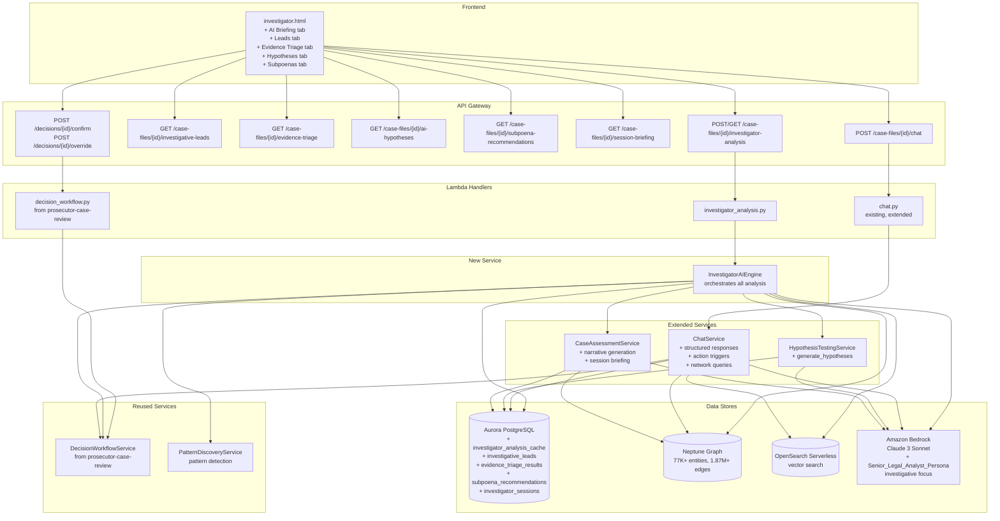
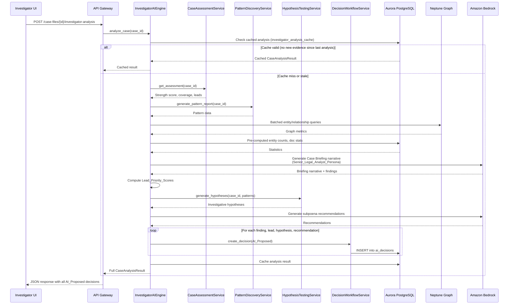
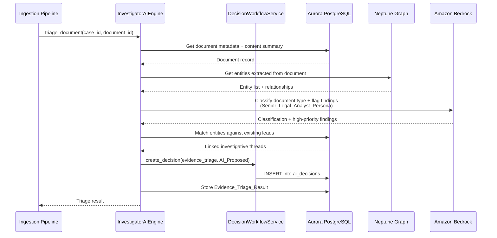
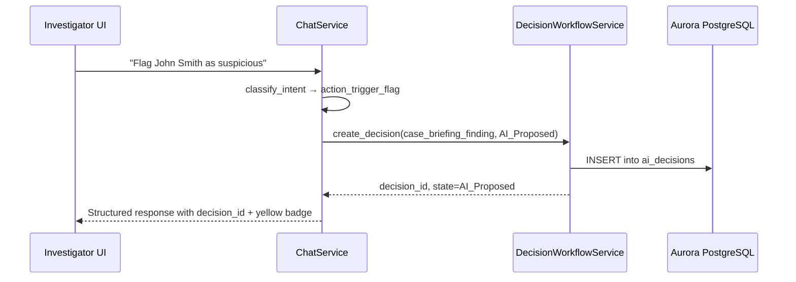

# Design Document: Investigator AI-First Module

## Overview

The Investigator AI-First module transforms the existing investigator interface into an AI-first, human-in-the-loop investigation platform. When an investigator opens a case, the system automatically analyzes all ingested evidence and presents a comprehensive Case Briefing with ranked findings, prioritized leads, evidence triage, proactive hypotheses, and subpoena recommendations. Every AI recommendation flows through the three-state Decision Workflow (AI_Proposed → Human_Confirmed / Human_Overridden) reused from the prosecutor-case-review spec.

The module focuses on the investigator's perspective — discovering leads, triaging evidence, generating hypotheses, and recommending legal process — rather than the prosecutor's focus on charging decisions and statutory element mapping. It introduces one new backend service (`investigator_ai_engine.py`), one new Lambda handler (`investigator_analysis.py`), extends three existing services (`chat_service.py`, `hypothesis_testing_service.py`, `case_assessment_service.py`), and adds five new Aurora tables for caching analysis results.

All Bedrock calls use a Senior Legal Analyst Persona with an investigative focus (seasoned federal investigative analyst) rather than the prosecution-focused AUSA persona. The system reuses the existing Neptune knowledge graph (77K+ entities, 1.87M+ edges), OpenSearch Serverless for vector search, Aurora PostgreSQL for metadata, and Amazon Bedrock (Claude) for AI analysis. It must scale to cases with 3M+ documents by querying pre-computed data rather than scanning raw content.

### Design Principles

- **Extend, don't duplicate**: Reuse DecisionWorkflowService and ai_decisions table from prosecutor-case-review; extend existing chat_service, hypothesis_testing_service, case_assessment_service, and pattern_discovery_service
- **Same infrastructure**: All new services deploy as Lambda functions behind the existing API Gateway, using the same Aurora/Neptune/OpenSearch/Bedrock stack
- **Investigator perspective**: Senior Legal Analyst Persona focuses on investigative methodology, evidence discovery, and lead development rather than prosecution charging
- **AI-first, human-final**: AI generates initial analysis; investigators confirm or override every recommendation with full audit trail
- **Scalability by design**: Query pre-computed data (pattern_reports, case_hypotheses, entity tables) rather than raw documents; paginate in batches of 1,000; async processing for 100K+ document cases

## Architecture



### Data Flow: AI Case Briefing on Load



### Data Flow: Evidence Triage on Ingestion



### Data Flow: Action Trigger from Chat



## Components and Interfaces

### 1. InvestigatorAIEngine (`src/services/investigator_ai_engine.py`)

The core orchestration service. Coordinates all analysis and delegates to existing services.

```python
class InvestigatorAIEngine:
    SENIOR_LEGAL_ANALYST_PERSONA = (
        "You are a senior federal investigative analyst with 20+ years of experience "
        "in complex multi-jurisdictional investigations. Reason using proper investigative "
        "methodology and legal terminology. Cite specific evidence documents and entity "
        "connections by name. Prioritize leads by evidentiary strength and connection density. "
        "Recommend specific investigative actions for each finding."
    )

    def __init__(
        self,
        aurora_cm,
        bedrock_client,
        neptune_endpoint: str,
        neptune_port: str = "8182",
        opensearch_endpoint: str = "",
        case_assessment_svc=None,
        hypothesis_testing_svc=None,
        pattern_discovery_svc=None,
        decision_workflow_svc=None,
    ):
        ...

    def analyze_case(self, case_id: str) -> CaseAnalysisResult:
        """Full AI analysis on case load:
        1. Check cache — return if valid
        2. Gather statistics from Aurora (pre-computed)
        3. Compute case strength + evidence coverage via CaseAssessmentService
        4. Detect patterns via PatternDiscoveryService
        5. Generate Case Briefing narrative via Bedrock
        6. Compute Lead_Priority_Scores for all entities
        7. Generate hypotheses via HypothesisTestingService
        8. Generate subpoena recommendations via Bedrock
        9. Create AI_Proposed decisions for all findings
        10. Cache result in Aurora
        Returns CaseAnalysisResult with briefing, leads, hypotheses, recommendations."""

    def compute_lead_priority_score(
        self, case_id: str, entity_name: str, entity_type: str
    ) -> float:
        """Compute Lead_Priority_Score as weighted composite:
        evidence_strength (0.30): docs_supporting / total_docs, capped at 1.0
        connection_density (0.25): degree_centrality normalized to 0-1
        novelty (0.25): 1.0 - (previously_flagged / total_evidence)
        prosecution_readiness (0.20): from existing readiness scores
        Returns score 0-100."""

    def triage_document(self, case_id: str, document_id: str) -> EvidenceTriageResult:
        """Auto-triage a newly ingested document:
        1. Classify document type via Bedrock
        2. Link entities to existing graph
        3. Flag high-priority findings
        4. Match against existing investigative leads
        5. Assess prosecution readiness impact
        6. Create AI_Proposed decisions for classification + findings"""

    def generate_subpoena_recommendations(
        self, case_id: str, evidence_gaps: list[dict], leads: list[dict]
    ) -> list[SubpoenaRecommendation]:
        """Generate subpoena/warrant recommendations from evidence gaps and leads.
        Uses Bedrock with Senior_Legal_Analyst_Persona."""

    def get_session_briefing(self, case_id: str, last_session_at: str) -> SessionBriefing:
        """Compute changes since investigator's last session:
        new findings, updated scores, new evidence, recommended actions."""

    def get_cached_analysis(self, case_id: str) -> CaseAnalysisResult | None:
        """Retrieve cached analysis from Aurora. Returns None if stale or missing."""
```

### 2. Extended ChatService (`src/services/chat_service.py` — additions)

Extends the existing ChatService with structured responses, action triggers, and network-aware queries.

```python
# New intent patterns added to INTENT_PATTERNS list:
# ("action_flag", re.compile(r"\bflag\s+(.+?)(?:\s+as\s+suspicious)?\s*$", re.I))
# ("action_create_lead", re.compile(r"\bcreate\s+lead\s+for\s+(.+)", re.I))
# ("action_gen_subpoena", re.compile(r"\bgenerate\s+subpoena\s+list\s+for\s+(.+)", re.I))
# ("network_colocation", re.compile(r"\bwho\s+else\s+was\s+at\s+(.+?)\s+on\s+(.+)", re.I))
# ("evidence_both", re.compile(r"\bwhat\s+documents?\s+mention\s+both\s+(.+?)\s+and\s+(.+)", re.I))

class ChatService:
    # ... existing methods unchanged ...

    def _format_structured_response(self, entities: list[dict]) -> str:
        """Format entity query results as a markdown table with columns:
        entity_name, entity_type, document_count, connection_count."""

    def _handle_action_flag(self, case_id, message, doc_ctx, graph_ctx, ctx) -> str:
        """Extract entity name, create AI_Proposed decision via DecisionWorkflowService,
        return structured confirmation with decision_id and yellow badge."""

    def _handle_action_create_lead(self, case_id, message, doc_ctx, graph_ctx, ctx) -> str:
        """Extract entity, compute Lead_Priority_Score via InvestigatorAIEngine,
        create investigative_lead decision, return structured confirmation."""

    def _handle_action_gen_subpoena(self, case_id, message, doc_ctx, graph_ctx, ctx) -> str:
        """Extract entity, generate subpoena recommendations via InvestigatorAIEngine,
        create subpoena_recommendation decisions, return structured list."""

    def _handle_network_colocation(self, case_id, message, doc_ctx, graph_ctx, ctx) -> str:
        """Query Neptune for co-location relationships filtered by location + date,
        return structured table with document references."""

    def _handle_evidence_both(self, case_id, message, doc_ctx, graph_ctx, ctx) -> str:
        """Query OpenSearch for documents containing both entities,
        return results with relevance scores and excerpts."""
```

### 3. Extended HypothesisTestingService (`src/services/hypothesis_testing_service.py` — additions)

Adds proactive hypothesis generation from pattern data.

```python
class HypothesisTestingService:
    # ... existing evaluate() method unchanged ...

    def generate_hypotheses(self, case_id: str, patterns: list[dict]) -> list[dict]:
        """Proactively generate investigative hypotheses from detected patterns.
        Uses Bedrock with Senior_Legal_Analyst_Persona to propose hypotheses for:
        - Financial patterns (money laundering, shell companies, unusual transactions)
        - Communication patterns (frequency anomalies, timing correlations)
        - Geographic patterns (co-location events, travel patterns)
        - Temporal patterns (event clustering, timeline anomalies)
        Returns list of hypothesis dicts with statement, evidence_citations,
        confidence (High/Medium/Low), and recommended_actions."""
```

### 4. Extended CaseAssessmentService (`src/services/case_assessment_service.py` — additions)

Adds AI narrative generation and session briefing.

```python
class CaseAssessmentService:
    # ... existing methods unchanged ...

    def generate_strength_narrative(self, case_id: str, assessment: dict) -> str:
        """Use Bedrock with Senior_Legal_Analyst_Persona to generate a narrative
        explaining the case strength score, citing specific evidence strengths
        and weaknesses."""

    def generate_session_briefing(
        self, case_id: str, last_session_at: str
    ) -> dict:
        """Compute changes since last session: new findings count, updated lead
        scores, new evidence ingested, recommended next actions."""
```

### 5. Lambda Handler (`src/lambdas/api/investigator_analysis.py`)

Follows the existing dispatch pattern from `chat.py`:

```python
def dispatch_handler(event, context):
    """Route by HTTP method + resource path."""
    # POST /case-files/{id}/investigator-analysis → trigger_analysis_handler
    # GET  /case-files/{id}/investigator-analysis → get_analysis_handler
    # GET  /case-files/{id}/investigative-leads → get_leads_handler
    # GET  /case-files/{id}/evidence-triage → get_triage_handler
    # GET  /case-files/{id}/ai-hypotheses → get_hypotheses_handler
    # GET  /case-files/{id}/subpoena-recommendations → get_recommendations_handler
    # GET  /case-files/{id}/session-briefing → get_session_briefing_handler

def _build_investigator_ai_engine():
    """Construct InvestigatorAIEngine with dependencies from environment."""
```

### 6. API Gateway Routes (additions to `api_definition.yaml`)

```yaml
/case-files/{id}/investigator-analysis:
  post:
    summary: Trigger full AI analysis for a case
    operationId: triggerInvestigatorAnalysis
  get:
    summary: Get cached analysis result
    operationId: getInvestigatorAnalysis

/case-files/{id}/investigative-leads:
  get:
    summary: Get ranked investigative leads
    operationId: getInvestigativeLeads
    parameters:
      - name: min_score
        in: query
        schema: { type: integer }
      - name: state
        in: query
        schema: { type: string, enum: [ai_proposed, human_confirmed, human_overridden] }

/case-files/{id}/evidence-triage:
  get:
    summary: Get evidence triage results
    operationId: getEvidenceTriage
    parameters:
      - name: doc_type
        in: query
        schema: { type: string }
      - name: state
        in: query
        schema: { type: string }

/case-files/{id}/ai-hypotheses:
  get:
    summary: Get investigative hypotheses
    operationId: getAIHypotheses
    parameters:
      - name: confidence
        in: query
        schema: { type: string, enum: [high, medium, low] }
      - name: state
        in: query
        schema: { type: string }

/case-files/{id}/subpoena-recommendations:
  get:
    summary: Get subpoena recommendations
    operationId: getSubpoenaRecommendations
    parameters:
      - name: priority
        in: query
        schema: { type: integer }
      - name: state
        in: query
        schema: { type: string }

/case-files/{id}/session-briefing:
  get:
    summary: Get session briefing (changes since last session)
    operationId: getSessionBriefing
```

### 7. Frontend Enhancement (`src/frontend/investigator.html`)

Five new tabs added alongside existing tabs (Case Investigations, Cross-Case Analysis, Pipeline, etc.):

| New Tab | Content |
|---|---|
| 🤖 AI Briefing | Case_Briefing: statistics cards, key findings with Accept/Override, top leads, evidence gaps, recommended next steps |
| 🎯 Leads | Ranked Investigative_Leads with Lead_Priority_Score bars, AI justification expandable sections, recommended actions, Accept/Override buttons |
| 📋 Evidence Triage | Evidence_Triage_Results: Document_Type_Classification badges, identified entities, high-priority findings, linked threads, Accept/Override |
| 💡 Hypotheses | Investigative_Hypotheses: confidence badges (High/Medium/Low), supporting evidence citations, recommended actions, Accept/Override |
| 📄 Subpoenas | Subpoena_Recommendations: target, custodian, legal basis, expected value badges, priority ranking, Accept/Override |

All new tabs use the existing green accent (#48bb78). Decision state badges: yellow (AI_Proposed), green (Human_Confirmed), blue (Human_Overridden). Each AI recommendation shows expandable "AI Reasoning" section, Accept button, Override button (opens rationale form), and confidence indicator.

### 8. Reused Components from prosecutor-case-review

| Component | Usage |
|---|---|
| `DecisionWorkflowService` | All AI decisions tracked through three-state workflow |
| `ai_decisions` table | Extended with new decision_type values: `case_briefing_finding`, `investigative_lead`, `evidence_triage`, `investigative_hypothesis`, `subpoena_recommendation`, `case_narrative` |
| `ai_decision_audit_log` table | Audit trail for all investigator decisions |
| Decision confirm/override API routes | Reused as-is from prosecutor-case-review |

## Data Models

### Aurora PostgreSQL Schema (new tables)

```sql
-- Migration: 003_investigator_ai_first.sql

-- Cached analysis results for fast page loads
CREATE TABLE investigator_analysis_cache (
    cache_id UUID PRIMARY KEY DEFAULT gen_random_uuid(),
    case_id UUID NOT NULL REFERENCES case_files(case_id) ON DELETE CASCADE,
    analysis_json JSONB NOT NULL,
    status VARCHAR(20) NOT NULL DEFAULT 'completed'
        CHECK (status IN ('processing', 'completed', 'failed')),
    evidence_count_at_analysis INT NOT NULL DEFAULT 0,
    created_at TIMESTAMP WITH TIME ZONE DEFAULT NOW(),
    updated_at TIMESTAMP WITH TIME ZONE DEFAULT NOW(),
    UNIQUE (case_id)
);

-- Ranked investigative leads
CREATE TABLE investigative_leads (
    lead_id UUID PRIMARY KEY DEFAULT gen_random_uuid(),
    case_id UUID NOT NULL REFERENCES case_files(case_id) ON DELETE CASCADE,
    entity_name VARCHAR(500) NOT NULL,
    entity_type VARCHAR(100) NOT NULL,
    priority_score INT NOT NULL CHECK (priority_score BETWEEN 0 AND 100),
    evidence_strength FLOAT NOT NULL DEFAULT 0,
    connection_density FLOAT NOT NULL DEFAULT 0,
    novelty FLOAT NOT NULL DEFAULT 0,
    prosecution_readiness FLOAT NOT NULL DEFAULT 0,
    ai_justification TEXT,
    recommended_actions JSONB DEFAULT '[]',
    decision_id UUID REFERENCES ai_decisions(decision_id),
    created_at TIMESTAMP WITH TIME ZONE DEFAULT NOW(),
    updated_at TIMESTAMP WITH TIME ZONE DEFAULT NOW()
);

-- Evidence triage results for ingested documents
CREATE TABLE evidence_triage_results (
    triage_id UUID PRIMARY KEY DEFAULT gen_random_uuid(),
    case_id UUID NOT NULL REFERENCES case_files(case_id) ON DELETE CASCADE,
    document_id UUID NOT NULL,
    doc_type_classification VARCHAR(50) NOT NULL
        CHECK (doc_type_classification IN (
            'financial_record', 'communication', 'legal_filing',
            'witness_statement', 'law_enforcement_report', 'media_report', 'other'
        )),
    identified_entities JSONB DEFAULT '[]',
    high_priority_findings JSONB DEFAULT '[]',
    linked_threads JSONB DEFAULT '[]',
    prosecution_impact VARCHAR(20) DEFAULT 'neutral'
        CHECK (prosecution_impact IN ('strengthens', 'weakens', 'neutral')),
    decision_id UUID REFERENCES ai_decisions(decision_id),
    created_at TIMESTAMP WITH TIME ZONE DEFAULT NOW(),
    UNIQUE (case_id, document_id)
);

-- Subpoena recommendations
CREATE TABLE subpoena_recommendations (
    recommendation_id UUID PRIMARY KEY DEFAULT gen_random_uuid(),
    case_id UUID NOT NULL REFERENCES case_files(case_id) ON DELETE CASCADE,
    target_name VARCHAR(500) NOT NULL,
    target_type VARCHAR(100) NOT NULL,
    custodian VARCHAR(500),
    legal_basis TEXT NOT NULL,
    expected_value VARCHAR(10) NOT NULL CHECK (expected_value IN ('high', 'medium', 'low')),
    priority_rank INT NOT NULL,
    evidence_gap_description TEXT,
    decision_id UUID REFERENCES ai_decisions(decision_id),
    created_at TIMESTAMP WITH TIME ZONE DEFAULT NOW(),
    updated_at TIMESTAMP WITH TIME ZONE DEFAULT NOW()
);

-- Investigator session tracking for session briefings
CREATE TABLE investigator_sessions (
    session_id UUID PRIMARY KEY DEFAULT gen_random_uuid(),
    case_id UUID NOT NULL REFERENCES case_files(case_id) ON DELETE CASCADE,
    investigator_id VARCHAR(255) NOT NULL,
    last_seen_at TIMESTAMP WITH TIME ZONE DEFAULT NOW(),
    UNIQUE (case_id, investigator_id)
);

-- Indexes
CREATE INDEX idx_analysis_cache_case ON investigator_analysis_cache(case_id);
CREATE INDEX idx_leads_case ON investigative_leads(case_id);
CREATE INDEX idx_leads_score ON investigative_leads(priority_score DESC);
CREATE INDEX idx_triage_case ON evidence_triage_results(case_id);
CREATE INDEX idx_triage_doc_type ON evidence_triage_results(doc_type_classification);
CREATE INDEX idx_subpoena_case ON subpoena_recommendations(case_id);
CREATE INDEX idx_subpoena_priority ON subpoena_recommendations(priority_rank);
CREATE INDEX idx_sessions_case_inv ON investigator_sessions(case_id, investigator_id);
```

### Pydantic Models (`src/models/investigator.py`)

```python
from enum import Enum
from typing import Optional
from pydantic import BaseModel, Field


class DocumentTypeClassification(str, Enum):
    FINANCIAL_RECORD = "financial_record"
    COMMUNICATION = "communication"
    LEGAL_FILING = "legal_filing"
    WITNESS_STATEMENT = "witness_statement"
    LAW_ENFORCEMENT_REPORT = "law_enforcement_report"
    MEDIA_REPORT = "media_report"
    OTHER = "other"


class ConfidenceLevel(str, Enum):
    HIGH = "high"
    MEDIUM = "medium"
    LOW = "low"


class ProsecutionImpact(str, Enum):
    STRENGTHENS = "strengthens"
    WEAKENS = "weakens"
    NEUTRAL = "neutral"


class DecisionState(str, Enum):
    AI_PROPOSED = "ai_proposed"
    HUMAN_CONFIRMED = "human_confirmed"
    HUMAN_OVERRIDDEN = "human_overridden"


class AnalysisStatus(str, Enum):
    PROCESSING = "processing"
    COMPLETED = "completed"
    FAILED = "failed"


class CaseBriefing(BaseModel):
    case_id: str
    total_documents: int
    entity_counts: dict  # {entity_type: count}
    relationship_count: int
    persons_of_interest: int
    financial_patterns: int
    communication_networks: int
    geographic_clusters: int
    key_findings: list["KeyFinding"]
    top_leads: list["InvestigativeLead"]
    evidence_gaps: list[dict]
    recommended_next_steps: list[dict]
    narrative: str
    generated_at: str


class KeyFinding(BaseModel):
    finding_id: str
    description: str
    significance_score: int = Field(ge=0, le=100)
    evidence_citations: list[str]
    entity_references: list[str]
    decision_id: Optional[str] = None
    decision_state: DecisionState = DecisionState.AI_PROPOSED


class InvestigativeLead(BaseModel):
    lead_id: str
    entity_name: str
    entity_type: str
    priority_score: int = Field(ge=0, le=100)
    evidence_strength: float = Field(ge=0, le=1)
    connection_density: float = Field(ge=0, le=1)
    novelty: float = Field(ge=0, le=1)
    prosecution_readiness: float = Field(ge=0, le=1)
    ai_justification: str
    recommended_actions: list[str]
    decision_id: Optional[str] = None
    decision_state: DecisionState = DecisionState.AI_PROPOSED


class EvidenceTriageResult(BaseModel):
    triage_id: str
    case_id: str
    document_id: str
    doc_type_classification: DocumentTypeClassification
    identified_entities: list[dict]
    high_priority_findings: list[dict]
    linked_threads: list[dict]
    prosecution_impact: ProsecutionImpact
    decision_id: Optional[str] = None
    decision_state: DecisionState = DecisionState.AI_PROPOSED


class InvestigativeHypothesis(BaseModel):
    hypothesis_id: str
    case_id: str
    statement: str
    supporting_evidence: list[dict]
    confidence: ConfidenceLevel
    recommended_actions: list[str]
    decision_id: Optional[str] = None
    decision_state: DecisionState = DecisionState.AI_PROPOSED


class SubpoenaRecommendation(BaseModel):
    recommendation_id: str
    case_id: str
    target_name: str
    target_type: str
    custodian: Optional[str] = None
    legal_basis: str
    expected_value: ConfidenceLevel
    priority_rank: int
    evidence_gap_description: Optional[str] = None
    decision_id: Optional[str] = None
    decision_state: DecisionState = DecisionState.AI_PROPOSED


class SessionBriefing(BaseModel):
    case_id: str
    investigator_id: str
    new_findings_count: int
    updated_leads: list[dict]
    new_evidence_count: int
    recommended_actions: list[str]
    narrative: str
    since: str


class CaseAnalysisResult(BaseModel):
    case_id: str
    status: AnalysisStatus
    briefing: Optional[CaseBriefing] = None
    leads: list[InvestigativeLead] = []
    hypotheses: list[InvestigativeHypothesis] = []
    subpoena_recommendations: list[SubpoenaRecommendation] = []
    decisions_created: list[str] = []
    warnings: list[str] = []
    generated_at: str
```


## Correctness Properties

*A property is a characteristic or behavior that should hold true across all valid executions of a system — essentially, a formal statement about what the system should do. Properties serve as the bridge between human-readable specifications and machine-verifiable correctness guarantees.*

### Property 1: Case Briefing contains all required statistics

*For any* valid case with at least one document and one entity, the generated CaseBriefing should contain non-negative values for total_documents, relationship_count, persons_of_interest, financial_patterns, communication_networks, and geographic_clusters, and entity_counts should be a non-empty dict with string keys and non-negative integer values.

**Validates: Requirements 1.2, 9.2**

### Property 2: Key findings are ranked by significance descending

*For any* CaseBriefing with two or more key findings, the key_findings list should be sorted by significance_score in descending order, and each significance_score should be in [0, 100].

**Validates: Requirements 1.3**

### Property 3: Investigative leads are ranked by priority score descending

*For any* CaseAnalysisResult with two or more leads, the leads list should be sorted by priority_score in descending order.

**Validates: Requirements 2.1**

### Property 4: Lead Priority Score formula

*For any* four factor values (evidence_strength, connection_density, novelty, prosecution_readiness) each in [0.0, 1.0], the computed Lead_Priority_Score should equal round((evidence_strength × 0.30 + connection_density × 0.25 + novelty × 0.25 + prosecution_readiness × 0.20) × 100), and the result should be in [0, 100].

**Validates: Requirements 2.2**

### Property 5: Investigative lead structure completeness

*For any* InvestigativeLead, the entity_name and entity_type should be non-empty strings, the priority_score should be in [0, 100], the ai_justification should be a non-empty string, and recommended_actions should be a non-empty list. The briefing should include at most 3 leads in its top_leads field.

**Validates: Requirements 1.4, 2.3**

### Property 6: Every AI recommendation creates an AI_Proposed decision

*For any* CaseAnalysisResult, the count of decisions_created should equal the total count of key findings + leads + hypotheses + subpoena recommendations + 1 (for the case narrative). Each decision should have state = ai_proposed and a non-empty recommendation_text.

**Validates: Requirements 1.8, 2.4, 3.7, 4.5, 5.5, 6.7**

### Property 7: Evidence gap detection

*For any* case where one or more expected entity types (people, organizations, financial_connections, communication_patterns, physical_evidence, timeline, geographic_scope) have zero entities, the CaseBriefing evidence_gaps list should contain an entry for each missing type, and the count of gaps should equal the number of entity types with zero coverage.

**Validates: Requirements 1.5**

### Property 8: Recommended next steps linked to gaps or leads

*For any* CaseBriefing with at least one evidence gap or one investigative lead, the recommended_next_steps list should be non-empty, and each step should reference either an evidence gap or a lead.

**Validates: Requirements 1.6**

### Property 9: Lead score recalculation threshold

*For any* existing lead whose Lead_Priority_Score changes by more than 10 points after new evidence is added, the system should create a new AI_Proposed decision for that lead. Leads whose score changes by 10 or fewer points should not generate new decisions.

**Validates: Requirements 2.6**

### Property 10: Evidence triage result structure and domain constraints

*For any* EvidenceTriageResult, the doc_type_classification must be one of {financial_record, communication, legal_filing, witness_statement, law_enforcement_report, media_report, other}, the prosecution_impact must be one of {strengthens, weakens, neutral}, the identified_entities must be a list, and the case_id and document_id must be non-empty strings.

**Validates: Requirements 3.1, 3.2, 3.3, 3.6**

### Property 11: Triage links to existing investigative threads

*For any* EvidenceTriageResult where the document's entities match entities in existing InvestigativeLeads, the linked_threads list should be non-empty and each entry should reference a valid lead_id.

**Validates: Requirements 3.5**

### Property 12: Investigative hypothesis structure

*For any* InvestigativeHypothesis, the statement should be a non-empty string, the confidence should be one of {high, medium, low}, the supporting_evidence should be a non-empty list with each entry containing a document reference, and the recommended_actions should be a non-empty list.

**Validates: Requirements 4.1, 4.3**

### Property 13: Subpoena recommendation structure

*For any* SubpoenaRecommendation, the target_name and target_type should be non-empty strings, the legal_basis should be a non-empty string, the expected_value should be one of {high, medium, low}, and the priority_rank should be a positive integer. Recommendations should be sorted by priority_rank ascending.

**Validates: Requirements 5.1, 5.2**

### Property 14: Subpoena priority update on new evidence

*For any* existing SubpoenaRecommendation whose evidence gap is addressed by newly ingested evidence, the recommendation's priority_rank should increase (lower priority) or expected_value should decrease, reflecting reduced urgency.

**Validates: Requirements 5.7**

### Property 15: Session briefing reflects changes since last session

*For any* case with N new findings, M new documents, and K updated leads since the investigator's last session timestamp, the SessionBriefing should report new_findings_count = N, new_evidence_count = M, and updated_leads should contain exactly K entries.

**Validates: Requirements 6.4**

### Property 16: Intent classification preserves existing intents and adds new ones

*For any* message matching an existing intent pattern (summarize, who_is, connections, documents_mention, flag, timeline, whats_missing, subpoena_list), the classifier should return the same intent as before. *For any* message matching "Flag [entity] as suspicious", the classifier should return action_trigger_flag. *For any* message matching "Who else was at [location] on [date]?", the classifier should return network_colocation. *For any* message matching "What documents mention both [A] and [B]?", the classifier should return evidence_both.

**Validates: Requirements 7.2, 7.5, 7.6, 7.7**

### Property 17: Structured chat response format for entity queries

*For any* entity query result containing N entities, the formatted Structured_Chat_Response should contain a table with N data rows and columns for entity name, entity type, document count, and connection count.

**Validates: Requirements 7.1**

### Property 18: Action trigger response contains decision metadata

*For any* action trigger execution that creates a decision, the chat response should contain the decision_id (non-empty string), decision_type, and state value "ai_proposed".

**Validates: Requirements 7.3, 7.8**

### Property 19: API filter correctness

*For any* set of investigative leads and a minimum score filter S, all returned leads should have priority_score >= S. *For any* set of evidence triage results and a doc_type filter T, all returned results should have doc_type_classification = T. *For any* set of hypotheses and a confidence filter C, all returned hypotheses should have confidence = C. *For any* set of subpoena recommendations and a state filter, all returned recommendations should have the matching decision state.

**Validates: Requirements 10.3, 10.4, 10.5, 10.6**

### Property 20: Async processing for large cases

*For any* case with more than 100,000 documents, the initial analyze_case response should have status = "processing" and the briefing field should be None. A subsequent get_cached_analysis call after processing completes should return status = "completed" with a non-None briefing.

**Validates: Requirements 12.3**

### Property 21: Analysis caching round-trip

*For any* case analyzed successfully, calling analyze_case a second time without adding new evidence should return the cached result with identical briefing, leads, hypotheses, and subpoena_recommendations. The cached result's evidence_count_at_analysis should match the current document count.

**Validates: Requirements 12.5**

## Error Handling

### Bedrock Unavailability

- **InvestigatorAIEngine.analyze_case**: Falls back to a partial CaseBriefing containing only statistics and entity counts from Aurora/Neptune queries. The narrative field is set to "AI analysis unavailable — showing statistics only." The warnings list includes "bedrock_unavailable". No hypotheses or subpoena recommendations are generated. (Req 1.9)
- **InvestigatorAIEngine.triage_document**: Falls back to doc_type_classification = "other" with confidence note. Entities are still linked from Neptune. No high-priority findings are flagged.
- **HypothesisTestingService.generate_hypotheses**: Returns empty list with logged warning.
- **CaseAssessmentService.generate_strength_narrative**: Returns static fallback: "AI narrative unavailable — strength score: {score}/100."
- **ChatService (extended handlers)**: Action triggers still create decisions (no Bedrock needed). Network and evidence queries still execute against Neptune/OpenSearch. Only the AI response generation falls back to error message.

### Neptune Unavailability

- **InvestigatorAIEngine**: Returns partial result with warnings = ["neptune_unavailable"]. Lead_Priority_Score connection_density defaults to 0. Evidence gaps based on entity types are computed from Aurora entity table instead. (Req 9.7)
- **ChatService network queries**: Returns "Graph database unavailable — please try again later."

### Invalid Input Handling

| Scenario | Response |
|---|---|
| Missing case_id | 400 VALIDATION_ERROR |
| Case not found | 404 NOT_FOUND |
| Invalid min_score filter (not integer) | 400 VALIDATION_ERROR |
| Invalid state filter value | 400 VALIDATION_ERROR |
| Invalid confidence filter value | 400 VALIDATION_ERROR |
| No evidence in case | 200 with empty briefing (zero statistics) |
| No leads found | 200 with empty leads list |
| Document not found for triage | 404 NOT_FOUND |
| Analysis still processing | 200 with status="processing" |

### Database Errors

- Aurora connection failures: Return 500 INTERNAL_ERROR with logged details
- Neptune query timeouts (>15s): Return partial results with warnings field
- OpenSearch unavailability: ChatService evidence queries return empty results with warning

### Concurrent Analysis Requests

The investigator_analysis_cache table uses `UNIQUE (case_id)` with `ON CONFLICT DO UPDATE` to handle concurrent analysis triggers. The first request wins; subsequent requests receive the cached result once complete.

## Testing Strategy

### Property-Based Testing

Property-based tests use **Hypothesis** (Python) with a minimum of 100 iterations per property. Each test references its design document property.

```python
# Tag format for each property test:
# Feature: investigator-ai-first, Property {N}: {property_text}
```

Properties to implement as Hypothesis tests:

1. **Property 1** (Briefing statistics): Generate random case data with varying document/entity counts, verify all required fields present with correct types and non-negative values
2. **Property 2** (Findings ordering): Generate random lists of findings with random significance scores, verify descending order
3. **Property 3** (Leads ordering): Generate random lists of leads with random priority scores, verify descending order
4. **Property 4** (Lead Priority Score formula): Generate random floats in [0,1] for each of the four factors, compute score, verify formula produces expected result in [0,100]
5. **Property 5** (Lead structure): Generate random leads, verify all required fields present and non-empty, verify briefing top_leads ≤ 3
6. **Property 6** (Decisions created): Generate random analysis results with varying counts of findings/leads/hypotheses/recommendations, verify decisions_created count matches total
7. **Property 7** (Evidence gaps): Generate random entity type coverage maps with some types at zero, verify gaps list matches zero-coverage types
8. **Property 8** (Next steps linked): Generate random briefings with gaps and leads, verify next steps are non-empty and reference gaps or leads
9. **Property 9** (Score recalculation threshold): Generate random lead score pairs (old, new), verify decisions created only when |old - new| > 10
10. **Property 10** (Triage structure): Generate random triage results, verify all domain constraints on classification, impact, and field types
11. **Property 11** (Triage thread linking): Generate random triage results with entity overlaps against existing leads, verify linked_threads populated
12. **Property 12** (Hypothesis structure): Generate random hypotheses, verify statement non-empty, confidence in domain, evidence and actions non-empty
13. **Property 13** (Subpoena structure): Generate random recommendations, verify all fields present, expected_value in domain, sorted by priority_rank
14. **Property 14** (Subpoena priority update): Generate random recommendations with evidence gaps, simulate new evidence addressing gaps, verify priority changes
15. **Property 15** (Session briefing): Generate random case change sets, verify briefing counts match
16. **Property 16** (Intent classification): Generate random messages matching existing and new intent patterns, verify correct classification and backward compatibility
17. **Property 17** (Structured response): Generate random entity lists, format as structured response, verify table contains correct row count and columns
18. **Property 18** (Action trigger response): Generate random action trigger executions, verify response contains decision_id, type, and state
19. **Property 19** (API filtering): Generate random data sets with various filter values, verify all returned items match filter criteria
20. **Property 20** (Async large cases): Generate random cases with doc_count > 100,000, verify initial status="processing"
21. **Property 21** (Caching round-trip): Generate random analysis results, store and retrieve, verify equality when no new evidence added

### Unit Tests

Unit tests cover specific examples, edge cases, and integration points:

- **Bedrock fallback (Req 1.9)**: Mock Bedrock to raise exception, verify partial briefing with statistics only and "bedrock_unavailable" warning
- **Neptune fallback (Req 9.7)**: Mock Neptune to timeout, verify partial result with "neptune_unavailable" warning and connection_density = 0
- **Empty case**: Run analysis on case with no documents, verify zero statistics and empty lists
- **Senior Legal Analyst Persona**: Verify Bedrock calls include the investigative analyst system prompt (Req 1.7)
- **Lambda handler routing**: Verify dispatch_handler routes correctly for each HTTP method/resource combination
- **CORS preflight**: Verify OPTIONS returns correct CORS headers
- **Action trigger "Flag" (Req 7.2)**: Send "Flag John Smith as suspicious", verify intent = action_trigger_flag and decision created
- **Action trigger "Create lead" (Req 7.2)**: Send "Create lead for Acme Corp", verify intent = action_create_lead
- **Network query (Req 7.5)**: Send "Who else was at Miami on 2023-01-15?", verify intent = network_colocation
- **Evidence query (Req 7.6)**: Send "What documents mention both John Smith and Acme Corp?", verify intent = evidence_both
- **Existing intent preserved (Req 7.7)**: Send "summarize case", verify intent = summarize (unchanged)
- **Triage classification override (Req 3.8)**: Override a document classification, verify updated via DecisionWorkflowService
- **Hypothesis generation from patterns (Req 4.4)**: Provide pattern data, verify generate_hypotheses returns hypotheses with required fields
- **Subpoena from chat (Req 5.4)**: Send "draft subpoena list", verify enhanced handler uses InvestigatorAIEngine recommendations
- **Cache hit**: Analyze case, analyze again without new evidence, verify cached result returned
- **Cache invalidation**: Analyze case, add new document, analyze again, verify fresh analysis
- **Large case async (Req 12.3)**: Create case with 100,001 documents, trigger analysis, verify status="processing"
- **Session briefing (Req 6.4)**: Create findings after a session timestamp, verify briefing reflects correct counts
- **Decision confirm for lead (Req 2.5)**: Create lead as AI_Proposed, confirm, verify state=human_confirmed
- **Decision override for hypothesis (Req 4.7)**: Create hypothesis as AI_Proposed, override with rationale, verify state=human_overridden

### Test File Organization

```
tests/unit/
    test_investigator_ai_engine.py        # Properties 1-9, 20-21, unit tests for core engine
    test_investigator_triage.py           # Properties 10-11, triage unit tests
    test_investigator_hypotheses.py       # Property 12, hypothesis generation tests
    test_investigator_subpoenas.py        # Properties 13-14, subpoena recommendation tests
    test_investigator_session.py          # Property 15, session briefing tests
    test_investigator_chat_extensions.py  # Properties 16-18, chat service extension tests
    test_investigator_api_filters.py      # Property 19, API filtering tests
    test_investigator_models.py           # Model validation tests
    test_investigator_handlers.py         # Lambda handler routing tests
```
