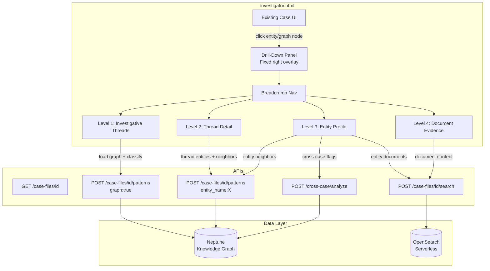
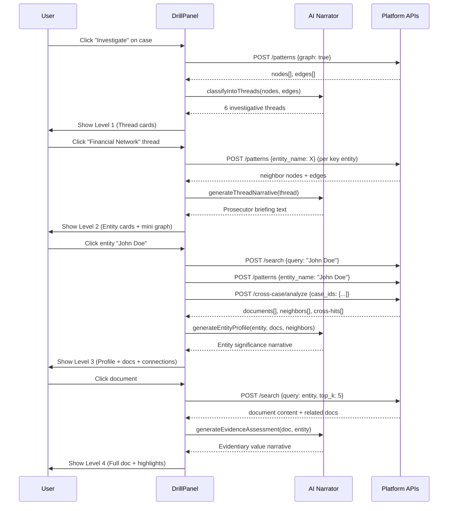

# Design Document: Investigator Drill-Down

## Overview

The Investigator Drill-Down feature adds a hierarchical, 4-level exploration panel to the existing DOJ Antitrust Division Investigative Case Analysis platform (`investigator.html`). The panel slides in from the right side of the screen as a fixed-position overlay, allowing prosecutors and investigators to progressively drill into case data — from high-level investigative threads, through entity networks, down to individual document evidence — with AI-generated narrative summaries at each level.

The feature is entirely client-side (pure HTML/CSS/JS, no build step). It leverages the existing API surface: the patterns endpoint for Neptune graph data, the search endpoint for OpenSearch document retrieval, and the cross-case analyze endpoint for cross-case flags. AI summaries are generated client-side by synthesizing entity/document data into prosecutor-style briefings (with a future hook for Bedrock RAG).

## Architecture



## Sequence Diagrams

### Opening the Drill-Down (Level 1 → Level 2 → Level 3 → Level 4)



## Components and Interfaces

### Component 1: DrillDownPanel

**Purpose**: The main overlay container that manages the slide-in/slide-out panel, breadcrumb state, and level transitions.

```javascript
// DrillDownPanel — manages the overlay lifecycle and navigation stack
const DrillDownPanel = {
    isOpen: false,
    caseId: null,
    navigationStack: [],  // [{level, title, data, icon}]
    cachedData: {},        // keyed by caseId+level+identifier

    open(caseId),          // slide panel in, load Level 1
    close(),               // slide panel out, clear stack
    navigateTo(level, identifier, data),  // push to stack, render level
    navigateBack(targetIndex),            // pop stack to index, re-render
    render(),              // render current level from top of stack
};
```

**Responsibilities**:
- Manage the fixed-position overlay DOM element
- Maintain the navigation stack (breadcrumb trail)
- Cache API responses to avoid redundant fetches
- Coordinate transitions between levels with CSS animations

### Component 2: ThreadClassifier

**Purpose**: Takes raw Neptune graph data (nodes + edges) and groups entities into the 6 investigative thread categories using type-based classification.

```javascript
// ThreadClassifier — groups entities into investigative threads
const ThreadClassifier = {
    // Thread definitions with entity type mappings
    THREAD_DEFS: {
        financial:      { types: ['financial_amount', 'account_number'], icon: '💰', label: 'Financial Network' },
        communication:  { types: ['phone_number', 'email'],             icon: '📞', label: 'Communication Chain' },
        property:       { types: ['address', 'location', 'vehicle'],    icon: '🏠', label: 'Property & Assets' },
        persons:        { types: ['person'],                            icon: '👤', label: 'Key Persons of Interest' },
        organizations:  { types: ['organization'],                      icon: '🏢', label: 'Organizations & Entities' },
        timeline:       { types: ['date', 'event'],                     icon: '📅', label: 'Timeline & Events' },
    },

    classify(nodes, edges),           // returns {threadId: {entities[], edges[], summary}}
    getThreadSummary(threadId, data), // AI-generated summary for a thread
};
```

**Responsibilities**:
- Map entity types to investigative threads
- Flag entities appearing in multiple threads as cross-thread
- Count documents per thread (from entity occurrence data)
- Generate thread-level summaries

### Component 3: AINarrator

**Purpose**: Generates prosecutor-style briefing text at each drill-down level by synthesizing entity and document data. Client-side template-based for the demo, with a hook for future Bedrock RAG integration.

```javascript
// AINarrator — generates AI-style narrative summaries
const AINarrator = {
    threadBriefing(threadId, entities, edges),
    entityProfile(entity, documents, neighbors, crossCaseHits),
    evidenceAssessment(document, entity, relatedDocs),
    investigativeOverview(threads),
};
```

**Responsibilities**:
- Generate contextual, prosecutor-perspective narratives
- Highlight cross-case connections and anomalies
- Provide "why this matters" assessments
- Template-based with entity/count interpolation (Bedrock RAG hook for later)

### Component 4: LevelRenderers

**Purpose**: Four renderer functions, one per drill-down level, that produce the HTML for each view.

```javascript
// Level renderers — each returns an HTML string for the drill panel body
function renderLevel1_Threads(threads, caseData)
function renderLevel2_ThreadDetail(threadId, threadData, neighbors)
function renderLevel3_EntityProfile(entity, documents, neighbors, crossCaseHits)
function renderLevel4_DocumentEvidence(document, entity, relatedDocs)
```

**Responsibilities**:
- Render entity cards with type icons, occurrence counts, cross-case flags
- Render mini knowledge graphs (vis.js) scoped to thread/entity
- Render document lists with excerpts and relevance scores
- Render full document text with entity highlighting

## Data Models

### NavigationEntry

```javascript
// A single entry in the breadcrumb navigation stack
// NavigationEntry
{
    level: 1|2|3|4,
    title: 'Financial Network',     // display text for breadcrumb
    icon: '💰',                     // emoji icon
    identifier: 'financial',        // threadId, entityName, or documentId
    data: { /* cached level data */ },
}
```

**Validation Rules**:
- `level` must be 1–4
- `title` must be non-empty
- `identifier` must be non-empty and unique within the stack at the same level

### InvestigativeThread

```javascript
// An investigative thread grouping entities by category
// InvestigativeThread
{
    id: 'financial',
    label: 'Financial Network',
    icon: '💰',
    entities: [
        { name: 'Account #12345', type: 'account_number', degree: 5, occurrences: 12, crossCase: false },
    ],
    edges: [
        { from: 'Account #12345', to: 'John Doe', type: 'RELATED_TO' },
    ],
    entityCount: 14,
    documentCount: 23,
    summary: 'AI-generated summary of why this thread matters...',
}
```

**Validation Rules**:
- `entities` array must not be empty for a thread to be displayed
- `entityCount` must equal `entities.length`
- Each entity must have a `name` and `type`

### EntityProfile

```javascript
// Full profile for a single entity at Level 3
// EntityProfile
{
    name: 'John Doe',
    type: 'person',
    icon: '👤',
    occurrences: 34,
    documents: [
        { id: 'doc-123', filename: 'wiretap_transcript.txt', score: 0.92, excerpt: '...' },
    ],
    neighbors: [
        { name: 'Acme Corp', type: 'organization', relationship: 'RELATED_TO' },
    ],
    crossCaseHits: [
        { caseId: 'case-456', caseName: 'Operation Crosswind', matchCount: 3 },
    ],
    timeline: [
        { date: '2024-01-15', event: 'First mention in wiretap transcript' },
    ],
    narrative: 'AI-generated entity significance profile...',
}
```

**Validation Rules**:
- `name` and `type` are required
- `documents` sorted by `score` descending
- `crossCaseHits` may be empty (no cross-case appearances)


## Algorithmic Pseudocode

### Thread Classification Algorithm

```javascript
function classifyIntoThreads(nodes, edges) {
    // Precondition: nodes is a non-empty array of {name, type, degree} objects
    // Precondition: edges is an array of {from, to, type} objects
    // Postcondition: returns object with 6 thread keys, each containing entities[] and edges[]
    // Postcondition: every node is assigned to exactly one primary thread

    const THREAD_TYPE_MAP = {
        'financial_amount': 'financial', 'account_number': 'financial',
        'phone_number': 'communication', 'email': 'communication',
        'address': 'property', 'location': 'property', 'vehicle': 'property',
        'person': 'persons',
        'organization': 'organizations',
        'date': 'timeline', 'event': 'timeline',
    };

    const threads = {};
    for (const def of Object.keys(THREAD_DEFS)) {
        threads[def] = { entities: [], edges: [], entityCount: 0, documentCount: 0 };
    }

    // Loop invariant: each processed node is in exactly one thread
    for (const node of nodes) {
        const threadId = THREAD_TYPE_MAP[node.type] || 'organizations'; // default bucket
        threads[threadId].entities.push(node);
    }

    // Assign edges to threads based on source entity
    const nodeThreadMap = {};
    for (const [threadId, thread] of Object.entries(threads)) {
        for (const entity of thread.entities) {
            nodeThreadMap[entity.name] = threadId;
        }
        thread.entityCount = thread.entities.length;
    }

    for (const edge of edges) {
        const threadId = nodeThreadMap[edge.from] || nodeThreadMap[edge.to];
        if (threadId && threads[threadId]) {
            threads[threadId].edges.push(edge);
        }
    }

    // Flag cross-thread entities (appear in edges across different threads)
    for (const edge of edges) {
        const fromThread = nodeThreadMap[edge.from];
        const toThread = nodeThreadMap[edge.to];
        if (fromThread && toThread && fromThread !== toThread) {
            // Mark both entities as cross-thread
            const fromEntity = threads[fromThread].entities.find(e => e.name === edge.from);
            const toEntity = threads[toThread].entities.find(e => e.name === edge.to);
            if (fromEntity) fromEntity.crossThread = true;
            if (toEntity) toEntity.crossThread = true;
        }
    }

    return threads;
}
```

**Preconditions:**
- `nodes` is a non-empty array from the patterns API `{graph: true}` response
- Each node has `name` (string), `type` (string), `degree` (number)
- `edges` is an array with `from`, `to`, `type` fields

**Postconditions:**
- Returns an object with 6 keys matching THREAD_DEFS
- Every node appears in exactly one thread
- Edges are assigned to the thread of their source node
- Cross-thread entities are flagged with `crossThread: true`

**Loop Invariants:**
- After processing node `i`, nodes `0..i` are each in exactly one thread
- `entityCount` equals `entities.length` for each thread after the count pass

### Entity Profile Loading Algorithm

```javascript
async function loadEntityProfile(caseId, entityName, entityType) {
    // Precondition: caseId is a valid UUID, entityName is non-empty
    // Postcondition: returns a complete EntityProfile object
    // Postcondition: documents are sorted by score descending

    // Parallel fetch: documents, neighbors, cross-case hits
    const [searchResult, neighborResult, crossCaseResult] = await Promise.all([
        api('POST', `/case-files/${caseId}/search`, {
            query: entityName, search_mode: 'hybrid', top_k: 20
        }),
        api('POST', `/case-files/${caseId}/patterns`, {
            entity_name: entityName
        }),
        loadCrossCaseHits(entityName, caseId),
    ]);

    const documents = (searchResult.results || [])
        .map(r => ({
            id: r.document_id,
            filename: r.source_filename || r.document_id,
            score: parseFloat(r.score || 0),
            excerpt: (r.text || r.content || '').substring(0, 200),
            fullText: r.text || r.content || '',
        }))
        .sort((a, b) => b.score - a.score);

    const neighbors = (neighborResult.nodes || [])
        .filter(n => n.name !== entityName && n.level <= 1)
        .map(n => ({ name: n.name, type: n.type, relationship: 'RELATED_TO' }));

    const timeline = extractTimeline(documents, entityName);

    const narrative = AINarrator.entityProfile(
        { name: entityName, type: entityType },
        documents, neighbors, crossCaseResult
    );

    return {
        name: entityName,
        type: entityType,
        icon: TYPE_ICONS[entityType] || '📎',
        occurrences: documents.length,
        documents,
        neighbors,
        crossCaseHits: crossCaseResult,
        timeline,
        narrative,
    };
}
```

**Preconditions:**
- `caseId` is a valid case file UUID that exists in the system
- `entityName` is a non-empty string matching a Neptune vertex canonical_name
- Network connectivity to all three API endpoints

**Postconditions:**
- Returns a complete EntityProfile with all fields populated
- `documents` array is sorted by `score` descending
- `neighbors` contains only 1-hop connections (level <= 1)
- `crossCaseHits` may be empty if entity appears in only one case
- `narrative` is a non-empty string

**Loop Invariants:** N/A (uses Promise.all for parallel fetches, no loops)

### Cross-Case Hit Detection Algorithm

```javascript
async function loadCrossCaseHits(entityName, currentCaseId) {
    // Precondition: entityName is non-empty, currentCaseId is valid
    // Postcondition: returns array of {caseId, caseName, matchCount} for other cases

    const hits = [];

    // Search each case (excluding current) for the entity
    // Loop invariant: hits contains results from cases[0..i-1] only
    for (const c of cases) {
        if (c.case_id === currentCaseId) continue;

        try {
            const result = await api('POST', `/case-files/${c.case_id}/search`, {
                query: entityName, search_mode: 'keyword', top_k: 3
            });
            const matchCount = (result.results || []).length;
            if (matchCount > 0) {
                hits.push({
                    caseId: c.case_id,
                    caseName: c.topic_name,
                    matchCount,
                });
            }
        } catch (e) {
            // Skip failed cases silently
        }
    }

    return hits;
}
```

**Preconditions:**
- `cases` global array is populated (loadCases has completed)
- `entityName` is a non-empty search query

**Postconditions:**
- Returns only cases where `matchCount > 0`
- Current case is excluded from results
- Failed API calls are silently skipped (no partial failures)

**Loop Invariants:**
- After processing case `i`, `hits` contains only cases with matchCount > 0 from cases `0..i-1`

### AI Narrator — Thread Briefing Generator

```javascript
function generateThreadBriefing(threadId, entities, edges) {
    // Precondition: threadId is one of the 6 valid thread IDs
    // Precondition: entities is non-empty array
    // Postcondition: returns a non-empty string in prosecutor briefing style

    const threadLabel = THREAD_DEFS[threadId].label;
    const entityCount = entities.length;
    const connectionCount = edges.length;
    const topEntities = entities
        .sort((a, b) => (b.degree || 0) - (a.degree || 0))
        .slice(0, 5);
    const crossThreadEntities = entities.filter(e => e.crossThread);

    let briefing = `INVESTIGATIVE THREAD ASSESSMENT: ${threadLabel}\n\n`;
    briefing += `This thread encompasses ${entityCount} entities with ${connectionCount} `;
    briefing += `documented connections within the case evidence.\n\n`;

    if (topEntities.length > 0) {
        briefing += `Key entities of interest: `;
        briefing += topEntities.map(e => `${e.name} (${e.degree} connections)`).join(', ');
        briefing += '.\n\n';
    }

    if (crossThreadEntities.length > 0) {
        briefing += `⚠️ CROSS-THREAD ALERT: ${crossThreadEntities.length} entities in this thread `;
        briefing += `also appear in connections to other investigative threads, suggesting `;
        briefing += `potential coordination or overlap requiring further analysis.\n\n`;
    }

    // Thread-specific prosecutor language
    const threadNotes = {
        financial: 'Financial patterns may indicate money laundering, price-fixing proceeds, or bid-rigging payments. Recommend forensic accounting review.',
        communication: 'Communication patterns may establish conspiracy timelines and coordination between subjects. Recommend toll record analysis.',
        property: 'Property and asset holdings may reveal hidden wealth, shell company addresses, or meeting locations relevant to the conspiracy.',
        persons: 'These individuals appear across multiple evidence threads, suggesting central roles in the alleged conspiracy.',
        organizations: 'Corporate entities and organizations may be vehicles for anticompetitive conduct. Examine corporate structures and beneficial ownership.',
        timeline: 'Chronological analysis may reveal patterns of coordinated action consistent with conspiracy allegations.',
    };

    briefing += threadNotes[threadId] || '';

    return briefing;
}
```

**Preconditions:**
- `threadId` is a key in THREAD_DEFS
- `entities` is a non-empty array with `name`, `type`, `degree` fields

**Postconditions:**
- Returns a non-empty string
- Briefing includes entity count, connection count, top entities
- Cross-thread alerts are included when applicable
- Thread-specific prosecutor guidance is appended

**Loop Invariants:** N/A

## Key Functions with Formal Specifications

### DrillDownPanel.open(caseId)

```javascript
async function open(caseId) {
    this.caseId = caseId;
    this.navigationStack = [];
    this.isOpen = true;

    // Animate panel in
    const panel = document.getElementById('drillPanel');
    panel.classList.add('active');

    // Load Level 1
    const graphData = await api('POST', `/case-files/${caseId}/patterns`, { graph: true });
    const threads = ThreadClassifier.classify(graphData.nodes || [], graphData.edges || []);
    const overview = AINarrator.investigativeOverview(threads);

    this.navigateTo(1, 'threads', { threads, overview, caseId });
}
```

**Preconditions:**
- `caseId` is a valid case file UUID
- The DOM element `#drillPanel` exists
- The patterns API is reachable

**Postconditions:**
- `isOpen` is `true`
- `navigationStack` has exactly one entry (Level 1)
- Panel DOM element has class `active`
- Level 1 content is rendered with classified threads

### DrillDownPanel.navigateBack(targetIndex)

```javascript
function navigateBack(targetIndex) {
    // Precondition: 0 <= targetIndex < navigationStack.length
    // Postcondition: navigationStack.length === targetIndex + 1

    if (targetIndex < 0 || targetIndex >= this.navigationStack.length) return;

    this.navigationStack = this.navigationStack.slice(0, targetIndex + 1);
    this.render();
}
```

**Preconditions:**
- `targetIndex` is a valid index in `navigationStack`

**Postconditions:**
- Stack is truncated to `targetIndex + 1` entries
- Current view re-renders to the target level
- Breadcrumb updates to reflect new stack

### renderLevel2_ThreadDetail(threadId, threadData, caseId)

```javascript
async function renderLevel2_ThreadDetail(threadId, threadData, caseId) {
    // Precondition: threadData has entities[] and edges[]
    // Postcondition: returns HTML string with narrative, entity cards, mini graph

    const narrative = AINarrator.threadBriefing(threadId, threadData.entities, threadData.edges);

    // Sort entities by degree (most connected first)
    const sortedEntities = [...threadData.entities].sort((a, b) => (b.degree || 0) - (a.degree || 0));

    let html = '';
    html += `<div class="drill-summary">${narrative}</div>`;

    // Entity cards
    html += '<div class="drill-section"><div class="drill-section-title">Entities in this Thread</div>';
    html += '<div class="thread-entity-grid">';
    for (const entity of sortedEntities) {
        const icon = TYPE_ICONS[entity.type] || '📎';
        const crossBadge = entity.crossThread ? '<span class="cross-thread-badge">⚠️ Cross-Thread</span>' : '';
        html += `<div class="thread-entity-card" onclick="DrillDownPanel.navigateTo(3, '${entity.name}', {entity: '${entity.name}', type: '${entity.type}'})">`;
        html += `<span class="entity-icon">${icon}</span>`;
        html += `<div class="entity-info"><div class="entity-name">${entity.name}</div>`;
        html += `<div class="entity-meta">${entity.type} · ${entity.degree || 0} connections</div>`;
        html += `${crossBadge}</div><span class="entity-arrow">›</span></div>`;
    }
    html += '</div></div>';

    // Mini knowledge graph (scoped to this thread)
    html += '<div class="drill-section"><div class="drill-section-title">Thread Network</div>';
    html += '<div class="thread-mini-graph" id="threadGraph"></div></div>';

    return html;
}
```

**Preconditions:**
- `threadData.entities` is a non-empty array
- `threadData.edges` is an array (may be empty)

**Postconditions:**
- Returns valid HTML string
- Entities are sorted by degree descending
- Cross-thread entities display alert badge
- Mini graph container is included for vis.js rendering

## Example Usage

```javascript
// Example 1: Open drill-down from case view
// User clicks "Investigate" button on a selected case
document.getElementById('investigateBtn').addEventListener('click', () => {
    DrillDownPanel.open(selectedCaseId);
});

// Example 2: Navigate from Level 1 thread to Level 2 detail
// User clicks the "Financial Network" thread card
DrillDownPanel.navigateTo(2, 'financial', {
    threadId: 'financial',
    threadData: threads['financial'],
    caseId: selectedCaseId,
});

// Example 3: Navigate from Level 2 entity to Level 3 profile
// User clicks an entity card in the thread detail view
async function onEntityClick(entityName, entityType) {
    const profile = await loadEntityProfile(selectedCaseId, entityName, entityType);
    DrillDownPanel.navigateTo(3, entityName, profile);
}

// Example 4: Navigate from Level 3 document to Level 4 evidence
// User clicks a document card in the entity profile
function onDocumentClick(document, entityName) {
    DrillDownPanel.navigateTo(4, document.id, {
        document,
        entityName,
        caseId: selectedCaseId,
    });
}

// Example 5: Breadcrumb back-navigation
// User clicks "Financial Network" in breadcrumb: Threads > Financial Network > John Doe
DrillDownPanel.navigateBack(1); // returns to Level 2

// Example 6: Close the panel
DrillDownPanel.close();
```

## Correctness Properties

The following properties must hold for the drill-down system:

1. **Stack Integrity**: `navigationStack.length` always equals the current drill-down depth. After `navigateTo(level, ...)`, the stack has exactly `level` entries.

2. **Breadcrumb Consistency**: The breadcrumb trail always reflects `navigationStack` — each breadcrumb segment corresponds to `navigationStack[i].title` and clicking segment `i` calls `navigateBack(i)`.

3. **Thread Completeness**: After `classifyIntoThreads(nodes, edges)`, every node from the input appears in exactly one thread. `sum(thread.entityCount for all threads) === nodes.length`.

4. **Entity Uniqueness per Thread**: No entity name appears more than once within a single thread's `entities` array.

5. **Sort Stability**: Documents in Level 3 are always sorted by `score` descending. Entities in Level 2 are always sorted by `degree` descending.

6. **Cache Coherence**: If `cachedData[key]` exists, re-navigating to that level/identifier uses the cache and does not re-fetch from the API.

7. **Panel State**: `isOpen === true` if and only if the panel DOM element has class `active`. `isOpen === false` implies `navigationStack` is empty.

8. **Cross-Case Exclusion**: `crossCaseHits` for an entity never includes the current case. `crossCaseHits.every(h => h.caseId !== currentCaseId)`.

9. **Level Bounds**: `navigateTo` only accepts levels 1–4. `navigateBack(i)` only accepts `0 <= i < navigationStack.length`.

10. **Idempotent Close**: Calling `close()` when `isOpen === false` is a no-op and does not throw.

## Error Handling

### Error Scenario 1: API Failure on Level 1 Load

**Condition**: The patterns API (`POST /patterns {graph: true}`) returns an error or times out when opening the drill-down.
**Response**: Display an error state inside the panel with a "Retry" button. The panel remains open but shows: "Unable to load investigative threads. The knowledge graph may not be populated for this case."
**Recovery**: User clicks "Retry" to re-attempt the API call. If the case has no graph data, suggest running Pattern Discovery first.

### Error Scenario 2: Empty Graph Data

**Condition**: The patterns API returns successfully but with 0 nodes.
**Response**: Display an informational state: "No entities found in the knowledge graph for this case. Run the ingestion pipeline to populate entity data."
**Recovery**: User closes the panel and uses the admin pipeline to ingest documents.

### Error Scenario 3: Entity Search Returns No Documents

**Condition**: At Level 3, the search API returns 0 results for an entity name.
**Response**: Show the entity profile with neighbors and cross-case data, but display "No documents directly mention this entity" in the documents section.
**Recovery**: Suggest alternative search terms or checking the entity name spelling.

### Error Scenario 4: Cross-Case Search Partial Failure

**Condition**: Some cases fail during cross-case hit detection (network errors, timeouts).
**Response**: Show results from successful cases. Display a subtle warning: "Cross-case results may be incomplete (X of Y cases searched)."
**Recovery**: Automatic — partial results are still useful. No user action required.

### Error Scenario 5: Panel Navigation Race Condition

**Condition**: User rapidly clicks through levels before previous API calls complete.
**Response**: Each navigation call carries a sequence number. When an API response returns, it checks if the sequence number matches the current navigation state. Stale responses are discarded.
**Recovery**: Automatic — only the most recent navigation action's results are rendered.

## Testing Strategy

### Unit Testing Approach

- Test `classifyIntoThreads` with various node type distributions (all one type, mixed, unknown types)
- Test `navigateBack` with edge cases (index 0, last index, out of bounds)
- Test `AINarrator` functions produce non-empty strings for all thread types
- Test entity sorting (by degree, by score) with ties and edge cases
- Test `highlightEntityInText` correctly wraps entity mentions in `<mark>` tags
- Test cache key generation for different level/identifier combinations

### Property-Based Testing Approach

**Property Test Library**: fast-check

- **Thread Partition Property**: For any set of nodes, `classifyIntoThreads` produces a partition — every node is in exactly one thread, no node is missing, no duplicates.
- **Navigation Stack Property**: For any sequence of `navigateTo` and `navigateBack` calls, `navigationStack.length` is always between 0 and 4 inclusive.
- **Sort Idempotency**: Sorting documents by score and then sorting again produces the same order.
- **Cross-Case Exclusion**: For any entity and case, `loadCrossCaseHits` never includes the current case in results.

### Integration Testing Approach

- Test full drill-down flow: open panel → click thread → click entity → click document → breadcrumb back
- Test with real API responses from the staging environment
- Test panel open/close animations don't leave orphaned DOM elements
- Test that vis.js mini-graphs render correctly within the panel at each level

## Performance Considerations

- **Parallel API Calls**: Level 3 (Entity Profile) fires search, patterns, and cross-case requests in parallel via `Promise.all` to minimize latency.
- **Response Caching**: API responses are cached in `DrillDownPanel.cachedData` keyed by `caseId+level+identifier`. Navigating back uses cached data instead of re-fetching.
- **Lazy Graph Rendering**: Mini knowledge graphs (vis.js) at Level 2 are rendered after the HTML is inserted into the DOM, using `requestAnimationFrame` to avoid blocking the main thread.
- **Cross-Case Throttling**: Cross-case hit detection searches cases sequentially (not all at once) to avoid overwhelming the API. For large case counts (>10), limit to the 10 most recent cases.
- **DOM Recycling**: The panel body is a single container whose `innerHTML` is replaced on navigation, avoiding DOM node accumulation.

## Security Considerations

- **Input Sanitization**: All entity names and document text inserted into HTML are escaped to prevent XSS. Use a `sanitize()` helper that escapes `<`, `>`, `&`, `"`, `'`.
- **API URL Construction**: Entity names used in API request bodies are JSON-serialized (not URL-interpolated), avoiding injection via the patterns/search endpoints.
- **No Client-Side Secrets**: The demo uses the existing public API URL. No API keys or credentials are stored in the frontend code.
- **Content Security**: Document text displayed at Level 4 is rendered as text content, not raw HTML, to prevent stored XSS from document content.

## Dependencies

- **vis-network v9.1.6**: Already loaded in `investigator.html` via CDN. Used for mini knowledge graphs at Level 2 and Level 3.
- **Existing API Surface**: All 5 endpoints (`/case-files`, `/case-files/{id}`, `/case-files/{id}/search`, `/case-files/{id}/patterns`, `/cross-case/analyze`) are already deployed and functional.
- **No New Backend Dependencies**: The feature is entirely client-side. AI narratives are template-based. Future Bedrock RAG integration would add a new API endpoint but is out of scope for this spec.
