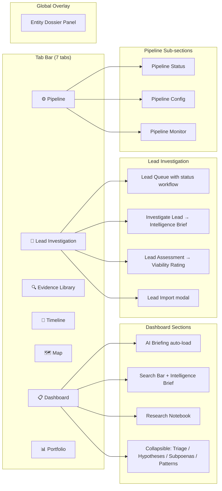
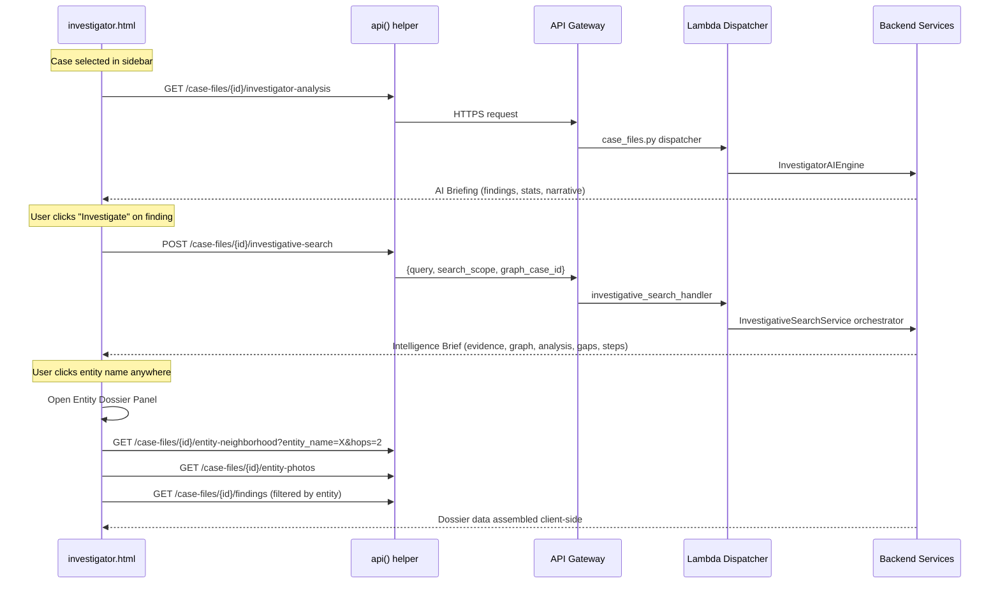

# Design Document: Investigator Workflow Consolidation

## Overview

This feature restructures the investigator.html single-page application from 16 overlapping tabs into 7 focused tabs following the Palantir Gotham investigative workflow pattern: Case Dashboard → Lead Investigation → Evidence Library → Timeline → Map → Pipeline → Portfolio. The consolidation is primarily a frontend restructure of the monolithic 7700-line HTML file. Backend services are already deployed and functional; the only backend change is ensuring the AIResearchAgent is properly invoked for `internal_external` search scope (which the existing `InvestigativeSearchService` already handles — the fix is wiring the frontend toggle correctly).

The design follows the existing architectural patterns: inline JavaScript in a single HTML file, the `api()` helper for all API calls, `switchTab()` for navigation, the `.drill-overlay` + `.drill-panel` pattern for slide-out panels, vis.js for graph visualization, and localStorage for client-side state persistence.

## Architecture

### Current State (16 tabs)

```
Tab Bar: Cases | Cross-Case | Pipeline | PipeConfig | PipeMonitor | Wizard | Portfolio | Workbench | Timeline | Map | AI Briefing | Leads | Triage | Hypotheses | Subpoenas | Evidence
```

Many tabs are dead-ends (Workbench, Cross-Case), duplicated (Evidence appears in Cases sub-tab AND standalone), or should be sections within a parent view (Triage, Hypotheses, Subpoenas are all AI analysis outputs for the same case).

### Target State (7 tabs)

```
Tab Bar: 📋 Dashboard | 🎯 Lead Investigation | 🔍 Evidence Library | 📅 Timeline | 🗺️ Map | ⚙️ Pipeline | 📊 Portfolio
```



### Data Flow



### State Management

All state lives in the browser — no server-side session:

| State | Storage | Scope |
|-------|---------|-------|
| Selected case ID + metadata | `window.selectedCaseId`, `window.selectedCaseData` | Global, all tabs |
| Lead statuses (New/Investigating/Assessed/Closed) | `localStorage['leadStatuses_' + caseId]` | Per-case, survives refresh |
| Imported leads | `localStorage['importedLeads_' + caseId]` | Per-case, survives refresh |
| Collapsible section cache | `window._sectionCache` object | Per-session, cleared on case change |
| Tab data-loaded indicators | `window._tabDataLoaded` object | Per-session, cleared on case change |

## Components and Interfaces

### 1. Tab Bar Component

Replaces the current 16-tab bar with 7 tabs. Each tab has an optional green indicator dot showing data is loaded.

```javascript
// Updated switchTab function
function switchTab(tab) {
    const allTabs = ['dashboard','leadinvestigation','evidencelibrary','timeline','map','pipeline','portfolio'];
    document.querySelectorAll('.tab').forEach((t, i) => {
        t.classList.toggle('active', allTabs[i] === tab);
    });
    document.querySelectorAll('.tab-content').forEach(tc => tc.classList.remove('active'));
    document.getElementById('tab-' + tab).classList.add('active');

    // Lazy-load tab data
    if (tab === 'dashboard' && selectedCaseId) loadDashboard();
    if (tab === 'leadinvestigation' && selectedCaseId) loadLeadQueue();
    if (tab === 'evidencelibrary' && selectedCaseId) loadEvidence();
    if (tab === 'timeline' && selectedCaseId) loadTimeline();
    if (tab === 'map' && selectedCaseId) loadMap();
    if (tab === 'pipeline' && selectedCaseId) loadPipelineStatus();
    if (tab === 'portfolio') loadPortfolio();
}
```

### 2. Case Dashboard Tab (`tab-dashboard`)

Merges: Cases sidebar + AI Briefing + Search + Research Notebook + collapsible intelligence sections.

Layout:
- Left: Case sidebar (preserved from current `tab-cases`)
- Right: Main content area with:
  - AI Briefing Section (auto-loads on case select)
  - Search bar with scope toggle
  - Research Notebook panel
  - Collapsible sections: Evidence Triage, AI Hypotheses, Subpoena Recommendations, Top Patterns

API endpoints used:
- `GET /case-files/{id}/investigator-analysis` — AI Briefing
- `POST /case-files/{id}/investigative-search` — Search
- `GET /case-files/{id}/findings` — Research Notebook
- `POST /case-files/{id}/findings` — Save Finding
- `GET /case-files/{id}/evidence-triage` — Lazy-loaded
- `GET /case-files/{id}/ai-hypotheses` — Lazy-loaded
- `GET /case-files/{id}/subpoena-recommendations` — Lazy-loaded
- `GET /case-files/{id}/patterns` — Lazy-loaded (top 5)

### 3. Lead Investigation Tab (`tab-leadinvestigation`)

New tab. Provides the critical missing workflow piece: a lead queue with status tracking, investigative search per lead, batch assessment, and lead import.

```javascript
// Lead card data structure (client-side)
{
    entity_name: "John Doe",
    score: 85,
    justification: "AI-generated one-liner",
    status: "new",           // new | investigating | assessed | closed
    viability: null,         // viable | promising | insufficient (after assessment)
    confidence: null,        // strong_case | needs_more_evidence | insufficient
    source: "ai" | "imported",
    subjects: [],            // for lead assessment
    assessment_result: null  // full Intelligence Brief after investigation
}
```

API endpoints used:
- `GET /case-files/{id}/investigative-leads` — Fetch AI-generated leads
- `POST /case-files/{id}/investigative-search` — Investigate individual lead
- `POST /case-files/{id}/lead-assessment` — Deep-dive assessment with viability rating

Lead status persisted in `localStorage['leadStatuses_' + caseId]` as `{ entityName: status }`.

### 4. Entity Dossier Panel

Reuses the existing `.drill-overlay` + `.drill-panel` pattern. A new overlay div (`entityDossierOverlay`) with a dedicated panel (`entityDossierPanel`).

Triggered by clicking any entity name rendered anywhere in the app. Entity names are wrapped in `<span class="entity-link" data-entity="NAME">NAME</span>` and a delegated click handler on `document.body` opens the dossier.

Sections:
- Entity photo (from `/case-files/{id}/entity-photos`)
- Type + aliases
- Document mentions (from search results)
- Graph neighborhood (vis.js mini-graph, 2-hop from `/case-files/{id}/entity-neighborhood`)
- Timeline events (filtered from timeline data)
- Prior findings (from `/case-files/{id}/findings` filtered by entity name)
- "🔎 Investigate" button → runs investigative search inline

### 5. Pipeline Tab (`tab-pipeline`)

Merges three existing tabs into one with sub-navigation buttons:
- Pipeline Status (default) — existing `tab-pipeline` content
- Pipeline Config — existing `tab-pipeconfig` content
- Pipeline Monitor — existing `tab-pipemonitor` content

```javascript
function switchPipelineSection(section) {
    ['pipeStatus','pipeConfig','pipeMonitor'].forEach(s => {
        document.getElementById('pipe-' + s).style.display = s === section ? 'block' : 'none';
    });
    document.querySelectorAll('.pipe-sub-tab').forEach(t => {
        t.classList.toggle('active', t.dataset.section === section);
    });
}
```

### 6. Portfolio Tab Enhancement

Preserved as-is, with one addition: a "New Case" button that opens the wizard form as a modal dialog (replacing the removed standalone Wizard tab).

### 7. Collapsible Section Component

Reusable pattern for lazy-loaded, cached collapsible sections in the Dashboard.

```javascript
// Generic collapsible section with lazy fetch + cache
async function toggleSection(sectionId, fetchFn) {
    const body = document.getElementById(sectionId + '-body');
    const arrow = document.getElementById(sectionId + '-arrow');
    const isOpen = body.style.display !== 'none';

    if (isOpen) {
        body.style.display = 'none';
        arrow.textContent = '▶';
        return;
    }

    body.style.display = 'block';
    arrow.textContent = '▼';

    // Lazy fetch on first expand (per case)
    const cacheKey = sectionId + '_' + selectedCaseId;
    if (!window._sectionCache[cacheKey]) {
        body.innerHTML = '<div class="search-loading"><span class="search-spinner"></span>Loading...</div>';
        try {
            const data = await fetchFn();
            window._sectionCache[cacheKey] = data;
        } catch (e) {
            body.innerHTML = '<div style="color:#fc8181;font-size:0.82em;padding:12px;">Failed to load. <button class="btn-sm btn-yellow" onclick="toggleSection(\'' + sectionId + '\', ' + fetchFn.name + ')">Retry</button></div>';
            return;
        }
    }
    renderSection(sectionId, window._sectionCache[cacheKey]);
}
```

### 8. Tab Workflow Indicators

Small green dots on tabs that have loaded data for the current case.

```css
.tab { position: relative; }
.tab .tab-indicator {
    position: absolute; top: 6px; right: 6px;
    width: 6px; height: 6px; border-radius: 50%;
    background: #238636; display: none;
}
.tab .tab-indicator.loaded { display: block; }
```

## Data Models

### Client-Side State (JavaScript)

```javascript
// Global shared state
window.selectedCaseId = null;
window.selectedCaseData = null;       // Full case metadata object
window._sectionCache = {};            // Lazy-loaded section data cache
window._tabDataLoaded = {};           // { tabName: true } for indicator dots
window._leadStatuses = {};            // { entityName: status } loaded from localStorage
window._importedLeads = [];           // Manually imported leads for current case

// Lead card model
const LeadCard = {
    entity_name: '',                  // Required
    score: 0,                         // 0-100
    justification: '',                // AI one-liner
    status: 'new',                    // new | investigating | assessed | closed
    viability: null,                  // viable | promising | insufficient
    confidence: null,                 // strong_case | needs_more_evidence | insufficient
    source: 'ai',                     // ai | imported
    subjects: [],                     // For lead assessment
    assessment_result: null,          // Full Intelligence Brief
    type: 'person'                    // person | organization
};

// Lead import payload
const LeadImport = {
    name: '',                         // Required
    type: 'person',                   // person | organization
    context: '',                      // Optional
    aliases: []                       // Optional
};
```

### API Response Models (existing, unchanged)

All backend API response models are already defined and deployed. The frontend consumes:

- **InvestigatorAnalysis** — from `GET /case-files/{id}/investigator-analysis`
- **InvestigativeAssessment** — from `POST /case-files/{id}/investigative-search`
- **LeadAssessmentResponse** — from `POST /case-files/{id}/lead-assessment`
- **FindingResponse** — from `GET/POST /case-files/{id}/findings`
- **EntityNeighborhood** — from `GET /case-files/{id}/entity-neighborhood`

### localStorage Schema

```javascript
// Lead statuses per case
localStorage['leadStatuses_CASE_ID'] = JSON.stringify({
    "Jeffrey Epstein": "assessed",
    "Ghislaine Maxwell": "investigating",
    "Custom Lead": "new"
});

// Imported leads per case
localStorage['importedLeads_CASE_ID'] = JSON.stringify([
    { name: "John Doe", type: "person", context: "Mentioned in doc X", aliases: ["JD"] }
]);
```


## Correctness Properties

*A property is a characteristic or behavior that should hold true across all valid executions of a system — essentially, a formal statement about what the system should do. Properties serve as the bridge between human-readable specifications and machine-verifiable correctness guarantees.*

### Property 1: Case selection triggers shared state update and dashboard auto-fetch

*For any* case selected from the sidebar, the shared state (`selectedCaseId`, `selectedCaseData`) shall be updated, all section caches (`_sectionCache`) shall be cleared, all tab indicator dots shall be reset, and the AI Briefing fetch shall be triggered for the new case.

**Validates: Requirements 2.1, 16.1, 16.2, 16.4, 19.2**

### Property 2: AI Briefing rendering completeness

*For any* valid AI Briefing API response containing findings, the rendered AI_Briefing_Section shall contain: an executive summary narrative, case statistics (document count, entity count, relationship count, active leads), and a grid of finding cards where each card includes an "🔎 Investigate" button.

**Validates: Requirements 2.2, 2.4**

### Property 3: Collapsible section lazy-fetch and caching

*For any* collapsible section (Evidence Triage, AI Hypotheses, Subpoena Recommendations, Top Patterns), the first expansion shall trigger an API fetch and store the result in `_sectionCache`, and subsequent toggles for the same case shall reuse the cached data without additional API calls.

**Validates: Requirements 4.5**

### Property 4: Lead card rendering completeness

*For any* lead data object with a valid entity name and score, the rendered Lead_Card shall display: the entity name, a color-coded score badge (green if score > 70, yellow if 40-70, red if < 40), a one-line AI justification, and a status badge with the correct color (blue for New, amber for Investigating, green/red for Assessed based on viability, gray for Closed).

**Validates: Requirements 5.2, 9.1**

### Property 5: Lead queue default sort order

*For any* set of leads rendered in the Lead_Investigation_Tab, the default display order shall be by score descending (highest score first).

**Validates: Requirements 5.3**

### Property 6: Lead investigation lifecycle

*For any* lead card that is clicked for investigation, the system shall: (1) update the lead status to "Investigating", (2) call `POST /case-files/{id}/investigative-search` with the entity name as query and `search_scope: "internal_external"`, (3) on success, display the Intelligence Brief in an expanded panel below the card, and (4) update the lead status to "Assessed" with the confidence level displayed as a badge.

**Validates: Requirements 6.1, 6.2, 6.3**

### Property 7: Lead status round-trip persistence

*For any* lead status change (New → Investigating → Assessed → Closed), the status shall be persisted to `localStorage['leadStatuses_' + caseId]`, and when the page is refreshed or the case is re-selected, the statuses shall be restored from localStorage matching the previously saved values.

**Validates: Requirements 9.3, 9.4**

### Property 8: Lead import validation and persistence

*For any* valid lead import (JSON with non-empty `name` field, or form with non-empty entity name), the lead shall be added to the queue with status "New" and score 0. *For any* invalid import (missing name, malformed JSON), the import shall be rejected with a validation error and the modal shall remain open.

**Validates: Requirements 8.2, 8.4, 8.5**

### Property 9: Lead assessment result rendering

*For any* completed lead assessment response, the Lead_Investigation_Tab shall display the Case_Viability_Rating as a color-coded badge (viable=green, promising=yellow, insufficient=red), the consolidated summary text, and any cross-subject connections found between the lead's subjects.

**Validates: Requirements 7.2, 7.3**

### Property 10: Entity Dossier opens on entity name click

*For any* entity name rendered as a clickable element (with class `entity-link`) in any tab (Dashboard, Lead Investigation, Evidence Library, Timeline, Map), clicking the entity name shall open the Entity_Dossier_Panel as a slide-out overlay from the right side of the screen.

**Validates: Requirements 10.1**

### Property 11: Entity Dossier rendering completeness

*For any* entity with available data, the Entity_Dossier_Panel shall render all applicable sections: entity photo (if available), entity type and aliases, document mentions, graph neighborhood visualization (vis.js with 2-hop data), timeline events, prior findings from Research Notebook, and an "🔎 Investigate" button.

**Validates: Requirements 10.2**

### Property 12: External search scope produces cross-reference report

*For any* investigative search executed with `search_scope: "internal_external"`, the API call payload shall include `search_scope: "internal_external"`, and when the response contains a `cross_reference_report`, each entry's `category` shall be one of: `confirmed_internally`, `external_only`, or `needs_research`, and the Intelligence Brief display shall render a "Cross-Reference Report" section.

**Validates: Requirements 3.4, 17.1, 17.2, 17.3, 17.4**

### Property 13: Save Finding button on Intelligence Brief

*For any* Intelligence Brief rendered in the search results area or in a slide-out panel, a "💾 Save to Notebook" button shall be present that, when clicked, calls `POST /case-files/{id}/findings` with the search query and finding metadata.

**Validates: Requirements 3.3**

### Property 14: Tab data-loaded indicator dots

*For any* tab that has successfully loaded data for the current case, a green indicator dot (#238636) shall be displayed on that tab in the Tab_Bar. When the selected case changes, all indicator dots shall be hidden.

**Validates: Requirements 19.1, 19.2**

## Error Handling

### Frontend Error Handling Strategy

All API calls use the existing `api()` helper which returns parsed JSON. Error handling follows a consistent pattern across all new components:

| Scenario | Behavior |
|----------|----------|
| AI Briefing fetch fails | Show fallback message with "Retry" button; render rest of dashboard normally |
| Investigative search fails | Show error message with "Retry" button; revert lead status to "New" if triggered from lead card |
| Collapsible section fetch fails | Show section-level error with "Retry" button; other sections unaffected |
| Entity Dossier API fails | Show "No data available" per section; other sections render normally |
| Lead assessment fails | Show error on lead card; do not update status |
| Lead import validation fails | Show validation error in modal; keep modal open |
| API Gateway 29s timeout | Frontend `fetch` will timeout; show "Request timed out, try again" message |
| No case selected | Show prompt in each tab: "Select a case from the Case Dashboard" |
| Empty leads list | Show empty state with prompt to run AI Briefing or import leads |
| Entity neighborhood returns empty | Show "No graph connections found" in dossier graph section |

### Error Display Pattern

```javascript
function showSectionError(containerId, retryFn) {
    document.getElementById(containerId).innerHTML =
        `<div style="color:#fc8181;font-size:0.82em;padding:12px;background:rgba(252,129,129,0.06);border-radius:8px;">
            ⚠ Failed to load data.
            <button class="btn-sm btn-yellow" onclick="${retryFn}" style="margin-left:8px;">Retry</button>
        </div>`;
}
```

### Backend Error Handling (existing, unchanged)

The `InvestigativeSearchService` already handles:
- Bedrock call failures → graceful degradation with partial results
- Neptune query timeouts → skip graph context, return document-only results
- AIResearchAgent failures → return internal-only results with `synthesis_error` note
- Time budget exceeded (25s) → return partial results assembled so far

## Testing Strategy

### Dual Testing Approach

This feature is primarily a frontend restructure. Testing focuses on:

1. **Unit tests** — Verify specific DOM structure, tab counts, removed elements, and specific UI states
2. **Property-based tests** — Verify universal behaviors across all valid inputs (lead rendering, status transitions, localStorage round-trips, search scope propagation)

### Unit Tests

Unit tests cover specific examples and edge cases:
- Tab bar contains exactly 7 tabs in correct order (Req 1.1-1.5)
- Removed tab divs are absent from DOM (Req 1.3, 1.4, 18.1-18.4)
- Pipeline tab has 3 sub-sections (Req 12.1-12.6)
- Portfolio tab has "New Case" button (Req 15.3)
- Empty leads state shows correct message (Req 5.4)
- Entity Dossier close button and Escape key work (Req 10.4)
- Loading skeleton appears during AI Briefing fetch (Req 2.7)
- Error fallback renders on API failure (Req 2.6, 4.6, 6.4, 17.5)

### Property-Based Tests

Property-based tests use **fast-check** (JavaScript PBT library) with minimum 100 iterations per property.

Each property test references its design document property:

```javascript
// Feature: investigator-workflow-consolidation, Property 4: Lead card rendering completeness
fc.assert(fc.property(
    fc.record({
        entity_name: fc.string({ minLength: 1 }),
        score: fc.integer({ min: 0, max: 100 }),
        justification: fc.string(),
        status: fc.constantFrom('new', 'investigating', 'assessed', 'closed')
    }),
    (lead) => {
        const html = renderLeadCard(lead);
        // Verify all required fields present
        expect(html).toContain(lead.entity_name);
        expect(html).toContain(lead.score.toString());
        // Verify color coding
        if (lead.score > 70) expect(html).toContain('#48bb78');
        else if (lead.score >= 40) expect(html).toContain('#f6e05e');
        else expect(html).toContain('#fc8181');
    }
), { numRuns: 100 });
```

Tag format: **Feature: investigator-workflow-consolidation, Property {number}: {property_text}**

### Test Configuration

- PBT library: **fast-check** (JavaScript)
- Minimum iterations: 100 per property test
- Test runner: Can use any JS test runner (Jest, Vitest, or standalone)
- Each correctness property is implemented by a single property-based test
- Edge cases (error handling, empty states) are covered by unit tests, not property tests
- Since the frontend is a single HTML file with inline JS, tests will need to extract testable functions into a separate module or test the DOM output directly using jsdom

### Test File Organization

```
tests/
  frontend/
    test_tab_structure.js          — Unit tests for tab bar, removed tabs
    test_lead_card_properties.js   — PBT for Properties 4, 5, 8
    test_lead_lifecycle.js         — PBT for Properties 6, 7
    test_dashboard_rendering.js    — PBT for Properties 2, 3, 13
    test_entity_dossier.js         — PBT for Properties 10, 11
    test_search_scope.js           — PBT for Property 12
    test_case_state.js             — PBT for Properties 1, 14
```
