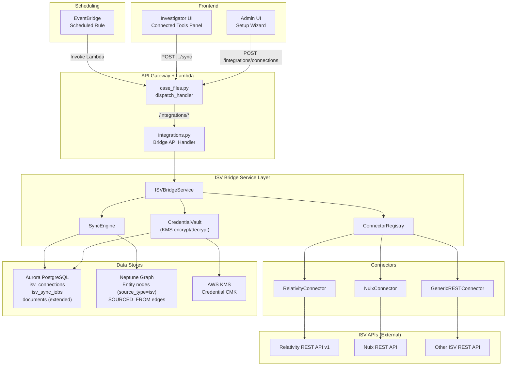
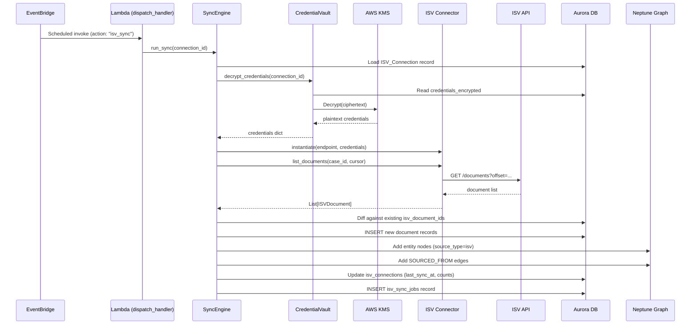

# Design Document: ISV Data Bridge

## Overview

The ISV Data Bridge adds an integration layer to the Investigative Intelligence Platform that connects to third-party legal and investigative software (Relativity, Nuix, and generic REST APIs) via their REST APIs. It pulls case metadata, document lists, and search results from ISV tools and feeds them into the existing Neptune graph and Aurora document store. Investigators see ISV-sourced documents and entities alongside natively ingested evidence, with deep-links back to the originating tool.

The design follows the platform's existing patterns: a new service module (`isv_bridge_service.py`) with dependency injection, new routes added to the `case_files.py` mega-dispatcher under `/v1/integrations/`, a new Pydantic model module (`src/models/isv.py`), and a new Aurora migration (`014_isv_data_bridge.sql`). ISV credentials are encrypted at rest using AWS KMS. Background sync is driven by EventBridge scheduled rules invoking the existing Lambda.

## Architecture



### Data Flow: Sync Cycle




## Components and Interfaces

### 1. Connector Interface (`src/services/isv_connector_base.py`)

Abstract base class that all ISV connectors implement. Follows the existing service pattern with dependency injection.

```python
from abc import ABC, abstractmethod
from typing import Optional, List
from models.isv import ISVDocument, ISVCase, ConnectionTestResult

class ISVConnectorBase(ABC):
    """Abstract interface for all ISV connectors."""

    def __init__(self, endpoint_url: str, credentials: dict, config: Optional[dict] = None):
        self.endpoint_url = endpoint_url
        self.credentials = credentials
        self.config = config or {}

    @abstractmethod
    def test_connection(self) -> ConnectionTestResult: ...

    @abstractmethod
    def list_cases(self) -> List[ISVCase]: ...

    @abstractmethod
    def list_documents(self, case_id: str, cursor: Optional[str] = None) -> tuple: ...
        # Returns (List[ISVDocument], Optional[next_cursor])

    @abstractmethod
    def search(self, query: str, case_id: Optional[str] = None) -> List[ISVDocument]: ...

    @abstractmethod
    def get_document(self, document_id: str) -> ISVDocument: ...

    @abstractmethod
    def get_deep_link(self, document_id: str) -> str: ...
```

All connectors implement retry logic for HTTP 429/5xx (3 retries, exponential backoff starting at 2s) and raise typed exceptions for 401/403/404 without retrying.

### 2. Connector Registry (`src/services/isv_connector_registry.py`)

Maps ISV type strings to connector classes. New connectors are registered by adding an entry — no core logic changes needed.

```python
CONNECTOR_REGISTRY: dict[str, type] = {
    "relativity": RelativityConnector,
    "nuix": NuixConnector,
    "generic_rest": GenericRESTConnector,
}
```

### 3. Concrete Connectors

| Connector | Module | Auth | Pagination | Deep Link Format |
|---|---|---|---|---|
| RelativityConnector | `src/services/relativity_connector.py` | API key (X-CSRF) or OAuth2 client credentials | `start`/`length`, 1000/page | `https://{endpoint}/Relativity/Review.aspx?AppID={wid}&ArtifactID={aid}` |
| NuixConnector | `src/services/nuix_connector.py` | Bearer token | `offset`/`limit`, 500/page | `https://{endpoint}/review/items/{guid}` |
| GenericRESTConnector | `src/services/generic_rest_connector.py` | Configurable (api_key_header, bearer_token, basic_auth, oauth2) | Configurable | Template-based: `https://{base_url}/view/{document_id}` |

### 4. Credential Vault (`src/services/credential_vault.py`)

Encrypts credentials before Aurora storage, decrypts at runtime. Caches decrypted credentials for the Lambda invocation lifetime.

```python
class CredentialVault:
    def __init__(self, kms_client, connection_manager):
        self._kms = kms_client
        self._db = connection_manager
        self._cache: dict[str, dict] = {}  # connection_id -> decrypted creds

    def encrypt_and_store(self, connection_id: str, credentials: dict, kms_key_arn: str) -> None: ...
    def decrypt(self, connection_id: str) -> dict: ...
```

### 5. ISV Bridge Service (`src/services/isv_bridge_service.py`)

Main orchestrator. Follows the existing service pattern (constructor takes `connection_manager`, optional dependencies).

```python
class ISVBridgeService:
    def __init__(
        self,
        connection_manager=None,
        credential_vault: Optional[CredentialVault] = None,
        neptune_loader: Optional[NeptuneGraphLoader] = None,
    ): ...

    # Connection CRUD
    def create_connection(self, org_id: str, isv_type: str, display_name: str,
                          endpoint_url: str, credential_type: str, credentials: dict,
                          config_json: Optional[dict] = None) -> dict: ...
    def list_connections(self, org_id: str) -> List[dict]: ...
    def get_connection(self, connection_id: str) -> dict: ...
    def update_connection(self, connection_id: str, **kwargs) -> dict: ...
    def delete_connection(self, connection_id: str) -> None: ...  # soft-delete

    # Operations
    def test_connection(self, connection_id: str) -> ConnectionTestResult: ...
    def trigger_sync(self, connection_id: str) -> str: ...  # returns sync_job_id
    def get_sync_history(self, connection_id: str, limit: int = 20) -> List[dict]: ...
    def get_health_summary(self) -> dict: ...
```

### 6. Sync Engine (`src/services/isv_sync_engine.py`)

Runs a sync job for a single ISV connection. Called by the bridge service (manual sync) or EventBridge (scheduled sync).

```python
class ISVSyncEngine:
    def __init__(self, connection_manager, credential_vault, neptune_loader, bedrock_client=None): ...

    def run_sync(self, connection_id: str) -> dict:
        """Execute a full sync cycle:
        1. Load connection config + decrypt credentials
        2. Instantiate connector via registry
        3. For each mapped case: list_documents with cursor
        4. Diff against existing isv_document_ids in Aurora
        5. Insert new documents, extract metadata entities
        6. Load entities into Neptune with source_type=isv
        7. Generate embeddings for docs with extracted text
        8. Update connection sync state + create sync job record
        """
```

### 7. Bridge API Handler (`src/lambdas/api/integrations.py`)

New sub-dispatcher registered in `case_files.py` for all `/integrations/` routes. Follows the same pattern as `pipeline_config.py`, `organizations.py`, etc.

Routes:
- `POST   /v1/integrations/connections` — create connection
- `GET    /v1/integrations/connections` — list connections
- `GET    /v1/integrations/connections/{connection_id}` — get connection
- `PUT    /v1/integrations/connections/{connection_id}` — update connection
- `DELETE /v1/integrations/connections/{connection_id}` — soft-delete
- `POST   /v1/integrations/connections/{connection_id}/test` — test connection
- `POST   /v1/integrations/connections/{connection_id}/sync` — trigger sync
- `GET    /v1/integrations/connections/{connection_id}/sync/history` — sync history
- `GET    /v1/integrations/health` — health summary

### 8. Dispatcher Integration

Add to `case_files.py` `dispatch_handler`:

```python
# --- ISV Integration routes ---
if path.startswith("/integrations/"):
    from lambdas.api.integrations import dispatch_handler as int_dispatch
    return int_dispatch(event, context)
```

### 9. Frontend Components

**Admin UI (`admin.html`)**: Setup Wizard section added to the existing Integrations area. Multi-step form: select ISV type → enter endpoint + credentials → test connection → save & enable. Generic REST shows additional fields for endpoint templates and field mappings.

**Investigator UI (`investigator.html`)**: Connected Tools Panel in sidebar. Cards per connection showing status, last sync, doc count. "Sync Now" button. Entity Dossier extended with ISV document counts grouped by source tool. ISV documents show source badge and "Open in [Tool]" deep-link button.


## Data Models

### Pydantic Models (`src/models/isv.py`)

```python
from enum import Enum
from typing import Optional, List
from pydantic import BaseModel, Field


class ISVType(str, Enum):
    RELATIVITY = "relativity"
    NUIX = "nuix"
    GENERIC_REST = "generic_rest"


class CredentialType(str, Enum):
    API_KEY = "api_key"
    BEARER_TOKEN = "bearer_token"
    BASIC_AUTH = "basic_auth"
    OAUTH2_CLIENT_CREDENTIALS = "oauth2_client_credentials"


class ConnectionStatus(str, Enum):
    CONNECTED = "connected"
    SYNCING = "syncing"
    AUTH_FAILED = "auth_failed"
    SYNC_ERROR = "sync_error"
    DISABLED = "disabled"


class SyncJobStatus(str, Enum):
    RUNNING = "running"
    COMPLETED = "completed"
    PARTIAL = "partial"
    FAILED = "failed"


class ISVCase(BaseModel):
    isv_case_id: str
    case_name: str
    created_date: Optional[str] = None
    document_count: Optional[int] = None


class ISVDocument(BaseModel):
    isv_document_id: str
    title: Optional[str] = None
    custodian: Optional[str] = None
    date_created: Optional[str] = None
    file_type: Optional[str] = None
    file_size_bytes: Optional[int] = None
    extracted_text_preview: Optional[str] = None
    deep_link_url: Optional[str] = None
    metadata: dict = Field(default_factory=dict)


class ConnectionTestResult(BaseModel):
    success: bool
    message: str
    isv_version: Optional[str] = None


class ISVConnectionConfig(BaseModel):
    """Serializable connection configuration (excludes encrypted credentials)."""
    isv_type: ISVType
    api_endpoint_url: str
    credential_type: CredentialType
    config_json: Optional[dict] = None

    class Config:
        use_enum_values = True


class FieldMapping(BaseModel):
    """Generic REST connector field mapping configuration."""
    isv_document_id: str = "id"
    title: str = "name"
    custodian: Optional[str] = None
    date_created: Optional[str] = None
    file_type: Optional[str] = None
    file_size_bytes: Optional[str] = None
    extracted_text_preview: Optional[str] = None
```

### Aurora Schema (`src/db/migrations/014_isv_data_bridge.sql`)

```sql
-- ISV Data Bridge: connections, sync jobs, and document extensions

CREATE TABLE IF NOT EXISTS isv_connections (
    connection_id       UUID PRIMARY KEY DEFAULT gen_random_uuid(),
    organization_id     UUID,
    isv_type            VARCHAR(50) NOT NULL,
    display_name        VARCHAR(255) NOT NULL,
    api_endpoint_url    VARCHAR(1024) NOT NULL,
    credential_type     VARCHAR(50) NOT NULL,
    credentials_encrypted BYTEA,
    kms_key_arn         VARCHAR(512),
    config_json         JSONB DEFAULT '{}',
    status              VARCHAR(30) NOT NULL DEFAULT 'connected'
        CHECK (status IN ('connected','syncing','auth_failed','sync_error','disabled')),
    last_sync_at        TIMESTAMP WITH TIME ZONE,
    last_sync_status    VARCHAR(30),
    last_sync_cursor    VARCHAR(1024),
    documents_synced    INTEGER DEFAULT 0,
    created_at          TIMESTAMP WITH TIME ZONE DEFAULT NOW(),
    updated_at          TIMESTAMP WITH TIME ZONE DEFAULT NOW(),
    UNIQUE (isv_type, api_endpoint_url, organization_id)
);

CREATE TABLE IF NOT EXISTS isv_sync_jobs (
    sync_job_id         UUID PRIMARY KEY DEFAULT gen_random_uuid(),
    connection_id       UUID NOT NULL REFERENCES isv_connections(connection_id),
    started_at          TIMESTAMP WITH TIME ZONE DEFAULT NOW(),
    completed_at        TIMESTAMP WITH TIME ZONE,
    status              VARCHAR(30) NOT NULL DEFAULT 'running'
        CHECK (status IN ('running','completed','partial','failed')),
    documents_fetched   INTEGER DEFAULT 0,
    documents_new       INTEGER DEFAULT 0,
    documents_updated   INTEGER DEFAULT 0,
    errors              JSONB DEFAULT '[]',
    error_count         INTEGER DEFAULT 0
);

CREATE INDEX idx_sync_jobs_connection ON isv_sync_jobs(connection_id);
CREATE INDEX idx_sync_jobs_started ON isv_sync_jobs(started_at DESC);

-- Extend documents table with ISV columns
ALTER TABLE documents ADD COLUMN IF NOT EXISTS isv_connection_id UUID REFERENCES isv_connections(connection_id);
ALTER TABLE documents ADD COLUMN IF NOT EXISTS isv_document_id VARCHAR(512);
ALTER TABLE documents ADD COLUMN IF NOT EXISTS isv_source_type VARCHAR(50);
ALTER TABLE documents ADD COLUMN IF NOT EXISTS deep_link_url VARCHAR(2048);

CREATE INDEX idx_documents_isv_connection ON documents(isv_connection_id) WHERE isv_connection_id IS NOT NULL;
CREATE INDEX idx_documents_isv_doc_id ON documents(isv_document_id) WHERE isv_document_id IS NOT NULL;
```

### Neptune Graph Extensions

ISV-sourced entities use the same `Entity_{case_id}` label as native entities, with additional properties:

| Property | Type | Description |
|---|---|---|
| `source_type` | String | `"isv"` for ISV-sourced, `"native"` for pipeline-ingested |
| `isv_connection_id` | String | UUID of the ISV connection |

New edge type:

| Edge Label | From | To | Properties |
|---|---|---|---|
| `SOURCED_FROM` | `Entity_{case_id}` node | `ISVConnection` node | `connection_id`, `isv_type` |

ISV entity merge logic: when an ISV entity matches an existing entity (same `canonical_name` + `entity_type` within the same case), the sync engine increments `occurrence_count` and adds ISV document references rather than creating a duplicate node.


## Correctness Properties

*A property is a characteristic or behavior that should hold true across all valid executions of a system — essentially, a formal statement about what the system should do. Properties serve as the bridge between human-readable specifications and machine-verifiable correctness guarantees.*

### Property 1: ISVConnectionConfig serialization round-trip

*For any* valid ISVConnectionConfig (with any valid isv_type, api_endpoint_url, credential_type, and config_json), serializing to JSON and deserializing back SHALL produce an ISVConnectionConfig with identical field values.

**Validates: Requirements 13.1, 13.2**

### Property 2: FieldMapping round-trip with transformation equivalence

*For any* valid FieldMapping configuration and any ISV API JSON response, serializing the FieldMapping to JSON and deserializing it back SHALL produce a FieldMapping that, when applied to the same response, yields an identical ISVDocument.

**Validates: Requirements 13.3**

### Property 3: Retry behavior determined by HTTP status code

*For any* HTTP error status code, the connector retry logic SHALL retry exactly 3 times with exponential backoff if the code is retryable (429, 500, 502, 503), and SHALL raise a typed exception immediately without retrying if the code is non-retryable (401, 403, 404).

**Validates: Requirements 1.5, 1.6**

### Property 4: ISV document field mapping produces valid ISVDocument

*For any* valid ISV API document response (from Relativity, Nuix, or a generic REST API) and any valid field mapping configuration, applying the mapping SHALL produce an ISVDocument where every mapped field that exists in the source response has the correct value extracted.

**Validates: Requirements 2.2, 2.3, 3.2, 3.3, 4.2**

### Property 5: Deep link generation produces valid URL

*For any* connector configuration (Relativity endpoint + workspace/artifact IDs, Nuix endpoint + GUID, or generic REST deep_link_template + document_id), calling `get_deep_link(document_id)` SHALL produce a URL string that starts with `https://` and contains the document identifier.

**Validates: Requirements 2.5, 3.5, 4.4, 1.7**

### Property 6: Partial ISVDocument for mismatched field mappings

*For any* ISV API response where some mapped fields are missing from the JSON, the Generic REST connector SHALL return an ISVDocument with available fields populated correctly and missing fields set to None, and the isv_document_id field SHALL always be populated if present in the response.

**Validates: Requirements 4.5**

### Property 7: HTTPS URL validation

*For any* string, the URL validator SHALL accept it if and only if it is a well-formed URL with the `https` scheme. Non-HTTPS URLs, HTTP URLs, and malformed strings SHALL be rejected.

**Validates: Requirements 6.6**

### Property 8: Document diff correctly identifies new documents

*For any* list of ISV documents (with isv_document_ids) and any set of previously synced isv_document_ids, the diff function SHALL classify a document as "new" if and only if its isv_document_id is not in the existing set. The count of new documents SHALL equal the size of the ISV document set minus the intersection with the existing set.

**Validates: Requirements 7.2**

### Property 9: Entity extraction from ISV document metadata

*For any* ISVDocument with a non-null custodian field, entity extraction SHALL produce at least one entity of type "person" with canonical_name equal to the custodian value. For any ISVDocument with a non-null date_created field, extraction SHALL produce at least one entity of type "date".

**Validates: Requirements 7.4**

### Property 10: Sync abort threshold

*For any* total document count and failure count where failure_count > total_count * 0.5, the sync engine SHALL abort the sync and set the connection status to "sync_error". For any failure count ≤ 50% of total, the sync SHALL continue to completion.

**Validates: Requirements 7.6**

### Property 11: Entity merge preserves occurrence count invariant

*For any* existing entity with occurrence_count N and a matching ISV entity (same canonical_name and entity_type within the same case) with occurrence_count M, merging SHALL produce an entity with occurrence_count equal to N + M, and the merged entity's document references SHALL be the union of both entities' references.

**Validates: Requirements 8.3**

### Property 12: API responses never expose credentials

*For any* ISV connection record (regardless of credential_type or credential content), all Bridge API GET responses SHALL exclude the credentials_encrypted field and SHALL only include a masked credential indicator showing the credential_type and "****" followed by the last 4 characters of the original credential string.

**Validates: Requirements 11.2, 11.3, 11.10**

### Property 13: Unrecognized ISV type raises descriptive error

*For any* string that is not a valid ISV type identifier ("relativity", "nuix", "generic_rest"), attempting to deserialize an ISVConnectionConfig with that isv_type SHALL raise an error whose message contains the unrecognized type string.

**Validates: Requirements 13.4**

### Property 14: Health summary aggregation

*For any* set of ISV connections with various statuses, the health summary SHALL report total_connections equal to the set size, healthy_count equal to the number with status "connected", and error_count equal to the number with status "auth_failed" or "sync_error".

**Validates: Requirements 14.5**


## Error Handling

### Connector-Level Errors

| Error Type | HTTP Codes | Behavior | Connection Status |
|---|---|---|---|
| Auth failure | 401, 403 | Raise `ISVAuthError` immediately, no retry | `auth_failed` |
| Not found | 404 | Raise `ISVNotFoundError` immediately, no retry | unchanged |
| Rate limit / server error | 429, 500, 502, 503 | Retry 3x with exponential backoff (2s, 4s, 8s) | unchanged (unless all retries fail) |
| Connectivity failure | DNS, TCP timeout, TLS | Raise `ISVConnectionError` | `sync_error` |
| Response parse error | N/A | Log warning, return partial data | unchanged |

### Sync-Level Errors

- Individual document fetch failures are logged but don't abort the sync (unless >50% threshold hit)
- Sync job errors stored in `isv_sync_jobs.errors` JSONB as `[{document_id, error_type, error_message, timestamp}]`
- Connection status updated to `sync_error` only when abort threshold exceeded or connectivity lost

### Credential Errors

- KMS decrypt failure → `ISVCredentialError` → connection status set to `credential_error`
- Failed credentials are never cached — next invocation retries KMS
- Credential vault logs KMS error code for debugging

### API-Level Errors

| Scenario | HTTP Response |
|---|---|
| Connection not found | 404 `{"error": "CONNECTION_NOT_FOUND", "message": "..."}` |
| Invalid ISV type | 400 `{"error": "INVALID_ISV_TYPE", "message": "..."}` |
| Invalid endpoint URL | 400 `{"error": "INVALID_URL", "message": "..."}` |
| Duplicate connection | 409 `{"error": "DUPLICATE_CONNECTION", "message": "..."}` |
| Test connection failed | 200 `{"success": false, "message": "..."}` (not an HTTP error) |

## Testing Strategy

### Property-Based Tests (Hypothesis)

Property-based tests using the `hypothesis` library with minimum 100 iterations per property. Each test references its design document property.

| Property | Test Module | What Varies |
|---|---|---|
| P1: Config round-trip | `test_isv_config_serialization.py` | ISV types, URLs, credential types, config_json structures |
| P2: FieldMapping round-trip | `test_isv_config_serialization.py` | Field name strings, nested JSON paths |
| P3: Retry behavior | `test_isv_connector_retry.py` | HTTP status codes (retryable vs non-retryable) |
| P4: Document field mapping | `test_isv_field_mapping.py` | ISV response JSON structures, field mapping configs |
| P5: Deep link generation | `test_isv_deep_links.py` | Endpoint URLs, document IDs, workspace IDs |
| P6: Partial document mapping | `test_isv_field_mapping.py` | Responses with randomly missing fields |
| P7: URL validation | `test_isv_url_validation.py` | Random strings, valid/invalid URLs, HTTP vs HTTPS |
| P8: Document diff | `test_isv_sync_logic.py` | Lists of document IDs, existing ID sets |
| P9: Entity extraction | `test_isv_entity_extraction.py` | ISVDocuments with various metadata combinations |
| P10: Abort threshold | `test_isv_sync_logic.py` | Total counts, failure counts around 50% boundary |
| P11: Entity merge | `test_isv_entity_merge.py` | Occurrence counts, document reference lists |
| P12: Credential masking | `test_isv_credential_masking.py` | Credential strings of various lengths and types |
| P13: Unknown ISV type | `test_isv_config_serialization.py` | Random strings not in valid type set |
| P14: Health summary | `test_isv_health_summary.py` | Sets of connections with random statuses |

Tag format: `# Feature: isv-data-bridge, Property {N}: {title}`

### Unit Tests (pytest)

Focused on specific examples, edge cases, and integration points:

- Relativity connector: auth header construction, workspace mapping, pagination assembly
- Nuix connector: bearer token header, item mapping, offset pagination
- Generic REST connector: template substitution with special characters, auth type switching
- Credential vault: encrypt/store/decrypt cycle with mocked KMS, cache hit on second call, cache miss on failure
- Sync engine: empty document list, all documents already synced, exactly 50% failure boundary
- Bridge API handler: CRUD operations, 404 for missing connections, credential exclusion from responses
- Setup wizard URL validation: edge cases (trailing slashes, ports, paths, query strings)

### Integration Tests

- End-to-end sync cycle with mocked ISV API responses
- Credential encrypt → store → decrypt round-trip with mocked KMS
- Bridge API → service → Aurora CRUD cycle
- Neptune entity creation and merge with ISV source_type
