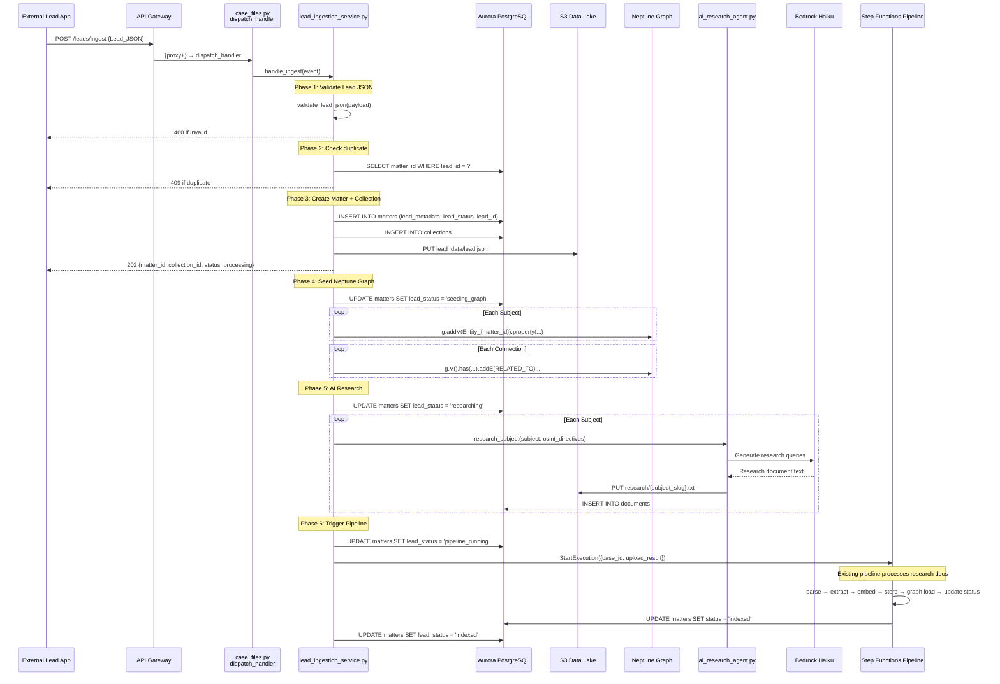
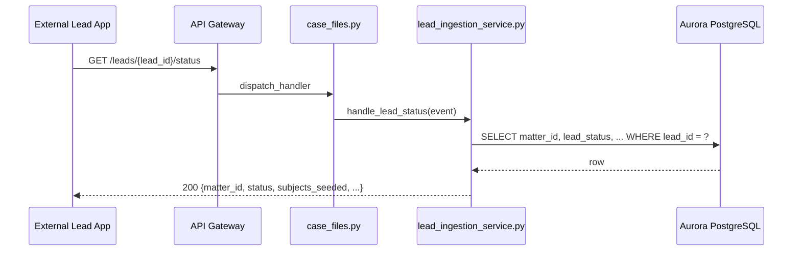
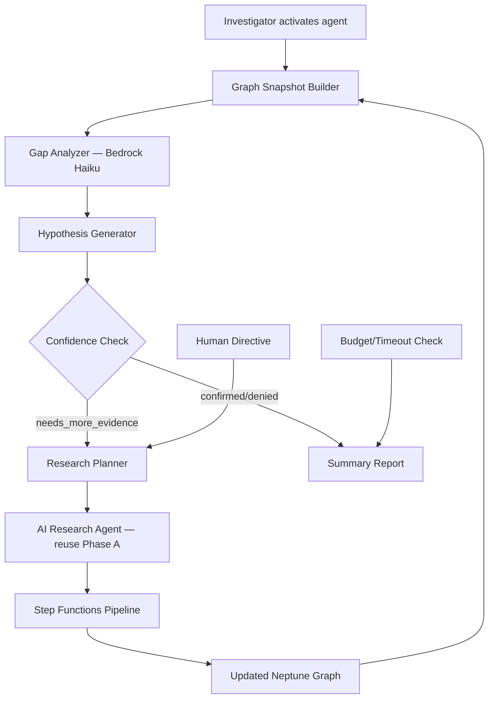

# Design Document — Lead to Investigation

## Overview

This design covers the Lead-to-Investigation feature, which enables the Research Analyst platform to accept structured lead JSON from an external lead-finding application and automatically create a pre-populated investigation case. The feature spans two phases:

- **Phase A (Lead Ingestion + AI Research):** Accept lead JSON via `POST /leads/ingest`, validate it, create a Matter/Collection in Aurora, seed Neptune with subjects and connections, run an AI Research Agent (Bedrock Haiku) to produce synthetic research documents per subject, feed those documents through the existing Step Functions ingestion pipeline, and present the investigator with a pre-populated conspiracy graph.

- **Phase C (Autonomous Investigation Agent):** A long-running agent that analyzes the Neptune graph, identifies gaps, generates and scores hypotheses, plans and executes research tasks in a loop, and suggests next investigative steps. Phase C is described at a high level — the user will implement it independently.

### Key Design Decisions

1. **Extend, never replace.** All changes add new modules and routes. Existing `case_files.py`, `matter_service.py`, `collection_service.py`, `neptune_graph_loader.py`, and the Step Functions pipeline remain untouched.
2. **Single Lambda dispatcher.** New `/leads/*` and `/matters/{id}/lead` routes are added to `case_files.py` `_normalize_resource()` and `dispatch_handler()` — no new Lambda functions.
3. **Neptune HTTP API for graph seeding.** Lead subjects and connections are written to Neptune via the same `_gremlin_http()` pattern used in `graph_load_handler.py` — no WebSocket dependency.
4. **Bedrock Haiku for AI Research.** Model ID `anthropic.claude-3-haiku-20240307-v1:0` — consistent with the existing `BEDROCK_LLM_MODEL_ID` env var already set in CDK.
5. **Reuse existing pipeline.** Research documents are registered in Aurora `documents` table and processed through the existing Step Functions pipeline (parse → extract → embed → store artifact → graph load → update status).
6. **Additive migration only.** Migration `008_lead_to_investigation.sql` adds three columns to `matters` — no existing columns or tables are modified.

---

## Architecture

### System Flow Diagram



### Lead Status Polling Flow



---

## Components and Interfaces

### New Modules

#### 1. `src/services/lead_ingestion_service.py` — Lead Ingestion Service

Orchestrates the entire lead-to-investigation flow: validation, Aurora record creation, S3 storage, Neptune seeding, AI research, and pipeline triggering.

```python
class LeadIngestionService:
    def __init__(self, connection_manager, matter_service, collection_service):
        """Initialize with existing Aurora CM, MatterService, CollectionService."""

    def validate_lead_json(self, payload: dict) -> list[str]:
        """Validate lead JSON against schema. Returns list of error messages (empty = valid).
        
        Checks:
        - Required fields: lead_id, classification, title, summary, subjects, connections
        - subjects array has >= 1 entry
        - Each subject has non-empty name and type in {person, organization}
        - Each connection references existing subject names via from/to
        - confidence values are 0.0-1.0
        """

    def check_duplicate(self, lead_id: str) -> str | None:
        """Check if lead_id already ingested. Returns matter_id if duplicate, None otherwise."""

    def ingest_lead(self, payload: dict) -> dict:
        """Full orchestration: validate → create matter/collection → seed graph → research → pipeline.
        
        Returns: {matter_id, collection_id, status, lead_id}
        Raises: ValueError for validation failures, ConflictError for duplicates.
        """

    def create_matter_from_lead(self, payload: dict, org_id: str) -> tuple[Matter, Collection]:
        """Create Matter + Collection in Aurora from lead JSON.
        
        - Matter: matter_name=title, description=summary, matter_type='lead_investigation'
        - Collection: collection_name='Lead: {lead_id}', source_description from classification
        - Stores lead.json in S3 at collection prefix
        - Sets lead_metadata, lead_status='accepted', lead_id on matter row
        """

    def seed_neptune_graph(self, matter: Matter, payload: dict) -> dict:
        """Create Neptune nodes for subjects and edges for connections.
        
        Returns: {subjects_seeded: int, connections_seeded: int, failures: int}
        Uses Neptune HTTP API (not WebSocket).
        """

    def update_lead_status(self, matter_id: str, org_id: str, status: str, error_details: str = None):
        """Update lead_status and last_activity on the matter row."""

    def get_lead_status(self, lead_id: str) -> dict:
        """Query matter by lead_id, return processing status summary."""

    def get_lead_metadata(self, matter_id: str, org_id: str) -> dict:
        """Return the lead_metadata JSONB from the matter row."""
```

#### 2. `src/services/ai_research_agent.py` — AI Research Agent

Uses Bedrock Haiku to generate synthetic research documents for each subject.

```python
class AIResearchAgent:
    def __init__(self, bedrock_client=None):
        """Initialize with optional Bedrock client (for testing)."""

    def research_subject(
        self, subject: dict, osint_directives: list[str], evidence_hints: list[dict]
    ) -> str:
        """Generate a research document for a single subject.
        
        - Builds a prompt incorporating subject name, type, role, aliases, identifiers
        - Includes OSINT directives and evidence hints
        - Calls Bedrock Haiku with retry (2 retries, exponential backoff)
        - Returns structured research text with sections per information source
        """

    def research_all_subjects(
        self, subjects: list[dict], osint_directives: list[str], evidence_hints: list[dict]
    ) -> list[dict]:
        """Research all subjects sequentially.
        
        Returns: [{subject_name, slug, research_text, success: bool, error: str|None}, ...]
        Continues on individual subject failure.
        """

    def _build_research_prompt(self, subject: dict, osint_directives: list[str], evidence_hints: list[dict]) -> str:
        """Build the Bedrock prompt for subject research."""

    def _call_bedrock(self, prompt: str) -> str:
        """Call Bedrock Haiku with timeout and retry logic.
        
        Model: anthropic.claude-3-haiku-20240307-v1:0
        Max tokens: 4096
        Temperature: 0.3 (factual, low creativity)
        """
```

#### 3. `src/lambdas/api/leads.py` — Lead API Handlers

Thin handler module dispatched from `case_files.py`.

```python
def handle_ingest(event, context) -> dict:
    """POST /leads/ingest — validate and ingest a lead JSON payload."""

def handle_lead_status(event, context) -> dict:
    """GET /leads/{lead_id}/status — return lead processing status."""

def handle_matter_lead(event, context) -> dict:
    """GET /matters/{id}/lead — return lead metadata for a matter."""
```

#### 4. `src/models/lead.py` — Lead Data Models

```python
class LeadSubject(BaseModel):
    name: str
    type: str  # "person" | "organization"
    role: str = ""
    aliases: list[str] = []
    identifiers: dict[str, str] = {}  # e.g. {"ein": "12-3456789", "ssn_last4": "1234"}

class LeadConnection(BaseModel):
    from_subject: str  # field name "from" in JSON, aliased
    to_subject: str    # field name "to" in JSON, aliased
    relationship: str
    confidence: float = Field(ge=0.0, le=1.0, default=0.8)
    source: str = ""

class EvidenceHint(BaseModel):
    description: str
    url: str = ""
    document_type: str = ""
    relevant_subjects: list[str] = []

class LeadJSON(BaseModel):
    lead_id: str
    classification: str
    subcategory: str = ""
    title: str
    summary: str
    source_app: str = ""
    priority: str = "medium"
    subjects: list[LeadSubject] = Field(min_length=1)
    connections: list[LeadConnection] = []
    evidence_hints: list[EvidenceHint] = []
    osint_directives: list[str] = []
    tags: list[str] = []
    statutes: list[str] = []
```

### Extensions to Existing Modules

#### `src/lambdas/api/case_files.py` — Mega-Dispatcher Extensions

Add to `_normalize_resource()`:
- Handle `/leads/{lead_id}/status` → extract `lead_id` path parameter
- Handle `/leads/ingest` → no path parameters needed

Add to `dispatch_handler()`:
```python
# --- Lead routes ---
if path.startswith("/leads/"):
    from lambdas.api.leads import handle_ingest, handle_lead_status
    if path == "/leads/ingest" and method == "POST":
        return handle_ingest(event, context)
    if "/leads/" in path and path.endswith("/status") and method == "GET":
        return handle_lead_status(event, context)

# --- Matter lead metadata ---
# (within existing /matters/ routing block)
if path.endswith("/lead") and "/matters/" in path and method == "GET":
    from lambdas.api.leads import handle_matter_lead
    return handle_matter_lead(event, context)
```

Add to `_normalize_resource()` path parameter extraction:
```python
elif i == 1 and parts[0] == "leads":
    template_parts.append("{lead_id}")
    extracted_params["lead_id"] = part
```

---

## Data Models

### Aurora Schema Changes — Migration `008_lead_to_investigation.sql`

```sql
-- Migration: 008_lead_to_investigation.sql
-- Lead-to-Investigation: adds lead tracking columns to matters table.
-- Additive only — no existing columns or tables are modified or dropped.

BEGIN;

-- 1. Lead metadata (full lead JSON subset stored as JSONB)
ALTER TABLE matters ADD COLUMN IF NOT EXISTS lead_metadata JSONB;

-- 2. Lead processing status (null for non-lead matters)
ALTER TABLE matters ADD COLUMN IF NOT EXISTS lead_status TEXT;

-- 3. Lead ID for lookup (unique index for duplicate detection)
ALTER TABLE matters ADD COLUMN IF NOT EXISTS lead_id TEXT;

-- 4. Unique index on lead_id (allows NULL — only lead-sourced matters have a value)
CREATE UNIQUE INDEX IF NOT EXISTS idx_matters_lead_id ON matters(lead_id) WHERE lead_id IS NOT NULL;

-- 5. Index on lead_status for status queries
CREATE INDEX IF NOT EXISTS idx_matters_lead_status ON matters(lead_status) WHERE lead_status IS NOT NULL;

COMMIT;
```

### Lead Status State Machine

```
accepted → seeding_graph → researching → pipeline_running → indexed
    ↓           ↓              ↓               ↓
  error       error          error           error
```

Each transition updates `lead_status` and `last_activity` on the matter row. On error at any phase, `lead_status` is set to `error` and `error_details` is populated.

### Neptune Graph Seeding Model

Subjects from the lead JSON are seeded as Neptune entity nodes using the existing label convention:

```
Node label:  Entity_{matter_id}
Node properties:
  - canonical_name: Subject.name (String)
  - entity_type: Subject.type (String: "person" | "organization")
  - confidence: 1.0 (Float — lead data is authoritative)
  - occurrence_count: 1 (Integer)
  - case_file_id: matter_id (String)
  - aliases: Subject.aliases (multi-value String, optional)
  - id_*: Subject.identifiers (String properties with "id_" prefix, optional)

Edge label:  RELATED_TO
Edge properties:
  - relationship_type: Connection.relationship (String)
  - confidence: Connection.confidence (Float)
  - source_document_ref: "lead:{lead_id}" (String)
```

This is consistent with the existing Neptune graph model in `db/neptune.py` and `neptune_graph_loader.py`. The `entity_label(matter_id)` function generates the correct label.

### S3 Storage Layout

```
orgs/{org_id}/matters/{matter_id}/collections/{collection_id}/
  ├── lead_data/
  │   └── lead.json              # Original lead JSON payload
  └── research/
      ├── john_doe.txt           # AI research doc for subject "John Doe"
      ├── acme_corp.txt          # AI research doc for subject "ACME Corp"
      └── ...
```

The collection S3 prefix follows the existing `org_matter_collection_prefix()` pattern from `storage/s3_helper.py`.

### Lead JSON Schema

```json
{
  "lead_id": "LEAD-2024-001",
  "classification": "financial_fraud",
  "subcategory": "money_laundering",
  "title": "Suspicious Wire Transfers — ACME Corp Network",
  "summary": "Multiple shell companies linked to ACME Corp showing circular wire transfers...",
  "source_app": "lead-finder-v2",
  "priority": "high",
  "subjects": [
    {
      "name": "John Doe",
      "type": "person",
      "role": "CEO of ACME Corp",
      "aliases": ["J. Doe", "Johnny D"],
      "identifiers": {"ssn_last4": "1234", "dob": "1975-03-15"}
    },
    {
      "name": "ACME Corp",
      "type": "organization",
      "role": "Primary entity under investigation",
      "aliases": ["ACME Corporation", "ACME LLC"],
      "identifiers": {"ein": "12-3456789", "state_reg": "DE-2019-44521"}
    }
  ],
  "connections": [
    {
      "from": "John Doe",
      "to": "ACME Corp",
      "relationship": "executive_control",
      "confidence": 0.95,
      "source": "SEC filing 2023-Q4"
    }
  ],
  "evidence_hints": [
    {
      "description": "SEC Form 10-K filing showing executive compensation",
      "url": "https://www.sec.gov/cgi-bin/browse-edgar?action=getcompany&company=acme",
      "document_type": "sec_filing",
      "relevant_subjects": ["John Doe", "ACME Corp"]
    }
  ],
  "osint_directives": [
    "Search for OFAC/SDN matches for all subjects",
    "Find court records in Delaware and New York for ACME Corp"
  ],
  "tags": ["financial_fraud", "shell_companies", "wire_transfers"],
  "statutes": ["18 USC 1956", "31 USC 5324"]
}
```

### Research Document Format

Each AI-generated research document follows this structure for pipeline compatibility:

```
RESEARCH REPORT: {Subject Name}
Generated: {timestamp}
Lead ID: {lead_id}
Subject Type: {person|organization}

== PUBLIC RECORDS ==
{SEC filings, court records, corporate registrations}

== NEWS AND MEDIA ==
{News articles, press releases}

== REGULATORY ==
{OFAC/SDN matches, sanctions, enforcement actions}

== EVIDENCE HINTS ==
{Descriptions and URLs from lead evidence_hints}

== OSINT FINDINGS ==
{Results from OSINT directive queries}

== CONNECTIONS ==
{Known relationships from lead data}
```

---

## Phase C: Autonomous Investigation Agent (High-Level Architecture)

Phase C is aspirational — the user will implement it independently. This section provides the architectural blueprint.

### Architecture Overview



### Execution Model

The autonomous agent runs as either:
- **Option A: ECS Fargate Task** — long-running container (up to 120 min), triggered via ECS RunTask API from a Lambda endpoint. Suitable for complex investigations with many iterations.
- **Option B: Step Functions Express Workflow** — orchestrates the loop as a state machine with Lambda tasks for each step (snapshot, analyze, plan, research, ingest). Better for cost control and observability.

### Key Components (Phase C)

1. **Graph Snapshot Builder** — Queries Neptune for all entities and edges under the matter's subgraph label, computes centrality scores and community clusters using Gremlin traversals.
2. **Gap Analyzer** — Sends the graph snapshot to Bedrock Haiku with a prompt asking it to identify: entities with few connections, missing expected relationship types, subjects lacking corroborating evidence.
3. **Hypothesis Generator** — Produces scored propositions about connections or patterns, each with supporting evidence references and a list of research tasks needed to confirm/deny.
4. **Research Planner** — Converts hypotheses into concrete research tasks, prioritized by expected information gain. Feeds tasks to the existing AI Research Agent from Phase A.
5. **Loop Controller** — Enforces `max_iterations`, `confidence_threshold`, `max_research_documents`, and `timeout_minutes`. Saves state between iterations for pause/resume.
6. **Human-in-the-Loop API** — `GET /matters/{id}/agent/status` and `POST /matters/{id}/agent/directive` endpoints for investigator oversight.

### State Persistence

Agent state (current iteration, hypotheses, research history) is stored as JSON in S3 at `{matter_s3_prefix}/agent_state/state.json`. This enables pause/resume and crash recovery.

### API Endpoints (Phase C)

| Method | Path | Description |
|--------|------|-------------|
| POST | `/matters/{id}/agent/start` | Start autonomous investigation loop |
| GET | `/matters/{id}/agent/status` | Current iteration, hypotheses, loop state |
| POST | `/matters/{id}/agent/directive` | Add directive, pause, resume, terminate |
| GET | `/matters/{id}/agent/report` | Final or partial summary report |

---

## Correctness Properties

*A property is a characteristic or behavior that should hold true across all valid executions of a system — essentially, a formal statement about what the system should do. Properties serve as the bridge between human-readable specifications and machine-verifiable correctness guarantees.*

### Property 1: Invalid lead JSON is rejected with descriptive errors

*For any* lead JSON payload that is missing one or more required fields (`lead_id`, `classification`, `title`, `summary`, `subjects`, `connections`) or contains fields with invalid types, `validate_lead_json()` should return a non-empty list of error messages, and each error message should reference the specific field that failed validation.

**Validates: Requirements 1.1, 1.2**

### Property 2: Subject validation rejects invalid subjects

*For any* lead JSON payload where any subject has an empty `name` or a `type` value not in `{"person", "organization"}`, `validate_lead_json()` should return an error message referencing the invalid subject.

**Validates: Requirements 1.4**

### Property 3: Connection reference validation

*For any* lead JSON payload where a connection's `from` or `to` field references a subject name not present in the `subjects` array, `validate_lead_json()` should return an error message referencing the dangling connection.

**Validates: Requirements 1.5**

### Property 4: Duplicate lead detection

*For any* `lead_id` that has already been ingested, calling `check_duplicate(lead_id)` should return the existing `matter_id`, and attempting to ingest the same `lead_id` again should result in a 409 response containing that `matter_id`.

**Validates: Requirements 1.3**

### Property 5: Valid lead produces correct response

*For any* valid lead JSON payload (all required fields present, subjects valid, connections reference existing subjects), `ingest_lead()` should return a dict containing `matter_id` (non-empty UUID), `collection_id` (non-empty UUID), and `status` equal to `"processing"`.

**Validates: Requirements 1.6**

### Property 6: Matter and Collection field mapping from lead

*For any* valid lead JSON, the created Matter should have `matter_name` equal to the lead's `title`, `description` equal to the lead's `summary`, and `matter_type` equal to `"lead_investigation"`. The created Collection should have `collection_name` equal to `"Lead: {lead_id}"` and `source_description` containing the lead's `classification`.

**Validates: Requirements 2.1, 2.2**

### Property 7: Lead JSON S3 round-trip

*For any* valid lead JSON payload, serializing it to S3 as `lead_data/lead.json` and then reading it back and parsing should produce a dict with identical `subjects`, `connections`, `evidence_hints`, `osint_directives`, `tags`, and `statutes` arrays.

**Validates: Requirements 2.3, 12.1, 12.3**

### Property 8: Lead metadata Aurora JSONB round-trip

*For any* valid lead JSON payload, extracting the `lead_metadata` subset (`lead_id`, `classification`, `subcategory`, `priority`, `tags`, `statutes`) and storing it as Aurora JSONB, then reading it back, should produce an equivalent dict.

**Validates: Requirements 2.4, 12.2**

### Property 9: Neptune subject node creation

*For any* valid lead JSON with N subjects, after `seed_neptune_graph()` completes, Neptune should contain N entity nodes with label `Entity_{matter_id}`, each with `canonical_name` matching the subject's `name`, `entity_type` matching the subject's `type`, `confidence` equal to 1.0, and `case_file_id` equal to the `matter_id`.

**Validates: Requirements 3.1**

### Property 10: Neptune connection edge creation

*For any* valid lead JSON with M connections, after `seed_neptune_graph()` completes, Neptune should contain M `RELATED_TO` edges, each with `relationship_type` matching the connection's `relationship`, `confidence` matching the connection's `confidence`, and `source_document_ref` equal to `"lead:{lead_id}"`.

**Validates: Requirements 3.2**

### Property 11: Neptune optional properties for aliases and identifiers

*For any* subject with a non-empty `aliases` list, the corresponding Neptune node should have an `aliases` property containing all alias values. *For any* subject with a non-empty `identifiers` dict, the corresponding Neptune node should have properties with `id_` prefix for each key-value pair (e.g., `id_ein`, `id_ssn_last4`).

**Validates: Requirements 3.3, 3.4**

### Property 12: One structured research document per subject

*For any* set of N subjects in a lead, `research_all_subjects()` should return exactly N result entries, each with a `subject_name` matching a subject from the input and a non-empty `research_text` string (for successful subjects).

**Validates: Requirements 4.1, 4.2**

### Property 13: Evidence hints included in research documents

*For any* evidence hint with `relevant_subjects` referencing a subject name, the research document for that subject should contain the evidence hint's `description` string.

**Validates: Requirements 4.3**

### Property 14: Research document S3 storage path

*For any* subject with name `N`, the research document should be stored at S3 key `{collection_s3_prefix}research/{slug(N)}.txt`, where `slug()` converts the name to lowercase with spaces replaced by underscores and non-alphanumeric characters removed.

**Validates: Requirements 4.4**

### Property 15: Research document Aurora registration

*For any* research document stored in S3, a corresponding row should exist in the Aurora `documents` table with `case_file_id` equal to the matter ID, `collection_id` equal to the collection ID, and `source_metadata` containing `{"source": "ai_research_agent", "subject": "<subject_name>", "lead_id": "<lead_id>"}`.

**Validates: Requirements 5.1**

### Property 16: Lead status transitions are valid

*For any* lead processing run, the `lead_status` column should only transition through the valid sequence: `accepted` → `seeding_graph` → `researching` → `pipeline_running` → `indexed`, or to `error` from any state. Each transition should update `last_activity` to a timestamp greater than or equal to the previous value.

**Validates: Requirements 7.1, 7.2**

### Property 17: Error at any phase sets error status

*For any* error that occurs during lead processing (validation, graph seeding, research, pipeline), the matter's `lead_status` should be set to `"error"` and `error_details` should contain a non-empty descriptive message.

**Validates: Requirements 7.3**

---

## Error Handling

### Validation Errors (Phase 1)

| Error | HTTP Status | Error Code | Behavior |
|-------|-------------|------------|----------|
| Missing required field | 400 | `VALIDATION_ERROR` | Return field-level error messages listing all missing/invalid fields |
| Invalid subject type | 400 | `VALIDATION_ERROR` | Return error identifying the invalid subject |
| Dangling connection reference | 400 | `VALIDATION_ERROR` | Return error identifying the connection with invalid from/to |
| Duplicate lead_id | 409 | `CONFLICT` | Return existing matter_id |
| Malformed JSON body | 400 | `VALIDATION_ERROR` | Return "Invalid JSON in request body" |

### Neptune Seeding Errors (Phase 4)

- Individual subject/connection failures are logged and counted but do not halt processing.
- `seed_neptune_graph()` returns `{subjects_seeded, connections_seeded, failures}`.
- If ALL subjects fail, set `lead_status` to `error` with details.
- Neptune HTTP API timeouts use 15-second timeout per query (consistent with `patterns.py`).

### AI Research Errors (Phase 5)

- Bedrock call failures retry up to 2 times with exponential backoff (2s, 4s).
- If all retries fail for a subject, log the error, mark that subject's result as `success: false`, and continue with remaining subjects.
- If ALL subjects fail research, set `lead_status` to `error`.
- Bedrock client uses the same timeout config as existing services: `read_timeout=120`, `connect_timeout=10`, `retries={"max_attempts": 2, "mode": "adaptive"}`.

### Pipeline Errors (Phase 6)

- Step Functions pipeline handles per-document failures internally (existing behavior).
- If the pipeline execution fails entirely, the `update_status_handler` sets the matter status to `error`.
- The lead ingestion service polls or relies on the pipeline's existing status update mechanism.

### General Error Handling Pattern

All handlers use the existing `response_helper.py` pattern:
```python
try:
    result = service.do_thing()
    return success_response(result, 202, event)
except ValueError as exc:
    return error_response(400, "VALIDATION_ERROR", str(exc), event)
except ConflictError as exc:
    return error_response(409, "CONFLICT", str(exc), event)
except Exception as exc:
    logger.exception("Unexpected error")
    return error_response(500, "INTERNAL_ERROR", str(exc), event)
```

---

## Testing Strategy

### Dual Testing Approach

This feature uses both unit tests and property-based tests for comprehensive coverage.

- **Unit tests** verify specific examples, edge cases, integration points, and error conditions.
- **Property-based tests** verify universal properties across randomly generated inputs.

### Property-Based Testing Configuration

- **Library:** [Hypothesis](https://hypothesis.readthedocs.io/) for Python
- **Minimum iterations:** 100 per property test
- **Tag format:** `# Feature: lead-to-investigation, Property {N}: {title}`
- **Each correctness property is implemented by a single property-based test**

### Test Files

| File | Scope |
|------|-------|
| `tests/unit/test_lead_ingestion_service.py` | Lead validation, Matter/Collection creation, status tracking |
| `tests/unit/test_ai_research_agent.py` | Research document generation, Bedrock prompt building |
| `tests/unit/test_lead_models.py` | Pydantic model validation, serialization round-trips |
| `tests/unit/test_leads_handler.py` | API handler routing, request/response format |
| `tests/unit/test_neptune_lead_seeding.py` | Neptune graph seeding logic |

### Property Tests (from Correctness Properties)

Each property test uses Hypothesis strategies to generate random valid/invalid lead JSON payloads:

| Property | Test | Strategy |
|----------|------|----------|
| P1: Invalid lead rejected | Generate payloads with random required fields removed | `st.fixed_dictionaries` with optional field omission |
| P2: Subject validation | Generate subjects with random invalid names/types | `st.text()` for names, `st.sampled_from` for types |
| P3: Connection reference validation | Generate connections with random from/to not in subjects | `st.text()` for subject references |
| P4: Duplicate detection | Generate random lead_ids, ingest twice | `st.text(min_size=1)` for lead_ids |
| P5: Valid lead response | Generate fully valid lead payloads | Composite strategy building valid LeadJSON |
| P6: Matter/Collection mapping | Generate valid leads, verify field mapping | Reuse valid LeadJSON strategy |
| P7: S3 round-trip | Generate valid lead payloads, serialize/deserialize | Composite strategy with all field types |
| P8: JSONB round-trip | Generate lead_metadata subsets, serialize/deserialize | `st.fixed_dictionaries` for metadata fields |
| P9-11: Neptune seeding | Generate subjects with random aliases/identifiers | `st.lists(st.text())` for aliases, `st.dictionaries` for identifiers |
| P12-13: Research documents | Generate subjects with evidence hints | Composite strategy |
| P14: S3 path | Generate subject names with special characters | `st.text()` with unicode |
| P15: Aurora registration | Generate research documents, verify DB rows | Composite strategy |
| P16: Status transitions | Generate sequences of status updates | `st.lists(st.sampled_from(valid_statuses))` |
| P17: Error status | Generate error scenarios at each phase | `st.sampled_from(phases)` |

### Unit Tests (Examples and Edge Cases)

| Test | Type | Description |
|------|------|-------------|
| `test_ingest_valid_lead` | Example | Happy path with a complete lead JSON |
| `test_ingest_empty_subjects` | Edge case | Lead with empty subjects array → 400 |
| `test_ingest_whitespace_title` | Edge case | Lead with whitespace-only title → 400 |
| `test_neptune_partial_failure` | Example | One subject fails Neptune seeding, others succeed |
| `test_bedrock_retry_then_success` | Example | First Bedrock call fails, retry succeeds |
| `test_bedrock_all_retries_fail` | Example | All retries fail, subject marked as failed |
| `test_slug_special_characters` | Edge case | Subject name with unicode/special chars → valid slug |
| `test_migration_008_idempotent` | Example | Running migration twice doesn't error |
| `test_dispatcher_routes_leads` | Example | Verify case_files.py routes /leads/* correctly |
| `test_status_endpoint_returns_correct_fields` | Example | GET /leads/{id}/status returns all required fields |
