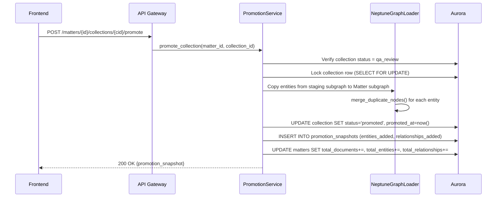

# Design Document: Matter-Collection Hierarchy (Multi-Tenant)

## Overview

This design replaces the flat `case_files` table with a three-level hierarchy — Organization > Matter > Collection > Document — to support multi-tenancy, batch-level provenance, and a QA-before-merge workflow. The current system stores everything in `case_files` with a single `case_id` scoping S3 paths (`cases/{case_id}/`), Neptune subgraph labels (`Entity_{case_id}`), and Aurora rows. This design introduces Organizations as tenant boundaries, converts case_files into Matters (the primary analysis unit), and adds Collections as tracked data loads within a Matter.

### Key Design Decisions

1. **Organizations as row-level security** — Every table gains an `org_id` FK. All queries filter by org_id derived from the authenticated user's JWT claims. No RLS policies in Postgres; filtering is enforced at the service layer to keep Aurora Serverless compatible.
2. **Matter = renamed case_file** — The `matters` table is structurally identical to `case_files` plus `org_id` and `matter_type`. The Neptune subgraph label stays `Entity_{matter_id}` (same convention, new name). All analysis modules continue to operate at this level unchanged.
3. **Collection = tracked data load** — Each upload batch creates a Collection in `staging` status. Processing moves it through `processing` → `qa_review`. An investigator explicitly promotes or rejects. Promotion merges entities into the Matter's Neptune subgraph and recalculates aggregated counts.
4. **Promotion is irreversible** — Once a Collection's entities are merged into the Matter graph, the Collection is marked `promoted` and cannot be un-promoted. The Collection can be archived for record-keeping.
5. **Backward-compatible API** — `/case-files/*` endpoints become aliases for `/matters/*`. The old `case_id` field maps to `matter_id`. Existing frontend code continues to work during migration.
6. **S3 path migration is lazy** — Existing S3 paths (`cases/{case_id}/`) remain readable. New uploads use `orgs/{org_id}/matters/{matter_id}/collections/{collection_id}/raw/`. The S3 helper resolves both path formats.

## Architecture

### High-Level Architecture

```mermaid
graph TB
    subgraph Frontend ["Frontend (investigator.html)"]
        SB[Sidebar: Matters List]
        NM[New Matter Form]
        MV[Matter Detail View]
        CV[Collection Manager]
        NC[New Collection Form]
        QA[QA Review Panel]
    end

    subgraph API ["API Gateway"]
        ORG_API["/organizations"]
        MAT_API["/organizations/{org_id}/matters"]
        COL_API["/matters/{id}/collections"]
        COMPAT["/case-files/* (aliases)"]
    end

    subgraph Services ["Lambda Services"]
        OS[OrganizationService]
        MS[MatterService]
        CS[CollectionService]
        PS[PromotionService]
        IS[IngestionService v2]
        CFS[CaseFileService compat shim]
    end

    subgraph Storage ["Aurora PostgreSQL"]
        ORG_TBL[(organizations)]
        MAT_TBL[(matters)]
        COL_TBL[(collections)]
        DOC_TBL[(documents)]
        SNAP_TBL[(promotion_snapshots)]
    end

    subgraph Graph ["Neptune Serverless"]
        MG[Entity_{matter_id} subgraph]
        CG[Entity_{collection_id} staging subgraph]
    end

    subgraph ObjectStore ["S3 Data Lake"]
        S3_NEW["orgs/{org_id}/matters/{mid}/collections/{cid}/raw/"]
        S3_OLD["cases/{case_id}/ (legacy)"]
    end

    Frontend --> API
    API --> Services
    Services --> Storage
    Services --> Graph
    Services --> ObjectStore
```

### Collection Promotion Flow



## Components and Interfaces

### OrganizationService

Manages tenant CRUD and settings. Thin layer — most deployments have a single org.

```python
class OrganizationService:
    def create_organization(self, org_name: str, settings: dict | None = None) -> Organization: ...
    def get_organization(self, org_id: str) -> Organization: ...
    def update_settings(self, org_id: str, settings: dict) -> Organization: ...
    def list_organizations(self) -> list[Organization]: ...
```

### MatterService

Replaces `CaseFileService` for new code. Wraps the same Aurora/Neptune operations but scoped to org_id.

```python
class MatterService:
    def create_matter(self, org_id: str, matter_name: str, description: str, matter_type: str = "investigation", created_by: str = "") -> Matter: ...
    def get_matter(self, matter_id: str, org_id: str) -> Matter: ...
    def list_matters(self, org_id: str, *, status: str | None = None) -> list[Matter]: ...
    def update_status(self, matter_id: str, org_id: str, status: MatterStatus) -> Matter: ...
    def delete_matter(self, matter_id: str, org_id: str) -> None: ...
    def get_aggregated_counts(self, matter_id: str) -> dict: ...
```

### CollectionService

Manages data load lifecycle from staging through promotion/rejection.

```python
class CollectionService:
    def create_collection(self, matter_id: str, org_id: str, collection_name: str, source_description: str, uploaded_by: str = "") -> Collection: ...
    def get_collection(self, collection_id: str, org_id: str) -> Collection: ...
    def list_collections(self, matter_id: str, org_id: str) -> list[Collection]: ...
    def update_status(self, collection_id: str, org_id: str, status: CollectionStatus) -> Collection: ...
    def reject_collection(self, collection_id: str, org_id: str) -> Collection: ...
```

### PromotionService

Handles the irreversible merge of a Collection's entities into the Matter's Neptune subgraph.

```python
class PromotionService:
    def promote_collection(self, matter_id: str, collection_id: str, org_id: str) -> PromotionSnapshot: ...
    def get_promotion_snapshot(self, collection_id: str) -> PromotionSnapshot: ...
```

### IngestionService v2

Extends the existing `IngestionService` to create a Collection on upload, write to the new S3 path, and load entities into a staging subgraph (`Entity_{collection_id}`) instead of directly into the Matter graph.

```python
class IngestionServiceV2(IngestionService):
    def upload_documents(self, matter_id: str, org_id: str, files: list[tuple[str, bytes]], collection_name: str = "", source_description: str = "") -> tuple[str, list[str]]:
        """Returns (collection_id, document_ids). Creates Collection in staging."""
        ...

    def process_batch(self, collection_id: str, document_ids: list[str]) -> BatchResult:
        """Processes into staging subgraph. Transitions collection to qa_review on success."""
        ...
```

### CaseFileService Compatibility Shim

A thin adapter that maps old `case_id`-based calls to `MatterService`, preserving backward compatibility for existing analysis modules.

```python
class CaseFileCompatService:
    """Wraps MatterService to accept case_id (= matter_id) calls from legacy code."""
    def get_case_file(self, case_id: str) -> CaseFile: ...
    def list_case_files(self, **kwargs) -> list[CaseFile]: ...
    def update_status(self, case_id: str, status: CaseFileStatus) -> CaseFile: ...
```

### S3 Helper Updates

```python
# New path builders added to s3_helper.py

def org_matter_collection_prefix(org_id: str, matter_id: str, collection_id: str) -> str:
    """Returns: orgs/{org_id}/matters/{matter_id}/collections/{collection_id}/"""
    ...

def build_collection_key(org_id: str, matter_id: str, collection_id: str, prefix_type: PrefixType, filename: str) -> str:
    """Build S3 key under the new hierarchy path."""
    ...

# Existing case_prefix() and build_key() remain for legacy path resolution.
```

### Neptune Graph Updates

```python
# New label function in db/neptune.py

def collection_staging_label(collection_id: str) -> str:
    """Return staging subgraph label: Entity_{collection_id}"""
    return f"{ENTITY_LABEL_PREFIX}{collection_id}"

# entity_label(matter_id) continues to work — matter_id replaces case_id.
# NODE_PROP_CASE_FILE_ID renamed to NODE_PROP_MATTER_ID in new code,
# but old property name kept for backward compat.
NODE_PROP_MATTER_ID = "matter_id"
NODE_PROP_COLLECTION_ID = "collection_id"
```

## Data Models

### Aurora PostgreSQL Schema

```sql
-- Migration 006: Matter-Collection Hierarchy

-- 1. Organizations table
CREATE TABLE organizations (
    org_id UUID PRIMARY KEY DEFAULT gen_random_uuid(),
    org_name TEXT NOT NULL,
    settings JSONB DEFAULT '{}',
    created_at TIMESTAMPTZ DEFAULT now()
);

-- 2. Matters table (replaces case_files for new code)
CREATE TABLE matters (
    matter_id UUID PRIMARY KEY DEFAULT gen_random_uuid(),
    org_id UUID NOT NULL REFERENCES organizations(org_id),
    matter_name TEXT NOT NULL,
    description TEXT NOT NULL DEFAULT '',
    status TEXT NOT NULL DEFAULT 'created',
    matter_type TEXT NOT NULL DEFAULT 'investigation',
    created_by TEXT DEFAULT '',
    created_at TIMESTAMPTZ DEFAULT now(),
    last_activity TIMESTAMPTZ DEFAULT now(),
    s3_prefix TEXT NOT NULL,
    neptune_subgraph_label TEXT NOT NULL,
    total_documents INTEGER DEFAULT 0,
    total_entities INTEGER DEFAULT 0,
    total_relationships INTEGER DEFAULT 0,
    search_tier TEXT DEFAULT 'standard',
    error_details TEXT
);
CREATE INDEX idx_matters_org_id ON matters(org_id);
CREATE INDEX idx_matters_status ON matters(status);

-- 3. Collections table
CREATE TABLE collections (
    collection_id UUID PRIMARY KEY DEFAULT gen_random_uuid(),
    matter_id UUID NOT NULL REFERENCES matters(matter_id),
    org_id UUID NOT NULL REFERENCES organizations(org_id),
    collection_name TEXT NOT NULL,
    source_description TEXT DEFAULT '',
    status TEXT NOT NULL DEFAULT 'staging',
    document_count INTEGER DEFAULT 0,
    entity_count INTEGER DEFAULT 0,
    relationship_count INTEGER DEFAULT 0,
    uploaded_by TEXT DEFAULT '',
    uploaded_at TIMESTAMPTZ DEFAULT now(),
    promoted_at TIMESTAMPTZ,
    chain_of_custody JSONB DEFAULT '[]',
    s3_prefix TEXT NOT NULL
);
CREATE INDEX idx_collections_matter_id ON collections(matter_id);
CREATE INDEX idx_collections_org_id ON collections(org_id);
CREATE INDEX idx_collections_status ON collections(status);

-- 4. Add org_id, collection_id, matter_id to documents
ALTER TABLE documents ADD COLUMN IF NOT EXISTS org_id UUID REFERENCES organizations(org_id);
ALTER TABLE documents ADD COLUMN IF NOT EXISTS matter_id UUID REFERENCES matters(matter_id);
ALTER TABLE documents ADD COLUMN IF NOT EXISTS collection_id UUID REFERENCES collections(collection_id);

-- 5. Promotion snapshots
CREATE TABLE promotion_snapshots (
    snapshot_id UUID PRIMARY KEY DEFAULT gen_random_uuid(),
    collection_id UUID NOT NULL REFERENCES collections(collection_id),
    matter_id UUID NOT NULL REFERENCES matters(matter_id),
    entities_added INTEGER NOT NULL DEFAULT 0,
    relationships_added INTEGER NOT NULL DEFAULT 0,
    promoted_at TIMESTAMPTZ DEFAULT now(),
    promoted_by TEXT DEFAULT ''
);

-- 6. Migration: create default org, convert case_files to matters + collections
-- (See migration script in tasks)
```

### Pydantic Models

```python
class Organization(BaseModel):
    org_id: str
    org_name: str
    settings: dict = Field(default_factory=dict)
    created_at: datetime

class MatterStatus(str, Enum):
    CREATED = "created"
    INGESTING = "ingesting"
    INDEXED = "indexed"
    INVESTIGATING = "investigating"
    ARCHIVED = "archived"
    ERROR = "error"

class Matter(BaseModel):
    matter_id: str
    org_id: str
    matter_name: str
    description: str
    status: MatterStatus = MatterStatus.CREATED
    matter_type: str = "investigation"
    created_by: str = ""
    created_at: datetime
    last_activity: datetime | None = None
    s3_prefix: str
    neptune_subgraph_label: str
    total_documents: int = Field(default=0, ge=0)
    total_entities: int = Field(default=0, ge=0)
    total_relationships: int = Field(default=0, ge=0)
    search_tier: str = "standard"
    error_details: str | None = None

class CollectionStatus(str, Enum):
    STAGING = "staging"
    PROCESSING = "processing"
    QA_REVIEW = "qa_review"
    PROMOTED = "promoted"
    REJECTED = "rejected"
    ARCHIVED = "archived"

class Collection(BaseModel):
    collection_id: str
    matter_id: str
    org_id: str
    collection_name: str
    source_description: str = ""
    status: CollectionStatus = CollectionStatus.STAGING
    document_count: int = Field(default=0, ge=0)
    entity_count: int = Field(default=0, ge=0)
    relationship_count: int = Field(default=0, ge=0)
    uploaded_by: str = ""
    uploaded_at: datetime
    promoted_at: datetime | None = None
    chain_of_custody: list[dict] = Field(default_factory=list)
    s3_prefix: str

class PromotionSnapshot(BaseModel):
    snapshot_id: str
    collection_id: str
    matter_id: str
    entities_added: int = 0
    relationships_added: int = 0
    promoted_at: datetime
    promoted_by: str = ""
```

### Neptune Graph Schema Changes

| Property | Current | New |
|---|---|---|
| Node label | `Entity_{case_id}` | `Entity_{matter_id}` (same convention) |
| Staging label | N/A | `Entity_{collection_id}` (temporary, pre-promotion) |
| `case_file_id` property | On every node | Kept for compat; new nodes also get `matter_id` + `collection_id` |

Promotion copies nodes from `Entity_{collection_id}` → `Entity_{matter_id}`, merging duplicates via `merge_duplicate_nodes()`, then drops the staging subgraph.

### API Endpoints

| Method | Path | Description |
|---|---|---|
| GET/POST | `/organizations` | List/create organizations |
| GET/PATCH | `/organizations/{id}` | Get/update organization |
| GET/POST | `/organizations/{org_id}/matters` | List/create matters for org |
| GET/PUT/DELETE | `/matters/{id}` | Matter CRUD |
| GET/POST | `/matters/{id}/collections` | List/create collections |
| GET | `/matters/{id}/collections/{cid}` | Get collection detail |
| POST | `/matters/{id}/collections/{cid}/promote` | Promote collection |
| POST | `/matters/{id}/collections/{cid}/reject` | Reject collection |
| * | `/case-files/*` | Backward-compatible aliases → `/matters/*` |


### Frontend Create Flows

The investigator.html sidebar includes a "+ New" button that opens an inline form for creating Matters. The Collections tab within a Matter includes a "+ New Collection" button for creating Collections.

#### New Matter Form (sidebar)
- Fields: matter_name (text), description (text), matter_type (select: investigation, contract_review, audit, litigation)
- Action: `POST /organizations/{org_id}/matters` with `{matter_name, description, matter_type}`
- On success: refreshes sidebar list, auto-selects the new Matter

#### New Collection Form (Collections tab)
- Fields: collection_name (text), source_description (text)
- Action: `POST /matters/{id}/collections?org_id={org_id}` with `{collection_name, source_description}`
- On success: refreshes Collections list, new Collection appears in "staging" status

#### End-to-End Workload Flow (e.g. 500TB DOJ load)
1. Click "+ New" in sidebar → create Matter "DOJ Full Release"
2. Click into Matter → Collections tab → "+ New Collection" → create "Batch 1 - 50TB"
3. Stream files into Collection's S3 path via ingestion pipeline
4. Processing completes → Collection transitions to qa_review
5. Review extraction quality → click "Promote" to merge into Matter graph
6. Repeat steps 2-5 for additional batches
## Correctness Properties

*A property is a characteristic or behavior that should hold true across all valid executions of a system — essentially, a formal statement about what the system should do. Properties serve as the bridge between human-readable specifications and machine-verifiable correctness guarantees.*

### Property 1: Entity creation round trip

*For any* valid organization, matter, or collection, creating it and then retrieving it by ID should return an object with all required fields populated and matching the input values.

**Validates: Requirements 1.1, 2.1, 3.1**

### Property 2: Org-id propagation through hierarchy

*For any* matter, collection, or document created within an organization, the `org_id` field must be non-null and reference the parent organization. For any document created within a collection, `matter_id` and `collection_id` must also be populated.

**Validates: Requirements 1.2, 4.1**

### Property 3: Tenant data isolation

*For any* two distinct organizations A and B, querying matters, collections, or documents scoped to org A must never return data belonging to org B, and vice versa.

**Validates: Requirements 1.3**

### Property 4: Organization settings round trip

*For any* valid JSONB settings object (containing `default_pipeline_config`, `display_labels`, `modules_enabled`), storing it on an organization and retrieving it should produce an equivalent object.

**Validates: Requirements 1.4, 9.2**

### Property 5: Neptune subgraph label format

*For any* matter_id string, `entity_label(matter_id)` must produce `Entity_{matter_id}`. After promoting multiple collections into the same matter, all entity nodes in Neptune must share the label `Entity_{matter_id}`.

**Validates: Requirements 2.3**

### Property 6: Matter aggregated counts equal sum of promoted collections

*For any* matter with N promoted collections, the matter's `total_documents`, `total_entities`, and `total_relationships` must equal the sum of those counts across all promoted collections.

**Validates: Requirements 2.4, 5.2, 7.4**

### Property 7: Collection status state machine

*For any* collection, its status must be one of {staging, processing, qa_review, promoted, rejected, archived}. Setting an invalid status must raise an error. A newly uploaded collection must start in "staging". After processing completes, the collection must transition to "qa_review".

**Validates: Requirements 3.2, 3.3, 3.4**

### Property 8: S3 prefix format

*For any* org_id, matter_id, and collection_id, the generated S3 prefix must match the pattern `orgs/{org_id}/matters/{matter_id}/collections/{collection_id}/raw/`.

**Validates: Requirements 3.5, 10.1**

### Property 9: Promotion merges entities into matter graph

*For any* collection in "qa_review" status with N entities and M relationships, promoting it must result in all N entities and M relationships appearing in the Matter's Neptune subgraph (after deduplication, entity count may be ≤ N).

**Validates: Requirements 5.1**

### Property 10: Promotion snapshot accuracy

*For any* promotion operation, the resulting `PromotionSnapshot` must record `entities_added` and `relationships_added` counts that match the actual number of entities and relationships merged into the Matter graph, and `promoted_at` must be non-null.

**Validates: Requirements 5.3**

### Property 11: Promotion irreversibility

*For any* collection with status "promoted", attempting to change its status to "staging", "processing", or "qa_review" must fail with an error. The collection may only transition to "archived".

**Validates: Requirements 5.4**

### Property 12: Rejection does not merge entities

*For any* collection in "qa_review" status, rejecting it must leave the Matter's entity count, relationship count, and Neptune subgraph unchanged compared to before the rejection.

**Validates: Requirements 5.5**

### Property 13: Migration preserves data and labels

*For any* set of pre-migration case_files rows, after migration: (a) each unique topic_name maps to exactly one Matter, (b) each case_files row maps to exactly one Collection under the correct Matter, (c) all document, entity, and relationship data is preserved, and (d) Neptune subgraph labels remain unchanged.

**Validates: Requirements 6.2, 6.3, 6.4, 6.5**

### Property 14: Backward-compatible API alias

*For any* matter_id, a request to `/case-files/{matter_id}` must return an equivalent response to `/matters/{matter_id}`, with `case_id` mapped to `matter_id` and `topic_name` mapped to `matter_name`.

**Validates: Requirements 8.2**

### Property 15: Collection CRUD round trip

*For any* valid collection, the sequence create → get → list (filtered by matter_id) must return consistent data. The created collection must appear in the list, and get must return matching fields.

**Validates: Requirements 8.3**

### Property 16: Legacy S3 path resolution

*For any* document stored at a legacy S3 path (`cases/{case_id}/raw/{filename}`), the system must still be able to resolve and download the file after migration.

**Validates: Requirements 10.2**

## Error Handling

| Scenario | Behavior |
|---|---|
| Create matter with missing org_id | Return 400 with "org_id is required" |
| Query with invalid org_id (no matching org) | Return 404 "Organization not found" |
| Cross-org access attempt (org_id mismatch) | Return 403 "Access denied" |
| Promote collection not in qa_review | Return 409 "Collection must be in qa_review status to promote" |
| Promote already-promoted collection | Return 409 "Collection already promoted" |
| Reject already-promoted collection | Return 409 "Cannot reject a promoted collection" |
| Set invalid collection status | Return 400 with valid status enum list |
| Neptune bulk load failure during promotion | Roll back collection status to qa_review, return 500 with details |
| S3 upload failure during ingestion | Collection stays in staging, return 500 |
| Migration encounters orphaned documents | Log warning, assign to a "default" collection within the matter |
| Legacy S3 path not found | Fall back to new path format, return 404 if neither exists |

### Promotion Error Recovery

Promotion is the most critical operation. If Neptune loading fails mid-promotion:
1. The collection status remains `qa_review` (not updated until success)
2. Any partially-loaded entities in the staging subgraph are cleaned up
3. The promotion can be retried
4. A `promotion_snapshots` row is only created on full success

## Testing Strategy

### Unit Tests

Unit tests cover specific examples and edge cases:
- Organization CRUD with valid/invalid inputs
- Matter creation with missing fields
- Collection status transition validation (valid and invalid transitions)
- Promotion of a collection with zero entities (edge case)
- Rejection of an already-promoted collection (error case)
- S3 prefix generation with special characters in IDs
- Migration script with empty case_files table (edge case)
- Backward-compatible API response field mapping
- Neptune label generation

### Property-Based Tests

Property-based tests use **Hypothesis** (Python) with minimum 100 iterations per property. Each test references its design document property.

| Test | Property | Tag |
|---|---|---|
| test_entity_creation_round_trip | Property 1 | Feature: matter-collection-hierarchy, Property 1: Entity creation round trip |
| test_org_id_propagation | Property 2 | Feature: matter-collection-hierarchy, Property 2: Org-id propagation through hierarchy |
| test_tenant_isolation | Property 3 | Feature: matter-collection-hierarchy, Property 3: Tenant data isolation |
| test_org_settings_round_trip | Property 4 | Feature: matter-collection-hierarchy, Property 4: Organization settings round trip |
| test_neptune_label_format | Property 5 | Feature: matter-collection-hierarchy, Property 5: Neptune subgraph label format |
| test_matter_aggregated_counts | Property 6 | Feature: matter-collection-hierarchy, Property 6: Matter aggregated counts equal sum of promoted collections |
| test_collection_status_state_machine | Property 7 | Feature: matter-collection-hierarchy, Property 7: Collection status state machine |
| test_s3_prefix_format | Property 8 | Feature: matter-collection-hierarchy, Property 8: S3 prefix format |
| test_promotion_merges_entities | Property 9 | Feature: matter-collection-hierarchy, Property 9: Promotion merges entities into matter graph |
| test_promotion_snapshot_accuracy | Property 10 | Feature: matter-collection-hierarchy, Property 10: Promotion snapshot accuracy |
| test_promotion_irreversibility | Property 11 | Feature: matter-collection-hierarchy, Property 11: Promotion irreversibility |
| test_rejection_no_merge | Property 12 | Feature: matter-collection-hierarchy, Property 12: Rejection does not merge entities |
| test_migration_preserves_data | Property 13 | Feature: matter-collection-hierarchy, Property 13: Migration preserves data and labels |
| test_backward_compat_alias | Property 14 | Feature: matter-collection-hierarchy, Property 14: Backward-compatible API alias |
| test_collection_crud_round_trip | Property 15 | Feature: matter-collection-hierarchy, Property 15: Collection CRUD round trip |
| test_legacy_s3_resolution | Property 16 | Feature: matter-collection-hierarchy, Property 16: Legacy S3 path resolution |

### Test Configuration

```python
from hypothesis import given, settings, strategies as st

@settings(max_examples=100)
@given(org_name=st.text(min_size=1, max_size=200))
def test_entity_creation_round_trip(org_name):
    # Feature: matter-collection-hierarchy, Property 1: Entity creation round trip
    ...
```
