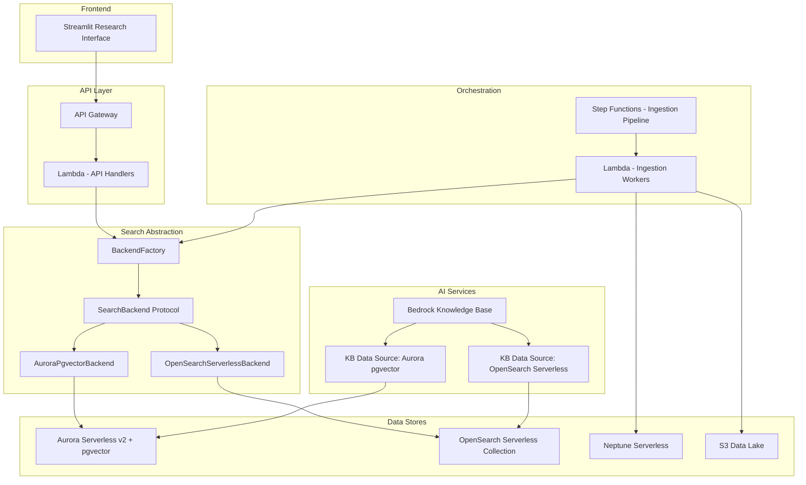
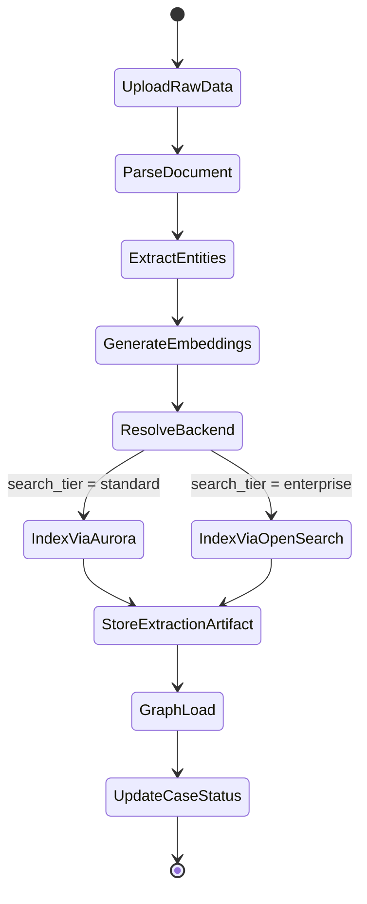
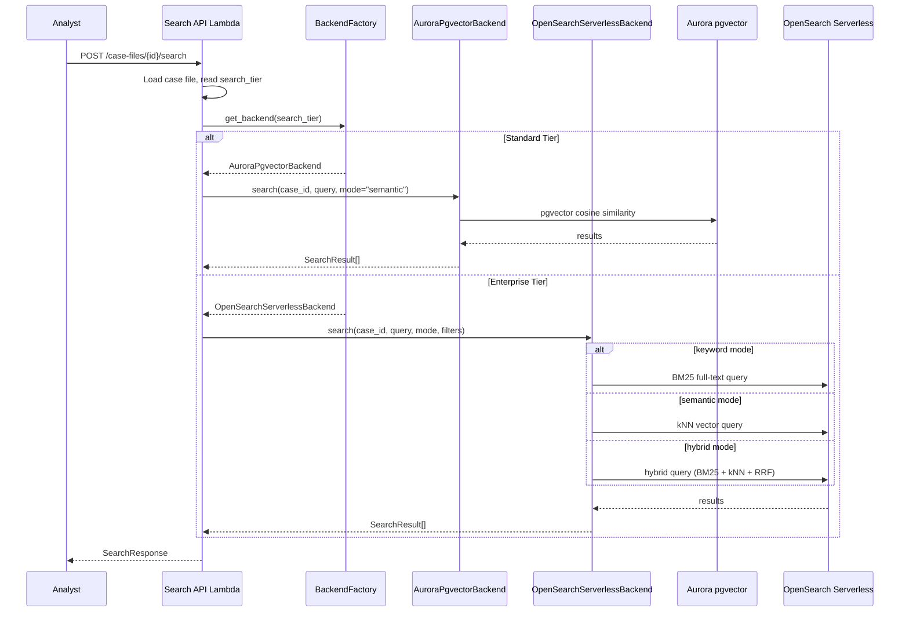

# Design Document: Multi-Backend Search

## Overview

The Multi-Backend Search feature introduces a pluggable search backend architecture to the Research Analyst Platform. Today, all search and indexing flows through Aurora Serverless v2 with pgvector via Bedrock Knowledge Bases. This design adds OpenSearch Serverless as a second backend tier, selected per case file at creation time, enabling enterprise-scale full-text search, hybrid (keyword + vector) search, and faceted filtering for large investigations.

The core abstraction is a `SearchBackend` Python Protocol with three operations: `index_documents`, `search`, and `delete_documents`. Two implementations — `AuroraPgvectorBackend` (wrapping existing logic) and `OpenSearchServerlessBackend` — are resolved at runtime by a `BackendFactory` keyed on the case file's `search_tier` attribute. This keeps all upstream code (ingestion pipeline, search API, pattern discovery) backend-agnostic.

### Key Design Decisions

1. **Protocol-based abstraction** — Using Python's `typing.Protocol` (structural subtyping) rather than ABC inheritance. This lets the existing Aurora code satisfy the protocol without modification to its class hierarchy, and keeps the contract lightweight.
2. **Tier immutability** — `search_tier` is set at case file creation and cannot be changed. Migrating indexed data between backends mid-investigation is error-prone and expensive. If an analyst needs to upgrade, they create a new enterprise-tier case and re-ingest.
3. **OpenSearch Serverless over provisioned OpenSearch** — Serverless collections auto-scale compute and storage independently. When no enterprise cases exist, indexing OCUs drop to zero (after the minimum billing period). This aligns with the platform's serverless-first philosophy.
4. **Hybrid search via OpenSearch compound queries** — Rather than implementing a custom merge/re-rank layer, we use OpenSearch's native `hybrid` query type which combines BM25 keyword scoring with kNN vector scoring in a single request, using reciprocal rank fusion (RRF) for result merging.
5. **Dual Bedrock Knowledge Base data sources** — Standard tier continues using the existing Aurora pgvector KB data source. Enterprise tier uses a separate KB data source backed by the OpenSearch Serverless collection. Both share the same Bedrock Knowledge Base resource, just different data source configurations.
6. **Additive, non-breaking change** — Existing case files default to `search_tier = "standard"`. No data migration required. The Aurora backend path is unchanged.

## Architecture

### High-Level Architecture (with Multi-Backend)



### Ingestion Pipeline Flow (with Backend Routing)



### Search Request Flow



## Components and Interfaces

### 1. SearchBackend Protocol

The core abstraction. All search/indexing operations go through this interface.

```python
# src/services/search_backend.py

from typing import Protocol, Optional, runtime_checkable
from models.search import SearchResult


class FacetedFilter:
    """Filter criteria for enterprise-tier faceted search."""
    date_from: Optional[str] = None
    date_to: Optional[str] = None
    person: Optional[str] = None
    document_type: Optional[str] = None
    entity_type: Optional[str] = None


class IndexDocumentRequest:
    """Payload for indexing a single document into a search backend."""
    document_id: str
    case_file_id: str
    text: str
    embedding: list[float]
    metadata: dict  # source_filename, entity_types, persons, dates, etc.


@runtime_checkable
class SearchBackend(Protocol):
    """Protocol defining the contract for search backend implementations."""

    def index_documents(
        self,
        case_id: str,
        documents: list[IndexDocumentRequest],
    ) -> int:
        """Index one or more documents. Returns count of successfully indexed docs."""
        ...

    def search(
        self,
        case_id: str,
        query: str,
        *,
        mode: str = "semantic",          # "semantic" | "keyword" | "hybrid"
        embedding: Optional[list[float]] = None,
        filters: Optional[FacetedFilter] = None,
        top_k: int = 10,
    ) -> list[SearchResult]:
        """Search indexed documents. Returns results sorted by relevance."""
        ...

    def delete_documents(
        self,
        case_id: str,
        document_ids: Optional[list[str]] = None,
    ) -> int:
        """Delete indexed documents for a case. If document_ids is None, delete all for the case.
        Returns count of deleted documents."""
        ...

    @property
    def supported_modes(self) -> list[str]:
        """Return the search modes this backend supports."""
        ...
```

### 2. AuroraPgvectorBackend

Wraps the existing Aurora pgvector search logic behind the `SearchBackend` protocol. No behavioral changes — this is a thin adapter.

```python
# src/services/aurora_pgvector_backend.py

class AuroraPgvectorBackend:
    """SearchBackend implementation using Aurora Serverless v2 + pgvector.

    Supports semantic (vector similarity) search only.
    Delegates to the existing ConnectionManager for database access.
    """

    def __init__(self, connection_manager: ConnectionManager) -> None:
        self._db = connection_manager

    @property
    def supported_modes(self) -> list[str]:
        return ["semantic"]

    def index_documents(self, case_id: str, documents: list[IndexDocumentRequest]) -> int:
        """Store document embeddings in the Aurora documents table.
        Uses INSERT ... ON CONFLICT for idempotent upserts."""
        ...

    def search(self, case_id: str, query: str, *, mode: str = "semantic",
               embedding: list[float] | None = None,
               filters: FacetedFilter | None = None, top_k: int = 10) -> list[SearchResult]:
        """Cosine similarity search via pgvector. Raises ValueError if mode != 'semantic'."""
        ...

    def delete_documents(self, case_id: str, document_ids: list[str] | None = None) -> int:
        """Delete from Aurora documents table by case_id and optional document_ids."""
        ...
```

### 3. OpenSearchServerlessBackend

Full-featured enterprise backend supporting keyword, semantic, and hybrid search with faceted filtering.

```python
# src/services/opensearch_serverless_backend.py

class OpenSearchServerlessBackend:
    """SearchBackend implementation using OpenSearch Serverless.

    Supports semantic, keyword, and hybrid search modes.
    Each case file gets its own OpenSearch index: 'case-{case_id}'.
    """

    def __init__(self, opensearch_client, collection_endpoint: str) -> None:
        self._client = opensearch_client
        self._endpoint = collection_endpoint

    @property
    def supported_modes(self) -> list[str]:
        return ["semantic", "keyword", "hybrid"]

    def index_documents(self, case_id: str, documents: list[IndexDocumentRequest]) -> int:
        """Bulk index documents into OpenSearch. Creates the index if it doesn't exist.
        Each document is stored with:
          - text field (for BM25 keyword search)
          - embedding field (knn_vector for semantic search)
          - metadata fields (for faceted filtering)
        """
        ...

    def search(self, case_id: str, query: str, *, mode: str = "semantic",
               embedding: list[float] | None = None,
               filters: FacetedFilter | None = None, top_k: int = 10) -> list[SearchResult]:
        """Execute search based on mode:
          - 'keyword': BM25 full-text match on text field
          - 'semantic': kNN on embedding field
          - 'hybrid': compound query combining BM25 + kNN with RRF normalization
        Applies faceted filters as OpenSearch bool filter clauses."""
        ...

    def delete_documents(self, case_id: str, document_ids: list[str] | None = None) -> int:
        """Delete documents from the case's OpenSearch index.
        If document_ids is None, delete the entire index."""
        ...

    def _ensure_index(self, case_id: str) -> None:
        """Create the OpenSearch index with the correct mappings if it doesn't exist."""
        ...

    def _build_index_mapping(self) -> dict:
        """Return the OpenSearch index mapping with text, knn_vector, and metadata fields."""
        ...
```

### 4. BackendFactory

Resolves the correct `SearchBackend` from a tier string. Constructed once per Lambda cold start with both backend instances.

```python
# src/services/backend_factory.py

from enum import Enum


class SearchTier(str, Enum):
    STANDARD = "standard"
    ENTERPRISE = "enterprise"


class BackendFactory:
    """Factory that resolves SearchBackend implementations by tier."""

    def __init__(
        self,
        aurora_backend: AuroraPgvectorBackend,
        opensearch_backend: OpenSearchServerlessBackend,
    ) -> None:
        self._backends = {
            SearchTier.STANDARD: aurora_backend,
            SearchTier.ENTERPRISE: opensearch_backend,
        }

    def get_backend(self, tier: str | SearchTier) -> SearchBackend:
        """Return the SearchBackend for the given tier.
        Raises ValueError for unknown tiers."""
        if isinstance(tier, str):
            tier = SearchTier(tier)
        backend = self._backends.get(tier)
        if backend is None:
            raise ValueError(f"Unknown search tier: {tier}")
        return backend

    def validate_search_mode(self, tier: str | SearchTier, mode: str) -> None:
        """Raise ValueError if the mode is not supported by the tier's backend."""
        backend = self.get_backend(tier)
        if mode not in backend.supported_modes:
            raise ValueError(
                f"Search mode '{mode}' is not available for {tier} tier. "
                f"Available modes: {backend.supported_modes}"
            )
```

### 5. Updated SemanticSearchService

The existing `SemanticSearchService` is extended to use the `BackendFactory` for direct search operations, while continuing to use Bedrock Knowledge Base for AI-assisted analysis.

```python
# src/services/semantic_search_service.py (updated)

class SemanticSearchService:
    """Extended to support multi-backend search routing."""

    def __init__(
        self,
        bedrock_agent_runtime_client,
        knowledge_base_id: str,
        backend_factory: BackendFactory,
        case_file_service: CaseFileService,
        bedrock_client=None,           # for embedding generation
        embedding_model_id: str = "amazon.titan-embed-text-v2:0",
        agent_id: str = "",
        agent_alias_id: str = "TSTALIASID",
        enterprise_knowledge_base_id: str = "",
    ) -> None:
        ...

    def search(
        self,
        case_id: str,
        query: str,
        *,
        mode: str = "semantic",
        filters: FacetedFilter | None = None,
        top_k: int = 10,
    ) -> list[SearchResult]:
        """Route search to the correct backend based on case file tier.
        Generates embedding for semantic/hybrid modes, then delegates to backend."""
        case_file = self._case_service.get_case_file(case_id)
        tier = case_file.search_tier

        self._backend_factory.validate_search_mode(tier, mode)

        embedding = None
        if mode in ("semantic", "hybrid"):
            embedding = self._generate_embedding(query)

        backend = self._backend_factory.get_backend(tier)
        return backend.search(
            case_id, query, mode=mode, embedding=embedding,
            filters=filters, top_k=top_k,
        )

    def _resolve_kb_id(self, tier: str) -> str:
        """Return the correct Bedrock Knowledge Base ID for the tier."""
        if tier == SearchTier.ENTERPRISE and self._enterprise_kb_id:
            return self._enterprise_kb_id
        return self._knowledge_base_id
```

### 6. Updated IngestionService

The ingestion service resolves the backend via `BackendFactory` and calls `index_documents` instead of directly writing to Aurora.

```python
# src/services/ingestion_service.py (updated process_document)

def process_document(self, case_id: str, document_id: str) -> ExtractionResult:
    """Extended to route indexing through the SearchBackend."""
    # ... existing parse + extract steps unchanged ...

    # Generate embedding
    embedding = self._generate_embedding(parsed.raw_text)

    # Build index request
    index_req = IndexDocumentRequest(
        document_id=document_id,
        case_file_id=case_id,
        text=parsed.raw_text,
        embedding=embedding,
        metadata={
            "source_filename": parsed.source_metadata.get("filename", ""),
            "sections": parsed.sections,
        },
    )

    # Route to correct backend
    case_file = self._case_service.get_case_file(case_id)
    backend = self._backend_factory.get_backend(case_file.search_tier)
    backend.index_documents(case_id, [index_req])

    # ... rest unchanged (store artifact, return result) ...
```

### 7. Updated Search API Lambda

```python
# src/lambdas/api/search.py (updated)

def search_handler(event, context):
    """Extended to accept search_mode and filters parameters."""
    body = json.loads(event.get("body") or "{}")
    case_id = event["pathParameters"]["id"]

    query = body.get("query", "")
    mode = body.get("search_mode", "semantic")
    top_k = body.get("top_k", 10)
    filters_raw = body.get("filters")

    filters = None
    if filters_raw:
        filters = FacetedFilter(**filters_raw)

    # Load case to include tier info in response
    case_file = case_service.get_case_file(case_id)
    backend = backend_factory.get_backend(case_file.search_tier)

    try:
        results = search_service.search(
            case_id, query, mode=mode, filters=filters, top_k=top_k,
        )
    except ValueError as exc:
        return error_response(400, "UNSUPPORTED_MODE", str(exc), event)

    return success_response({
        "results": [r.model_dump(mode="json") for r in results],
        "search_tier": case_file.search_tier,
        "available_modes": backend.supported_modes,
    }, 200, event)
```

### 8. OpenSearch Serverless CDK Provisioning

```python
# infra/cdk/stacks/research_analyst_stack.py (additions)

def _create_opensearch_serverless(self) -> tuple:
    """Provision OpenSearch Serverless collection for enterprise tier.

    Creates:
    - Encryption policy (AWS-owned key)
    - Network policy (VPC access)
    - Data access policy (Lambda IAM roles)
    - Vector search collection
    """
    collection_name = "research-analyst-enterprise"

    # Encryption policy
    encryption_policy = opensearch.CfnSecurityPolicy(
        self, "OSEncryptionPolicy",
        name=f"{collection_name}-enc",
        type="encryption",
        policy=json.dumps({
            "Rules": [{"ResourceType": "collection", "Resource": [f"collection/{collection_name}"]}],
            "AWSOwnedKey": True,
        }),
    )

    # Network policy — VPC access
    network_policy = opensearch.CfnSecurityPolicy(
        self, "OSNetworkPolicy",
        name=f"{collection_name}-net",
        type="network",
        policy=json.dumps([{
            "Rules": [
                {"ResourceType": "collection", "Resource": [f"collection/{collection_name}"]},
                {"ResourceType": "dashboard", "Resource": [f"collection/{collection_name}"]},
            ],
            "AllowFromPublic": True,  # Lambda accesses via public endpoint with IAM auth
        }]),
    )

    # Collection
    collection = opensearch.CfnCollection(
        self, "OSCollection",
        name=collection_name,
        type="VECTORSEARCH",
        description="Enterprise tier vector + full-text search for Research Analyst Platform",
    )
    collection.add_dependency(encryption_policy)
    collection.add_dependency(network_policy)

    return collection, collection_name
```

### API Interface Changes

| Endpoint | Change | Description |
|---|---|---|
| `POST /case-files` | Extended | Accepts optional `search_tier` field (default: "standard") |
| `GET /case-files` | Extended | Response includes `search_tier` field |
| `GET /case-files/{id}` | Extended | Response includes `search_tier` field |
| `POST /case-files/{id}/search` | Extended | Accepts `search_mode` and `filters` parameters; response includes `search_tier` and `available_modes` |

## Data Models

### Schema Changes — Aurora (case_files table)

```sql
-- Add search_tier column with default for backward compatibility
ALTER TABLE case_files
    ADD COLUMN search_tier VARCHAR(20) NOT NULL DEFAULT 'standard'
    CHECK (search_tier IN ('standard', 'enterprise'));

-- All existing rows automatically get 'standard' via DEFAULT
```

### Updated CaseFile Model

```python
# src/models/case_file.py (additions)

class SearchTier(str, Enum):
    STANDARD = "standard"
    ENTERPRISE = "enterprise"


class CaseFile(BaseModel):
    # ... existing fields ...
    search_tier: SearchTier = SearchTier.STANDARD
```

### OpenSearch Index Mapping (per case file)

Each enterprise-tier case file gets its own OpenSearch index named `case-{case_id}`.

```json
{
  "settings": {
    "index": {
      "knn": true,
      "knn.algo_param.ef_search": 512
    }
  },
  "mappings": {
    "properties": {
      "document_id": { "type": "keyword" },
      "case_file_id": { "type": "keyword" },
      "text": {
        "type": "text",
        "analyzer": "standard"
      },
      "embedding": {
        "type": "knn_vector",
        "dimension": 1536,
        "method": {
          "name": "hnsw",
          "space_type": "cosinesimil",
          "engine": "nmslib",
          "parameters": {
            "ef_construction": 512,
            "m": 16
          }
        }
      },
      "source_filename": { "type": "keyword" },
      "document_type": { "type": "keyword" },
      "persons": { "type": "keyword" },
      "entity_types": { "type": "keyword" },
      "date_indexed": { "type": "date" },
      "date_range_start": { "type": "date" },
      "date_range_end": { "type": "date" }
    }
  }
}
```

### FacetedFilter Model

```python
# src/models/search.py (additions)

class FacetedFilter(BaseModel):
    """Filter criteria for enterprise-tier faceted search."""
    date_from: Optional[str] = None
    date_to: Optional[str] = None
    person: Optional[str] = None
    document_type: Optional[str] = None
    entity_type: Optional[str] = None
```

### SearchRequest Model (updated)

```python
class SearchRequest(BaseModel):
    """Extended search request supporting multi-mode search."""
    query: str
    search_mode: str = "semantic"  # "semantic" | "keyword" | "hybrid"
    filters: Optional[FacetedFilter] = None
    top_k: int = Field(default=10, ge=1, le=100)
```

### SearchResponse Model (new)

```python
class SearchResponse(BaseModel):
    """Search response with tier metadata."""
    results: list[SearchResult]
    search_tier: str
    available_modes: list[str]
```


## Correctness Properties

*A property is a characteristic or behavior that should hold true across all valid executions of a system — essentially, a formal statement about what the system should do. Properties serve as the bridge between human-readable specifications and machine-verifiable correctness guarantees.*

### Property 1: BackendFactory returns the correct backend type for each tier

*For any* valid `SearchTier` value, calling `BackendFactory.get_backend(tier)` should return an instance that satisfies the `SearchBackend` protocol, and specifically: `"standard"` should return an `AuroraPgvectorBackend` and `"enterprise"` should return an `OpenSearchServerlessBackend`. *For any* string that is not a valid `SearchTier` value, `get_backend` should raise a `ValueError`.

**Validates: Requirements 1.4, 2.3**

### Property 2: Search tier round-trip persistence

*For any* valid search tier value and valid case file creation parameters, creating a case file with that tier and then retrieving it by ID should return a case file whose `search_tier` attribute equals the originally specified tier.

**Validates: Requirements 2.2**

### Property 3: Search tier immutability

*For any* existing case file and *for any* search tier value (including the current tier), attempting to update the case file's `search_tier` should be rejected with an error. The case file's tier should remain unchanged after the rejected update attempt.

**Validates: Requirements 2.4**

### Property 4: Ingestion routes to the correct backend by tier

*For any* case file with a known `search_tier`, when the ingestion pipeline processes a document for that case file, the `BackendFactory` should resolve to the backend matching the tier, and `index_documents` should be called on that backend (not the other). Standard tier documents should be indexed via `AuroraPgvectorBackend`; enterprise tier documents should be indexed via `OpenSearchServerlessBackend`.

**Validates: Requirements 3.1, 3.2, 3.3**

### Property 5: OpenSearch backend indexes both text and embedding

*For any* document indexed via the `OpenSearchServerlessBackend`, the stored OpenSearch document should contain both a non-empty `text` field (for keyword search) and an `embedding` field with the correct vector dimension (1536), scoped to the case file's index.

**Validates: Requirements 3.4**

### Property 6: Indexing failures do not halt batch processing

*For any* batch of documents where a subset fail indexing (due to backend errors), the ingestion pipeline should continue processing all remaining documents. The batch result should record each failure with its document ID and error details, and the count of successful documents plus failed documents should equal the total batch size.

**Validates: Requirements 3.5**

### Property 7: Faceted filters narrow results correctly

*For any* set of indexed documents in an enterprise-tier case file and *for any* `FacetedFilter`, every search result returned should satisfy all specified filter predicates. Specifically: if `date_from` is set, all results should have dates >= `date_from`; if `person` is set, all results should reference that person; if `document_type` is set, all results should match that type; if `entity_type` is set, all results should contain that entity type.

**Validates: Requirements 4.4**

### Property 8: Hybrid search results are a superset of individual mode results

*For any* query against an enterprise-tier case file with indexed documents, the set of document IDs returned by hybrid search should be a superset of the union of document IDs returned by keyword-only search and semantic-only search (up to the `top_k` limit). That is, hybrid mode should not miss documents that either individual mode would find, within the result window.

**Validates: Requirements 4.3**

### Property 9: Standard tier rejects enterprise-only search modes and filters

*For any* standard-tier case file, calling search with `mode="keyword"` or `mode="hybrid"` should raise a `ValueError`. *For any* standard-tier case file, calling search with a non-None `FacetedFilter` should raise a `ValueError`. The error message should indicate that the requested capability is not available for the standard tier.

**Validates: Requirements 4.6, 9.3, 9.4**

### Property 10: Bedrock Knowledge Base ID resolves correctly by tier

*For any* case file, the resolved Bedrock Knowledge Base ID should match the tier: standard-tier case files should use the Aurora-backed KB ID, and enterprise-tier case files should use the OpenSearch-backed KB ID. The two KB IDs should be distinct.

**Validates: Requirements 6.1, 6.2, 6.4**

### Property 11: Missing search tier defaults to standard

*For any* case file record where the `search_tier` attribute is absent or null, the platform should treat it as `"standard"` tier. All search and indexing operations for such a case file should route through the `AuroraPgvectorBackend`.

**Validates: Requirements 8.1, 8.2**

### Property 12: Search response includes tier metadata

*For any* successful search response, the response body should include a `search_tier` field matching the case file's tier and an `available_modes` field that is a non-empty list of strings. For standard tier, `available_modes` should be `["semantic"]`. For enterprise tier, `available_modes` should be `["semantic", "keyword", "hybrid"]`.

**Validates: Requirements 9.5**

## Error Handling

### Backend Resolution Errors

| Error Condition | Behavior |
|---|---|
| Unknown `search_tier` value in `BackendFactory.get_backend()` | Raise `ValueError` with message listing valid tiers |
| `search_tier` missing on case file record | Default to `"standard"` — no error |
| OpenSearch Serverless endpoint not configured | `OpenSearchServerlessBackend` constructor raises `EnvironmentError` at Lambda cold start |

### Search Errors

| Error Condition | Behavior |
|---|---|
| Unsupported search mode for tier | Return HTTP 400 with `UNSUPPORTED_MODE` error code and message listing available modes |
| Faceted filter on standard tier | Return HTTP 400 with `UNSUPPORTED_FILTER` error code |
| OpenSearch query timeout | Return HTTP 504 with `SEARCH_TIMEOUT` error code; log query details |
| OpenSearch index not found (no docs ingested yet) | Return empty results list, not an error |
| Embedding generation failure | Return HTTP 502 with `EMBEDDING_ERROR` error code |

### Ingestion Errors

| Error Condition | Behavior |
|---|---|
| Backend `index_documents` raises exception | Log error with document ID and backend type; mark document as failed; continue batch |
| OpenSearch bulk index partial failure | Parse bulk response; log individual document failures; return partial success count |
| Index creation failure (OpenSearch) | Raise exception; Step Functions retry policy handles retries (3 attempts, exponential backoff) |

### Tier Mutation Errors

| Error Condition | Behavior |
|---|---|
| Attempt to update `search_tier` on existing case file | Return HTTP 400 with `TIER_IMMUTABLE` error code |
| Invalid `search_tier` value on creation | Return HTTP 400 with `VALIDATION_ERROR` listing allowed values |

## Testing Strategy

### Dual Testing Approach

This feature requires both unit tests and property-based tests for comprehensive coverage.

**Unit tests** cover:
- Specific examples: creating a standard case file, creating an enterprise case file
- Integration points: BackendFactory wiring, CDK stack resource creation
- Edge cases: empty query strings, missing parameters, null tier values
- Error conditions: invalid tier values, unsupported mode on standard tier

**Property-based tests** cover:
- Universal properties across all valid inputs (Properties 1–12 above)
- Comprehensive input coverage through randomized tier values, query strings, filter combinations, and document batches

### Property-Based Testing Configuration

- **Library**: [Hypothesis](https://hypothesis.readthedocs.io/) for Python
- **Minimum iterations**: 100 per property test
- **Tag format**: `# Feature: multi-backend-search, Property {N}: {title}`
- Each correctness property maps to exactly one Hypothesis test function

### Test Organization

```
tests/
  unit/
    test_backend_factory.py          # Unit tests for BackendFactory
    test_aurora_pgvector_backend.py   # Unit tests for Aurora backend
    test_opensearch_backend.py        # Unit tests for OpenSearch backend
    test_search_api_handler.py        # Unit tests for search API Lambda
    test_case_file_tier.py            # Unit tests for tier on case file CRUD
  property/
    test_backend_routing_props.py     # Properties 1, 4, 10, 11
    test_tier_lifecycle_props.py      # Properties 2, 3
    test_search_mode_props.py         # Properties 7, 8, 9, 12
    test_ingestion_props.py           # Properties 5, 6
```

### Key Test Strategies

**BackendFactory tests**: Generate random tier strings (both valid and invalid) via Hypothesis. Verify correct backend type or ValueError for each.

**Tier persistence tests**: Generate random valid tier + case file params. Create, retrieve, verify round-trip. Attempt mutation, verify rejection.

**Search mode validation tests**: Generate random (tier, mode) pairs. Verify that standard tier rejects keyword/hybrid, enterprise tier accepts all three.

**Faceted filter tests**: Generate random documents with known metadata, index them, apply random filters, verify all results satisfy filter predicates.

**Ingestion routing tests**: Mock both backends. For random tier values, verify the correct mock receives the `index_documents` call.

**Hybrid superset tests**: Index a known document set, run all three search modes with the same query, verify hybrid results ⊇ (keyword ∪ semantic) within top_k.
