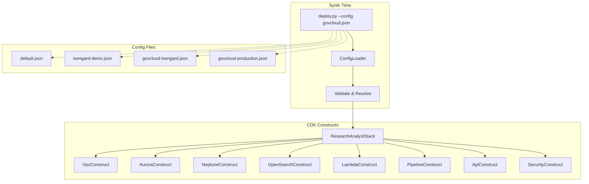

# Design Document: Multi-Environment Deployment

## Overview

This design transforms the monolithic `ResearchAnalystStack` (~813 lines, all resources hardcoded to a single dev account) into a config-driven, modular CDK stack that deploys to any AWS account and partition. A JSON configuration file parameterizes every infrastructure decision — VPC strategy, database capacity, service toggles, encryption, partition, and tagging. The monolith is decomposed into seven CDK Construct classes, each accepting the config and conditionally creating resources. A `ConfigLoader` module validates the config at synth time, resolves environment variable placeholders, and enforces cross-field constraints (e.g., GovCloud configs must not reference excluded Bedrock providers). The deploy CLI gains a `--config` flag, and the synthesized CloudFormation template includes Parameters/Conditions for standalone console deployment.

The design preserves backward compatibility: `default.json` reproduces the exact current stack (same logical IDs, same resource configuration), so existing deployments upgrade in-place without resource replacement.

## Architecture



### Data Flow

1. Operator runs `python deploy.py --config govcloud-isengard.json`
2. `ConfigLoader` reads JSON, resolves `CDK_DEFAULT_*` placeholders, validates schema and cross-field rules
3. Validated config is passed to `ResearchAnalystStack` constructor
4. Stack instantiates each Construct, passing the config dict
5. Each Construct checks its relevant config section and conditionally creates resources
6. `cdk synth` produces a CloudFormation template with Parameters, Conditions, and Outputs
7. `deploy.py` publishes assets and deploys via CloudFormation API

### Key Design Decisions

1. **Single stack, not nested stacks** — Keeps deployment atomic and avoids cross-stack reference complexity. All constructs live in one CloudFormation stack.
2. **Config at synth time, not deploy time** — Config is baked into the template during synthesis. CloudFormation Parameters are added as overrides for standalone console deployment, but the primary path is config-file-driven synth.
3. **Preserve logical IDs** — The `default.json` path must produce identical logical IDs to the current stack. Constructs use the same CDK construct IDs as the current monolith when in default mode.
4. **Partition via `cdk.Aws.PARTITION`** — Instead of reading partition from config for ARN construction, use CDK's built-in `cdk.Aws.PARTITION` token which resolves to the correct partition at deploy time. The config `partition` field is used for validation and service availability checks only.

## Components and Interfaces

### 1. ConfigLoader (`infra/cdk/config_loader.py`)

Reads, validates, and resolves a deployment config JSON file.

```python
class ConfigLoader:
    """Load and validate a deployment configuration file."""

    def __init__(self, config_path: str):
        self.config_path = config_path
        self.config: dict = {}

    def load(self) -> dict:
        """Read JSON, resolve env var placeholders, validate, return config dict."""
        ...

    def _resolve_env_vars(self, config: dict) -> dict:
        """Replace 'CDK_DEFAULT_ACCOUNT' and 'CDK_DEFAULT_REGION' string values
        with the corresponding environment variable values."""
        ...

    def _validate(self, config: dict) -> None:
        """Validate required fields, types, cross-field constraints.
        Raises ConfigValidationError with descriptive messages."""
        ...

    def _validate_bedrock_models(self, config: dict) -> None:
        """Check that configured model IDs are not from excluded providers."""
        ...
```

**Interface contract:**
- Input: path to a JSON file in `infra/cdk/deployment-configs/`
- Output: validated `dict` with all placeholders resolved
- Raises: `ConfigValidationError` with field name and expected type on failure

### 2. VpcConstruct (`infra/cdk/constructs/vpc_construct.py`)

```python
class VpcConstruct(Construct):
    def __init__(self, scope, id, *, config: dict):
        ...

    @property
    def vpc(self) -> ec2.IVpc:
        """The VPC (created or imported)."""
        ...
```

**Behavior:**
- `create_new=True` → creates VPC with config CIDR, 2 AZs, 1 NAT GW, public/private/isolated subnets
- `create_new=False` → `Vpc.from_lookup(existing_vpc_id)`
- `logging.vpc_flow_logs=True` → enables VPC flow logs to CloudWatch
- Exposes `vpc` property for downstream constructs

### 3. AuroraConstruct (`infra/cdk/constructs/aurora_construct.py`)

```python
class AuroraConstruct(Construct):
    def __init__(self, scope, id, *, config: dict, vpc: ec2.IVpc):
        ...

    @property
    def cluster(self) -> rds.DatabaseCluster: ...

    @property
    def secret(self) -> secretsmanager.ISecret: ...

    @property
    def proxy(self) -> rds.DatabaseProxy: ...
```

**Behavior:**
- Creates Aurora Serverless v2 with capacity from `aurora.min_capacity` / `aurora.max_capacity`
- Subnet placement from `aurora.subnet_type` (maps to `ec2.SubnetType`)
- KMS encryption when `encryption.kms_key_arn` is non-null
- RDS Proxy with `require_tls=True` always
- Security group ingress from VPC CIDR on port 5432

### 4. NeptuneConstruct (`infra/cdk/constructs/neptune_construct.py`)

```python
class NeptuneConstruct(Construct):
    def __init__(self, scope, id, *, config: dict, vpc: ec2.IVpc):
        ...

    @property
    def cluster(self) -> Optional[neptune.DatabaseCluster]: ...

    @property
    def enabled(self) -> bool: ...
```

**Behavior:**
- `neptune.enabled=True` → creates Neptune Serverless with configured capacity and subnet type
- `neptune.enabled=False` → no resources created, `cluster` returns `None`
- Security group ingress from VPC CIDR on port 8182

### 5. OpenSearchConstruct (`infra/cdk/constructs/opensearch_construct.py`)

```python
class OpenSearchConstruct(Construct):
    def __init__(self, scope, id, *, config: dict, vpc: ec2.IVpc):
        ...

    @property
    def collection(self) -> Optional[aoss.CfnCollection]: ...

    @property
    def endpoint(self) -> str: ...

    @property
    def collection_id(self) -> str: ...

    @property
    def enabled(self) -> bool: ...
```

**Behavior:**
- `mode="serverless"` → creates AOSS collection with encryption, network, data access policies and VPC endpoint
- `mode="disabled"` → no resources, endpoint/collection_id return empty strings
- KMS encryption on AOSS when `encryption.kms_key_arn` is set

### 6. LambdaConstruct (`infra/cdk/constructs/lambda_construct.py`)

```python
class LambdaConstruct(Construct):
    def __init__(self, scope, id, *, config: dict, vpc: ec2.IVpc,
                 aurora: AuroraConstruct, neptune: NeptuneConstruct,
                 opensearch: OpenSearchConstruct, data_bucket: s3.Bucket):
        ...

    @property
    def api_lambdas(self) -> dict[str, _lambda.Function]: ...

    @property
    def ingestion_lambdas(self) -> dict[str, _lambda.Function]: ...
```

**Behavior:**
- Builds Lambda env vars from construct outputs, including feature flags (`NEPTUNE_ENABLED`, `OPENSEARCH_ENABLED`, `REKOGNITION_ENABLED`)
- Sets `NEPTUNE_ENDPOINT` to empty string when Neptune disabled
- Sets `OPENSEARCH_ENDPOINT` / `OPENSEARCH_COLLECTION_ID` to empty strings when OpenSearch disabled
- Sets `BEDROCK_LLM_MODEL_ID` and `BEDROCK_EMBEDDING_MODEL_ID` from config
- `features.pipeline_only=True` → skips API Lambda creation
- `features.rekognition=False` → skips rekognition Lambda and IAM permissions
- All IAM ARNs use `cdk.Aws.PARTITION` instead of hardcoded `aws`

### 7. PipelineConstruct (`infra/cdk/constructs/pipeline_construct.py`)

```python
class PipelineConstruct(Construct):
    def __init__(self, scope, id, *, config: dict,
                 ingestion_lambdas: dict[str, _lambda.Function]):
        ...

    @property
    def state_machine(self) -> sfn.StateMachine: ...
```

**Behavior:**
- Creates Step Functions state machine from ASL definition
- Substitutes Lambda ARNs into ASL template
- Grants invoke permissions

### 8. ApiConstruct (`infra/cdk/constructs/api_construct.py`)

```python
class ApiConstruct(Construct):
    def __init__(self, scope, id, *, config: dict,
                 api_lambdas: dict[str, _lambda.Function]):
        ...

    @property
    def api(self) -> Optional[apigw.RestApi]: ...
```

**Behavior:**
- `features.pipeline_only=True` → no API Gateway created
- Otherwise creates LambdaRestApi with CORS and proxy integration

### 9. SecurityConstruct (`infra/cdk/constructs/security_construct.py`)

Handles S3 bucket creation with conditional encryption and TLS enforcement.

```python
class SecurityConstruct(Construct):
    def __init__(self, scope, id, *, config: dict):
        ...

    @property
    def data_bucket(self) -> s3.Bucket: ...
```

**Behavior:**
- `encryption.kms_key_arn` non-null → KMS encryption on S3
- `encryption.enforce_tls=True` → bucket policy denying non-TLS requests
- Always: versioned, block public access, lifecycle rules

### 10. Deploy CLI (`infra/cdk/deploy.py`)

Enhanced deployment script:

```python
def main():
    parser = argparse.ArgumentParser()
    parser.add_argument("--config", default="infra/cdk/deployment-configs/default.json")
    args = parser.parse_args()

    # 1. Load and validate config
    loader = ConfigLoader(args.config)
    config = loader.load()  # exits on validation failure

    # 2. Synth (passes config path as CDK context)
    synth(config_path=args.config)

    # 3. Publish assets
    publish_assets(config)

    # 4. Deploy via CloudFormation
    deploy(config)

    # 5. Post-deployment summary
    print_summary(config)
```

### Construct Instantiation Order in Stack

```python
class ResearchAnalystStack(Stack):
    def __init__(self, scope, id, *, config: dict, **kwargs):
        super().__init__(scope, id, **kwargs)

        # Tags
        for key, value in config.get("tags", {}).items():
            cdk.Tags.of(self).add(key, value)
        cdk.Tags.of(self).add("Environment", config["environment_name"])

        # 1. VPC
        vpc_construct = VpcConstruct(self, "Vpc", config=config)

        # 2. Security (S3 bucket)
        security = SecurityConstruct(self, "Security", config=config)

        # 3. Aurora
        aurora = AuroraConstruct(self, "Aurora", config=config, vpc=vpc_construct.vpc)

        # 4. Neptune (conditional)
        neptune = NeptuneConstruct(self, "Neptune", config=config, vpc=vpc_construct.vpc)

        # 5. OpenSearch (conditional)
        opensearch = OpenSearchConstruct(self, "OpenSearch", config=config, vpc=vpc_construct.vpc)

        # 6. Lambda functions
        lambdas = LambdaConstruct(self, "Lambda", config=config,
                                   vpc=vpc_construct.vpc, aurora=aurora,
                                   neptune=neptune, opensearch=opensearch,
                                   data_bucket=security.data_bucket)

        # 7. Step Functions pipeline
        pipeline = PipelineConstruct(self, "Pipeline", config=config,
                                      ingestion_lambdas=lambdas.ingestion_lambdas)

        # 8. API Gateway (conditional)
        api = ApiConstruct(self, "Api", config=config,
                           api_lambdas=lambdas.api_lambdas)

        # CloudFormation Outputs
        ...
```

### Backward Compatibility: Logical ID Preservation

When `default.json` is used, the constructs must produce the same CloudFormation logical IDs as the current monolith. Strategy:

- Each construct uses the **same CDK construct IDs** as the current stack (e.g., `"AuroraCluster"`, `"NeptuneSG"`, `"CaseFilesLambda"`)
- The construct wrapper IDs (`"Vpc"`, `"Aurora"`, etc.) are intermediate nodes in the construct tree. CDK generates logical IDs by concatenating the path. To preserve IDs, constructs will use `scope` (the stack) directly for resource creation when in default mode, or use a flag to flatten the construct tree path
- Alternative: use `override_logical_id()` on each CfnResource to force the original logical ID

The recommended approach is `override_logical_id()` on each resource, reading the expected IDs from the current synthesized template. This is explicit and doesn't require construct tree gymnastics.

### Partition-Aware ARN Pattern

All hardcoded `arn:aws:` strings are replaced with:

```python
# Instead of:
f"arn:aws:bedrock:{region}::foundation-model/{model_id}"

# Use:
cdk.Fn.sub(f"arn:${{AWS::Partition}}:bedrock:${{AWS::Region}}::foundation-model/{model_id}")

# Or for IAM policy statements:
iam.PolicyStatement(
    actions=["bedrock:InvokeModel"],
    resources=[
        cdk.Stack.of(self).format_arn(
            partition=cdk.Aws.PARTITION,
            service="bedrock",
            region=cdk.Aws.REGION,
            account="",
            resource="foundation-model",
            resource_name=config["bedrock"]["llm_model_id"],
        )
    ],
)
```

### CloudFormation Parameters and Conditions

The stack adds CloudFormation Parameters and Conditions for standalone template deployment:

```python
# Parameters
env_param = cdk.CfnParameter(self, "EnvironmentName", default=config["environment_name"])
account_param = cdk.CfnParameter(self, "AWSAccountId", default=config["account"])
region_param = cdk.CfnParameter(self, "AWSRegion", default=config["region"])
kms_param = cdk.CfnParameter(self, "KMSKeyArn", default=config["encryption"].get("kms_key_arn", ""))

# Conditions
neptune_condition = cdk.CfnCondition(self, "NeptuneEnabled",
    expression=cdk.Fn.condition_equals(config["neptune"]["enabled"], True))
opensearch_condition = cdk.CfnCondition(self, "OpenSearchEnabled",
    expression=cdk.Fn.condition_equals(config["opensearch"]["mode"], "serverless"))
```

### Lambda Runtime Graceful Degradation

Lambda functions receive feature flags as environment variables:

```python
NEPTUNE_ENABLED = os.environ.get("NEPTUNE_ENABLED", "false")
OPENSEARCH_ENABLED = os.environ.get("OPENSEARCH_ENABLED", "false")
REKOGNITION_ENABLED = os.environ.get("REKOGNITION_ENABLED", "false")
```

Runtime pattern in Lambda code:

```python
def query_graph(case_id: str) -> dict:
    if os.environ.get("NEPTUNE_ENABLED") != "true":
        return {"entities": [], "relationships": [], "source": "disabled"}
    # ... normal Neptune query
```

```python
def vector_search(query: str, top_k: int = 10) -> list:
    if os.environ.get("OPENSEARCH_ENABLED") != "true":
        # Fallback to Aurora pgvector
        return pgvector_search(query, top_k)
    # ... normal OpenSearch query
```

## Data Models

### Deployment Config Schema

```json
{
  "environment_name": "string (required) — e.g., 'dev', 'govcloud-test', 'production'",
  "account": "string (required) — AWS account ID or 'CDK_DEFAULT_ACCOUNT'",
  "region": "string (required) — AWS region or 'CDK_DEFAULT_REGION'",
  "partition": "string (required) — 'aws' or 'aws-us-gov'",

  "vpc": {
    "create_new": "boolean (required)",
    "cidr": "string (optional, required if create_new=true) — e.g., '10.0.0.0/16'",
    "existing_vpc_id": "string (optional, required if create_new=false)"
  },

  "aurora": {
    "min_capacity": "number (required) — ACU, e.g., 0.5",
    "max_capacity": "number (required) — ACU, e.g., 8",
    "subnet_type": "string (required) — 'PUBLIC' or 'PRIVATE_WITH_EGRESS'"
  },

  "neptune": {
    "enabled": "boolean (required)",
    "min_capacity": "number (optional, required if enabled) — NCU",
    "max_capacity": "number (optional, required if enabled) — NCU",
    "subnet_type": "string (optional, required if enabled) — 'PUBLIC' or 'PRIVATE_WITH_EGRESS'"
  },

  "opensearch": {
    "mode": "string (required) — 'serverless' or 'disabled'"
  },

  "encryption": {
    "kms_key_arn": "string|null (required) — KMS key ARN or null for AWS-managed",
    "enforce_tls": "boolean (required)"
  },

  "bedrock": {
    "llm_model_id": "string (required)",
    "embedding_model_id": "string (required)",
    "excluded_providers": "string[] (optional, default [])"
  },

  "features": {
    "pipeline_only": "boolean (required)",
    "rekognition": "boolean (required)"
  },

  "tags": "object (optional) — key-value pairs for resource tagging",

  "logging": {
    "vpc_flow_logs": "boolean (required)"
  }
}
```

### Example: `default.json` (reproduces current dev stack)

```json
{
  "environment_name": "dev",
  "account": "974220725866",
  "region": "us-east-1",
  "partition": "aws",
  "vpc": {
    "create_new": false,
    "existing_vpc_id": "default"
  },
  "aurora": {
    "min_capacity": 0.5,
    "max_capacity": 8,
    "subnet_type": "PUBLIC"
  },
  "neptune": {
    "enabled": true,
    "min_capacity": 1,
    "max_capacity": 8,
    "subnet_type": "PUBLIC"
  },
  "opensearch": {
    "mode": "serverless"
  },
  "encryption": {
    "kms_key_arn": null,
    "enforce_tls": false
  },
  "bedrock": {
    "llm_model_id": "anthropic.claude-3-haiku-20240307-v1:0",
    "embedding_model_id": "amazon.titan-embed-text-v2:0",
    "excluded_providers": []
  },
  "features": {
    "pipeline_only": false,
    "rekognition": true
  },
  "tags": {},
  "logging": {
    "vpc_flow_logs": false
  }
}
```

### Example: `govcloud-isengard.json`

```json
{
  "environment_name": "govcloud-test",
  "account": "CDK_DEFAULT_ACCOUNT",
  "region": "us-gov-west-1",
  "partition": "aws-us-gov",
  "vpc": {
    "create_new": true,
    "cidr": "10.0.0.0/16"
  },
  "aurora": {
    "min_capacity": 0.5,
    "max_capacity": 4,
    "subnet_type": "PRIVATE_WITH_EGRESS"
  },
  "neptune": {
    "enabled": false
  },
  "opensearch": {
    "mode": "disabled"
  },
  "encryption": {
    "kms_key_arn": "arn:aws-us-gov:kms:us-gov-west-1:ACCOUNT_ID:key/KEY_ID",
    "enforce_tls": true
  },
  "bedrock": {
    "llm_model_id": "anthropic.claude-3-haiku-20240307-v1:0",
    "embedding_model_id": "amazon.titan-embed-text-v2:0",
    "excluded_providers": []
  },
  "features": {
    "pipeline_only": false,
    "rekognition": false
  },
  "tags": {
    "Compliance": "FedRAMP-High",
    "Project": "InvestigativeIntelligence"
  },
  "logging": {
    "vpc_flow_logs": true
  }
}
```

### Example: `isengard-demo.json`

```json
{
  "environment_name": "demo",
  "account": "CDK_DEFAULT_ACCOUNT",
  "region": "CDK_DEFAULT_REGION",
  "partition": "aws",
  "vpc": {
    "create_new": true,
    "cidr": "10.0.0.0/16"
  },
  "aurora": {
    "min_capacity": 0.5,
    "max_capacity": 4,
    "subnet_type": "PUBLIC"
  },
  "neptune": {
    "enabled": true,
    "min_capacity": 1,
    "max_capacity": 4,
    "subnet_type": "PUBLIC"
  },
  "opensearch": {
    "mode": "serverless"
  },
  "encryption": {
    "kms_key_arn": null,
    "enforce_tls": false
  },
  "bedrock": {
    "llm_model_id": "anthropic.claude-3-haiku-20240307-v1:0",
    "embedding_model_id": "amazon.titan-embed-text-v2:0",
    "excluded_providers": []
  },
  "features": {
    "pipeline_only": false,
    "rekognition": true
  },
  "tags": {
    "Purpose": "Demo"
  },
  "logging": {
    "vpc_flow_logs": false
  }
}
```

### Example: `govcloud-production.json`

```json
{
  "environment_name": "production",
  "account": "CDK_DEFAULT_ACCOUNT",
  "region": "us-gov-west-1",
  "partition": "aws-us-gov",
  "vpc": {
    "create_new": true,
    "cidr": "10.0.0.0/16"
  },
  "aurora": {
    "min_capacity": 2,
    "max_capacity": 16,
    "subnet_type": "PRIVATE_WITH_EGRESS"
  },
  "neptune": {
    "enabled": false
  },
  "opensearch": {
    "mode": "disabled"
  },
  "encryption": {
    "kms_key_arn": "arn:aws-us-gov:kms:us-gov-west-1:ACCOUNT_ID:key/KEY_ID",
    "enforce_tls": true
  },
  "bedrock": {
    "llm_model_id": "anthropic.claude-3-haiku-20240307-v1:0",
    "embedding_model_id": "amazon.titan-embed-text-v2:0",
    "excluded_providers": []
  },
  "features": {
    "pipeline_only": false,
    "rekognition": false
  },
  "tags": {
    "Compliance": "FedRAMP-High",
    "Project": "InvestigativeIntelligence",
    "DataClassification": "CUI"
  },
  "logging": {
    "vpc_flow_logs": true
  }
}
```

### ConfigValidationError

```python
class ConfigValidationError(Exception):
    """Raised when deployment config validation fails."""
    def __init__(self, errors: list[str]):
        self.errors = errors
        super().__init__(f"Config validation failed:\n" + "\n".join(f"  - {e}" for e in errors))
```


## Correctness Properties

*A property is a characteristic or behavior that should hold true across all valid executions of a system — essentially, a formal statement about what the system should do. Properties serve as the bridge between human-readable specifications and machine-verifiable correctness guarantees.*

### Property 1: Config load round-trip

*For any* valid deployment config dict (containing all required fields with correct types), serializing it to JSON and loading it via `ConfigLoader` should produce a dict with all original field values preserved.

**Validates: Requirements 1.1**

### Property 2: Environment variable placeholder resolution

*For any* pair of strings (account_id, region_name), when a config contains `"CDK_DEFAULT_ACCOUNT"` as the account value and `"CDK_DEFAULT_REGION"` as the region value, and the corresponding environment variables are set to those strings, `ConfigLoader` should resolve both placeholders to the environment variable values.

**Validates: Requirements 1.2, 1.3**

### Property 3: Validation rejects and identifies missing required fields

*For any* valid config and *for any* required field removed from that config, `ConfigLoader.validate()` should raise a `ConfigValidationError` whose error message contains the name of the missing field.

**Validates: Requirements 1.4, 1.5**

### Property 4: Disabled services produce empty endpoint env vars

*For any* config where `neptune.enabled` is `false` and/or `opensearch.mode` is `"disabled"`, the generated Lambda environment variable dict should set `NEPTUNE_ENDPOINT` to `""` when Neptune is disabled, and `OPENSEARCH_ENDPOINT` and `OPENSEARCH_COLLECTION_ID` to `""` when OpenSearch is disabled.

**Validates: Requirements 4.3, 5.3**

### Property 5: Bedrock model IDs flow from config to Lambda env vars

*For any* config with arbitrary `bedrock.llm_model_id` and `bedrock.embedding_model_id` strings, the generated Lambda environment variable dict should contain `BEDROCK_LLM_MODEL_ID` and `BEDROCK_EMBEDDING_MODEL_ID` matching those exact strings.

**Validates: Requirements 8.1, 8.2**

### Property 6: Excluded provider model validation

*For any* config where `bedrock.excluded_providers` contains a provider name, and the configured `llm_model_id` or `embedding_model_id` belongs to that provider (determined by the model ID prefix matching the provider name), `ConfigLoader.validate()` should raise a `ConfigValidationError` whose message contains both the model ID and the excluded provider name.

**Validates: Requirements 8.3, 8.4**

### Property 7: Feature toggles flow to Lambda env vars

*For any* combination of boolean feature toggle values (`neptune.enabled`, `opensearch.mode`, `features.rekognition`), the generated Lambda environment variable dict should contain `NEPTUNE_ENABLED`, `OPENSEARCH_ENABLED`, and `REKOGNITION_ENABLED` with string values `"true"` or `"false"` matching the config.

**Validates: Requirements 9.4, 16.1**

### Property 8: GovCloud configs reference only FedRAMP-high models

*For any* deployment config with `partition` set to `"aws-us-gov"`, all configured Bedrock model IDs (`llm_model_id` and `embedding_model_id`) must appear in the `fedramp_high` level of the FedRAMP Model Registry (`config/bedrock_models.json`).

**Validates: Requirements 14.3**

### Property 9: Neptune graceful degradation returns empty results

*For any* query input to a graph-dependent Lambda function, when `NEPTUNE_ENABLED` is `"false"`, the function should return an empty result set (e.g., `{"entities": [], "relationships": []}`) without raising an exception.

**Validates: Requirements 16.2**

### Property 10: OpenSearch fallback to pgvector

*For any* vector search query, when `OPENSEARCH_ENABLED` is `"false"`, the search function should delegate to the Aurora pgvector search path instead of attempting an OpenSearch query.

**Validates: Requirements 16.3**

## Error Handling

### Config Validation Errors

| Error Condition | Behavior |
|---|---|
| Missing required top-level field | `ConfigValidationError` naming the field and expected type |
| Wrong type for a field (e.g., string where bool expected) | `ConfigValidationError` naming the field, actual type, and expected type |
| `CDK_DEFAULT_ACCOUNT` env var not set when placeholder used | `ConfigValidationError`: "CDK_DEFAULT_ACCOUNT environment variable is not set" |
| `CDK_DEFAULT_REGION` env var not set when placeholder used | `ConfigValidationError`: "CDK_DEFAULT_REGION environment variable is not set" |
| `vpc.create_new=true` but `vpc.cidr` missing | `ConfigValidationError`: "vpc.cidr is required when vpc.create_new is true" |
| `vpc.create_new=false` but `vpc.existing_vpc_id` missing | `ConfigValidationError`: "vpc.existing_vpc_id is required when vpc.create_new is false" |
| `neptune.enabled=true` but capacity fields missing | `ConfigValidationError`: "neptune.min_capacity and neptune.max_capacity are required when neptune.enabled is true" |
| Bedrock model ID belongs to excluded provider | `ConfigValidationError`: "Model {model_id} belongs to excluded provider {provider}" |
| Invalid `opensearch.mode` value | `ConfigValidationError`: "opensearch.mode must be 'serverless' or 'disabled'" |
| Invalid `aurora.subnet_type` value | `ConfigValidationError`: "aurora.subnet_type must be 'PUBLIC' or 'PRIVATE_WITH_EGRESS'" |

### CDK Synth Errors

| Error Condition | Behavior |
|---|---|
| VPC lookup fails (invalid VPC ID) | CDK raises synthesis error with VPC ID in message |
| KMS key ARN invalid or inaccessible | CloudFormation deployment fails with KMS error — caught by deploy.py waiter |

### Deploy CLI Errors

| Error Condition | Behavior |
|---|---|
| Config file not found | Print error, exit code 1 |
| Config validation fails | Print all validation errors, exit code 1, do not run synth |
| CDK synth fails | Print stderr, exit code 1 |
| CloudFormation deployment fails | Print failed resource events, exit code 1 |
| Asset upload fails | Print S3 error, exit code 1 |

### Lambda Runtime Errors

| Error Condition | Behavior |
|---|---|
| Neptune disabled, graph query requested | Return `{"entities": [], "relationships": [], "source": "disabled"}` — no error |
| OpenSearch disabled, vector search requested | Silently fall back to Aurora pgvector search |
| Rekognition disabled, image analysis requested | Return `{"labels": [], "faces": [], "source": "disabled"}` — no error |
| Feature flag env var missing | Default to `"false"` (conservative — disable feature) |

## Testing Strategy

### Unit Tests (pytest)

Unit tests cover specific examples and edge cases for the ConfigLoader and env var building logic:

- `test_config_loader.py`:
  - Load `default.json` and verify all field values match expected dev environment
  - Load each profile (`isengard-demo.json`, `govcloud-isengard.json`, `govcloud-production.json`) and verify key fields
  - Verify `CDK_DEFAULT_ACCOUNT` / `CDK_DEFAULT_REGION` resolution with mocked env vars
  - Verify validation error for each type of invalid config (missing field, wrong type, conditional field missing)
  - Verify excluded provider detection
  - Verify GovCloud configs only reference FedRAMP-high models

- `test_env_var_builder.py`:
  - Verify Lambda env var dict for default config
  - Verify empty endpoints when services disabled
  - Verify feature flag strings

- `test_lambda_degradation.py`:
  - Verify Neptune query returns empty when disabled
  - Verify OpenSearch fallback to pgvector when disabled
  - Verify Rekognition returns empty when disabled

### Property-Based Tests (Hypothesis)

Property-based tests use the [Hypothesis](https://hypothesis.readthedocs.io/) library for Python. Each test runs a minimum of 100 iterations with generated inputs.

Each property test references its design document property with a tag comment:
```python
# Feature: multi-environment-deployment, Property 1: Config load round-trip
```

Properties to implement:
1. Config load round-trip (Property 1)
2. Env var placeholder resolution (Property 2)
3. Validation rejects missing fields (Property 3)
4. Disabled service empty env vars (Property 4)
5. Bedrock model IDs in env vars (Property 5)
6. Excluded provider rejection (Property 6)
7. Feature toggles in env vars (Property 7)
8. GovCloud FedRAMP-high model validation (Property 8)
9. Neptune graceful degradation (Property 9)
10. OpenSearch fallback (Property 10)

Hypothesis strategies needed:
- `valid_config()` — generates a complete valid config dict with random values
- `valid_model_id()` — generates model ID strings with provider prefix
- `valid_account_id()` — generates 12-digit numeric strings
- `valid_region()` — generates from a list of valid AWS regions

### CDK Assertion Tests (pytest + aws_cdk.assertions)

These are integration-level tests that synthesize the stack and assert on the CloudFormation template:

- `test_stack_default.py`: Synth with `default.json`, compare logical IDs to current template
- `test_stack_govcloud.py`: Synth with GovCloud config, verify no Neptune/OpenSearch resources, verify partition in ARNs
- `test_stack_pipeline_only.py`: Synth with `pipeline_only=true`, verify no API Gateway
- `test_stack_encryption.py`: Synth with KMS key, verify S3/Aurora/OpenSearch encryption
- `test_stack_parameters.py`: Verify CloudFormation Parameters and Conditions exist
- `test_stack_outputs.py`: Verify CloudFormation Outputs
- `test_stack_tags.py`: Verify stack-level tags from config
- `test_stack_partition.py`: Synth with `aws-us-gov`, grep template for hardcoded `arn:aws:` — should find none

### Test File Organization

```
tests/
  infra/
    test_config_loader.py          # Unit + property tests for ConfigLoader
    test_env_var_builder.py        # Unit + property tests for env var building
    test_stack_default.py          # CDK assertion: default config backward compat
    test_stack_govcloud.py         # CDK assertion: GovCloud config
    test_stack_conditional.py      # CDK assertion: feature toggles, service toggles
    test_stack_encryption.py       # CDK assertion: KMS, TLS
    test_stack_template.py         # CDK assertion: Parameters, Conditions, Outputs
  lambdas/
    test_lambda_degradation.py     # Unit + property tests for graceful degradation
```
