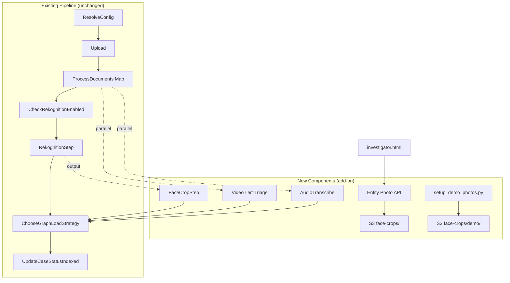
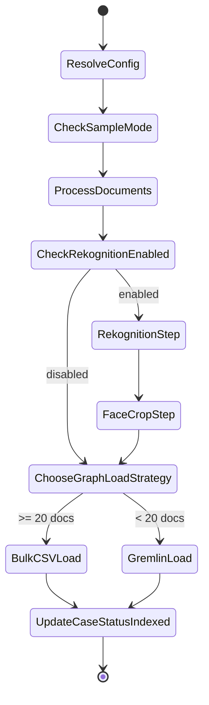

# Design Document: Multimedia Evidence Intelligence

## Overview

This feature extends the existing investigative platform with multimedia analysis capabilities — face cropping, entity photo APIs, demo photo setup, tiered video intelligence, audio transcription, and media-type routing — all as **add-on components** that leave the current ingestion pipeline intact.

The design follows a strict "append-only" philosophy: no existing Lambda handlers, Step Functions states, or frontend rendering logic is modified. New capabilities are added as post-processing steps, new API endpoints, new parallel branches, and new service modules.

### Key Design Decisions

1. **Face Crop as post-processing**: A new `FaceCropService` runs AFTER the existing `rekognition_handler.py` returns, consuming its output. The Rekognition handler itself is untouched.
2. **Entity Photo API as new dispatcher route**: A new `GET /case-files/{id}/entity-photos` route is added to `case_files.py` dispatcher, delegating to a new `entity_photo_service.py`.
3. **Demo photos via setup script**: A standalone `scripts/setup_demo_photos.py` downloads, resizes, and uploads photos from `data/entity_photos.json` to S3.
4. **Video/Audio as future parallel branches**: New Step Functions states are added as parallel branches after `ProcessDocuments`, not replacing any existing states.
5. **Media Router at ResolveConfig**: Media type classification is added to the config resolution output, not as a separate state.

## Architecture

### System Context



### Pipeline Flow (Modified Step Functions)

The existing pipeline flow is preserved. New states are inserted at specific points:

1. **FaceCropStep**: Inserted between `RekognitionStep` and `ChooseGraphLoadStrategy`. Only runs when Rekognition produced face detections. On failure, catches error and continues to graph load (non-blocking).
2. **VideoTier1Branch** (future): A parallel branch after `ProcessDocuments` for video files.
3. **AudioTranscribeBranch** (future): A parallel branch after `ProcessDocuments` for audio/video files.



## Components and Interfaces

### 1. FaceCropService (`src/services/face_crop_service.py`)

Consumes Rekognition handler output (face bounding boxes + source S3 keys) and produces cropped face thumbnails.

**Interface:**
```python
class FaceCropService:
    def __init__(self, s3_bucket: str):
        """Initialize with target S3 bucket."""

    def crop_faces(self, case_id: str, rekognition_results: list[dict]) -> dict:
        """Process all face detections from Rekognition output.
        
        For each face with confidence >= 0.90:
        1. Download source image from S3
        2. Crop bounding box region
        3. Resize to 100x100 JPEG
        4. Upload to s3://bucket/cases/{case_id}/face-crops/{entity_name}/{hash}.jpg
        5. Select highest-confidence crop per entity as primary_thumbnail.jpg
        
        Returns:
            {
                "crops_created": int,
                "entities_with_thumbnails": list[str],
                "primary_thumbnails": {entity_name: s3_key},
                "errors": list[str]
            }
        """

    def _crop_single_face(self, image_bytes: bytes, bounding_box: dict, 
                          target_size: tuple = (100, 100)) -> bytes:
        """Crop a face region from image bytes using bounding box coordinates.
        
        Args:
            image_bytes: Raw image file bytes
            bounding_box: Rekognition BoundingBox dict with Width, Height, Left, Top (0-1 normalized)
            target_size: Output dimensions (width, height)
        
        Returns:
            JPEG bytes of the cropped and resized face
        """

    def _compute_crop_hash(self, s3_key: str, bounding_box: dict) -> str:
        """Deterministic hash from source key + bounding box for dedup."""
```

**Dependencies:** `boto3` (S3), `Pillow` (image processing — added to Lambda layer)

**S3 Layout:**
```
cases/{case_id}/face-crops/
  {entity_name}/
    {hash1}.jpg          # Individual crop
    {hash2}.jpg          # Another crop of same person
    primary_thumbnail.jpg # Copy of highest-confidence crop
  demo/
    Jeffrey Epstein.jpg   # Demo photos (200x200)
    Ghislaine Maxwell.jpg
    ...
```

### 2. FaceCropLambda (`src/lambdas/ingestion/face_crop_handler.py`)

Thin Lambda handler that wraps `FaceCropService` for Step Functions invocation.

**Interface:**
```python
def handler(event, context):
    """Crop faces from Rekognition results.
    
    Event format (from Step Functions):
        {
            "case_id": "...",
            "rekognition_result": {
                "entities": [...],
                "artifact_key": "...",
                "status": "completed"
            },
            "effective_config": {...}
        }
    
    Returns:
        {
            "case_id": "...",
            "status": "completed" | "skipped",
            "crops_created": int,
            "primary_thumbnails": {entity_name: s3_key}
        }
    """
```

### 3. EntityPhotoService (`src/services/entity_photo_service.py`)

Generates presigned URL mappings for entity face thumbnails.

**Interface:**
```python
class EntityPhotoService:
    def __init__(self, s3_bucket: str):
        """Initialize with S3 bucket name."""

    def get_entity_photos(self, case_id: str, expiration: int = 3600) -> dict:
        """Return entity name → presigned URL mapping.
        
        Priority:
        1. Pipeline-generated primary_thumbnail.jpg (highest priority)
        2. Demo photos from face-crops/demo/ prefix (fallback)
        
        Entities with no photo are omitted from the response.
        
        Returns:
            {
                "entity_photos": {
                    "Jeffrey Epstein": "https://s3.../presigned...",
                    "Ghislaine Maxwell": "https://s3.../presigned...",
                },
                "photo_count": int,
                "source_breakdown": {"pipeline": int, "demo": int}
            }
        """
```

**Presigned URL Generation:**
- Uses `boto3.client('s3').generate_presigned_url('get_object', ...)` with SigV4
- Scoped to exact S3 key (no wildcard paths)
- Default expiration: 3600 seconds (1 hour)
- Audit logging: entity name, S3 key, requesting user identity

### 4. Entity Photo API Route (in `case_files.py` dispatcher)

A new route added to the existing dispatcher:

```python
# In dispatch_handler, before the case file CRUD catch-all:
if path.endswith("/entity-photos") and "/case-files/" in path and method == "GET":
    return entity_photos_handler(event, context)
```

**Handler:**
```python
def entity_photos_handler(event, context):
    """GET /case-files/{id}/entity-photos"""
    case_id = event["pathParameters"]["id"]
    service = EntityPhotoService(s3_bucket=S3_BUCKET)
    result = service.get_entity_photos(case_id)
    return success_response(result, 200, event)
```

### 5. Demo Photo Setup Script (`scripts/setup_demo_photos.py`)

Standalone script that reads `data/entity_photos.json`, downloads images, resizes to 200x200 JPEG, and uploads to S3.

**Interface:**
```python
def setup_demo_photos(case_id: str, bucket: str, dry_run: bool = False) -> dict:
    """Download, resize, and upload demo photos for a case.
    
    Args:
        case_id: Target case ID
        bucket: S3 bucket name
        dry_run: If True, only report what would be done
    
    Returns:
        {"uploaded": int, "skipped": int, "errors": list[str]}
    """
```

### 6. VideoAnalyzerService (`src/services/video_analyzer_service.py`) — Future

Tiered video analysis service. Tier 1 (automated triage) runs `StartLabelDetection` + `StartFaceDetection`. Tier 2 (on-demand) adds `StartCelebrityRecognition` + `StartContentModeration` + key frame extraction.

**Interface (Tier 1):**
```python
class VideoAnalyzerService:
    def analyze_tier1(self, case_id: str, s3_key: str, config: dict) -> dict:
        """Run automated triage on a video file.
        
        Returns:
            {
                "s3_key": str,
                "tier": 1,
                "labels": [{"name": str, "confidence": float, "timestamps": [...]}],
                "face_count_per_segment": [...],
                "status": "completed" | "failed"
            }
        """

    def analyze_tier2(self, case_id: str, s3_key: str, tier1_result: dict) -> dict:
        """Run deep dive analysis on a flagged video.
        
        Returns:
            {
                "celebrities": [...],
                "moderation_labels": [...],
                "key_frames": [{"timestamp_ms": int, "s3_key": str}],
                "status": "completed" | "failed"
            }
        """
```

### 7. AudioTranscriberService (`src/services/audio_transcriber_service.py`) — Future

Integrates Amazon Transcribe for speech-to-text with speaker diarization.

**Interface:**
```python
class AudioTranscriberService:
    def transcribe(self, case_id: str, s3_key: str, config: dict) -> dict:
        """Submit file to Amazon Transcribe and process results.
        
        Returns:
            {
                "s3_key": str,
                "transcript_key": str,  # S3 key of structured transcript
                "segments": [
                    {"speaker": str, "start": float, "end": float, "text": str}
                ],
                "speaker_count": int,
                "status": "completed" | "failed"
            }
        """

    def detect_entity_mentions(self, case_id: str, transcript: dict, 
                                known_entities: list[str]) -> list[dict]:
        """Find entity name mentions in transcript segments.
        
        Returns co-occurrence flags when 2+ entities appear within 30s window.
        """
```

### 8. MediaRouter (extension to ResolveConfig output)

Media type classification added to the effective config output. The existing `ResolveConfig` Lambda is extended to include a `media_routing` section.

**Classification Logic:**
```python
MEDIA_TYPE_MAP = {
    "image": {".jpg", ".jpeg", ".png", ".tiff", ".tif"},
    "video": {".mp4", ".mov"},
    "audio": {".mp3", ".wav", ".m4a"},
}
# Default: "document" for all other extensions
```

This is stored as metadata on each document record during the upload phase, not as a separate pipeline state.


## Data Models

### Face Crop Metadata

Stored as part of the Rekognition artifact JSON in S3:

```json
{
  "face_crops": [
    {
      "entity_name": "Jeffrey Epstein",
      "source_s3_key": "cases/{case_id}/raw/photo_001.jpg",
      "bounding_box": {"Width": 0.15, "Height": 0.22, "Left": 0.35, "Top": 0.10},
      "confidence": 0.98,
      "crop_s3_key": "cases/{case_id}/face-crops/Jeffrey Epstein/a1b2c3d4.jpg",
      "is_primary": true,
      "crop_hash": "a1b2c3d4"
    }
  ]
}
```

### Neptune Vertex Property Extension

Existing person entity vertices gain a new optional property:

| Property | Type | Description |
|----------|------|-------------|
| `face_thumbnail_s3_key` | string | S3 key of the primary face thumbnail for this entity |

This property is set by the FaceCropStep after selecting the highest-confidence crop per entity. The existing `load_via_gremlin` method in `NeptuneGraphLoader` already supports arbitrary properties via `.property()` calls — no schema change needed.

### Entity Photo API Response

```json
{
  "entity_photos": {
    "Jeffrey Epstein": "https://research-analyst-data-lake-974220725866.s3.amazonaws.com/cases/ed0b6c27.../face-crops/Jeffrey%20Epstein/primary_thumbnail.jpg?X-Amz-...",
    "Ghislaine Maxwell": "https://..."
  },
  "photo_count": 8,
  "source_breakdown": {
    "pipeline": 0,
    "demo": 8
  }
}
```

### Video Analysis Tier 1 Result (Future)

```json
{
  "s3_key": "cases/{case_id}/raw/surveillance_001.mp4",
  "tier": 1,
  "labels": [
    {
      "name": "Person",
      "confidence": 0.95,
      "timestamps": [{"start_ms": 1200, "end_ms": 5400}]
    },
    {
      "name": "Vehicle",
      "confidence": 0.88,
      "timestamps": [{"start_ms": 3000, "end_ms": 7200}]
    }
  ],
  "face_count_per_segment": [
    {"start_ms": 0, "end_ms": 5000, "face_count": 2},
    {"start_ms": 5000, "end_ms": 10000, "face_count": 1}
  ],
  "result_key": "cases/{case_id}/video-analysis/surveillance_001_tier1.json",
  "status": "completed"
}
```

### Structured Transcript (Future)

```json
{
  "s3_key": "cases/{case_id}/raw/recording_001.mp3",
  "segments": [
    {
      "speaker": "Speaker_0",
      "start_time": 0.0,
      "end_time": 4.5,
      "text": "We need to discuss the arrangement with the foundation."
    },
    {
      "speaker": "Speaker_1",
      "start_time": 4.8,
      "end_time": 9.2,
      "text": "The transfer was completed last Tuesday."
    }
  ],
  "speaker_count": 2,
  "entity_flags": [
    {
      "entities": ["Foundation X", "Transfer"],
      "speaker": "Speaker_1",
      "timestamp": 4.8,
      "text": "The transfer was completed last Tuesday.",
      "priority": "high"
    }
  ]
}
```

### Media Type Classification

Added to document metadata during upload:

| Field | Type | Values |
|-------|------|--------|
| `media_type` | string | `"image"`, `"video"`, `"audio"`, `"document"` |

Determined by file extension mapping. Unknown extensions default to `"document"` with a logged warning.

### Step Functions State Addition — FaceCropStep

New state inserted into `ingestion_pipeline.json`:

```json
{
  "FaceCropStep": {
    "Type": "Task",
    "Resource": "${FaceCropLambdaArn}",
    "Parameters": {
      "case_id.$": "$.case_id",
      "rekognition_result.$": "$.rekognition_result",
      "effective_config.$": "$.effective_config"
    },
    "ResultPath": "$.face_crop_result",
    "TimeoutSeconds": 300,
    "Retry": [
      {
        "ErrorEquals": ["States.TaskFailed", "Lambda.ServiceException"],
        "IntervalSeconds": 3,
        "MaxAttempts": 2,
        "BackoffRate": 2.0
      }
    ],
    "Catch": [
      {
        "ErrorEquals": ["States.ALL"],
        "ResultPath": "$.face_crop_error",
        "Next": "ChooseGraphLoadStrategy"
      }
    ],
    "Next": "ChooseGraphLoadStrategy"
  }
}
```

The `RekognitionStep.Next` changes from `"ChooseGraphLoadStrategy"` to `"FaceCropStep"`. On error, FaceCropStep catches and falls through to graph load — it's non-blocking.


## Correctness Properties

*A property is a characteristic or behavior that should hold true across all valid executions of a system — essentially, a formal statement about what the system should do. Properties serve as the bridge between human-readable specifications and machine-verifiable correctness guarantees.*

### Property 1: Face crop confidence filter and count invariant

*For any* source image and list of Rekognition face detections with varying confidence scores, the FaceCropService SHALL produce exactly N cropped thumbnails where N equals the number of faces with confidence >= 0.90, and each crop SHALL be a valid 100x100 JPEG image.

**Validates: Requirements 1.1, 1.3**

### Property 2: Deterministic S3 path generation

*For any* case_id, entity_name, source S3 key, and bounding box coordinates, the computed output S3 path SHALL match the pattern `cases/{case_id}/face-crops/{entity_name}/{hash}.jpg` where `{hash}` is a deterministic function of the source key and bounding box. The same inputs SHALL always produce the same path, and different inputs SHALL produce different paths.

**Validates: Requirements 1.2**

### Property 3: Primary thumbnail is highest confidence

*For any* entity with multiple face crops at varying confidence levels, the FaceCropService SHALL select the crop with the maximum confidence value as the primary thumbnail. The selected primary's confidence SHALL be >= all other crops' confidences for that entity.

**Validates: Requirements 1.4**

### Property 4: Entity photo priority — pipeline over demo over omit

*For any* entity and any combination of pipeline-generated thumbnails and demo photos in S3, the EntityPhotoService SHALL return: (a) the pipeline thumbnail URL if a pipeline crop exists, (b) the demo photo URL if only a demo photo exists, (c) no entry if neither exists. Entities with no photo SHALL be omitted from the response entirely (no null/empty URLs).

**Validates: Requirements 2.3, 2.4, 3.4, 3.5**

### Property 5: Error resilience — invalid inputs don't crash processing

*For any* batch of inputs where some are invalid (corrupt image bytes, out-of-bounds bounding boxes, Rekognition API failures, Transcribe errors), the processing service SHALL continue processing all remaining valid inputs and return results for them. The count of successfully processed items plus the count of logged errors SHALL equal the total input count.

**Validates: Requirements 1.6, 4.5, 7.6**

### Property 6: Investigative label filtering

*For any* set of Rekognition-detected labels, the VideoAnalyzerService SHALL include in its output only labels whose lowercase name is in the INVESTIGATIVE_LABELS set (weapons, vehicles, currency, drugs, documents, electronics, etc.). All non-investigative labels SHALL be excluded.

**Validates: Requirements 4.2**

### Property 7: Key frame extraction matches flagged timestamps

*For any* Tier 1 result with N flagged timestamps, the Tier 2 key frame extraction SHALL produce exactly N JPEG images, one per flagged timestamp, stored at the correct S3 path `cases/{case_id}/video-keyframes/{filename}/{timestamp_ms}.jpg`.

**Validates: Requirements 5.2**

### Property 8: Transcribe output parsing preserves all segments

*For any* valid Amazon Transcribe output JSON, parsing it into the structured transcript format SHALL preserve all speaker segments — the total number of segments in the structured output SHALL equal the number of segments in the raw Transcribe output, and each segment SHALL retain its speaker label, start time, end time, and text content.

**Validates: Requirements 7.4**

### Property 9: Entity co-occurrence flagging within 30-second window

*For any* structured transcript and set of known entity names, the co-occurrence detector SHALL flag every segment where 2 or more known entities are mentioned within the same speaker turn or within a 30-second window. Segments with fewer than 2 entity mentions within the window SHALL NOT be flagged.

**Validates: Requirements 8.3**

### Property 10: Media type classification correctness

*For any* filename, the MediaRouter SHALL classify it as: "image" if extension is in {.jpg, .jpeg, .png, .tiff, .tif}, "video" if in {.mp4, .mov}, "audio" if in {.mp3, .wav, .m4a}, or "document" for all other extensions. The classification SHALL be case-insensitive and the classified type SHALL be recorded on the document metadata.

**Validates: Requirements 9.1, 9.6, 9.7**

### Property 11: Presigned URL scoped to exact S3 key

*For any* entity photo presigned URL generated by the EntityPhotoService, the URL SHALL reference exactly one S3 object key matching the entity's thumbnail path. The URL SHALL NOT contain wildcard characters or prefix-level access grants.

**Validates: Requirements 10.2**

### Property 12: Audit log completeness for presigned URL generation

*For any* presigned URL generation event, the system SHALL produce an audit log entry containing: the requesting user identity (or "system" for automated calls), the entity name, and the exact S3 key. No presigned URL SHALL be generated without a corresponding audit log entry.

**Validates: Requirements 10.4**

### Property 13: Demo photo resize produces correct dimensions

*For any* source image downloaded from entity_photos.json URLs, the setup script SHALL produce a 200x200 pixel JPEG file. The output dimensions SHALL be exactly 200x200 regardless of the source image's original aspect ratio or dimensions.

**Validates: Requirements 3.2**

### Property 14: Entity mention detection in transcripts creates graph edges

*For any* transcript segment containing a known entity name, the AudioTranscriberService SHALL create an edge in the Neptune graph linking the audio/video document entity to the mentioned entity, with the speaker label and timestamp range as edge properties.

**Validates: Requirements 8.2**

### Property 15: Video analysis output path format

*For any* case_id and video filename, Tier 1 results SHALL be stored at `cases/{case_id}/video-analysis/{filename}_tier1.json` and Tier 2 results at `cases/{case_id}/video-analysis/{filename}_tier2.json`. Raw transcripts SHALL be stored at `cases/{case_id}/transcripts/{filename}_transcript.json` and structured transcripts at `cases/{case_id}/transcripts/{filename}_structured.json`.

**Validates: Requirements 4.3, 5.3, 7.3, 7.5, 8.4**

## Error Handling

### FaceCropService Errors

| Error Condition | Handling | Impact |
|----------------|----------|--------|
| Source image download fails (S3 404/403) | Log warning, skip this face, continue | Other faces still processed |
| Corrupt/unreadable image bytes | Log warning with S3 key, skip | Non-blocking |
| Bounding box out of bounds (Left+Width > 1.0) | Clamp to image boundaries, attempt crop | Best-effort crop |
| Pillow import fails (missing from layer) | Return `status: skipped` with reason | Pipeline continues to graph load |
| S3 upload of crop fails | Log error, skip this crop | Other crops still uploaded |

### EntityPhotoService Errors

| Error Condition | Handling | Impact |
|----------------|----------|--------|
| S3 list_objects fails | Return empty `entity_photos: {}` | Frontend falls back to SVG avatars |
| Presigned URL generation fails for one entity | Skip that entity, continue | Partial results returned |
| Case ID not found / no face-crops prefix | Return empty response | Frontend uses existing SVG avatars |

### VideoAnalyzerService Errors (Future)

| Error Condition | Handling | Impact |
|----------------|----------|--------|
| StartLabelDetection fails | Mark video as `triage_failed`, continue | Other videos still processed |
| Polling timeout (>600s) | Mark as `triage_timeout`, continue | Partial results stored |
| StartCelebrityRecognition fails (Tier 2) | Return Tier 2 with partial results | Labels/faces still available |

### AudioTranscriberService Errors (Future)

| Error Condition | Handling | Impact |
|----------------|----------|--------|
| Transcribe job fails | Mark as `transcription_failed`, continue | Other files still processed |
| Transcribe output parsing fails | Store raw output, skip structured | Raw JSON still available |
| Entity mention detection fails | Skip flagging, store transcript | Transcript still searchable |

### Pipeline-Level Error Handling

The FaceCropStep in Step Functions uses a `Catch` block that routes to `ChooseGraphLoadStrategy` on any error. This ensures face cropping failures never block the rest of the pipeline. The error is captured in `$.face_crop_error` for debugging but does not trigger `SetStatusError`.

## Testing Strategy

### Property-Based Testing

**Library:** `hypothesis` (Python) — already available in the test environment.

**Configuration:** Each property test runs a minimum of 100 iterations via `@settings(max_examples=100)`.

**Tag format:** Each test is tagged with a comment: `# Feature: multimedia-evidence-intelligence, Property {N}: {title}`

Properties to implement as property-based tests:

1. **Property 1** — Generate random lists of face detections with random confidences (0.0–1.0), verify crop count matches faces >= 0.90 and output is 100x100 JPEG
2. **Property 2** — Generate random case_ids, entity names, S3 keys, bounding boxes; verify path format and determinism
3. **Property 3** — Generate random lists of crops per entity with varying confidences; verify primary = max confidence
4. **Property 4** — Generate random combinations of pipeline/demo/no photos per entity; verify priority logic
5. **Property 5** — Generate batches with random invalid inputs mixed in; verify processing continues
6. **Property 6** — Generate random label sets; verify only INVESTIGATIVE_LABELS pass through
7. **Property 8** — Generate mock Transcribe output JSON; verify structured parsing preserves all segments
8. **Property 9** — Generate transcripts with random entity mentions; verify co-occurrence flagging logic
9. **Property 10** — Generate random filenames with various extensions; verify classification
10. **Property 13** — Generate random image dimensions; verify output is always 200x200

### Unit Tests

Specific examples and edge cases:

1. **FaceCropService** — Test with a known 200x300 image and a face at bounding box (0.25, 0.10, 0.50, 0.60); verify crop dimensions and content
2. **EntityPhotoService** — Test with a case that has 3 pipeline photos and 2 demo photos for overlapping entities; verify priority
3. **Demo setup script** — Test with entity_photos.json entries where some URLs are empty; verify skipped count
4. **Media classification** — Test edge cases: `.JPEG` (uppercase), `.tar.gz` (compound), no extension, `.MP4`
5. **S3 path generation** — Test with entity names containing spaces, special characters, unicode
6. **Presigned URL** — Verify URL contains the exact S3 key and no wildcard patterns
7. **Error handling** — Test FaceCropService with zero-byte image, bounding box with negative coordinates

### Integration Tests

1. **End-to-end face crop** — Upload a test image to S3, run FaceCropService, verify crops exist in S3
2. **Entity Photo API** — Call GET /case-files/{id}/entity-photos with demo photos in S3, verify presigned URLs work
3. **Step Functions FaceCropStep** — Verify pipeline completes when FaceCropStep succeeds and when it fails (catch path)
