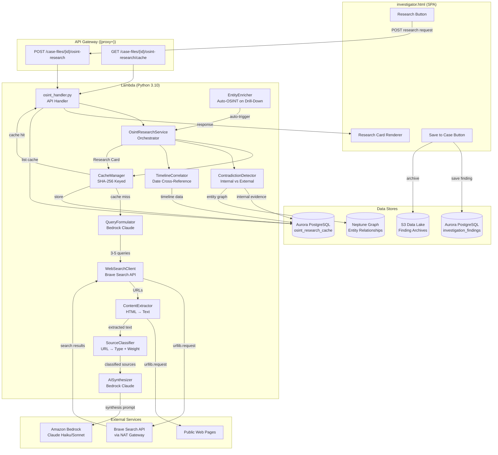
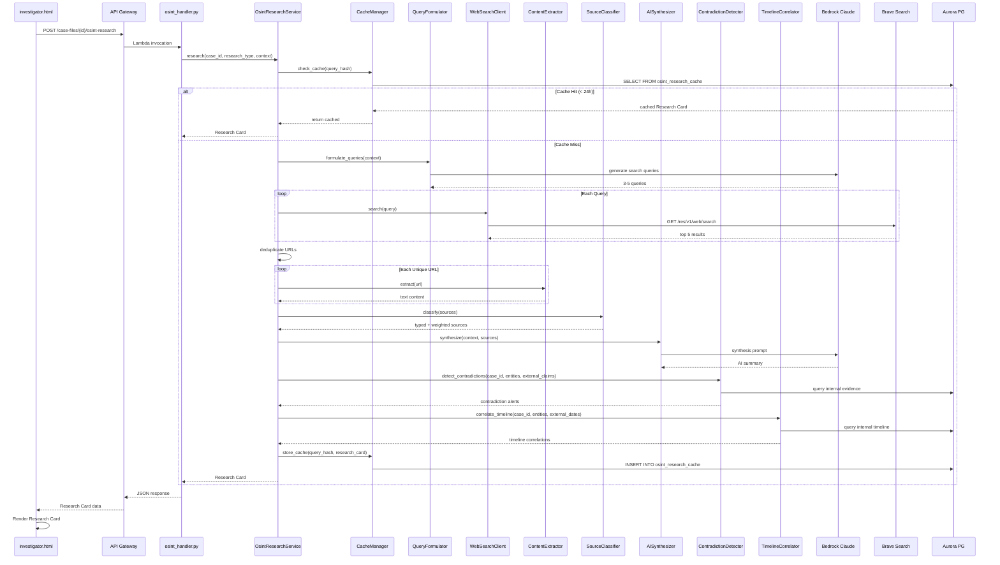

# Design Document: OSINT Research Agent

## Overview

The OSINT Research Agent adds external intelligence gathering to the Investigative Intelligence platform. When an investigator encounters a pattern, entity, or investigative question that warrants external research, they click a "Research This" button. The backend agent formulates search queries via Bedrock Claude, executes them against a web search API (Brave Search), extracts and synthesizes content, and returns a Research Card with an AI summary, credibility assessment, contradiction detection against internal evidence, timeline cross-references, and sourced links. Results are cached in Aurora PostgreSQL for 24 hours and can be pinned to the case as formal findings via the existing Findings Service.

The system runs entirely within the existing Lambda + API Gateway architecture. Web search goes through the Lambda's NAT gateway using `urllib.request` to call the Brave Search API. No new infrastructure is required beyond a Brave Search API key stored in Secrets Manager and a new Aurora migration for the cache table.

## Architecture

### High-Level System Diagram



### Request Flow (Sequence)



## Components and Interfaces

### 1. API Handler — `src/lambdas/api/osint_handler.py`

Follows the existing handler pattern (see `investigator_analysis.py`, `findings.py`). Registered in `case_files.py` `dispatch_handler` via path matching on `/osint-research`.

```python
# POST /case-files/{id}/osint-research
def research_handler(event, context) -> dict:
    """Trigger OSINT research for an entity, pattern, or question."""
    # Body: { research_type: "entity"|"pattern"|"question",
    #         context: { entity_name, entity_type, ... },
    #         force_refresh: bool }
    # Returns: Research Card JSON

# GET /case-files/{id}/osint-research/cache
def list_cache_handler(event, context) -> dict:
    """List all cached OSINT research results for a case."""
    # Returns: { results: [...], total: int }
```

### 2. Orchestrator — `src/services/osint_research_service.py`

Central service that coordinates the full research pipeline. Follows the same constructor pattern as `PatternDiscoveryService`.

```python
class OsintResearchService:
    def __init__(self, aurora_cm: ConnectionManager, bedrock_client: Any,
                 neptune_endpoint: str, neptune_port: str = "8182",
                 brave_api_key: Optional[str] = None) -> None: ...

    def research(self, case_id: str, research_type: str,
                 context: dict, force_refresh: bool = False) -> dict:
        """Full research pipeline: cache check → query → search → extract → synthesize → cache store.
        Returns a Research Card dict."""

    def get_cached_results(self, case_id: str, limit: int = 50) -> list:
        """List all cached research results for a case."""
```

### 3. Query Formulator — `src/services/osint_research_service.py` (internal method)

Uses Bedrock Claude to generate 3-5 targeted search queries from investigation context.

```python
def _formulate_queries(self, research_type: str, context: dict) -> list[str]:
    """Generate 3-5 search queries via Bedrock Claude.
    
    For entity context: uses entity_name, entity_type, aliases, connected entities.
    For pattern context: uses pattern entities, relationship_type, description.
    For question context: uses question text and associated entity names.
    """
```

### 4. Web Search Client — `src/services/web_search_client.py`

Thin wrapper around Brave Search API using `urllib.request` (Lambda runs in VPC with NAT gateway).

```python
class WebSearchClient:
    def __init__(self, api_key: str, timeout: int = 10) -> None: ...

    def search(self, query: str, count: int = 5) -> list[dict]:
        """Execute a web search query. Returns list of {url, title, snippet}.
        Raises WebSearchError on failure."""

    def fetch_page(self, url: str) -> Optional[str]:
        """Fetch full page HTML. Returns None on timeout/error."""
```

### 5. Content Extractor — `src/services/osint_research_service.py` (internal method)

Strips HTML to extract main text content. Uses Python stdlib (`html.parser`) — no external dependencies.

```python
def _extract_text(self, html: str) -> str:
    """Strip HTML tags, navigation, scripts, styles. Return clean text.
    Truncates to 3000 chars per page to stay within Bedrock token limits."""
```

### 6. Source Classifier — `src/services/osint_research_service.py` (internal method)

Classifies URLs by domain patterns and assigns reliability weights.

```python
SOURCE_WEIGHTS: dict[str, float] = {
    "government": 0.95,
    "academic": 0.90,
    "legal_filing": 0.85,
    "news": 0.80,
    "corporate_record": 0.70,
    "social_media": 0.40,
    "blog": 0.30,
}

def _classify_source(self, url: str, title: str) -> tuple[str, float]:
    """Classify a URL into a source type and return (type, weight).
    Uses domain pattern matching (.gov, .edu, known news domains, etc.)."""
```

### 7. AI Synthesizer — `src/services/osint_research_service.py` (internal method)

Sends extracted content + investigation context to Bedrock Claude for synthesis.

```python
def _synthesize(self, context: dict, sources: list[dict]) -> dict:
    """Call Bedrock Claude to produce:
    - summary: str (200-400 words)
    - credibility: {rating: HIGH|MEDIUM|LOW, explanation: str}
    - sources: [{url, title, description, source_type, reliability}]
    - corroborating_evidence: list[str]
    - contradicting_evidence: list[str]
    - information_gaps: list[str]
    """
```

### 8. Contradiction Detector — `src/services/osint_research_service.py` (internal method)

Compares external claims against internal case evidence.

```python
def _detect_contradictions(self, case_id: str, entity_names: list[str],
                            external_summary: str) -> list[dict]:
    """Query Aurora documents and Neptune entity relationships for the given entities.
    Send internal evidence + external summary to Bedrock Claude to identify contradictions.
    Returns list of {internal_claim, external_claim, internal_source, external_source}."""
```

### 9. Timeline Correlator — `src/services/osint_research_service.py` (internal method)

Cross-references external dates against internal document timeline.

```python
def _correlate_timeline(self, case_id: str, entity_names: list[str],
                         external_dates: list[dict]) -> dict:
    """Compare external date references against internal timeline.
    Returns {correlations: [{internal_date, external_date, description, gap_days}],
             gaps: [{external_date, description, note}]}."""
```

### 10. Cache Manager — `src/services/osint_research_service.py` (internal method)

SHA-256 keyed cache with 24-hour TTL in Aurora.

```python
def _cache_key(self, case_id: str, research_type: str, context: dict) -> str:
    """Generate SHA-256 hash from normalized (case_id + research_type + sorted context)."""

def _check_cache(self, cache_key: str) -> Optional[dict]:
    """Return cached Research Card if exists and < 24h old, else None."""

def _store_cache(self, cache_key: str, case_id: str, research_type: str,
                  context_summary: str, research_card: dict) -> None:
    """Upsert Research Card into osint_research_cache table."""
```

### 11. Entity Enricher — Frontend-triggered via existing Research Button

Entity enrichment is implemented as an automatic OSINT research call when the entity drill-down panel opens. The frontend sends `research_type: "entity"` with the entity context. The "External Intelligence" section renders below the AI Investigative Questions using the same Research Card component. Cached results (< 24h) are served instantly.

### 12. Frontend Components — `src/frontend/investigator.html`

All frontend changes are inline JS additions to the existing SPA:

- `_renderResearchButton(context)` — renders the 🔍 Research This button
- `_triggerOsintResearch(caseId, researchType, context)` — calls POST API
- `_renderResearchCard(data, container)` — renders the Research Card with summary, sources, badges, contradictions, timeline
- `_saveResearchToCase(caseId, researchCard)` — calls POST /case-files/{id}/findings with finding_type="osint_research"
- `_renderEntityEnrichment(caseId, entityName, entityType)` — auto-triggers on entity drill-down open

## Data Models

### Research Card (API Response)

```json
{
  "research_id": "uuid",
  "case_id": "uuid",
  "research_type": "entity|pattern|question",
  "context_summary": "Jeffrey Epstein (person)",
  "summary": "AI-synthesized 200-400 word summary...",
  "credibility": {
    "rating": "HIGH|MEDIUM|LOW",
    "explanation": "Based on 3 government sources and 2 established news outlets...",
    "weighted_score": 0.82
  },
  "sources": [
    {
      "url": "https://...",
      "title": "Source title",
      "description": "One-line description",
      "source_type": "government",
      "reliability_weight": 0.95
    }
  ],
  "contradictions": [
    {
      "internal_claim": "Document X states meeting on Jan 5",
      "external_claim": "News report places subject in London on Jan 5",
      "internal_source": "doc_filename.pdf",
      "external_source": "https://..."
    }
  ],
  "timeline_correlations": {
    "correlations": [
      {
        "internal_date": "2019-01-15",
        "external_date": "2019-01-18",
        "description": "Internal memo matches news report timing",
        "gap_days": 3
      }
    ],
    "gaps": [
      {
        "external_date": "2018-06-01",
        "description": "Major news event with no internal documents",
        "note": "Potential area for further investigation"
      }
    ]
  },
  "entity_names": ["Jeffrey Epstein"],
  "query_count": 4,
  "source_count": 12,
  "cached": false,
  "created_at": "2024-01-15T10:30:00Z"
}
```

### Aurora Migration — `src/db/migrations/013_osint_research_cache.sql`

```sql
BEGIN;

CREATE TABLE IF NOT EXISTS osint_research_cache (
    cache_key     VARCHAR(64) PRIMARY KEY,  -- SHA-256 hex
    case_id       UUID NOT NULL,
    research_type VARCHAR(20) NOT NULL,     -- entity, pattern, question
    context_summary TEXT NOT NULL,           -- human-readable context label
    research_card JSONB NOT NULL,            -- full Research Card JSON
    created_at    TIMESTAMPTZ NOT NULL DEFAULT now(),
    updated_at    TIMESTAMPTZ NOT NULL DEFAULT now()
);

CREATE INDEX idx_osint_cache_case_id ON osint_research_cache(case_id);
CREATE INDEX idx_osint_cache_updated ON osint_research_cache(updated_at);

COMMIT;
```

### API Request Body — POST /case-files/{id}/osint-research

```json
{
  "research_type": "entity",
  "context": {
    "entity_name": "Jeffrey Epstein",
    "entity_type": "person",
    "aliases": ["Jeff Epstein"],
    "connected_entities": ["Ghislaine Maxwell", "Les Wexner"],
    "pattern_summary": null,
    "question_text": null
  },
  "force_refresh": false
}
```

### Source Classification Rules

| Domain Pattern | Source Type | Weight |
|---|---|---|
| `.gov`, `.mil` | government | 0.95 |
| `.edu`, `scholar.google`, `arxiv.org` | academic | 0.90 |
| `courtlistener.com`, `pacer.gov`, `sec.gov/cgi-bin` | legal_filing | 0.85 |
| Known news domains (reuters, ap, nytimes, bbc, etc.) | news | 0.80 |
| `sec.gov`, `opencorporates`, `dnb.com` | corporate_record | 0.70 |
| `twitter.com`, `facebook.com`, `reddit.com`, `linkedin.com` | social_media | 0.40 |
| Default / unknown | blog | 0.30 |

### Credibility Rating Thresholds

| Weighted Average | Rating |
|---|---|
| ≥ 0.75 | HIGH |
| ≥ 0.50 | MEDIUM |
| < 0.50 | LOW |

## Key Function Signatures (Low-Level Design)

### osint_handler.py

```python
def _build_osint_service() -> OsintResearchService:
    """Construct service with Aurora CM, Bedrock client, Neptune endpoint, Brave API key."""

def research_handler(event: dict, context: Any) -> dict:
    """POST /case-files/{id}/osint-research
    Validates request body, delegates to OsintResearchService.research().
    Returns Research Card JSON within 30s timeout budget."""

def list_cache_handler(event: dict, context: Any) -> dict:
    """GET /case-files/{id}/osint-research/cache
    Returns all cached research results for a case."""
```

### OsintResearchService — Core Algorithm

```python
def research(self, case_id: str, research_type: str,
             context: dict, force_refresh: bool = False) -> dict:
    """
    1. Compute cache_key = SHA-256(normalize(case_id + research_type + context))
    2. If not force_refresh: check_cache(cache_key) → return if hit
    3. formulate_queries(research_type, context) → 3-5 queries
    4. For each query: web_search(query) → top 5 results
    5. Deduplicate URLs across all queries
    6. For each unique URL: fetch_page(url) with 10s timeout → extract_text(html)
    7. classify_source(url, title) for each source → type + weight
    8. synthesize(context, classified_sources) via Bedrock → summary + credibility
    9. detect_contradictions(case_id, entity_names, summary) → contradiction alerts
    10. correlate_timeline(case_id, entity_names, external_dates) → correlations + gaps
    11. Assemble Research Card
    12. store_cache(cache_key, case_id, research_card)
    13. Return Research Card
    
    Time budget: ~25s total (5s query formulation, 10s web search+fetch, 8s synthesis, 2s contradiction+timeline)
    """
```

### WebSearchClient — Brave Search Integration

```python
class WebSearchClient:
    BRAVE_SEARCH_URL = "https://api.search.brave.com/res/v1/web/search"

    def __init__(self, api_key: str, timeout: int = 10) -> None:
        self._api_key = api_key
        self._timeout = timeout

    def search(self, query: str, count: int = 5) -> list[dict]:
        """
        GET https://api.search.brave.com/res/v1/web/search?q={query}&count={count}
        Headers: Accept: application/json, X-Subscription-Token: {api_key}
        Returns: [{url, title, snippet}]
        """

    def fetch_page(self, url: str) -> Optional[str]:
        """
        GET {url} with User-Agent header, 10s timeout.
        Returns raw HTML or None on error.
        Skips URLs matching blocked patterns (PDFs, videos, large files).
        """
```

### Content Extraction Algorithm

```python
def _extract_text(self, html: str) -> str:
    """
    1. Remove <script>, <style>, <nav>, <footer>, <header> blocks
    2. Use html.parser.HTMLParser subclass to extract text nodes
    3. Collapse whitespace, strip empty lines
    4. Truncate to 3000 chars (keeps within Bedrock token budget for 15 sources)
    """
```

### Source Classification Algorithm

```python
def _classify_source(self, url: str, title: str) -> tuple[str, float]:
    """
    1. Parse domain from URL
    2. Check against ordered rules:
       - .gov/.mil → government (0.95)
       - .edu/scholar.google/arxiv → academic (0.90)
       - courtlistener/pacer/sec.gov filings → legal_filing (0.85)
       - Known news domain set → news (0.80)
       - sec.gov/opencorporates/dnb → corporate_record (0.70)
       - Social media domains → social_media (0.40)
       - Default → blog (0.30)
    3. Return (source_type, weight)
    """
```

### Credibility Assessment Algorithm

```python
def _compute_credibility(self, sources: list[dict]) -> dict:
    """
    1. weighted_avg = sum(s.weight for s in sources) / len(sources)
    2. rating = HIGH if weighted_avg >= 0.75 else MEDIUM if >= 0.50 else LOW
    3. explanation = f"Based on {counts_by_type} across {len(sources)} sources"
    4. Return {rating, explanation, weighted_score: weighted_avg}
    """
```

### Contradiction Detection Algorithm

```python
def _detect_contradictions(self, case_id: str, entity_names: list[str],
                            external_summary: str) -> list[dict]:
    """
    1. Query Aurora documents table for docs mentioning entity_names (LIKE search)
    2. Query Neptune for entity relationships and properties
    3. Build internal_evidence_text from top 5 relevant doc excerpts
    4. Send to Bedrock Claude: "Compare internal evidence vs external summary.
       Identify specific factual contradictions. Return JSON array."
    5. Parse response → list of {internal_claim, external_claim, internal_source, external_source}
    6. Return empty list if no contradictions found
    """
```

### Timeline Correlation Algorithm

```python
def _correlate_timeline(self, case_id: str, entity_names: list[str],
                         external_dates: list[dict]) -> dict:
    """
    1. Query Aurora documents for date references associated with entity_names
    2. For each external_date, find internal dates within 30-day window
    3. Matched pairs → correlations list
    4. External dates with no internal match → gaps list
    5. Sort both lists chronologically
    6. Return {correlations: [...], gaps: [...]}
    """
```

### Route Registration in dispatch_handler

Add to `src/lambdas/api/case_files.py` `dispatch_handler`:

```python
# --- OSINT Research routes ---
if "/osint-research" in path:
    from lambdas.api.osint_handler import research_handler, list_cache_handler
    if method == "POST":
        return research_handler(event, context)
    elif method == "GET":
        return list_cache_handler(event, context)
```

## Correctness Properties

*A property is a characteristic or behavior that should hold true across all valid executions of a system — essentially, a formal statement about what the system should do. Properties serve as the bridge between human-readable specifications and machine-verifiable correctness guarantees.*

### Property 1: Query count invariant

*For any* valid research context (entity, pattern, or question type) with non-empty identifying fields, `_formulate_queries` SHALL return between 3 and 5 search query strings inclusive.

**Validates: Requirements 2.1, 2.2, 2.3**

### Property 2: HTML text extraction strips forbidden elements

*For any* HTML string containing `<script>`, `<style>`, `<nav>`, `<footer>`, or `<header>` elements, `_extract_text` SHALL return a string that contains none of those tag names or their content.

**Validates: Requirements 3.4**

### Property 3: URL deduplication invariant

*For any* list of search result dicts (each with a `url` field), after deduplication the output list SHALL contain no duplicate URLs, and every URL in the output SHALL have appeared in the input.

**Validates: Requirements 3.5**

### Property 4: Research Card structural completeness

*For any* non-empty set of classified sources and a valid synthesis response, the produced Research Card SHALL contain: a `summary` string of 200-400 words, a `credibility` object with `rating` in {HIGH, MEDIUM, LOW}, and a `sources` list of 3-5 items each having `url`, `title`, `description`, `source_type`, and `reliability_weight` fields.

**Validates: Requirements 4.2**

### Property 5: Source classification correctness

*For any* URL string, `_classify_source` SHALL return exactly one `source_type` from the set {news, academic, government, social_media, legal_filing, corporate_record, blog} and the corresponding `reliability_weight` SHALL match the defined mapping (government=0.95, academic=0.90, legal_filing=0.85, news=0.80, corporate_record=0.70, social_media=0.40, blog=0.30).

**Validates: Requirements 5.1, 5.2**

### Property 6: Credibility weighted average computation

*For any* non-empty list of sources with known reliability weights, `_compute_credibility` SHALL return a `weighted_score` equal to the arithmetic mean of the weights, and the `rating` SHALL be HIGH if weighted_score ≥ 0.75, MEDIUM if ≥ 0.50, or LOW otherwise.

**Validates: Requirements 5.4**

### Property 7: Contradiction alert structure

*For any* detected contradiction, the contradiction alert dict SHALL contain all four fields: `internal_claim`, `external_claim`, `internal_source`, and `external_source`, each as non-empty strings.

**Validates: Requirements 6.2**

### Property 8: Timeline 30-day correlation matching

*For any* pair of an internal date and an external date, if the absolute difference is ≤ 30 days, the pair SHALL appear in the `correlations` list. If an external date has no internal date within 30 days, it SHALL appear in the `gaps` list. No date pair SHALL appear in both lists.

**Validates: Requirements 7.2, 7.3**

### Property 9: Timeline chronological ordering

*For any* set of timeline entries (correlations and gaps), the output lists SHALL be sorted in ascending chronological order by date.

**Validates: Requirements 7.4**

### Property 10: Cache key determinism

*For any* research context (case_id, research_type, context dict), computing the cache key twice with the same inputs SHALL produce identical SHA-256 hex strings. Additionally, two different contexts SHALL produce different cache keys (collision resistance).

**Validates: Requirements 9.1**

### Property 11: Cache TTL behavior

*For any* cached Research Card entry, if the entry's `updated_at` is less than 24 hours ago and `force_refresh` is false, the system SHALL return the cached entry without invoking web search. If the entry is ≥ 24 hours old, the system SHALL invoke a fresh research cycle.

**Validates: Requirements 9.2, 9.3**

### Property 12: Finding tags preservation

*For any* Research Card saved as a finding, the persisted finding's `entity_names` SHALL equal the Research Card's `entity_names`, and the finding's `tags` SHALL include all `source_type` values from the Research Card's sources.

**Validates: Requirements 10.3**

### Property 13: Request validation returns 400

*For any* POST request body missing the required `research_type` field or missing the `context` field, the API handler SHALL return HTTP status 400 with an error response containing a descriptive validation message.

**Validates: Requirements 11.3**

## Error Handling

| Error Scenario | Handling | HTTP Status |
|---|---|---|
| Missing `research_type` or `context` in request body | Return validation error | 400 |
| Invalid `research_type` (not entity/pattern/question) | Return validation error | 400 |
| Missing case ID in path | Return validation error | 400 |
| Brave Search API key not configured | Return config error, log warning | 500 |
| Brave Search API returns error/timeout | Log error, return Research Card with "no results found" message | 200 (degraded) |
| Individual URL fetch timeout (>10s) | Skip URL, continue with remaining | N/A (internal) |
| All URL fetches fail | Return Research Card with "no content could be retrieved" message | 200 (degraded) |
| Bedrock Claude synthesis fails | Return Research Card with raw source links only, no AI summary | 200 (degraded) |
| Bedrock Claude returns unparseable JSON | Fallback to text summary, log parse error | 200 (degraded) |
| Contradiction detection fails | Skip contradictions section, log error | 200 (degraded) |
| Timeline correlation fails | Skip timeline section, log error | 200 (degraded) |
| Aurora cache read fails | Proceed without cache (fresh research), log error | N/A (internal) |
| Aurora cache write fails | Return Research Card anyway, log error | 200 |
| Neptune query fails | Skip graph-based contradiction data, use Aurora only | N/A (internal) |
| Lambda timeout approaching (>25s elapsed) | Skip remaining optional steps (contradictions, timeline), return partial Research Card | 200 (partial) |

Design principle: The research pipeline is **gracefully degradable**. Each component (search, extraction, synthesis, contradiction, timeline) can fail independently without blocking the overall response. The Research Card always returns — it just has fewer sections when components fail.

## Testing Strategy

### Property-Based Tests (Hypothesis)

Library: `hypothesis` (Python PBT library)
Minimum iterations: 100 per property

Each property test references its design document property:

```
# Feature: osint-research-agent, Property 1: Query count invariant
# Feature: osint-research-agent, Property 2: HTML text extraction strips forbidden elements
# ... etc.
```

Property tests cover Properties 1-13 from the Correctness Properties section. These test pure functions and deterministic logic:

- **Properties 1-3**: Query formulation, text extraction, deduplication — pure functions with clear input/output
- **Properties 4-7**: Research Card structure, source classification, credibility computation, contradiction structure — deterministic transformations
- **Properties 8-9**: Timeline correlation matching and ordering — date arithmetic
- **Properties 10-11**: Cache key determinism and TTL behavior — deterministic with mocked clock
- **Properties 12-13**: Finding tags preservation and request validation — structural invariants

Bedrock calls are mocked in property tests to keep them fast and deterministic. The mock returns well-structured JSON matching the expected schema.

### Unit Tests (pytest)

Example-based tests for specific scenarios:

- Research Button appears on pattern cards, entity drill-down, AI briefing questions (Requirements 1.1-1.4)
- Empty search results return "no significant public information" message (Requirement 4.4)
- No contradictions returns consistency statement (Requirement 6.3)
- Force refresh bypasses cache (Requirement 9.4)
- Save to Case persists with finding_type="osint_research" (Requirement 10.2)
- Endpoint smoke tests for POST and GET routes (Requirements 11.1, 11.5)
- URL fetch timeout/failure skips gracefully (Requirement 3.3)
- Internal error returns 500 with error code (Requirement 11.4)

### Integration Tests

- End-to-end research flow with mocked Brave Search API and mocked Bedrock
- Cache round-trip: store → retrieve → expire → refresh
- Save to Case via Findings Service with mocked Aurora
- Entity enrichment auto-trigger flow
- Contradiction detection with mocked Aurora documents and Neptune entities
