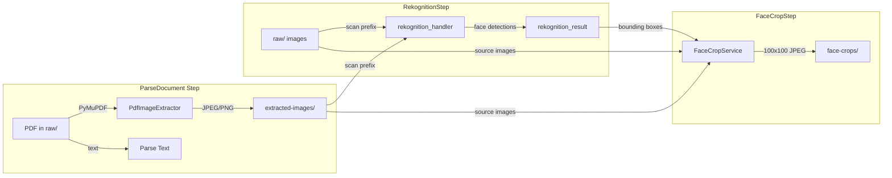

# Design Document: PDF Image Extraction Pipeline

## Overview

This design extends the existing ingestion pipeline to extract embedded images from PDF documents during the `ParseDocument` step, route those images through Rekognition analysis, and crop detected faces into thumbnails for the investigation wall. The design follows the project's strict "extend, never replace" philosophy — all changes are additive to existing modules.

Today, `parse_handler.py` downloads a raw file, decodes it as UTF-8 text, and passes it to `DocumentParser.parse()`. PDF files with embedded photographs are either skipped (if they fail UTF-8 decode) or have their text extracted but images discarded. This feature adds a `PdfImageExtractor` component that runs alongside text extraction when the raw file is a PDF, saves extracted images to a new `extracted-images/` S3 prefix, and returns image metadata in the parse result. Downstream, `rekognition_handler.py` is extended to also scan the `extracted-images/` prefix, and a new `FaceCropStep` + `face_crop_handler.py` Lambda crops detected faces into thumbnails.

### Key Design Decisions

1. **PyMuPDF (fitz) for image extraction** — PyMuPDF provides `page.get_images()` and `fitz.Pixmap` for reliable embedded image extraction. It handles JPEG, PNG, SMASK, and JBIG2 image streams. Added to the Lambda layer alongside Pillow.
2. **Additive parse_handler changes** — The existing `parse_handler.py` gains a new code path for `.pdf` files that runs `PdfImageExtractor` before falling back to text extraction. Non-PDF files are completely unaffected.
3. **New S3 prefix `extracted-images/`** — A new `PrefixType.EXTRACTED_IMAGES` enum value is added to `s3_helper.py`. This keeps extracted images separate from `raw/` uploads and `processed/` output, making them easy to discover by Rekognition.
4. **Rekognition handler extended, not replaced** — `_list_media_files()` in `rekognition_handler.py` gains an additional prefix scan for `extracted-images/`. All existing scanning logic is preserved.
5. **FaceCropStep follows existing error-handling pattern** — Uses the same Retry/Catch/TimeoutSeconds pattern as `RekognitionStep` in the ASL. On failure, catches to `$.face_crop_error` and continues to `ChooseGraphLoadStrategy`.
6. **FaceCropService is a new standalone service** — Defined in `src/services/face_crop_service.py`, it uses Pillow for image cropping. It's invoked by a new `face_crop_handler.py` Lambda.
7. **Config-driven** — Image extraction respects `effective_config.parse.extract_images` (default: `true`). Face cropping respects `effective_config.face_crop.enabled` (default: `true` when Rekognition is enabled).

## Architecture

### Pipeline Flow (Modified)

```mermaid
stateDiagram-v2
    [*] --> ResolveConfig
    ResolveConfig --> CheckSampleMode
    CheckSampleMode --> ProcessDocuments

    state ProcessDocuments {
        [*] --> ParseDocument
        ParseDocument --> ClassifyDocument
        note right of ParseDocument: NEW: PDF files also extract images to S3
        ClassifyDocument --> ExtractEntities
        ExtractEntities --> GenerateEmbedding
        GenerateEmbedding --> StoreExtractionArtifact
        StoreExtractionArtifact --> DocumentSuccess
    }

    ProcessDocuments --> CheckRekognitionEnabled
    CheckRekognitionEnabled --> RekognitionStep: enabled
    CheckRekognitionEnabled --> ChooseGraphLoadStrategy: disabled
    note right of RekognitionStep: EXTENDED: also scans extracted-images/ prefix
    RekognitionStep --> FaceCropStep
    note right of FaceCropStep: NEW: crops faces from Rekognition detections
    FaceCropStep --> ChooseGraphLoadStrategy
    ChooseGraphLoadStrategy --> BulkCSVLoad
    ChooseGraphLoadStrategy --> GremlinLoad
    BulkCSVLoad --> UpdateCaseStatusIndexed
    GremlinLoad --> UpdateCaseStatusIndexed
    UpdateCaseStatusIndexed --> [*]
```

### S3 Data Flow



## Components and Interfaces

### 1. PdfImageExtractor (`src/services/pdf_image_extractor.py`) — NEW

Extracts embedded images from PDF files using PyMuPDF. This is a new standalone service module.

```python
class PdfImageExtractor:
    """Extracts embedded images from PDF files using PyMuPDF (fitz)."""

    MIN_DIMENSION = 50  # Skip images smaller than 50x50

    def __init__(self, s3_bucket: str):
        self.s3_bucket = s3_bucket

    def extract_images(self, pdf_bytes: bytes, case_id: str, document_id: str) -> dict:
        """Extract all embedded images from a PDF and upload to S3.

        Args:
            pdf_bytes: Raw PDF file bytes.
            case_id: The case file identifier.
            document_id: The document identifier.

        Returns:
            {
                "extracted_images": [
                    {
                        "s3_key": "cases/{case_id}/extracted-images/{document_id}_page0_img0.jpg",
                        "page_num": 0,
                        "width": 640,
                        "height": 480,
                        "file_size_bytes": 45230,
                        "source_document_id": "doc-123"
                    }, ...
                ],
                "image_extraction_summary": {
                    "total_pages_scanned": 12,
                    "total_images_found": 8,
                    "images_saved": 6,
                    "images_skipped_too_small": 2,
                    "extraction_errors": 0
                }
            }
        """

    def _extract_page_images(self, doc, page_num: int, case_id: str,
                              document_id: str) -> tuple[list[dict], int, int]:
        """Extract images from a single PDF page.

        Returns:
            (image_metadata_list, skipped_count, error_count)
        """

    def _save_image_to_s3(self, image_bytes: bytes, s3_key: str,
                           content_type: str) -> int:
        """Upload image bytes to S3 with correct Content-Type.

        Returns:
            File size in bytes.
        """
```

**Image format logic:**
- If the image has an alpha channel or is a PNG stream → save as PNG
- Otherwise → save as JPEG (quality=90)
- SMASK (soft mask) images are composited onto a white background before saving

### 2. Extended parse_handler.py (`src/lambdas/ingestion/parse_handler.py`) — MODIFIED

The existing handler gains a new code path for PDF files. The change is additive — a new function `_try_extract_pdf_images()` is called when the filename ends with `.pdf`. The existing text extraction path is preserved as-is.

```python
# NEW function added to parse_handler.py
def _try_extract_pdf_images(raw_bytes: bytes, case_id: str, document_id: str,
                             effective_config: dict) -> dict:
    """Attempt PDF image extraction. Returns image metadata or empty result.

    Called only for .pdf files. Falls back gracefully on any error.
    """

# MODIFIED handler return — adds extracted_images and image_extraction_summary
# to the existing return dict when processing PDFs:
# return {
#     "case_id": ...,
#     "document_id": ...,
#     "raw_text": ...,
#     "sections": ...,
#     "source_metadata": ...,
#     "extracted_images": [...],           # NEW (empty list for non-PDFs)
#     "image_extraction_summary": {...},   # NEW (empty dict for non-PDFs)
# }
```

**Key constraint:** The existing `DocumentParser.parse()` call and its text extraction logic are completely untouched. The PDF image extraction runs as a separate step before or after text extraction, using the raw bytes directly.

### 3. Extended s3_helper.py (`src/storage/s3_helper.py`) — MODIFIED

A new `PrefixType` enum value is added:

```python
class PrefixType(str, Enum):
    RAW = "raw"
    PROCESSED = "processed"
    EXTRACTIONS = "extractions"
    BULK_LOAD = "bulk-load"
    EXTRACTED_IMAGES = "extracted-images"  # NEW
```

All existing `build_key()`, `prefix_path()`, `upload_file()`, `download_file()`, `list_files()` functions work with the new prefix type without modification — they're already generic over `PrefixType`.

### 4. Extended rekognition_handler.py (`src/lambdas/ingestion/rekognition_handler.py`) — MODIFIED

The `_list_media_files()` function is extended to also scan the `extracted-images/` prefix. This is additive — the existing `cases/{case_id}/` prefix scan is preserved.

```python
# NEW function added to rekognition_handler.py
def _list_extracted_images(s3_client, s3_bucket: str, case_id: str) -> list:
    """List image files under the case's extracted-images/ prefix."""
    prefix = f"cases/{case_id}/extracted-images/"
    # ... paginate and return list of {"s3_key": ..., "type": "image", "size": ...}

# MODIFIED in handler():
#   media_files = _list_media_files(s3, s3_bucket, case_id)
#   extracted_images = _list_extracted_images(s3, s3_bucket, case_id)  # NEW
#   all_media = media_files + extracted_images                         # NEW
```

Each result from an extracted image is tagged with `source_document_id` parsed from the filename pattern `{document_id}_page{N}_img{M}.{ext}`.

### 5. FaceCropService (`src/services/face_crop_service.py`) — NEW

Crops face regions from source images using Rekognition bounding box coordinates. This service was designed in the multimedia-evidence-intelligence spec but not yet implemented.

```python
class FaceCropService:
    """Crops face bounding box regions from source images."""

    def __init__(self, s3_bucket: str):
        self.s3_bucket = s3_bucket

    def crop_faces(self, case_id: str, rekognition_results: list[dict]) -> dict:
        """Process all face detections from Rekognition output.

        For each face with confidence >= 0.90:
        1. Download source image from S3
        2. Crop bounding box region
        3. Resize to 100x100 JPEG
        4. Upload to cases/{case_id}/face-crops/{entity_name}/{hash}.jpg
        5. Select highest-confidence crop per entity as primary_thumbnail.jpg

        Returns:
            {
                "crops_created": int,
                "crops_from_extracted_images": int,
                "entities_with_thumbnails": list[str],
                "primary_thumbnails": {entity_name: s3_key},
                "errors": list[str]
            }
        """

    def _crop_single_face(self, image_bytes: bytes, bounding_box: dict,
                          target_size: tuple = (100, 100)) -> bytes:
        """Crop a face region from image bytes using bounding box coordinates.

        Bounding box values are normalized 0.0-1.0. Coordinates that exceed
        image boundaries are clamped to the edge.

        Returns:
            JPEG bytes of the cropped and resized face.
        """

    def _compute_crop_hash(self, s3_key: str, bounding_box: dict) -> str:
        """Deterministic hash from source key + bounding box for dedup.

        Uses hashlib.sha256 on f"{s3_key}:{Left}:{Top}:{Width}:{Height}".
        Returns first 12 hex chars.
        """
```

### 6. FaceCropHandler (`src/lambdas/ingestion/face_crop_handler.py`) — NEW

Thin Lambda handler wrapping `FaceCropService` for Step Functions invocation. Follows the same pattern as `rekognition_handler.py`.

```python
def handler(event, context):
    """Crop faces from Rekognition results.

    Event format (from Step Functions):
        {
            "case_id": "...",
            "rekognition_result": {
                "entities": [...],
                "artifact_key": "...",
                "status": "completed"
            },
            "effective_config": {...}
        }

    Returns:
        {
            "case_id": "...",
            "status": "completed" | "skipped",
            "crops_created": int,
            "crops_from_extracted_images": int,
            "primary_thumbnails": {entity_name: s3_key}
        }
    """
```

### 7. Step Functions ASL Changes (`infra/step_functions/ingestion_pipeline.json`) — MODIFIED

New `FaceCropStep` state inserted between `RekognitionStep` and `ChooseGraphLoadStrategy`. Also a new `CheckFaceCropEnabled` Choice state.

**Changes to existing states:**
- `RekognitionStep.Next` changes from `"ChooseGraphLoadStrategy"` to `"CheckFaceCropEnabled"`

**New states:**

```json
{
  "CheckFaceCropEnabled": {
    "Type": "Choice",
    "Choices": [
      {
        "And": [
          {"Variable": "$.effective_config.face_crop", "IsPresent": true},
          {"Variable": "$.effective_config.face_crop.enabled", "BooleanEquals": true}
        ],
        "Next": "FaceCropStep"
      }
    ],
    "Default": "ChooseGraphLoadStrategy"
  },
  "FaceCropStep": {
    "Type": "Task",
    "Resource": "${FaceCropLambdaArn}",
    "Parameters": {
      "case_id.$": "$.case_id",
      "rekognition_result.$": "$.rekognition_result",
      "effective_config.$": "$.effective_config"
    },
    "ResultPath": "$.face_crop_result",
    "TimeoutSeconds": 300,
    "Retry": [
      {
        "ErrorEquals": ["States.TaskFailed", "Lambda.ServiceException"],
        "IntervalSeconds": 3,
        "MaxAttempts": 2,
        "BackoffRate": 2.0
      }
    ],
    "Catch": [
      {
        "ErrorEquals": ["States.ALL"],
        "ResultPath": "$.face_crop_error",
        "Next": "ChooseGraphLoadStrategy"
      }
    ],
    "Next": "ChooseGraphLoadStrategy"
  }
}
```

Note: Uses `IsPresent` guard before `BooleanEquals` per Lesson Learned #24.

## Data Models

### Parse Result Extension

The parse handler return payload gains two new fields:

```json
{
  "case_id": "...",
  "document_id": "...",
  "raw_text": "...",
  "sections": [...],
  "source_metadata": {...},
  "extracted_images": [
    {
      "s3_key": "cases/{case_id}/extracted-images/{document_id}_page0_img0.jpg",
      "page_num": 0,
      "width": 640,
      "height": 480,
      "file_size_bytes": 45230,
      "source_document_id": "{document_id}"
    }
  ],
  "image_extraction_summary": {
    "total_pages_scanned": 12,
    "total_images_found": 8,
    "images_saved": 6,
    "images_skipped_too_small": 2,
    "extraction_errors": 0
  }
}
```

For non-PDF files, `extracted_images` is `[]` and `image_extraction_summary` is `{}`.

### S3 Layout Extension

```
cases/{case_id}/
  raw/                          # Existing — original uploads
  processed/                    # Existing — parsed output
  extractions/                  # Existing — entity extraction artifacts
  bulk-load/                    # Existing — Neptune CSV files
  extracted-images/             # NEW — images extracted from PDFs
    {document_id}_page0_img0.jpg
    {document_id}_page0_img1.png
    {document_id}_page3_img0.jpg
  face-crops/                   # NEW — cropped face thumbnails
    {entity_name}/
      {hash}.jpg
      primary_thumbnail.jpg
  rekognition-artifacts/        # Existing — Rekognition result JSON
```

### Extracted Image Filename Convention

Pattern: `{document_id}_page{page_num}_img{img_index}.{ext}`

- `page_num`: Zero-indexed page number within the PDF
- `img_index`: Sequential image number on that page (zero-indexed)
- `ext`: `jpg` for photographic content, `png` for graphics with transparency

The `source_document_id` can be parsed from the filename by splitting on `_page`.

### Face Crop S3 Path

Pattern: `cases/{case_id}/face-crops/{entity_name}/{hash}.jpg`

- `hash`: First 12 hex chars of SHA-256 of `"{s3_key}:{Left}:{Top}:{Width}:{Height}"`
- `primary_thumbnail.jpg`: Copy of the highest-confidence crop for each entity

### Effective Config Extensions

New sections added to the system default config:

```json
{
  "parse": {
    "pdf_method": "text",
    "ocr_enabled": false,
    "table_extraction_enabled": false,
    "extract_images": true,
    "min_image_dimension": 50
  },
  "face_crop": {
    "enabled": true,
    "min_face_confidence": 0.90,
    "thumbnail_size": 100,
    "thumbnail_format": "jpeg"
  }
}
```

These are additive to the existing config schema. `extract_images` defaults to `true`. `face_crop.enabled` defaults to `true` when Rekognition is enabled.

### Rekognition Result Extension

The Rekognition handler return payload gains a new field:

```json
{
  "case_id": "...",
  "status": "completed",
  "entities": [...],
  "media_processed": 15,
  "imported_count": 0,
  "artifact_key": "...",
  "extracted_image_count": 6
}
```

Each result dict in the internal `results` list from extracted images includes a `source_document_id` field.

### FaceCropStep Result

```json
{
  "case_id": "...",
  "status": "completed",
  "crops_created": 4,
  "crops_from_extracted_images": 2,
  "entities_with_thumbnails": ["Jeffrey Epstein", "Ghislaine Maxwell"],
  "primary_thumbnails": {
    "Jeffrey Epstein": "cases/{case_id}/face-crops/Jeffrey Epstein/primary_thumbnail.jpg",
    "Ghislaine Maxwell": "cases/{case_id}/face-crops/Ghislaine Maxwell/primary_thumbnail.jpg"
  }
}
```


## Correctness Properties

*A property is a characteristic or behavior that should hold true across all valid executions of a system — essentially, a formal statement about what the system should do. Properties serve as the bridge between human-readable specifications and machine-verifiable correctness guarantees.*

### Property 1: PDF image extraction produces complete metadata with consistent summary counts

*For any* PDF file containing N embedded images where K images have dimensions >= 50x50, the `PdfImageExtractor.extract_images()` output SHALL satisfy: (a) `len(extracted_images)` equals `images_saved`, (b) `images_saved + images_skipped_too_small + extraction_errors` equals `total_images_found`, (c) each item in `extracted_images` contains all required keys (`s3_key`, `page_num`, `width`, `height`, `file_size_bytes`, `source_document_id`), and (d) `extracted_images` is always a list (never None or omitted), even when empty.

**Validates: Requirements 1.1, 1.4, 2.4, 2.5, 7.1**

### Property 2: Extracted image S3 key format and content type correctness

*For any* case_id, document_id, page_num (non-negative integer), img_index (non-negative integer), and image format (JPEG or PNG), the generated S3 key SHALL match the pattern `cases/{case_id}/extracted-images/{document_id}_page{page_num}_img{img_index}.{ext}` where ext is `jpg` for JPEG and `png` for PNG, and the S3 Content-Type SHALL be `image/jpeg` for JPEG files and `image/png` for PNG files.

**Validates: Requirements 1.2, 2.1, 2.2, 2.3**

### Property 3: Small image filtering by minimum dimension

*For any* embedded image with width < 50 or height < 50, the `PdfImageExtractor` SHALL exclude it from `extracted_images` and increment `images_skipped_too_small`. *For any* embedded image with width >= 50 and height >= 50, the extractor SHALL include it in `extracted_images` (assuming no extraction error occurs).

**Validates: Requirements 1.3**

### Property 4: Source document ID round-trip from extracted image filename

*For any* document_id string (not containing the substring `_page`), the filename generated by `PdfImageExtractor` for that document's images SHALL allow the original document_id to be recovered by parsing the filename up to the first `_page` occurrence. That is, `parse_document_id(generate_filename(document_id, page, idx, ext))` equals `document_id`.

**Validates: Requirements 3.4**

### Property 5: Rekognition handler discovers all extracted images alongside uploaded media

*For any* case with M directly uploaded media files and N extracted images in the `extracted-images/` prefix, the Rekognition handler SHALL process M + N total files, and the `extracted_image_count` in the return payload SHALL equal N.

**Validates: Requirements 3.1, 3.3, 7.2**

### Property 6: Face crop output is valid 100x100 JPEG

*For any* valid source image (JPEG, PNG, or TIFF) and any Rekognition bounding box with normalized coordinates in [0.0, 1.0] (with clamping for overflow), `FaceCropService._crop_single_face()` SHALL return bytes that decode to a valid JPEG image with dimensions exactly 100x100 pixels.

**Validates: Requirements 5.1, 5.2**

### Property 7: Face crop hash determinism and S3 path format

*For any* S3 key and bounding box dict, `_compute_crop_hash(s3_key, bounding_box)` called twice with the same inputs SHALL return the same 12-character hex string. *For any* two distinct (s3_key, bounding_box) pairs, the hashes SHALL differ. The resulting face crop S3 key SHALL match the pattern `cases/{case_id}/face-crops/{entity_name}/{hash}.jpg`.

**Validates: Requirements 4.2, 5.3**

### Property 8: Primary thumbnail is highest confidence crop

*For any* entity with N face crops (N >= 1) at varying confidence levels, the `FaceCropService` SHALL select the crop with the maximum confidence value as `primary_thumbnail.jpg`. The selected primary's confidence SHALL be >= all other crops' confidences for that entity.

**Validates: Requirements 5.4**

## Error Handling

### PdfImageExtractor Errors

| Error Condition | Handling | Impact |
|----------------|----------|--------|
| PyMuPDF fails to open PDF (corrupt/encrypted) | Log warning with document_id and error, return empty `extracted_images` list, continue with text-only extraction | Text extraction still works; no images for this doc |
| Single page image extraction fails | Log error with document_id and page_num, increment `extraction_errors`, continue to next page | Other pages still processed |
| S3 upload of extracted image fails | Log error with S3 key, skip this image, increment `extraction_errors` | Other images still uploaded |
| Image has unsupported color space (CMYK, etc.) | Convert to RGB via Pillow before saving, log info | Graceful conversion |
| PyMuPDF not installed in Lambda layer | Catch ImportError, log warning, return empty result | Falls back to text-only; pipeline continues |

### Extended Rekognition Handler Errors

| Error Condition | Handling | Impact |
|----------------|----------|--------|
| `extracted-images/` prefix has no files | `_list_extracted_images()` returns empty list | No change to existing behavior |
| Extracted image is corrupt/unreadable by Rekognition | Existing per-image try/except in `_process_image()` logs warning and continues | Other images still processed |
| Filename doesn't match expected pattern | `source_document_id` set to `"unknown"`, log warning | Traceability degraded but processing continues |

### FaceCropService Errors

| Error Condition | Handling | Impact |
|----------------|----------|--------|
| Source image download fails (S3 404/403) | Log warning with S3 key, skip this crop, add to errors list | Other crops still processed |
| Corrupt/unreadable image bytes | Log warning, skip crop | Non-blocking |
| Bounding box out of bounds (Left+Width > 1.0) | Clamp to image boundaries, attempt crop | Best-effort crop |
| Pillow not installed in Lambda layer | Return `status: skipped` with reason | Pipeline continues to graph load |
| S3 upload of crop fails | Log error, skip this crop | Other crops still uploaded |
| Zero face detections in Rekognition result | Return `status: completed` with `crops_created: 0` | Normal empty result |

### Pipeline-Level Error Handling

The `FaceCropStep` uses a `Catch` block that routes to `ChooseGraphLoadStrategy` on any error. The error is captured in `$.face_crop_error` for debugging. This follows the same non-blocking pattern used by `RekognitionStep` — face cropping failures never block graph loading or status updates.

The `CheckFaceCropEnabled` Choice state uses `IsPresent` guard before `BooleanEquals` (per Lesson Learned #24) to handle cases where `effective_config.face_crop` doesn't exist.

## Testing Strategy

### Property-Based Testing

**Library:** `hypothesis` (Python) — already available in the test environment.

**Configuration:** Each property test runs a minimum of 100 iterations via `@settings(max_examples=100)`.

**Tag format:** Each test is tagged with a comment referencing the design property.

Properties to implement as property-based tests:

1. **Property 1** — Generate random lists of image metadata (varying dimensions, page numbers) and verify extraction summary invariants (counts add up, required keys present, extracted_images is always a list)
   - `# Feature: pdf-image-extraction-pipeline, Property 1: PDF image extraction produces complete metadata with consistent summary counts`

2. **Property 2** — Generate random case_ids, document_ids, page_nums, img_indexes, and formats; verify S3 key matches pattern and content type is correct
   - `# Feature: pdf-image-extraction-pipeline, Property 2: Extracted image S3 key format and content type correctness`

3. **Property 3** — Generate random image dimensions (0-5000 range); verify images < 50x50 are excluded and >= 50x50 are included
   - `# Feature: pdf-image-extraction-pipeline, Property 3: Small image filtering by minimum dimension`

4. **Property 4** — Generate random document_id strings (excluding `_page` substring); verify round-trip: parse_document_id(generate_filename(doc_id, page, idx, ext)) == doc_id
   - `# Feature: pdf-image-extraction-pipeline, Property 4: Source document ID round-trip from extracted image filename`

5. **Property 5** — Generate random counts of uploaded media and extracted images; verify total processed equals sum and extracted_image_count is correct
   - `# Feature: pdf-image-extraction-pipeline, Property 5: Rekognition handler discovers all extracted images alongside uploaded media`

6. **Property 6** — Generate random valid images (various sizes/formats) and random bounding boxes with values in [0,1]; verify output is valid 100x100 JPEG
   - `# Feature: pdf-image-extraction-pipeline, Property 6: Face crop output is valid 100x100 JPEG`

7. **Property 7** — Generate random S3 keys and bounding box dicts; verify hash determinism (same inputs → same hash) and uniqueness (different inputs → different hash)
   - `# Feature: pdf-image-extraction-pipeline, Property 7: Face crop hash determinism and S3 path format`

8. **Property 8** — Generate random lists of crops per entity with varying confidences; verify primary = max confidence
   - `# Feature: pdf-image-extraction-pipeline, Property 8: Primary thumbnail is highest confidence crop`

### Unit Tests

Specific examples and edge cases:

1. **PdfImageExtractor** — Test with a known PDF containing 2 images (one 100x100, one 30x30); verify one is extracted and one is skipped
2. **PdfImageExtractor** — Test with corrupt PDF bytes; verify graceful fallback with empty extracted_images
3. **PdfImageExtractor** — Test with a PDF containing zero images; verify empty list returned (not None)
4. **parse_handler** — Test with a `.txt` file; verify `extracted_images` is `[]` and `image_extraction_summary` is `{}`
5. **parse_handler** — Test with a `.pdf` file; verify both text and images are extracted
6. **s3_helper** — Test `PrefixType.EXTRACTED_IMAGES` works with `build_key()` and `prefix_path()`
7. **rekognition_handler** — Test `_list_extracted_images()` returns files from `extracted-images/` prefix
8. **rekognition_handler** — Test source_document_id parsing from filenames with edge cases (underscores in document_id)
9. **FaceCropService** — Test with bounding box where Left+Width > 1.0; verify clamping
10. **FaceCropService** — Test with zero-byte image; verify skip with warning
11. **FaceCropStep ASL** — Verify Catch routes to ChooseGraphLoadStrategy on error
12. **FaceCropStep ASL** — Verify CheckFaceCropEnabled skips when config missing

### Integration Tests

1. **End-to-end PDF extraction** — Upload a test PDF with embedded images to S3, run parse_handler, verify images appear in `extracted-images/` prefix
2. **Rekognition with extracted images** — Place test images in `extracted-images/`, run rekognition_handler, verify they appear in results
3. **Face crop pipeline** — Run FaceCropStep with mock Rekognition results containing face detections, verify crops in `face-crops/` prefix
