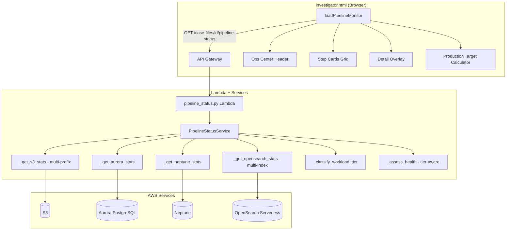

# Design Document — Pipeline Dashboard Fixes

## Overview

This design addresses six targeted enhancements to the Pipeline Monitor Dashboard (`src/frontend/investigator.html`) and its backend service (`src/services/pipeline_status_service.py`). The changes span two layers:

1. **Backend (Python)**: Enhance `PipelineStatusService` to fix data accuracy issues (S3 counts, OpenSearch vector counts), add workload-tier classification, compute docs/minute throughput, and return richer metadata.
2. **Frontend (JavaScript)**: Update the `loadPipelineMonitor()` function in `investigator.html` to display docs/minute, wire step card click → detail overlay, show workload tier labels, and add a production target projection calculator.

The existing API contract (`GET /case-files/{id}/pipeline-status`) remains unchanged — all new fields are additive to the existing JSON response. No new Lambda functions or API routes are needed.

## Architecture



### Design Decisions

1. **No new API routes**: All six requirements are served by enriching the existing `/pipeline-status` response. This avoids API Gateway changes and keeps the frontend to a single fetch call.
2. **Multi-prefix S3 fallback**: Rather than requiring a canonical prefix, the service tries multiple known prefix patterns and aggregates counts. This handles the real-world case where different ingestion paths store files under different prefixes.
3. **Multi-index OpenSearch fallback**: The service tries `case_{id_underscored}`, `case-{id}`, and `{id}` index name formats, plus a `_cat/indices` discovery fallback. This handles index naming inconsistencies across deployments.
4. **Client-side projection**: Production target projection is computed entirely in the browser using the throughput value from the API. No backend changes needed for Requirement 6.
5. **Existing CSS classes**: The detail overlay reuses `.monitor-overlay` and `.monitor-detail` CSS classes already defined in the stylesheet.

## Components and Interfaces

### Backend Changes (`PipelineStatusService`)

#### Modified Methods

**`_get_s3_stats(case_id)`** — Multi-prefix S3 counting
- Checks prefixes: `cases/{id}/raw/`, `cases/{id}/documents/`, `epstein_files/`
- Uses paginated `list_objects_v2` with `MaxKeys=1000` per page
- Returns `total_objects` as aggregate across all matching prefixes
- Returns `matched_prefixes` list showing which prefixes had objects
- Uses a 25-second timeout guard to stay within API Gateway's 29s limit

**`_get_opensearch_stats(case_id)`** — Multi-index OpenSearch querying
- Tries index formats in order: `case_{id_underscored}`, `case-{id}`, `{id}`
- If all return 0 or error, falls back to `GET /_cat/indices?format=json` to discover the actual index
- Returns `doc_count`, `index` (the index that matched), and `attempted_indices` on failure

**`_assess_health(...)`** — Tier-aware health assessment
- New parameter: `total_source_files` (already available)
- Classifies into workload tier: Small (<100), Medium (100–10K), Large (10K–100K), Enterprise (100K+)
- Adds tier-specific recommendation text to the recommendations list
- Returns `workload_tier` and `tier_range` in the health response

**`get_status(case_id)`** — Enhanced summary response
- Adds `throughput_per_minute` field: `round(throughput_per_hour / 60, 1)`
- Passes workload tier info through to health assessment

#### New Method

**`_classify_workload_tier(total_source_files)`** → `dict`
- Returns `{"tier": "Small|Medium|Large|Enterprise", "range": "< 100|100–10K|10K–100K|100K+", "recommendation": "..."}`

### Frontend Changes (`investigator.html`)

#### Modified Function

**`loadPipelineMonitor(caseId)`** — Enhanced rendering
- **Ops Center Header**: Throughput card shows both docs/hour and docs/minute
- **Ops Center Header**: AI Health card shows workload tier label
- **Step Cards**: Each card gets `onclick` handler calling `showStepDetail(step)`
- **Production Target**: New input field + projection display below step cards

#### New Functions

**`showStepDetail(step)`** — Opens detail overlay
- Populates `.monitor-overlay` with step name, service, metric, status, detail text
- Shows activity log section with status and progress percentage
- Shows per-step AI recommendations based on status
- Running steps show progress % and estimated time remaining
- Error steps highlight in red with CloudWatch log suggestion
- Close on overlay background click or close button

**`updateProjection()`** — Real-time projection calculator
- Reads production target input value and current throughput
- Computes serial time: `target / throughput_per_hour`
- Computes parallel time: `target / (throughput_per_hour * 50)`
- Formats as human-readable string (hours/days)
- Handles zero throughput with informational message

### API Response Schema Changes

New/modified fields in the `GET /pipeline-status` response:

```json
{
  "summary": {
    "throughput_per_minute": 1.5,
    "...existing fields..."
  },
  "health": {
    "workload_tier": "Medium",
    "tier_range": "100–10,000 docs",
    "...existing fields...",
    "recommendations": ["tier-specific recommendation", "...existing..."]
  },
  "sources": {
    "s3": {
      "total_objects": 3847,
      "matched_prefixes": ["cases/{id}/raw/", "epstein_files/"],
      "...existing fields..."
    },
    "opensearch": {
      "doc_count": 3200,
      "index": "case_abc_123",
      "attempted_indices": [],
      "...existing fields..."
    }
  }
}
```

## Data Models

### Workload Tier Classification

| Tier | Document Range | Recommendation |
|------|---------------|----------------|
| Small | < 100 | Serial processing is fine. Consider batch mode for larger datasets. |
| Medium | 100 – 10,000 | Serial adequate. Enable Step Functions Map with concurrency 5–10 for speed. |
| Large | 10,000 – 100,000 | Enable Step Functions Map with concurrency 10–50 for optimal throughput. |
| Enterprise | 100,000+ | Use SQS fan-out with 100+ concurrent Lambda workers. Consider EMR Spark. |

### Step Detail Overlay Data

The overlay renders from the existing step object returned by `_build_step_status()`:

```python
{
    "id": "s3_upload",
    "label": "STEP 1 — COLLECTION",
    "icon": "📦",
    "name": "S3 Document Upload",
    "service": "Amazon S3",
    "metric": "3,847",
    "unit": "files uploaded",
    "detail": "26.3 GB total",
    "pct": 100,
    "status": "completed"  # idle | running | completed | error
}
```

No new data models or database tables are required. All changes are additive fields on existing response objects.

### S3 Multi-Prefix Resolution

```python
S3_PREFIXES = [
    "cases/{case_id}/raw/",
    "cases/{case_id}/documents/",
    "epstein_files/"
]
```

### OpenSearch Multi-Index Resolution

```python
def _index_candidates(case_id: str) -> list[str]:
    return [
        f"case_{case_id.replace('-', '_')}",
        f"case-{case_id}",
        case_id,
    ]
```


## Correctness Properties

*A property is a characteristic or behavior that should hold true across all valid executions of a system — essentially, a formal statement about what the system should do. Properties serve as the bridge between human-readable specifications and machine-verifiable correctness guarantees.*

### Property 1: Throughput per minute computation

*For any* non-negative throughput_per_hour value, the computed `throughput_per_minute` shall equal `round(throughput_per_hour / 60, 1)`. This applies to both the backend `PipelineStatusService` response field and the frontend display value.

**Validates: Requirements 1.1, 1.4**

### Property 2: Step detail overlay completeness

*For any* step object with fields `name`, `service`, `metric`, `status`, `detail`, and `pct`, the generated detail overlay HTML shall contain all six values as visible text content. Additionally, for any step with a non-idle status, the overlay shall contain at least one recommendation string.

**Validates: Requirements 2.1, 2.2, 2.3**

### Property 3: OpenSearch multi-index first-non-zero resolution

*For any* case_id and any ordered sequence of (index_name, count) results from OpenSearch, the service shall return the count from the first index that yields a non-zero value. If all candidates return 0 or error, the service shall return 0 and include all attempted index names in the response.

**Validates: Requirements 3.1, 3.2, 3.3**

### Property 4: S3 multi-prefix count aggregation

*For any* case_id and any set of S3 prefix object counts, the returned `total_objects` shall equal the sum of object counts across all checked prefixes (`cases/{id}/raw/`, `cases/{id}/documents/`, `epstein_files/`).

**Validates: Requirements 4.1, 4.2**

### Property 5: S3 matched prefixes accuracy

*For any* set of S3 prefix query results, the `matched_prefixes` list in the response shall contain exactly those prefixes whose object count is greater than 0, and shall not contain any prefix with a count of 0.

**Validates: Requirements 4.4**

### Property 6: Workload tier classification correctness

*For any* non-negative integer `total_source_files`, the `_classify_workload_tier` function shall return:
- `"Small"` when total_source_files < 100
- `"Medium"` when 100 ≤ total_source_files < 10,000
- `"Large"` when 10,000 ≤ total_source_files < 100,000
- `"Enterprise"` when total_source_files ≥ 100,000

And the returned tier label and range string shall be present in the health assessment response.

**Validates: Requirements 5.1, 5.6**

### Property 7: Production target projection computation

*For any* production target > 0 and throughput_per_hour > 0, the serial projection shall equal `target / throughput_per_hour` (in hours) and the parallel projection shall equal `target / (throughput_per_hour * 50)` (in hours). Both values shall be formatted as human-readable time strings (hours or days).

**Validates: Requirements 6.2, 6.3, 6.4**

## Error Handling

### Backend Error Handling

| Scenario | Behavior |
|----------|----------|
| S3 `list_objects_v2` fails for a prefix | Log warning, skip that prefix, continue with remaining prefixes. Return 0 for that prefix's count. |
| S3 pagination exceeds 25 seconds | Stop pagination early, return partial count with `"truncated": true` flag. |
| OpenSearch index query returns HTTP 404 | Treat as 0 count, try next index candidate. |
| OpenSearch `_cat/indices` fails | Log warning, return 0 vectors with `attempted_indices` list. |
| OpenSearch SigV4 auth fails | Return 0 vectors with error message. No retry. |
| Neptune Gremlin query times out | Return 0 nodes/edges with error message (existing behavior). |
| Aurora connection unavailable | Return 0 document count (existing behavior, already handled). |
| `throughput_per_hour` is 0 | `throughput_per_minute` = 0. Frontend shows "No throughput data" for projections. |
| Production target input is non-numeric | Frontend ignores non-numeric input, shows no projection. |
| Production target input is 0 or negative | Frontend shows no projection (treated as empty). |

### Frontend Error Handling

- API fetch failure: Show error message in step cards grid area (existing pattern).
- Missing fields in response: Use `|| 0` / `|| ''` defaults (existing pattern).
- Detail overlay for step with missing data: Show "N/A" for missing fields.

## Testing Strategy

### Unit Tests

Unit tests cover specific examples, edge cases, and integration points:

- **S3 multi-prefix**: Test with mocked S3 returning objects under different prefix combinations (all empty, one prefix populated, multiple populated).
- **OpenSearch multi-index**: Test with mocked OpenSearch returning 0 for primary index but non-zero for fallback. Test `_cat/indices` discovery path.
- **Workload tier boundaries**: Test exact boundary values (0, 99, 100, 9999, 10000, 99999, 100000).
- **Throughput per minute**: Test with 0, 60, 90, 1 (edge values).
- **Detail overlay rendering**: Test overlay HTML generation for each status type (idle, running, completed, error).
- **Production target projection**: Test with 0 throughput, normal throughput, very large targets.

### Property-Based Tests

Property-based tests verify universal properties across randomly generated inputs. Use `hypothesis` (Python) for backend properties and manual verification for frontend JavaScript properties.

Each property test must:
- Run a minimum of 100 iterations
- Reference its design document property with a tag comment
- Use `hypothesis.strategies` for input generation

**Backend property tests** (in `tests/unit/test_pipeline_status_service.py`):

1. **Feature: pipeline-dashboard-fixes, Property 1: Throughput per minute computation** — Generate random floats for throughput_per_hour, verify `round(val / 60, 1)` matches.
2. **Feature: pipeline-dashboard-fixes, Property 3: OpenSearch multi-index first-non-zero resolution** — Generate random lists of (index, count) pairs, verify first non-zero is returned.
3. **Feature: pipeline-dashboard-fixes, Property 4: S3 multi-prefix count aggregation** — Generate random counts per prefix, verify sum equals total_objects.
4. **Feature: pipeline-dashboard-fixes, Property 5: S3 matched prefixes accuracy** — Generate random prefix results, verify matched_prefixes contains exactly non-zero prefixes.
5. **Feature: pipeline-dashboard-fixes, Property 6: Workload tier classification correctness** — Generate random non-negative integers, verify tier assignment matches boundary rules.
6. **Feature: pipeline-dashboard-fixes, Property 7: Production target projection computation** — Generate random positive target and throughput values, verify serial = target/throughput and parallel = target/(throughput*50).

**Frontend property tests** are not automated via hypothesis but are covered by:
- **Feature: pipeline-dashboard-fixes, Property 2: Step detail overlay completeness** — Verified via unit tests with representative step objects covering all status types.

### Test Configuration

```python
from hypothesis import given, settings, strategies as st

@settings(max_examples=200)
@given(throughput=st.floats(min_value=0, max_value=1_000_000, allow_nan=False, allow_infinity=False))
def test_throughput_per_minute_property(throughput):
    """Feature: pipeline-dashboard-fixes, Property 1: Throughput per minute computation"""
    expected = round(throughput / 60, 1)
    assert compute_throughput_per_minute(throughput) == expected
```
