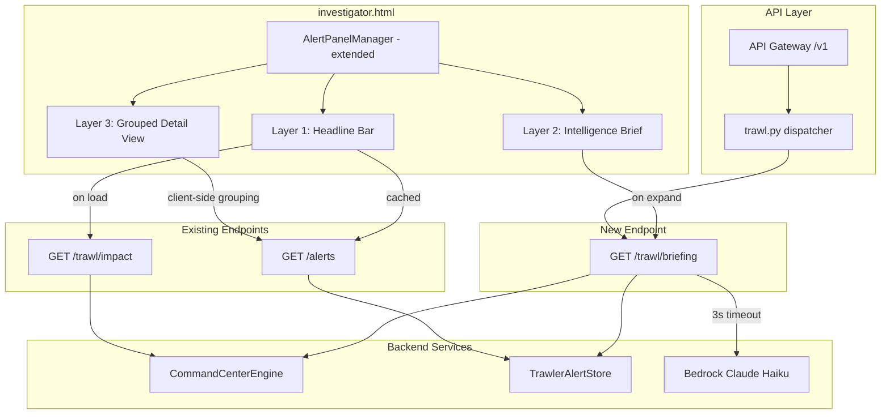
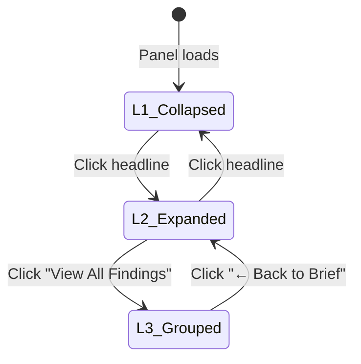

# Design Document: Progressive Intelligence Briefing

## Overview

The Progressive Intelligence Briefing replaces the current flat alert list in the `AlertPanelManager` with a 3-layer progressive disclosure system. Layer 1 is a compact headline bar (always visible) showing viability score, delta, alert count, and last scan timestamp. Layer 2 is an expandable intelligence brief with AI-generated summary and 5 indicator comparison bars. Layer 3 groups alerts by entity cluster instead of rendering them as a flat list.

The system extends the existing `AlertPanelManager` in `investigator.html` and adds one new backend endpoint (`GET /case-files/{id}/trawl/briefing`) to `trawl.py`. All three layers work without Bedrock — Layer 1 and Layer 3 are fully deterministic, and Layer 2 falls back to a deterministic summary when Bedrock is unavailable.

Key design decisions:
- **Extend, don't replace**: The existing `AlertPanelManager` object gains new methods and state properties. The existing `_renderCard` method is reused verbatim for individual alert cards inside Layer 3 groups.
- **Headline-first loading**: Layer 1 renders immediately from the existing Impact API data. Layer 2 brief is fetched asynchronously only when expanded.
- **Client-side grouping**: Layer 3 entity clustering is performed entirely in JavaScript using the already-fetched alert data — no new backend grouping endpoint needed.
- **Lightweight AI**: The briefing endpoint uses Claude Haiku with a 3-second timeout, falling back to a deterministic template.

## Architecture



### Request Flow

1. Alert panel loads → `AlertPanelManager.loadAlerts()` fetches alerts + impact data (existing calls)
2. Layer 1 headline bar renders immediately from impact data (viability score, delta, alert count, timestamp)
3. Analyst clicks headline bar → Layer 2 expands → async `GET /trawl/briefing` fetches AI brief
4. Briefing endpoint invokes Bedrock Haiku (3s timeout) or returns fallback brief
5. Layer 2 renders brief text + 5 indicator comparison bars from impact data
6. Analyst clicks "View All Findings" → Layer 3 renders alerts grouped by entity cluster (client-side)
7. Analyst clicks entity cluster header → group expands showing individual cards via existing `_renderCard`

### Layer State Machine



## Components and Interfaces

### 1. Briefing API Handler (new route in `src/lambdas/api/trawl.py`)

```python
def trawl_briefing_handler(event, context):
    """GET /case-files/{id}/trawl/briefing — generate intelligence brief."""
    # 1. Load alert summary stats from TrawlerAlertStore
    # 2. Load indicator snapshots from scan history (reuse impact logic)
    # 3. Compute top entities by frequency from alerts
    # 4. Attempt Bedrock Haiku call with 3s timeout
    # 5. On timeout/error, generate fallback brief deterministically
    # 6. Return JSON: brief_text, top_entities, indicator_deltas, generated_at, source
```

Response schema:
```json
{
    "brief_text": "12 new findings detected. Key entity Jeffrey Epstein appears in 8 alerts...",
    "top_entities": ["Jeffrey Epstein", "Ghislaine Maxwell", "Jean-Luc Brunel"],
    "indicator_deltas": {
        "signal_strength": {"before": 85, "after": 100},
        "corroboration_depth": {"before": 40, "after": 46},
        "network_density": {"before": 60, "after": 66},
        "temporal_coherence": {"before": 45, "after": 50},
        "prosecution_readiness": {"before": 95, "after": 100}
    },
    "generated_at": "2025-01-15T10:30:00Z",
    "source": "ai"
}
```

### 2. Briefing Service Logic (inline in `trawl.py`)

```python
def _generate_intelligence_brief(case_id: str, alerts: list, impact_data: dict) -> dict:
    """Generate AI or fallback intelligence brief."""
    # Compute summary stats
    alert_count = len(alerts)
    entity_freq = {}
    for a in alerts:
        for name in (a.get("entity_names") or []):
            entity_freq[name] = entity_freq.get(name, 0) + 1
    top_entities = sorted(entity_freq, key=entity_freq.get, reverse=True)[:5]

    # Build indicator deltas from impact data
    before = impact_data.get("before", {})
    after = impact_data.get("after", {})
    indicator_keys = ["signal_strength", "corroboration_depth", "network_density",
                      "temporal_coherence", "prosecution_readiness"]
    indicator_deltas = {}
    for k in indicator_keys:
        indicator_deltas[k] = {"before": before.get(k, 0), "after": after.get(k, 0)}

    # Attempt AI brief
    brief_text = None
    source = "fallback"
    try:
        brief_text = _invoke_bedrock_brief(alert_count, top_entities, indicator_deltas, before, after)
        source = "ai"
    except Exception:
        pass

    # Fallback brief
    if not brief_text:
        v_before = before.get("viability_score", 0)
        v_after = after.get("viability_score", 0)
        delta_dir = "up" if v_after > v_before else ("down" if v_after < v_before else "unchanged")
        strongest = max(indicator_keys, key=lambda k: after.get(k, 0))
        strongest_label = strongest.replace("_", " ").title()
        strongest_score = after.get(strongest, 0)
        brief_text = (
            f"{alert_count} new findings detected. "
            f"Top entities: {', '.join(top_entities[:3])}. "
            f"Viability moved from {v_before} to {v_after} ({delta_dir}). "
            f"{strongest_label} is the strongest signal at {strongest_score}/100."
        )
        source = "fallback"

    return {
        "brief_text": brief_text,
        "top_entities": top_entities,
        "indicator_deltas": indicator_deltas,
        "generated_at": datetime.now(timezone.utc).isoformat(),
        "source": source,
    }
```

### 3. Bedrock Invocation (3-second timeout)

```python
def _invoke_bedrock_brief(alert_count, top_entities, indicator_deltas, before, after):
    """Invoke Claude Haiku with 3s timeout for brief generation."""
    import boto3
    client = boto3.client("bedrock-runtime", config=boto3.session.Config(
        read_timeout=3, connect_timeout=2, retries={"max_attempts": 0}
    ))
    prompt = (
        f"You are a senior intelligence analyst. Write a 3-4 sentence briefing.\n"
        f"Alert count: {alert_count}. Top entities: {', '.join(top_entities)}.\n"
        f"Indicator changes: {json.dumps(indicator_deltas)}.\n"
        f"Viability: {before.get('viability_score',0)} → {after.get('viability_score',0)}.\n"
        f"Cover: what changed, which entities matter most, recommended next action."
    )
    # Invoke with anthropic.claude-3-haiku model
    # Return response text or raise on timeout
```

### 4. Frontend — AlertPanelManager Extensions

New state properties added to `AlertPanelManager`:
```javascript
// New state for progressive briefing
_currentLayer: 1,          // 1=headline, 2=brief, 3=grouped
_impactData: null,         // cached impact API response
_briefData: null,          // cached briefing API response
_briefLoading: false,      // loading state for async brief fetch
_expandedGroups: {},       // which entity groups are expanded in L3
```

New methods:
```javascript
// Layer navigation
toggleHeadline()           // Toggle between L1 and L2
showGroupedView()          // Transition from L2 to L3
backToBrief()              // Transition from L3 to L2

// Rendering
_renderHeadlineBar()       // L1: viability, delta, count, timestamp, Run Trawl btn
_renderIntelligenceBrief() // L2: AI brief text + 5 indicator bars + "View All Findings"
_renderGroupedDetailView() // L3: entity cluster groups with collapsible headers
_renderIndicatorBar(key, before, after) // Single indicator comparison bar
_groupAlertsByEntity()     // Client-side grouping logic

// Data loading
_loadBriefing(caseId)      // Async fetch GET /trawl/briefing
_loadImpactData(caseId)    // Fetch GET /trawl/impact (replaces _loadCaseStrength)
```

### 5. Router Integration

Add new route in `trawl.py` `dispatch_handler`:
```python
# --- Route: GET /case-files/{id}/trawl/briefing ---
if re.match(rf"^/case-files/{_UUID}/trawl/briefing$", path) and method == "GET":
    return trawl_briefing_handler(event, context)
```

This route must be added BEFORE the existing `/trawl/impact` and `/trawl/history` routes in the dispatcher.

## Data Models

### Briefing API Response Schema

```json
{
    "brief_text": "string — 3-4 sentence AI or fallback summary",
    "top_entities": ["string — up to 5 entity names sorted by alert frequency"],
    "indicator_deltas": {
        "signal_strength": {"before": 0, "after": 0},
        "corroboration_depth": {"before": 0, "after": 0},
        "network_density": {"before": 0, "after": 0},
        "temporal_coherence": {"before": 0, "after": 0},
        "prosecution_readiness": {"before": 0, "after": 0}
    },
    "generated_at": "ISO 8601 timestamp",
    "source": "ai | fallback"
}
```

### Entity Cluster Grouping (Client-Side)

```javascript
// Input: array of alert objects with entity_names arrays
// Output: sorted array of { entity: string, alerts: array, count: number }
_groupAlertsByEntity: function() {
    var groups = {};
    var filtered = this.getFilteredAlerts();
    for (var i = 0; i < filtered.length; i++) {
        var a = filtered[i];
        var key = (a.entity_names && a.entity_names.length > 0) ? a.entity_names[0] : 'Ungrouped';
        if (!groups[key]) groups[key] = { entity: key, alerts: [], count: 0 };
        groups[key].alerts.push(a);
        groups[key].count++;
    }
    // Sort by count descending
    return Object.values(groups).sort(function(a, b) { return b.count - a.count; });
}
```

### Headline Bar Color Mapping

| Verdict | Score Range | Color |
|---------|------------|-------|
| PURSUE | 67-100 | `#48bb78` (green) |
| INVESTIGATE FURTHER | 34-66 | `#ecc94b` (amber) |
| CLOSE | 0-33 | `#fc8181` (red) |

### Fallback Brief Template

```
{alert_count} new findings detected. Top entities: {top_3_entity_names}. Viability moved from {before_score} to {after_score} ({delta_direction}). {strongest_indicator_name} is the strongest signal at {score}/100.
```

### Layer State Transitions

| Current | Action | Next | Side Effects |
|---------|--------|------|-------------|
| L1 (collapsed) | Click headline | L2 (expanded) | Fetch briefing API if not cached |
| L2 (expanded) | Click headline | L1 (collapsed) | — |
| L2 (expanded) | Click "View All Findings" | L3 (grouped) | Group alerts client-side |
| L3 (grouped) | Click "← Back to Brief" | L2 (expanded) | — |
| Any | Trawl completes | Current layer | Refresh headline + brief + alerts |

## Correctness Properties

*A property is a characteristic or behavior that should hold true across all valid executions of a system — essentially, a formal statement about what the system should do. Properties serve as the bridge between human-readable specifications and machine-verifiable correctness guarantees.*

### Property 1: Verdict classification and color assignment are consistent with score thresholds

*For any* integer viability score in [0, 100], the verdict SHALL be "PURSUE" if score ≥ 67, "INVESTIGATE FURTHER" if 34 ≤ score ≤ 66, or "CLOSE" if score ≤ 33, AND the color SHALL be `#48bb78` for PURSUE, `#ecc94b` for INVESTIGATE FURTHER, or `#fc8181` for CLOSE.

**Validates: Requirements 1.1, 1.7**

### Property 2: Delta display formatting follows sign rules

*For any* non-zero integer delta, the formatted display SHALL contain "↑" and "STRONGER" if delta > 0, or "↓" and "WEAKER" if delta < 0. For delta = 0, no delta display SHALL be produced.

**Validates: Requirements 1.2, 1.3**

### Property 3: Fallback brief contains all required data elements

*For any* combination of alert count (≥ 0), list of entity names (0-N strings), before/after viability scores (0-100), and 5 indicator scores (0-100 each), the generated fallback brief SHALL contain the alert count, up to 3 entity names, both viability scores, a delta direction word, and the name and score of the strongest indicator.

**Validates: Requirements 4.5, 9.2**

### Property 4: Entity grouping produces correctly keyed and sorted groups

*For any* array of alerts where each alert has an `entity_names` array, grouping by first entity name SHALL produce groups where: (a) every alert appears in exactly one group, (b) each alert's group key matches its first entity_name (or "Ungrouped" if entity_names is empty), and (c) groups are sorted by alert count descending.

**Validates: Requirements 5.2, 5.3, 5.5**

### Property 5: Filters applied to grouped view produce correct subsets

*For any* array of alerts and any combination of severity filter and source filter, the filtered grouped view SHALL contain exactly those alerts matching ALL active filters, and no others. The total alert count across all groups SHALL equal the count of matching alerts.

**Validates: Requirements 10.1**

## Error Handling

### Backend Errors

| Error Scenario | Handling | Response |
|---|---|---|
| Bedrock Haiku timeout (>3s) | Catch timeout, return fallback brief | `source: "fallback"` in response |
| Bedrock client unavailable | Catch exception, return fallback brief | `source: "fallback"` in response |
| Bedrock returns malformed response | Catch parse error, return fallback brief | `source: "fallback"` in response |
| Impact API returns no scans | Return empty indicator deltas, zero viability | Headline shows "0/100 CLOSE" |
| Case ID not found | Return HTTP 404 | `{"error_code": "NOT_FOUND"}` |
| Alert store query failure | Return empty alerts, log error | Headline shows "0 new findings" |

### Frontend Errors

| Error Scenario | Handling |
|---|---|
| Briefing API fetch fails | Display fallback brief generated client-side from cached impact data |
| Impact API fetch fails | Hide delta display, show "—" for viability score |
| Alert data empty | Show "No alerts yet — run a trawl scan" in all layers |
| Layer transition during loading | Queue transition, apply after load completes |

## Testing Strategy

### Property-Based Tests (Hypothesis)

Use **Hypothesis** (Python PBT library) for backend property tests and equivalent JavaScript unit tests for frontend logic. Each property test runs minimum 100 iterations.

| Property | Test File | Tag |
|---|---|---|
| Property 1: Verdict + color | `tests/unit/test_briefing_service.py` | Feature: progressive-intelligence-briefing, Property 1: Verdict classification and color assignment |
| Property 2: Delta formatting | `tests/unit/test_briefing_service.py` | Feature: progressive-intelligence-briefing, Property 2: Delta display formatting |
| Property 3: Fallback brief | `tests/unit/test_briefing_service.py` | Feature: progressive-intelligence-briefing, Property 3: Fallback brief contains all required data |
| Property 4: Entity grouping | `tests/unit/test_briefing_service.py` | Feature: progressive-intelligence-briefing, Property 4: Entity grouping correctness and sort order |
| Property 5: Filter in groups | `tests/unit/test_briefing_service.py` | Feature: progressive-intelligence-briefing, Property 5: Filters in grouped view |

### Unit Tests (Example-Based)

| Test | File | Validates |
|---|---|---|
| Briefing API returns correct schema | `tests/unit/test_briefing_service.py` | Req 8.2 |
| Briefing API returns 404 for missing case | `tests/unit/test_briefing_service.py` | Req 8.3 |
| Bedrock timeout returns fallback with source="fallback" | `tests/unit/test_briefing_service.py` | Req 4.3 |
| Bedrock error returns fallback | `tests/unit/test_briefing_service.py` | Req 4.4 |
| Briefing route dispatches correctly | `tests/unit/test_briefing_service.py` | Req 8.1, 8.4 |
| Empty entity_names grouped as "Ungrouped" | `tests/unit/test_briefing_service.py` | Req 5.3 |
| Layer state preserved across refresh | Frontend manual test | Req 6.2 |
| Run Trawl button visible in all layers | Frontend manual test | Req 7.1 |
| Source label shows "(AI-generated)" or "(auto-summary)" | Frontend manual test | Req 9.4 |

### Integration Tests

| Test | Validates |
|---|---|
| GET /trawl/briefing returns valid response for existing case | Req 8.1, 8.2 |
| Full layer navigation flow (L1→L2→L3→L2→L1) | Req 2.1, 2.2, 5.1, 6.3, 6.4 |
| Trawl scan triggers headline + brief refresh | Req 7.2, 7.3 |
| All existing alert actions work within grouped view | Req 10.2, 10.3, 10.4 |

## Layer 3 Enhancements

Three enhancements were added to the Layer 3 Grouped Detail View to transform entity groups from simple collapsible lists into investigative intelligence surfaces. All three are implemented entirely in the frontend `AlertPanelManager` (in `investigator.html`) with one additional Neptune API call for the network graph.

### Enhancement 1: Investigative Entity Titles

Entity group headers now display descriptive, color-coded titles based on the dominant alert type within each group, replacing the generic "{entity} ({count} overlaps)" format.

#### `_buildInvestigativeTitle(group)` Method

```javascript
_buildInvestigativeTitle: function(group) {
    // Count alert_type frequency within the group
    var typeCounts = {};
    for (var i = 0; i < group.alerts.length; i++) {
        var t = group.alerts[i].alert_type || 'unknown';
        typeCounts[t] = (typeCounts[t] || 0) + 1;
    }
    // Select dominant (most frequent) alert type
    var dominant = Object.keys(typeCounts).sort(function(a,b){
        return typeCounts[b] - typeCounts[a];
    })[0] || 'unknown';

    // Return descriptor, metric text, and color based on dominant type
    // cross_case_overlap → "Cross-Case Key Entity" (blue #63b3ed)
    // network_expansion  → "Network Hub" (green #48bb78)
    // entity_spike       → "Evidence Spike" (orange #f6ad55)
    // default            → "Intelligence Finding" (purple #9f7aea)
}
```

Returns `{ descriptor: string, metric: string, color: string }` used by `_renderGroupedDetailView` to render the header as:

```
Larry Visoski — Cross-Case Key Entity (12 overlaps)
```

#### Title Color Mapping

| Dominant Alert Type | Descriptor | Metric Template | Color |
|---|---|---|---|
| `cross_case_overlap` | Cross-Case Key Entity | `{count} overlap(s)` | `#63b3ed` (blue) |
| `network_expansion` | Network Hub | `{count} connection(s)` | `#48bb78` (green) |
| `entity_spike` | Evidence Spike | `{count} new doc(s)` | `#f6ad55` (orange) |
| Other / unknown | Intelligence Finding | `{count} alert(s)` | `#9f7aea` (purple) |

### Enhancement 2: 4-Section Intelligence Brief Per Entity

When an entity group is expanded, a structured intelligence brief renders before individual alert cards. The brief follows the same BLUF/Key Finding/Critical Gap/Next Action format used in the Command Center Strategic Assessment.

#### `_renderEntityIntelBrief(group)` Method

Generates a 4-section brief deterministically from the group's alert data (no Bedrock call):

| Section | Border Color | Content Source |
|---|---|---|
| BLUF | Green `#48bb78` | Entity name, finding count, case names extracted from alert titles via regex, evidence document count from `evidence_refs` arrays |
| Key Finding | Blue `#63b3ed` | Cross-case significance description based on entity presence across investigations |
| Critical Gap | Red `#fc8181` | Identifies missing evidence types (financial records, communication records) |
| Next Action | Amber `#ecc94b` | "🔍 Search for {entity}" button + "🕸️ Show Network" button |

#### Individual Card Toggle

Individual alert cards are hidden by default behind a "📎 View N individual findings" toggle button. The toggle state is tracked per entity group in `_expandedGroupCards`:

```javascript
_expandedGroupCards: {},   // { entityName: true/false }

toggleGroupCards: function(entity) {
    this._expandedGroupCards[entity] = !this._expandedGroupCards[entity];
    this.render();
}
```

When toggled open, cards render via the existing `_renderCard(alert)` method.

### Enhancement 3: Inline Network Graph

A "🕸️ Show Network" button in each entity brief's Next Action section fetches the entity's 1-hop neighborhood from Neptune and renders an inline SVG force-directed graph.

#### API Integration

```
GET /case-files/{graphCaseId}/entity-neighborhood?entity_name={entity}&hops=1
```

- Routed through `investigator_analysis.py` → `entity_neighborhood_handler` → `InvestigatorAIEngine.get_entity_neighborhood()`
- Queries Neptune for vertices with label `Entity_{case_id}` connected to the target entity within 1 hop
- Returns `{ nodes: [{name, type}], edges: [{source, target}] }`
- Frontend limits displayed nodes to 20 maximum

#### `showEntityNetwork(entity)` Method

1. Locates the graph container div (`entityNetGraph_{safeId}`)
2. If graph already displayed → toggles off (clears container)
3. Shows loading spinner
4. Calls `api('GET', '/case-files/{graphCaseId}/entity-neighborhood?entity_name={entity}&hops=1')`
5. On success with nodes → calls `_renderForceGraph(container, entity, nodes, edges)`
6. On success with 0 nodes → shows "No graph data available" message
7. On error → shows error message with failure reason

#### `_renderForceGraph(container, centerEntity, nodes, edges)` Method

Renders a force-directed graph as inline SVG (no external libraries).

**Graph Parameters:**
- Canvas: 600×300 viewBox, 300px rendered height
- Background: `#0d1117` with `#2d3748` border
- Iterations: 100 force simulation steps

**Force Simulation Algorithm:**

```
For each of 100 iterations:
  1. Repulsion: For every node pair (i,j):
     force = 800 / (distance² || 1)
     Apply equal-opposite velocity to both nodes

  2. Attraction: For each edge (a,b):
     force = (distance - 60) × 0.05
     Pull connected nodes toward target distance of 60px

  3. Center gravity: For each node:
     velocity += (center - position) × 0.01

  4. Apply velocities with 0.85 damping factor
     Center entity is pinned at (W/2, H/2) with zero velocity
     All nodes clamped to [30, W-30] × [30, H-30]
```

**Deterministic Seeding:**

```javascript
// Seed derived from entity name character codes
var seed = 0;
for (var i = 0; i < centerEntity.length; i++)
    seed += centerEntity.charCodeAt(i);

function seededRandom() {
    seed = (seed * 16807 + 0) % 2147483647;
    return (seed - 1) / 2147483646;
}
```

Same entity name always produces the same initial positions → same final layout.

**Node Rendering:**

| Property | Center Entity | Neighbor Entities |
|---|---|---|
| Radius | 12 | 8 |
| Stroke | White `#fff`, width 2 | `rgba(255,255,255,0.15)`, width 1 |
| Fill | Type color | Type color |

**Node Type Colors:**

| Type | Color |
|---|---|
| person | `#48bb78` (green) |
| organization | `#63b3ed` (blue) |
| location | `#f6ad55` (orange) |
| date | `#9f7aea` (purple) |
| phone_number | `#f687b3` (pink) |
| email | `#90cdf4` (light blue) |
| Other | `#718096` (gray) |

**Labels:** Truncated to 15 characters with ellipsis. Positioned below each node. Font size 8px, color `#a0aec0`.

**Legend:** Displayed below the SVG showing Person, Organization, Location, Date, Other with corresponding color dots.

**Close Button:** Absolute-positioned ✕ button in top-right corner clears the container innerHTML.

### New Frontend State Properties

```javascript
_expandedGroupCards: {},   // Per-entity card visibility toggle (Enhancement 2)
```

### New Frontend Methods Summary

| Method | Enhancement | Purpose |
|---|---|---|
| `_buildInvestigativeTitle(group)` | 1 | Compute descriptor/metric/color from dominant alert type |
| `_renderEntityIntelBrief(group)` | 2 | Render 4-section BLUF/Finding/Gap/Action brief |
| `toggleGroupCards(entity)` | 2 | Toggle individual card visibility per entity |
| `showEntityNetwork(entity)` | 3 | Fetch Neptune neighborhood and render graph |
| `_renderForceGraph(container, centerEntity, nodes, edges)` | 3 | SVG force-directed graph renderer |

## Deployment — CloudFormation Prerequisites

For a customer to deploy the Progressive Intelligence Briefing feature via CloudFormation, the following infrastructure components are required:

### 1. Aurora PostgreSQL Database

Aurora PostgreSQL cluster with the following migrations applied in order:

| Migration | File | Tables/Columns Created |
|---|---|---|
| 011 | `src/db/migrations/011_intelligence_trawler.sql` | `trawler_alerts`, `trawl_scans`, `trawl_configs` |
| 012 | `src/db/migrations/012_command_center_cache.sql` | `command_center_cache`, `top_pattern_cache`, `chat_conversations` |
| 013 | `src/db/migrations/013_alert_ai_insights.sql` | Adds `ai_insight` column to `trawler_alerts`, `indicator_snapshot` column to `trawl_scans` |

The Aurora secret ARN must be available for Lambda environment configuration.

### 2. Neptune Graph Database

Amazon Neptune cluster with entity data loaded:

- Vertex labels: `Entity_{case_id}` (e.g., `Entity_7f05e8d5-4492-4f19-8894-25367606db96`)
- Edge labels: `RELATED_TO`
- Vertex properties: `name` (string), `type` (string: person, organization, location, date, etc.)
- Required for: Entity neighborhood queries (Enhancement 3 inline network graph)
- Neptune must be in the same VPC as the Lambda function

### 3. Lambda Function

Single Lambda function handling all API routes via `case_files.py` dispatcher:

- Runtime: Python 3.10+
- Memory: 512 MB minimum (1024 MB recommended for Bedrock calls)
- Timeout: 29 seconds (API Gateway limit)
- VPC: Must be in same VPC as Aurora and Neptune with appropriate security groups
- Layers: Standard Python dependencies (boto3, psycopg2, etc.)

**Required Environment Variables:**

| Variable | Description | Example |
|---|---|---|
| `NEPTUNE_ENDPOINT` | Neptune cluster endpoint | `my-neptune-cluster.cluster-xxxx.us-east-1.neptune.amazonaws.com` |
| `NEPTUNE_PORT` | Neptune port | `8182` |
| `AURORA_SECRET_ARN` | Secrets Manager ARN for Aurora credentials | `arn:aws:secretsmanager:us-east-1:123456789012:secret:aurora-creds` |
| `AURORA_DB_NAME` | Aurora database name | `research_analyst` |
| `BEDROCK_LLM_MODEL_ID` | Bedrock model ID (optional — falls back to deterministic) | `anthropic.claude-3-haiku-20240307-v1:0` |
| `S3_BUCKET_NAME` | S3 bucket for frontend assets | `my-frontend-bucket` |
| `OPENSEARCH_ENDPOINT` | OpenSearch endpoint (for search features) | `https://my-collection.us-east-1.aoss.amazonaws.com` |
| `GRAPH_CASE_ID` | Default Neptune graph case ID | `7f05e8d5-4492-4f19-8894-25367606db96` |

**Required IAM Permissions:**

- `bedrock:InvokeModel` on `anthropic.claude-3-haiku-20240307-v1:0` (optional)
- `secretsmanager:GetSecretValue` on Aurora secret
- `neptune-db:*` on Neptune cluster
- `s3:GetObject`, `s3:PutObject` on frontend bucket
- VPC execution role (`ec2:CreateNetworkInterface`, etc.)

### 4. API Gateway

REST API with `{proxy+}` catch-all route forwarding to the Lambda function:

- Stage: `v1`
- Routes handled by `trawl.py` dispatcher:
  - `POST /case-files/{id}/trawl` — run trawl scan
  - `GET /case-files/{id}/trawl/briefing` — intelligence brief
  - `GET /case-files/{id}/trawl/impact` — indicator comparison
  - `GET /case-files/{id}/trawl/evolution` — case evolution timeline
  - `GET /case-files/{id}/trawl/history` — scan history
  - `PUT /case-files/{id}/trawl-config` — save trawl config
  - `GET /case-files/{id}/trawl-config` — load trawl config
  - `GET /case-files/{id}/alerts` — list alerts
  - `PATCH /case-files/{id}/alerts/{alert_id}` — update alert
  - `POST /case-files/{id}/alerts/{alert_id}/investigate` — investigate alert
- Routes handled by `investigator_analysis.py` dispatcher:
  - `GET /case-files/{id}/entity-neighborhood` — Neptune entity neighborhood (Enhancement 3)
- CORS enabled for all origins

### 5. S3 Frontend Hosting

S3 bucket configured for static website hosting:

- File: `investigator.html` uploaded to `frontend/investigator.html`
- Content-Type: `text/html`
- Cache-Control: `no-cache` (for development; use versioned paths in production)
- CloudFront distribution recommended for production

### 6. Bedrock Model Access (Optional)

- Model: `anthropic.claude-3-haiku-20240307-v1:0`
- Used for: Layer 2 AI-generated intelligence brief and per-alert AI insights
- Fallback: All features work without Bedrock — Layer 2 uses deterministic fallback brief, Layer 3 enhancements are fully deterministic
- Must be enabled in the deployment region via Bedrock model access console

### CloudFormation Resource Summary

```yaml
Resources:
  # Aurora PostgreSQL Cluster
  AuroraCluster:
    Type: AWS::RDS::DBCluster
    Properties:
      Engine: aurora-postgresql
      EngineVersion: "15.4"
      DatabaseName: research_analyst
      # ... VPC, security groups, credentials

  # Neptune Cluster
  NeptuneCluster:
    Type: AWS::Neptune::DBCluster
    Properties:
      # ... VPC, security groups, instance class

  # Lambda Function
  CaseFilesLambda:
    Type: AWS::Lambda::Function
    Properties:
      Runtime: python3.10
      Handler: lambdas.api.case_files.handler
      Timeout: 29
      MemorySize: 1024
      VpcConfig:
        SecurityGroupIds: [!Ref LambdaSG]
        SubnetIds: [!Ref PrivateSubnet1, !Ref PrivateSubnet2]
      Environment:
        Variables:
          NEPTUNE_ENDPOINT: !GetAtt NeptuneCluster.Endpoint
          NEPTUNE_PORT: "8182"
          AURORA_SECRET_ARN: !Ref AuroraSecret
          AURORA_DB_NAME: research_analyst
          BEDROCK_LLM_MODEL_ID: anthropic.claude-3-haiku-20240307-v1:0
          S3_BUCKET_NAME: !Ref FrontendBucket
          OPENSEARCH_ENDPOINT: !GetAtt OpenSearchCollection.CollectionEndpoint

  # API Gateway
  ApiGateway:
    Type: AWS::ApiGateway::RestApi
    Properties:
      Name: investigative-intelligence-api
      # {proxy+} catch-all to Lambda

  # S3 Frontend Bucket
  FrontendBucket:
    Type: AWS::S3::Bucket
    Properties:
      WebsiteConfiguration:
        IndexDocument: index.html
```

### Source Files

All Progressive Intelligence Briefing code is contained in:

| File | Component |
|---|---|
| `src/lambdas/api/trawl.py` | Briefing endpoint, trawl handler, impact handler |
| `src/lambdas/api/investigator_analysis.py` | Entity neighborhood endpoint (Enhancement 3) |
| `src/services/trawler_engine.py` | Trawl scan engine, AI enrichment |
| `src/services/trawler_alert_store.py` | Alert CRUD, scan history, `ai_insight` column support |
| `src/services/command_center_engine.py` | Indicator computation, GraphSON deserialization |
| `src/services/investigator_ai_engine.py` | `get_entity_neighborhood()` Neptune query |
| `src/frontend/investigator.html` | AlertPanelManager — all 3 layers + 3 enhancements |
| `src/db/migrations/011_intelligence_trawler.sql` | Trawler tables |
| `src/db/migrations/012_command_center_cache.sql` | Command center cache tables |
| `src/db/migrations/013_alert_ai_insights.sql` | AI insight + indicator snapshot columns |
