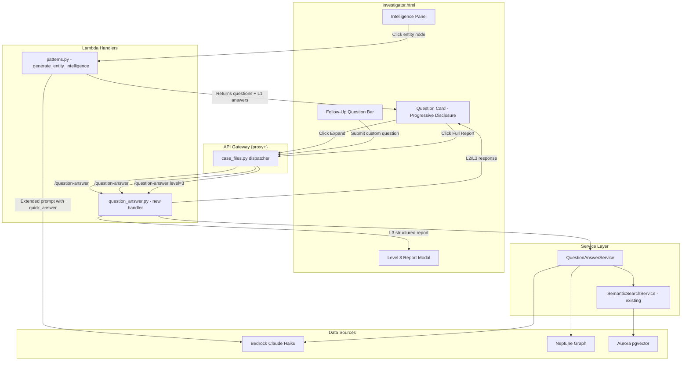

# Design Document: Progressive Intelligence Drilldown

## Overview

This feature transforms the static "Investigative Questions to Pursue" section in the entity intelligence panel into an interactive three-level progressive drill-down system. Currently, investigative questions are rendered as static text by `_loadAIIntelligence` (from the `/patterns` API) and `_generateEntityQuestions` (client-side). This design adds:

1. **Level 1 Quick Answers** — one-line summaries generated in the same Bedrock call as the questions (zero additional latency)
2. **Level 2 Analytical Briefs** — 2–3 paragraph analyses with document citations, fetched on-demand via a new `question-answer` endpoint
3. **Level 3 Intelligence Reports** — full structured reports with executive summary, evidence analysis, confidence assessment, and next steps, displayed in a modal
4. **Follow-Up Question Bar** — contextual text input scoped to the entity's graph neighborhood

All changes are additive. Existing code in `investigator_ai_engine.py`, `patterns.py`, `chat_service.py`, and `investigator.html` is extended, not replaced.

### Key Design Decisions

- **Level 1 answers are generated in the SAME Bedrock call** as the investigative questions by extending the existing prompt in `_generate_entity_intelligence()` in `patterns.py`. This avoids a new API call and adds zero latency.
- **Level 2 and Level 3 use a new service** (`question_answer_service.py`) that reuses `SemanticSearchService` for document retrieval and existing Neptune graph query patterns for graph context.
- **The Question_Answer_API routes through the existing `{proxy+}` API Gateway** — no new API Gateway resources needed. It's handled by `case_files.py` dispatcher like all other routes.
- **Client-side caching** of Level 2 and Level 3 answers prevents redundant API calls when re-expanding questions.

## Architecture



### Request Flow

1. **Entity click → Level 1**: `POST /case-files/{id}/patterns` (existing, prompt extended) → returns `investigative_questions` as objects with `question` + `quick_answer` fields
2. **Expand → Level 2**: `POST /case-files/{id}/question-answer` with `{entity_name, question, level: 2}` → returns analytical brief + citations
3. **Full Report → Level 3**: `POST /case-files/{id}/question-answer` with `{entity_name, question, level: 3}` → returns structured intelligence report
4. **Follow-up → Level 1+**: `POST /case-files/{id}/question-answer` with `{entity_name, question, level: 1}` → returns quick answer, then user can expand to L2/L3

## Components and Interfaces

### 1. Extended Patterns API Prompt (`patterns.py`)

The existing `_generate_entity_intelligence()` function's Bedrock prompt is extended to return `investigative_questions` as objects instead of strings.

**Current format:**
```json
{
  "investigative_questions": [
    "Question 1 text",
    "Question 2 text"
  ]
}
```

**New format:**
```json
{
  "investigative_questions": [
    {"question": "Question 1 text", "quick_answer": "One-line answer under 150 chars"},
    {"question": "Question 2 text", "quick_answer": "One-line answer under 150 chars"}
  ]
}
```

The prompt change is minimal — only the JSON schema description in the prompt and the `investigative_questions` field definition change. The same Bedrock call, same model, same persona.

### 2. Question Answer Handler (`question_answer.py`)

New Lambda handler module following the existing pattern (like `chat.py`, `drill_down.py`).

**Endpoint:** `POST /case-files/{id}/question-answer`

**Request body:**
```json
{
  "entity_name": "string (required)",
  "question": "string (required)",
  "level": 2 | 3,
  "entity_type": "string (optional)",
  "neighbors": [{"name": "...", "type": "..."}]
}
```

**Level 2 Response:**
```json
{
  "level": 2,
  "entity_name": "string",
  "question": "string",
  "analysis": "string (2-3 paragraphs)",
  "citations": [
    {"document_name": "string", "relevance": "high|medium|low", "excerpt": "string"}
  ]
}
```

**Level 3 Response:**
```json
{
  "level": 3,
  "entity_name": "string",
  "question": "string",
  "executive_summary": "string",
  "evidence_analysis": "string",
  "source_citations": [
    {"document_name": "string", "relevance": "high|medium|low", "excerpt": "string", "document_id": "string"}
  ],
  "confidence_assessment": {
    "level": "high|medium|low",
    "justification": "string"
  },
  "recommended_next_steps": ["string"]
}
```

### 3. Question Answer Service (`question_answer_service.py`)

New service in `src/services/` following the existing service pattern.

```python
class QuestionAnswerService:
    def __init__(self, aurora_cm, bedrock_client, neptune_endpoint, neptune_port, opensearch_endpoint):
        ...

    def answer_question(self, case_id, entity_name, question, level, entity_type=None, neighbors=None) -> dict:
        """Generate a Level 2 or Level 3 answer for an investigative question."""
        ...

    def _get_graph_context(self, case_id, entity_name) -> list[dict]:
        """Query Neptune for 1-2 hop neighborhood context."""
        ...

    def _get_document_context(self, case_id, entity_name, question) -> list[dict]:
        """Use SemanticSearchService to find relevant document passages."""
        ...

    def _generate_level2(self, question, entity_name, graph_ctx, doc_ctx) -> dict:
        """Generate analytical brief via Bedrock."""
        ...

    def _generate_level3(self, question, entity_name, graph_ctx, doc_ctx) -> dict:
        """Generate full intelligence report via Bedrock."""
        ...
```

**Dependencies (all reused, not new):**
- `SemanticSearchService` — for document retrieval via Aurora pgvector
- Neptune HTTP API — same `_neptune_query()` pattern as `patterns.py`
- Bedrock Claude Haiku — same model ID and persona as existing services

### 4. Dispatcher Route (`case_files.py`)

Add a single route to the existing dispatcher:

```python
# Question-Answer (progressive intelligence drilldown)
if resource == "/case-files/{id}/question-answer" or (path.endswith("/question-answer") and "/case-files/" in path):
    if method == "POST":
        from lambdas.api.question_answer import question_answer_handler
        return question_answer_handler(event, context)
```

### 5. Frontend Components (`investigator.html`)

**Modified functions:**
- `_loadAIIntelligence()` — handle new object format for `investigative_questions`, render with progressive disclosure
- `_generateEntityQuestions()` — add `quick_answer` field to client-generated questions (static fallback text)

**New functions:**
- `_renderProgressiveQuestion(questionObj, index)` — renders a question card with collapse/expand states
- `_expandToLevel2(el, entityName, question)` — fetches Level 2 via `/question-answer`
- `_openLevel3Report(entityName, question)` — fetches Level 3 and displays in modal
- `_renderFollowUpBar(entityName)` — renders the follow-up question input
- `_submitFollowUp(entityName)` — submits custom question via `/question-answer`
- `_renderLevel3Modal(data)` — renders the Level 3 report in a modal overlay

**Client-side answer cache:**
```javascript
// In-memory cache keyed by entity+question+level
const _qaCache = {};
function _cacheKey(entity, question, level) {
    return entity + '|' + question + '|' + level;
}
```

## Data Models

No new database tables are required. All data flows through API request/response — Level 2 and Level 3 answers are generated on-demand and cached client-side only.

### API Request/Response Models

**QuestionAnswerRequest:**
| Field | Type | Required | Description |
|-------|------|----------|-------------|
| entity_name | string | yes | Entity being investigated |
| question | string | yes | The investigative question |
| level | int (1, 2, 3) | yes | Depth of analysis requested |
| entity_type | string | no | Entity type for context |
| neighbors | list[dict] | no | Pre-fetched neighbor data |

**Level2Response:**
| Field | Type | Description |
|-------|------|-------------|
| level | int | Always 2 |
| entity_name | string | Entity name |
| question | string | Original question |
| analysis | string | 2-3 paragraph analytical brief |
| citations | list[Citation] | Document citations |

**Level3Response:**
| Field | Type | Description |
|-------|------|-------------|
| level | int | Always 3 |
| entity_name | string | Entity name |
| question | string | Original question |
| executive_summary | string | Executive summary paragraph |
| evidence_analysis | string | Detailed evidence analysis |
| source_citations | list[Citation] | Citations with document links |
| confidence_assessment | dict | Level + justification |
| recommended_next_steps | list[string] | Actionable next steps |

**Citation:**
| Field | Type | Description |
|-------|------|-------------|
| document_name | string | Source document filename |
| relevance | string | high/medium/low |
| excerpt | string | Relevant passage excerpt |
| document_id | string | Optional document UUID |

### Extended Patterns API Response Format

The `investigative_questions` field in the patterns API response changes from `list[string]` to `list[QuestionObject]`:

**QuestionObject:**
| Field | Type | Description |
|-------|------|-------------|
| question | string | The investigative question text |
| quick_answer | string | One-line answer, ≤150 characters |

The frontend handles both formats for backward compatibility (Requirement 5.5).


## Correctness Properties

*A property is a characteristic or behavior that should hold true across all valid executions of a system — essentially, a formal statement about what the system should do. Properties serve as the bridge between human-readable specifications and machine-verifiable correctness guarantees.*

### Property 1: Level 1 response contains structured question objects

*For any* entity name, entity type, and set of neighbors/documents passed to `_generate_entity_intelligence()`, the returned `investigative_questions` field shall be a list of objects where each object contains both a `question` string field and a `quick_answer` string field.

**Validates: Requirements 1.1, 5.1**

### Property 2: Single Bedrock invocation for Level 1 generation

*For any* entity intelligence request to `_generate_entity_intelligence()`, the Bedrock client shall be invoked exactly once, producing both the investigative questions and their quick answers in a single call.

**Validates: Requirements 1.2**

### Property 3: Quick answer length constraint

*For any* `quick_answer` string returned by the Patterns API, its length shall be 150 characters or fewer.

**Validates: Requirements 1.4**

### Property 4: Level 2 response structure

*For any* valid combination of case_id, entity_name, question text, and level=2 passed to `QuestionAnswerService.answer_question()`, the returned dict shall contain an `analysis` string field (non-empty) and a `citations` list where each citation contains `document_name` (string) and `relevance` (one of "high", "medium", "low").

**Validates: Requirements 2.2, 2.4**

### Property 5: Level 3 response structure

*For any* valid combination of case_id, entity_name, question text, and level=3 passed to `QuestionAnswerService.answer_question()`, the returned dict shall contain all required sections: `executive_summary` (string), `evidence_analysis` (string), `source_citations` (list), `confidence_assessment` (dict with `level` in {"high","medium","low"} and `justification` string), and `recommended_next_steps` (list of strings).

**Validates: Requirements 3.2**

### Property 6: Consistent Bedrock configuration across all answer levels

*For any* Bedrock invocation made by `QuestionAnswerService`, the model ID shall match the model ID used by the existing Patterns API (`anthropic.claude-3-haiku-20240307-v1:0`), and the system prompt shall contain the senior federal investigative analyst persona string.

**Validates: Requirements 3.6, 5.4**

### Property 7: Semantic search and graph context used for all on-demand answers

*For any* Level 2 or Level 3 answer request (including follow-up questions), the `QuestionAnswerService` shall invoke both semantic search (via `SemanticSearchService` or Aurora pgvector query) and Neptune graph neighborhood query before generating the answer.

**Validates: Requirements 2.3, 4.3**

### Property 8: Empty question rejection

*For any* question string that is empty or composed entirely of whitespace, the Question Answer API shall reject the request with a 400 validation error and shall not invoke Bedrock.

**Validates: Requirements 4.6**

### Property 9: Legacy format backward compatibility

*For any* Patterns API response where `investigative_questions` is a list of plain strings (legacy format), the frontend rendering function shall produce valid HTML output without errors, displaying each question without a Level 1 answer and with a fallback indicator.

**Validates: Requirements 5.5, 1.5**

### Property 10: Client-side answer cache idempotence

*For any* entity name, question text, and answer level, after a successful API response is cached, a subsequent cache lookup with the same key shall return the cached response without triggering a new API call. Formally: `cache.get(key) === cache.get(key)` and the API call count remains unchanged.

**Validates: Requirements 6.6**

## Error Handling

### Backend Errors

| Error Scenario | Handler | Response |
|---|---|---|
| Missing `entity_name` or `question` in request | `question_answer.py` | 400 VALIDATION_ERROR |
| Empty/whitespace-only `question` | `question_answer.py` | 400 VALIDATION_ERROR |
| Invalid `level` (not 1, 2, or 3) | `question_answer.py` | 400 VALIDATION_ERROR |
| Case file not found | `question_answer.py` | 404 NOT_FOUND |
| Bedrock invocation failure | `QuestionAnswerService` | 500 with fallback text "AI analysis unavailable" |
| Bedrock response JSON parse failure | `QuestionAnswerService` | Return partial response with available fields, log error |
| Neptune query timeout | `QuestionAnswerService` | Continue with empty graph context, log warning |
| Semantic search failure | `QuestionAnswerService` | Continue with empty document context, log warning |
| Bedrock throttling (429) | `QuestionAnswerService` | 429 AI_THROTTLED with retry guidance |

### Frontend Errors

| Error Scenario | Handler | UI Behavior |
|---|---|---|
| Level 2 API returns error | `_expandToLevel2()` | Display "Analysis unavailable" with Retry button in question card |
| Level 3 API returns error | `_openLevel3Report()` | Display error message in modal with Retry button |
| Network timeout | All API calls | Display "Request timed out — please retry" |
| Patterns API returns legacy string format | `_loadAIIntelligence()` | Render questions without L1 answers, show "Click to analyze" |
| Patterns API returns no `quick_answer` for a question | Rendering logic | Show fallback "Quick answer unavailable — click Expand for full analysis" |

### Graceful Degradation Strategy

The service follows a "best effort with fallback" pattern:
1. If Neptune graph context fails → proceed with document context only
2. If semantic search fails → proceed with graph context only
3. If both fail → invoke Bedrock with the question and entity name only (reduced quality but still functional)
4. If Bedrock fails → return structured error response

## Testing Strategy

### Property-Based Testing

**Library:** `hypothesis` (Python property-based testing library)

**Configuration:** Minimum 100 iterations per property test via `@settings(max_examples=100)`.

Each property test references its design document property via a tag comment:
```python
# Feature: progressive-intelligence-drilldown, Property N: <property_text>
```

**Property tests to implement:**

1. **Property 1 test** — Generate random entity names/types/neighbors, mock Bedrock to return valid JSON, verify response structure has `question` + `quick_answer` objects.
2. **Property 2 test** — For random entity inputs, mock Bedrock, call `_generate_entity_intelligence()`, assert `bedrock.invoke_model` called exactly once.
3. **Property 3 test** — Generate random quick_answer strings from mocked Bedrock responses, verify all are ≤150 characters (test the truncation/validation logic).
4. **Property 4 test** — Generate random case_id/entity/question combinations, mock dependencies, call `answer_question(level=2)`, verify response has `analysis` + `citations` with correct structure.
5. **Property 5 test** — Generate random inputs, mock dependencies, call `answer_question(level=3)`, verify all required sections present.
6. **Property 6 test** — For random inputs at any level, capture the Bedrock `invoke_model` call args, verify model ID and persona string.
7. **Property 7 test** — For random L2/L3 requests, mock semantic search and Neptune, verify both are called.
8. **Property 8 test** — Generate random whitespace-only strings, call the handler, verify 400 response and Bedrock not called.
9. **Property 9 test** — Generate random lists of plain strings (legacy format), pass to the rendering/parsing function, verify no exceptions and valid output.
10. **Property 10 test** — Generate random cache keys, store a value, verify subsequent gets return same value.

### Unit Tests

Unit tests complement property tests for specific examples and edge cases:

- **Prompt extension test** — Verify the extended prompt in `_generate_entity_intelligence()` includes the `quick_answer` JSON schema.
- **Dispatcher routing test** — Verify `case_files.py` routes `/case-files/{id}/question-answer` POST to the correct handler.
- **Level validation test** — Verify level=1 returns quick answer format, level=2 returns analytical brief, level=3 returns full report.
- **Bedrock JSON parse error test** — Verify graceful handling when Bedrock returns malformed JSON.
- **Neptune timeout test** — Verify the service continues with empty graph context.
- **Semantic search failure test** — Verify the service continues with empty document context.
- **Both context sources fail test** — Verify the service still produces a response using Bedrock alone.
- **Legacy format rendering test** — Verify string-format questions render correctly without quick_answer.
- **CORS headers test** — Verify the response includes proper CORS headers.

### Test File Organization

```
tests/unit/
  test_question_answer_service.py    # Property + unit tests for QuestionAnswerService
  test_question_answer_handler.py    # Unit tests for the Lambda handler
  test_progressive_drilldown_ui.py   # Unit tests for frontend parsing/rendering logic
```
