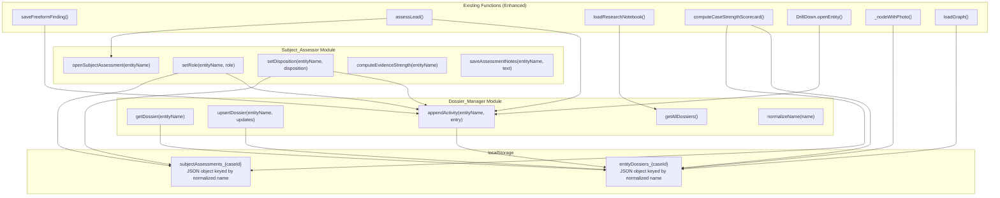
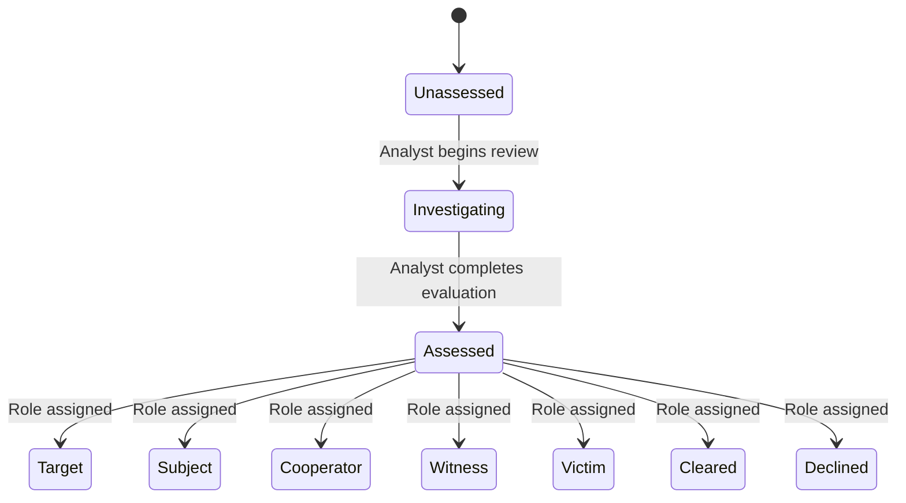

# Design Document: Prosecution Funnel Assessment

## Overview

This feature introduces a prosecution-oriented intelligence layer beneath the existing 8-step investigator playbook. Rather than adding new UI steps, it enriches the existing workflow with four interconnected modules:

1. **Dossier_Manager** — Entity Dossier singleton storage that deduplicates findings per entity in localStorage
2. **Subject_Assessor** — Per-entity prosecution evaluation panel following the DOJ prosecution funnel (Target → Subject → Cooperator → Witness → Victim → Cleared → Declined)
3. **Scorecard_Engine** — Enhanced `computeCaseStrengthScorecard()` that rolls up from subject assessments into the existing 6-dimension model plus a new Prosecution Readiness sub-score
4. **Graph_Insight_Recorder** — Persistent graph insight capture from the knowledge graph drill-down panel into entity dossiers

All data is stored in localStorage (`entityDossiers_{caseId}`, `subjectAssessments_{caseId}`) as a first pass. The existing playbook steps remain unchanged — the prosecution funnel is the data model underneath that makes each step smarter.

### Integration Points with Existing Playbook

| Playbook Step | Existing Function | Enhancement |
|---|---|---|
| Step 2: Investigate Top Leads | `assessLead()` | Opens Subject Assessment panel after API assessment; saves result to entity dossier |
| Step 4: Map Connections | `DrillDown.openEntity()` | Adds "💡 Save Graph Insight" button; insights persist to entity dossier |
| Step 7: Document Findings | `loadResearchNotebook()` | Renders deduplicated Entity Dossier cards instead of flat findings list |
| Step 8: Assess Case Strength | `computeCaseStrengthScorecard()` | Rolls up from subject assessments; adds Prosecution Readiness sub-score |

## Architecture

The feature is entirely frontend JavaScript within `src/frontend/investigator.html`. No new files, no new API endpoints. All modules are plain functions/objects that extend existing globals.



### Module Dependency Order

1. `Dossier_Manager` — no dependencies (pure localStorage CRUD)
2. `Subject_Assessor` — depends on `Dossier_Manager`
3. `Graph_Insight_Recorder` — depends on `Dossier_Manager`
4. Enhanced existing functions — depend on all three modules above

### Key Constraints

- All code is inline JavaScript in `investigator.html` (no framework, no modules)
- All changes EXTEND existing functions, never REPLACE them
- localStorage is the only persistence layer (API persistence is a future phase)
- The 8 playbook steps remain unchanged — no new steps added
- Entity name normalization: `name.trim().toLowerCase()` everywhere
- Python 3.10 compatible for any backend code (`Optional[type]` not `type|None`)

## Components and Interfaces

### Dossier_Manager

A plain JavaScript object providing CRUD operations for Entity Dossier records.

```javascript
const DossierManager = {
    // Get the localStorage key for the current case
    _storageKey: function() { return 'entityDossiers_' + selectedCaseId; },

    // Normalize entity name for consistent keying
    normalizeName: function(name) { return (name || '').trim().toLowerCase(); },

    // Load all dossiers from localStorage (with corruption guard)
    _loadStore: function() { /* returns {} on parse failure, logs warning */ },

    // Save store back to localStorage
    _saveStore: function(store) { /* JSON.stringify */ },

    // Get a single dossier by entity name (returns null if not found)
    getDossier: function(entityName) { /* normalize + lookup */ },

    // Create or update a dossier (merges fields, updates lastUpdated)
    upsertDossier: function(entityName, updates) { /* merge + save */ },

    // Append an activity log entry to a dossier (creates dossier if needed)
    appendActivity: function(entityName, entry) {
        // entry: {text, source, timestamp}
        // source: 'search' | 'assessment' | 'graph' | 'manual'
    },

    // Append a graph insight to a dossier
    appendGraphInsight: function(entityName, insight) {
        // insight: {note, connections, connectedEntities, timestamp}
    },

    // Get all dossiers sorted by lastUpdated descending
    getAllDossiers: function() { /* returns array of dossier objects */ },

    // Check if an entity has any graph insights
    hasGraphInsights: function(entityName) { /* boolean */ },
};
```

### Subject_Assessor

A plain JavaScript object managing per-entity prosecution evaluation state.

```javascript
const SubjectAssessor = {
    _storageKey: function() { return 'subjectAssessments_' + selectedCaseId; },

    ROLES: ['unassigned', 'target', 'subject', 'cooperator', 'witness', 'victim', 'cleared', 'declined'],

    ROLE_COLORS: {
        target: '#fc8181', subject: '#f6ad55', cooperator: '#63b3ed',
        witness: '#4fd1c5', victim: '#b794f4', cleared: '#48bb78',
        declined: '#718096', unassigned: '#4a5568'
    },

    DISPOSITIONS: ['unassessed', 'investigating', 'assessed'],

    // Open the Subject Assessment panel (renders into a modal or side panel)
    openSubjectAssessment: function(entityName) { /* render panel */ },

    // Set role for an entity (updates dossier + appends activity log)
    setRole: function(entityName, role) { /* validate + save + log */ },

    // Set disposition for an entity
    setDisposition: function(entityName, disposition) { /* validate + save + log */ },

    // Compute evidence strength score (0-100) for an entity
    computeEvidenceStrength: function(entityName) {
        // doc mentions * 0.30 + graph connections * 0.25
        // + corroborating findings * 0.25 + timeline presence * 0.20
    },

    // Save assessment notes (appends to dossier activity log)
    saveAssessmentNotes: function(entityName, text) { /* append with source='assessment' */ },

    // Get assessment state for an entity
    getAssessment: function(entityName) { /* returns {role, disposition, evidenceStrength, notes} */ },

    // Get all assessments
    getAllAssessments: function() { /* returns object keyed by normalized name */ },
};
```

### Graph_Insight_Recorder

Integrated into `DrillDown.openEntity()` and `loadGraph()` / `_nodeWithPhoto()`.

```javascript
const GraphInsightRecorder = {
    // Show the "Save Graph Insight" button + form in drill-down panel
    renderInsightButton: function(entityName) { /* returns HTML string */ },

    // Save a graph insight for an entity
    saveInsight: function(entityName, note) {
        // Captures: entityName, connection count, connected entity names, note, timestamp
        // Delegates to DossierManager.appendGraphInsight()
    },

    // Render previously saved insights in drill-down panel
    renderSavedInsights: function(entityName) { /* returns HTML string */ },

    // Check if a node has insights (for 💡 indicator on graph)
    hasInsights: function(entityName) {
        return DossierManager.hasGraphInsights(entityName);
    },
};
```

### Enhanced Existing Functions

| Function | Enhancement |
|---|---|
| `saveFreeformFinding()` | After API save, also calls `DossierManager.appendActivity()` for each tagged entity |
| `assessLead()` | After API assessment completes, opens `SubjectAssessor.openSubjectAssessment()` and saves assessment result to dossier |
| `loadResearchNotebook()` | Renders `DossierManager.getAllDossiers()` as entity cards instead of flat findings; merges API findings into dossier activity logs |
| `computeCaseStrengthScorecard()` | Reads `SubjectAssessor.getAllAssessments()` to compute enhanced Subject Identification score and new Prosecution Readiness sub-score |
| `DrillDown.openEntity()` | Injects `GraphInsightRecorder.renderInsightButton()` and `GraphInsightRecorder.renderSavedInsights()` into the drill-down panel HTML |
| `_nodeWithPhoto()` | Adds 💡 indicator label suffix when `GraphInsightRecorder.hasInsights(name)` is true |
| `loadGraph()` | After graph renders, updates node labels to show 💡 for entities with saved insights |

## Data Models

### Entity Dossier (localStorage: `entityDossiers_{caseId}`)

```json
{
  "john doe": {
    "entityName": "John Doe",
    "entityType": "person",
    "role": "target",
    "disposition": "assessed",
    "evidenceStrength": 72,
    "notes": [
      {
        "text": "Lead assessment: viable, strong connections to org network",
        "timestamp": "2025-01-15T10:30:00.000Z",
        "source": "assessment"
      },
      {
        "text": "Found in 12 documents, central node in graph",
        "timestamp": "2025-01-15T09:15:00.000Z",
        "source": "search"
      }
    ],
    "graphInsights": [
      {
        "note": "Hub node connecting 3 shell companies — possible layering",
        "connections": 8,
        "connectedEntities": ["Acme Corp", "Shell LLC", "Jane Smith"],
        "timestamp": "2025-01-15T11:00:00.000Z"
      }
    ],
    "evidenceLinks": [
      {
        "documentId": "doc-abc-123",
        "title": "Financial Transfer Record",
        "relevanceScore": 0.92
      }
    ],
    "lastUpdated": "2025-01-15T11:00:00.000Z"
  }
}
```

The top-level object is keyed by `normalizeName(entityName)`. Each value is a complete Entity Dossier record.

### Subject Assessment (localStorage: `subjectAssessments_{caseId}`)

```json
{
  "john doe": {
    "role": "target",
    "disposition": "assessed",
    "evidenceStrength": 72,
    "lastUpdated": "2025-01-15T11:00:00.000Z"
  }
}
```

This is a lightweight mirror of the role/disposition/score fields from the Entity Dossier, stored separately for fast scorecard computation without loading the full dossier store.

### Default Entity Dossier Template

When `DossierManager.upsertDossier()` creates a new dossier:

```javascript
{
    entityName: originalName,       // preserves original casing
    entityType: type || 'unknown',
    role: 'unassigned',
    disposition: 'unassessed',
    evidenceStrength: 0,
    notes: [],
    graphInsights: [],
    evidenceLinks: [],
    lastUpdated: new Date().toISOString()
}
```

### Disposition Lifecycle



### Evidence Strength Score Formula

```
evidenceStrength = min(100, round(
    docMentionScore * 0.30 +
    graphConnectionScore * 0.25 +
    corroboratingFindingScore * 0.25 +
    timelinePresenceScore * 0.20
))
```

Each component is normalized to 0-100:
- `docMentionScore`: `min(docCount / 10, 1) * 100` — caps at 10 documents
- `graphConnectionScore`: `min(connectionCount / 15, 1) * 100` — caps at 15 connections
- `corroboratingFindingScore`: `min(findingCount / 5, 1) * 100` — caps at 5 findings
- `timelinePresenceScore`: entity appears in timeline events? `100` : `0`

### Prosecution Readiness Score Formula

```
prosecutionReadiness = round(
    targetStrength * 0.40 +
    cooperatorBonus * 0.30 +
    notAllClearedBonus * 0.30
)
```

- `targetStrength`: proportion of Target-disposition entities with evidenceStrength > 60, scaled to 100
- `cooperatorBonus`: `min(cooperatorCount / 2, 1) * 100` — having cooperators strengthens the case
- `notAllClearedBonus`: if all Target entities are Cleared/Declined → 0, otherwise → 100

Penalty: when all tracked entities with Target disposition are Cleared or Declined, overall case strength is multiplied by 0.60 (40% penalty per Requirement 3.3).


## Correctness Properties

*A property is a characteristic or behavior that should hold true across all valid executions of a system — essentially, a formal statement about what the system should do. Properties serve as the bridge between human-readable specifications and machine-verifiable correctness guarantees.*

### Property 1: Dossier append preserves singleton

*For any* entity name that already has an Entity_Dossier in the store, appending a finding via `DossierManager.appendActivity()` should increase the activity log length by exactly 1 and leave the total dossier count unchanged.

**Validates: Requirements 1.1**

### Property 2: Dossier creation on new entity

*For any* entity name that does not yet exist in the store, calling `DossierManager.upsertDossier()` or `DossierManager.appendActivity()` should increase the total dossier count by exactly 1, and the new dossier should be keyed by the normalized (lowercased, trimmed) entity name.

**Validates: Requirements 1.2**

### Property 3: Dossier structure completeness

*For any* newly created Entity_Dossier, the record shall contain all required fields: `entityName` (string), `entityType` (string), `role` (string), `disposition` (string), `evidenceStrength` (number), `notes` (array), `graphInsights` (array), `evidenceLinks` (array), and `lastUpdated` (ISO 8601 string).

**Validates: Requirements 1.4, 5.1**

### Property 4: Name normalization idempotence

*For any* string input, `DossierManager.normalizeName(DossierManager.normalizeName(input))` should equal `DossierManager.normalizeName(input)`. Additionally, for any two strings that differ only in leading/trailing whitespace or letter casing, normalization should produce the same key.

**Validates: Requirements 5.2**

### Property 5: Dossier serialization round-trip

*For any* valid Entity_Dossier object, `JSON.parse(JSON.stringify(dossier))` should produce a deeply equal object, preserving all nested arrays and objects.

**Validates: Requirements 5.3, 5.4**

### Property 6: lastUpdated monotonicity

*For any* update operation on an Entity_Dossier (appendActivity, upsertDossier, setRole, setDisposition, saveAssessmentNotes, appendGraphInsight), the `lastUpdated` timestamp after the operation should be greater than or equal to the `lastUpdated` timestamp before the operation.

**Validates: Requirements 5.5**

### Property 7: Role assignment persistence

*For any* entity and any valid role from the set {target, subject, cooperator, witness, victim, cleared, declined}, calling `SubjectAssessor.setRole(entity, role)` then `SubjectAssessor.getAssessment(entity)` should return an assessment with `role` equal to the assigned value.

**Validates: Requirements 2.2**

### Property 8: Disposition lifecycle validity

*For any* entity, the disposition should only transition through valid states: unassessed → investigating → assessed. Setting a disposition that violates this order (e.g., assessed before investigating) should be rejected or the intermediate states should be auto-applied.

**Validates: Requirements 2.3**

### Property 9: Evidence strength score bounds and weights

*For any* combination of non-negative input values (document count, graph connections, corroborating findings, timeline presence boolean), `SubjectAssessor.computeEvidenceStrength()` should return a number in the range [0, 100]. Furthermore, the score should equal `min(100, round(docScore * 0.30 + graphScore * 0.25 + findingScore * 0.25 + timelineScore * 0.20))` where each component is normalized to 0-100.

**Validates: Requirements 2.4**

### Property 10: Role/disposition change audit logging

*For any* role or disposition change on an entity, the entity's Entity_Dossier Activity_Log should grow by exactly one entry, and that entry should contain the change description, a valid ISO 8601 timestamp, and source tagged as "assessment".

**Validates: Requirements 2.7**

### Property 11: Subject Identification score computation

*For any* set of tracked entities and subject assessments, the Subject Identification dimension score should equal `round(proportionAssessed * 0.50 + proportionTargetOrSubject * 0.50) * 100` where `proportionAssessed` is the fraction of tracked entities with a non-"unassessed" disposition and `proportionTargetOrSubject` is the fraction of assessed entities with Target or Subject role.

**Validates: Requirements 3.1**

### Property 12: Prosecution Readiness score computation

*For any* set of subject assessments, the Prosecution Readiness sub-score should equal `round(targetStrength * 0.40 + cooperatorBonus * 0.30 + notAllClearedBonus * 0.30)` following the formula defined in the Data Models section.

**Validates: Requirements 3.2**

### Property 13: All-targets-cleared penalty

*For any* case state where all tracked entities with Target disposition have been changed to Cleared or Declined, the overall case strength score should be multiplied by 0.60 (a 40% reduction). When at least one Target entity remains active, no penalty should be applied.

**Validates: Requirements 3.3**

### Property 14: Scorecard rendering completeness

*For any* set of tracked entities with assessments, the scorecard rendered HTML should contain each entity's name, type, role, disposition, and evidence strength score in the Subject Summary table. The Prosecution Readiness bar should use green color for scores above 70, yellow for 40-70, and red for below 40.

**Validates: Requirements 3.4, 3.5**

### Property 15: Graph insight persistence with all fields

*For any* graph insight submission (entity name, note text), the saved insight in the Entity_Dossier's `graphInsights` array should contain: `note` (matching the submitted text), `connections` (number), `connectedEntities` (array of strings), and `timestamp` (valid ISO 8601 string).

**Validates: Requirements 4.3, 4.4**

### Property 16: Graph insight indicator correctness

*For any* entity in the knowledge graph, the 💡 indicator should be present on the node if and only if the entity has at least one saved Graph_Insight in its Entity_Dossier.

**Validates: Requirements 4.5**

### Property 17: Saved insights reverse chronological order

*For any* entity with multiple saved graph insights, when rendered in the drill-down panel, the insights should be ordered by timestamp descending (most recent first).

**Validates: Requirements 4.6**

### Property 18: Dossier cards sorted by lastUpdated

*For any* set of Entity_Dossiers rendered in the Research Notebook, the cards should be ordered by `lastUpdated` descending (most recently updated first).

**Validates: Requirements 6.1**

### Property 19: Multi-entity note distribution

*For any* freeform note saved with N entity tags (N ≥ 1), each tagged entity's Entity_Dossier Activity_Log should grow by exactly one entry containing the note text, and the entry source should be "manual" for notebook notes or "assessment" for assessment notes.

**Validates: Requirements 6.3, 2.5**

### Property 20: Summary header counts accuracy

*For any* set of Entity_Dossiers, the Research Notebook summary header should display: total dossier count equal to the actual number of dossiers, disposition category counts that sum to the total, and the count of entities with `evidenceStrength > 60` matching the actual count.

**Validates: Requirements 6.4**

### Property 21: API finding merge deduplication

*For any* set of API findings and existing Entity_Dossier Activity_Log entries, after merging API findings into dossiers by matching entity names, no Activity_Log should contain duplicate entries (where duplicate means same text and same timestamp).

**Validates: Requirements 6.5**

## Error Handling

| Scenario | Handling |
|---|---|
| localStorage `entityDossiers_{caseId}` is corrupted/unparseable | `DossierManager._loadStore()` catches `JSON.parse` error, initializes empty `{}`, logs `console.warn('Entity dossier store corrupted, reinitializing')` |
| localStorage `subjectAssessments_{caseId}` is corrupted | Same pattern — initialize empty `{}`, log warning |
| localStorage quota exceeded on write | Catch `QuotaExceededError` in `_saveStore()`, show toast "Storage full — clear old case data", do not lose in-memory state |
| Invalid role passed to `SubjectAssessor.setRole()` | Validate against `ROLES` array, ignore invalid values, log `console.warn` |
| Invalid disposition transition | Validate against lifecycle rules, reject invalid transitions silently with `console.warn` |
| `computeEvidenceStrength()` called with no graph/search data available | Return 0 gracefully — each component defaults to 0 when data is unavailable |
| `selectedCaseId` is null when dossier operations are called | Early return with no-op — all storage key functions depend on `selectedCaseId` |
| Entity name is empty/null/undefined | `normalizeName()` returns empty string; `upsertDossier()` and `appendActivity()` reject empty keys with early return |
| Graph insight saved when `cachedGraphData` is null | `GraphInsightRecorder.saveInsight()` saves with `connections: 0` and `connectedEntities: []` |
| API findings endpoint fails during Research Notebook load | Existing error handling preserved; dossier cards still render from localStorage even if API call fails |

## Testing Strategy

### Dual Testing Approach

This feature requires both unit tests and property-based tests:

- **Unit tests**: Verify specific examples, edge cases (corrupted localStorage, empty inputs, quota exceeded), and integration points between modules
- **Property tests**: Verify universal properties across randomly generated inputs — dossier CRUD, score computations, serialization round-trips, sort ordering, deduplication

### Property-Based Testing Configuration

- **Library**: [fast-check](https://github.com/dubzzz/fast-check) for JavaScript property-based testing
- **Minimum iterations**: 100 per property test
- **Each property test must reference its design document property**
- **Tag format**: `Feature: prosecution-funnel-assessment, Property {number}: {property_text}`
- **Each correctness property is implemented by a single property-based test**

### Test File Structure

Tests will be in a single file: `tests/frontend/test_prosecution_funnel.js` (or `.test.js` depending on test runner).

Since the code is inline JavaScript in an HTML file with no module system, tests will need to extract the pure logic functions (DossierManager, SubjectAssessor, score computations) into testable units. The test file will:

1. Mock `localStorage` with an in-memory implementation
2. Mock `selectedCaseId` as a global
3. Import/eval the relevant function definitions
4. Run fast-check property tests against the pure logic

### Unit Test Coverage

| Test | What it verifies |
|---|---|
| Corrupted localStorage recovery | Requirement 1.7 edge case |
| Empty entity name rejection | Edge case for normalization |
| localStorage quota exceeded handling | Error path |
| Role color mapping completeness | All 7 roles map to colors (Req 2.8) |
| Scorecard penalty edge case: zero targets | No penalty when no targets exist |
| Graph insight with null cachedGraphData | Graceful degradation |

### Property Test Coverage

| Property Test | Design Property | Key Generators |
|---|---|---|
| Dossier append preserves singleton | Property 1 | Random entity names, random finding texts |
| Dossier creation on new entity | Property 2 | Random entity names not in store |
| Dossier structure completeness | Property 3 | Random entity names and types |
| Name normalization idempotence | Property 4 | Random strings with whitespace and mixed case |
| Dossier serialization round-trip | Property 5 | Random valid dossier objects |
| lastUpdated monotonicity | Property 6 | Random update operations |
| Role assignment persistence | Property 7 | Random entities × random valid roles |
| Disposition lifecycle validity | Property 8 | Random transition sequences |
| Evidence strength bounds | Property 9 | Random non-negative integers for each input |
| Role change audit logging | Property 10 | Random role changes |
| Subject ID score computation | Property 11 | Random tracked entity sets with random assessments |
| Prosecution Readiness computation | Property 12 | Random assessment sets |
| All-targets-cleared penalty | Property 13 | Random cases with all targets cleared vs. some active |
| Scorecard rendering completeness | Property 14 | Random entity sets with assessments |
| Graph insight field completeness | Property 15 | Random entity names and note texts |
| Graph insight indicator | Property 16 | Random entities with/without insights |
| Insights reverse chronological | Property 17 | Random insight arrays with random timestamps |
| Dossier cards sort order | Property 18 | Random dossier sets with random lastUpdated values |
| Multi-entity note distribution | Property 19 | Random notes with random entity tag sets |
| Summary header counts | Property 20 | Random dossier sets with random dispositions and scores |
| API merge deduplication | Property 21 | Random API findings overlapping with random existing entries |
