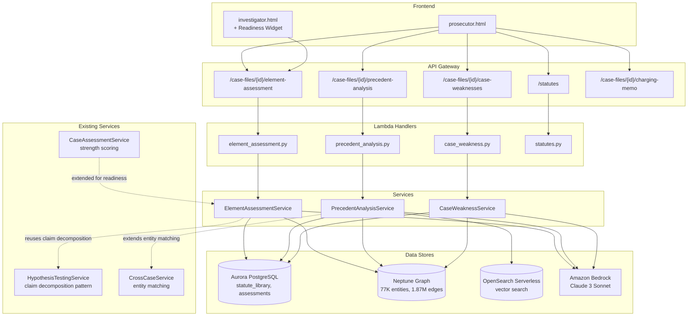
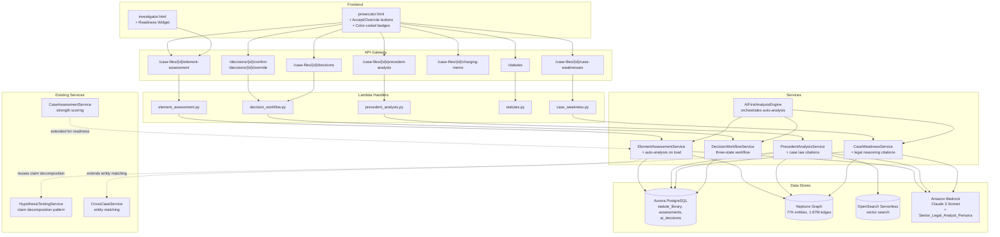
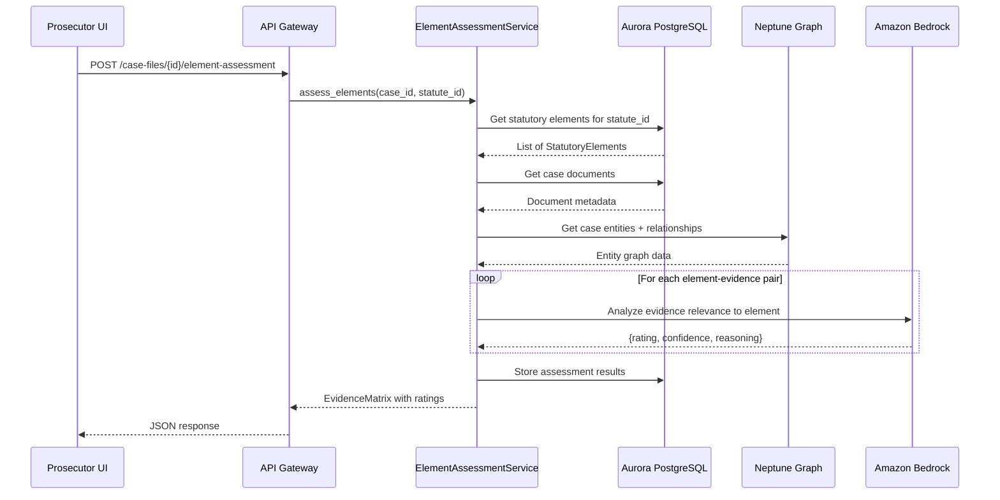
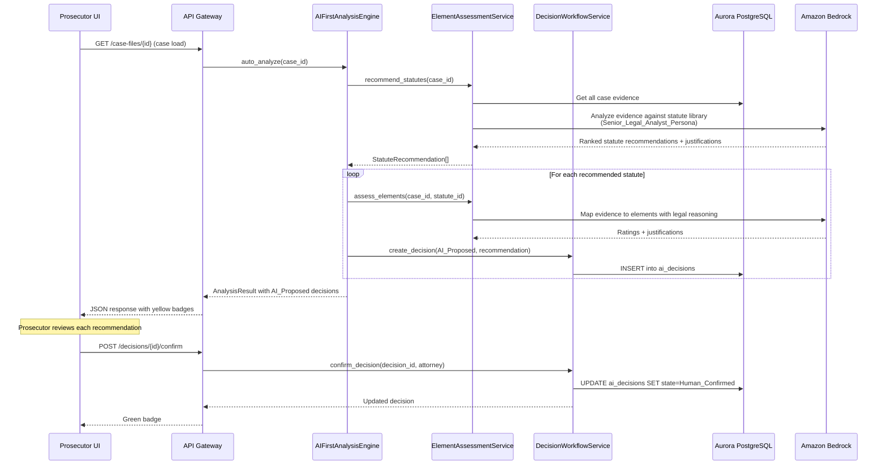
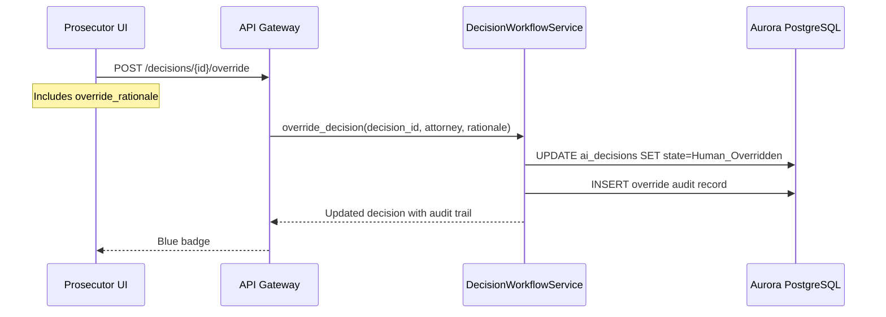

# Design Document: Prosecutor Case Review

## Overview

The Prosecutor Case Review module adds a prosecution-focused analysis layer to the Research Analyst platform. It enables prosecutors to map case evidence against federal statutory elements, assess charging viability, detect case weaknesses, and compare against precedent cases — all powered by the existing Neptune knowledge graph, OpenSearch vector search, Aurora PostgreSQL metadata, and Amazon Bedrock AI infrastructure.

The module introduces five backend services (`element_assessment_service.py`, `precedent_analysis_service.py`, `case_weakness_service.py`, `ai_first_analysis_engine.py`, `decision_workflow_service.py`), a new frontend page (`prosecutor.html`), new Aurora tables for statute library, assessment data, and AI decision audit trails, new Lambda handlers, and a prosecution readiness widget embedded in the existing `investigator.html`.

The AI-First Analysis Engine automatically analyzes cases on load — recommending statutes, mapping evidence to elements, and drafting charging recommendations using a Senior Legal Analyst persona via Bedrock. Every AI recommendation flows through a three-state Human-in-the-Loop Decision Workflow (AI_Proposed → Human_Confirmed / Human_Overridden) with full audit trail.

### Design Principles

- **Extend, don't duplicate**: Reuse existing service patterns (hypothesis_testing_service claim decomposition, cross_case_service entity matching, case_assessment_service scoring)
- **Same infrastructure**: All new services deploy as Lambda functions behind the existing API Gateway, using the same Aurora/Neptune/OpenSearch/Bedrock stack
- **Parallel UI**: prosecutor.html mirrors investigator.html layout patterns with an orange (#f6ad55) accent to distinguish the prosecutor section
- **Loose coupling**: New services are independently testable with injected dependencies following the existing Protocol/constructor-injection pattern
- **AI-first, human-final**: AI generates initial recommendations with legal reasoning; prosecutors confirm or override every decision with full audit trail
- **Senior Legal Analyst Persona**: All Bedrock calls use a system prompt instructing the model to reason as a seasoned federal prosecutor (AUSA) with proper legal terminology, case law citations, and federal sentencing guideline references

## Architecture





### Data Flow: Evidence-Element Assessment



### Data Flow: AI-First Case Analysis on Load



### Data Flow: Decision Override



## Components and Interfaces

### 1. ElementAssessmentService (`src/services/element_assessment_service.py`)

Reuses the claim decomposition pattern from `hypothesis_testing_service.py`, treating each statutory element as a testable claim evaluated against case evidence via Bedrock.

```python
class ElementAssessmentService:
    SENIOR_LEGAL_ANALYST_PERSONA = (
        "You are a senior federal prosecutor (AUSA) with 20+ years of experience. "
        "Reason using proper legal terminology. Cite case law patterns and reference "
        "federal sentencing guidelines (USSG) where applicable. Provide thorough legal "
        "justifications for every recommendation."
    )

    def __init__(self, aurora_cm, neptune_cm, bedrock_client, search_fn=None):
        ...

    def assess_elements(self, case_id: str, statute_id: str) -> EvidenceMatrix:
        """Assess all evidence against all elements for a statute.
        Auto-runs on case load with Senior_Legal_Analyst_Persona.
        Each rating includes legal justification and starts as AI_Proposed."""

    def assess_single(self, case_id: str, element_id: str, evidence_id: str) -> ElementRating:
        """Assess a single evidence-element pair with legal reasoning."""

    def compute_readiness_score(self, case_id: str, statute_id: str) -> ReadinessScore:
        """Compute prosecution readiness as green+yellow / total elements."""

    def suggest_alternative_charges(self, case_id: str, statute_id: str) -> list[AlternativeCharge]:
        """When primary charge has red elements, suggest up to 5 alternatives."""

    def recommend_statutes(self, case_id: str) -> list[StatuteRecommendation]:
        """Auto-recommend applicable statutes ranked by evidence match strength.
        Returns justification for each recommendation and explains why
        alternative statutes were considered and rejected. (Req 11.1, 11.6)"""

    def auto_categorize_evidence(self, case_id: str, evidence_id: str, statute_id: str) -> list[ElementMapping]:
        """Auto-map new evidence to the most relevant statutory elements.
        Returns justification citing specific evidentiary basis and
        confidence level (High/Medium/Low). (Req 11.2)"""

    def draft_charging_recommendation(self, case_id: str, statute_id: str) -> ChargingRecommendation:
        """Draft initial charging recommendation when sufficient evidence
        is mapped. Uses Senior_Legal_Analyst_Persona for full legal reasoning,
        citing precedent patterns and sentencing guidelines. (Req 11.3, 3.6)"""
```

### 2. PrecedentAnalysisService (`src/services/precedent_analysis_service.py`)

Extends `cross_case_service.py` entity matching to include case characteristic matching (charge type, evidence patterns, defendant profile, aggravating/mitigating factors). Combines Neptune graph similarity with OpenSearch semantic similarity for composite scoring.

```python
class PrecedentAnalysisService:
    def __init__(self, aurora_cm, neptune_cm, bedrock_client, opensearch_client=None):
        ...

    def find_precedents(self, case_id: str, charge_type: str, top_k: int = 10) -> list[PrecedentMatch]:
        """Find top-K matching precedent cases by composite similarity."""

    def compute_ruling_distribution(self, matches: list[PrecedentMatch]) -> RulingDistribution:
        """Compute outcome percentages across matched precedents."""

    def generate_sentencing_advisory(self, case_id: str, matches: list[PrecedentMatch]) -> SentencingAdvisory:
        """Use Bedrock with Senior_Legal_Analyst_Persona to generate sentencing
        advisory that cites specific precedent cases by name, references
        applicable federal sentencing guideline sections (e.g., USSG §2B1.1),
        and explains reasoning for likely sentence, fine/penalty, and
        supervised release. (Req 5.5)"""
```

### 3. CaseWeaknessService (`src/services/case_weakness_service.py`)

Analyzes case evidence for credibility issues, missing corroboration, suppression risks, and Brady material. Each weakness flag includes legal reasoning citing relevant case law (e.g., Brady v. Maryland for disclosure obligations, Mapp v. Ohio for suppression risks, Crawford v. Washington for confrontation clause issues).

```python
class CaseWeaknessService:
    def __init__(self, aurora_cm, neptune_cm, bedrock_client):
        ...

    def analyze_weaknesses(self, case_id: str, statute_id: str = None) -> list[CaseWeakness]:
        """Run full weakness analysis for a case.
        Each weakness includes legal_reasoning with case law citations."""

    def detect_conflicting_statements(self, case_id: str) -> list[CaseWeakness]:
        """Find conflicting statements across documents for same witness.
        Cites Crawford v. Washington for confrontation clause implications."""

    def detect_missing_corroboration(self, case_id: str, statute_id: str) -> list[CaseWeakness]:
        """Find elements supported by only one evidence source."""

    def detect_suppression_risks(self, case_id: str) -> list[CaseWeakness]:
        """Use Bedrock to flag potential Fourth Amendment issues.
        Cites Mapp v. Ohio and relevant exclusionary rule precedent."""

    def detect_brady_material(self, case_id: str) -> list[CaseWeakness]:
        """Use Bedrock to identify exculpatory evidence.
        Cites Brady v. Maryland and Giglio v. United States."""
```

### 4. AIFirstAnalysisEngine (`src/services/ai_first_analysis_engine.py`)

Orchestrates automatic case analysis on load. Coordinates ElementAssessmentService, CaseWeaknessService, and DecisionWorkflowService to produce a complete AI-first analysis with all recommendations tracked through the decision workflow.

```python
class AIFirstAnalysisEngine:
    def __init__(self, element_assessment_svc, case_weakness_svc, decision_workflow_svc, bedrock_client):
        ...

    def auto_analyze(self, case_id: str) -> CaseAnalysisResult:
        """Full auto-analysis on case load:
        1. Recommend applicable statutes (ranked by evidence match)
        2. Auto-map evidence to elements for top statutes
        3. Run weakness analysis
        4. Draft charging recommendation if sufficient evidence
        Each recommendation is created as an AI_Proposed decision."""

    def on_evidence_added(self, case_id: str, evidence_id: str) -> list[ElementMapping]:
        """Auto-categorize new evidence against selected statutes.
        Creates AI_Proposed decisions for each new mapping."""
```

### 5. DecisionWorkflowService (`src/services/decision_workflow_service.py`)

Manages the three-state decision lifecycle (AI_Proposed → Human_Confirmed / Human_Overridden) with full audit trail.

```python
class DecisionWorkflowService:
    def __init__(self, aurora_cm):
        ...

    def create_decision(self, case_id: str, decision_type: str,
                        recommendation_text: str, legal_reasoning: str,
                        confidence: str, source_service: str) -> AIDecision:
        """Create a new AI_Proposed decision. Records the AI recommendation
        text, legal reasoning, confidence level, and originating service."""

    def confirm_decision(self, decision_id: str, attorney_id: str) -> AIDecision:
        """Transition decision to Human_Confirmed.
        Records confirmation timestamp and attorney identity. (Req 12.2)"""

    def override_decision(self, decision_id: str, attorney_id: str,
                          override_rationale: str) -> AIDecision:
        """Transition decision to Human_Overridden.
        Requires non-empty override_rationale. (Req 12.3)"""

    def get_decision(self, decision_id: str) -> AIDecision:
        """Retrieve a single decision with current state."""

    def get_case_decisions(self, case_id: str, decision_type: str = None,
                           state: str = None) -> list[AIDecision]:
        """List all decisions for a case, optionally filtered by type/state."""

    def get_decision_history(self, decision_id: str) -> list[DecisionAuditEntry]:
        """Get full chronological audit trail for a decision. (Req 12.7)"""
```

### 6. Lambda Handlers

Following the existing dispatch pattern from `assessment.py`:

| Handler File | Routes | Service |
|---|---|---|
| `src/lambdas/api/element_assessment.py` | `GET/POST /case-files/{id}/element-assessment` | ElementAssessmentService |
| `src/lambdas/api/precedent_analysis.py` | `POST /case-files/{id}/precedent-analysis` | PrecedentAnalysisService |
| `src/lambdas/api/case_weakness.py` | `GET /case-files/{id}/case-weaknesses` | CaseWeaknessService |
| `src/lambdas/api/statutes.py` | `GET /statutes`, `GET /statutes/{id}` | Direct Aurora queries |
| `src/lambdas/api/decision_workflow.py` | `POST /decisions/{id}/confirm`, `POST /decisions/{id}/override`, `GET /case-files/{id}/decisions` | DecisionWorkflowService |

Each handler follows the existing pattern:
- `dispatch_handler(event, context)` routes by HTTP method + resource
- `_build_*_service()` constructs the service with injected dependencies
- Uses `response_helper.success_response` / `error_response` for consistent responses
- CORS preflight handled via OPTIONS

### 7. API Gateway Routes (additions to `api_definition.yaml`)

```yaml
/statutes:
  get:
    summary: List all statutes in the library
    operationId: listStatutes
/statutes/{id}:
  get:
    summary: Get statute details with elements
    operationId: getStatute
/case-files/{id}/element-assessment:
  get:
    summary: Get evidence matrix for a case+statute
    operationId: getElementAssessment
    parameters: [id, statute_id (query)]
  post:
    summary: Trigger element assessment for a case+statute
    operationId: runElementAssessment
/case-files/{id}/precedent-analysis:
  post:
    summary: Run precedent analysis for a case
    operationId: runPrecedentAnalysis
/case-files/{id}/case-weaknesses:
  get:
    summary: Get case weakness analysis
    operationId: getCaseWeaknesses
/case-files/{id}/charging-memo:
  post:
    summary: Generate charging memo export
    operationId: generateChargingMemo
/decisions/{id}/confirm:
  post:
    summary: Confirm an AI-proposed decision
    operationId: confirmDecision
    requestBody:
      required: true
      content:
        application/json:
          schema:
            properties:
              attorney_id: { type: string }
/decisions/{id}/override:
  post:
    summary: Override an AI-proposed decision with rationale
    operationId: overrideDecision
    requestBody:
      required: true
      content:
        application/json:
          schema:
            properties:
              attorney_id: { type: string }
              override_rationale: { type: string }
            required: [attorney_id, override_rationale]
/case-files/{id}/decisions:
  get:
    summary: List all AI decisions for a case
    operationId: getCaseDecisions
    parameters: [id, decision_type (query), state (query)]
```

### 8. Frontend Components

#### prosecutor.html

New page following `investigator.html` layout patterns with orange (#f6ad55) accent:

- **Case Sidebar**: Lists cases available for prosecution review (reuses case_files API)
- **Tabbed Navigation**: Evidence Matrix | Charging Decisions | Case Weaknesses | Precedent Analysis
- **Evidence Matrix Tab**: Grid with statutory elements as rows, evidence items as columns, color-coded cells (green/yellow/red), readiness score bar. Each AI-generated rating shows an expandable "Legal Reasoning" section with the full AI justification. Ratings display color-coded decision state badges: yellow (AI_Proposed), green (Human_Confirmed), blue (Human_Overridden). Each rating has Accept and Override buttons.
- **Charging Decisions Tab**: Charge annotations, risk flags (Brady, suppression), alternative charge suggestions, memo export button. AI-drafted charging recommendations appear as AI_Proposed cards with Accept/Override workflow. Includes expandable Legal Reasoning sections citing precedent patterns and sentencing guidelines.
- **Case Weaknesses Tab**: Weakness cards with severity badges (Critical/Warning/Info), linked evidence and elements. Each weakness includes a "Legal Basis" section citing relevant case law (Brady v. Maryland, Mapp v. Ohio, Crawford v. Washington).
- **Precedent Analysis Tab**: Repurposes `doj-case-analysis.html` layout — precedent cards with similarity scores, ruling distribution bars, sentencing advisory panel citing specific precedent cases by name and federal sentencing guideline sections (e.g., USSG §2B1.1).

#### Investigator Readiness Widget (added to investigator.html)

A collapsible panel in the existing investigator interface showing:
- Per-statute readiness score (percentage bar)
- Element coverage summary: "You have N/M elements covered for § XXXX. Missing: [element1], [element2]"
- Auto-refreshes when new evidence is added (polls every 30 seconds)
- Uses ElementAssessmentService via the `/case-files/{id}/element-assessment` API

### 9. Service Extension Points

#### Extending cross_case_service.py

PrecedentAnalysisService wraps CrossCaseService's `find_shared_entities` and adds:
- Charge type matching via Aurora `case_statutes` table
- Evidence pattern similarity via OpenSearch vector comparison
- Defendant profile matching via Neptune entity attributes
- Composite scoring: `0.3 * entity_similarity + 0.3 * semantic_similarity + 0.2 * charge_match + 0.2 * profile_match`

#### Extending case_assessment_service.py

The existing `_compute_strength_score` is complemented by `ElementAssessmentService.compute_readiness_score`, which provides a statute-specific score rather than a general case health metric. The investigator readiness widget calls the element assessment API alongside the existing assessment API.

#### Reusing hypothesis_testing_service.py

ElementAssessmentService reuses the claim decomposition pattern:
- `_decompose` → each statutory element becomes a "claim"
- `_search_evidence` → searches case evidence for relevance to the element
- `_classify_evidence` → Bedrock rates as green/yellow/red instead of SUPPORTED/CONTRADICTED/UNVERIFIED

## Data Models

### Aurora PostgreSQL Schema (new tables)

```sql
-- Migration: 002_prosecutor_case_review.sql

-- Statute library: federal statutes and their required elements
CREATE TABLE statutes (
    statute_id UUID PRIMARY KEY DEFAULT gen_random_uuid(),
    citation VARCHAR(100) NOT NULL UNIQUE,  -- e.g., '18 U.S.C. § 1591'
    title VARCHAR(500) NOT NULL,
    description TEXT,
    created_at TIMESTAMP WITH TIME ZONE DEFAULT NOW()
);

CREATE TABLE statutory_elements (
    element_id UUID PRIMARY KEY DEFAULT gen_random_uuid(),
    statute_id UUID NOT NULL REFERENCES statutes(statute_id) ON DELETE CASCADE,
    display_name VARCHAR(500) NOT NULL,
    description TEXT NOT NULL,  -- what must be proven
    element_order INT NOT NULL,  -- display ordering
    created_at TIMESTAMP WITH TIME ZONE DEFAULT NOW(),
    UNIQUE (statute_id, element_order)
);

-- Case-statute association: which statutes are selected for a case
CREATE TABLE case_statutes (
    case_id UUID NOT NULL REFERENCES case_files(case_id) ON DELETE CASCADE,
    statute_id UUID NOT NULL REFERENCES statutes(statute_id) ON DELETE CASCADE,
    selected_by VARCHAR(255),
    selected_at TIMESTAMP WITH TIME ZONE DEFAULT NOW(),
    PRIMARY KEY (case_id, statute_id)
);

-- Element assessment results: evidence-element pair ratings
CREATE TABLE element_assessments (
    assessment_id UUID PRIMARY KEY DEFAULT gen_random_uuid(),
    case_id UUID NOT NULL REFERENCES case_files(case_id) ON DELETE CASCADE,
    element_id UUID NOT NULL REFERENCES statutory_elements(element_id) ON DELETE CASCADE,
    evidence_id VARCHAR(255) NOT NULL,  -- document_id or entity_id
    evidence_type VARCHAR(50) NOT NULL,  -- 'document', 'entity', 'manual'
    rating VARCHAR(10) NOT NULL CHECK (rating IN ('green', 'yellow', 'red')),
    confidence INT NOT NULL CHECK (confidence BETWEEN 0 AND 100),
    reasoning TEXT,
    assessed_at TIMESTAMP WITH TIME ZONE DEFAULT NOW(),
    UNIQUE (case_id, element_id, evidence_id)
);

-- Charging decisions: prosecutor annotations and decisions
CREATE TABLE charging_decisions (
    decision_id UUID PRIMARY KEY DEFAULT gen_random_uuid(),
    case_id UUID NOT NULL REFERENCES case_files(case_id) ON DELETE CASCADE,
    statute_id UUID NOT NULL REFERENCES statutes(statute_id) ON DELETE CASCADE,
    decision VARCHAR(50) NOT NULL CHECK (decision IN ('charge', 'decline', 'pending')),
    rationale TEXT,
    approving_attorney VARCHAR(255),
    notes TEXT,
    risk_flags JSONB DEFAULT '[]',
    created_at TIMESTAMP WITH TIME ZONE DEFAULT NOW(),
    updated_at TIMESTAMP WITH TIME ZONE DEFAULT NOW()
);

-- Case weaknesses: flagged issues
CREATE TABLE case_weaknesses (
    weakness_id UUID PRIMARY KEY DEFAULT gen_random_uuid(),
    case_id UUID NOT NULL REFERENCES case_files(case_id) ON DELETE CASCADE,
    weakness_type VARCHAR(50) NOT NULL
        CHECK (weakness_type IN ('conflicting_statements', 'missing_corroboration',
                                  'suppression_risk', 'brady_material')),
    severity VARCHAR(20) NOT NULL CHECK (severity IN ('critical', 'warning', 'info')),
    description TEXT NOT NULL,
    affected_elements JSONB DEFAULT '[]',  -- array of element_ids
    affected_evidence JSONB DEFAULT '[]',  -- array of evidence_ids
    remediation TEXT,  -- required when severity = 'critical'
    detected_at TIMESTAMP WITH TIME ZONE DEFAULT NOW()
);

-- Precedent case outcomes (seed data for matching)
CREATE TABLE precedent_cases (
    precedent_id UUID PRIMARY KEY DEFAULT gen_random_uuid(),
    case_reference VARCHAR(255) NOT NULL,
    charge_type VARCHAR(255) NOT NULL,
    ruling VARCHAR(50) NOT NULL
        CHECK (ruling IN ('guilty', 'not_guilty', 'plea_deal', 'dismissed', 'settled')),
    sentence TEXT,
    judge VARCHAR(255),
    jurisdiction VARCHAR(100),
    case_summary TEXT,
    key_factors JSONB DEFAULT '[]',
    aggravating_factors JSONB DEFAULT '[]',
    mitigating_factors JSONB DEFAULT '[]',
    filed_date DATE,
    resolved_date DATE,
    created_at TIMESTAMP WITH TIME ZONE DEFAULT NOW()
);

-- AI decision audit trail: tracks every AI recommendation through three-state workflow
CREATE TABLE ai_decisions (
    decision_id UUID PRIMARY KEY DEFAULT gen_random_uuid(),
    case_id UUID NOT NULL REFERENCES case_files(case_id) ON DELETE CASCADE,
    decision_type VARCHAR(100) NOT NULL,  -- 'statute_recommendation', 'element_rating', 'charging_recommendation', 'evidence_mapping'
    state VARCHAR(30) NOT NULL DEFAULT 'ai_proposed'
        CHECK (state IN ('ai_proposed', 'human_confirmed', 'human_overridden')),
    recommendation_text TEXT NOT NULL,
    legal_reasoning TEXT,  -- full AI justification with case law citations
    confidence VARCHAR(10) NOT NULL CHECK (confidence IN ('high', 'medium', 'low')),
    source_service VARCHAR(100),  -- originating service name
    related_entity_id VARCHAR(255),  -- statute_id, element_id, etc.
    related_entity_type VARCHAR(50),  -- 'statute', 'element', 'charge'
    confirmed_at TIMESTAMP WITH TIME ZONE,
    confirmed_by VARCHAR(255),  -- attorney identity
    overridden_at TIMESTAMP WITH TIME ZONE,
    overridden_by VARCHAR(255),  -- attorney identity
    override_rationale TEXT,  -- required when state = 'human_overridden'
    created_at TIMESTAMP WITH TIME ZONE DEFAULT NOW(),
    updated_at TIMESTAMP WITH TIME ZONE DEFAULT NOW()
);

-- AI decision audit log: chronological history of all state transitions
CREATE TABLE ai_decision_audit_log (
    audit_id UUID PRIMARY KEY DEFAULT gen_random_uuid(),
    decision_id UUID NOT NULL REFERENCES ai_decisions(decision_id) ON DELETE CASCADE,
    previous_state VARCHAR(30),
    new_state VARCHAR(30) NOT NULL,
    actor VARCHAR(255) NOT NULL,  -- 'system' for AI, attorney name for human
    rationale TEXT,
    created_at TIMESTAMP WITH TIME ZONE DEFAULT NOW()
);

-- Indexes
CREATE INDEX idx_statutory_elements_statute ON statutory_elements(statute_id);
CREATE INDEX idx_case_statutes_case ON case_statutes(case_id);
CREATE INDEX idx_element_assessments_case ON element_assessments(case_id);
CREATE INDEX idx_element_assessments_element ON element_assessments(element_id);
CREATE INDEX idx_charging_decisions_case ON charging_decisions(case_id);
CREATE INDEX idx_case_weaknesses_case ON case_weaknesses(case_id);
CREATE INDEX idx_case_weaknesses_type ON case_weaknesses(weakness_type);
CREATE INDEX idx_precedent_cases_charge ON precedent_cases(charge_type);
CREATE INDEX idx_ai_decisions_case ON ai_decisions(case_id);
CREATE INDEX idx_ai_decisions_state ON ai_decisions(state);
CREATE INDEX idx_ai_decisions_type ON ai_decisions(decision_type);
CREATE INDEX idx_ai_decision_audit_log_decision ON ai_decision_audit_log(decision_id);
```

### Pydantic Models (`src/models/prosecutor.py`)

```python
class SupportRating(str, Enum):
    GREEN = "green"
    YELLOW = "yellow"
    RED = "red"

class ConfidenceLevel(str, Enum):
    HIGH = "high"
    MEDIUM = "medium"
    LOW = "low"

class DecisionState(str, Enum):
    AI_PROPOSED = "ai_proposed"
    HUMAN_CONFIRMED = "human_confirmed"
    HUMAN_OVERRIDDEN = "human_overridden"

class WeaknessSeverity(str, Enum):
    CRITICAL = "critical"
    WARNING = "warning"
    INFO = "info"

class WeaknessType(str, Enum):
    CONFLICTING_STATEMENTS = "conflicting_statements"
    MISSING_CORROBORATION = "missing_corroboration"
    SUPPRESSION_RISK = "suppression_risk"
    BRADY_MATERIAL = "brady_material"

class RulingOutcome(str, Enum):
    GUILTY = "guilty"
    NOT_GUILTY = "not_guilty"
    PLEA_DEAL = "plea_deal"
    DISMISSED = "dismissed"
    SETTLED = "settled"

class Statute(BaseModel):
    statute_id: str
    citation: str
    title: str
    description: Optional[str] = None
    elements: list["StatutoryElement"] = []

class StatutoryElement(BaseModel):
    element_id: str
    statute_id: str
    display_name: str
    description: str
    element_order: int

class ElementRating(BaseModel):
    element_id: str
    evidence_id: str
    rating: SupportRating
    confidence: int = Field(ge=0, le=100)
    reasoning: str = ""
    legal_justification: str = ""  # detailed legal reasoning from Senior_Legal_Analyst_Persona
    decision_id: Optional[str] = None  # links to ai_decisions table
    decision_state: DecisionState = DecisionState.AI_PROPOSED

class EvidenceMatrix(BaseModel):
    case_id: str
    statute_id: str
    elements: list[StatutoryElement]
    evidence_items: list[dict]  # [{evidence_id, title, type}]
    ratings: list[ElementRating]
    readiness_score: int = Field(ge=0, le=100)

class ReadinessScore(BaseModel):
    case_id: str
    statute_id: str
    citation: str
    score: int = Field(ge=0, le=100)
    total_elements: int
    covered_elements: int  # green + yellow
    missing_elements: list[str]  # element display names

class CaseWeakness(BaseModel):
    weakness_id: str
    case_id: str
    weakness_type: WeaknessType
    severity: WeaknessSeverity
    description: str
    legal_reasoning: str = ""  # case law citations (Brady v. Maryland, Mapp v. Ohio, etc.)
    affected_elements: list[str] = []
    affected_evidence: list[str] = []
    remediation: Optional[str] = None

class PrecedentMatch(BaseModel):
    precedent_id: str
    case_reference: str
    charge_type: str
    ruling: RulingOutcome
    sentence: Optional[str] = None
    similarity_score: int = Field(ge=0, le=100)
    key_factors: list[str] = []
    judge: Optional[str] = None
    jurisdiction: Optional[str] = None

class RulingDistribution(BaseModel):
    guilty_pct: float
    not_guilty_pct: float
    plea_deal_pct: float
    dismissed_pct: float
    settled_pct: float
    total_cases: int

class SentencingAdvisory(BaseModel):
    likely_sentence: str
    fine_or_penalty: str
    supervised_release: str
    precedent_match_pct: int
    disclaimer: Optional[str] = None  # when < 3 matches above 50

class AlternativeCharge(BaseModel):
    statute_id: str
    citation: str
    title: str
    estimated_conviction_likelihood: int = Field(ge=0, le=100)
    reasoning: str

class ChargingMemo(BaseModel):
    case_id: str
    case_summary: str
    selected_charges: list[dict]
    evidence_mapping_summary: str
    risk_assessment: str
    rationale: str
    approving_attorney: str
    generated_at: str

class StatuteRecommendation(BaseModel):
    statute_id: str
    citation: str
    title: str
    match_strength: int = Field(ge=0, le=100)  # evidence match score
    justification: str  # legal reasoning for recommendation
    confidence: ConfidenceLevel
    rejected_alternatives: list[dict] = []  # [{citation, reason_rejected}]

class ElementMapping(BaseModel):
    evidence_id: str
    element_id: str
    justification: str  # specific evidentiary basis
    confidence: ConfidenceLevel
    decision_id: Optional[str] = None

class ChargingRecommendation(BaseModel):
    case_id: str
    statute_id: str
    recommendation_text: str
    legal_reasoning: str  # full legal reasoning with precedent citations
    sentencing_guideline_refs: list[str] = []  # e.g., ["USSG §2B1.1"]
    confidence: ConfidenceLevel
    decision_id: Optional[str] = None

class AIDecision(BaseModel):
    decision_id: str
    case_id: str
    decision_type: str  # 'statute_recommendation', 'element_rating', 'charging_recommendation', 'evidence_mapping'
    state: DecisionState
    recommendation_text: str
    legal_reasoning: Optional[str] = None
    confidence: ConfidenceLevel
    source_service: Optional[str] = None
    related_entity_id: Optional[str] = None
    related_entity_type: Optional[str] = None
    confirmed_at: Optional[str] = None
    confirmed_by: Optional[str] = None
    overridden_at: Optional[str] = None
    overridden_by: Optional[str] = None
    override_rationale: Optional[str] = None
    created_at: str
    updated_at: str

class DecisionAuditEntry(BaseModel):
    audit_id: str
    decision_id: str
    previous_state: Optional[str] = None
    new_state: str
    actor: str  # 'system' for AI, attorney name for human
    rationale: Optional[str] = None
    created_at: str

class CaseAnalysisResult(BaseModel):
    case_id: str
    statute_recommendations: list[StatuteRecommendation] = []
    element_mappings: list[ElementMapping] = []
    weaknesses: list[CaseWeakness] = []
    charging_recommendation: Optional[ChargingRecommendation] = None
    decisions_created: list[str] = []  # decision_ids
```

## Correctness Properties

*A property is a characteristic or behavior that should hold true across all valid executions of a system — essentially, a formal statement about what the system should do. Properties serve as the bridge between human-readable specifications and machine-verifiable correctness guarantees.*

### Property 1: Statute storage round-trip

*For any* statute with a citation, title, and N statutory elements (each with display_name and description), storing it in the Statute_Library and then retrieving it by statute_id should return the same citation, title, and exactly N elements, each with a non-empty element_id, display_name, and description.

**Validates: Requirements 1.1, 1.3, 1.4**

### Property 2: Evidence matrix dimensions match elements and evidence

*For any* case with a selected statute having E elements and D evidence items, the generated EvidenceMatrix should have exactly E element rows and D evidence columns, with E × D rating cells.

**Validates: Requirements 2.1**

### Property 3: Element assessment output domain

*For any* valid (case_id, element_id, evidence_id) triple, the ElementAssessmentService should return a rating in {green, yellow, red}, a confidence score in [0, 100], and a non-empty reasoning string.

**Validates: Requirements 2.3, 8.1**

### Property 4: Readiness score formula

*For any* set of element ratings for a statute with T total elements, where G are rated green and Y are rated yellow, the Prosecution_Readiness_Score should equal round((G + Y) / T × 100).

**Validates: Requirements 2.6**

### Property 5: Manual evidence link updates assessment

*For any* evidence matrix and a new evidence-element link, after the link is added, the matrix should contain an assessment for that (element_id, evidence_id) pair that was not present before.

**Validates: Requirements 2.5**

### Property 6: Charging decision round-trip

*For any* charging decision with a selected charge, rationale, approving attorney, and notes, storing it and then retrieving it by decision_id should return the same charge, rationale, approving attorney, and notes.

**Validates: Requirements 3.1, 3.4**

### Property 7: Alternative charges bounded and sorted

*For any* case where the primary charge has at least one element rated red, the suggested alternative charges list should contain at most 5 items, and they should be sorted by estimated_conviction_likelihood in descending order.

**Validates: Requirements 3.3**

### Property 8: Charging memo contains all required sections

*For any* generated ChargingMemo, the output should contain non-empty values for case_summary, selected_charges, evidence_mapping_summary, risk_assessment, rationale, and approving_attorney.

**Validates: Requirements 3.5**

### Property 9: Weakness severity and linkage invariant

*For any* CaseWeakness returned by the analyzer, the severity must be one of {critical, warning, info}, and the weakness must reference at least one affected element or affected evidence item.

**Validates: Requirements 4.6, 4.7**

### Property 10: Missing corroboration detection

*For any* set of element assessments where a statutory element has exactly one evidence source rated green or yellow, the Case_Weakness_Analyzer should flag that element as a missing_corroboration weakness.

**Validates: Requirements 4.3, 10.2**

### Property 11: Critical weakness requires remediation

*For any* CaseWeakness with severity = critical, the remediation field must be non-empty.

**Validates: Requirements 10.5**

### Property 12: Precedent search result bounds and score range

*For any* precedent analysis request, the result set should contain at most 10 PrecedentMatch items, and each match should have a similarity_score in [0, 100].

**Validates: Requirements 5.1, 5.3**

### Property 13: Ruling distribution sums to 100

*For any* non-empty set of PrecedentMatch results, the computed RulingDistribution percentages (guilty_pct + not_guilty_pct + plea_deal_pct + dismissed_pct + settled_pct) should sum to 100 (within floating-point tolerance of ±1).

**Validates: Requirements 5.4**

### Property 14: Readiness message format

*For any* ReadinessScore with N covered elements out of M total for statute citation C, and a list of missing element names, the formatted message should match the pattern "You have N/M elements covered for § C. Missing: [elem1], [elem2]" and contain exactly (M - N) missing element names.

**Validates: Requirements 6.3**

### Property 15: Auto-statute recommendation ranking and justification

*For any* case with at least one evidence item, the `recommend_statutes` function should return a non-empty list of StatuteRecommendations sorted by match_strength in descending order, where each recommendation has a non-empty justification, a confidence level in {high, medium, low}, and a non-empty rejected_alternatives list explaining why other statutes were not recommended.

**Validates: Requirements 11.1, 11.6**

### Property 16: Auto-evidence categorization produces valid mappings

*For any* new evidence item and any selected statute with N elements, the `auto_categorize_evidence` function should return at least one ElementMapping where each mapping references a valid element_id from the statute, has a non-empty justification citing the evidentiary basis, and a confidence level in {high, medium, low}.

**Validates: Requirements 11.2**

### Property 17: Charging recommendation threshold trigger

*For any* case and statute where the readiness score is ≥ 70% (sufficient evidence threshold), the `draft_charging_recommendation` function should return a ChargingRecommendation with non-empty recommendation_text, non-empty legal_reasoning, and at least one sentencing_guideline_refs entry.

**Validates: Requirements 3.6, 11.3**

### Property 18: AI recommendation confidence domain

*For any* AI recommendation (statute recommendation, element rating, evidence mapping, or charging recommendation), the confidence level must be in {high, medium, low}, and the recommendation must have a non-empty legal_reasoning or justification field.

**Validates: Requirements 11.5, 2.7**

### Property 19: Decision state domain invariant

*For any* AIDecision record, the state must be exactly one of {ai_proposed, human_confirmed, human_overridden}. A newly created decision must have state = ai_proposed.

**Validates: Requirements 12.1, 2.8, 3.7**

### Property 20: Decision confirmation and override invariants

*For any* AIDecision with state = human_confirmed, the confirmed_at timestamp and confirmed_by attorney must be non-null and non-empty. *For any* AIDecision with state = human_overridden, the overridden_at timestamp, overridden_by attorney, and override_rationale must all be non-null and non-empty.

**Validates: Requirements 12.2, 12.3**

### Property 21: Decision audit trail round-trip

*For any* AIDecision that is created, then confirmed or overridden, storing it in the ai_decisions table and then retrieving it by decision_id should return the same recommendation_text, legal_reasoning, state, and all associated timestamps and attorney identities.

**Validates: Requirements 12.4**

### Property 22: Decision history chronological ordering

*For any* AIDecision with multiple state transitions (e.g., ai_proposed → human_confirmed, or ai_proposed → human_overridden), the `get_decision_history` function should return all DecisionAuditEntry records in ascending chronological order by created_at, and the count of entries should equal the number of state transitions plus one (the initial creation).

**Validates: Requirements 12.7**

### Property 23: Weakness legal citations present

*For any* CaseWeakness returned by the analyzer, the legal_reasoning field must be non-empty and must contain at least one case law citation string (e.g., "Brady v. Maryland", "Mapp v. Ohio", or "Crawford v. Washington") appropriate to the weakness_type.

**Validates: Requirements 4.8**

### Property 24: Sentencing advisory cites precedent and guidelines

*For any* SentencingAdvisory generated from a non-empty set of PrecedentMatch results, the advisory text (likely_sentence, fine_or_penalty, supervised_release fields combined) should contain at least one specific precedent case name from the matched results and at least one federal sentencing guideline section reference (matching pattern "USSG §" or "U.S.S.G. §").

**Validates: Requirements 5.5**

## Error Handling

### Bedrock Unavailability

All services depend on Amazon Bedrock for AI analysis. Each implements a graceful fallback:

- **ElementAssessmentService**: Returns `rating=yellow, confidence=0, reasoning="AI analysis unavailable"` (Req 8.4). Auto-analysis on load skips statute recommendations and returns empty results with a warning.
- **AIFirstAnalysisEngine**: Falls back to deterministic-only analysis (no statute recommendations, no charging drafts). Returns partial results with `warnings` field.
- **PrecedentAnalysisService**: Returns precedent matches based on Neptune/OpenSearch similarity only, with sentencing advisory replaced by a static message (no case law citations or guideline references)
- **CaseWeaknessService**: Skips Bedrock-dependent checks (suppression_risk, brady_material) and returns only deterministic weaknesses (conflicting_statements, missing_corroboration). Legal reasoning citations are omitted.
- **DecisionWorkflowService**: Not affected (no Bedrock dependency — purely Aurora CRUD)

### Invalid Input Handling

| Scenario | Response |
|---|---|
| Missing case_id | 400 VALIDATION_ERROR |
| Case not found | 404 NOT_FOUND |
| Statute not found | 404 NOT_FOUND |
| Invalid statute_id format | 400 VALIDATION_ERROR |
| No statutes selected for case | 200 with empty matrix |
| No evidence in case | 200 with all-red matrix |
| No precedent matches | 200 with empty matches + disclaimer |
| Decision not found | 404 NOT_FOUND |
| Decision already confirmed/overridden | 409 CONFLICT (cannot re-confirm) |
| Override without rationale | 400 VALIDATION_ERROR |
| Invalid decision state transition | 400 VALIDATION_ERROR |

### Database Errors

- Aurora connection failures: Return 500 INTERNAL_ERROR with logged details
- Neptune query timeouts: Return partial results with a `warnings` field indicating incomplete graph data
- OpenSearch unavailability: PrecedentAnalysisService falls back to Neptune-only similarity (reduced accuracy)

### Concurrent Assessment Updates

Element assessments use `ON CONFLICT (case_id, element_id, evidence_id) DO UPDATE` to handle concurrent writes. The last write wins, which is acceptable since assessments are idempotent for the same input.

## Testing Strategy

### Property-Based Testing

Property-based tests use **Hypothesis** (Python) with a minimum of 100 iterations per property. Each test references its design document property.

```python
# Tag format for each property test:
# Feature: prosecutor-case-review, Property {N}: {property_text}
```

Properties to implement as Hypothesis tests:

1. **Property 1** (Statute round-trip): Generate random statutes with random elements, store and retrieve, verify equality
2. **Property 2** (Matrix dimensions): Generate random element counts and evidence counts, verify matrix shape
3. **Property 3** (Assessment output domain): Generate random input triples, verify output rating/confidence/reasoning constraints
4. **Property 4** (Readiness score formula): Generate random lists of ratings, compute score, verify formula
5. **Property 5** (Manual link updates): Generate random matrices and new links, verify cell appears
6. **Property 6** (Charging decision round-trip): Generate random decisions, store and retrieve, verify equality
7. **Property 7** (Alternative charges bounded/sorted): Generate random charge suggestions, verify ≤5 and sorted
8. **Property 8** (Memo completeness): Generate random memo inputs, verify all fields present
9. **Property 9** (Weakness invariant): Generate random weaknesses, verify severity domain and linkage
10. **Property 10** (Missing corroboration): Generate random assessment sets with single-source elements, verify detection
11. **Property 11** (Critical remediation): Generate random weaknesses with critical severity, verify remediation present
12. **Property 12** (Precedent bounds): Generate random precedent results, verify ≤10 and score range
13. **Property 13** (Distribution sums): Generate random ruling sets, compute distribution, verify sum ≈ 100
14. **Property 14** (Message format): Generate random readiness scores, verify message pattern
15. **Property 15** (Statute recommendation ranking): Generate random cases with evidence, verify recommendations are sorted by match_strength descending, each has justification and rejected alternatives
16. **Property 16** (Evidence categorization): Generate random evidence items and statutes, verify at least one valid element mapping with justification and confidence
17. **Property 17** (Charging recommendation threshold): Generate random cases with readiness ≥ 70%, verify recommendation has legal_reasoning and guideline refs
18. **Property 18** (Confidence domain): Generate random AI recommendations of all types, verify confidence in {high, medium, low} and non-empty justification
19. **Property 19** (Decision state domain): Generate random AIDecision records, verify state in {ai_proposed, human_confirmed, human_overridden} and new decisions start as ai_proposed
20. **Property 20** (Confirmation/override invariants): Generate random confirmed and overridden decisions, verify confirmed has timestamp+attorney, overridden has timestamp+attorney+rationale
21. **Property 21** (Decision round-trip): Generate random decisions, store and retrieve, verify all fields preserved
22. **Property 22** (History ordering): Generate random decisions with multiple transitions, verify audit entries in chronological order
23. **Property 23** (Weakness legal citations): Generate random weaknesses, verify legal_reasoning contains appropriate case law citation
24. **Property 24** (Sentencing advisory citations): Generate random precedent sets, verify advisory contains case name and USSG reference

### Unit Tests

Unit tests cover specific examples, edge cases, and integration points:

- **Seed data verification**: Assert the 6 required statutes exist with correct citations (Req 1.2)
- **Bedrock fallback**: Mock Bedrock to raise exception, verify yellow/0/unavailable response (Req 8.4)
- **Limited precedent disclaimer**: Create < 3 matches above 50, verify disclaimer present (Req 9.4)
- **Conflicting statement detection**: Create two documents with contradictory statements for same witness, verify detection (Req 4.2, 10.1)
- **Empty case handling**: Run assessment on case with no evidence, verify all-red matrix
- **Lambda handler routing**: Verify dispatch_handler routes correctly for each HTTP method/resource combination
- **CORS preflight**: Verify OPTIONS returns correct CORS headers
- **Charging memo export**: Verify generated memo contains all required sections with specific test data
- **Auto-analysis on case load**: Mock Bedrock, verify auto_analyze returns statute recommendations and element mappings with AI_Proposed decisions (Req 11.1)
- **Senior Legal Analyst Persona system prompt**: Verify Bedrock calls include the AUSA system prompt (Req 11.4)
- **Decision confirm workflow**: Create AI_Proposed decision, confirm it, verify state=human_confirmed with timestamp and attorney (Req 12.2)
- **Decision override requires rationale**: Attempt override with empty rationale, verify 400 error (Req 12.3)
- **Decision override workflow**: Create AI_Proposed decision, override with rationale, verify state=human_overridden (Req 12.3)
- **Decision already confirmed**: Attempt to confirm an already-confirmed decision, verify 409 conflict
- **Weakness Brady citation**: Create a Brady material weakness, verify legal_reasoning contains "Brady v. Maryland" (Req 4.8)
- **Weakness suppression citation**: Create a suppression risk weakness, verify legal_reasoning contains "Mapp v. Ohio" (Req 4.8)
- **Sentencing advisory with case names**: Generate advisory from 5 precedent matches, verify output contains at least one matched case_reference and "USSG §" (Req 5.5)
- **Decision history completeness**: Create decision, confirm, verify history has 2 entries (creation + confirmation) in order (Req 12.7)

### Test File Organization

```
tests/unit/
    test_element_assessment_service.py    # Properties 1-5, 15-18, unit tests
    test_precedent_analysis_service.py    # Properties 12-13, 24, unit tests
    test_case_weakness_service.py         # Properties 9-11, 23, unit tests
    test_decision_workflow_service.py     # Properties 19-22, unit tests
    test_ai_first_analysis_engine.py      # Integration tests for auto-analysis orchestration
    test_prosecutor_models.py            # Properties 6-8, 14, model validation
    test_prosecutor_handlers.py          # Lambda handler routing tests (incl. decision workflow routes)
```
