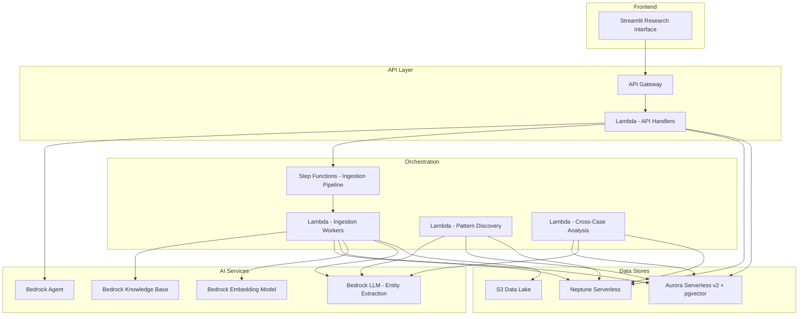
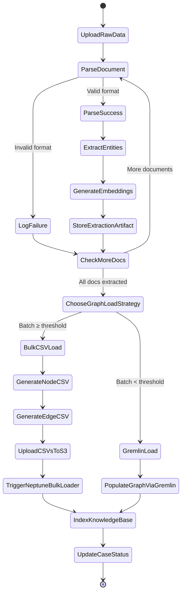
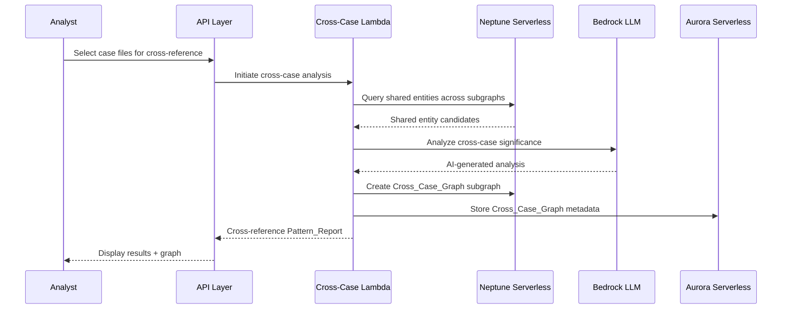

# Design Document: Research Analyst Platform

## Overview

The Research Analyst Platform is a serverless research engine that enables analysts to create "case files" for any topic and conduct structured investigations using AI-powered entity extraction, graph-based pattern discovery, and semantic search. The platform follows investigative journalism principles — structured data collection, entity extraction, pattern discovery, and cross-referencing — to surface hidden connections across large document corpora.

The system is built entirely on AWS serverless services: Aurora Serverless v2 (pgvector) for relational data and vector search, Neptune Serverless for knowledge graphs, Bedrock for AI reasoning and embeddings, S3 for raw data storage, Lambda for compute, Step Functions for orchestration, and Streamlit for the frontend.

All case files share the same infrastructure with logical separation (S3 prefixes, Neptune subgraph labels, Aurora metadata filters). The system scales to near-zero when idle. The first use case is Ancient Aliens public transcripts.

### Key Design Decisions

1. **Single shared infrastructure** — Case files are metadata records, not separate deployments. This enables unlimited case files without provisioning overhead.
2. **Dual discovery engine** — Graph traversal (Neptune) and vector similarity (Aurora pgvector) provide complementary pattern discovery approaches, unified into a single Pattern_Report.
3. **Cross-case graphs as first-class objects** — Cross_Case_Graphs are persisted Neptune subgraphs with their own metadata, not ephemeral query results. They serve as reusable investigative workspaces.
4. **Structured over freeform** — The Research_Interface uses parameterized queries and predefined templates rather than freeform chat, enforcing consistent data collection.
5. **Streamlit-first frontend** — Rapid iteration on analysis logic now, with a clean migration path to Next.js later.
6. **Hybrid Neptune loading** — Bulk CSV loading via Neptune's bulk loader API for large initial ingestions (hundreds of documents), Gremlin API for incremental updates (adding a few documents, confirming cross-case connections). Extraction artifacts in S3 serve as the source of truth for regenerating CSVs.

## Architecture

### High-Level Architecture



### Ingestion Pipeline Flow



### Cross-Case Analysis Flow



## Components and Interfaces

### 1. Case File Service (Lambda)

Manages CRUD operations for Case_Files, Sub_Case_Files, and Cross_Case_Graphs.

```python
# case_file_service.py

from dataclasses import dataclass, field
from datetime import datetime
from enum import Enum
from typing import Optional
import uuid


class CaseFileStatus(Enum):
    CREATED = "created"
    INGESTING = "ingesting"
    INDEXED = "indexed"
    INVESTIGATING = "investigating"
    ARCHIVED = "archived"
    ERROR = "error"


@dataclass
class CaseFile:
    case_id: str
    topic_name: str
    description: str
    status: CaseFileStatus
    created_at: datetime
    parent_case_id: Optional[str]  # None for top-level, set for Sub_Case_Files
    s3_prefix: str
    neptune_subgraph_label: str
    document_count: int = 0
    entity_count: int = 0
    relationship_count: int = 0
    findings: list = field(default_factory=list)
    last_activity: Optional[datetime] = None
    error_details: Optional[str] = None


@dataclass
class CrossCaseGraph:
    graph_id: str
    name: str
    linked_case_ids: list[str]
    created_at: datetime
    neptune_subgraph_label: str
    analyst_notes: str = ""
    status: str = "active"


class CaseFileService:
    """Handles case file CRUD, validation, and lifecycle management."""

    def create_case_file(self, topic_name: str, description: str, parent_case_id: Optional[str] = None) -> CaseFile:
        """Create a new case file with logical separation in S3, Neptune, and Aurora."""
        ...

    def get_case_file(self, case_id: str) -> CaseFile:
        """Retrieve case file metadata by ID."""
        ...

    def list_case_files(self, status: Optional[str] = None, topic_keyword: Optional[str] = None,
                        date_from: Optional[datetime] = None, date_to: Optional[datetime] = None) -> list[CaseFile]:
        """List case files with optional filters."""
        ...

    def update_status(self, case_id: str, status: CaseFileStatus, error_details: Optional[str] = None) -> CaseFile:
        """Update case file status and optionally record error details."""
        ...

    def archive_case_file(self, case_id: str) -> CaseFile:
        """Archive a case file, retaining all data."""
        ...

    def delete_case_file(self, case_id: str) -> None:
        """Delete case file and all associated data (S3, Aurora, Neptune)."""
        ...

    def create_cross_case_graph(self, name: str, case_ids: list[str]) -> CrossCaseGraph:
        """Create a new cross-case graph workspace linking multiple case files."""
        ...

    def update_cross_case_graph(self, graph_id: str, add_case_ids: list[str] = None,
                                 remove_case_ids: list[str] = None) -> CrossCaseGraph:
        """Add or remove case files from an existing cross-case graph."""
        ...
```

### 2. Ingestion Pipeline (Step Functions + Lambda)

Orchestrates document processing: parsing, entity extraction, embedding generation, graph population, and knowledge base indexing.

```python
# ingestion_service.py

from dataclasses import dataclass, field
from typing import Optional


@dataclass
class ParsedDocument:
    document_id: str
    case_file_id: str
    source_metadata: dict          # original filename, upload timestamp, format
    raw_text: str
    sections: list[dict]           # extracted sections with titles and content
    parse_errors: list[str] = field(default_factory=list)


@dataclass
class ExtractionResult:
    document_id: str
    entities: list[dict]           # {type, name, confidence, occurrences}
    relationships: list[dict]      # {source, target, type, confidence}


@dataclass
class BatchResult:
    case_file_id: str
    total_documents: int
    successful: int
    failed: int
    document_count: int
    entity_count: int
    relationship_count: int
    failures: list[dict]           # {document_id, error}


class DocumentParser:
    """Parses raw documents into structured internal representation."""

    def parse(self, raw_content: str, document_id: str, case_file_id: str) -> ParsedDocument:
        """Parse raw document into structured representation."""
        ...

    def format(self, parsed_doc: ParsedDocument) -> str:
        """Format structured representation back to human-readable text."""
        ...


class IngestionService:
    """Orchestrates the full ingestion pipeline for a case file."""

    BULK_LOAD_THRESHOLD = 20  # Use bulk CSV loader when batch size >= this

    def upload_documents(self, case_id: str, files: list[bytes]) -> list[str]:
        """Upload raw files to S3 under case-specific prefix. Returns document IDs."""
        ...

    def process_document(self, case_id: str, document_id: str) -> ExtractionResult:
        """Process a single document: parse, extract entities, generate embeddings, populate graph."""
        ...

    def process_batch(self, case_id: str, document_ids: list[str]) -> BatchResult:
        """Process a batch of documents, continuing on individual failures.
        Uses bulk CSV loading for large batches, Gremlin for small batches."""
        ...
```

### 2b. Neptune Graph Loader (Lambda)

Handles both bulk CSV loading and incremental Gremlin writes to Neptune. The hybrid approach uses bulk loading for large initial ingestions and Gremlin for small incremental updates.

```python
# neptune_graph_loader.py

from dataclasses import dataclass


@dataclass
class NeptuneCSVFiles:
    nodes_s3_path: str             # S3 path to nodes CSV
    edges_s3_path: str             # S3 path to edges CSV
    node_count: int
    edge_count: int


class NeptuneGraphLoader:
    """Handles loading entities and relationships into Neptune via bulk CSV or Gremlin."""

    def generate_nodes_csv(self, case_id: str, extraction_results: list[dict]) -> str:
        """Generate Neptune bulk loader nodes CSV from extraction artifacts.
        CSV format: ~id, ~label, entity_type:String, canonical_name:String,
                     confidence:Float, occurrence_count:Int, case_file_id:String
        Returns S3 path to uploaded CSV."""
        ...

    def generate_edges_csv(self, case_id: str, extraction_results: list[dict]) -> str:
        """Generate Neptune bulk loader edges CSV from extraction artifacts.
        CSV format: ~id, ~from, ~to, ~label, relationship_type:String,
                     confidence:Float, source_document_ref:String
        Returns S3 path to uploaded CSV."""
        ...

    def bulk_load(self, nodes_csv_s3_path: str, edges_csv_s3_path: str,
                  neptune_endpoint: str, iam_role_arn: str) -> dict:
        """Trigger Neptune bulk loader API to load nodes and edges from S3 CSVs.
        Returns load status with load ID for polling."""
        ...

    def poll_bulk_load_status(self, load_id: str, neptune_endpoint: str) -> str:
        """Poll Neptune bulk loader status until complete or failed.
        Returns final status: 'LOAD_COMPLETED' or 'LOAD_FAILED'."""
        ...

    def load_via_gremlin(self, case_id: str, entities: list[dict],
                          relationships: list[dict]) -> dict:
        """Write entities as nodes and relationships as edges via Gremlin API.
        Used for small incremental updates (< BULK_LOAD_THRESHOLD documents)."""
        ...

    def merge_duplicate_nodes(self, case_id: str, canonical_name: str,
                               entity_type: str) -> None:
        """Merge duplicate entity nodes in Neptune by canonical name + type.
        Aggregates occurrence counts and source refs into a single node."""
        ...
```

### 3. Pattern Discovery Service (Lambda)

Runs graph-based and vector-based pattern discovery, producing unified Pattern_Reports.

```python
# pattern_discovery_service.py

from dataclasses import dataclass
from typing import Optional


@dataclass
class Pattern:
    pattern_id: str
    entities_involved: list[dict]  # {entity_id, name, type}
    connection_type: str           # graph-based, vector-based, combined
    explanation: str               # AI-generated natural language
    confidence_score: float
    novelty_score: float
    source_documents: list[str]


@dataclass
class PatternReport:
    report_id: str
    case_file_id: str
    patterns: list[Pattern]        # ranked by confidence * novelty
    graph_patterns_count: int
    vector_patterns_count: int
    combined_count: int


class PatternDiscoveryService:
    """Discovers patterns using graph traversal and vector similarity."""

    def discover_graph_patterns(self, case_id: str) -> list[Pattern]:
        """Run graph traversal algorithms (shortest path, community detection, centrality)."""
        ...

    def discover_vector_patterns(self, case_id: str) -> list[Pattern]:
        """Find semantic clusters via vector similarity in pgvector."""
        ...

    def generate_pattern_report(self, case_id: str) -> PatternReport:
        """Combine graph and vector patterns, deduplicate, rank, and produce report."""
        ...
```

### 4. Cross-Case Analysis Service (Lambda)

Handles cross-case entity matching, graph creation, and automatic overlap detection.

```python
# cross_case_service.py

from dataclasses import dataclass


@dataclass
class CrossCaseMatch:
    entity_a: dict                 # {entity_id, name, type, case_id}
    entity_b: dict
    similarity_score: float
    ai_explanation: str


@dataclass
class CrossReferenceReport:
    report_id: str
    case_ids: list[str]
    shared_entities: list[CrossCaseMatch]
    parallel_patterns: list[dict]
    ai_analysis: str


class CrossCaseService:
    """Manages cross-case analysis and dynamic knowledge graphs."""

    def find_shared_entities(self, case_ids: list[str]) -> list[CrossCaseMatch]:
        """Query Neptune for shared/similar entities across case subgraphs."""
        ...

    def generate_cross_reference_report(self, case_ids: list[str]) -> CrossReferenceReport:
        """Produce full cross-reference report with AI analysis."""
        ...

    def create_cross_case_graph(self, name: str, case_ids: list[str], matches: list[CrossCaseMatch]) -> str:
        """Create a dedicated Neptune subgraph with cross-case edges."""
        ...

    def scan_for_overlaps(self, new_case_id: str) -> list[CrossCaseMatch]:
        """Automatically scan new case against all existing cases for entity overlaps."""
        ...

    def confirm_connection(self, match: CrossCaseMatch, graph_id: str) -> None:
        """Add analyst-confirmed connection to a cross-case graph."""
        ...
```

### 5. Entity Extraction Service (Lambda + Bedrock)

Extracts entities and relationships from document text using Bedrock LLM.

```python
# entity_extraction_service.py

from dataclasses import dataclass
from enum import Enum


class EntityType(Enum):
    PERSON = "person"
    LOCATION = "location"
    DATE = "date"
    ARTIFACT = "artifact"
    CIVILIZATION = "civilization"
    THEME = "theme"
    EVENT = "event"


class RelationshipType(Enum):
    CO_OCCURRENCE = "co-occurrence"
    CAUSAL = "causal"
    TEMPORAL = "temporal"
    GEOGRAPHIC = "geographic"
    THEMATIC = "thematic"


@dataclass
class ExtractedEntity:
    entity_type: EntityType
    canonical_name: str
    confidence: float
    occurrences: int
    source_document_refs: list[str]


@dataclass
class ExtractedRelationship:
    source_entity: str             # canonical name
    target_entity: str
    relationship_type: RelationshipType
    confidence: float
    source_document_ref: str


class EntityExtractionService:
    """Uses Bedrock LLM to extract entities and relationships from text."""

    def extract_entities(self, text: str, document_id: str) -> list[ExtractedEntity]:
        """Extract entities from document text via Bedrock."""
        ...

    def extract_relationships(self, text: str, entities: list[ExtractedEntity],
                               document_id: str) -> list[ExtractedRelationship]:
        """Extract relationships between entities via Bedrock."""
        ...

    def merge_entities(self, existing: list[ExtractedEntity],
                        new: list[ExtractedEntity]) -> list[ExtractedEntity]:
        """Merge duplicate entities, aggregating counts and source refs."""
        ...
```

### 6. Semantic Search Service (Lambda + Bedrock Knowledge Base)

Provides semantic search and AI-assisted analysis via Bedrock Knowledge Bases and Agents.

```python
# semantic_search_service.py

from dataclasses import dataclass


@dataclass
class SearchResult:
    document_id: str
    passage: str
    relevance_score: float
    source_document_ref: str
    surrounding_context: str


@dataclass
class AnalysisSummary:
    subject: str                   # entity or pattern being analyzed
    summary: str                   # AI-generated structured analysis
    supporting_passages: list[SearchResult]
    confidence: float


class SemanticSearchService:
    """Interfaces with Bedrock Knowledge Base for semantic retrieval."""

    def search(self, case_id: str, query: str, top_k: int = 10) -> list[SearchResult]:
        """Semantic search across case file documents."""
        ...

    def analyze_entity(self, case_id: str, entity_name: str) -> AnalysisSummary:
        """AI-assisted analysis of an entity using Bedrock Agent."""
        ...

    def analyze_pattern(self, case_id: str, pattern_id: str) -> AnalysisSummary:
        """AI-assisted analysis of a pattern using Bedrock Agent."""
        ...
```

### 7. Research Interface (Streamlit)

The Streamlit frontend provides structured investigation tools.

```python
# research_interface.py (Streamlit app structure)

# Pages:
# 1. Case File Dashboard - list, create, manage case files
# 2. Case File Detail - metadata, ingestion status, entity/relationship counts
# 3. Graph Explorer - interactive network visualization (streamlit-agraph/pyvis)
# 4. Pattern Discovery - trigger and view pattern reports
# 5. Cross-Case Analysis - select cases, view cross-reference reports, manage cross-case graphs
# 6. Semantic Search - natural language queries against case documents
# 7. Findings Log - record observations, tag entities, annotate patterns

# Sidebar controls:
# - Entity type filter
# - Relationship type filter
# - Confidence score threshold
# - Source document filter
# - Date range filter
```

### API Interface Summary

| Endpoint | Method | Description |
|---|---|---|
| `/case-files` | POST | Create a new case file |
| `/case-files` | GET | List case files with filters |
| `/case-files/{id}` | GET | Get case file details |
| `/case-files/{id}` | DELETE | Delete case file and all data |
| `/case-files/{id}/archive` | POST | Archive a case file |
| `/case-files/{id}/ingest` | POST | Upload and ingest documents |
| `/case-files/{id}/patterns` | POST | Trigger pattern discovery |
| `/case-files/{id}/patterns` | GET | Get pattern reports |
| `/case-files/{id}/search` | POST | Semantic search |
| `/case-files/{id}/drill-down` | POST | Create sub-case file from pattern/entity |
| `/cross-case/analyze` | POST | Cross-case analysis |
| `/cross-case/graphs` | POST | Create cross-case graph |
| `/cross-case/graphs/{id}` | PATCH | Update cross-case graph membership |
| `/cross-case/graphs/{id}` | GET | Get cross-case graph details |

## Data Models

### Aurora Serverless v2 (PostgreSQL + pgvector)

```sql
-- Case file metadata
CREATE TABLE case_files (
    case_id UUID PRIMARY KEY DEFAULT gen_random_uuid(),
    topic_name VARCHAR(255) NOT NULL,
    description TEXT NOT NULL,
    status VARCHAR(20) NOT NULL DEFAULT 'created'
        CHECK (status IN ('created', 'ingesting', 'indexed', 'investigating', 'archived', 'error')),
    parent_case_id UUID REFERENCES case_files(case_id) ON DELETE SET NULL,
    s3_prefix VARCHAR(512) NOT NULL,
    neptune_subgraph_label VARCHAR(255) NOT NULL,
    document_count INT DEFAULT 0,
    entity_count INT DEFAULT 0,
    relationship_count INT DEFAULT 0,
    error_details TEXT,
    created_at TIMESTAMP WITH TIME ZONE DEFAULT NOW(),
    last_activity TIMESTAMP WITH TIME ZONE DEFAULT NOW()
);

-- Cross-case graph metadata
CREATE TABLE cross_case_graphs (
    graph_id UUID PRIMARY KEY DEFAULT gen_random_uuid(),
    name VARCHAR(255) NOT NULL,
    neptune_subgraph_label VARCHAR(255) NOT NULL,
    analyst_notes TEXT DEFAULT '',
    status VARCHAR(20) DEFAULT 'active',
    created_at TIMESTAMP WITH TIME ZONE DEFAULT NOW()
);

-- Many-to-many: cross-case graphs <-> case files
CREATE TABLE cross_case_graph_members (
    graph_id UUID REFERENCES cross_case_graphs(graph_id) ON DELETE CASCADE,
    case_id UUID REFERENCES case_files(case_id) ON DELETE CASCADE,
    PRIMARY KEY (graph_id, case_id)
);

-- Document metadata and embeddings (pgvector)
CREATE TABLE documents (
    document_id UUID PRIMARY KEY DEFAULT gen_random_uuid(),
    case_file_id UUID NOT NULL REFERENCES case_files(case_id) ON DELETE CASCADE,
    source_filename VARCHAR(512),
    source_metadata JSONB,
    raw_text TEXT,
    sections JSONB,
    embedding vector(1536),  -- Bedrock Titan embedding dimension
    indexed_at TIMESTAMP WITH TIME ZONE DEFAULT NOW()
);

-- Findings log
CREATE TABLE findings (
    finding_id UUID PRIMARY KEY DEFAULT gen_random_uuid(),
    case_file_id UUID NOT NULL REFERENCES case_files(case_id) ON DELETE CASCADE,
    content TEXT NOT NULL,
    tagged_entities JSONB DEFAULT '[]',
    tagged_patterns JSONB DEFAULT '[]',
    created_at TIMESTAMP WITH TIME ZONE DEFAULT NOW()
);

-- Pattern reports
CREATE TABLE pattern_reports (
    report_id UUID PRIMARY KEY DEFAULT gen_random_uuid(),
    case_file_id UUID NOT NULL REFERENCES case_files(case_id) ON DELETE CASCADE,
    patterns JSONB NOT NULL,
    graph_patterns_count INT DEFAULT 0,
    vector_patterns_count INT DEFAULT 0,
    combined_count INT DEFAULT 0,
    created_at TIMESTAMP WITH TIME ZONE DEFAULT NOW()
);

-- Indexes
CREATE INDEX idx_case_files_status ON case_files(status);
CREATE INDEX idx_case_files_topic ON case_files USING gin(to_tsvector('english', topic_name));
CREATE INDEX idx_case_files_created ON case_files(created_at);
CREATE INDEX idx_case_files_parent ON case_files(parent_case_id);
CREATE INDEX idx_documents_case ON documents(case_file_id);
CREATE INDEX idx_documents_embedding ON documents USING ivfflat(embedding vector_cosine_ops) WITH (lists = 100);
CREATE INDEX idx_findings_case ON findings(case_file_id);
```

### Neptune Serverless (Graph Model)

```
Node Labels:
  - Entity_{case_id}     (per-case entity nodes)
  - CrossCase_{graph_id} (cross-case entity references)

Node Properties:
  - entity_id: String (UUID)
  - entity_type: String (person|location|date|artifact|civilization|theme|event)
  - canonical_name: String
  - occurrence_count: Integer
  - confidence: Float
  - source_document_refs: List<String>
  - case_file_id: String

Edge Labels:
  - RELATED_TO          (within-case relationship)
  - CROSS_CASE_LINK     (cross-case relationship)

Edge Properties:
  - relationship_type: String (co-occurrence|causal|temporal|geographic|thematic)
  - confidence: Float
  - source_document_ref: String
  - cross_case_graph_id: String (for CROSS_CASE_LINK edges only)
```

### S3 Data Lake Structure

```
s3://research-analyst-data-lake/
  └── cases/
      └── {case_id}/
          ├── raw/                    # Original uploaded files
          │   └── {document_id}.{ext}
          ├── processed/              # Parsed structured documents
          │   └── {document_id}.json
          ├── extractions/            # Entity extraction artifacts
          │   └── {document_id}_extraction.json
          └── bulk-load/              # Neptune bulk loader CSVs
              ├── {batch_id}_nodes.csv
              └── {batch_id}_edges.csv
```


## Correctness Properties

*A property is a characteristic or behavior that should hold true across all valid executions of a system — essentially, a formal statement about what the system should do. Properties serve as the bridge between human-readable specifications and machine-verifiable correctness guarantees.*

### Property 1: Case file creation produces a complete, correctly-scoped record

*For any* valid topic name and description, creating a case file should produce a record containing a unique case ID, the provided topic name and description, a creation timestamp, status "created", empty findings, an S3 prefix derived from the case ID, and a Neptune subgraph label scoped to the case ID.

**Validates: Requirements 1.1, 1.2, 1.3**

### Property 2: Missing required fields produce validation errors

*For any* case file creation request where topic name or description is missing or empty, the system should return a validation error that specifies which fields are missing, and no case file should be created.

**Validates: Requirements 1.5**

### Property 3: Uploaded files stored under correct S3 prefix

*For any* uploaded file and case file, the file should be stored at a path under the case-specific S3 prefix (`cases/{case_id}/raw/`), and the stored content should match the original upload.

**Validates: Requirements 2.1**

### Property 4: Graph nodes and edges have required properties

*For any* extracted entity stored as a graph node, the node should have the case file's subgraph label and properties including entity type, canonical name, source document reference, and confidence score. *For any* extracted relationship stored as a graph edge, the edge should have relationship type, source document reference, and confidence score.

**Validates: Requirements 2.3, 2.4**

### Property 5: Embeddings stored with correct metadata

*For any* processed document, the stored vector embedding should include metadata linking to the correct case file ID and source document ID.

**Validates: Requirements 2.5**

### Property 6: Batch completion updates status and statistics accurately

*For any* batch of documents where all succeed, after processing completes the case file status should be "indexed" and the recorded document count, entity count, and relationship count should match the actual counts from processing.

**Validates: Requirements 2.7**

### Property 7: Failed documents are skipped without halting the pipeline

*For any* batch of documents containing one or more documents that fail processing, the pipeline should continue processing all remaining documents, and the batch result should record each failure with its document identifier and error details.

**Validates: Requirements 2.8**

### Property 8: Pattern explanations include required fields

*For any* candidate pattern, the AI-generated explanation should include the entities involved, the nature of the connection, and a confidence score between 0 and 1.

**Validates: Requirements 3.2**

### Property 9: Pattern reports are ranked by confidence and novelty

*For any* pattern report, the patterns should be ordered in descending order by the product of confidence score and novelty score.

**Validates: Requirements 3.3**

### Property 10: Combined pattern reports are deduplicated

*For any* set of graph-based patterns and vector-based patterns with overlapping entity sets, the combined pattern report should contain no duplicate patterns (where duplicates are defined as patterns involving the same set of entities with the same connection type).

**Validates: Requirements 3.5**

### Property 11: Case file hierarchy maintains navigable parent-child links

*For any* case file hierarchy (case files with sub-case files), every sub-case file should have a valid parent_case_id pointing to its parent, and traversing from any sub-case file upward through parent links should reach a root case file (one with no parent). Creating a sub-case file via drill-down should set the parent link correctly.

**Validates: Requirements 4.1, 4.4**

### Property 12: Sub-case file seed data copied from parent

*For any* sub-case file created from a drill-down on a pattern or entity, the sub-case file's graph subgraph should contain the relevant entity nodes and relationships from the parent case file's subgraph as seed data.

**Validates: Requirements 4.2**

### Property 13: Default case file isolation

*For any* two case files that have not been explicitly cross-referenced, querying one case file's Neptune subgraph should return zero entities or edges belonging to the other case file's subgraph.

**Validates: Requirements 5.1**

### Property 14: Cross-reference reports contain required sections

*For any* cross-reference pattern report, the report should contain a list of shared entities, parallel patterns, and an AI-generated analysis section. Each shared entity entry should include entity references from both case files and a similarity score.

**Validates: Requirements 5.4**

### Property 15: Cross-case graph creation preserves source subgraphs

*For any* cross-case graph creation operation, the entity count and edge count of each participating case file's original Neptune subgraph should remain unchanged before and after the operation.

**Validates: Requirements 5.5**

### Property 16: Cross-case graph metadata completeness

*For any* created cross-case graph, the metadata record should contain a unique graph ID, name, linked case IDs, creation date, analyst notes field, status, and a Neptune subgraph label.

**Validates: Requirements 5.6**

### Property 17: Auto-scan detects overlaps without creating links

*For any* newly ingested case file, the overlap scan should return candidate cross-case connections but should not create any CROSS_CASE_LINK edges in Neptune. The total count of CROSS_CASE_LINK edges across all subgraphs should remain unchanged after the scan.

**Validates: Requirements 5.7**

### Property 18: Cross-case graph membership updates correctly

*For any* cross-case graph, adding a case file should increase the member count by one and the added case file should appear in the linked case IDs. Removing a case file should decrease the member count by one and the removed case file should no longer appear. Confirming a candidate connection should add a CROSS_CASE_LINK edge to the graph's subgraph.

**Validates: Requirements 5.8, 5.9**

### Property 19: Cross-referencing accepts any combination of case files and sub-case files

*For any* combination of case files and sub-case files (including mixed), the cross-reference analysis should accept them as valid inputs and produce a cross-reference report.

**Validates: Requirements 5.11**

### Property 20: Analyst input validation enforces predefined formats

*For any* analyst note or research parameter input, the validation should reject inputs that do not conform to the predefined format and accept inputs that do, returning specific validation error messages for rejected inputs.

**Validates: Requirements 6.7**

### Property 21: Only valid case file statuses are accepted

*For any* status update operation, the system should accept only statuses from the set {"created", "ingesting", "indexed", "investigating", "archived", "error"} and reject any other value.

**Validates: Requirements 7.1**

### Property 22: Archiving retains all associated data

*For any* archived case file, the status should be "archived" and all associated data (S3 objects, vector embeddings, graph nodes and edges) should remain accessible and unchanged.

**Validates: Requirements 7.2**

### Property 23: Case file listing includes all required fields

*For any* set of case files, the listing response should include status, creation date, topic name, document count, entity count, and last activity timestamp for every case file.

**Validates: Requirements 7.3**

### Property 24: Case file filtering returns only matching results

*For any* filter combination (status, topic keyword, creation date range, entity count range), every case file in the results should match all specified filter criteria, and no case file matching all criteria should be excluded.

**Validates: Requirements 7.4**

### Property 25: Case file deletion removes all associated data

*For any* deleted case file, querying for the case file metadata, its S3 prefix contents, its vector embeddings, and its Neptune subgraph should all return empty results.

**Validates: Requirements 7.5**

### Property 26: Extracted entities have valid types and all required fields

*For any* extracted entity, the entity type should be from the set {Person, Location, Date, Artifact, Civilization, Theme, Event}, and the entity should have a canonical name, at least one source document reference, an occurrence count ≥ 1, and a confidence score between 0 and 1.

**Validates: Requirements 9.1, 9.2**

### Property 27: Entity merging preserves total occurrence count

*For any* set of duplicate entities (same canonical name and type) being merged, the resulting single entity's occurrence count should equal the sum of all individual occurrence counts, and its source document references should be the union of all individual source references.

**Validates: Requirements 9.3**

### Property 28: Relationship types are from the valid set

*For any* extracted relationship, the relationship type should be from the set {co-occurrence, causal, temporal, geographic, thematic}.

**Validates: Requirements 9.4**

### Property 29: Extraction artifacts stored as JSON at correct path

*For any* completed entity extraction, a JSON artifact should exist in the Data_Lake at the path `cases/{case_id}/extractions/{document_id}_extraction.json`, and the artifact should be valid JSON containing the extraction results.

**Validates: Requirements 9.5**

### Property 30: Semantic search returns sorted results with complete fields

*For any* semantic search query, the results should be ordered by descending relevance score, and each result should include a source document reference, a relevance score, a passage, and surrounding context.

**Validates: Requirements 10.2, 10.3**

### Property 31: Parsed documents contain all required fields

*For any* successfully parsed document, the structured representation should contain a document ID, case file ID, source metadata, raw text content, and extracted sections.

**Validates: Requirements 11.1**

### Property 32: Document parse/format round-trip

*For any* valid structured document representation, parsing the formatted output of that representation should produce an equivalent structured representation: `parse(format(doc)) ≡ doc`.

**Validates: Requirements 11.3**

### Property 33: Parse errors include document identifier and reason

*For any* document that cannot be parsed (unsupported format or corruption), the error response should include the document identifier and a descriptive reason for the failure.

**Validates: Requirements 11.4**

## Error Handling

### Ingestion Pipeline Errors

| Error Scenario | Handling Strategy | Recovery |
|---|---|---|
| Single document parse failure | Log error with document ID and reason, skip document, continue batch | Analyst can re-upload corrected document |
| Entity extraction failure (Bedrock timeout/error) | Retry with exponential backoff (3 attempts), then skip document | Document marked as failed in batch results |
| Embedding generation failure | Retry with exponential backoff, then skip document | Document can be re-processed |
| Neptune write failure | Retry with exponential backoff, then fail document | Graph data can be rebuilt from extraction artifacts |
| Unrecoverable pipeline error | Set case file status to "error", record error details | Analyst can retry full ingestion |
| S3 upload failure | Retry with exponential backoff | Standard S3 retry handling |

### Case File Operations Errors

| Error Scenario | Handling Strategy | Recovery |
|---|---|---|
| Missing required fields | Return 400 with specific field validation errors | User corrects input |
| Case file not found | Return 404 with case ID | User verifies case ID |
| Invalid status transition | Return 409 with current status and attempted status | User checks case file state |
| Deletion of case with active sub-cases | Return 409, require sub-case deletion first | User deletes sub-cases first |
| Aurora connection failure | Retry with exponential backoff, return 503 | Automatic reconnection |
| Neptune connection failure | Retry with exponential backoff, return 503 | Automatic reconnection |

### Cross-Case Analysis Errors

| Error Scenario | Handling Strategy | Recovery |
|---|---|---|
| No shared entities found | Return empty report with informational message | Analyst adjusts case selection |
| Bedrock analysis timeout | Retry once, then return report without AI analysis | AI analysis can be triggered separately |
| Cross-case graph creation failure | Rollback partial Neptune writes, return error | Analyst retries operation |
| Invalid case file in cross-reference | Return 400 listing invalid case IDs | User corrects case selection |

### General Error Handling Principles

1. All Lambda functions use structured error responses with error codes, messages, and request IDs for traceability.
2. Step Functions use catch/retry blocks at each state for granular error handling.
3. All errors are logged to CloudWatch with correlation IDs linking to the originating case file and operation.
4. Bedrock API calls use exponential backoff with jitter to handle throttling.
5. Database operations use connection pooling (RDS Proxy for Aurora) to handle connection limits.

## Infrastructure Hardening and Production Fixes

The following design decisions and fixes were identified and applied during production deployment and pipeline validation. These are critical for any customer deployment.

### VPC Networking and Security Group Configuration

CDK creates a separate security group per Lambda function. All VPC Interface Endpoints (Bedrock Runtime, Secrets Manager, Step Functions) and database resources (RDS Proxy, Neptune) must allow inbound traffic from every Lambda security group that needs access.

**Required security group rules:**

| Target Resource | Port | Source | Purpose |
|---|---|---|---|
| Bedrock Runtime VPC Endpoint SG | 443 | All Lambda SGs | Entity extraction, embedding generation, AI analysis |
| Secrets Manager VPC Endpoint SG | 443 | All Lambda SGs | DB credential retrieval |
| Step Functions VPC Endpoint SG | 443 | Ingestion API Lambda SG | Pipeline triggering |
| RDS Proxy SG | 5432 | All Lambda SGs that access Aurora | DB reads/writes |
| Neptune SG | 8182 | Graph Load, Patterns, CrossCase, DrillDown Lambda SGs | Graph operations |
| S3 Gateway Endpoint | N/A | Route table association | Object storage (no SG needed) |

**Key lesson:** VPC endpoints with private DNS enabled resolve to private IPs, but the endpoint's security group must explicitly allow inbound from each Lambda's SG. A "connect timeout" on a VPC endpoint URL is almost always a missing SG rule.

### Document Chunking for Entity Extraction

Large documents (60K+ characters, common in transcripts and DOJ files) exceed Bedrock model response time limits when sent as a single prompt. The entity extraction service uses a chunking strategy:

- **Chunk size:** 10,000 characters per chunk
- **Overlap:** 500 characters between chunks to catch entities spanning boundaries
- **Entity merging:** After extracting from all chunks, entities are deduplicated by `(canonical_name, entity_type)` — occurrence counts are summed, confidence scores take the max, source document refs are unioned
- **Relationship deduplication:** Relationships are deduplicated by `(source_entity, target_entity, relationship_type)` across chunks
- **Chunk-level fault tolerance:** If a single chunk fails extraction, the remaining chunks still produce results

This ensures 100% document coverage regardless of document size, which is critical for DOJ/legal document analysis where every page matters.

### Embedding Text Truncation

The Titan Embedding model (`amazon.titan-embed-text-v1`) has an 8,192 token limit (~25K characters). Documents exceeding this limit are truncated to 25,000 characters for embedding generation. This is acceptable because:
- The first portion of a document captures primary topics for semantic search
- Full document text is still stored in Aurora `raw_text` column for retrieval
- Entity extraction uses chunking (above) so no entities are lost

### Bedrock Client Configuration

Lambda functions calling Bedrock use explicit boto3 client configuration to prevent hanging connections:

```python
from botocore.config import Config
bedrock_config = Config(
    read_timeout=120,      # 2 min max per Bedrock call
    connect_timeout=10,    # 10s connection timeout
    retries={"max_attempts": 2, "mode": "adaptive"},
)
bedrock = boto3.client("bedrock-runtime", config=bedrock_config)
```

### JSON Response Parsing Resilience

Bedrock LLM responses sometimes include text preambles before the JSON array. The extraction service uses a two-pass parser:
1. Try direct `json.loads()` on the cleaned response
2. If that fails, search for `[...]` pattern in the response text and parse that

This handles cases where the model returns `"Here are the entities:\n[{...}]"` instead of a bare JSON array.

### Lambda Timeout Configuration

| Lambda Function | Timeout | Rationale |
|---|---|---|
| Entity Extraction | 300s | Processes 7-8 chunks × 2 Bedrock calls per chunk |
| Embedding Generation | 300s | Large documents + Bedrock call + Aurora write |
| Graph Load | 300s | Hundreds of Gremlin HTTP calls for nodes + edges |
| Upload | 120s | S3 multipart uploads |
| Parse | 60s | Text parsing only |
| Store Artifact | 60s | S3 JSON write |
| Update Status | 60s | Single Aurora update |
| API handlers | 60s | Synchronous API responses |

### Neptune HTTP API vs WebSocket

Neptune Gremlin queries use the HTTP API (`POST /gremlin`) instead of WebSocket-based gremlinpython. This avoids VPC Lambda cold start timeouts where the WebSocket connection handshake exceeds the Lambda init phase. The HTTP API uses `urllib.request` with SSL context and 30-second per-query timeout.

### Step Functions Configuration

- **Pipeline timeout:** 24 hours (accommodates large document batches)
- **Map state concurrency:** 5 (balances throughput vs Bedrock throttling)
- **Retry strategy:** 3 attempts with exponential backoff (2x) for all Lambda tasks
- **Error routing:** Individual document failures route to `LogDocumentFailure` (non-fatal); unrecoverable errors route to `SetStatusError` → `PipelineFailed`
- **CheckUploadResult:** Choice state that skips upload when `upload_result.document_ids` is pre-populated (for re-runs)

## Testing Strategy

### Dual Testing Approach

The platform uses both unit tests and property-based tests for comprehensive coverage:

- **Unit tests** verify specific examples, edge cases, integration points, and error conditions
- **Property-based tests** verify universal properties across randomly generated inputs

Both are complementary — unit tests catch concrete bugs in specific scenarios, property tests verify general correctness across the input space.

### Property-Based Testing Configuration

- **Library**: [Hypothesis](https://hypothesis.readthedocs.io/) (Python)
- **Minimum iterations**: 100 per property test
- **Each property test must reference its design document property**
- **Tag format**: `Feature: research-analyst, Property {number}: {property_text}`
- **Each correctness property is implemented by a single property-based test**

### Unit Test Focus Areas

- Case file creation with specific valid/invalid inputs
- Ingestion pipeline with known document formats (transcript samples)
- Entity extraction output validation with known entities
- Pattern discovery with pre-built graph fixtures
- Cross-case analysis with known overlapping entities
- Status transition edge cases (e.g., archiving an already-archived case)
- Deletion cleanup verification
- API endpoint request/response validation

### Property Test Focus Areas

- **Case File Service**: Properties 1-2 (creation completeness, validation)
- **Ingestion Pipeline**: Properties 3-7 (storage, graph population, batch processing, error resilience)
- **Pattern Discovery**: Properties 8-10 (explanation structure, ranking, deduplication)
- **Drill-Down / Hierarchy**: Properties 11-12 (parent-child links, seed data)
- **Cross-Case Analysis**: Properties 13-19 (isolation, report structure, graph preservation, membership)
- **Research Interface Validation**: Property 20 (input format enforcement)
- **Case File Management**: Properties 21-25 (status validation, archiving, listing, filtering, deletion)
- **Entity Extraction**: Properties 26-29 (type validity, merging invariant, relationship types, artifact storage)
- **Semantic Search**: Property 30 (sort order, field completeness)
- **Document Parsing**: Properties 31-33 (field completeness, round-trip, error structure)

### Integration Test Focus Areas

- End-to-end ingestion pipeline: upload → parse → extract → embed → graph → index
- Cross-case workflow: create cases → ingest → cross-reference → create graph → update membership
- Drill-down workflow: discover pattern → create sub-case → ingest additional data
- Case lifecycle: create → ingest → investigate → archive → delete
- Bedrock integration: entity extraction, embedding generation, pattern explanation
- Neptune graph queries: subgraph isolation, cross-case edge creation, traversal algorithms

### Test Data Strategy

- **Generators** (Hypothesis): Random case file metadata, document text, entity lists, relationship lists, filter parameters
- **Fixtures**: Sample Ancient Aliens transcript excerpts for integration tests
- **Mocks**: Bedrock API responses for unit tests (deterministic entity extraction, embeddings)
- **Test database**: Separate Aurora and Neptune instances for integration tests, or localstack for local development
