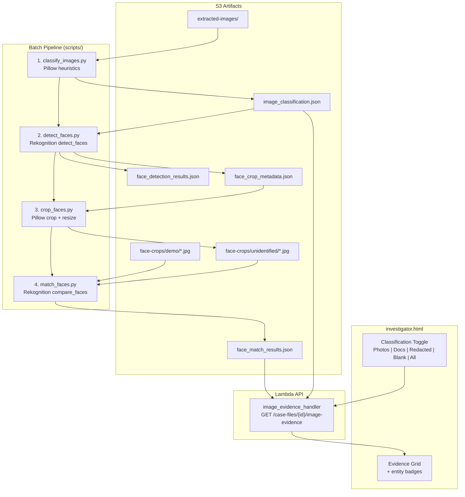

# Design Document: Smart Image Triage & Face Pipeline

## Overview

This feature adds a four-stage batch pipeline that transforms the Evidence Library from a wall of 15,291 undifferentiated extracted images into a focused, face-linked investigative tool. The pipeline stages are:

1. **Image Classification** — A Pillow-based script (`scripts/classify_images.py`) computes entropy, color variance, and edge density for each extracted image and assigns one of four categories: `photograph`, `document_page`, `redacted_text`, or `blank`. Results are saved as `image_classification.json` in S3.
2. **Face Detection** — A script (`scripts/detect_faces.py`) loads the classification artifact, selects only photographs, calls Rekognition `detect_faces` on each, and produces `face_detection_results.json` and `face_crop_metadata.json`.
3. **Face Cropping** — The existing `scripts/crop_faces.py` consumes `face_crop_metadata.json`, crops face regions with 30% padding, resizes to 200×200 JPEG, and uploads to `cases/{case_id}/face-crops/unidentified/`.
4. **Face Matching** — The existing `scripts/match_faces.py` compares unidentified crops against known entity demo photos via Rekognition `compare_faces` and produces `face_match_results.json`.

On the backend, the existing `image_evidence_handler` in `case_files.py` is extended to load `image_classification.json`, default-filter to photographs, and include classification counts in the response. On the frontend, the Evidence Library gains a classification toggle (Photos Only / Documents / Redacted / Blank / All) and entity name badges on image cards.

The net effect: investigators see ~200–400 actual photographs by default instead of 15,291 pages, with identified persons linked directly on each card.

## Architecture



### Pipeline Artifact Flow

Each script reads the output of the previous stage from S3. All artifacts live under `cases/{case_id}/rekognition-artifacts/`. Scripts are idempotent — they can be re-run safely, and each supports `--dry-run` and `--case-id` arguments. If a stage fails, subsequent stages can still run using previously generated artifacts.

### Backend Changes

The `image_evidence_handler` in `src/lambdas/api/case_files.py` gains:
- Loading of `image_classification.json` from S3
- A new `classification` query parameter (default: `photograph`)
- Classification-based filtering of image records
- Classification summary counts in the response `summary` object
- Merging of entity names from `face_match_results.json` into image records

### Frontend Changes

The Evidence Library tab in `src/frontend/investigator.html` gains:
- A classification filter bar with buttons: Photos Only (default), Documents, Redacted, Blank, All
- Badge counts on each filter button from the classification summary
- Entity name badges on image cards where face matches exist
- Entity details in the Evidence Detail Modal's graph connection panel

## Components and Interfaces

### 1. Image Classifier Script (`scripts/classify_images.py`)

**CLI Arguments:**
- `--case-id` (default: `7f05e8d5-4492-4f19-8894-25367606db96`)
- `--target-case` (optional, copies artifact to this case too)
- `--limit` (int, 0 = all)
- `--dry-run` (flag)

**Classification Logic (priority order):**
1. `entropy < 2.0` → `blank`
2. `entropy < 4.0 AND color_variance < 20` → `redacted_text`
3. `color_variance < 30 AND edge_density > 0.3` → `document_page`
4. Otherwise → `photograph`

**Metric Computation:**
- `entropy`: `Image.convert('L').entropy()` (Pillow grayscale entropy)
- `color_variance`: `np.array(Image.convert('L')).std()` (std dev of grayscale pixel values)
- `edge_density`: Apply `ImageFilter.FIND_EDGES`, count pixels above threshold / total pixels

**Output:** `cases/{case_id}/rekognition-artifacts/image_classification.json`
```json
{
  "case_id": "...",
  "classifications": [
    {
      "s3_key": "cases/.../extracted-images/file.jpg",
      "classification": "photograph",
      "metrics": { "entropy": 6.2, "color_variance": 45.3, "edge_density": 0.12 }
    }
  ],
  "summary": {
    "total": 15291,
    "photograph": 312,
    "document_page": 12450,
    "redacted_text": 1890,
    "blank": 639,
    "errors": 0
  }
}
```

**Resume Support:** Maintains a local progress file (`scripts/classify_images_progress.json`) with the last processed index. On restart, skips already-processed images.

### 2. Face Detection Script (`scripts/detect_faces.py`)

**CLI Arguments:**
- `--case-id` (default: main case)
- `--threshold` (float, default 80, minimum Rekognition confidence)
- `--limit` (int, 0 = all)
- `--dry-run` (flag)

**Process:**
1. Load `image_classification.json` from S3
2. Filter to `classification == "photograph"` entries
3. For each photograph, call `rekognition.detect_faces(Attributes=['ALL'])`
4. Rate-limit with 100ms delay between calls
5. Save results to two artifacts:

**Output 1:** `face_detection_results.json`
```json
[
  {
    "s3_key": "cases/.../extracted-images/photo.jpg",
    "faces": [
      {
        "bounding_box": { "Left": 0.3, "Top": 0.2, "Width": 0.15, "Height": 0.2 },
        "confidence": 99.1,
        "gender": { "Value": "Male", "Confidence": 95.0 },
        "age_range": { "Low": 40, "High": 55 }
      }
    ]
  }
]
```

**Output 2:** `face_crop_metadata.json` (format compatible with existing `crop_faces.py`)
```json
[
  {
    "source_s3_key": "cases/.../extracted-images/photo.jpg",
    "crop_s3_key": "cases/.../face-crops/unidentified/abc123.jpg",
    "bounding_box": { "Left": 0.3, "Top": 0.2, "Width": 0.15, "Height": 0.2 },
    "confidence": 99.1,
    "gender": "Male",
    "age_range": "40-55",
    "source_document_id": "EFTA01234567"
  }
]
```

### 3. Face Cropper (`scripts/crop_faces.py` — existing, no changes needed)

Already consumes `face_crop_metadata.json` and produces 200×200 JPEG crops at `face-crops/unidentified/`. Supports `--target-case` for copying to the combined case.

### 4. Face Matcher (`scripts/match_faces.py` — existing, no changes needed)

Already compares unidentified crops against `face-crops/demo/` entity photos, produces `face_match_results.json`, supports incremental runs via comparison log.

### 5. Backend: Enhanced `image_evidence_handler`

**New query parameter:** `classification` (string, default `photograph`)
- Valid values: `photograph`, `document_page`, `redacted_text`, `blank`, `all`
- When `all`, no classification filtering is applied

**Response changes:**
- Each image record gains a `classification` field
- `summary` gains `classification_counts`: `{ "photograph": N, "document_page": N, "redacted_text": N, "blank": N }`
- Each image record gains `matched_entities`: list of `{ "entity_name": str, "similarity": float }` from face match results

**Backward compatibility:** When `image_classification.json` does not exist, the handler returns all images without classification filtering (existing behavior).

### 6. Frontend: Classification Toggle UI

**Filter bar HTML** (inserted above the existing label filter):
```
[📷 Photos Only (312)] [📄 Documents (12,450)] [🔒 Redacted (1,890)] [⬜ Blank (639)] [All (15,291)]
```

- Default active: "Photos Only"
- Clicking a button sets `evidenceClassificationFilter` and re-fetches with `?classification=<value>`
- Counts populated from `summary.classification_counts`
- Styled with existing `.ev-filter-btn` pattern

**Entity badges on image cards:**
- When `matched_entities` is non-empty, render entity name badges below the label badges
- Badge style: green background matching `.tag-person` pattern
- In the detail modal, the Graph Connection Panel lists each matched entity with crop thumbnail and similarity score

## Data Models

### Classification Artifact (`image_classification.json`)
```python
@dataclass
class ImageClassification:
    s3_key: str                    # S3 key of the extracted image
    classification: str            # "photograph" | "document_page" | "redacted_text" | "blank"
    metrics: dict                  # {"entropy": float, "color_variance": float, "edge_density": float}

@dataclass
class ClassificationArtifact:
    case_id: str
    classifications: list[ImageClassification]
    summary: dict                  # {"total": int, "photograph": int, "document_page": int, ...}
```

### Face Detection Result (`face_detection_results.json`)
```python
@dataclass
class DetectedFace:
    bounding_box: dict             # {"Left": float, "Top": float, "Width": float, "Height": float}
    confidence: float
    gender: dict                   # {"Value": str, "Confidence": float}
    age_range: dict                # {"Low": int, "High": int}

@dataclass
class ImageFaceDetection:
    s3_key: str
    faces: list[DetectedFace]
```

### Face Crop Metadata (`face_crop_metadata.json`)
```python
@dataclass
class FaceCropEntry:
    source_s3_key: str
    crop_s3_key: str
    bounding_box: dict
    confidence: float
    gender: str
    age_range: str
    source_document_id: str
```

### Enhanced Image Evidence Response
```python
class ImageEvidenceItem:
    s3_key: str
    filename: str
    source_document_id: str
    labels: list[dict]
    faces: list[dict]
    face_count: int
    classification: str            # NEW: "photograph" | "document_page" | etc.
    matched_entities: list[dict]   # NEW: [{"entity_name": str, "similarity": float}]
    presigned_url: str

class ImageEvidenceResponse:
    images: list[ImageEvidenceItem]
    total: int
    page: int
    page_size: int
    total_pages: int
    summary: dict                  # Gains "classification_counts" sub-object
```


## Correctness Properties

*A property is a characteristic or behavior that should hold true across all valid executions of a system — essentially, a formal statement about what the system should do. Properties serve as the bridge between human-readable specifications and machine-verifiable correctness guarantees.*

### Property 1: Classification function assigns correct category by priority rules

*For any* metric tuple `(entropy, color_variance, edge_density)` where entropy ≥ 0, color_variance ≥ 0, and 0 ≤ edge_density ≤ 1, the `classify_image` function should return:
- `"blank"` when entropy < 2.0
- `"redacted_text"` when entropy < 4.0 AND color_variance < 20 (and entropy ≥ 2.0)
- `"document_page"` when color_variance < 30 AND edge_density > 0.3 (and not matching prior rules)
- `"photograph"` otherwise

Priority must be enforced: if metrics match both "blank" and "redacted_text" rules, "blank" wins.

**Validates: Requirements 1.3, 1.4, 1.5, 1.6, 1.7, 8.1, 8.2, 8.3, 8.4**

### Property 2: Metric computation produces correct values

*For any* valid image (as a Pillow Image object), the computed entropy should equal `Image.convert('L').entropy()`, the computed color_variance should equal `np.std(np.array(Image.convert('L')))`, and the computed edge_density should be a float between 0.0 and 1.0 representing the ratio of edge pixels to total pixels.

**Validates: Requirements 1.2, 8.5, 8.6, 8.7**

### Property 3: Classification artifact summary counts are consistent

*For any* list of image classifications (each with a valid category), the artifact summary's category counts should sum to the total number of images, and each category count should equal the number of images assigned that category.

**Validates: Requirements 1.8, 1.9**

### Property 4: Backend classification filtering returns only matching images

*For any* list of classified image records and *for any* valid classification filter value (`"photograph"`, `"document_page"`, `"redacted_text"`, `"blank"`, or `"all"`), the filtered result should contain only images whose classification matches the filter. When the filter is `"all"`, all images should be returned. Each returned image record should include a `classification` field, and the response summary should contain `classification_counts` matching the actual distribution.

**Validates: Requirements 2.1, 2.3, 2.4, 2.5, 2.6**

### Property 5: Frontend classification filter constructs correct API URL

*For any* classification filter selection from the set `{"photograph", "document_page", "redacted_text", "blank", "all"}`, the constructed API URL should include `classification={value}` as a query parameter. The filter button for each category should display the count from `summary.classification_counts`.

**Validates: Requirements 3.2, 3.3, 3.4, 3.5**

### Property 6: Face detection selects only photograph-classified images

*For any* classification artifact containing a mix of categories, the face detection pipeline's image selection should include only entries where `classification == "photograph"` and exclude all others.

**Validates: Requirements 4.1**

### Property 7: Face crop metadata format is compatible with crop_faces.py

*For any* face detection result, the generated `face_crop_metadata.json` entries should each contain `source_s3_key` (string), `crop_s3_key` (string), `bounding_box` (dict with `Left`, `Top`, `Width`, `Height` as floats between 0 and 1), `confidence` (float), `gender` (string), `age_range` (string), and `source_document_id` (string).

**Validates: Requirements 4.3, 4.4**

### Property 8: Face crop output is 200×200 JPEG with correct padding

*For any* source image (≥ 20×20 pixels) and *for any* valid bounding box (Left, Top, Width, Height all in [0,1] with Left+Width ≤ 1 and Top+Height ≤ 1), the `crop_face` function should produce a 200×200 JPEG image. The crop region should extend 30% padding beyond the bounding box in each direction, clamped to image boundaries.

**Validates: Requirements 5.1**

### Property 9: Face matcher selects highest similarity match above threshold

*For any* set of comparison results (crop vs. multiple entities, each with a similarity score) and *for any* threshold value, the selected match should be the entity with the highest similarity score that is ≥ the threshold. If no entity meets the threshold, the crop should be classified as unmatched.

**Validates: Requirements 6.2**

### Property 10: Incremental matching skips completed comparisons

*For any* set of previously completed comparisons (crop, entity pairs) and *for any* new set of crops and entities, the matcher should only process pairs not in the completed set. The total comparisons after the run should equal the union of old and new completed pairs.

**Validates: Requirements 6.5**

### Property 11: Entity names are correctly merged into image records

*For any* list of image records with face data and *for any* face match results mapping crop filenames to entity names, the merged image records should contain `matched_entities` lists where each matched face's entity name and similarity score are included. Images with no matched faces should have an empty `matched_entities` list.

**Validates: Requirements 7.1**

### Property 12: Detail modal displays entities sorted by confidence with unidentified faces

*For any* image with N faces (some matched, some unidentified), the detail modal's entity list should contain all N faces, matched entities should display their entity name and similarity score sorted by confidence descending, and unmatched faces should display as "Unidentified" with their crop thumbnail.

**Validates: Requirements 7.2, 7.3, 7.4, 7.5**

## Error Handling

| Scenario | Handling |
|---|---|
| Image download fails during classification | Log warning, increment error counter, continue to next image |
| Pillow cannot open an image (corrupt file) | Log warning, increment error counter, skip image |
| Classification artifact missing in backend | Return all images unfiltered (backward compatibility) |
| Invalid `classification` query parameter | Ignore invalid value, default to `photograph` |
| Rekognition `detect_faces` fails for one image | Log error, increment error counter, continue processing |
| Rekognition `detect_faces` throttled | 100ms delay between calls; on throttle error, retry with backoff |
| Face crop region smaller than 20×20 pixels | Skip face, log warning, continue |
| Source image download fails during cropping | Skip face, log warning, continue |
| Rekognition `compare_faces` InvalidParameterException | Skip comparison, continue to next pair |
| Rekognition `compare_faces` throttled | 100ms delay between calls; on throttle error, retry with backoff |
| Face match results JSON missing in backend | Return images without entity data (existing behavior) |
| Classification artifact JSON malformed | Log error, fall back to unfiltered mode |
| Pipeline script interrupted mid-run | Resume from progress file on next run |
| S3 put_object fails for artifact upload | Raise error, script exits with non-zero code |

## Testing Strategy

### Unit Tests

**Classification logic (`scripts/classify_images.py`):**
- Test `classify_image_metrics(entropy=1.5, cv=10, ed=0.1)` returns `"blank"`
- Test `classify_image_metrics(entropy=3.0, cv=15, ed=0.1)` returns `"redacted_text"`
- Test `classify_image_metrics(entropy=5.0, cv=25, ed=0.4)` returns `"document_page"`
- Test `classify_image_metrics(entropy=6.0, cv=50, ed=0.1)` returns `"photograph"`
- Test edge case: entropy exactly 2.0 should NOT be blank (boundary)
- Test edge case: entropy exactly 4.0 should NOT be redacted_text
- Test summary counts with known classification list

**Face detection filtering:**
- Test that `select_photographs(artifact)` with mixed categories returns only photographs
- Test with empty artifact returns empty list
- Test with all-photograph artifact returns all

**Face crop function (`crop_face`):**
- Test crop with valid bounding box produces 200×200 output
- Test crop with bounding box near image edge (padding clamped)
- Test crop with region < 20×20 returns empty bytes

**Backend handler (`image_evidence_handler`):**
- Test with `classification=photograph` returns only photos
- Test with `classification=all` returns everything
- Test with no classification artifact returns all images (backward compat)
- Test response includes `classification_counts` in summary
- Test entity merge from face_match_results.json

**Frontend URL construction:**
- Test each filter button constructs correct `?classification=` parameter

### Property-Based Tests

Use **Hypothesis** (Python) for backend and script property tests. Use **fast-check** (JavaScript) for frontend property tests. Each property test runs minimum 100 iterations. Each test is tagged with a comment referencing the design property.

**Hypothesis tests:**

- **Feature: smart-image-triage-face-pipeline, Property 1: Classification function assigns correct category by priority rules** — Generate random `(entropy, color_variance, edge_density)` tuples with `entropy ∈ [0, 10]`, `color_variance ∈ [0, 100]`, `edge_density ∈ [0, 1]` and verify the classification function output matches the expected priority rules.

- **Feature: smart-image-triage-face-pipeline, Property 3: Classification artifact summary counts are consistent** — Generate random lists of `(s3_key, classification)` pairs and verify `sum(summary_counts.values()) == len(classifications)` and each count matches the actual category frequency.

- **Feature: smart-image-triage-face-pipeline, Property 4: Backend classification filtering returns only matching images** — Generate random lists of classified image dicts and a random filter value, apply the filtering logic, and verify all returned images match the filter (or all are returned for "all").

- **Feature: smart-image-triage-face-pipeline, Property 6: Face detection selects only photograph-classified images** — Generate random classification artifacts with mixed categories and verify the selection function returns only photographs.

- **Feature: smart-image-triage-face-pipeline, Property 8: Face crop output is 200×200 JPEG** — Generate random Pillow images (varying sizes ≥ 20×20) and random valid bounding boxes, call `crop_face`, and verify the output is 200×200 JPEG bytes.

- **Feature: smart-image-triage-face-pipeline, Property 9: Face matcher selects highest similarity match above threshold** — Generate random lists of `(entity_name, similarity_score)` pairs and a random threshold, apply the selection logic, and verify the result is the highest-scoring entity above threshold (or None).

- **Feature: smart-image-triage-face-pipeline, Property 10: Incremental matching skips completed comparisons** — Generate random sets of completed `(crop, entity)` pairs and new `(crop, entity)` pairs, compute the pairs to process, and verify it equals `new_pairs - completed_pairs`.

- **Feature: smart-image-triage-face-pipeline, Property 11: Entity names are correctly merged into image records** — Generate random image records with face data and random match results, apply the merge logic, and verify each image's `matched_entities` list is correct.

**fast-check tests:**

- **Feature: smart-image-triage-face-pipeline, Property 5: Frontend classification filter constructs correct API URL** — Generate random classification filter values from the valid set and verify the constructed URL contains `classification={value}`.

- **Feature: smart-image-triage-face-pipeline, Property 12: Detail modal displays entities sorted by confidence** — Generate random lists of matched and unmatched faces, apply the rendering logic, and verify the output is sorted by confidence descending with unidentified faces labeled correctly.
