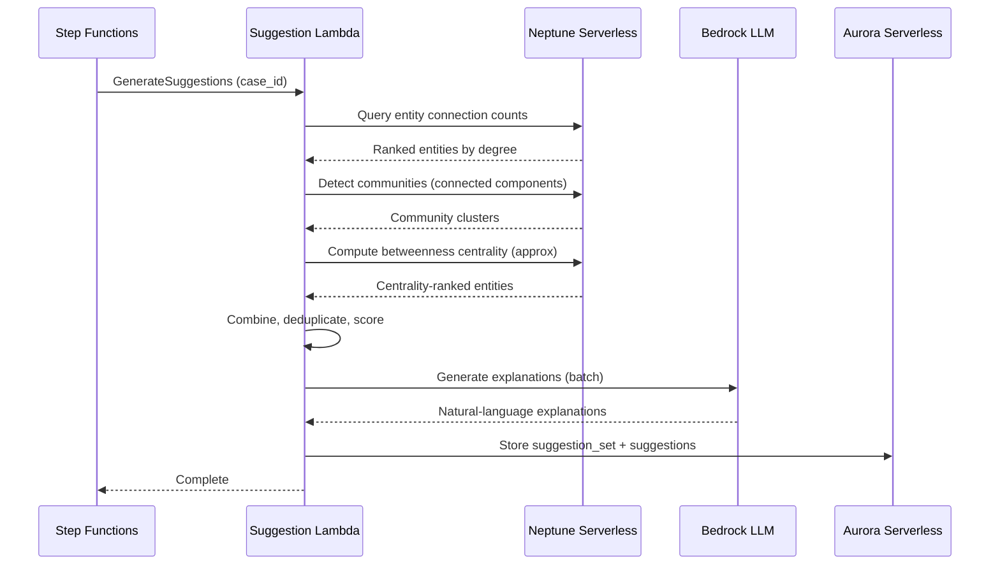
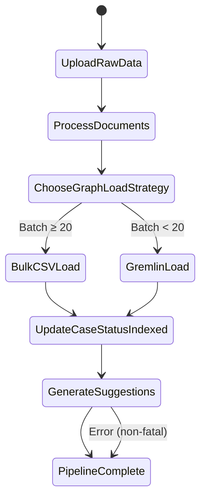
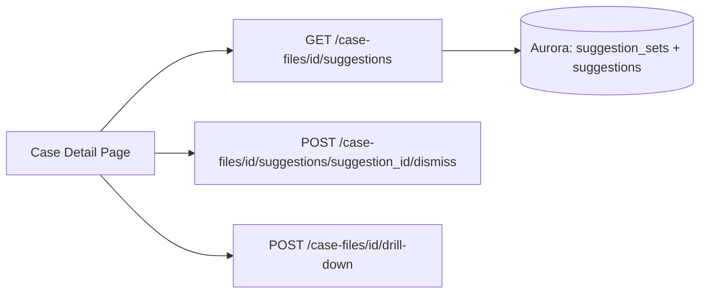

# Design Document: Suggested Investigations

## Overview

The Suggested Investigations feature adds automatic research lead generation to the Research Analyst Platform. After a case file's ingestion pipeline completes and the status transitions to "indexed", the system automatically analyzes the Neptune knowledge graph using three complementary signals — Entity Connection Count, Community Detection, and Betweenness Centrality — to identify the most promising areas of investigation. Results are combined into a ranked list of suggestions, each enriched with a Bedrock-generated natural-language explanation, and displayed on the Case Detail page.

The feature integrates with the existing ingestion pipeline (Step Functions), reuses graph traversal logic from `PatternDiscoveryService`, leverages the existing drill-down mechanism in `CaseFileService` for one-click sub-case creation, and stores suggestion data in new Aurora tables alongside the existing schema.

### Key Design Decisions

1. **Reuse PatternDiscoveryService graph traversal** — The existing service already implements degree centrality, community detection (connected components), and shortest-path traversal. The new `SuggestionService` extends these patterns for the three required signals rather than reimplementing graph algorithms.
2. **Post-ingestion trigger via Step Functions** — A new `GenerateSuggestions` step is appended to the ingestion pipeline ASL after `UpdateCaseStatusIndexed`, keeping the trigger mechanism within the existing orchestration rather than adding event-based coupling.
3. **Aurora-cached suggestion sets** — Suggestion sets are stored in Aurora with a generation timestamp. The frontend reads from cache on page load and never triggers recomputation directly. Regeneration only happens when new ingestion completes.
4. **Dismissal by entity fingerprint** — Dismissed suggestions are tracked by a hash of the involved entity names, so that regenerated suggestion sets after new ingestion still respect prior dismissals.
5. **Bedrock fallback** — If Bedrock fails to generate an explanation, a structured fallback string is used containing entity names, signal source, and score, ensuring the UI always has displayable content.
6. **Configurable top-N** — The number of displayed suggestions defaults to 10 but is stored per suggestion set, allowing future per-case configuration.

## Architecture

### Suggestion Generation Flow



### Updated Ingestion Pipeline (additions in bold)



### Frontend Integration



## Components and Interfaces

### 1. SuggestionService (New Service)

Orchestrates the three graph signals, combines scores, calls Bedrock for explanations, and persists results. Reuses Neptune traversal patterns from `PatternDiscoveryService`.

```python
# src/services/suggestion_service.py

from dataclasses import dataclass
from enum import Enum
from typing import Any, Optional, Protocol

from db.connection import ConnectionManager
from db.neptune import NeptuneConnectionManager


class SignalSource(Enum):
    ENTITY_CONNECTION_COUNT = "entity_connection_count"
    COMMUNITY_DETECTION = "community_detection"
    BETWEENNESS_CENTRALITY = "betweenness_centrality"


class BedrockClient(Protocol):
    def invoke_model(self, **kwargs: Any) -> Any: ...


DEFAULT_TOP_N = 10

# Weights for composite score (sum to 1.0)
WEIGHT_CONNECTION = 0.35
WEIGHT_COMMUNITY = 0.30
WEIGHT_CENTRALITY = 0.35


class SuggestionService:
    """Generates, stores, and manages investigation suggestions for case files."""

    def __init__(
        self,
        neptune_conn: NeptuneConnectionManager,
        aurora_conn: ConnectionManager,
        bedrock_client: Any,
    ) -> None:
        self._neptune = neptune_conn
        self._aurora = aurora_conn
        self._bedrock = bedrock_client

    def generate_suggestions(self, case_id: str, top_n: int = DEFAULT_TOP_N) -> dict:
        """Run all three signals, combine, generate explanations, store, and return suggestion set."""
        ...

    def get_suggestion_set(self, case_id: str) -> Optional[dict]:
        """Retrieve cached suggestion set for a case file. Returns None if not generated."""
        ...

    def dismiss_suggestion(self, case_id: str, suggestion_id: str) -> None:
        """Mark a suggestion as dismissed."""
        ...

    def get_visible_suggestions(self, case_id: str) -> list[dict]:
        """Return non-dismissed suggestions for display."""
        ...

    # --- Signal methods (reuse PatternDiscoveryService patterns) ---

    def _compute_connection_counts(self, case_id: str) -> list[dict]:
        """Query Neptune for entity nodes ranked by total edge count."""
        ...

    def _detect_communities(self, case_id: str) -> list[dict]:
        """Traverse case subgraph to find connected components, rank by size and density."""
        ...

    def _compute_betweenness_centrality(self, case_id: str) -> list[dict]:
        """Approximate betweenness centrality via sampled shortest paths."""
        ...

    def _combine_and_score(
        self,
        connection_results: list[dict],
        community_results: list[dict],
        centrality_results: list[dict],
    ) -> list[dict]:
        """Deduplicate across signals and compute composite score."""
        ...

    def _generate_explanation(self, suggestion: dict) -> str:
        """Call Bedrock to generate a natural-language explanation for a suggestion."""
        ...

    def _fallback_explanation(self, suggestion: dict) -> str:
        """Structured fallback when Bedrock fails."""
        ...

    def _entity_fingerprint(self, entity_names: list[str]) -> str:
        """Deterministic hash of sorted entity names for dismissal matching."""
        ...
```

### 2. Suggestion Lambda (New Lambda)

A new Lambda function invoked by Step Functions after `UpdateCaseStatusIndexed`. Instantiates `SuggestionService` and calls `generate_suggestions`.

```python
# src/lambdas/ingestion/generate_suggestions_handler.py

def handler(event, context):
    """Step Functions task: generate suggestions for a case file.

    Input: {"case_id": "..."}
    Output: {"suggestion_set_id": "...", "suggestion_count": N}
    """
    ...
```

### 3. Suggestions API Lambda (New Lambda)

Handles HTTP endpoints for fetching and managing suggestions.

```python
# src/lambdas/api/suggestions.py

def suggestions_handler(event, context):
    """API Gateway handler for suggestion endpoints.

    GET  /case-files/{id}/suggestions          → get visible suggestions
    POST /case-files/{id}/suggestions/{sid}/dismiss → dismiss a suggestion
    """
    ...
```

### 4. Frontend Changes (case_detail.py)

The existing `case_detail.py` page is extended with a "Suggested Investigations" section below the case metadata. It calls the suggestions API endpoint and renders each suggestion with rank, title, signal badge, score, explanation, and action buttons (Create Sub-Case, Dismiss).

### 5. Integration with Existing Services

- **CaseFileService.create_sub_case_file()** — Called when the analyst clicks "Create Sub-Case" on a suggestion. The suggestion's entity names are passed as `entity_names`, and the suggestion title/explanation pre-populate `topic_name`/`description`.
- **PatternDiscoveryService** — The `SuggestionService` reuses the same Neptune traversal patterns (degree centrality, connected components) but with different scoring and output format.
- **Ingestion Pipeline (Step Functions)** — The ASL definition is updated to add a `GenerateSuggestions` state after `UpdateCaseStatusIndexed`.

### API Interface (New Endpoints)

| Endpoint | Method | Description |
|---|---|---|
| `/case-files/{id}/suggestions` | GET | Get visible (non-dismissed) suggestions for a case file |
| `/case-files/{id}/suggestions/{sid}/dismiss` | POST | Dismiss a suggestion |

## Data Models

### New Aurora Tables

```sql
-- Suggestion sets: one per case file, regenerated on each ingestion
CREATE TABLE suggestion_sets (
    suggestion_set_id UUID PRIMARY KEY DEFAULT gen_random_uuid(),
    case_file_id UUID NOT NULL REFERENCES case_files(case_id) ON DELETE CASCADE,
    top_n INT NOT NULL DEFAULT 10,
    generated_at TIMESTAMP WITH TIME ZONE DEFAULT NOW(),
    message TEXT,  -- e.g. "insufficient data" for empty sets
    UNIQUE (case_file_id)  -- only one active set per case
);

-- Individual suggestions within a set
CREATE TABLE suggestions (
    suggestion_id UUID PRIMARY KEY DEFAULT gen_random_uuid(),
    suggestion_set_id UUID NOT NULL REFERENCES suggestion_sets(suggestion_set_id) ON DELETE CASCADE,
    rank INT NOT NULL,
    title VARCHAR(512) NOT NULL,
    signal_source VARCHAR(50) NOT NULL
        CHECK (signal_source IN ('entity_connection_count', 'community_detection', 'betweenness_centrality')),
    composite_score FLOAT NOT NULL CHECK (composite_score >= 0.0 AND composite_score <= 1.0),
    explanation TEXT NOT NULL,
    entity_names JSONB NOT NULL DEFAULT '[]',  -- list of involved entity canonical names
    entity_fingerprint VARCHAR(64) NOT NULL,   -- SHA-256 of sorted entity names for dismissal matching
    dismissed BOOLEAN NOT NULL DEFAULT FALSE,
    dismissed_at TIMESTAMP WITH TIME ZONE,
    created_at TIMESTAMP WITH TIME ZONE DEFAULT NOW()
);

-- Indexes
CREATE INDEX idx_suggestion_sets_case ON suggestion_sets(case_file_id);
CREATE INDEX idx_suggestions_set ON suggestions(suggestion_set_id);
CREATE INDEX idx_suggestions_fingerprint ON suggestions(entity_fingerprint);
CREATE INDEX idx_suggestions_dismissed ON suggestions(suggestion_set_id, dismissed);
```

### Pydantic Models

```python
# src/models/suggestion.py

from datetime import datetime
from typing import Optional
from pydantic import BaseModel, Field


class Suggestion(BaseModel):
    """A single investigation suggestion."""
    suggestion_id: str
    rank: int = Field(ge=1)
    title: str
    signal_source: str  # entity_connection_count | community_detection | betweenness_centrality
    composite_score: float = Field(ge=0.0, le=1.0)
    explanation: str
    entity_names: list[str] = Field(default_factory=list)
    entity_fingerprint: str
    dismissed: bool = False
    dismissed_at: Optional[datetime] = None
    created_at: Optional[datetime] = None


class SuggestionSet(BaseModel):
    """A cached set of suggestions for a case file."""
    suggestion_set_id: str
    case_file_id: str
    top_n: int = Field(default=10, ge=1)
    generated_at: Optional[datetime] = None
    message: Optional[str] = None  # e.g. "insufficient data"
    suggestions: list[Suggestion] = Field(default_factory=list)
```

### Step Functions ASL Update

The `UpdateCaseStatusIndexed` state's `Next` field changes from `PipelineComplete` to `GenerateSuggestions`. A new state is added:

```json
{
  "GenerateSuggestions": {
    "Type": "Task",
    "Resource": "${GenerateSuggestionsLambdaArn}",
    "Parameters": {
      "case_id.$": "$.case_id"
    },
    "ResultPath": "$.suggestion_result",
    "Retry": [
      {
        "ErrorEquals": ["States.TaskFailed", "Lambda.ServiceException"],
        "IntervalSeconds": 3,
        "MaxAttempts": 2,
        "BackoffRate": 2.0
      }
    ],
    "Catch": [
      {
        "ErrorEquals": ["States.ALL"],
        "ResultPath": "$.suggestion_error",
        "Next": "PipelineComplete"
      }
    ],
    "Next": "PipelineComplete"
  }
}
```

The `Catch` routes to `PipelineComplete` (not `SetStatusError`) because suggestion generation failure is non-fatal — the case file is already indexed successfully.


## Correctness Properties

*A property is a characteristic or behavior that should hold true across all valid executions of a system — essentially, a formal statement about what the system should do. Properties serve as the bridge between human-readable specifications and machine-verifiable correctness guarantees.*

### Property 1: Signal result ordering

*For any* case file subgraph with at least two entity nodes, the results from each individual signal analysis (Entity Connection Count, Community Detection, Betweenness Centrality) should be sorted in descending order by their respective score — edge count for connection count, member count × density for community detection, and centrality score for betweenness centrality.

**Validates: Requirements 1.3, 1.4, 1.5**

### Property 2: Combined suggestion list is deduplicated and ordered by composite score

*For any* set of results from the three signal analyses, the combined suggestion list should contain no two suggestions with the same entity fingerprint, and should be sorted in descending order by composite score.

**Validates: Requirements 1.6**

### Property 3: Bedrock prompt contains all required context for the signal source

*For any* suggestion, the explanation prompt sent to Bedrock should contain the involved entity names, entity types, signal source label, and composite score. Additionally, for community detection suggestions the prompt should include community member names and internal relationship count, and for betweenness centrality suggestions the prompt should include the names of the topic groups the bridging entity connects.

**Validates: Requirements 2.2, 2.3, 2.4**

### Property 4: Fallback explanation contains required fields

*For any* suggestion where Bedrock fails to generate an explanation (raises an exception), the resulting explanation string should contain the entity names, the signal source, and the composite score.

**Validates: Requirements 2.5**

### Property 5: Visible suggestions respect top-N limit

*For any* suggestion set with a configured top_n value, the number of visible (non-dismissed) suggestions returned by `get_visible_suggestions` should be at most top_n.

**Validates: Requirements 3.3**

### Property 6: Sub-case creation from suggestion passes correct data

*For any* suggestion, creating a sub-case from it should produce a Sub_Case_File whose topic_name equals the suggestion title, whose description equals the suggestion explanation, and whose seed entities match the suggestion's entity_names list.

**Validates: Requirements 4.2, 4.3**

### Property 7: Suggestion set storage round trip

*For any* generated suggestion set, storing it in Aurora and then retrieving it by case_file_id should produce an equivalent suggestion set — same suggestion_set_id, case_file_id, top_n, non-null generated_at timestamp, and the same list of suggestions with all fields preserved.

**Validates: Requirements 5.1, 5.4**

### Property 8: At most one suggestion set per case file

*For any* case file, after calling generate_suggestions (even multiple times), there should be exactly one suggestion_set record in Aurora for that case_file_id.

**Validates: Requirements 5.3**

### Property 9: Dismissed suggestions are excluded from visible list

*For any* suggestion set, after dismissing one or more suggestions, `get_visible_suggestions` should return only suggestions where `dismissed` is false. The dismissed suggestions should still exist in Aurora with `dismissed = true`.

**Validates: Requirements 6.2, 6.3**

### Property 10: Dismissals persist across suggestion set regeneration

*For any* suggestion that was dismissed, if the suggestion set is regenerated and a new suggestion has the same entity fingerprint as the dismissed one, the new suggestion should be automatically marked as dismissed.

**Validates: Requirements 6.4**

## Error Handling

| Scenario | Behavior |
|---|---|
| Subgraph has < 2 entities | Return empty suggestion set with message "Insufficient data for suggestion generation — fewer than 2 entities in the case subgraph" |
| Bedrock invocation fails for a single suggestion | Use fallback explanation; continue generating remaining suggestions |
| Bedrock invocation fails for all suggestions | All suggestions get fallback explanations; suggestion set is still stored and displayed |
| Neptune query timeout during signal analysis | Lambda retries (Step Functions retry config: 2 attempts, 3s interval, 2x backoff); if all retries fail, Catch routes to PipelineComplete (non-fatal) |
| Aurora write failure when storing suggestion set | Step Functions retry; if persistent, Catch routes to PipelineComplete — case file remains "indexed" without suggestions |
| Dismiss called on non-existent suggestion_id | Return 404 error |
| Dismiss called on already-dismissed suggestion | Idempotent — no error, no state change |
| GET suggestions for case with no suggestion set | Return empty response with `message: "Suggestions not yet generated"` |
| GenerateSuggestions Lambda timeout | Step Functions Catch routes to PipelineComplete; case file status remains "indexed" |

## Testing Strategy

### Unit Tests

Unit tests cover specific examples, edge cases, and error conditions:

- Empty subgraph (0 entities) → empty suggestion set with message
- Single entity subgraph → empty suggestion set with message
- Bedrock failure → fallback explanation contains entity names, signal, score
- Dismiss non-existent suggestion → 404
- Dismiss already-dismissed suggestion → idempotent
- Sub-case creation from suggestion → correct topic_name, description, entity_names passed to CaseFileService
- API handler routing (GET suggestions, POST dismiss)

### Property-Based Tests

Property-based tests verify universal properties across randomly generated inputs. Each test runs a minimum of 100 iterations using the `hypothesis` library (Python).

Each property test references its design document property with a tag comment:

- **Feature: suggested-investigations, Property 1: Signal result ordering** — Generate random graphs (nodes + edges), run each signal analysis, verify descending order by score.
- **Feature: suggested-investigations, Property 2: Combined suggestion list is deduplicated and ordered by composite score** — Generate random signal results from all three sources, run combine_and_score, verify no duplicate fingerprints and descending composite score order.
- **Feature: suggested-investigations, Property 3: Bedrock prompt contains all required context for the signal source** — Generate random suggestions with varying signal sources, capture the prompt string, verify it contains all required fields for that signal type.
- **Feature: suggested-investigations, Property 4: Fallback explanation contains required fields** — Generate random suggestions, simulate Bedrock failure, verify fallback string contains entity names, signal source, and score.
- **Feature: suggested-investigations, Property 5: Visible suggestions respect top-N limit** — Generate random suggestion sets with varying top_n and dismissal states, verify visible count ≤ top_n.
- **Feature: suggested-investigations, Property 6: Sub-case creation from suggestion passes correct data** — Generate random suggestions, call the sub-case creation path, verify topic_name, description, and entity_names match.
- **Feature: suggested-investigations, Property 7: Suggestion set storage round trip** — Generate random suggestion sets, store in Aurora (mocked), retrieve, verify equivalence.
- **Feature: suggested-investigations, Property 8: At most one suggestion set per case file** — Generate random case IDs, call generate_suggestions multiple times, verify exactly one set per case.
- **Feature: suggested-investigations, Property 9: Dismissed suggestions are excluded from visible list** — Generate random suggestion sets, dismiss random subsets, verify visible list excludes dismissed.
- **Feature: suggested-investigations, Property 10: Dismissals persist across suggestion set regeneration** — Generate random suggestion sets, dismiss some, regenerate with overlapping entity fingerprints, verify auto-dismissal.

### Test Configuration

- Library: `hypothesis` (Python property-based testing)
- Minimum iterations: 100 per property (`@settings(max_examples=100)`)
- Each property test tagged with: `# Feature: suggested-investigations, Property N: <title>`
- Neptune and Aurora dependencies mocked in unit/property tests
- Bedrock client mocked with configurable success/failure behavior
