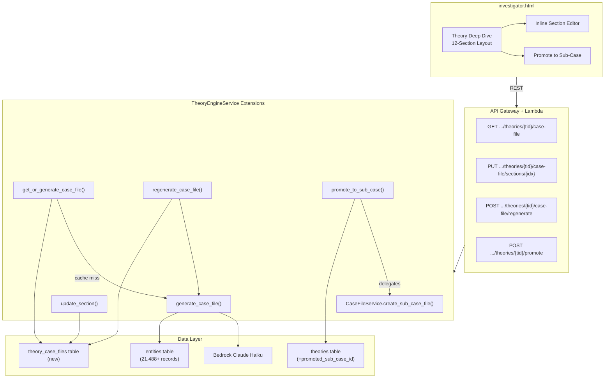
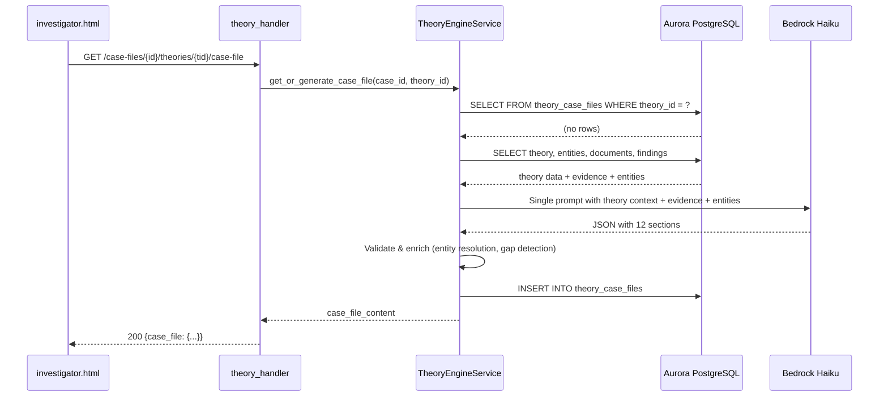

# Design Document: Theory Case File

## Overview

This feature replaces the raw OCR fragments in the Theory Deep Dive panel with a professional, AI-generated 12-section investigative case file. When an investigator first views a theory in detail, Bedrock Claude Haiku generates a structured case file covering all 12 sections — from Theory Statement through Confidence Level — in a single LLM call. The generated content is persisted to Aurora PostgreSQL in a new `theory_case_files` table so subsequent views load instantly without regeneration.

The design extends three existing components:
- **TheoryEngineService** (`src/services/theory_engine_service.py`) — new methods for case file generation, persistence, section editing, regeneration, and theory promotion
- **theory_handler.py** (`src/lambdas/api/theory_handler.py`) — 4 new route entries in the dispatch table
- **investigator.html** (`src/frontend/investigator.html`) — enhanced `openTheoryDeepDive()` to render the 12-section layout

Key design decisions:
- **Single Bedrock call**: All 12 sections generated in one prompt to stay within the 15-second budget (avoids 12 sequential calls)
- **JSONB storage**: The 12-section content is stored as a single JSONB column, enabling atomic section updates via PostgreSQL `jsonb_set()`
- **Entity resolution from Aurora**: Key Entities section queries the existing `entities` table (21,488+ records) instead of regex extraction
- **Graceful degradation**: If Bedrock fails, sections derivable from Aurora data (Theory Statement, Classification, ACH Scorecard, Key Entities) are returned; remaining sections marked as gaps
- **Promote to sub-case**: Confirmed theories can be promoted to independent sub-cases via the existing `CaseFileService.create_sub_case_file()` method

## Architecture



### Request Flow: First View (Cache Miss)



## Components and Interfaces

### TheoryEngineService Extensions

New methods added to the existing `TheoryEngineService` class:

```python
class TheoryEngineService:
    # ... existing methods unchanged ...

    # --- Case File Section Constants ---
    SECTION_NAMES = [
        "theory_statement",      # 0
        "classification",        # 1
        "ach_scorecard",         # 2
        "evidence_for",          # 3
        "evidence_against",      # 4
        "evidence_gaps",         # 5
        "key_entities",          # 6
        "timeline",              # 7
        "competing_theories",    # 8
        "investigator_assessment", # 9
        "recommended_actions",   # 10
        "confidence_level",      # 11
    ]

    SECTION_DISPLAY_NAMES = [
        "Theory Statement", "Classification", "ACH Scorecard",
        "Evidence For", "Evidence Against", "Evidence Gaps",
        "Key Entities", "Timeline", "Competing Theories",
        "Investigator Assessment", "Recommended Actions", "Confidence Level",
    ]

    def get_or_generate_case_file(self, case_id: str, theory_id: str) -> dict:
        """Return persisted case file or generate + persist a new one.

        1. Query theory_case_files for existing content
        2. If found, return it
        3. If not found, call generate_case_file() and persist
        4. Return the case file content with metadata
        """

    def generate_case_file(self, case_id: str, theory_id: str) -> dict:
        """Generate a 12-section case file via single Bedrock call.

        1. Fetch theory record from theories table
        2. Fetch evidence (documents, findings) from Aurora
        3. Resolve entities from entities table
        4. Build structured prompt requesting all 12 sections as JSON
        5. Invoke Bedrock with max_tokens=4096
        6. Parse response, validate 12-section structure
        7. Enrich Key Entities with Aurora entity data
        8. Detect section gaps
        9. Return validated 12-section dict
        
        On Bedrock failure: return partial case file with sections 0-2, 6
        populated from Aurora data, remaining sections marked as gaps.
        """

    def update_section(self, case_id: str, theory_id: str,
                       section_index: int, content: dict) -> dict:
        """Update a single section in the persisted case file.

        1. Validate section_index is 0-11
        2. Use PostgreSQL jsonb_set() to update only the target section
        3. Update last_edited_at and increment version
        4. Return updated case file content
        """

    def regenerate_case_file(self, case_id: str, theory_id: str) -> dict:
        """Regenerate the entire case file, preserving investigator notes.

        1. Fetch existing case file to extract section 9 (Investigator Assessment)
        2. Call generate_case_file() for fresh content
        3. Merge preserved investigator notes into section 9
        4. UPDATE existing theory_case_files record
        5. Increment version, update generated_at
        6. Return new content
        """

    def promote_to_sub_case(self, case_id: str, theory_id: str) -> dict:
        """Promote a confirmed theory to a sub-case.

        1. Fetch theory, verify verdict == 'confirmed'
        2. Verify promoted_sub_case_id is NULL (not already promoted)
        3. Call CaseFileService.create_sub_case_file() with:
           - parent_case_id = case_id
           - topic_name = theory title
           - description = theory description
           - entity_names = theory supporting_entities
        4. UPDATE theories SET promoted_sub_case_id = new sub_case_id
        5. Return {sub_case_id, theory_id}
        """

    # --- Internal helpers ---

    def _ensure_case_file_table(self):
        """Create theory_case_files table if not exists (idempotent)."""

    def _resolve_entities(self, case_id: str, entity_names: list) -> list[dict]:
        """Query entities table for canonical records matching entity_names.

        Uses case-insensitive ILIKE matching.
        Returns list of {canonical_name, entity_type, occurrence_count}.
        Excludes names with no match in the entities table.
        """

    def _build_case_file_prompt(self, theory: dict, evidence: list,
                                 entities: list, competing: list) -> str:
        """Build the single Bedrock prompt for 12-section generation."""

    def _parse_case_file_response(self, response_text: str) -> dict:
        """Parse Bedrock JSON response into validated 12-section structure."""

    def _detect_section_gaps(self, sections: dict) -> dict:
        """Mark sections with insufficient content as gaps.

        Gap conditions:
        - evidence_for: zero citations
        - evidence_against: zero citations
        - timeline: fewer than 2 events
        - key_entities: zero resolved entities
        """

    def _build_fallback_case_file(self, theory: dict, entities: list) -> dict:
        """Build partial case file from Aurora data when Bedrock fails.

        Populates: theory_statement, classification, ach_scorecard, key_entities.
        Marks remaining 8 sections as gaps.
        """
```

### Bedrock Prompt Design

A single structured prompt generates all 12 sections to stay within the 15-second Lambda budget:

```
You are an expert investigative analyst. Generate a structured 12-section case file
for the following theory.

THEORY:
Title: {title}
Description: {description}
Type: {theory_type}
ACH Scores: evidence_consistency={ec}, evidence_diversity={ed}, predictive_power={pp},
            contradiction_strength={cs}, evidence_gaps={eg}
Overall Score: {overall_score}

CASE EVIDENCE ({n} documents):
{evidence_summaries — up to 20 docs, 200 chars each}

KEY ENTITIES ({n} resolved):
{entity_name (entity_type, {count} occurrences)} — up to 30 entities

COMPETING THEORIES:
{competing_theory_title: score} — up to 5

Return a JSON object with exactly these 12 keys. Each section follows its specified structure:

{
  "theory_statement": {"title": "...", "description": "..."},
  "classification": {"theory_type": "...", "rationale": "..."},
  "ach_scorecard": {"dimensions": [{"name": "...", "score": N, "interpretation": "..."}]},
  "evidence_for": {"citations": [{"source": "...", "excerpt": "...", "relevance": N, "entities": [...]}]},
  "evidence_against": {"citations": [{"source": "...", "excerpt": "...", "relevance": N, "explanation": "..."}]},
  "evidence_gaps": {"gaps": [{"description": "...", "search_query": "..."}]},
  "key_entities": {"entities": [{"name": "...", "type": "...", "count": N, "role": "..."}]},
  "timeline": {"events": [{"date": "...", "description": "...", "source": "...", "classification": "supporting|contradicting"}]},
  "competing_theories": {"theories": [{"title": "...", "score": N, "comparison": "..."}]},
  "investigator_assessment": {"verdict": "...", "notes": ""},
  "recommended_actions": {"actions": [{"type": "subpoena|interview|document_search|field_investigation", "target": "...", "priority": "high|medium|low"}]},
  "confidence_level": {"overall_score": N, "justification": "..."}
}

Return ONLY the JSON object. No markdown, no explanation.
```

Token budget: ~1500 input tokens + 4096 max output tokens. Haiku processes this in ~3-5 seconds, well within the 15-second budget.

### API Endpoint Specifications

4 new routes added to the existing `dispatch_handler` in `theory_handler.py`:

| Endpoint | Method | Handler | Request Body | Success Response | Error Responses |
|---|---|---|---|---|---|
| `/case-files/{id}/theories/{theory_id}/case-file` | GET | `get_case_file_handler` | — | `200 {case_file: {sections, generated_at, last_edited_at, version}}` | `404` theory not found |
| `/case-files/{id}/theories/{theory_id}/case-file/sections/{section_index}` | PUT | `update_section_handler` | `{content: {...}}` | `200 {case_file: {...}}` | `400` invalid index, `404` not found |
| `/case-files/{id}/theories/{theory_id}/case-file/regenerate` | POST | `regenerate_case_file_handler` | — | `200 {case_file: {...}}` | `404` not found, `500` Bedrock failure |
| `/case-files/{id}/theories/{theory_id}/promote` | POST | `promote_theory_handler` | — | `200 {sub_case_id, theory_id}` | `400` not confirmed, `409` already promoted, `404` not found |

Updated dispatch table addition:

```python
# Added to existing routes dict in dispatch_handler
("GET",  "/case-files/{id}/theories/{theory_id}/case-file"): get_case_file_handler,
("PUT",  "/case-files/{id}/theories/{theory_id}/case-file/sections/{section_index}"): update_section_handler,
("POST", "/case-files/{id}/theories/{theory_id}/case-file/regenerate"): regenerate_case_file_handler,
("POST", "/case-files/{id}/theories/{theory_id}/promote"): promote_theory_handler,
```

### Existing Theory Detail Endpoint Enhancement

The existing `get_theory_handler` (GET `/case-files/{id}/theories/{theory_id}`) is enhanced to include case file status:

```python
# In get_theory_detail() — after fetching theory, check for case file
case_file_row = cur.execute(
    "SELECT content, generated_at, last_edited_at, version FROM theory_case_files WHERE theory_id = %s",
    (theory_id,)
).fetchone()

if case_file_row:
    theory["case_file_status"] = "available"
    theory["case_file"] = {
        "sections": case_file_row[0],
        "generated_at": case_file_row[1],
        "last_edited_at": case_file_row[2],
        "version": case_file_row[3],
    }
else:
    theory["case_file_status"] = "not_generated"
```


### Frontend Rendering: 12-Section Layout

The existing `openTheoryDeepDive()` function in `investigator.html` is extended. When the theory detail response includes `case_file_status: "available"`, the deep dive renders all 12 sections. When `case_file_status: "not_generated"`, it calls the GET case-file endpoint to trigger generation (showing a skeleton loader).

Key rendering functions added to the existing inline JavaScript:

```javascript
// Main renderer — replaces current deep dive content
function renderCaseFile(theory, caseFile) {
    // Renders 12 sections in vertical scrollable layout
    // Each section: header + divider + content area + edit button
}

// Section-specific renderers
function renderCaseFileSection(index, section, sectionName) {
    // Dispatches to section-specific renderer based on index
    // Wraps in section container with header, edit button, gap indicator
}

function renderACHScorecard(section) {
    // Reuses existing _renderRadarChart() + adds numeric labels per dimension
}

function renderEvidenceFor(section) {
    // Expandable citation cards: source, excerpt, relevance bar, entity badges
}

function renderEvidenceAgainst(section) {
    // Red-tinted left border (#fc8181), contradiction explanation
}

function renderKeyEntities(section) {
    // Clickable entity badges → existing DrillDown
    // Shows entity_type icon + occurrence_count
}

function renderTimeline(section) {
    // Horizontal SVG timeline with color-coded markers
    // Green = supporting, Red = contradicting
}

function renderRecommendedActions(section) {
    // Action cards: type icon, target description, priority badge
}

function renderSectionGap(sectionName, theory) {
    // Muted placeholder + "Research Further" button
    // Button generates search query and triggers Intelligence Search
}

// Section editing
function openSectionEditor(theoryId, sectionIndex, currentContent) {
    // Inline textarea editor replacing section content
}

async function saveSectionEdit(theoryId, sectionIndex) {
    // PUT /case-files/{id}/theories/{tid}/case-file/sections/{idx}
}

// Regeneration
async function regenerateCaseFile(theoryId) {
    // Confirmation dialog → POST .../regenerate → re-render
}

// Promote to sub-case
function renderPromoteButton(theory) {
    // Only visible when verdict === 'confirmed' && !promoted_sub_case_id
    // Shows "View Sub-Case" link when already promoted
}

async function promoteToSubCase(theoryId) {
    // Confirmation dialog → POST .../promote → show sub-case link
}
```

### Entity Resolution Approach

The Key Entities section (section 6) uses the Aurora `entities` table instead of regex:

1. **Input**: Theory's `supporting_entities` list (entity names extracted during theory generation)
2. **Query**: Case-insensitive match against `entities` table:
   ```sql
   SELECT canonical_name, entity_type, occurrence_count
   FROM entities
   WHERE case_file_id = %s AND LOWER(canonical_name) = ANY(%s)
   ```
3. **Enrichment**: Bedrock generates a one-sentence `role` description for each resolved entity
4. **Exclusion**: Entity names not found in the `entities` table are excluded from the section
5. **Output**: List of `{canonical_name, entity_type, occurrence_count, role}`

This replaces the current broken regex fragments with real entity data from the 21,488+ entity records.

## Data Models

### Aurora Migration 017: Theory Case Files

```sql
-- Migration 017: Theory Case File persistence
-- Stores AI-generated 12-section case files for theories

CREATE TABLE IF NOT EXISTS theory_case_files (
    case_file_content_id UUID PRIMARY KEY DEFAULT gen_random_uuid(),
    theory_id UUID NOT NULL REFERENCES theories(theory_id) ON DELETE CASCADE,
    case_file_id UUID NOT NULL REFERENCES case_files(case_id) ON DELETE CASCADE,
    content JSONB NOT NULL DEFAULT '{}'::jsonb,
    generated_at TIMESTAMP WITH TIME ZONE NOT NULL DEFAULT NOW(),
    last_edited_at TIMESTAMP WITH TIME ZONE,
    version INTEGER NOT NULL DEFAULT 1,
    UNIQUE (theory_id)
);

CREATE INDEX IF NOT EXISTS idx_tcf_theory ON theory_case_files(theory_id);
CREATE INDEX IF NOT EXISTS idx_tcf_case ON theory_case_files(case_file_id);

-- Add promoted_sub_case_id to theories table
ALTER TABLE theories ADD COLUMN IF NOT EXISTS promoted_sub_case_id UUID REFERENCES case_files(case_id);
```

### Case File Content JSONB Structure

```json
{
  "theory_statement": {
    "title": "Financial transfers between Entity A and Entity B",
    "description": "Evidence shows a pattern of...",
    "is_gap": false
  },
  "classification": {
    "theory_type": "financial",
    "rationale": "This theory focuses on financial transaction patterns...",
    "is_gap": false
  },
  "ach_scorecard": {
    "dimensions": [
      {"name": "evidence_consistency", "score": 75, "interpretation": "Strong alignment..."},
      {"name": "evidence_diversity", "score": 60, "interpretation": "Multiple sources..."},
      {"name": "predictive_power", "score": 45, "interpretation": "Limited unique..."},
      {"name": "contradiction_strength", "score": 80, "interpretation": "Weak contradictions..."},
      {"name": "evidence_gaps", "score": 70, "interpretation": "Some gaps remain..."}
    ],
    "is_gap": false
  },
  "evidence_for": {
    "citations": [
      {
        "source": "document_001.pdf",
        "excerpt": "Transaction records show...",
        "relevance": 85,
        "entities": ["Entity A", "Bank C"]
      }
    ],
    "is_gap": false
  },
  "evidence_against": {
    "citations": [
      {
        "source": "document_042.pdf",
        "excerpt": "Audit report indicates...",
        "relevance": 70,
        "explanation": "This contradicts the theory because..."
      }
    ],
    "is_gap": false
  },
  "evidence_gaps": {
    "gaps": [
      {
        "description": "No financial records from 2019-2020",
        "search_query": "financial records 2019 2020 Entity A"
      }
    ],
    "is_gap": false
  },
  "key_entities": {
    "entities": [
      {
        "name": "Entity A",
        "type": "person",
        "count": 142,
        "role": "Primary subject of financial transfers"
      }
    ],
    "is_gap": false
  },
  "timeline": {
    "events": [
      {
        "date": "2018-03-15",
        "description": "First recorded transfer",
        "source": "document_001.pdf",
        "classification": "supporting"
      }
    ],
    "is_gap": false
  },
  "competing_theories": {
    "theories": [
      {
        "title": "Legitimate business transactions",
        "score": 45,
        "comparison": "Explains same transfers but lacks..."
      }
    ],
    "is_gap": false
  },
  "investigator_assessment": {
    "verdict": "Pending",
    "notes": "",
    "is_gap": false
  },
  "recommended_actions": {
    "actions": [
      {
        "type": "subpoena",
        "target": "Bank C transaction records 2019-2020",
        "priority": "high"
      }
    ],
    "is_gap": false
  },
  "confidence_level": {
    "overall_score": 72,
    "justification": "The theory is well-supported by...",
    "is_gap": false
  }
}
```

### Section Update (jsonb_set)

Single-section updates use PostgreSQL's `jsonb_set()` for atomic modification:

```sql
UPDATE theory_case_files
SET content = jsonb_set(content, '{evidence_for}', %s::jsonb),
    last_edited_at = NOW(),
    version = version + 1
WHERE theory_id = %s AND case_file_id = %s
RETURNING content, version;
```


## Correctness Properties

*A property is a characteristic or behavior that should hold true across all valid executions of a system — essentially, a formal statement about what the system should do. Properties serve as the bridge between human-readable specifications and machine-verifiable correctness guarantees.*

### Property 1: Case File 12-Section Structural Invariant

*For any* theory dict with valid title, description, theory_type, and ACH scores, the output of `generate_case_file()` (with mocked Bedrock returning valid JSON) SHALL contain exactly 12 keys matching `SECTION_NAMES` in order, and each section SHALL contain an `is_gap` boolean field.

**Validates: Requirements 2.1**

### Property 2: Section Content Field Validation

*For any* generated case file content, each section SHALL contain its required fields: theory_statement has `title` and `description`; classification has `theory_type` and `rationale`; ach_scorecard has `dimensions` (list of 5 with `name`, `score` 0-100, `interpretation`); evidence_for has `citations` (each with `source`, `excerpt` ≤300 chars, `relevance` 0-100, `entities`); evidence_against has `citations` (each with `source`, `excerpt`, `relevance`, `explanation`); evidence_gaps has `gaps` (each with `description`, `search_query`); key_entities has `entities` (each with `name`, `type`, `count`, `role`); timeline has `events` (each with `date`, `description`, `source`, `classification` in {supporting, contradicting}); competing_theories has `theories` (each with `title`, `score`, `comparison`); investigator_assessment has `verdict` and `notes`; recommended_actions has `actions` (each with `type` in {subpoena, interview, document_search, field_investigation}, `target`, `priority` in {high, medium, low}); confidence_level has `overall_score` 0-100 and `justification`.

**Validates: Requirements 2.2, 2.3, 2.4, 2.5, 2.6, 2.7, 2.8, 2.9, 2.10, 2.11, 2.12, 2.13**

### Property 3: Prompt Contains All Required Context

*For any* theory dict with non-empty title, description, theory_type, and 5 ACH dimension scores, and any non-empty evidence list and entity list, the output of `_build_case_file_prompt()` SHALL contain the theory title, description, theory_type, all 5 ACH dimension score values, at least one evidence summary, and at least one entity name.

**Validates: Requirements 1.2**

### Property 4: Section Gap Detection

*For any* case file content dict, `_detect_section_gaps()` SHALL set `is_gap=true` on: evidence_for when `citations` is empty, evidence_against when `citations` is empty, timeline when `events` has fewer than 2 entries, and key_entities when `entities` is empty. All other sections SHALL have `is_gap=false` (unless they independently meet gap criteria).

**Validates: Requirements 5.1, 5.2**

### Property 5: Section Update Preserves Unmodified Sections

*For any* persisted case file with 12 sections and any section index in 0-11, calling `update_section()` with new content for that index SHALL leave all other 11 sections byte-identical to their pre-update values.

**Validates: Requirements 4.4**

### Property 6: Version Increment on Mutation

*For any* persisted case file with version V, calling either `update_section()` or `regenerate_case_file()` SHALL result in the new version being V+1 and `last_edited_at` (or `generated_at` for regeneration) being updated to a timestamp no earlier than the call start time.

**Validates: Requirements 4.3, 8.4**

### Property 7: Entity Resolution Subset with Case-Insensitive Matching

*For any* list of entity name strings and any entities table containing known canonical names, `_resolve_entities()` SHALL return only entities whose canonical_name (case-insensitively) matches an entry in the entities table. No returned entity name SHALL be absent from the table, and matching SHALL be case-insensitive (e.g., "john doe" matches "John Doe").

**Validates: Requirements 6.1, 6.2, 6.3, 6.5**

### Property 8: Regeneration Preserves Investigator Assessment Notes

*For any* existing case file where section 9 (investigator_assessment) contains non-empty `notes` text, calling `regenerate_case_file()` SHALL produce a new case file where section 9 retains the original `notes` value.

**Validates: Requirements 8.3**

### Property 9: Invalid Section Index Rejection

*For any* integer section_index outside the range 0-11 (including negative numbers and numbers ≥ 12), calling `update_section()` SHALL raise a validation error (or the handler SHALL return HTTP 400).

**Validates: Requirements 7.6**

### Property 10: Timeline Chronological Ordering

*For any* list of timeline events with `date` fields in the case file, the events SHALL be in ascending chronological order — for all consecutive pairs (e_i, e_{i+1}), `e_i.date <= e_{i+1}.date`.

**Validates: Requirements 2.9**

### Property 11: Promote Requires Confirmed Verdict

*For any* theory with a verdict value that is NOT "confirmed" (including null, "refuted", "inconclusive"), calling `promote_to_sub_case()` SHALL raise a validation error and SHALL NOT create a sub-case or modify the theory record.

**Validates: Requirements 11.6**

### Property 12: Fallback Case File on Bedrock Failure

*For any* theory dict with valid fields, when Bedrock invocation fails, `_build_fallback_case_file()` SHALL return a case file where sections 0 (theory_statement), 1 (classification), 2 (ach_scorecard), and 6 (key_entities) have `is_gap=false`, and the remaining 8 sections have `is_gap=true`.

**Validates: Requirements 1.5**

## Error Handling

| Scenario | Behavior | Response |
|---|---|---|
| Bedrock fails during case file generation | Return partial case file with 4 Aurora-derived sections, 8 gaps | `200` with partial content, `is_gap=true` on AI sections |
| Bedrock fails during regeneration | Preserve existing case file, return error | `500 {"error": "GENERATION_FAILED", "message": "..."}` |
| Theory not found (any endpoint) | Return 404 | `404 {"error": "NOT_FOUND", "message": "Theory {id} not found"}` |
| Section index out of range (0-11) | Return 400 | `400 {"error": "VALIDATION_ERROR", "message": "Section index must be 0-11"}` |
| Promote non-confirmed theory | Return 400 | `400 {"error": "VALIDATION_ERROR", "message": "Only confirmed theories can be promoted"}` |
| Promote already-promoted theory | Return 409 | `409 {"error": "ALREADY_PROMOTED", "message": "Theory already promoted to sub-case {id}"}` |
| Aurora connection failure | Return 500 | `500 {"error": "DATABASE_ERROR", "message": "..."}` |
| Invalid JSON in section update body | Return 400 | `400 {"error": "VALIDATION_ERROR", "message": "Invalid section content"}` |
| CaseFileService.create_sub_case_file fails | Return 500, theory unchanged | `500 {"error": "PROMOTION_FAILED", "message": "..."}` |
| Bedrock response not valid JSON | Fall back to `_build_fallback_case_file()` | Same as Bedrock failure |

## Testing Strategy

### Property-Based Tests (Hypothesis library)

Each correctness property maps to a property-based test with minimum 100 iterations. The project uses Python with the `hypothesis` library.

| Property | Test File | Generator Strategy |
|---|---|---|
| P1: 12-section structural invariant | `tests/test_theory_case_file_properties.py` | Generate random theory dicts with `st.text(min_size=1, max_size=255)`, `st.integers(0, 100)`, `st.sampled_from(VALID_TYPES)`. Mock Bedrock to return valid 12-section JSON. |
| P2: Section content field validation | `tests/test_theory_case_file_properties.py` | Generate random case file content dicts using composite strategy building each section with required fields and random values. |
| P3: Prompt contains all context | `tests/test_theory_case_file_properties.py` | Generate random theory dicts, evidence lists (`st.lists(st.fixed_dictionaries(...))`), entity lists. Call `_build_case_file_prompt()` and assert string containment. |
| P4: Section gap detection | `tests/test_theory_case_file_properties.py` | Generate random case file content with `st.integers(0, 5)` for citation/event/entity counts. Verify `_detect_section_gaps()` output matches threshold rules. |
| P5: Section update preserves others | `tests/test_theory_case_file_properties.py` | Generate random 12-section content, random `st.integers(0, 11)` for index, random new content. Mock DB. Verify 11 unchanged sections. |
| P6: Version increment on mutation | `tests/test_theory_case_file_properties.py` | Generate random initial version `st.integers(1, 1000)`, call update/regenerate, verify version = initial + 1. |
| P7: Entity resolution subset | `tests/test_theory_case_file_properties.py` | Generate random entity name sets (known + unknown), random casing via `st.sampled_from` + case transforms. Mock entities table. Verify result ⊆ known set. |
| P8: Regeneration preserves notes | `tests/test_theory_case_file_properties.py` | Generate random notes text `st.text(min_size=1)`, mock existing case file with notes, regenerate, verify notes preserved. |
| P9: Invalid section index rejection | `tests/test_theory_case_file_properties.py` | Generate random integers outside 0-11 via `st.integers().filter(lambda x: x < 0 or x > 11)`. Verify ValueError or 400. |
| P10: Timeline chronological ordering | `tests/test_theory_case_file_properties.py` | Generate random date lists via `st.dates()`, build timeline events, verify ascending order after processing. |
| P11: Promote requires confirmed | `tests/test_theory_case_file_properties.py` | Generate random verdicts from `st.sampled_from([None, "refuted", "inconclusive"])`. Verify promote raises error. |
| P12: Fallback case file structure | `tests/test_theory_case_file_properties.py` | Generate random theory dicts, call `_build_fallback_case_file()`, verify sections 0,1,2,6 have `is_gap=false` and remaining 8 have `is_gap=true`. |

Each test tagged: `# Feature: theory-case-file, Property N: {property_text}`

### Unit Tests (pytest)

Focus on specific examples and edge cases not covered by property tests:

- Cache hit: existing case file returned without Bedrock call
- Cache miss: generation triggered, content persisted
- Bedrock returns invalid JSON → fallback case file
- Section update with empty content
- Regeneration with no existing investigator notes
- Promote confirmed theory → sub-case created with correct entity seed
- Promote already-promoted theory → 409 error
- Theory detail endpoint includes case_file_status field
- GET case-file for non-existent theory → 404
- PUT section with invalid JSON body → 400
- Entity resolution with zero matches → empty key_entities
- Entity resolution with mixed-case names

### Integration Tests

- Full flow: generate theories → open deep dive → case file generated → persisted → reload → cached
- Section edit flow: generate → edit section → verify persisted → reload → edited content shown
- Regeneration flow: generate → edit notes → regenerate → verify notes preserved
- Promote flow: generate → set verdict confirmed → promote → verify sub-case in Aurora + Neptune
- API routing: all 4 new endpoints route correctly through dispatch_handler
