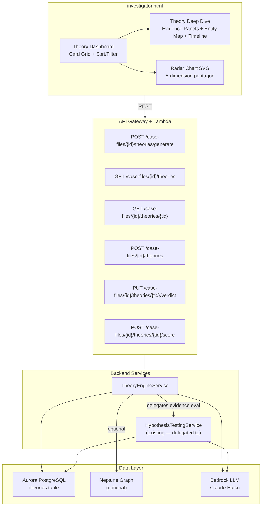

# Design Document: Theory-Driven Investigation Engine

## Overview

This feature introduces a top-down investigative methodology built on the Analysis of Competing Hypotheses (ACH) framework. The core idea: investigators start with theories, the AI finds and scores evidence for/against each theory across 5 dimensions, and investigators resolve theories with verdicts.

The design extends the existing `HypothesisTestingService` rather than rebuilding. A new `TheoryEngineService` delegates evidence decomposition, search, and classification to the existing service, then layers ACH 5-dimension scoring on top. Theories are stored in a new Aurora `theories` table, exposed via 6 REST API endpoints, and rendered in the `investigator.html` frontend as a Theory Dashboard (card grid with radar charts) and Theory Deep Dive (evidence panels, entity map, timeline, verdict controls).

Key design decisions:
- **Delegation over duplication**: TheoryEngineService imports HypothesisTestingService and reuses `_decompose()`, `_search_evidence()`, and `_classify_evidence()` for evidence evaluation
- **Aurora-first with optional Neptune**: All core functionality works with Aurora + Bedrock only; Neptune adds relational context when available
- **Inline SVG rendering**: Radar charts, timelines, and entity badges render as inline SVG in the existing `investigator.html` JavaScript pattern — no external libraries
- **Standardized Theory Case File**: Every theory produces a structured 12-section output format for consistent analysis

## Architecture



## Components and Interfaces

### TheoryEngineService (`src/services/theory_engine_service.py`)

The primary backend service. Extends the existing pattern from `HypothesisTestingService`.

```python
class TheoryEngineService:
    """Generates, scores, stores, and retrieves investigative theories using ACH framework."""

    # ACH dimension weights for Overall_Score computation
    ACH_WEIGHTS = {
        "evidence_consistency": 0.25,
        "evidence_diversity": 0.20,
        "predictive_power": 0.20,
        "contradiction_strength": 0.20,
        "evidence_gaps": 0.15,
    }

    VALID_THEORY_TYPES = {"financial", "temporal", "relational", "behavioral", "structural"}
    VALID_VERDICTS = {"confirmed", "refuted", "inconclusive"}

    def __init__(self, aurora_cm, bedrock_client, hypothesis_svc: HypothesisTestingService,
                 neptune_endpoint: str = "", neptune_port: str = "8182"):
        self._db = aurora_cm
        self._bedrock = bedrock_client
        self._hypothesis_svc = hypothesis_svc  # delegate evidence eval
        self._neptune_endpoint = neptune_endpoint
        self._neptune_port = neptune_port

    def generate_theories(self, case_id: str) -> list[dict]:
        """Scan all case evidence and generate 10-20 ranked theories.
        
        1. Query Aurora for documents, entities, findings, pattern_reports
        2. Optionally query Neptune for relationships, clusters, bridges
        3. Build structured prompt for Bedrock requesting theory generation
        4. Parse response into Theory dicts with title, description, type, initial score
        5. Extract entity names by matching against case entity set
        6. Store each theory in Aurora theories table
        7. Return list of generated theories
        """

    def create_manual_theory(self, case_id: str, title: str, description: str,
                              theory_type: str = None, supporting_entities: list = None) -> dict:
        """Create an investigator-submitted theory.
        
        - If theory_type is None, auto-classify via Bedrock
        - Set initial scores to 50 across all dimensions
        - Extract entities from description matching case entity set
        - Store in Aurora and return the created theory
        """

    def score_theory(self, case_id: str, theory_id: str) -> dict:
        """Score/re-score a theory using ACH 5-dimension framework.
        
        1. Retrieve theory from Aurora
        2. Retrieve all case evidence (documents, findings) from Aurora
        3. Delegate to HypothesisTestingService._classify_evidence() for each evidence passage
        4. Prompt Bedrock for each ACH dimension score
        5. Compute overall_score as weighted average, clamped 0-100
        6. Update theories table with new scores and scored_at timestamp
        7. Return updated theory with evidence classifications
        """

    def get_theories(self, case_id: str) -> list[dict]:
        """List all theories for a case, sorted by overall_score descending."""

    def get_theory_detail(self, case_id: str, theory_id: str) -> dict:
        """Get full theory detail including classified evidence passages and evidence gaps."""

    def set_verdict(self, case_id: str, theory_id: str, verdict: str) -> dict:
        """Set investigator verdict (confirmed/refuted/inconclusive) on a theory."""

    def mark_theories_stale(self, case_id: str) -> int:
        """Mark all theories for a case as stale (scored_at = NULL). Called on new evidence ingestion."""

    def compute_theory_maturity(self, case_id: str) -> int:
        """Compute theory maturity score: (theories with verdict / total theories) * 100."""

    # --- Internal methods ---

    def _gather_case_context(self, case_id: str) -> dict:
        """Gather documents, entities, findings, patterns from Aurora. Optionally Neptune."""

    def _query_neptune(self, case_id: str) -> dict:
        """Query Neptune for entity relationships, clusters, bridges. Returns empty dict on failure."""

    def _score_dimension(self, theory: dict, evidence: list, dimension: str) -> int:
        """Prompt Bedrock to score a single ACH dimension. Returns 0-100."""

    def _compute_overall_score(self, dimensions: dict) -> int:
        """Weighted average of 5 dimensions, clamped to int 0-100."""

    def _classify_theory_type(self, description: str) -> str:
        """Use Bedrock to classify a theory description into a Theory_Type."""

    def _extract_entities(self, case_id: str, text: str) -> list[str]:
        """Match entity names from text against case's entity set in Aurora."""

    def _generate_evidence_gaps(self, theory: dict, evidence: list) -> list[dict]:
        """Prompt Bedrock to identify missing evidence with suggested search queries."""
```

### Delegation to HypothesisTestingService

The `TheoryEngineService` reuses the existing service for evidence work:

| TheoryEngineService method | Delegates to HypothesisTestingService |
|---|---|
| `score_theory()` — evidence classification | `_classify_evidence(claim, evidence)` |
| `score_theory()` — evidence search | `_search_evidence(case_id, claim)` |
| `generate_theories()` — claim decomposition | `_decompose(hypothesis)` |

The existing `_classify_evidence()` returns `{status, confidence, supporting, contradicting, gaps}` which maps directly to the ACH evidence evaluation needs. TheoryEngineService adds the 5-dimension scoring layer on top.

### ACH Scoring Algorithm

```python
def _compute_overall_score(self, dimensions: dict) -> int:
    """Weighted average of ACH dimensions, clamped to 0-100.
    
    dimensions = {
        "evidence_consistency": 75,
        "evidence_diversity": 60,
        "predictive_power": 45,
        "contradiction_strength": 80,  # high = weak contradictions (good)
        "evidence_gaps": 70,           # high = few gaps (good)
    }
    """
    total = sum(
        dimensions[dim] * weight
        for dim, weight in self.ACH_WEIGHTS.items()
    )
    return max(0, min(100, int(round(total))))
```

Weights rationale:
- Evidence Consistency (0.25): Most important — does evidence actually support the theory?
- Evidence Diversity (0.20): Multiple independent sources strengthen a theory
- Predictive Power (0.20): Unique explanatory value distinguishes strong theories
- Contradiction Strength (0.20): Weak contradictions are favorable
- Evidence Gaps (0.15): Completeness matters but less than positive evidence

### Theory API Handler (`src/lambdas/api/theory_handler.py`)

Follows the existing dispatch pattern from `assessment.py`:

```python
def dispatch_handler(event, context):
    """Route theory API requests."""
    method = event.get("httpMethod", "")
    resource = event.get("resource", "")

    if method == "OPTIONS":
        return {"statusCode": 200, "headers": CORS_HEADERS, "body": ""}

    routes = {
        ("POST", "/case-files/{id}/theories/generate"): generate_theories_handler,
        ("GET", "/case-files/{id}/theories"): list_theories_handler,
        ("GET", "/case-files/{id}/theories/{theory_id}"): get_theory_handler,
        ("POST", "/case-files/{id}/theories"): create_theory_handler,
        ("PUT", "/case-files/{id}/theories/{theory_id}/verdict"): set_verdict_handler,
        ("POST", "/case-files/{id}/theories/{theory_id}/score"): score_theory_handler,
    }

    handler = routes.get((method, resource))
    if handler:
        return handler(event, context)
    return error_response(404, "NOT_FOUND", f"No handler for {method} {resource}", event)


def _build_theory_engine_service():
    """Construct TheoryEngineService with dependencies."""
    aurora_cm = ConnectionManager()
    bedrock_client = boto3.client("bedrock-runtime")
    hypothesis_svc = HypothesisTestingService(
        aurora_cm=aurora_cm, bedrock_client=bedrock_client,
        search_fn=_build_search_fn(aurora_cm), graph_fn=None,
    )
    return TheoryEngineService(
        aurora_cm=aurora_cm, bedrock_client=bedrock_client,
        hypothesis_svc=hypothesis_svc,
        neptune_endpoint=os.environ.get("NEPTUNE_ENDPOINT", ""),
        neptune_port=os.environ.get("NEPTUNE_PORT", "8182"),
    )
```

### API Endpoint Specifications

| Endpoint | Method | Request Body | Success Response | Error Responses |
|---|---|---|---|---|
| `/case-files/{id}/theories/generate` | POST | — | `200 {theories: [...], message: ""}` | `200` empty if no evidence, `500` on Bedrock failure |
| `/case-files/{id}/theories` | GET | — | `200 {theories: [...]}` sorted by score desc | — |
| `/case-files/{id}/theories/{tid}` | GET | — | `200 {theory: {...}, evidence: {...}, evidence_gaps: [...]}` | `404` if not found |
| `/case-files/{id}/theories` | POST | `{title, description, theory_type?, supporting_entities?}` | `200 {theory: {...}}` | `400` if title/description missing |
| `/case-files/{id}/theories/{tid}/verdict` | PUT | `{verdict: "confirmed"|"refuted"|"inconclusive"}` | `200 {theory: {...}}` | `400` invalid verdict, `404` not found |
| `/case-files/{id}/theories/{tid}/score` | POST | — | `200 {theory: {...}}` with updated scores | `404` not found, `500` on Bedrock failure |


### Frontend Components (investigator.html)

All rendering is inline JavaScript within the existing `investigator.html` SPA. No external libraries.

#### Key Frontend Functions

```javascript
// Theory Dashboard rendering
function renderTheoryDashboard(theories)     // Renders card grid with sort/filter controls
function renderTheoryCard(theory)            // Single card: title, summary, radar, score, entities
function renderRadarChart(dimensions, color) // Inline SVG pentagon chart (80x80px)
function getScoreColor(score)                // Returns #48bb78 (≥70), #f6ad55 (40-69), #fc8181 (<40)

// Theory Deep Dive
function openTheoryDeepDive(theoryId)        // Fetches detail, renders overlay
function renderSupportingEvidence(evidence)  // Evidence panel with relevance scores
function renderContradictingEvidence(evidence) // Red-bordered evidence panel
function renderEvidenceGaps(gaps)            // Gap cards with search query links
function renderTheoryEntityMap(entities)     // Entity badges with DrillDown links
function renderTheoryTimeline(evidence)      // Horizontal SVG timeline with markers

// Sort and Filter
function sortTheories(theories, sortBy)      // Client-side sort
function filterTheories(theories, filters)   // Client-side filter by type, score range

// Actions
function generateTheories(caseId)            // POST /theories/generate + loading state
function addManualTheory(caseId, data)       // POST /theories
function setTheoryVerdict(caseId, tid, v)    // PUT /theories/{tid}/verdict
function rescoreTheory(caseId, tid)          // POST /theories/{tid}/score

// Integration helpers
function getTheoriesForEntities(entities)    // Find theories with overlapping entities
function highlightTheoryEntities(entities)   // Glow animation on Knowledge Graph nodes
function computeTheoryMaturity(theories)     // (with verdict / total) * 100
```

#### Radar Chart SVG Rendering

The radar chart renders a pentagon with 5 vertices at angles 0°, 72°, 144°, 216°, 288° (starting from top). Each vertex position is scaled by the dimension score (0-100 maps to center-to-vertex distance).

```javascript
function renderRadarChart(dimensions, color) {
    const size = 80, cx = 40, cy = 40, r = 35;
    const dims = ['evidence_consistency', 'evidence_diversity', 'predictive_power',
                  'contradiction_strength', 'evidence_gaps'];
    const angles = dims.map((_, i) => (Math.PI * 2 * i / 5) - Math.PI / 2);

    // Background pentagon at 100% boundary
    const bgPoints = angles.map(a => `${cx + r * Math.cos(a)},${cy + r * Math.sin(a)}`).join(' ');

    // Data polygon scaled by scores
    const dataPoints = dims.map((d, i) => {
        const scale = (dimensions[d] || 0) / 100;
        return `${cx + r * scale * Math.cos(angles[i])},${cy + r * scale * Math.sin(angles[i])}`;
    }).join(' ');

    return `<svg width="${size}" height="${size}" viewBox="0 0 ${size} ${size}">
        <polygon points="${bgPoints}" fill="none" stroke="#2d3748" stroke-width="1"/>
        <polygon points="${dataPoints}" fill="${color}" fill-opacity="0.3" stroke="${color}" stroke-width="1.5"/>
    </svg>`;
}
```

#### Theory Case File Format (12-Section Template)

Every theory produces a standardized output when viewed in detail:

1. **Theory Statement** — Title and full description
2. **Classification** — Theory_Type with rationale
3. **ACH Scorecard** — 5-dimension radar chart with numeric scores
4. **Evidence For** — Supporting documents with citations and relevance scores
5. **Evidence Against** — Contradicting documents with explanations
6. **Evidence Gaps** — Missing evidence with suggested search queries
7. **Key Entities** — People, organizations, locations linked to the theory
8. **Timeline** — Chronological evidence markers (SVG)
9. **Competing Theories** — Other theories explaining the same evidence
10. **Investigator Assessment** — Verdict (confirmed/refuted/inconclusive) with notes
11. **Recommended Actions** — Subpoenas, interviews, searches suggested by AI
12. **Confidence Level** — Overall_Score with justification narrative

### Integration Points

| Existing Feature | Integration | Implementation |
|---|---|---|
| Did You Know | Theory badge on discovery cards | `getTheoriesForEntities(discovery.entities)` → render "📐 N theories" badge |
| Anomaly Radar | Theory badge on anomaly cards | Same entity overlap check as Did You Know |
| Knowledge Graph | Entity highlighting | `highlightTheoryEntities()` uses existing glow animation from Top 5 Patterns |
| Research Hub Chat | Pre-populated context | "Research This Theory" button populates chat input with theory context |
| Case Health Bar | Theory Maturity gauge | 6th Mini_Gauge: `computeTheoryMaturity()` |
| Intelligence Search | Evidence gap queries | Click gap → populate search input and trigger search |
| Research Notebook | Save assessment | "Save Assessment" button creates findings entry |

## Data Models

### Aurora Schema — `theories` Table

```sql
CREATE TABLE theories (
    theory_id UUID PRIMARY KEY DEFAULT gen_random_uuid(),
    case_file_id UUID NOT NULL REFERENCES case_files(case_id) ON DELETE CASCADE,
    title VARCHAR(255) NOT NULL,
    description TEXT NOT NULL,
    theory_type VARCHAR(20) NOT NULL
        CHECK (theory_type IN ('financial', 'temporal', 'relational', 'behavioral', 'structural')),
    overall_score INTEGER NOT NULL DEFAULT 50
        CHECK (overall_score >= 0 AND overall_score <= 100),
    evidence_consistency INTEGER NOT NULL DEFAULT 50
        CHECK (evidence_consistency >= 0 AND evidence_consistency <= 100),
    evidence_diversity INTEGER NOT NULL DEFAULT 50
        CHECK (evidence_diversity >= 0 AND evidence_diversity <= 100),
    predictive_power INTEGER NOT NULL DEFAULT 50
        CHECK (predictive_power >= 0 AND predictive_power <= 100),
    contradiction_strength INTEGER NOT NULL DEFAULT 50
        CHECK (contradiction_strength >= 0 AND contradiction_strength <= 100),
    evidence_gaps INTEGER NOT NULL DEFAULT 50
        CHECK (evidence_gaps >= 0 AND evidence_gaps <= 100),
    supporting_entities JSONB NOT NULL DEFAULT '[]',
    evidence_count INTEGER NOT NULL DEFAULT 0,
    verdict VARCHAR(20)
        CHECK (verdict IS NULL OR verdict IN ('confirmed', 'refuted', 'inconclusive')),
    created_by VARCHAR(50) NOT NULL DEFAULT 'ai',
    created_at TIMESTAMP WITH TIME ZONE DEFAULT NOW(),
    scored_at TIMESTAMP WITH TIME ZONE
);

CREATE INDEX idx_theories_case ON theories(case_file_id);
CREATE INDEX idx_theories_score ON theories(overall_score);
```

### Theory Dict (Python runtime representation)

```python
{
    "theory_id": "uuid-string",
    "case_file_id": "uuid-string",
    "title": "Financial transfers between Entity A and Entity B suggest money laundering",
    "description": "Evidence shows a pattern of...",
    "theory_type": "financial",
    "overall_score": 72,
    "evidence_consistency": 80,
    "evidence_diversity": 65,
    "predictive_power": 70,
    "contradiction_strength": 75,
    "evidence_gaps": 60,
    "supporting_entities": ["Entity A", "Entity B", "Bank C"],
    "evidence_count": 14,
    "verdict": None,  # or "confirmed" / "refuted" / "inconclusive"
    "created_by": "ai",  # or "investigator"
    "created_at": "2024-01-15T10:30:00Z",
    "scored_at": "2024-01-15T10:31:00Z",
}
```

### Theory Detail Response (GET /theories/{tid})

Extends the base theory dict with evidence classifications:

```python
{
    # ... all base theory fields ...
    "evidence": {
        "supporting": [
            {"text": "...", "filename": "doc1.pdf", "relevance": 85, "entities": ["Entity A"]},
        ],
        "contradicting": [
            {"text": "...", "filename": "doc2.pdf", "relevance": 70, "explanation": "This contradicts because..."},
        ],
        "neutral": [
            {"text": "...", "filename": "doc3.pdf", "relevance": 30},
        ],
    },
    "evidence_gaps": [
        {"description": "No financial records from 2019-2020", "search_query": "financial records 2019 2020 Entity A"},
    ],
    "competing_theories": [
        {"theory_id": "uuid", "title": "...", "overall_score": 65},
    ],
}
```


## Correctness Properties

*A property is a characteristic or behavior that should hold true across all valid executions of a system — essentially, a formal statement about what the system should do. Properties serve as the bridge between human-readable specifications and machine-verifiable correctness guarantees.*

### Property 1: Theory Structural Invariants

*For any* generated theory dict, the theory SHALL have: a title under 120 characters, a non-empty description, a `theory_type` in `{financial, temporal, relational, behavioral, structural}`, an `overall_score` integer in range 0-100, a `supporting_entities` list, and an integer `evidence_count` >= 0.

**Validates: Requirements 2.2, 2.3, 2.4**

### Property 2: Entity Extraction Subset

*For any* theory description text and any case entity set, the result of `_extract_entities(case_id, text)` SHALL be a subset of the case's entity set in Aurora — no extracted entity name should be absent from the case's known entities.

**Validates: Requirements 2.5, 4.4**

### Property 3: Manual Theory Defaults

*For any* valid title and description, `create_manual_theory()` SHALL produce a theory with `created_by == "investigator"`, `overall_score == 50`, and all five ACH dimension scores (`evidence_consistency`, `evidence_diversity`, `predictive_power`, `contradiction_strength`, `evidence_gaps`) equal to 50.

**Validates: Requirements 4.1, 4.3**

### Property 4: Overall Score Weighted Average

*For any* five ACH dimension scores each in range 0-100, `_compute_overall_score()` SHALL return an integer equal to `round(ec*0.25 + ed*0.20 + pp*0.20 + cs*0.20 + eg*0.15)` clamped to the range 0-100, where ec=evidence_consistency, ed=evidence_diversity, pp=predictive_power, cs=contradiction_strength, eg=evidence_gaps.

**Validates: Requirements 5.6**

### Property 5: Evidence Count Equals Supporting Plus Contradicting

*For any* list of classified evidence passages where each passage has a classification in `{supporting, contradicting, neutral}`, the computed `evidence_count` SHALL equal the number of passages classified as `supporting` plus the number classified as `contradicting`.

**Validates: Requirements 6.5**

### Property 6: Score-to-Color Mapping

*For any* integer score in range 0-100, `getScoreColor(score)` SHALL return `#48bb78` (green) when score >= 70, `#f6ad55` (amber) when 40 <= score <= 69, and `#fc8181` (red) when score < 40. The function SHALL be total — every valid score maps to exactly one color.

**Validates: Requirements 8.3**

### Property 7: Score Filter Correctness

*For any* list of theories and any minimum score threshold (integer 0-100), filtering theories by minimum score SHALL return a list where every theory has `overall_score >= threshold`, and no theory from the original list with `overall_score >= threshold` is excluded.

**Validates: Requirements 9.3**

### Property 8: Timeline Chronological Ordering

*For any* list of evidence items with `indexed_date` fields, the rendered timeline markers SHALL appear in ascending chronological order — for all consecutive pairs of markers (m_i, m_{i+1}), `m_i.date <= m_{i+1}.date`.

**Validates: Requirements 16.1**

### Property 9: Theory Maturity Computation

*For any* list of theories (possibly empty), `computeTheoryMaturity()` SHALL return `floor((count of theories where verdict is not null / total count of theories) * 100)` clamped to integer 0-100. When the list is empty, the result SHALL be 0.

**Validates: Requirements 26.2, 26.3**

### Property 10: Radar Chart Points Within SVG Bounds

*For any* five ACH dimension scores each in range 0-100, the radar chart polygon points computed by `renderRadarChart()` SHALL all have x-coordinates in [0, 80] and y-coordinates in [0, 80], and each point's distance from center (40, 40) SHALL be proportional to its dimension score divided by 100 times the radius (35).

**Validates: Requirements 28.2**

## Error Handling

| Scenario | Behavior | Response |
|---|---|---|
| Neptune unavailable during generation | Proceed with Aurora-only data, log warning | Theories generated without relational context |
| Neptune unavailable during scoring | Score with Aurora evidence only | Scores reflect document evidence without graph context |
| Bedrock invocation fails during generation | Return 500 with error message | `{"error": "BEDROCK_ERROR", "message": "..."}` |
| Bedrock invocation fails during scoring | Retain existing scores, return error | `{"error": "SCORING_FAILED", "message": "..."}` with current scores preserved |
| Theory not found (GET/PUT/POST score) | Return 404 | `{"error": "NOT_FOUND", "message": "Theory {id} not found"}` |
| Missing title or description on create | Return 400 | `{"error": "VALIDATION_ERROR", "message": "Title and description are required"}` |
| Invalid verdict value | Return 400 | `{"error": "VALIDATION_ERROR", "message": "Verdict must be confirmed, refuted, or inconclusive"}` |
| Case has no documents/entities for generation | Return 200 with empty list | `{"theories": [], "message": "Insufficient evidence to generate theories"}` |
| Unexpected server error | Return 500, display retry button in UI | `{"error": "INTERNAL_ERROR", "message": "..."}` |
| Aurora connection failure | Return 500 | `{"error": "DATABASE_ERROR", "message": "..."}` |

## Testing Strategy

### Property-Based Tests (Hypothesis library)

Each correctness property maps to a property-based test with minimum 100 iterations. The project uses Python, so we use the `hypothesis` library.

| Property | Test File | Generator Strategy |
|---|---|---|
| P1: Theory structural invariants | `tests/test_theory_engine_properties.py` | Generate random theory dicts with `st.text()`, `st.integers(0, 100)`, `st.sampled_from(VALID_TYPES)` |
| P2: Entity extraction subset | `tests/test_theory_engine_properties.py` | Generate random text containing random entity names from a generated entity set |
| P3: Manual theory defaults | `tests/test_theory_engine_properties.py` | Generate random titles and descriptions via `st.text(min_size=1)` |
| P4: Overall score weighted average | `tests/test_theory_engine_properties.py` | Generate 5 random integers 0-100 via `st.integers(0, 100)` |
| P5: Evidence count computation | `tests/test_theory_engine_properties.py` | Generate random lists of evidence with `st.sampled_from(["supporting", "contradicting", "neutral"])` |
| P6: Score-to-color mapping | `tests/test_theory_engine_properties.py` | Generate random integers 0-100 |
| P7: Score filter correctness | `tests/test_theory_engine_properties.py` | Generate random theory lists with random scores, random threshold |
| P8: Timeline chronological ordering | `tests/test_theory_engine_properties.py` | Generate random lists of evidence with random dates |
| P9: Theory maturity computation | `tests/test_theory_engine_properties.py` | Generate random theory lists with random verdict states (None or valid verdict) |
| P10: Radar chart points within bounds | `tests/test_theory_engine_properties.py` | Generate 5 random integers 0-100 for dimension scores |

Each test tagged: `# Feature: theory-driven-investigation, Property N: {property_text}`

### Unit Tests (pytest)

Focus on specific examples and edge cases not covered by property tests:

- Theory generation with empty case (no documents/entities)
- Neptune unavailable degradation path
- Bedrock failure during generation and scoring
- API endpoint routing (dispatch_handler)
- Verdict validation (invalid values)
- Create validation (missing title/description)
- Stale theory marking on new evidence ingestion
- Theory detail response structure with evidence panels
- Empty state rendering (zero theories)
- Color coding boundary values (exactly 40, exactly 70)

### Integration Tests

- Full theory generation flow: create case → ingest documents → generate theories → verify stored in Aurora
- Score → re-score flow: generate → score → ingest new evidence → verify stale → re-score
- API endpoint integration: each of the 6 endpoints with real service (mocked Bedrock)
- HypothesisTestingService delegation: verify TheoryEngineService correctly calls existing service methods

