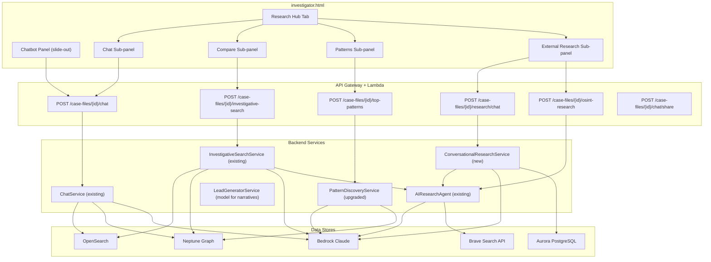

# Design Document: Unified Research Hub

## Overview

The Unified Research Hub consolidates four investigative capabilities into a single "Research Hub" tab within `investigator.html`: an embedded chatbot panel, a compare mode for internal-vs-external evidence, narrative-driven pattern intelligence, and conversational external research. The design reuses existing backend services (ChatService, InvestigativeSearchService, AIResearchAgent, PatternDiscoveryService) and introduces one new service (ConversationalResearchService) plus a single new API endpoint.

### Design Rationale

- **Reuse over rebuild**: ChatService, InvestigativeSearchService, and AIResearchAgent are production-proven. The hub wraps them with thin UI and one new orchestration layer.
- **Single new endpoint**: Only `POST /case-files/{id}/research/chat` is new. All other API calls go through existing routes.
- **Frontend-only tab integration**: The Research Hub is a new tab in the existing `switchTab()` system with four sub-panels rendered as inline divs.
- **Narrative upgrade is surgical**: Only `PatternDiscoveryService._synthesize_questions` changes — the scoring, merging, and caching logic stays intact.

## Architecture



## Components and Interfaces

### 1. Chatbot Slide-Out Panel (Frontend)

Reuses the JS logic from `chatbot.html` embedded as a fixed-position overlay in `investigator.html`.

**Existing elements already in investigator.html**: The `.chatbot-toggle`, `.chatbot-panel`, `.chat-messages`, `.chat-input-row` CSS classes and the chatbot toggle button are already defined in the current `investigator.html` styles. The implementation wires these to the existing `POST /case-files/{id}/chat` endpoint.

**Interface**:
- Toggle button: fixed bottom-right, opens/closes 400px right panel
- Auto-binds to `selectedCaseId` global variable
- Maintains `conversationId` across messages
- Renders citations as `[Source N]` links
- Renders `suggested_actions` as clickable buttons
- "Share Finding" button calls `POST /case-files/{id}/chat/share`
- Command hint bar at bottom

### 2. Research Hub Tab (Frontend)

A new tab added to the `.tabs` bar in `investigator.html` with four sub-panels.

**Tab registration**:
- Add `'researchhub'` to the `allTabs` array in `switchTab()`
- Add `<div id="tab-researchhub">` with sub-navigation buttons
- Sub-panels: `rh-chat`, `rh-compare`, `rh-patterns`, `rh-research`
- State preserved per sub-panel via JS objects (not re-fetched on sub-tab switch)
- Lazy-load: data fetched only when Research Hub tab is activated

**Sub-panel switching**:
```javascript
function switchResearchPanel(panel) {
    ['rh-chat','rh-compare','rh-patterns','rh-research'].forEach(p => {
        document.getElementById(p).style.display = (p === panel) ? 'block' : 'none';
    });
}
```

### 3. Compare View (Frontend)

Split-pane layout within `rh-compare` sub-panel.

**Interface**:
- Search input + "Compare" button
- Calls `POST /case-files/{id}/investigative-search` with `search_scope: "internal_external"`
- Left pane: "What We Have" (internal evidence)
- Right pane: "What's Public" (external research)
- Color-coded findings from `cross_reference_report`:
  - Green (`.xref-confirmed`): `confirmed_internally`
  - Orange (`.xref-external`): `external_only`
  - Red (`.xref-needs-research`): `needs_research`
- Confidence badge from `confidence_level` field
- Executive summary banner from `executive_summary`
- "Research Internally" button on `external_only` items → opens Evidence Library search
- "Start Research" button on `needs_research` items → opens Research Conversation

### 4. Narrative Pattern Cards (Frontend + Backend Upgrade)

**Frontend**: Cards in `rh-patterns` sub-panel displaying narrative-driven pattern intelligence.

Each card shows:
- Investigative question (headline)
- Narrative explanation (body text)
- Confidence indicator (progress bar)
- Supporting entities (tags)
- Modality badges (text, visual, face, co-occurrence)
- Click → opens entity drill-down for primary entity

**Backend upgrade** (`PatternDiscoveryService._synthesize_questions`):

Replace the current prompt with a narrative-focused prompt modeled after `LeadGeneratorService.INVESTIGATOR_PERSONA`:

```python
NARRATIVE_SYNTHESIS_PROMPT = """You are a senior federal investigative analyst with 20+ years of experience
in complex multi-jurisdictional investigations.

For each pattern below, generate:
1. An investigative question (1 sentence)
2. A narrative explanation (3-5 sentences) that explains WHY this pattern matters
   investigatively — not graph statistics. Describe relationship context, gaps,
   anomalies, and what an investigator should do next.
3. A confidence score (0-100)

Cite specific entity names, document counts, and relationship types.
If composite_score < 0.3, include a caveat about low evidence strength.

{pattern_descriptions}

Return ONLY a JSON array where each element has:
- "question": investigative question
- "narrative": investigative narrative explanation
- "confidence": integer 0-100
"""
```

The response dict gains a `"narrative"` field alongside the existing `"question"`, `"confidence"`, `"summary"`, `"modalities"`, etc.

### 5. Research Conversation Panel (Frontend)

Chat interface in `rh-research` sub-panel for conversational external research.

**Interface**:
- Subject selector (entity name + type from case entities)
- "Quick OSINT Report" button → calls existing `POST /case-files/{id}/osint-research`
- "Start Research Conversation" button → initiates multi-turn chat
- Chat message list with AI responses
- Follow-up input field
- "Save to Case" button on each AI message → calls `POST /case-files/{id}/chat/share`
- Error display with retry button on Bedrock failures

### 6. ConversationalResearchService (New Backend)

**File**: `src/services/conversational_research_service.py`

Wraps `AIResearchAgent` with multi-turn conversation state.

```python
class ConversationalResearchService:
    def __init__(self, aurora_cm, bedrock_client, research_agent: AIResearchAgent):
        self._aurora = aurora_cm
        self._bedrock = bedrock_client
        self._agent = research_agent

    def start_conversation(self, case_id: str, subject: dict) -> dict:
        """Generate initial OSINT report and create conversation record."""
        # 1. Call AIResearchAgent.research_subject() for initial report
        # 2. Create conversation record in Aurora
        # 3. Return {response, conversation_id, sources, suggested_followups}

    def continue_conversation(self, case_id: str, conversation_id: str,
                               message: str) -> dict:
        """Process follow-up message with prior context."""
        # 1. Load conversation history from Aurora
        # 2. Detect intent: "refine search" → new Brave query
        #                    "drill deeper" → focused deep-dive
        #                    general → contextual follow-up
        # 3. Build prompt with last 10 messages as context
        # 4. Invoke Bedrock Haiku (speed-critical, 29s budget)
        # 5. Append to conversation history in Aurora
        # 6. Return {response, conversation_id, sources, suggested_followups}
```

**Intent detection for follow-ups**:
- `refine|search for|look up` → triggers new `Brave Search API` query via AIResearchAgent
- `drill deeper|more about|expand on` → extracts referenced finding, generates focused report
- Default → contextual Bedrock response using prior conversation as context

### 7. Research Chat API Handler

**File**: `src/lambdas/api/research_chat.py`

**Route**: `POST /case-files/{id}/research/chat`

**Routing integration**: Add to `case_files.py` dispatcher:
```python
if "/research/chat" in path and "/case-files/" in path and method == "POST":
    from lambdas.api.research_chat import research_chat_handler
    return research_chat_handler(event, context)
```

## Data Models

### ResearchConversation (Aurora table)

```sql
CREATE TABLE research_conversations (
    conversation_id UUID PRIMARY KEY DEFAULT gen_random_uuid(),
    case_id UUID NOT NULL REFERENCES case_files(case_id),
    subject_name VARCHAR(500) NOT NULL,
    subject_type VARCHAR(100) DEFAULT 'person',
    messages JSONB NOT NULL DEFAULT '[]',
    research_context JSONB DEFAULT '{}',
    created_at TIMESTAMPTZ NOT NULL DEFAULT NOW(),
    updated_at TIMESTAMPTZ NOT NULL DEFAULT NOW()
);

CREATE INDEX idx_research_conv_case ON research_conversations(case_id);
```

**messages JSONB structure**:
```json
[
  {"role": "assistant", "content": "RESEARCH REPORT: ...", "timestamp": "...", "sources": [...]},
  {"role": "user", "content": "drill deeper into the SEC filings", "timestamp": "..."},
  {"role": "assistant", "content": "Focused analysis of SEC filings...", "timestamp": "...", "sources": [...]}
]
```

### PatternNarrative (extension to existing pattern response)

No new table needed. The narrative is added to the existing `_synthesize_questions` response dict:

```python
{
    "index": 1,
    "question": "Why do A and B appear together but never with C?",
    "narrative": "A and B co-occur in 12 documents spanning 2015-2019, primarily in financial records...",
    "confidence": 78,
    "modalities": ["text", "cooccurrence"],
    "summary": "...",  # kept for backward compatibility
    "entities": [...],
    "composite_score": 0.72,
    "document_count": 12,
    "image_count": 0,
    "raw_pattern": {...}
}
```

### API Request/Response Schemas

**POST /case-files/{id}/research/chat — Request**:
```json
{
    "message": "string (required)",
    "conversation_id": "uuid (optional — omit for new conversation)",
    "subject": {
        "name": "string (required)",
        "type": "string (default: person)"
    }
}
```

**POST /case-files/{id}/research/chat — Response**:
```json
{
    "response": "string — AI-generated research text",
    "conversation_id": "uuid",
    "sources": [
        {"title": "string", "url": "string", "snippet": "string"}
    ],
    "suggested_followups": [
        "Drill deeper into SEC filings",
        "Search for related corporate entities",
        "Compare with internal evidence"
    ]
}
```

**Error Response (500)**:
```json
{
    "error_code": "RESEARCH_FAILED",
    "message": "Bedrock invocation failed: ..."
}
```


## Correctness Properties

*A property is a characteristic or behavior that should hold true across all valid executions of a system — essentially, a formal statement about what the system should do. Properties serve as the bridge between human-readable specifications and machine-verifiable correctness guarantees.*

### Property 1: Chat API case binding

*For any* selected case ID and any non-empty message string, sending a chat message from the Chatbot Panel SHALL produce an API call to `POST /case-files/{case_id}/chat` where the path contains the currently selected case ID and the body contains the message text.

**Validates: Requirements 1.3, 1.4**

### Property 2: Citation link rendering

*For any* ChatService response containing N `[Source K]` references (where K is 1-indexed), the Chatbot Panel SHALL render exactly N clickable citation link elements, each displaying the corresponding document name from the citations array.

**Validates: Requirements 1.5**

### Property 3: Suggested action button rendering

*For any* ChatService response containing a `suggested_actions` array of length N, the Chatbot Panel SHALL render exactly N clickable buttons whose text matches the suggested action strings.

**Validates: Requirements 1.7**

### Property 4: Cross-reference category color mapping

*For any* cross-reference finding with a `category` field, the Compare View SHALL apply the CSS class `xref-confirmed` (green) for `confirmed_internally`, `xref-external` (orange) for `external_only`, and `xref-needs-research` (red) for `needs_research`. No other category values shall produce a color mapping.

**Validates: Requirements 2.3, 2.4, 2.5, 2.6**

### Property 5: Compare mode search scope

*For any* search query submitted in Compare Mode, the API call to `POST /case-files/{id}/investigative-search` SHALL include `search_scope: "internal_external"` in the request body.

**Validates: Requirements 2.2**

### Property 6: Narrative synthesis output structure

*For any* list of top patterns passed to `_synthesize_questions`, each element in the returned list SHALL contain a non-empty `narrative` field and a non-empty `question` field, and the `narrative` SHALL reference at least one entity name from the corresponding pattern's `entities` list.

**Validates: Requirements 3.1, 3.2, 3.6**

### Property 7: Multi-modal evidence in synthesis prompt

*For any* pattern with K distinct modalities (where K ≥ 1), the Bedrock synthesis prompt SHALL contain string references to all K modality types present in the pattern.

**Validates: Requirements 3.4**

### Property 8: Low-score caveat inclusion

*For any* pattern with `composite_score < 0.3`, the synthesis prompt or the resulting narrative SHALL include a caveat indicating low evidence strength.

**Validates: Requirements 3.5**

### Property 9: Conversation context window bound

*For any* research conversation with N total messages (where N > 10), the Bedrock invocation for a new follow-up SHALL include exactly the last 10 messages as context, not all N messages.

**Validates: Requirements 4.6**

### Property 10: Follow-up context inclusion

*For any* follow-up message in an active research conversation, the Bedrock prompt SHALL include content from the prior research report (first message) and the follow-up query text.

**Validates: Requirements 4.4, 4.5**

### Property 11: Research conversation intent detection

*For any* follow-up message containing the phrases "refine", "search for", or "look up", the ConversationalResearchService SHALL trigger a new external search query. *For any* message containing "drill deeper" or "more about", it SHALL extract the referenced finding and generate a focused report.

**Validates: Requirements 4.7, 4.8**

### Property 12: Research chat API response schema

*For any* valid request to `POST /case-files/{id}/research/chat` (with non-empty `message` and valid `subject`), the response SHALL contain all four fields: `response` (string), `conversation_id` (UUID string), `sources` (array), and `suggested_followups` (array).

**Validates: Requirements 6.1, 6.4**

### Property 13: New conversation initialization

*For any* request to the research chat endpoint without a `conversation_id`, the response SHALL contain a newly generated UUID `conversation_id` and the `response` field SHALL contain the initial OSINT research report text (non-empty).

**Validates: Requirements 6.2**

### Property 14: Sub-panel state reset on case change

*For any* case selection change in the Investigator View sidebar, all Research Hub sub-panel states (active conversations, search results, pattern views) SHALL be cleared, and subsequent data fetches SHALL use the newly selected case ID.

**Validates: Requirements 5.5**

## Error Handling

### Frontend Error Handling

| Scenario | Behavior |
|---|---|
| ChatService API call fails | Display "Connection error — please retry" in chat bubble with retry button |
| InvestigativeSearchService timeout | Display "Search timed out" with retry button in Compare View |
| PatternDiscoveryService returns empty patterns | Display "No patterns discovered yet" empty state in Patterns sub-panel |
| Research chat Bedrock failure | Display error message with retry button per Requirement 4.10 |
| No case selected | Display empty state prompting case selection per Requirement 5.4 |
| Network error on any API call | Show toast notification with error summary, preserve current state |

### Backend Error Handling

| Scenario | Behavior |
|---|---|
| Bedrock invocation timeout | ConversationalResearchService returns partial response with error flag; frontend shows retry |
| Bedrock throttling (429) | Retry once with exponential backoff; if still throttled, return 500 with `RESEARCH_FAILED` |
| Aurora connection failure | Return 500 with `INTERNAL_ERROR`; conversation state may be lost for that turn |
| Brave Search API failure | ConversationalResearchService falls back to Bedrock-only response without fresh search results |
| Invalid conversation_id | Return 404 with `CONVERSATION_NOT_FOUND` |
| Missing required fields | Return 400 with `VALIDATION_ERROR` and list of missing fields |
| 29-second timeout approaching | ConversationalResearchService uses Haiku model exclusively; truncates context if needed |

### PatternDiscoveryService Narrative Fallback

If Bedrock fails during `_synthesize_questions`, the existing `_generate_fallback_questions` method is used (unchanged). The fallback produces template-based questions without narratives. The frontend handles missing `narrative` field gracefully by showing only the `question` and `summary`.

## Testing Strategy

### Unit Tests

- **ConversationalResearchService**: Test `start_conversation` and `continue_conversation` with mocked Aurora and Bedrock. Verify conversation record creation, context loading, intent detection, and response assembly.
- **Research chat handler**: Test request validation (missing message, missing subject, invalid conversation_id), successful routing to ConversationalResearchService, and error response formatting.
- **PatternDiscoveryService._synthesize_questions upgrade**: Test that the new prompt includes the investigator persona, that responses include `narrative` field, and that fallback still works when Bedrock fails.
- **Frontend rendering functions**: Test cross-reference color mapping, citation link generation, suggested action button generation, and pattern card rendering with mock data.

### Property-Based Tests

Property-based testing applies to this feature for the backend logic components:

- **Library**: `hypothesis` (Python)
- **Minimum iterations**: 100 per property
- **Tag format**: `Feature: unified-research-hub, Property {N}: {title}`

Key properties to implement as PBT:
- Property 4 (cross-reference color mapping) — generate random findings with random categories, verify correct CSS class
- Property 6 (narrative output structure) — generate random pattern lists, verify narrative and entity reference presence
- Property 8 (low-score caveat) — generate patterns with random composite_scores, verify caveat for scores < 0.3
- Property 9 (context window bound) — generate conversations with random lengths, verify 10-message cap
- Property 11 (intent detection) — generate random messages with/without intent keywords, verify correct action
- Property 12 (API response schema) — generate random valid requests, verify response contains all required fields
- Property 13 (new conversation initialization) — generate random subjects, verify new conversation_id and non-empty response

### Integration Tests

- End-to-end test: Research Hub tab renders with four sub-panels when a case is selected
- End-to-end test: Chatbot panel opens/closes and sends messages to ChatService
- End-to-end test: Compare Mode calls InvestigativeSearchService with `internal_external` scope
- End-to-end test: Research conversation creates Aurora record and returns valid response
- End-to-end test: Pattern narrative cards render with upgraded narrative content
