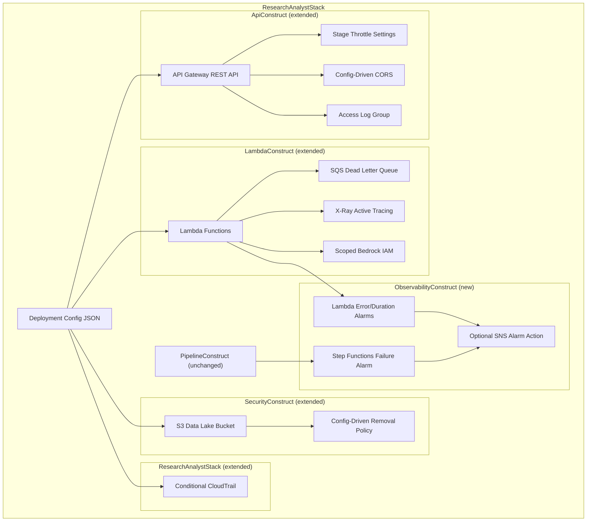

# Design Document: Well-Architected Alignment

## Overview

This design hardens the existing Investigative Intelligence Platform CDK infrastructure to align with the AWS Well-Architected Framework. All changes are config-driven extensions to existing constructs — demo configs remain permissive, production configs get hardened. No existing construct is replaced; each is extended with new optional parameters read from the deployment config JSON.

The changes span four WAF pillars:

- **Reliability**: Lambda DLQs capture silent async failures; API Gateway throttling prevents concurrency exhaustion.
- **Security**: Scoped Bedrock IAM, config-driven CORS, access logging, conditional CloudTrail, config-driven S3 removal policy.
- **Operational Excellence**: CloudWatch alarms on Lambda errors/duration and Step Functions failures; X-Ray tracing on all Lambdas.
- **Performance Efficiency**: API Gateway throttling prevents resource saturation; X-Ray tracing identifies latency bottlenecks.

One new construct is introduced (`ObservabilityConstruct`); all other changes extend existing constructs.

## Architecture



### Change Summary by File

| File | Change Type | Requirements |
|------|-------------|-------------|
| `api_construct.py` | Extend | 1, 2, 8 |
| `lambda_construct.py` | Extend | 3, 4, 7 |
| `security_construct.py` | Extend | 6 |
| `observability_construct.py` | New | 5 |
| `research_analyst_stack.py` | Extend | 5, 9 |
| `__init__.py` | Extend | 5 |
| Deployment config JSONs | Extend | 1–10 |
| `Deployment-Architecture.md` | Extend | 10 |

## Components and Interfaces

### 1. ApiConstruct Extensions (api_construct.py)

**Throttling** (Req 1): Read `config["api"]["throttle_burst_limit"]` and `config["api"]["throttle_rate_limit"]` from the deployment config. Apply them to the existing `deploy_options=apigw.StageOptions(...)` block. Default to burst=100, rate=50 when keys are absent.

```python
api_cfg = config.get("api", {})
burst = api_cfg.get("throttle_burst_limit", 100)
rate = api_cfg.get("throttle_rate_limit", 50)
# Added to existing StageOptions:
#   throttling_burst_limit=burst,
#   throttling_rate_limit=rate,
```

**CORS** (Req 2): Read `config["api"]["cors_allow_origins"]`. If present (list of strings), use it; otherwise default to `Cors.ALL_ORIGINS`.

```python
cors_origins = api_cfg.get("cors_allow_origins", None)
allow_origins = cors_origins if cors_origins else apigw.Cors.ALL_ORIGINS
```

**Access Logging** (Req 8): When `config["api"]["access_logging"]` is `true`, create a `logs.LogGroup` with 90-day retention and wire it into `deploy_options` as `access_log_destination` with `AccessLogFormat.clf()`.

```python
if api_cfg.get("access_logging", False):
    log_group = logs.LogGroup(self, "ApiAccessLogs",
        retention=logs.RetentionDays.THREE_MONTHS)
    # Added to StageOptions:
    #   access_log_destination=apigw.LogGroupLogDestination(log_group),
    #   access_log_format=apigw.AccessLogFormat.clf(),
```

### 2. LambdaConstruct Extensions (lambda_construct.py)

**DLQ** (Req 3): Create a single `sqs.Queue` named `research-analyst-dlq` with 14-day retention. Optionally encrypt with KMS key from `config["encryption"]["kms_key_arn"]`. Pass `dead_letter_queue=dlq` to `_make_lambda` for `case_files` and all ingestion lambdas.

```python
dlq = sqs.Queue(self, "LambdaDLQ",
    queue_name="research-analyst-dlq",
    retention_period=Duration.days(14),
    encryption=sqs.QueueEncryption.KMS if kms_key_arn else sqs.QueueEncryption.SQS_MANAGED,
    encryption_master_key=imported_key if kms_key_arn else None,
)
```

The `_make_lambda` method gains an optional `dead_letter_queue` parameter:

```python
def _make_lambda(self, ..., dead_letter_queue=None):
    return _lambda.Function(...,
        dead_letter_queue=dead_letter_queue,
        tracing=_lambda.Tracing.ACTIVE,  # Req 4
    )
```

**X-Ray Tracing** (Req 4): Add `tracing=_lambda.Tracing.ACTIVE` to every `_lambda.Function` created by `_make_lambda`. This is unconditional — all environments get tracing.

**Scoped Bedrock IAM** (Req 7): Replace the wildcard `foundation-model/*` Bedrock policy with model-specific ARNs when `bedrock.llm_model_id` and `bedrock.embedding_model_id` are present in config. Construct ARNs using `Fn.sub` for partition awareness.

```python
llm_model_id = bedrock_cfg.get("llm_model_id")
embed_model_id = bedrock_cfg.get("embedding_model_id")

if llm_model_id and embed_model_id:
    llm_arn = cdk.Fn.sub(f"arn:${{AWS::Partition}}:bedrock:${{AWS::Region}}::foundation-model/{llm_model_id}")
    embed_arn = cdk.Fn.sub(f"arn:${{AWS::Partition}}:bedrock:${{AWS::Region}}::foundation-model/{embed_model_id}")
    # Grant InvokeModel on llm_arn to extract, case_files
    # Grant InvokeModel on embed_arn to embed, case_files
    # Grant InvokeModelWithResponseStream on llm_arn to case_files
else:
    # Fallback to existing wildcard policy
```

### 3. SecurityConstruct Extensions (security_construct.py)

**Config-Driven Removal Policy** (Req 6): Read `config["s3"]["removal_policy"]`. When `"RETAIN"`, set `removal_policy=RemovalPolicy.RETAIN` and `auto_delete_objects=False`. Otherwise keep existing `DESTROY` behavior.

```python
s3_cfg = config.get("s3", {})
removal = s3_cfg.get("removal_policy", "DESTROY")
if removal == "RETAIN":
    removal_policy = RemovalPolicy.RETAIN
    auto_delete = False
else:
    removal_policy = RemovalPolicy.DESTROY
    auto_delete = True
```

### 4. ObservabilityConstruct (new: observability_construct.py)

New construct accepting Lambda function references and the Step Functions state machine. Creates CloudWatch alarms:

| Alarm | Metric | Statistic | Threshold | Period |
|-------|--------|-----------|-----------|--------|
| `{fn_name}-errors` | `Errors` | Sum | 5 | 5 min |
| `case_files-duration-p95` | `Duration` | p95 | 60000 ms | 5 min |
| `sfn-failures` | `ExecutionsFailed` | Sum | 1 | 5 min |

```python
class ObservabilityConstruct(Construct):
    def __init__(self, scope, id, *, config, lambda_functions, state_machine):
        # Create error alarms for each lambda
        # Create duration alarm for case_files
        # Create SFN failure alarm
        # If config["monitoring"]["alarm_sns_topic_arn"], add SNS action to all
```

### 5. ResearchAnalystStack Extensions (research_analyst_stack.py)

**ObservabilityConstruct wiring** (Req 5): Instantiate `ObservabilityConstruct` after Lambda and Pipeline constructs, passing function references and state machine.

**Conditional CloudTrail** (Req 9): When `config["logging"]["cloudtrail"]` is `true`, create a `cloudtrail.Trail` that logs management events and stores logs in the existing S3 bucket under `cloudtrail/` prefix. Optionally encrypt with KMS.

```python
if config.get("logging", {}).get("cloudtrail", False):
    trail = cloudtrail.Trail(self, "AuditTrail",
        bucket=security.data_bucket,
        s3_key_prefix="cloudtrail",
        is_multi_region_trail=False,
        encryption_key=imported_kms_key if kms_key_arn else None,
    )
```

### 6. Deployment Config Schema Extensions

New config keys added (all optional, backward-compatible):

```json
{
  "api": {
    "throttle_burst_limit": 100,
    "throttle_rate_limit": 50,
    "cors_allow_origins": ["https://app.example.com"],
    "access_logging": true
  },
  "s3": {
    "removal_policy": "RETAIN"
  },
  "monitoring": {
    "alarm_sns_topic_arn": "arn:aws:sns:us-east-1:123456789012:alerts"
  },
  "logging": {
    "cloudtrail": true,
    "vpc_flow_logs": true
  }
}
```

Demo configs get no new keys (all defaults apply — permissive). Production configs get hardened values.

## Data Models

### Deployment Config Schema (extended keys only)

| Key Path | Type | Default | Description |
|----------|------|---------|-------------|
| `api.throttle_burst_limit` | int | 100 | API Gateway stage burst limit |
| `api.throttle_rate_limit` | int | 50 | API Gateway stage steady-state rate |
| `api.cors_allow_origins` | list[str] \| null | null (ALL_ORIGINS) | Allowed CORS origins |
| `api.access_logging` | bool | false | Enable API Gateway access logs |
| `s3.removal_policy` | "RETAIN" \| "DESTROY" | "DESTROY" | S3 bucket removal policy |
| `monitoring.alarm_sns_topic_arn` | str \| null | null | SNS topic ARN for alarm actions |
| `logging.cloudtrail` | bool | false | Enable CloudTrail trail |
| `encryption.kms_key_arn` | str \| null | null | KMS key for DLQ and CloudTrail encryption (existing key, reused) |

### CloudWatch Alarm Definitions

| Alarm ID | Metric Namespace | Metric Name | Statistic | Threshold | Period | Evaluation Periods |
|----------|-----------------|-------------|-----------|-----------|--------|--------------------|
| `{fn}-errors` | AWS/Lambda | Errors | Sum | 5 | 300s | 1 |
| `case-files-duration-p95` | AWS/Lambda | Duration | p95 | 60000 | 300s | 1 |
| `sfn-failures` | AWS/States | ExecutionsFailed | Sum | 1 | 300s | 1 |

### SQS Dead Letter Queue

| Property | Value |
|----------|-------|
| Queue Name | `research-analyst-dlq` |
| Message Retention | 14 days |
| Encryption | KMS (if `encryption.kms_key_arn` set) or SQS-managed |


## Error Handling

### Config Resolution Errors

All new config keys are optional with safe defaults. Missing keys never cause deployment failures:

| Config Key | Missing Behavior |
|------------|-----------------|
| `api.throttle_burst_limit` | Defaults to 100 |
| `api.throttle_rate_limit` | Defaults to 50 |
| `api.cors_allow_origins` | Defaults to `Cors.ALL_ORIGINS` |
| `api.access_logging` | Defaults to `false` (no log group created) |
| `s3.removal_policy` | Defaults to `"DESTROY"` (existing behavior) |
| `monitoring.alarm_sns_topic_arn` | No alarm actions added |
| `logging.cloudtrail` | Defaults to `false` (no trail created) |
| `encryption.kms_key_arn` | SQS-managed encryption for DLQ; no KMS on CloudTrail |

### CDK Synth Failures

- Invalid `kms_key_arn` values will fail at `kms.Key.from_key_arn()` during synth — this is intentional (fail-fast).
- Invalid `cors_allow_origins` (non-list) will fail at CDK validation — caught during `cdk synth`.
- Invalid `s3.removal_policy` values (not `"RETAIN"` or `"DESTROY"`) default to `DESTROY` behavior.

### Runtime Errors

- DLQ captures failed async Lambda invocations. The 14-day retention gives operators time to investigate.
- CloudWatch alarms fire on threshold breach. If no SNS topic is configured, alarms are visible in the CloudWatch console but don't send notifications.
- X-Ray tracing has no failure mode — it's a passive instrumentation layer.

## Testing Strategy

### Why Property-Based Testing Does Not Apply

This feature is entirely Infrastructure as Code (CDK constructs) and documentation. All acceptance criteria test declarative CloudFormation template output based on deterministic config input. There are no pure functions, parsers, serializers, or business logic with meaningful input variation. CDK assertion tests with specific config examples are the correct testing approach.

### CDK Assertion Tests (Primary)

Each construct change is tested by synthesizing the stack with specific config inputs and asserting on the resulting CloudFormation template using `aws_cdk.assertions`.

**Test file**: `tests/cdk/test_well_architected.py`

**Test structure**:

```python
from aws_cdk import App, assertions
from infra.cdk.stacks.research_analyst_stack import ResearchAnalystStack

def synth_stack(config_overrides: dict) -> assertions.Template:
    """Helper: merge overrides into base config, synth, return Template."""
    ...

class TestApiThrottling:
    def test_custom_throttle_values(self):
        # Config with api.throttle_burst_limit=200, api.throttle_rate_limit=100
        # Assert StageDescription.ThrottlingBurstLimit == 200
        # Assert StageDescription.ThrottlingRateLimit == 100

    def test_default_throttle_values(self):
        # Config without api.throttle_* keys
        # Assert StageDescription.ThrottlingBurstLimit == 100
        # Assert StageDescription.ThrottlingRateLimit == 50

class TestCorsOrigins:
    def test_custom_cors_origins(self):
        # Config with api.cors_allow_origins=["https://app.example.com"]
        # Assert AllowOrigins contains only specified origin

    def test_default_cors_all_origins(self):
        # Config without api.cors_allow_origins
        # Assert AllowOrigins is ["*"]

class TestLambdaDLQ:
    def test_dlq_created_with_14_day_retention(self):
        # Assert SQS queue with MessageRetentionPeriod=1209600

    def test_lambdas_have_dlq_configured(self):
        # Assert all Lambda functions have DeadLetterConfig

    def test_dlq_kms_encryption(self):
        # Config with encryption.kms_key_arn set
        # Assert KmsMasterKeyId on SQS queue

class TestXRayTracing:
    def test_all_lambdas_have_active_tracing(self):
        # Assert all Lambda resources have TracingConfig.Mode="Active"

class TestObservability:
    def test_lambda_error_alarms(self):
        # Assert CloudWatch alarms for Errors metric on each lambda

    def test_case_files_duration_alarm(self):
        # Assert p95 Duration alarm with 60000ms threshold

    def test_sfn_failure_alarm(self):
        # Assert ExecutionsFailed alarm with threshold 1

    def test_sns_alarm_actions(self):
        # Config with monitoring.alarm_sns_topic_arn
        # Assert AlarmActions on all alarms

class TestS3RemovalPolicy:
    def test_retain_policy(self):
        # Config with s3.removal_policy="RETAIN"
        # Assert DeletionPolicy=Retain, no auto-delete custom resource

    def test_destroy_policy_default(self):
        # Config without s3 config
        # Assert DeletionPolicy=Delete

class TestScopedBedrockIAM:
    def test_scoped_model_arns(self):
        # Assert IAM policies use specific model ARNs, not wildcard

    def test_correct_actions_per_function(self):
        # Assert InvokeModel on extract, embed, case_files
        # Assert InvokeModelWithResponseStream on case_files only

class TestAccessLogging:
    def test_access_logging_enabled(self):
        # Config with api.access_logging=true
        # Assert LogGroup with RetentionInDays=90
        # Assert AccessLogSetting in StageDescription

    def test_access_logging_disabled_by_default(self):
        # Config without api.access_logging
        # Assert no AccessLogSetting

class TestCloudTrail:
    def test_cloudtrail_enabled(self):
        # Config with logging.cloudtrail=true
        # Assert Trail resource with S3KeyPrefix="cloudtrail"

    def test_cloudtrail_disabled_by_default(self):
        # Config without logging.cloudtrail
        # Assert no Trail resource

    def test_cloudtrail_kms_encryption(self):
        # Config with logging.cloudtrail=true and encryption.kms_key_arn
        # Assert KMSKeyId on Trail
```

### Documentation Verification (Manual)

Requirement 10 (Well-Architected documentation) is verified by manual review:
- Section heading exists in `docs/Investigative-Intelligence-Deployment-Architecture.md`
- All six WAF pillar subsections present
- Controls and config keys referenced correctly

### Test Execution

```bash
# Run CDK assertion tests
pytest tests/cdk/test_well_architected.py -v

# Synth check (validates all constructs compile)
cd infra/cdk && cdk synth --no-staging
```
